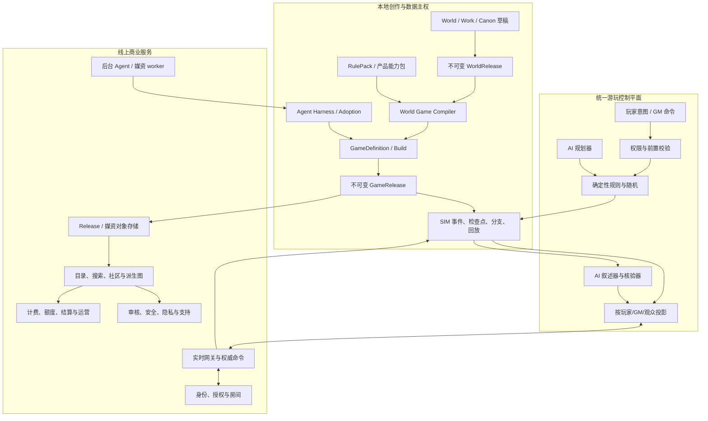

# StoryForge 游戏平台总施工方案

> **TTRPG 状态纠偏（2026-08-21）**：本文顶部原有的 `LOCAL IMPLEMENTATION COMPLETE` 以及下文涉及
> TTRPG 的“已闭合”表述，不能再作为完整跑团产品的完成证明。当前实现只有部分规则、事件、生产和在线合同内核，
> 固定四场景仍是测试夹具，尚未走通世界选择、创作指令、席位/车卡、通用规则与村规、真人/AI 混合桌、可信 AI KP、
> 信息隔离和运行时媒资的完整用户路径。TTRPG 后续唯一权威规格与完成门改为
> [`TTRPG-COMPLETE-PRODUCT-CONSTRUCTION-PLAN-V2.md`](./ttrpg/TTRPG-COMPLETE-PRODUCT-CONSTRUCTION-PLAN-V2.md)。

> 状态：`STATUS UNDER REVALIDATION · TTRPG PRODUCT NOT COMPLETE`
>
> 日期：2026-08-21
>
> 适用范围：世界引擎出口、TTRPG、六类文字游戏、Agent 游戏生产、玩家体验、多人平台、社区与商业化。
>
> 文档定位：本文件是跨体系的总编排方案。它不取代各领域现有详细设计；领域内部实现仍分别以
> [`TTRPG-CAMPAIGN-DESIGN.md`](./TTRPG-CAMPAIGN-DESIGN.md)、[`text-game/*`](./text-game/README.md)、
> [`GAME-PRODUCTION-PIPELINE-DESIGN.md`](./text-game/GAME-PRODUCTION-PIPELINE-DESIGN.md)、
> [`INTERACTIVE-RUNTIME-ROADMAP.md`](./INTERACTIVE-RUNTIME-ROADMAP.md) 和
> [`WORLD-ENGINE-COMMUNITY-ARCHITECTURE.md`](./WORLD-ENGINE-COMMUNITY-ARCHITECTURE.md) 为依据。
>
> 历史施工曾声称仓库内各体系已经闭合；本次审计已否定其中的 TTRPG 产品完成结论。既有测试只能证明部分
> 本地合同与内核，不能证明完整跑团用户路径。其他领域的历史完成声明不在本次 TTRPG 方案中重新裁定；既有
> 证据保留在 [`游戏平台本地实施与验收证据`](./completion/GAME-PLATFORM-LOCAL-IMPLEMENTATION-EVIDENCE-20260821.md)
> 供后续逐项复核，不再直接推导“商业就绪”。

## 0. 最终裁决

StoryForge 的目标不应只是增加一个跑团页面，也不应只是让 Agent 一次生成一份剧情 JSON。最终产品应成为：

> **以世界为源代码、以 GameRelease 为可执行产品、以事件账本为运行真相、以 AI 为受约束导演，并允许作者、GM、
> 玩家和创作者生态共同生产、游玩、演化和发行故事游戏的平台。**

为达到这个目标，后续施工必须同时守住以下决定：

1. `WorldRelease` 是可信素材出口，但不是可执行规则产品；必须增加确定性的游戏编译层。
2. `GAME-PROD-1` 是生产编排层，不是第七种产品；TTRPG 本身则应成为统一 `GameDefinition / GameRelease`
   支持的正式产品类型，不能长期保留“六类游戏走 GameRelease、跑团直接走 WorldRelease”的双轨。
3. 先做一套规则完整、由人类 GM 也能主持的垂直切片，再把 AI GM 接上；不能用 AI 叙述掩盖规则和产品缺失。
4. AI 只能规划、调用工具和叙述；骰子、权限、资源、线索、状态、回合、付款和正式写入由代码裁决。
5. 本地创作继续以浏览器数据为权威；多人房间、后台执行、支付、社区和运营必须进入独立服务端边界。
6. 一个阶段完成的标准是用户主路径、失败恢复、数据生命周期、迁移、真实浏览器证据和旧入口收口全部成立，
   不是“类型已经写了”或“页面已经出现”。
7. 首个商业突破口不是同时做完所有规则和所有游戏，而是先交付两个令人信服的样板：
   - 从一个 WorldRelease 自动生产并发布一款体验完整的短篇视觉文字游戏；
   - 从同一个世界编译出一套规则完整、可以连续游玩的 TTRPG 战役。

## 1. 当前基线、真实缺口与路线纠偏

> 本节记录 2026-08-21 开工前的基线与施工理由，不再代表当前实现状态；当前状态以顶部施工结果和完成证据为准。

### 1.1 可以直接复用的能力

| 领域 | 当前真实能力 | 后续唯一用法 |
|---|---|---|
| 世界来源 | `WorldReleaseManifestV2`、records、portableProject、依赖 hash、不可变发布 | 所有正式生产和实例只绑定明确版本，不读漂移草稿 |
| 游戏发布 | 六类 `GameDefinition / GameRelease` 与不可变 manifest | 扩展而不是复制；TTRPG 也汇入该发布链 |
| 运行时 | SIM Session/Event/Checkpoint/Fork、确定性随机、回放、分支 | 所有互动产品共享，不新增平行存档或骰子引擎 |
| TTRPG 原型 | 场景、检定、遭遇、攻击/伤害、资源、状态、长期摘要/任务/日程 | 作为规则运行内核起点，不把开发表单当产品完成 |
| 文字游戏 | STORYGAME、CHATGAME、TEXTADV、AVG、TEXTSIM、TEXTWORLD 的内容/运行合同 | 保留玩法独立模块，统一生产、发布、存档和证据 |
| Agent | Skill、Run Contract、durable Harness、预算、receipt、候选和 Adoption | 作者生产与运行时 AI 都走登记入口，不在组件直连 |
| 媒资 | AVG 图片/音频元数据、Blob、Cue、发布冻结、缺失降级 | 生产期 artifact 经整包采用后才进入正式媒资 |
| 治理 | `CONTEXT_SOURCES`、`FIELD_REGISTRY + AdoptionSchema`、`PROJECT_TABLES` | 所有本地扩展继续只有三个单一事实源 |

### 1.2 当前最关键的断点

1. 发布版 SIM Canon 只投影表依赖、行数和 hash，没有把 `manifest.records` 编译为角色、地点、物品和规则实体。
2. 实时角色投影以身份、性格、能力描述等字符串为主，战斗运行时却读取 `hp / ac / initiative` 数值；缺失时会
   回退到通用值，测试中的完整属性主要由测试夹具手工提供。
3. `GameProductType` 只有六类文字游戏，TTRPG 仍是 `SimulationSessionKind`，没有正式 TTRPG GameRelease。
4. 当前 TTRPG 是内部工作台式体验：大量手填 actor、骰式、DC、资源和状态，没有角色创建、规则包、GM 准备、
   Session Zero、玩家主视图或新手引导。
5. AI GM 调用受到候选/状态机边界约束，但还没有完整的 durable turn contract、规则工具轨迹、叙述核验、秘密
   泄漏测试和真实模型发布门。
6. 纯前端 IndexedDB 无法承担在线房间、玩家身份、GM 权限、服务端骰子、多端冲突、支付和社区治理。
7. `GAME-PROD-1` 已有详细设计但尚未实现；现有世界到游戏桥只生成一次内容候选，未形成 Brief、Build、Artifact、
   自动 QA、媒资生产或持续演化。

### 1.3 对当前严格施工顺序的必要修正

正式开始 `GAME-PROD-1A` 前，先插入一个小而硬的 `OUTLET-1`。否则生产体系会把当前不完整的世界到运行时映射
冻结成更大的合同，后续返工成本更高。

```text
OUTLET-1 世界到可执行产品闭环
  → GAME-PROD-1A～1C 首款自动生产的视觉文字游戏
  → TTRPG-2A～2C 首套规则完整战役产品
  → PLAYER-1 玩家/GM 体验收口
  → AI-GM-1 可信 AI 主持
  → PLATFORM-1B + TTRPG-1D 在线多人
  → GAME-PROD-1D～1H 全生产能力与六类产品扩展
  → PLATFORM-1C + COMMERCIAL-1 社区、交易和商业运营
```

每次只合并一个可独立验收的施工单元。不同专业可以提前准备设计、fixture 和测试，但不得并行修改同一数据合同
后在主分支上碰撞。

## 2. 最终用户体验

### 2.1 世界作者

1. 完成或导入世界，系统显示“适合制作哪些游戏”及原因，而不是要求作者理解内部表。
2. 选择跑团、视觉小说、角色互动等产品形态，通过会谈冻结主角、起点、规模、风格、内容边界、媒资和预算。
3. 明确点击开始后，系统在隔离 Build 中生产；作者可以暂停、恢复、停止和查看费用，不逐节点审批。
4. Build 通过硬门后直接试玩；发布只需一次整包确认，失败不会污染世界或旧 Release。
5. 后续通过自然语言提出演化目标，系统解释受影响范围、复用率、存档兼容和新增成本。

### 2.2 TTRPG 玩家

1. 通过邀请、公开目录或本地战役进入房间，先看到玩法、规则难度、预计时长、内容警告和所需准备。
2. Session Zero 完成角色选择/创建、内容边界、公开/私密信息、掉线与缺席策略、GM/AI 权限。
3. 玩家主界面只呈现场景、对话、角色卡、可用行动、骰子、资源、手册和队伍信息；开发字段进入诊断层。
4. 玩家可使用自然语言或结构化行动；系统先说明触发的规则和代价，再由确定性引擎裁决。
5. 每个结果可以展开查看来源、骰点、修正、DC、资源和状态变化，但默认先看到自然叙事。
6. 掉线重连、跨设备、检查点、分支和长战役续接不会重复行动、重复扣费或丢失秘密状态。
7. 会后得到人物可见的回顾、GM 私密记录、任务/线索/关系变化和下次准备清单。
8. 战役可选择纯文字/剧场模式、讲义桌面或战术地图模式；地图不是所有规则的强制依赖，但启用时支持 token、
   网格/距离、迷雾、标记、测量、先攻和逐玩家可见图层。

### 2.3 人类 GM

- 从 CampaignPack 一键建立房间并检查缺失规则、角色和媒资；
- 看到公开场景、GM 秘密、线索分发、NPC 目标、遭遇、时钟和玩家状态；
- 可以接受 AI 建议，但规则结果、秘密释放和状态提交始终可控；
- 支持临时裁决、撤销未广播动作、规则说明、暂停安全检查和会后修订；
- AI 故障时可以完整切回人类主持，战役仍可继续。

### 2.4 AI GM / 单人玩家

- AI 负责场景调度、NPC 表演、节奏和文字表现；
- AI 不知道玩家无权知道的秘密投影，不收到完整 GM 数据；
- AI 必须通过已登记规则工具提出检定、行动、资源和线索操作；
- 工具结果提交后才能生成最终叙述；叙述若与状态矛盾，进入有限修复或确定性降级；
- 模型不可用时，界面保留规则结果、结构化事件和可由用户继续的降级文本。

### 2.5 六类文字游戏玩家

| 产品 | 必须达到的独特体验 | 不能只靠共享层冒充的能力 |
|---|---|---|
| STORYGAME | 阅读节奏、选择后果、路线/结局、回看与重玩 | 作者式内容节奏和结局覆盖 |
| CHATGAME | 角色一致性、长期记忆、知识边界、多角色调度 | 人格/关系/记忆体验 |
| TEXTADV | 地点、探索、物品、能力、任务、失败替代路线 | 明确行动和轻规则循环 |
| AVG | 舞台、立绘、表情、CG、音乐、Cue、历史和设置 | 演出与媒资完整性 |
| TEXTSIM | 资源、组织、政策、危机、报告和延迟后果 | 可解释模拟与长局决策 |
| TEXTWORLD | 区域、交通、NPC 日程、世界问题、任务导演和跨区演化 | 持久开放世界节奏 |

### 2.6 发现、购买与社区用户

- 发布页显示来源世界、作者、许可、规则版本、内容边界、设备/人数、时长和兼容性；
- 免费试玩、购买、收藏、订阅更新、导入、本地游玩和在线房间使用同一个 Release 身份；
- fork/remix 继承署名、许可和共同祖先，不复制未授权私有内容；
- 评论、评分和游玩统计不能修改作品；举报、下架和申诉有独立审计记录。

## 3. 统一目标架构



### 3.1 单一权威矩阵

| 事实 | 唯一权威 | 禁止的旁路 |
|---|---|---|
| 作者世界事实 | World/Work Canon + `adopt()` | 运行时或云服务反写草稿 |
| 发布世界 | WorldRelease manifest + hash | “跟随最新草稿”的静默读取 |
| 游戏产品 | GameDefinition / GameRelease | TTRPG 单独另建发布表 |
| 规则和随机 | RulePack + deterministic resolver | AI 或客户端自报骰点/伤害 |
| 一局游戏状态 | SIM event stream + checkpoint | 组件 state、AI JSON 或聊天文本 |
| 玩家可见内容 | server/local viewer projection | 把完整 GM 上下文发到客户端或模型 |
| AI 生产 | Agent Run/Artifact/Receipt + Adoption | UI 直接调模型后散写正式表 |
| 构建期媒资 | GameBuildArtifact | 未验签文件直接进入正式媒资 |
| 在线身份/支付 | 服务端数据库与支付回执 | 浏览器本地字段声明已付款/有权限 |

### 3.2 本地与服务端边界

本地继续负责：私有草稿、作者 Canon、离线单机、API 配置、显式发布选择、构建预览和完整导出。

服务端只负责用户明确进入的能力：账号、在线 Release、对象存储、房间、实时事件、权限、后台任务、支付、
社区和治理。服务端不得要求上传完整私有项目才能使用在线游戏；上传内容必须是明确 Release 或任务授权的最小来源。

在上线服务端前先建立开发、预览和生产环境隔离。当前 `main` 直接部署且没有 staging 的方式不能承载支付、迁移、
权限或多人协议升级。

### 3.3 扩展与创作者 SDK 边界

长期生态允许扩展 RulePack、CampaignPack、内容包、主题、导入导出适配器和受控 UI 扩展，但扩展能力按阶段开放：

1. 首先发布版本化 JSON schema、validator、fixture runner 和打包 CLI；
2. 数据包只能使用登记 DSL、资源和声明式 UI，不执行任意脚本；
3. 只有数据扩展证明不足后才开放受沙箱控制的代码扩展；
4. 代码扩展声明权限、网络/存储/模型访问、兼容版本和签名，默认无权限；
5. 官方与第三方包使用同一验证器、迁移、许可、下架和崩溃隔离机制；
6. 扩展卸载不能让旧存档静默丢事件；不兼容包进入只读诊断或阻止继续写入。

## 4. 必须先冻结的核心合同

### 4.1 `PlayableWorldBundleV1`

它是 WorldRelease 到任意游戏产品的编译输入，不是新的 Canon 表。至少包含：

- `sourceWorldReleaseId / worldContentHash / compilerVersion`；
- 便携、稳定的 character/location/item/faction/narrative/codex 引用；
- 面向玩法的关系、可见性、秘密等级和来源证据；
- 编译警告、缺失项、回退项和禁止静默推断项；
- 权利、内容警告、允许玩法和所需能力版本；
- 对每个派生字段保留 `sourceRefs + derivationRule + confidence/authorConfirmation`。

`PlayableWorldBundle` 只把世界语义规范化，不加入 D&D、CoC 等具体数值。具体规则投影由 RulePack + 产品编译器完成。

### 4.2 统一 GameRelease 扩展

- 在 `GameProductType` 中增加 `ttrpg`，而不是新增另一套 Release；
- `GameDefinition` 继续记录 `sourceWorldContentHash / sourceSelectionJson / sourceMappingVersion`；
- `TtrpgGameReleaseManifestV1` 冻结 CampaignPack、RulePack snapshot、角色模板、内容警告、媒资和兼容性；
- 正式 Session 必须绑定 GameRelease；草稿测试必须绑定 Build/draft hash 并明确标识；
- 旧 WorldRelease 直开 TTRPG 入口先保留兼容，稳定后迁到“快速草稿/诊断”，普通用户只走 GameRelease。

### 4.3 `RulePackV1`

第一版采用数据驱动 DSL，不执行任意脚本：

```ts
interface RulePackV1 {
  schema: 'storyforge.rule-pack'
  version: 1
  ruleSystemId: string
  ruleSystemVersion: string
  license: RulePackLicenseV1
  attributes: AttributeDefinitionV1[]
  derivedStats: DerivedStatFormulaV1[]
  diceModels: DiceModelDefinitionV1[]
  checks: CheckDefinitionV1[]
  resources: ResourceDefinitionV1[]
  conditions: ConditionDefinitionV1[]
  actions: ActionDefinitionV1[]
  turnStructure: TurnStructureV1
  items: ItemRuleDefinitionV1[]
  advancement: AdvancementDefinitionV1
  characterSheetUi: CharacterSheetSchemaV1
  compendium: CompendiumEntryV1[]
  migrations: RulePackMigrationV1[]
  tests: RulePackFixtureV1[]
}
```

要求：

- 数值、枚举、表达式、selector 和 effect 全部闭集解析；
- 所有随机只经统一 Dice Engine；
- 规则包必须附授权、署名、版本兼容和测试夹具；
- 自定义复杂脚本后置，只有在数据 DSL 证明不足后才讨论隔离 QuickJS/WASM，并且禁止网络、文件和宿主对象访问；
- 首发只做一套 StoryForge 自有轻量叙事规则，外部系统必须另做许可审查和兼容包。

### 4.4 `TtrpgCampaignContentV1`

至少覆盖：

- 战役简介、人数、时长、玩法标签、难度、内容警告；
- Session Zero 模板、安全工具和玩家同意项；
- 角色创建规则、预生成角色、NPC stat block、物品和能力；
- 场景、地点、遭遇、任务、派系、时钟、日程和世界状态；
- 线索网络：每个必需结论至少有冗余获取路径，记录发现者和公开范围；
- GM 秘密、玩家手册、讲义、地图、肖像、音频和 fallback；
- 开局、阶段目标、失败前进、结局、会后成长和下一局准备；
- 所有内容使用 stable key，并保留 WorldRelease sourceRefs。

### 4.5 运行时回合合同

正式 AI/人类 GM 都通过同一命令边界：

```text
PlayerIntentV1
  → ActionProposalV1
  → PermissionAndPreconditionReportV1
  → RuleResolutionV1
  → AtomicSimulationEventsV1
  → ViewerProjectionV1
  → NarrationDraftV1
  → TurnVerificationV1
  → BroadcastEnvelopeV1
```

- `PlayerIntent` 可以是自然语言，但必须绑定 actor、baseSequence、stateHash、visibilityHash 和 idempotencyKey；
- `ActionProposal` 只能选择 RulePack 注册行动和参数；
- `RuleResolution` 包含骰点、修正、DC/对抗、资源和结果来源；
- 状态先原子提交，再叙述；叙述失败不回滚已经公开的合法规则结果；
- verifier 检查数值矛盾、伪造骰点、秘密泄漏、虚构物品/状态和错误行动者；
- 相同命令重试不得重复掷骰、扣资源、付款或广播。

### 4.6 `ViewerProjectionV1`

每个投影绑定 `sessionId + viewerId + role + sequence + visibilityHash`。最少角色为：owner、GM、assistant-GM、
player、spectator、moderator。未知权限默认看不到；服务器和本地单机使用同一投影函数和测试 fixture。

### 4.7 生产与构建合同

继续采用现有 `GameProductionBriefV1 / GameProductionPlanV1 / AssetRequirementManifestV1 /
GameBuildManifestV1` 设计。TTRPG 加入后只增加产品适配器和 artifact 类型，不复制 Production、Build、媒资或
Adoption。

### 4.8 版本和兼容等级

所有 Release、RulePack、能力模块和存档都给出：

- `compatible`：可无损继续；
- `migration-required`：有确定性迁移和 receipt；
- `restart-recommended`：可继续但体验或未访问内容变化；
- `breaking`：旧存档固定在旧 Release；
- `unsupported`：只能只读导出和诊断，不能继续写事件。

未知版本、未知事件和未知规则不得静默跳过。

## 5. 数据与三注册表施工

### 5.1 本地新增数据的最小集合

`GAME-PROD-1` 继续只新增其既定五表：

- `gameProductions`
- `gameProductionBriefs`
- `gameBuilds`
- `gameBuildArtifacts`
- `gameBuildArtifactBlobs`

TTRPG 产品化首期建议仅新增：

- `gameRulePacks`：可编辑规则包、版本、许可、测试和编译结果；
- `ttrpgCampaignModules`：Work-owned 的战役内容模块和 stable key；

预生成角色、NPC、场景、线索和讲义首期作为严格 Campaign Content 保存；只有出现独立查询、局部协作、增量
迁移或大规模性能的真实第二需求后，才按注册表派生拆表。运行状态继续只用 SIM 三表，不新增战斗存档表。

### 5.2 三注册表四问

| 问题 | 总方案答案 |
|---|---|
| AI 读什么 | 世界发布、GameRelease/Build、RulePack、CampaignPack 和 viewer projection 均先进入登记的 `CONTEXT_SOURCES`；运行时绝不回读草稿 |
| AI 写什么 | 生产进入 Artifact；运行时 AI 只提出命令/叙事候选；正式作者数据只经 `FIELD_REGISTRY / AdoptionSchema / adopt()` |
| 哪些表 | 每张本地表先进入 `PROJECT_TABLES`，补导出、导入、删除、复制、世界/作品作用域、重映射和 Blob 生命周期 |
| 如何防旁路 | 组件只调用 use-case/service；模型只由登记 Skill/Run 发起；编译器、command dispatcher 和 adopter 分别是唯一入口 |

### 5.3 迁移策略

1. schema 只加不搬，先建立空表和读兼容；
2. 旧 TTRPG Session 保持原运行与导出能力，标为 `legacy-world-session`；
3. 新建正式战役只从 TTRPG GameRelease 启动；
4. 提供只读转换预检：旧 Session 可以引用来源创建新的 Campaign draft，但不篡改旧事件；
5. 转换成功后创建新 Release/Session，旧记录保留；
6. 任何迁移失败零写入，保留 before-image、错误指纹和恢复说明；
7. 至少跨两个历史 DB 版本、完整备份、世界包、GameRelease、含 Blob 构建和损坏输入做往返。

## 6. 施工阶段与退出标准

规模只表示相对施工量，不等于日历承诺：`XS` 为单个小闭环，`S` 为 2～3 个施工单元，`M` 为 4～6 个，`L`
为 7～10 个，`XL` 为跨多个子系统的产品阶段，`XXL` 为需要独立发布列车的长期阶段。确定日期前必须结合团队角色、
并行上限和真实速度另做容量排期。

### 阶段 0 · `MASTER-0` 基线冻结与 ADR（XS/S）

交付：

- 冻结当前七个相关回归文件和一套真实世界发布 fixture；
- 新增 ADR：TTRPG 汇入统一 GameRelease、PlayableWorldBundle、RulePack DSL、本地/云权威边界；
- 建立功能旗标、实验入口标签和文档状态词典；
- 为未来服务端建立 preview/staging/production 环境和协议版本策略的设计，不立即上线后端。

退出门：ADR 无双权威；旧项目、六类游戏和现有 TTRPG 回放 Golden Master 全绿。

### 阶段 1 · `OUTLET-1` 世界到可执行产品闭环（M）

> 2026-08-21：已实现并验证，证据见
> [`OUTLET-1 完成卡`](./completion/OUTLET-1-COMPLETION-20260821.md)。正式规则数值仍按本节退出门移交
> `TTRPG-2A / RulePack`，不得把 legacy 默认值解释为正式产品已完成。

施工单元：

1. `OUTLET-1A`：严格解析 WorldRelease records，生成 `PlayableWorldBundleV1`；
2. `OUTLET-1B`：character/location/item/faction/narrative 的 stable source mapping 和诊断；
3. `OUTLET-1C`：Build/Release 编译适配器，不足字段显式报错或要求作者补全；
4. `OUTLET-1D`：真实 WorldRelease → 实体 → Session → 回放/导入的端到端测试。

退出门：

- Release 记录实际进入运行时实体，不再只留下表级审计来源；
- required 属性不存在时不得静默使用 HP=10/AC=10 进入正式战役；
- 同一 world hash + compiler version 得到同一 bundle hash；
- 草稿修改不影响已经生成的 Bundle、Build、Release 或 Session；
- 世界包导入后可在干净浏览器生成相同逻辑内容。

### 阶段 2 · `GAME-PROD-1A～1C` 第一款令人满意的游戏（L）

按现有生产方案施工合同、五表、会谈、授权和首个内容+视觉并行 Build，首发固定为 STORYGAME/轻量 AVG。

退出门：

- 用户从“我想做游戏”到直接试玩不需要编辑 raw JSON；
- 5–18 节点、至少两个结局、一张关键视觉、完整 fallback、图/媒资/权利 QA；
- 刷新恢复不重复调用或计费，停止/失败/采用中断有反例；
- 一次整包确认生成现有 GameRelease，旧版本和存档不变；
- 至少 5 名不熟悉内部架构的试用者能独立完成创建、试玩和发布，记录阻塞点而非只听满意度。

### 阶段 3 · `TTRPG-2A` 正式产品和 RulePack（L）

施工单元：

- `GameProductType += ttrpg` 和 `TtrpgGameReleaseManifestV1`；
- `gameRulePacks / ttrpgCampaignModules` 合同、三注册表与迁移；
- StoryForge 自有轻量规则：角色属性、派生数值、检定、资源、状态、物品、行动、回合和成长；
- 世界角色到角色模板/NPC stat block 的可解释映射，作者可在 Build 中修订；
- CampaignPack 编译器与发布预检。

退出门：一份 WorldRelease 能生成、人工补全、验证、发布并启动一个不依赖隐式默认数值的正式战役。

### 阶段 4 · `TTRPG-2B/2C + PLAYER-1` 人类 GM 可完整主持（XL）

范围：

- 一个 2～4 小时完整调查/冒险战役；
- Session Zero、安全边界、内容警告、角色创建/预生成角色；
- 场景、线索、任务、遭遇、失败前进、战后/幕间、成长和结局；
- 玩家主视图、GM 控制台、角色卡/创建器、规则与内容 Compendium、行动面板、规则解释、骰子和会后记录；
- 剧场模式、讲义桌面、肖像、简单区域/场景图和音频 fallback；
- GM 准备工具：场景/线索图、NPC 目标、遭遇配置、难度诊断、公开/秘密预览和会前检查；
- 无 AI 模式下从开局到结局完整可玩。

退出门：

- 新用户在 5 分钟内完成入局或明确知道缺什么；
- 人类 GM 不接触开发字段即可主持完整战役；
- 所有必需线索至少有两条获取路径，单次失败不会锁死主线；
- 全程规则结果、状态、权限、回放和导出确定；
- 键盘、减少动态、字幕/文本替代和核心读屏路径通过目标无障碍检查。

### 阶段 5 · `AI-GM-1` 可信 AI 主持（XL）

施工单元：

1. `AI-GM-1A`：Instance-owned durable turn run 和完整回合合同；
2. `AI-GM-1B`：规则工具、线索工具、NPC/场景工具和秘密投影；
3. `AI-GM-1C`：状态提交后的叙述、矛盾检测、有限修复和确定性降级；
4. `AI-GM-1D`：场景短记忆、战役摘要、实体/线索记忆和事件检索；
5. `AI-GM-1E`：固定剧本 eval、对抗输入、长局、成本和延迟门。

发布硬门：

- 伪造骰点、重复资源扣减和越权状态写入为零；
- 测试集中的 GM 秘密泄漏为零；
- 规则数值和已提交状态矛盾率达到预先登记阈值，失败样例可复现；
- 模型不可用时人类 GM/结构化玩法仍能继续；
- 每回合模型、Prompt、工具、usage、成本、修复和停止原因可审计；
- 真实用户长局评测通过后才允许从 experimental 改为 beta。

### 阶段 6 · `PLATFORM-1B + TTRPG-1D` 在线多人（XL/XXL）

服务边界：

- identity/auth/session；
- Release catalog + immutable object storage；
- room/membership/invite/role；
- authoritative command API + event store + checkpoint；
- WebSocket/SSE realtime gateway、重连、游标和幂等；
- per-viewer projection、GM secret、spectator；
- 可验证骰子回执；需要更高信任时支持不泄露未来结果的 seed commitment/揭示方案；
- rate limit、abuse control、audit log、backup/restore；
- AI/background job queue，但运行时规则不由 worker 任意改写。

第一版房间只支持 1 GM + 1～5 玩家，不做大规模 MMO。语音优先接成熟外部能力或 WebRTC 独立设计，不让语音
阻塞文字房间上线；启用录音、转写或 AI 语音前必须取得房间级明确同意并提供完全禁用路径。

退出门：

- 两个以上账号完成邀请、角色分配、游玩、掉线、重连和会后续接；
- 客户端伪造身份、sequence、骰点、资源、GameRelease 或付款均被服务端拒绝；
- GM 秘密不会进入玩家网络响应、缓存、日志或 AI 上下文；
- 重复请求、乱序、网络分区和迟到 AI 响应不产生双事件；
- 灰度、回滚、数据库迁移、备份恢复和最小灾难演练通过后才接生产流量。

### 阶段 7 · `GAME-PROD-1D～1H` 完整生产与六类产品品质（XXL）

沿现有生产方案补：有界 DAG、控制台、视觉圣经、角色/地点一致性、音乐/SFX/语音、自动装配、统一 QA、
商业发布和增量演化。随后按以下顺序扩展产品适配器：

1. STORYGAME / AVG 商业收口；
2. CHATGAME 长期记忆、多角色和关系体验；
3. TEXTADV 地点/物品/能力/任务和自由文字；
4. TTRPG CampaignPack 生产；
5. TEXTSIM 长局模拟与报告；
6. TEXTWORLD 区域、持续行动和动态任务导演。

每增加一种产品，必须同时交付：Brief 模板、Build compiler、产品 QA、玩家 E2E、演化 fixture、权利/媒资策略和
旧存档兼容，不能只让 `productType` 接受一个新枚举。

这一阶段还要按真实需求增加两个横向能力：

- `TABLETOP-PRESENTATION-1`：战术地图、token、迷雾、距离、区域、图层、场景切换和地图扩展合同；
- `CREATOR-SDK-1`：RulePack/CampaignPack validator、fixture runner、打包、签名、兼容矩阵和开发者文档。

### 阶段 8 · `PLATFORM-1C + COMMERCIAL-1` 社区与商业化（XXL）

范围：

- 发布、发现、搜索、收藏、订阅更新、fork/remix 和来源图；
- 创作者主页、团队权限、变更提案和审阅；
- LFG/招募、排期、时区、候补、房间提醒和缺席/替补策略；
- 免费本地层、AI/生产专业层、托管多人层和内容交易层的套餐实验；
- 支付订单、额度、账单、退款、税务/地区策略和创作者结算；
- 内容包/规则包/世界/战役/媒资交易，许可兼容和署名传播；
- 举报、审核、内容分级、下架、申诉、未成年人和地区政策；
- 帮助中心、客服工单、状态页、事件响应和数据删除；
- 国际化、本地化、地区媒资/语音变体和可访问性声明。

不在此阶段前承诺固定价格或抽成。先通过成本、留存、付费意愿和创作者供给实验确定套餐。

退出门：两个账号的发布—发现—购买/领取—游玩—fork—再发布链路可核查；订单、Release、许可和来源一致；退款、
下架、删除和争议不会破坏用户合法本地副本或账务审计。

## 7. 每个施工单元必须使用的开工卡

```text
任务 ID / 用户故事：
唯一归属与明确非范围：
依赖的完成 receipt / ADR / feature flag：
入口与要下线的旧入口：
读：CONTEXT_SOURCES / 普通读取 / viewer projection：
写：FIELD_REGISTRY / AdoptionSchema / command dispatcher：
表：PROJECT_TABLES / server schema / owner / 删除与重映射：
版本：source hash / compiler / RulePack / module / protocol：
安全：权限、秘密、隐私、权利、付费和滥用：
失败：重试、取消、迟到、回滚、降级和恢复：
验证：contract / migration / runtime / AI eval / E2E / 人工试玩：
退出门和不可提前宣称：
```

一个施工单元若不能回答这些问题，不得进入编码。

## 8. 玩家体验与设计系统

### 8.1 信息架构

顶层保持用户语言：

- 世界：创作和版本；
- 游戏：Production、Build、Release 和玩家入口；
- 战役：房间、角色、会话、记录；
- 社区：发现、发布、派生和交易；
- 设置：模型、服务、隐私、存储、无障碍和账单。

普通玩家不看到 Dexie ID、hash、Prompt、candidate、Harness 或 reducer；高级作者和开发者可在“诊断与来源”展开。

### 8.2 统一玩家壳

共享：游戏封面/简介、继续、存档、设置、历史、内容警告、版本、错误恢复和反馈。产品内部舞台、节奏和操作保持
独立，不强制做成一个万能页面。

### 8.3 交互性能预算

以下是设计预算，阶段开工时根据目标设备复核：

- 本地确定性操作立即给出视觉响应，规则提交不依赖 AI；
- 在线命令先显示已接收/排队，禁止用空白等待掩盖网络状态；
- AI 叙述流式输出，首段超预算时先显示已提交规则结果和可继续操作；
- 长战役 UI 使用有界事件窗口、索引和检查点，不把全历史一次渲染；
- 媒资按场景预载，缺失或慢速网络回退为文本/占位，不阻断选择；
- 所有性能门记录测试设备、网络、包体、内存和分位数，不只报告最好一次。

### 8.4 新手与高级用户双层

- 新手走模板、默认建议、预生成角色和一键房间；
- 高级用户可编辑规则包、CampaignPack、图、Cue、映射和诊断；
- 两层最终调用同一 compiler、command、event 和 Release，不维护“简化版假引擎”。

## 9. AI、记忆与评测体系

### 9.1 运行时记忆分层

| 层 | 内容 | 更新方式 | 可见性 |
|---|---|---|---|
| 当前回合 | 行动、规则结果、即时场景 | 事件投影 | 当前 viewer |
| 场景摘要 | 已公开事实、NPC 当前目标、未决行动 | 确定性来源 + 受验摘要 | 按角色 |
| 战役摘要 | 已完成事件、任务、关系、世界时钟 | 专用事件与作者/GM 修订 | 玩家/GM 分层 |
| 实体记忆 | 谁知道什么、何时知道、可信度和来源 | 事件与知识边界 reducer | 逐实体 |
| 档案检索 | 历史事件、讲义、规则和 Canon sourceRefs | 索引，可重建 | 权限过滤后 |

摘要不是权威事实；任何关键判断仍回查事件、状态或冻结内容。

### 9.2 AI 评测矩阵

| 维度 | 硬指标 | 软指标 |
|---|---|---|
| 规则 | 工具调用合法、数值一致、无伪造骰点 | 解释清晰度 |
| 权限 | 无秘密泄漏、无越权 actor/target | 信息隐藏自然度 |
| 连续性 | 不虚构已不存在实体/物品/状态 | 长线角色一致性 |
| 主持 | 必需线索不被单点阻断、场景可推进 | 节奏、张力、自由度 |
| 安全 | 遵守内容边界和中止/淡出命令 | 敏感场景处理质量 |
| 恢复 | 重试幂等、stale 拒绝、降级可继续 | 错误说明可理解 |
| 成本 | 调用/token/费用不超合同 | 单位有效游玩时长成本 |

评测至少包含：固定规则 fixture、隐藏秘密、恶意提示注入、长战役、多人并发、模型失败、重复响应和用户中途改意图。
开发集与 sealed/held-out 分开；失败样例必须保留可重现输入 hash 和轨迹。

## 10. 测试与验收体系

### 10.1 七层测试

1. **合同/属性测试**：parser、exact-key、表达式、RulePack、manifest、hash、上限和未知字段；
2. **生命周期测试**：迁移、导入导出、删除、复制、重映射、Blob、回滚和旧版本只读；
3. **确定性运行测试**：同 release/seed/events 同状态，乱序、重复、stale 和越权失败；
4. **产品 E2E**：每种产品从发现/创建到结局、存档、恢复和再玩；
5. **AI 轨迹/eval**：工具、权限、秘密、矛盾、长局、预算和降级；
6. **在线/安全/负载**：多客户端、重连、网络分区、权限、速率、审计和备份恢复；
7. **人类体验**：首次任务、完整主路线、GM 主持、无障碍和真实设备长时游玩。

### 10.2 Golden Projects

- **雾港短篇视觉游戏**：证明世界 → Production → Build → GameRelease → 试玩；
- **雾港调查战役**：2～4 小时、自有 RulePack、4 个预生成角色、线索冗余、战斗/非战斗解法；
- **长期战役**：至少 10 次会话、角色成长、NPC 日程、世界时间、分支和摘要重建；
- **多人房间**：1 GM + 4 玩家 + 1 观众，包含掉线、重连、迟到加入和权限切换；
- **三轮演化项目**：修改主角、路线、规则和媒资，验证复用、失效和存档兼容；
- **失败与攻击项目**：损坏包、未知规则、秘密探测、Prompt injection、配额不足、取消、重复消息和采用中断；
- **多 Work/多 World 项目**：证明来源、Build、Run、房间和媒资不串。

### 10.3 商业候选统一完成门

必须全部成立：

- 主路径和失败路径的真实浏览器/多客户端证据；
- 目标历史数据迁移、完整往返、删除和灾难恢复；
- AI eval 预注册指标通过，无硬错误被平均分掩盖；
- 至少一次真实 GM 主持、一次 AI GM 长局、一次多人完整主线；
- 权利、署名、内容分级、隐私外发和删除报告；
- 目标设备性能、移动端、键盘、读屏、字幕和减少动态；
- 成本、配额、账务和退款反例；
- 监控、告警、值班/响应人、回滚开关和状态说明；
- 完整 `npm run ci`，适用的 `ci:e2e`，服务端独立测试与灰度验证；
- 旧入口完成迁移或明确保留原因，不存在两个普通用户权威入口。

## 11. 安全、隐私、权利和商业运营

### 11.1 威胁模型最低覆盖

- 客户端伪造身份、角色、GM、Sequence、骰点、资源和购买状态；
- 玩家通过输入诱导 AI 泄露 GM prompt、秘密和其他玩家私密信息；
- 恶意世界包、规则包、图片、音频、超大压缩包和未知脚本；
- 重放/重复命令、竞态、迟到响应、断线重连和跨房间引用；
- API Key、支付凭据、个人信息或私有手稿进入日志/导出/模型请求；
- 违法内容、未成年人风险、骚扰、冒名、受保护角色、在世艺术家风格和声音克隆；
- 创作者撤回、社区下架、退款、删除请求与用户本地合法副本之间的冲突。

### 11.2 必要控制

- 服务端鉴权、最小权限、短期会话、幂等键、速率限制和审计；
- viewer projection fail-closed，秘密不下发后再靠 CSS 隐藏；
- 文件 MIME/魔数/尺寸/hash/解码检查，压缩和脚本沙箱；
- 第三方包签名、权限清单、依赖锁、撤销列表、隔离加载和崩溃熔断；
- 密钥只在受控配置和服务端 secret manager，不进入业务表；
- 日志脱敏、保留期限、用户导出/删除和 opt-in telemetry；
- 支付 webhook 验签、订单状态机、账本和退款幂等；
- 内容警告、分级、举报、阻止/静音、主持人踢出和紧急中止；
- 规则/媒资/世界/剧本的许可、来源、署名和允许用途随 Release 传播。

### 11.3 商业包装原则

首期可以实验四层价值，但不提前冻结价格：

1. 免费本地创作与离线游玩；
2. Pro AI 与游戏生产额度；
3. 托管多人房间、云存档和团队能力；
4. 世界、战役、规则包和媒资市场。

成本必须按“生成、存储、带宽、实时房间、支付和支持”拆分，不能只看模型 token。商业功能不得成为数据导出、
删除或用户合法本地内容的勒索门槛。

## 12. 可观测性、指标和决策门

### 12.1 北极星与护栏

建议北极星：**每周成功完成的有效游玩会话数**。有效会话必须达到最小时长或完成一个明确场景目标，排除打开即退。

配套指标：

- 世界 → Brief → Build → Preview → Release 的转化与耗时；
- 首次有意义选择时间、角色创建完成率、战役续接率；
- 场景/战役完成、规则错误、GM 强制修正和 AI 降级率；
- Crash-free / reconnect / duplicate-event / data-loss；
- 每有效游玩小时 AI、媒资、存储和带宽成本；
- 作者发布率、Build 增量复用率、玩家复玩与创作者回流；
- 举报、秘密泄漏、安全中止、退款和客服原因。

### 12.2 决策门

- 若首个视觉游戏无法让非开发用户独立发布，暂停扩产品类型，先修入口和生产恢复；
- 若人类 GM 垂直切片规则仍不稳定，不进入 AI-GM；
- 若 AI 硬错误未过门，不以更长 Prompt 或更强营销掩盖，保留 experimental；
- 若多人房间无法稳定重连和防秘密泄漏，不进入支付 Beta；
- 若创作者供给、购买意愿和单位经济未验证，不提前建设复杂市场金融功能；
- 若任何迁移出现不可解释的数据丢失，立即停止扩大 schema，保留证据并回到恢复路径。

## 13. 发布、灰度、回滚和旧入口收口

| 阶段 | 可见范围 | 回滚方式 |
|---|---|---|
| 合同/地基 | 默认隐藏，仅测试 | feature flag + 只加 schema |
| 垂直切片 | 开发/内部作者 | 关闭入口，旧 Release/Session 不变 |
| Alpha | 邀请用户、隔离项目 | 固定协议和数据版本，停止新建不阻止导出 |
| Beta | 小规模真实账号/可选付费 | 灰度、版本回退、订单补偿和状态页 |
| GA | 通过商业候选全门 | 前后端兼容窗口、灾难恢复和弃用周期 |

旧入口收口顺序：

1. 新编译器稳定后，旧 WorldRelease 直开 TTRPG 移入“快速草稿/诊断”；
2. GAME-PROD 首个闭环稳定后，raw JSON AI 候选移入高级作者工具；
3. 人工作者工作台和无 AI 快速映射继续保留，不与正式生产同名；
4. 新入口替代旧入口时同步删除普通导航、重复 service 和重复测试假设；
5. 已存在的旧 Release、Session、Build 和导出永远有可读、可导出或明确迁移路径。

## 14. 团队与施工组织

需要的责任而非固定人数：

- 产品/叙事设计：用户流程、规则体验、内容模板和试玩；
- 客户端：作者工作台、玩家壳、GM 控制台、媒资和无障碍；
- 规则/运行时：RulePack、command、event、reducer、projection 和迁移；
- AI/评测：Skill、turn contract、记忆、工具、eval、成本和降级；
- 后端/安全：身份、房间、实时、对象存储、计费、审计和灾备；
- QA/内容运营：Golden Projects、设备、长局、权利、审核和客服。

若团队很小，仍按上述职责做检查，但同一时间只推进一个主施工单元。不要以多 Agent 或大量并行分支代替领域
责任、稳定合同和验收人。

每个阶段结束要留下：完成卡、代码/文档入口、迁移说明、测试数字、真实 UI 证据、已知边界、feature flag 和
下一阶段依赖。没有这些证据，下一阶段不得把前一阶段标为完成。

## 15. 自审、反证与本方案迭代记录

### 第一轮审查：完整性

发现并修正：

1. 原先只沿 `GAME-PROD-1` 排期会遗漏世界到 TTRPG 的真实数据出口，因此新增 `OUTLET-1` 前置门。
2. 原先六类 GameRelease 与 TTRPG Session 双轨会形成长期双权威，因此把 TTRPG 纳入统一 GameProductType。
3. 原先容易优先做 AI GM，而市场和源码证据表明规则/状态不稳时 AI 会放大问题，因此改为人类 GM 完整可玩先行。
4. 原先本地路线无法覆盖多人和商业，因此明确服务端、staging、权限、支付和灾备独立阶段。
5. 原先“玩法完整”容易忽略 Session Zero、线索冗余、安全、无障碍和会后循环，本方案已加入硬验收。

### 第二轮审查：可施工性与防失控

发现并修正：

1. “支持所有规则”范围不可控，收敛为一套自有 RulePack 垂直切片，再开放规则包生态。
2. 不预先把 CampaignPack 拆成大量表；首期只新增两张 TTRPG 作者表，按真实第二需求再规范化。
3. 不把服务端表塞进 `PROJECT_TABLES`；本地生命周期与云端 schema 各自治理，通过版本合同连接。
4. 不把自动测试等同于好玩；商业门增加真实 GM、AI 长局、多人主线和陌生用户首次任务。
5. 不用统一壳抹平六类产品；只共享发布、存档、设置、历史和恢复，核心舞台保持产品独立。
6. 不把 Alpha/Beta 冒充 GA；每个阶段都有可见范围、不可提前宣称和回滚策略。

### 第三轮审查：缺项扫描

| 检查面 | 本方案落点 | 结论 |
|---|---|---|
| 世界数据出口 | `OUTLET-1`、PlayableWorldBundle | 已覆盖 records 映射、来源、hash、缺失诊断和导入 |
| 正式游戏发布 | 统一 GameRelease | 已消除六类游戏与 TTRPG 双轨目标 |
| 规则/角色卡/内容库 | RulePack、CampaignPack、Compendium | 已覆盖确定性规则、迁移、许可和作者补全 |
| 跑团流程 | 玩家、GM、AI GM、Session Zero、会后 | 已覆盖开局前、回合内、幕间和长战役 |
| 线索和失败 | Campaign Content 与人类 GM 垂直切片 | 已加入线索冗余、失败前进和主线不锁死 |
| 地图与表现 | PLAYER-1、TABLETOP-PRESENTATION-1 | 已覆盖剧场、讲义和战术模式，未强迫所有规则使用地图 |
| 六类文字游戏 | 独特体验表、阶段 7 适配顺序 | 已防止共享层冒充产品完成 |
| 游戏生产 | GAME-PROD-1A～1H | 已覆盖会谈、授权、Build、媒资、QA、发布和演化 |
| AI 与记忆 | 回合合同、分层记忆、eval | 已覆盖权限、规则、叙述、长期记忆、成本和降级 |
| 多人和公平性 | PLATFORM-1B/TTRPG-1D | 已覆盖身份、房间、投影、重连、幂等和骰子回执 |
| 扩展生态 | CREATOR-SDK-1 | 已覆盖数据包、验证、签名、权限、沙箱和卸载 |
| 商业与社区 | PLATFORM-1C/COMMERCIAL-1 | 已覆盖发现、LFG、交易、结算、治理、客服和地区化 |
| 安全/隐私/权利 | 威胁模型与必要控制 | 已覆盖 Prompt 注入、秘密、文件、密钥、许可、删除和未成年人风险 |
| 无障碍与设备 | PLAYER-1、商业统一门 | 已覆盖键盘、读屏、字幕、减少动态、移动端和性能 |
| 数据安全 | 三注册表、迁移、回滚和 Golden Projects | 已覆盖旧数据、损坏输入、Blob、删除、灾备和只读恢复 |
| 上线运营 | 环境隔离、灰度、指标和决策门 | 已覆盖 staging、回滚、监控、支持、单位经济和停止条件 |

缺项扫描后没有发现仍需建立平行底座的功能；新增能力都能归入编译、产品模块、统一运行时、生产控制面或线上服务
之一。未来需求若无法归属，应先证明现有分层确实不足，再修改本总方案，禁止直接在组件或新表中建立第五套权威。

### 仍需在各阶段开工时重新验证的事项

- 目标外部规则体系的最新许可、商标、署名和商业限制；
- 当前模型、图像、音频、语音 provider 的能力、价格、数据使用和地区政策；
- 在线服务的托管区域、隐私义务、支付/税务和未成年人要求；
- 目标设备性能预算、无障碍标准和应用商店政策；
- 团队容量决定的日历排期。本文只冻结依赖和退出门，不用虚假日期替代资源计划。

## 16. 总完成定义

只有以下全部成立，才可以说 StoryForge 已达到“完善、体验好、可商业化的游戏平台”状态：

1. 一个 WorldRelease 可以确定性编译为 TTRPG 和六类文字游戏的正式 GameRelease；
2. 世界、作品、构建、发布、规则、运行时和在线房间各有唯一权威，旧数据可迁移或可读导出；
3. 作者可以通过会谈、授权、等待、试玩和一次发布完成游戏生产，并可多轮增量演化；
4. 人类 GM、AI GM、单人和多人都能完成正式战役，规则、秘密、状态、回放和恢复可信；
5. 六类文字游戏各自达到独特体验标准，而不是只共享一个文本框和事件 reducer；
6. 玩家主路径不暴露开发术语，错误、等待、成本、权限和降级可理解；
7. 多人服务、社区、支付、创作者结算、审核、隐私、客服和灾备形成真实运营闭环；
8. 权利、内容安全、无障碍、性能、成本、迁移和完整生命周期均有商业候选证据；
9. 所有正式 AI 调用可审计、可限额、可降级，任何模型都不能成为规则或业务数据的唯一权威；
10. 新版本不会破坏旧 Release、旧存档和合法本地副本，失败时可以安全停止、回滚和导出。

在这些条件全部满足前，只能按真实阶段称为地基、MVP、内部版、Alpha、Beta 或商业候选。
