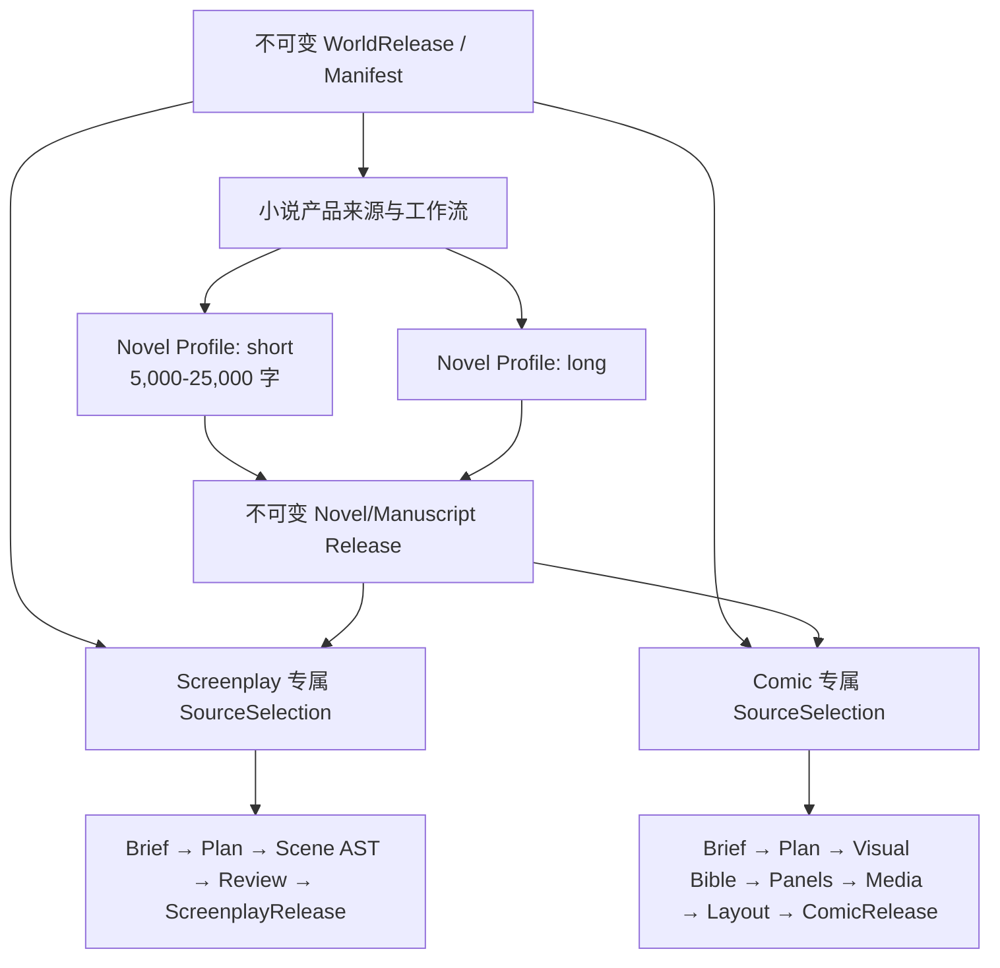

# 短篇小说、小说改剧本、小说改漫画市场与开源技术调研

> 调研快照：2026-08-22
>
> 用途：为 StoryForge 后续产品定义、技术选型、Prompt/Agent Skill、数据结构、生产状态机、媒资与质量评测提供依据。
>
> 相关项目结论以《[短篇、剧本、漫画分支与世界引擎总纲对齐审计](./SHORT-SCREENPLAY-COMIC-WORLD-SOURCE-ALIGNMENT-AUDIT-20260822.md)》为准；本文不替代施工蓝图，也不把竞品做法自动提升为 StoryForge 的架构规范。

## 1. 先说结论

这次调研得到的结论不是“找一个开源项目照抄”，而是以下五点。

1. **短篇应继续作为现有小说引擎的一个显式 Profile，而不是另建一套短篇系统。** 市面上较成熟的小说工具和较可靠的开源实现，核心都是“故事资料库/世界书 → 大纲或场景 → 分段正文 → 修订与版本”，短篇和长篇主要差在篇幅预算、结构密度、上下文范围、章节数量和完成标准，不差在底层事实模型。StoryForge 已把短篇定义为 5,000～25,000 字，这个嵌入方向正确。
2. **小说改正规剧本与“把小说摘要成几段场景文本”不是一回事。** 正式产品至少要有来源选择、改编 Brief、结构计划、场景与剧本块的语义模型、来源覆盖、作者确认、格式校验以及 Fountain/FDX/PDF 等确定性输出。镜头表、分镜、预算、排期属于后续制片层，不能和正规剧本文本混成同一个字段。
3. **小说改漫画是完整的多阶段出版流程，不是调用一次图像模型。** 完整链路是：来源改编 → 视觉圣经 → 角色/地点/道具参考资产 → 页格脚本 → 逐格候选图 → 选图与修订 → 本地排字/气泡/拟声词 → 页面布局 → 质量检查 → 不可变 Release。角色一致性模型只是其中一个可替换的媒资能力。
4. **决定生产系统可靠性的不是 Agent 数量或 Prompt 长度，而是身份、事务和边界。** 被深入审查的优秀实现普遍重视结构化事实、输入哈希、不可变快照、版本、显式工具、原子提交和恢复；问题较多的实现则依赖大 JSON、自然语言解析、界面内重试、失败时静默降级和反复把历史文本塞回 Prompt。
5. **StoryForge 当前最有价值的差异化不是“再做一个一键生成器”，而是可追溯、可确认、可恢复、可发布。** 竞品公开资料通常强调速度与效果，很少公开“来源冻结、逐场证据、正式采纳、媒资哈希、失败恢复和成品复现”的完整闭包。StoryForge 如果守住这些能力，会比单纯增加模型按钮更有长期价值。

对当前项目还有一个不可绕过的结论：若功能承诺仍是**从短篇或长篇小说正文忠实改编**，正式来源必须包含不可变的小说正文发布物。现有 `WorldReleaseManifestV2` 不含章节正文，不能用仍在变化的 Chapter 工作表偷偷补齐。这个问题属于项目正式出口和产品来源边界，不能靠竞品 Prompt 绕过。

## 2. 调研方法与可信度边界

### 2.1 调研范围

本次调研分三层进行：

- 商业产品与 App：只使用厂商官网、官方帮助中心、官方发布说明和官方产品页，观察公开功能、交互分层和产品承诺；没有把营销措辞当作已验证的工程事实。
- 开源项目：使用 8 组 GitHub 关键词得到 80 个去重候选，并针对 Fountain/FDX、小说改编、角色一致性论文官方实现和近期活跃中文仓库定向补检；再按活跃度、相关性、代码可读性和代表性筛选，对 12 个仓库进入具体目录、数据模型、服务、Prompt、任务队列、导出器或模型管线进行代码级审查。
- 研究论文：只选与长文本规划、角色一致性和漫画布局直接相关的论文或官方实现，用于判断技术能力边界，不把论文 Demo 当成可直接上线的产品。

### 2.2 证据等级

本文用以下口径避免把不同证据混在一起：

- **官方可确认**：厂商公开帮助文档明确描述的功能。
- **厂商自述**：官网产品页声称具备，但本次未登录付费产品做端到端实测。
- **代码确认**：在指定 Git commit 中看到对应模型、Prompt、状态或实现。
- **研究结果**：论文报告的实验结论，只能说明特定数据和设置下的能力。
- **推断**：由多个来源共同指向的产品或工程结论，会明确写为推断。

商业产品功能会持续变化；开源仓库的星标数、模型名和默认分支也会变化。本文记录的是 2026-08-22 快照，不应作为永久不变的采购或许可证结论。

## 3. 市场全景：用户实际购买的不是同一种“AI 创作”

市场可以分成三类价值层：

| 价值层 | 用户真正购买的能力 | 代表产品形态 | 对 StoryForge 的意义 |
|---|---|---|---|
| 创作辅助层 | 灵感、资料库、大纲、续写、改写、审稿、版本 | Sudowrite、Novelcrafter、NovelAI、阅文作家助手 | 短篇应进入小说引擎，不另造平行系统 |
| 专业文档层 | 行业格式、场景/节拍、修订、协作、导出、制片拆解 | Celtx、Arc Studio、Filmustage | 剧本必须是语义文档产品，不是 Markdown 长文本 |
| 多模态生产层 | 角色资产、分镜、图像/视频、排字、版本、发布 | Dashtoon、LTX Studio、AI Comic Builder 等 | 漫画需要自己的生产与媒资状态机 |

三类产品会互相延伸，但不能因为它们都调用 AI，就强行建立一套统一 Brief、统一 DAG 或统一媒资 Profile。公开产品也普遍围绕自己的成品形态组织流程，而不是先建立“全产品通用生产协议”。

## 4. 短篇小说产品调研

### 4.1 主要商业产品

| 产品 | 官方公开能力 | 可观察到的产品模型 | 对 StoryForge 的启示 |
|---|---|---|---|
| [Sudowrite](https://www.sudowriteai.com/) | [Story Bible](https://docs.sudowrite.com/using-sudowrite/1ow1qkGqof9rtcyGnrWUBS/what-is-story-bible/jmWepHcQdJetNrE991fjJC)、[Outline](https://docs.sudowrite.com/using-sudowrite/1ow1qkGqof9rtcyGnrWUBS/outline/3owKyHXUm1bCdp41b2Npjk)、[Scenes 与 Draft](https://docs.sudowrite.com/using-sudowrite/1ow1qkGqof9rtcyGnrWUBS/scenes--chapter-prose/49p5MTVxTKkVFEC5rVUzpY)、角色、世界观和整场景/章节/全书反馈 | 先整理 Synopsis、Characters、Worldbuilding、Outline、Scenes，再生成或修改正文；场景引用相关角色和设定 | 短篇也需要完整但更小的故事基础，不能只给一个题目直接生成 25,000 字 |
| [Novelcrafter](https://www.novelcrafter.com/) | Codex、规划视图、写作、AI Chat、系列共享、协作；[Revision History](https://docs.novelcrafter.com/en/articles/8677729-revision-history/) 覆盖 Codex、场景摘要和场景正文；官方更新还提供 Prompt 预览和 Codex 上下文控制 | Codex 是作品知识库，场景是创作与版本单位，AI 上下文可见并可控 | Prompt 预览、资料条目选择、场景版本恢复比“一键生成”更能建立作者信任 |
| [NovelAI](https://docs.novelai.net/en/text/editor/storysettings/) | 模型/预设/模块、Memory、Author’s Note、重试分支；[Lorebook](https://docs.novelai.net/en/text/lorebook/) 支持关键词、正则、条件激活、位置、分类和导入导出 | 上下文不是整本常驻，而是 Memory + 作者注释 + 被激活的 Lore 条目 + 当前文本 | StoryForge 应通过登记的上下文源组装精确工作集，而不是把全世界资料无差别塞进模型 |
| [Squibler](https://www.squibler.io/) | 由概念、类型和要素生成结构，提供 Smart Writer、章节/场景和可调整大纲 | 面向快速起稿和可编辑结构，产品承诺偏“一体化写作” | 创建门槛可以低，但低门槛入口之后仍应落到结构化 Brief 和确认步骤 |
| [阅文作家助手](https://www.yuewen.com/app/?type=appzj) | 多端写作、大纲、搜索、纠错、妙笔助手、历史记录、云同步和读者数据 | AI 是作者工作台的一部分，编辑、发布和数据反馈同样重要 | 短篇“写完”不只等于模型返回文本，还需要编辑、审稿、统计与发布快照 |

### 4.2 市场共性

商业产品虽然不公开内部架构，但公开交互已经显示出稳定共性：

1. 先建立作品资料，再进入场景或章节创作。
2. AI 生成通常是局部可重试、可改写、可选择的候选，不应覆盖整部作品。
3. 长程一致性依赖资料库、摘要、激活规则或场景附着关系，不依赖模型“自然记住”。
4. 版本历史、撤销、分支和 Prompt 可见性逐渐成为标准能力。
5. “短篇”更适合缩短前期设定、减少人物与支线、提高每场功能密度，而不是取消结构设计。

### 4.3 对短篇产品定义的直接结论

StoryForge 的 5,000～25,000 字短篇可以而且应该从现有分步骤长篇流程中抽取。建议保留共同的故事核心、角色、必要世界设定、大纲、章/场景计划、正文、审校与版本，只调整：

- 创建时显式选择 `NovelWorkflowProfile='short'`；
- 总字数硬边界和动态章节预算；
- 主冲突、角色和支线数量建议；
- 短篇专属结构 Prompt 与上下文预算；
- 一次冻结全篇结构后再逐章/逐场写作；
- “闭合、余韵、主题变化、无未处理主线”的短篇完成标准；
- 显式扩写为长篇，但绝不截断旧正文。

这与当前项目对齐审计和市场证据一致，不需要新增 `shortStories`、短篇专属编辑器或第二套 AI 写入通道。

## 5. 小说改正规剧本产品调研

### 5.1 专业编剧与制片工具

| 产品 | 官方公开能力 | 它解决的层次 | 对 StoryForge 的启示 |
|---|---|---|---|
| [Celtx](https://www.celtx.com/) | 行业格式、Beat Sheet、Storyboard、修订协作和前期制作；[Film/TV Script Editor](https://support.celtx.com/hc/en-us/articles/360009310173-The-Film-TV-Script-Editor) 有场景标题、角色、对白、转场、草稿、媒体、Breakdown 和 Shot List | 从编剧文档延伸到制片，但各类产物仍有明确结构 | Screenplay、Breakdown、Shot List 应有关系但不能共用一块自由文本 |
| [Arc Studio](https://www.arcstudiopro.com/pricing) | 正规格式、Fountain/FDX 导出、大纲、Season Outline、历史/修订、Table Read、研究助手 | 写作与修订优先的专业剧本产品 | 第一版应先把正规剧本文档做完整，再扩展重制片能力 |
| [Filmustage](https://help.filmustage.com/en/articles/8282284-features-summary) | AI/人工 Breakdown、排期、VFX、Call Sheet、预算和导出；[AI Dude](https://help.filmustage.com/en/articles/13721195-what-is-ai-dude) 使用项目工具、精确场景引用、预览确认和自动备份 | 输入是已成形剧本，输出是制片分析与项目动作 | AI 动作要绑定准确场景，先预览再确认；不能让聊天回答冒充已写项目事实 |
| [LTX Studio](https://website.ltx.studio/) | 从概念/剧本/图像/视频开始，动态 Storyboard、Timeline、声音、角色/物体/地点 Elements、镜头和关键帧 | 偏视觉预演与视频生产，不是单纯剧本编辑器 | 角色/地点视觉资产和镜头是剧本之后的独立产品层 |
| [FinalBit / NolanAI](https://www.finalbitai.com/nolan-ai) | 厂商自述覆盖编剧、Coverage、Breakdown、Storyboard、Shot List、预算、排期和 Pitch Deck | 一体化影视前期平台 | “全流程”是商业包装，内部仍需要分阶段工件与状态；StoryForge 不应以一个大 Adaptation 状态概括所有层 |
| [DeepStory](https://www.deepstory.ai/pages/deepstory.view.html) | 协作生成故事/剧本和导入导出 | 快速共同创作 | 可作为低门槛入口参考，但公开资料不足以证明来源忠实和生产恢复能力 |

### 5.2 国内公开产品

国内公开页面更强调短剧、漫剧和视频流水线：

- [故事接龙 StoryPlay](https://storyplay.cn/) 公开强调短剧拆解、分析、策划和评估；
- [美摄](https://www.mayzon.cn/) 自述可从小说分析世界、人物，形成分集剧本、资产、分镜和视频；
- [智剧](https://www.zhijuu.com/) 自述支持自有剧本和小说转剧本、分集、角色、对白、场景、分镜与 Word 导出；
- [山海AI](https://www.sheverai.com/) 自述覆盖小说转剧本、剧本转分镜；
- [知漫剧](https://www.zmj.net/) 自述覆盖创意/小说/剧本到剧本、角色、分镜、配音和视频；
- [PopShort](https://popshort.ai/zh) 自述可从剧本/小说提取角色、场景和道具，并生成生产资产；
- [OranTV](https://www.orantv.com/) 公开产品链包含项目、剧本、资产、分镜与成片。

这些页面可证明市场对“小说 → 剧本 → 资产 → 分镜 → 成片”的需求很强，但大部分是厂商自述。本次没有公开证据确认它们是否具备不可变来源、逐场证据、幂等任务和可复现 Release，因此报告不据此推断内部技术质量。

### 5.3 正规剧本与镜头表必须分开

市场和开源代码共同说明，至少要区分三种东西：

| 产物 | 主要内容 | 主要消费者 |
|---|---|---|
| 正规剧本 | 场景标题、动作、角色、对白、括注、转场、页码/修订 | 编剧、导演、演员、审稿和导出工具 |
| 制片拆解 | 场景中的角色、服装、道具、地点、VFX、时段、拍摄要求 | 制片、预算、排期、部门协作 |
| 镜头/分镜计划 | 景别、机位、运动、构图、时长、画面与声音 | 导演、摄影、动画、视频生成 |

第一版“小说改正规剧本”应完成第一行，并可从语义剧本确定性派生基础统计。Breakdown 和 Shot List 可以后续建设，不能提前把所有镜头术语注入动作段，让剧本文档失去专业结构。

## 6. 小说改漫画产品调研

### 6.1 商业产品

| 产品 | 官方公开能力 | 可观察到的产品模型 | 对 StoryForge 的启示 |
|---|---|---|---|
| [Dashtoon Studio](https://dashtoon.com/create) | 角色一致性、风格、Storyboard-to-Comic、背景/脸部修改、放大、发布与变现；[Story Mode](https://insiders.dashtoon.com/dashtoon-studio-august-2024-release/) 从故事识别角色、匹配角色库并形成 Panel Screenplay | 创作工具和竖屏漫画分发结合，角色库是可复用资产 | 漫画产品要有角色资产身份、页格脚本、编辑和发布，不是只保存图像 URL |
| [ComicsMaker.ai](https://www.comicsmaker.ai/) | 可复用角色、自定义 LoRA、场景生成/编辑、页面设计和一键漫画 | 角色训练/引用 + 单格生成 + 页面编辑 | 角色模型或参考图必须版本化；页面布局仍需要人工可编辑层 |
| [Komiko](https://komiko.app/en) | 角色创建与一致性、无限画布、文生图、气泡和效果 | 图像与画布编辑器一体 | 漫画中的文字、气泡和效果应是可编辑对象，不应烘焙进原始图片 |
| [Neural Canvas](https://www.neuralcanvas.io/) | 由角色、故事和风格生成带气泡的漫画并导出 PDF/电子书 | 面向快速成书 | PDF 只是渲染物，内部仍应保留页、格、图层和文本的语义来源 |
| [灵境AI](https://h5.lingjingai.cn/) 等国内漫剧平台 | 厂商自述覆盖小说/剧本到动漫、短剧、漫剧和视频工作流 | 更偏连续视频和内容工厂 | 静态页漫应先独立完成；不要因为市场热度把视频生产强塞进漫画 V1 |

### 6.2 漫画产品的真实能力栈

一款可交付漫画产品至少包含以下能力，而不是单一“画面质量”：

1. 忠实改编：原文事件、角色动机、对白和视觉化取舍有来源证据。
2. 叙事压缩：把章节节奏转换为篇/章/页/格的揭示、转折和翻页点。
3. 视觉圣经：画风、线条、色彩、年代、服装、禁忌和构图规则。
4. 视觉主体：角色、地点、道具的稳定 ID、描述、参考图和版本。
5. 分镜脚本：每格叙事功能、角色、动作、构图、对白/旁白/拟声词和来源。
6. 媒资生产：模型能力匹配、请求预算、幂等、候选数量、失败/取消/恢复和完整性。
7. 一致性：身份、服装、地点、道具、左右关系、时段、伤势和连续动作。
8. 页面编辑：阅读方向、格框、出血、安全区、气泡、字体、文字溢出和本地可编辑图层。
9. 发布：固定页面、所选媒资版本、字体/排字和导出物的不可变 Release。

### 6.3 “一致角色模型”不是完整漫画系统

[StoryDiffusion](https://arxiv.org/abs/2405.01434) 和 [StoryMaker](https://arxiv.org/abs/2409.12576) 解决的是生成模型中的身份或整体人物一致性。它们不负责：

- 小说来源选择和改编忠实度；
- 页格节奏、翻页点和对白压缩；
- 角色参考资产的产品级版本与授权；
- 失败恢复、成本和候选选择；
- 气泡、字体、排字和页面几何；
- 成品 Release 与重新打开后的复现。

因此更适合放在 StoryForge 的漫画媒资 Provider/Capability 层，由 `ComicMediaJobContract` 调用，而不是变成漫画产品领域模型。

## 7. 开源项目代码级审查总表

以下结论固定在审查 commit，避免仓库后续变化使描述失真。

| 仓库 | 审查 commit | 许可证状态 | 深入查看内容 | 一句话判断 |
|---|---|---|---|---|
| [Long-Novel-GPT](https://github.com/MaoXiaoYuZ/Long-Novel-GPT) | `107c31e` | 未检测到许可证文件 | Writer 分块对齐、三层 Writer、Promptflow、生成/对齐/审稿 Prompt | 很好的“提纲与正文对齐编辑”原型，但质量闸门与事务不足 |
| [novel-studio](https://github.com/Xiaoyangy/novel-studio) | `9da2ff1` | Apache-2.0 | 短篇 Architect、Planner/Drafter、RAG 收据、ContextSummary、checkpoint、lease、发布事务、生产复盘 | 最值得借鉴的是冻结、内容寻址、幂等和失败关闭；不能照搬庞大 Agent 数量 |
| [AI-Novel-Writer](https://github.com/EthanYoQ/AI-Novel-Writer) | `036f3af` | GPL-3.0 | ADR、事实源、定稿/实体稿发布、Agent 工具面、上下文窗口、Prompt 模板 | 领域事实和通用文件严格分离，审批与发布语义可靠；GPL 代码不可直接并入非 GPL 产品 |
| [ai-novel2script](https://github.com/Axelxrd/ai-novel2script) | `d17522d` | MIT | 章节解析、确定性基线、AI 增强、JSON Schema、Fountain/Markdown/YAML/JSON 导出和测试 | 小而正确的“确定性骨架 + AI 增强 + 严格验证”参考 |
| [novelToScreenplay](https://github.com/qudder/novelToScreenplay) | `0900d1f` | 未检测到许可证文件 | 小说解析、叙事抽取、source refs、剧本 YAML Schema、分镜/视频、缓存和媒资校验 | 来源 span 追踪很有价值，但当前快照、别名合并和失败降级不够稳 |
| [huohuo-drama](https://github.com/appolloqin/huohuo-drama) | `6b154d8` | 未检测到许可证文件 | 剧本格式化 Skill、Storyboard Skill、四层小说记忆、服务端任务、TTS/视频/FFmpeg | 产物分层和后台任务方向正确，但流程很重，许可证不明，不宜整体复制 |
| [Beat](https://github.com/lmparppei/Beat) | `22d604c` | GitHub 标为 Other，根目录未发现标准 LICENSE | `LineType`、UUID 行模型、增量 Fountain Parser、FDX 导出、修订/标签/注释 | 是剧本语义 AST 和专业格式的好参考，不是 AI 改编系统 |
| [AI Comic Builder](https://github.com/LingyiChen-AI/AIComicBuilder) | `e01e7dd` | Apache-2.0 | Prompt Registry/版本、剧本解析、角色/关系、Shot/Asset 表、任务队列、关键帧/视频/FFmpeg | 多模态生产链最完整的样本之一；偏漫剧视频，Prompt 也存在强行补对白等忠实度风险 |
| [ai-comic-factory](https://github.com/jbilcke-hf/ai-comic-factory) | `c5dc3c7` | Apache-2.0 | LLM Panel JSON、Zustand 项目状态、生成重试、硬编码 Layout、气泡覆盖 | 易理解的 Demo，但角色身份、Schema、恢复与错误处理不足，不能作为正式生产骨架 |
| [AI-Comic-Generator](https://github.com/Dapeng960208/AI-Comic-Generator) | `cc8869a` | API 未识别许可证；README 内 MIT 文本与版权名不一致 | 大型 Storyboard Prompt、SQLModel 表、ConsistencyService、任务和 Gemini 图像上下文 | 展示了 JSON 驱动和参考图思路，但大 JSON、字符串匹配和静默跳图容易产生数据漂移 |
| [StoryDiffusion](https://github.com/HVision-NKU/StoryDiffusion) | `8de45e4` | Apache-2.0 | Consistent Self-Attention、identity bank、Prompt 角色替换和演示管线 | 有价值的角色一致性 Provider 原语；显存和 Prompt 约束明显，不是产品工作流 |
| [StoryMaker](https://github.com/FireRedTeam/StoryMaker) | `a7ce766` | 未检测到许可证文件 | 人脸/裁剪人物/服装特征、双角色输入、区域 attention loss、face ID loss、pose 条件 | 比只保脸更完整地保持服装、发型和身体；部署重、许可证不清，只宜研究和适配评估 |

补充观察：[MaliangAINovalWriter](https://github.com/Deng-m1/MaliangAINovalWriter) 的公开说明声称多智能体、三级大纲和知识图谱一致性，但审查时默认分支 HEAD 只有说明材料，没有足够源码形成同等级代码结论，所以没有把宣传能力写成代码确认。

## 8. 开源深度分析：短篇与小说生产

### 8.1 Long-Novel-GPT：以“对齐块”维护提纲与正文

代码结构不是一次生成全书，而是 `OutlineWriter → PlotWriter → DraftWriter`：

- `Writer` 同时维护来源剧情 `x` 与目标正文 `y` 的对应关系；
- 依据字符预算对两侧分块，让模型只处理局部对应区间；
- 对齐 Prompt 输出“剧情段索引 → 连续正文段索引”的映射；
- 修改时生成非重叠 patch，而不是替换全稿；
- Promptflow DAG 把上下文提取、生成和解析拆开。

值得借鉴：

- 大纲节点和正文区间必须存在稳定关联，局部修改才可追溯；
- 长文本生成应围绕有边界的工作包，而不是滚动追加不可控文本；
- 生成、解析、对齐、审稿应是不同步骤。

不能照搬：

- 主要按字符切分，可能在语义边界截断；
- 部分审稿逻辑仍偏 Prompt 分数，代码注释也表明评分未完全落地；
- 示例驱动容易把参考文风误变成模仿；
- 没看到足以支撑正式发布的不可变来源、事务和 durable run 闭包。

### 8.2 novel-studio：最重要的不是多 Agent，而是生产事务

该仓库的短篇 Architect 明确把短篇视为小说生产策略：目标不超过约 30,000 字，建议 3～15 章，聚焦单一主冲突、目标或关系变化，只建立必要世界，并要求高潮和结局闭合。它与 StoryForge 的 5,000～25,000 字产品定义高度接近。

生产链大致是：

```text
Idea → Brainstorm → Architect → 冻结全篇大纲
     → 世界/角色 POV 弧模拟 → 封存弧
     → 章节 Render → 精确正文审查 → 实际匹配
     → 原子发布 → 接收回执 → Finalize/Deliver
```

代码与文档中值得借鉴的关键机制：

- 长程上下文分为近期消息、`ContextSummary`、结构化 Store 和 Restore Pack；
- RAG 命中先变成精确来源引用和内容寻址收据，再由 Planner 转化为可用事实；Drafter 不直接访问实时 RAG；
- 章节生产绑定 candidate identity、plan digest 和 body SHA；
- checkpoint、lease、singleflight、有限正文许可和事务式发布避免重复生成；
- 前置条件用类型化 preflight，失败关闭，不靠自然语言错误匹配；
- 重试有明确上限，不允许无限“修到通过”。

更重要的是，该项目公开的短篇生产复盘记录了一个反例：一部 12 章、28,976 字作品曾耗时 34 小时以上、记录 663 次调用、输入约 2,250 万 token、成本约 121.79 美元。根因不是模型“不够聪明”，而是章节事务不幂等、前置条件矛盾、自然语言解析、契约引入过晚和针对单一样本硬编码修补。

对 StoryForge 的结论：

- 应借鉴不可变 packet、内容哈希、原子提交、有限重试和 watchdog；
- 不应为了显得先进复制十几个 Agent 和大量审查门；
- 每增加一个 Agent 或修复循环，必须证明它降低了哪类错误，并有成本、延时和失败上限；
- 短篇尤其应该是更短、更确定的生产链，而不是长篇流程叠加更多门禁。

### 8.3 AI-Novel-Writer：AI 动作不能冒充领域事实

该项目的 ADR 给出三条非常适合 StoryForge 的工程原则：

1. 结构化角色名单是事实源，Markdown 角色图谱只是确定性只读投影；模型排版变化不能把角色事实清空。
2. AI 通用文件写入只产生文件产物，故事架构、角色、章节蓝图和章节创作必须经过各自领域提交 seam。
3. 定稿使用不可变正文快照，在事务中更新正文与状态并登记发布任务；实体稿落盘失败时表现为“已定稿、待发布”，可以安全重试。

其专用 Agent 还把模型工具面限制为受控的 `novel_read` 与 `novel_apply_change`，读取有字节上限、工作集和精确资产身份，替换必须携带 `baseRevision` 并经过审批 diff。

这说明 StoryForge 的三注册表、候选/采纳和 durable Harness 不是额外负担，而是防止“聊天说成功但项目没有成功”的必要边界。由于该仓库为 GPL-3.0，只能研究思想和外部行为，不能直接拷贝实现到不兼容许可证的代码库。

## 9. 开源深度分析：小说改剧本

### 9.1 ai-novel2script：确定性基线后再让 AI 增强

该项目规模小，但架构选择很清楚：

1. 确定性章节解析器先建立 `ScriptDraft → Acts → Scenes → Blocks/Characters` 基线；
2. 可选的 OpenAI-compatible Provider 只能在固定 JSON 形状中增强 logline、角色、场景摘要、目标、冲突和转折；
3. System Prompt 要求返回与基线兼容的 JSON，不得改名、删除或省略字段；
4. 使用 JSON Schema 2020-12 验证；
5. Fountain 导出中保留来源章节注释，同时提供 YAML、Markdown、JSON；
6. 测试覆盖 parser、provider、schema、质量和来源覆盖。

这是 StoryForge 剧本 V1 很合适的降风险模式：**先由确定性代码形成完整但朴素的可编辑结构，再让 AI 产生候选增强**。即使模型失败，也不应失去原始章节范围和场景骨架。

局限也很明确：AI 摘要只取有限章节和字符，适合作为原型，不适合长篇完整忠实改编；没有世界 Release、产品 SourceSelection、正式采纳和媒资层。

### 9.2 novelToScreenplay：把来源证据带进每个叙事单元

该项目从 TXT/MD/DOCX 导入，经章节解析、并发分析、人物/关系/时间线合并、NarrativeBlock、SubScene、剧本场景、Storyboard 和视频任务逐步下钻。

最值得借鉴的是来源证据：

- 角色、事件和叙事单元要求 `source_refs`；
- 引用带章节、短证据文本和字符 span；
- 剧本 Schema 的 scene 记录来源章节、事件和 spans；
- 场景还有 dramatic purpose、conflict、turning point、value、stakes；
- adaptation 记录压缩、补充、理由和风险；
- beats 使用 action/dialogue/parenthetical/shot/transition/note 等类型。

这比只保存 `sourceChapterIds` 更有用：作者能看到“这一场根据哪段正文、做了什么改编取舍”。StoryForge 应进一步把 span 绑定到**冻结正文发布物的稳定内容身份**，否则源稿修改后字符位置会漂移。

需要避免的问题：

- 角色主要按精确名称合并，别名、称谓和同名容易错；
- 分析失败时可能回退到空分析，属于 fail-open；
- 本地 snapshot 不是不可变产品来源；
- 某些完成 Prompt 直接把镜头写进剧本文本，容易混淆剧本和 Shot List；
- 缓存和 debug 文件有价值，但还不是正式 Run/Release 证据。

### 9.3 Beat：剧本应保存为语义 AST

Beat 不是 AI 生成器，但它说明专业剧本编辑器内部不能只存一大段 Markdown。代码中的行类型包含：

- scene heading、action、character、parenthetical、dialogue、dual dialogue；
- transition、shot、lyrics、centered、page break；
- section、synopsis、title page 等结构信息。

每行具有 UUID、文本范围、格式、修订、注释、标签、版本和自定义数据；Fountain parser 支持增量重新解析，FDX 导出还处理标签、修订、Script Note 及角色/道具/服装/VFX/地点分类。

因此 StoryForge 应以 `ScreenplayScene + typed blocks` 为单一事实源，Fountain/FDX/PDF 都由确定性 renderer 生成。导出文本可以缓存，但不能反过来成为唯一事实。

### 9.4 huohuo-drama：正确分层，但要控制复杂度

该项目把链路拆为原文、可拍摄剧本、角色/地点、Storyboard、图片/视频、TTS、单镜头合成和整集导出。服务端任务可以在客户端断开后继续，并恢复进度。

它的剧本 Skill 要求：

- 保留情节、关系和结局；
- 把旁白视觉化，以对白推动；
- 场景约 30～60 秒，适配竖屏短剧；
- 剧本阶段不写镜头术语；
- 输出固定场景标题并通过工具保存。

Storyboard Skill 再独立生成镜号、画面、时间、地点、景别、角度、运动、动作、对白、结果、氛围、时长、图像/视频/BGM/SFX 和稳定角色 ID。这个“剧本不写镜头、分镜再写镜头”的边界值得保留。

但其小说侧还有大量连续性、因果、合规、文风、人性化和修复步骤。没有针对每一层的必要性证据时，这种流程很容易成为高成本和高耦合系统。StoryForge 只应吸收产物分层、服务端任务和可恢复媒资的思想。

## 10. 开源深度分析：小说改漫画与视觉生产

### 10.1 AI Comic Builder：较完整的漫剧生产骨架

该项目的公开管线是：

```text
剧本输入 → 剧本解析 → 角色提取 → 角色四视图
                              ↓
                           智能分镜
                              ↓
                 参考帧或首尾关键帧（逐镜头）
                              ↓
                      视频 Prompt 与视频
                              ↓
                       FFmpeg 合成与字幕
```

代码级优点：

- 数据库把 Project、Episode、Character、CharacterRelation、Scene、Shot、Dialogue、StoryboardVersion、ShotAsset、Task 分开；
- `shot_assets` 记录类型、版本、active 状态、Prompt、文件、Provider、模型和 meta；
- 任务表记录 payload、result、error、retry、max retry 和 schedule，领取任务使用单条原子更新；
- Prompt 有 Registry、Slot、全局/项目覆盖、版本、恢复、预览和 A/B 测试；
- Character 保存视觉短标识、身高、体型、表演风格、服装和参考图历史；
- 分镜 Prompt 明确首帧、末帧、动作时间段、镜头、构图、景深、声音、安全区和物理姿态；
- 多 Provider 和媒资版本说明图像/视频能力可以适配，而不应写死在编辑器。

值得特别借鉴的 Prompt 思路：图像模型会字面化比喻，因此视觉 Prompt 要写可观察的姿态、身体支点、空间、光照和构图；若后续要叠字幕或气泡，必须在构图阶段预留安全区。

风险与不应照搬处：

- 产品目标偏“漫剧/动画视频”，不是静态页漫，Shot/首尾帧并不能替代 Page/Panel/Layout；
- 某个分镜规则要求尽量每个镜头都有台词，甚至原文没有也补充，这会破坏忠实改编；
- 角色去重再次调用 LLM，失败时插入全部角色，属于可能制造重复的降级；
- JSON 主要直接 `JSON.parse`，仍需更严格的 Schema 和范围校验；
- 任务虽然原子领取，但没看到租约过期、心跳和进程崩溃后 reclaim 的完整证明；
- URL 型媒资和数据库版本还不等于内容寻址、rights 和不可变 Release pin。

### 10.2 ai-comic-factory：优秀 Demo，也集中展示了反模式

该项目用 Next.js/Zustand 管理 Panel 的 image prompt、speech 和 caption，通过 LLM 生成 JSON 数组，再逐格调用 SDXL/渲染 Provider；页面布局是几个固定四格模板，文字通过可编辑覆盖层处理。

可借鉴：

- Panel 画面描述、对白和旁白分开；
- 用户可以单独编辑并重生成一格；
- Layout 与图像生成分开；
- Provider 有适配层。

不适合作为正式生产系统的部分：

- 角色一致性主要靠每格重复年龄、性别、服装等描述，没有稳定角色资产 ID；
- 延续生成把已有 Panel 文本再次塞进 Prompt，规模增长后上下文和漂移都不可控；
- JSON 解析失败时用字符串拆分，甚至退化为重复 Panel；
- 重试和恢复主要在界面/请求逻辑中，缺少持久任务与幂等身份；
- 固定四格模板无法覆盖页漫的阅读方向、跨格、出血和复杂版式；
- 没有来源证据、正式采纳或 Release。

这类实现很适合验证“用户愿不愿意生成漫画”，不适合证明“小说改漫画产品已完成”。

### 10.3 AI-Comic-Generator：JSON 驱动不等于类型安全

该项目使用 FastAPI、SQLite/SQLModel、Vue 和 Gemini，公开目标包含故事扩写、角色卡、分镜、参考图一致性和批量后台生图。

Prompt 一次要求模型输出：

- 全局 Comic Config；
- 所有 Character Sheet；
- 每四格一组 Storyboard；
- 画风、气泡、旁白、边框、沟槽、版式和画幅；
- 每格场景、动作、对白和绘图 Prompt。

这种设计的优点是演示快、数据可见；问题是单次大输出同时承担故事编辑、视觉设计、角色去重、页格规划和样式配置，任何局部错误都会污染整包。实际表中 Character 和 StoryboardItem 的核心仍是任意 `Dict JSON`，并没有让领域结构真正类型化。

`ConsistencyService` 主要通过字符串搜索角色名、复制全局 style/meta 来“归一化”，缺失参考图在生图时记录警告后跳过。它说明：

- 全局配置应集中，但不能靠后处理强行覆盖所有已确认工件；
- 角色引用必须用 ID，不应扫描自然语言猜测；
- 缺失关键角色参考图应按合同阻止或明确降级，不能静默跳过；
- 后台任务必须记录精确输入、模型、请求哈希、计费和输出哈希。

### 10.4 StoryDiffusion：跨多图共享身份特征

StoryDiffusion 的官方实现以 Consistent Self-Attention 在一组 Prompt 间建立 identity bank。代码会先由若干身份 Prompt 写入特征，再在后续 Prompt 中读取；角色占位符被替换为角色描述，并对不同分辨率建立 attention mask。

现实约束：

- 官方说明至少需要 3 个 Prompt，推荐 5～6 个以获得更好布局；
- 低显存版本仍以 20GB 以上 GPU 显存为参考；
- Prompt 中角色标记和身份参考数量有明确约束；
- 它提供的是一组一致图像，不负责每格的叙事、文字和布局。

StoryForge 的正确接法是一个可选服务器 Provider：输入冻结的视觉主体版本、Panel visual prompt、seed/模型参数和候选数量，返回有 hash 的候选媒资。浏览器本地产品不应把该 PyTorch 管线直接变成领域依赖。

### 10.5 StoryMaker：一致性要覆盖脸、发型、服装和身体

StoryMaker 的论文和代码显示它同时使用：

- face identity embedding；
- 裁剪人物的 CLIP 特征；
- 独立人脸特征；
- 可选服装图；
- 单人或双人输入；
- 分割 mask 约束不同人物和背景的 attention 区域；
- pose 条件与 face ID loss。

这弥补了只保脸导致服装、发型和体态漂移的问题。对 StoryForge 的产品启示不是采用某个特定模型，而是 `ComicVisualSubjectVersion` 不能只有一张头像：至少要能表达全身、服装版本、关键配饰、表情/姿态参考和允许变化范围。

由于仓库未检测到明确许可证文件，且模型依赖和 GPU 成本较高，当前只能作为能力研究，不应复制代码或承诺内置。

## 11. Prompt 与上下文工程：哪些模式真的有效

### 11.1 成熟 Prompt 的共同结构

被审查的较好 Prompt 不是靠“你是世界顶级大师”生效，而是把任务约束为以下结构：

```text
稳定角色与不可违反的政策
→ 本次产品合同和输出 Schema
→ 冻结来源包与精确选择范围
→ 当前工作单元及其目标/预算
→ 允许引用的角色、地点、规则和前序事实
→ 禁止行为与缺失数据处理
→ 候选输出 + 来源证据 + 变化声明
```

StoryForge 应把前三层分别收口到 Agent Skill、Run Contract 和 `assembleContext()`，不在组件中字符串拼接。

### 11.2 短篇写作工作包

一个章节或场景的生成请求应至少包含：

- 已确认的 Short Brief：核心变化、主题/情感结果、视角、类型和目标字数；
- 冻结的故事基础与完整短篇结构；
- 当前场景的功能、入口状态、目标、冲突、转折、出口状态和字数预算；
- 只与本场相关的角色、关系、地点、规则和伏笔；
- 最近实际正文摘要和上一场结尾，而不是只给计划；
- 不可新增/改写的事实；
- 允许提出的设定候选与必须由作者确认的变化；
- 输出正文候选、简短事实变化声明和未解决问题。

生成正文前冻结全篇结构；写完一场后根据**实际正文**更新状态，而不是假设计划已发生。短篇上下文足够小时可以提高全局结构可见度，但仍不能把所有工作表无差别注入。

### 11.3 小说改剧本工作包

建议分三次，而不是一个 Prompt 完成整本：

1. **来源分析**：输出事件、角色行动、对白候选、地点/时间、因果、必保内容和带稳定 ID 的证据。
2. **改编计划**：按目标时长/集数形成幕、集、序列、场景卡，记录合并、删减、前移、补桥和风险；作者确认。
3. **场景写作**：只根据已确认场景卡和对应来源包生成 typed blocks，输出来源覆盖和新增内容声明。

每场输出宜类似：

```json
{
  "sceneKey": "stable-key",
  "heading": { "interiorExterior": "INT", "locationKey": "...", "timeOfDay": "..." },
  "dramaticPurpose": "...",
  "sourceRefs": [{ "releaseUnitId": "...", "spanHash": "..." }],
  "blocks": [
    { "type": "action", "text": "...", "sourceRefs": [] },
    { "type": "dialogue", "characterKey": "...", "text": "...", "sourceRefs": [] }
  ],
  "adaptationDecisions": [],
  "unsupportedAdditions": []
}
```

具体字段以未来 `ScreenplayRunContractV1` 为准。重点不是照抄示例，而是让每个场景和重要块能回答“来自哪里、改了什么、谁确认”。

### 11.4 小说改漫画工作包

漫画也应分为叙事与视觉两条受控链：

- Narrative Run 产生章/页节奏和 Panel Script；
- Visual Design Run 产生视觉圣经和 Visual Subject 候选；
- Media Job 只根据已确认 Panel 与已选 Subject Version 调用图像 Provider。

单格媒资请求应包含：

- `panelId` 和叙事功能；
- 稳定角色/地点/道具 ID 及明确的参考资产版本；
- 可观察动作、姿态、相对位置、表情和连续性状态；
- 景别、角度、构图、光照、色彩和留白安全区；
- 画面中**不得生成**的对白、旁白和拟声词；这些保存在排字层；
- 模型能力、参考图、尺寸、候选数、seed/参数、rights 和成本边界；
- request hash 与前序选定图引用。

AI Comic Builder 关于物理姿态和字幕安全区的 Prompt 经验值得吸收；ai-comic-factory 依靠反复重复人物描述的方式不够可靠。

### 11.5 Prompt 必须成为可治理资产

市场和代码样本表明，正式系统至少要保存：

- Prompt/Skill/Contract 版本；
- 组装后的上下文来源清单和哈希，而不是默认永久保存全部敏感明文；
- 模型、Provider、参数、工具面和输出 Schema 版本；
- 输入工作单元、来源 Release、Selection 和候选身份；
- 重试原因与次数；
- 输出、解析结果、验证结果和作者采纳记录；
- 成本、耗时和取消状态。

Prompt 编辑可以有预览和版本回滚，但不能允许一个项目级自由 Prompt 绕过 `FIELD_REGISTRY`、AdoptionSchema 或产品合同。

## 12. 技术架构建议：借鉴什么，拒绝什么

### 12.1 建议吸收的能力

| 能力 | 参考来源 | StoryForge 中的落点 |
|---|---|---|
| 短篇是小说策略而非新引擎 | Sudowrite、novel-studio、当前项目审计 | `NovelWorkflowProfile='short'`，复用小说表和编辑器 |
| 精确工作集与上下文预算 | NovelAI Lorebook、AI-Novel-Writer、novel-studio | `CONTEXT_SOURCES + assembleContext()` |
| 冻结计划后再写正文 | novel-studio | Short Run Contract 和生产 checkpoint |
| 来源/正文对齐 | Long-Novel-GPT、novelToScreenplay | 稳定 source refs、span hash、coverage validator |
| 确定性基线 + AI 增强 | ai-novel2script | 剧本来源解析、场景骨架和 renderer |
| 语义剧本 AST | Beat、Celtx/Arc 的公开格式能力 | `ScreenplayScene + typed blocks` |
| Prompt 注册、预览、版本 | Novelcrafter、AI Comic Builder | 产品 Skill/Run Contract 版本和审计 UI |
| 媒资版本与后台任务 | AI Comic Builder、huohuo-drama | `comicMediaJobs`、`comicMediaAssets`、候选选择 |
| 角色整体参考 | StoryMaker、StoryDiffusion | `ComicVisualSubjectVersion` + Provider Capability |
| 本地文字/气泡层 | Komiko、ai-comic-factory | Panel lettering 与 Page layout，而非图内文字 |
| 原子发布与可重试投影 | AI-Novel-Writer、novel-studio | 小说/剧本/漫画 Product Release |

### 12.2 明确拒绝的反模式

1. 一个巨型 Prompt 同时完成故事扩写、角色去重、剧本、视觉圣经和所有分镜。
2. 用自由 JSON/Markdown blob 冒充有主键、引用、Schema 和迁移的领域模型。
3. 在 React/Vue 组件中直接调用模型、隐藏指数重试或恢复状态。
4. 失败时静默返回空分析、重复 Panel、跳过参考图或自动补写事实。
5. 角色靠字符串包含关系识别，跨工件不保存稳定 ID。
6. 把 Dexie/SQLite 自增 ID 当跨产品长期身份。
7. 为了视觉热闹强制每个镜头补台词，破坏原作忠实度。
8. 让图像模型直接画中文对白，再把不可编辑错字当成漫画成品。
9. 把专业剧本和 Shot List 混在同一动作字段。
10. 输入变化后只标记一个总状态，不按依赖图使相关场景、角色图或媒资显式 stale。
11. 无限审稿/修复循环，没有成本、时间和尝试上限。
12. 使用无许可证或 GPL 代码直接并入不兼容项目。

## 13. 面向 StoryForge 的产品落点

### 13.1 三条产品链应这样保持边界



这里的 `Novel/Manuscript Release` 是忠实改编所需的正式正文来源能力，目前需要项目级裁定和建设。不得用 live Chapter 替代。

### 13.2 短篇的最小完整产品

短篇不加新表体系，但必须把以下主路径收口：

1. 新建时选择短篇，验证 5,000～25,000 字。
2. 根据目标字数动态建议章节/场景，而不是固定 3 章。
3. 生成或手写 Short Brief、必要角色/世界设定和完整结构。
4. 作者确认并冻结结构版本。
5. 分章/场景候选、逐项采纳、实际正文状态更新。
6. 全篇审校：长度、闭合、因果、角色、视角、重复、未处理主线。
7. 定稿并形成不可变小说正文发布物。
8. 显式扩写为长篇，旧稿保留为 Golden Master。

市场调研没有发现另造短篇数据库能带来优势，反而会制造两套角色、上下文、导出和迁移真相。

### 13.3 剧本 V1 的最小完整产品

剧本 V1 应是**正规文档产品**：

- 专属 `ScreenplayWorldSourceCatalogV1/SelectionV1`；
- 冻结的小说正文 Release 引用；
- `ScreenplayBriefV1`：电影/剧集/短剧、时长/集数、受众、分级、忠实度和格式；
- Adaptation Plan：幕/集/序列/场景卡与改编取舍；
- `ScreenplayScene` 与 typed blocks；
- scene/block 级来源证据、覆盖和 unsupported addition；
- 作者确认、锁定、重开审校和修订；
- 确定性 Fountain、FDX、PDF renderer 与 round-trip 校验；
- `ScreenplayReleaseManifestV1`。

V1 不需要为了显得完整强行增加视频、图片、预算和运行实例。基础 Breakdown 可以是确定性只读投影；正式 Shot List/Previs 另立后续产品能力。

### 13.4 漫画 V1 的最小完整产品

漫画 V1 应先完成静态页漫出版闭包：

- 专属 `ComicWorldSourceCatalogV1/SelectionV1`；
- `ComicBriefV1` 与章/页/格 Adaptation Plan；
- `ComicGlobalVisualBibleV1`；
- 角色、地点、道具 Visual Subject 及版本；
- Page/Panel/Lettering/Layout 的结构化事实；
- 每格来源、叙事功能和连续性引用；
- `ComicMediaJobContractV1`、持久任务、幂等请求、候选和明确重试；
- 媒资内容哈希、尺寸、rights、Provider、模型、Prompt/参数和版本；
- 本地气泡/旁白/拟声词/字体层和溢出检查；
- Page renderer、PDF/图片包导出；
- `ComicReleaseManifestV1` 和 Release 媒资 pin。

动画、视频、TTS 可以在静态漫画 Release 稳定后另建漫剧/动态漫画产品流程，避免让第一版被多模态复杂度拖垮。

## 14. 模型与供应商策略

### 14.1 文本模型

不要把产品合同绑定到单一模型。Provider 层至少应声明：

- JSON Schema/工具调用能力；
- 上下文长度和可靠输出上限；
- 中文长文本、剧本格式、视觉 Prompt 的评测结果；
- 数据使用、地区、价格、速率和内容政策；
- 是否支持 seed、结构化输出和缓存；
- 降级时允许做什么，不允许做什么。

短篇正文、来源分析、剧本场景和漫画 Panel Plan 应分别评测，不应因为一个模型“写文好”就默认它也擅长证据抽取和结构 JSON。

### 14.2 图像模型

漫画媒资 Provider 的 Capability 应描述：

- 文生图、图生图、多参考图、局部重绘和姿态/边缘/深度控制；
- 单/多角色身份保持能力和参考图限制；
- 风格适配、画幅、分辨率、透明背景和可接受候选数；
- seed 或近似复现能力；
- 请求/响应 ID、异步任务、取消和回查；
- 安全策略、训练/输出权利和商用条件；
- 成本、并发、超时与重试语义。

StoryDiffusion/StoryMaker 一类自托管能力可作为 Adapter 评估；云模型也必须走同一媒资 Job 合同，不能在组件中直接调用。

### 14.3 不应把模型生成的文字当排字

不论模型宣传多强，正式漫画的对白、旁白和拟声词都应保留为独立文本对象，由本地字体与气泡引擎排版。这样才能：

- 修正错字而不重绘整格；
- 支持翻译、多语言和无障碍；
- 检查溢出、安全区、阅读顺序和字体授权；
- 在 Release 中复现相同页面；
- 将干净画面复用于宣传或动态版本。

## 15. 评测与验收方案

### 15.1 固定测试语料

建议建立作者明确授权的隔离语料，不使用真实用户当前项目：

- 短篇：5,000、12,000、25,000 字三档，覆盖悬疑、情感、幻想，包含第一人称和第三人称；
- 剧本：短篇整本、长篇连续章节、长篇离散章节三类来源；目标覆盖电影短片、单集、竖屏短剧；
- 漫画：8 格、24 格、60 格三档，至少包含双人对话、多人动作、服装变化、别名、重复地点和关键道具；
- 反例：缺失角色、同名角色、别名称谓、来源冲突、世界规则缺失、超预算、模型拒绝、Provider 超时和损坏图片。

### 15.2 短篇指标

- 字数是否在 5,000～25,000 硬边界；
- 结构覆盖、高潮和结局闭合；
- 每场入口/出口状态是否真实发生；
- 角色目标、关系、伤势、持有物和规则一致性；
- 视角泄漏、无来源事实、重复段落和未回收主线；
- 作者采纳率、局部重生成次数、总调用/成本/时长；
- 刷新、取消、恢复后是否重复写入或丢稿。

### 15.3 剧本指标

- 来源事件/对白的覆盖率和错误归因；
- unsupported additions、压缩/合并/前移是否显式；
- 场景目的、冲突、转折和价值变化是否成立；
- 场景标题、角色、对白、括注、双人对白和转场语法；
- Fountain/FDX/PDF 输出一致、重新导入或解析 round-trip；
- 角色/地点引用是否全部落在 Selection 依赖闭包；
- 源 Release 变化后旧剧本是否仍绑定旧版，显式升级是否产生新版本；
- Release 后草稿修改/删除不影响旧成品重放。

### 15.4 漫画指标

- 每格来源覆盖、叙事功能、对白和阅读顺序；
- 角色身份、服装、道具、地点和时段连续性；
- 人工盲评 + 视觉 embedding 辅助评估角色/风格一致性，不能只看单一自动分数；
- 面部/手部/肢体错误、多人串脸、关键道具缺失；
- 格框重叠、出血、安全区、气泡指向、文字溢出和字体缺失；
- 图片格式、尺寸、字节数、内容哈希、rights 和引用闭包；
- 同一 request hash 不重复计费；失败、取消、刷新和进程重启不产生孤儿；
- 所选候选、排字和 Page renderer 在 Release 后可复现。

### 15.5 Prompt 与模型评测

每个正式 Prompt/Skill 变更要在固定语料上记录：

- Schema 通过率、解析失败率和错误类别；
- 来源忠实度、人工偏好和未授权新增；
- 首次可采纳率与平均修订轮数；
- token、延时、成本和超时率；
- 不同 Provider/模型的结果，不把模型升级当成自动改进；
- Prompt 版本与模型版本组合的回归差异。

不允许仅凭几个漂亮样例修改全局 Prompt。A/B 结果要绑定具体产品、语料和评价维度。

## 16. 开发顺序建议

本次市场调研支持当前对齐审计中的施工顺序，并补充以下优先级理由：

1. **先裁定并建设不可变小说正文发布来源。** 没有它，真正“小说改剧本/漫画”无法满足来源冻结；继续扩展只会把 live Work 旁路做得更深。
2. **短篇先完成。** 它复用现有小说引擎，产品边界最清楚，可以先验证 Profile、篇幅、冻结结构、实际状态和小说 Release。
3. **剧本 V1 再完成。** 先做纯文档闭包：Selection、Brief、Plan、语义 AST、来源证据、作者确认、Fountain/FDX/PDF 和 Release。
4. **漫画 V1 分两阶段。** 先完成叙事/视觉圣经/Page/Panel/Lettering/Layout，再接真实媒资 Provider、任务、候选、完整性和 Release pin。
5. **最后评估动态漫画/漫剧。** 视频、TTS、首尾帧、动作和 FFmpeg 是另一套产品生产压力，不应成为静态漫画完成门。

每一阶段都必须先登记三注册表和表生命周期，再做 UI；不得以市场上“全流程一键生成”为理由绕过 StoryForge 的治理边界。

## 17. 许可证与可复用边界

| 类型 | 本次样本 | 建议 |
|---|---|---|
| Apache-2.0 / MIT | novel-studio、ai-novel2script、AI Comic Builder、ai-comic-factory、StoryDiffusion | 可在完成法务/NOTICE 检查后参考或复用兼容代码；仍应优先重新实现 StoryForge 领域接口 |
| GPL | AI-Novel-Writer、Trelby 等 | 只研究行为、数据模型思想和公开格式，不直接复制到许可证不兼容代码库 |
| 未找到或不清晰 | Long-Novel-GPT、novelToScreenplay、huohuo-drama、StoryMaker、Beat、AI-Comic-Generator 等 | 默认视为不可复制；只记录抽象工程启示。README 中出现许可证文字但仓库无标准文件或版权不一致，也不能当作已完成许可证确认 |
| 模型权重/第三方 Provider | StoryMaker 权重、各类图像/视频模型 | 代码许可证不等于权重、训练数据、输出和商用权利；必须逐 Provider 建 rights/capability 记录 |

星标数量不代表代码质量或许可证安全。任何真正引入第三方实现的决定都应另做依赖、许可证、模型权重、数据流和浏览器部署审计。

## 18. 最终判断

这次调研没有推翻现有方案，反而让三个嵌入点更清楚：

- **短篇**：现有小说分步骤创作的短篇 Profile，强调全篇结构冻结、动态章节、闭合审校和正文 Release；
- **剧本**：独立的正规文档产品，从冻结世界与小说正文来源开始，形成语义 AST 和确定性导出；
- **漫画**：独立的页漫出版产品，在叙事改编之外建立视觉主体、媒资任务、排字、页面和 Release。

真正值得从市场与开源项目学习的，不是某一段“万能 Prompt”，而是：让来源、计划、候选、作者决定、媒资、版本和成品都有稳定身份；让失败可以恢复；让输出可以验证；让旧作品在新功能上线后仍然安全。

## 附录 A：商业产品官方来源

### 小说与短篇

- Sudowrite：[官网](https://www.sudowriteai.com/)、[Story Bible](https://docs.sudowrite.com/using-sudowrite/1ow1qkGqof9rtcyGnrWUBS/what-is-story-bible/jmWepHcQdJetNrE991fjJC)、[Outline](https://docs.sudowrite.com/using-sudowrite/1ow1qkGqof9rtcyGnrWUBS/outline/3owKyHXUm1bCdp41b2Npjk)、[Scenes 与 Draft](https://docs.sudowrite.com/using-sudowrite/1ow1qkGqof9rtcyGnrWUBS/scenes--chapter-prose/49p5MTVxTKkVFEC5rVUzpY)、[Feedback](https://docs.sudowrite.com/using-sudowrite/1ow1qkGqof9rtcyGnrWUBS/feedback/7Ew1KgpEwabQSgvijq8QNr)
- Novelcrafter：[官网](https://www.novelcrafter.com/)、[Revision History](https://docs.novelcrafter.com/en/articles/8677729-revision-history/)、[Changelog](https://feedback.novelcrafter.com/changelog)
- NovelAI：[Story Settings](https://docs.novelai.net/en/text/editor/storysettings/)、[Lorebook](https://docs.novelai.net/en/text/lorebook/)、[FAQ](https://docs.novelai.net/en/faq/)
- Squibler：[官网](https://www.squibler.io/)
- 阅文作家助手：[官方应用页](https://www.yuewen.com/app/?type=appzj)

### 剧本与影视生产

- Celtx：[官网](https://www.celtx.com/)、[Film/TV Script Editor](https://support.celtx.com/hc/en-us/articles/360009310173-The-Film-TV-Script-Editor)、[Beat Sheet](https://support.celtx.com/hc/en-us/articles/11546214906007)
- Arc Studio：[功能与价格页](https://www.arcstudiopro.com/pricing)
- LTX Studio：[官网](https://website.ltx.studio/)
- Filmustage：[Features Summary](https://help.filmustage.com/en/articles/8282284-features-summary)、[Create a Project/Breakdown](https://help.filmustage.com/en/articles/8076643-create-a-project-breakdown-a-script)、[AI Dude](https://help.filmustage.com/en/articles/13721195-what-is-ai-dude)
- FinalBit / NolanAI：[官方页](https://www.finalbitai.com/nolan-ai)
- DeepStory：[官方页](https://www.deepstory.ai/pages/deepstory.view.html)
- 国内公开产品：[StoryPlay](https://storyplay.cn/)、[美摄](https://www.mayzon.cn/)、[智剧](https://www.zhijuu.com/)、[山海AI](https://www.sheverai.com/)、[知漫剧](https://www.zmj.net/)、[PopShort](https://popshort.ai/zh)、[OranTV](https://www.orantv.com/)

### 漫画与漫剧

- Dashtoon：[Studio](https://dashtoon.com/create)、[AI Comic Generator](https://dashtoon.com/ai-comic-generator)、[Story Mode Release](https://insiders.dashtoon.com/dashtoon-studio-august-2024-release/)
- ComicsMaker.ai：[官网](https://www.comicsmaker.ai/)
- Komiko：[官网](https://komiko.app/en)
- Neural Canvas：[官网](https://www.neuralcanvas.io/)
- 灵境AI：[官方页](https://h5.lingjingai.cn/)

## 附录 B：开源审查固定版本

- `MaoXiaoYuZ/Long-Novel-GPT@107c31e54686947a6d00404e332475a60b66e630`
- `Xiaoyangy/novel-studio@9da2ff15552e0881f4c832a1fec97291a5b8e5a1`
- `EthanYoQ/AI-Novel-Writer@036f3af2b8c856e735e8c62d85c95b967fed0beb`
- `Axelxrd/ai-novel2script@d17522da1809d41c1419afb0c693db58da08ca5f`
- `qudder/novelToScreenplay@0900d1f4a2a06e37f54c2f7da4fa5215aed09dc9`
- `appolloqin/huohuo-drama@6b154d8cd0c7cf4c6e0133c841c67f5fff9220bf`
- `lmparppei/Beat@22d604ca245a67f25acdea54a4da5123abffcbf0`
- `LingyiChen-AI/AIComicBuilder@e01e7dd501131922fb5051ec36926271d394b4d3`
- `jbilcke-hf/ai-comic-factory@c5dc3c7dafeb593efa3b7c95431ee982965bb524`
- `Dapeng960208/AI-Comic-Generator@cc8869aeeae4892d633d0071d1de46edf7a76741`
- `HVision-NKU/StoryDiffusion@8de45e424887766fdd84dc917436ff8605f00149`
- `FireRedTeam/StoryMaker@a7ce766dc30753c126c14247989f8664daca0369`

## 附录 C：研究论文与官方实现

- [StoryDiffusion: Consistent Self-Attention for Long-Range Image and Video Generation](https://arxiv.org/abs/2405.01434)
- [StoryMaker: Towards Holistic Consistent Characters in Text-to-image Generation](https://arxiv.org/abs/2409.12576)
- [DreamingComics: A Story Visualization Pipeline via Subject and Layout Customized Generation using Video Models](https://arxiv.org/abs/2512.01686)

论文用于判断技术方向和限制。论文报告的指标不应直接转换为 StoryForge 验收值；上线前仍需在自有授权语料、目标 Provider 和实际页面流程中重新评测。
