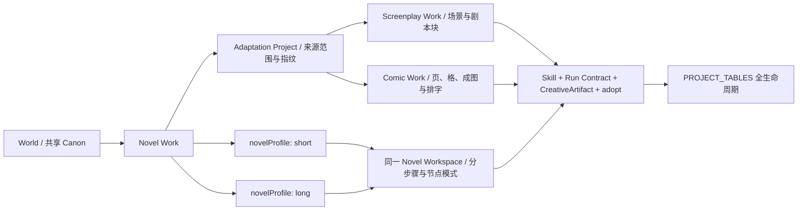
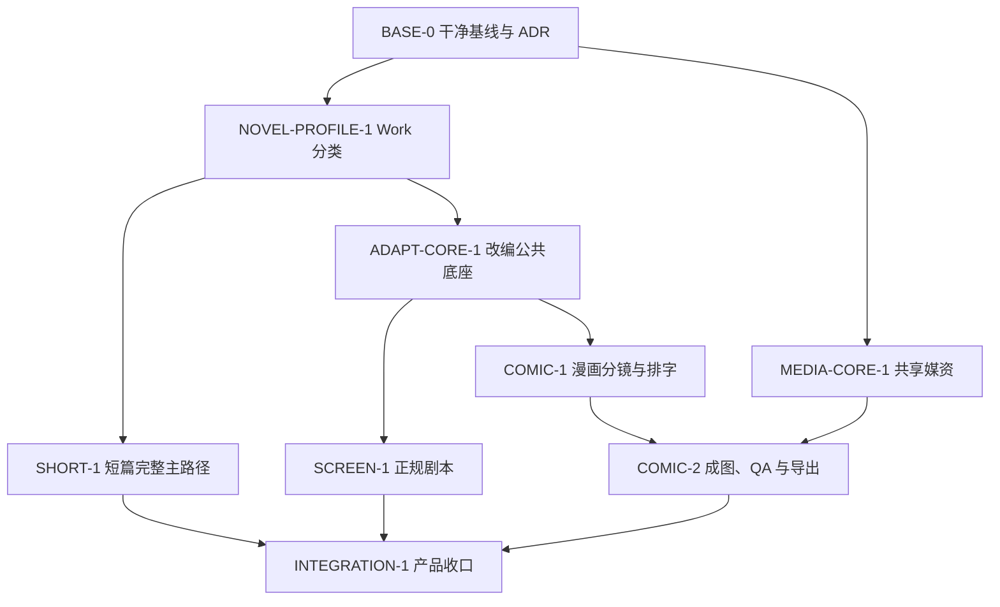

# StoryForge 短篇小说、小说改剧本、小说改漫画总施工蓝图

> 文档状态：`HISTORICAL IMPLEMENTATION RECORD / CHARTER ALIGNMENT BLOCKED`
>
> 基线审查日期：2026-08-22
>
> 基线提交：`2c9ad71`（当前 `origin/main`）
>
> 施工范围：短篇小说工作流、小说派生正式剧本、小说派生漫画（含成图、排字与导出）
>
> 数据边界：纯前端 React + TypeScript + IndexedDB；用户原稿继续只保存在本地浏览器
>
> 上位约束：`AGENTS.md`、`docs/adr/WORLD-2C-WORLD-WORK-OWNERSHIP.md`、
> `docs/AI-HARNESS-REBUILD-RELEASE-20260817.md`、
> `docs/refactor/WORLD-ENGINE-HARNESS-REPAIR-IMPLEMENTATION-PLAN-20260821.md`

> 2026-08-22 对齐更正：最新 `origin/main` 已新增项目级权威总纲
> `docs/WORLD-ENGINE-TO-PRODUCT-DEVELOPMENT-CHARTER.md`。本蓝图早于该总纲，现有剧本/漫画来源实现
> 仍读取可变小说 Work，并未从不可变 WorldRelease 冻结产品专属 SourceSelection；也尚无产品
> Release。正式完成状态已经撤回。当前差距、世界数据需求、两套产品契约和停止门以
> [`SHORT-SCREENPLAY-COMIC-WORLD-SOURCE-ALIGNMENT-AUDIT-20260822.md`](./SHORT-SCREENPLAY-COMIC-WORLD-SOURCE-ALIGNMENT-AUDIT-20260822.md)
> 为准；项目级正文来源和 V2 便携映射裁定前停止扩大产品实现。

> 历史实施回执（不代表总纲对齐或正式完成，2026-08-22）：`SHORT-1`、`ADAPT-CORE-1`、`SCREEN-1`、`COMIC-1`、
> `MEDIA-CORE-1` 已在 `feat/short-screenplay-comic` 完成。数据库升级至 v66，
> `PROJECT_TABLES` 覆盖 90 张表，严格备份格式升级至 v9；完整 `npm run ci` 通过
> 444 个测试文件 / 2,087 条测试（总覆盖率 83.98%），`npm run ci:e2e` 通过
> 54/54 条 Chromium 用例。实现保持源小说只读，以来源冻结清单、durable 候选、作者采纳、
> 完成/重开、严格导入导出与 Blob 垃圾回收形成闭环。

---

## 0. 最终裁决

### 0.1 短篇应从现有分步骤小说模式中“抽出配置”，不应另造一套创作引擎

可以，而且这是风险最低、复用率最高的嵌入方式。

短篇与长篇在 StoryForge 中都属于小说，二者共享同一条正式数据链：

```text
World
  -> Work(kind = novel, novelProfile = short | long)
  -> 故事核心 / 角色 / 规则
  -> OutlineNode 卷章结构
  -> DetailedOutline 场景细纲
  -> Chapter 正文
  -> 章后整理 / 连续性 / 审校 / 导出
```

短篇不是新的表、store、编辑器或 AI 旁路，而是小说工作流的一个显式 Profile。Profile 只负责：

1. 裁剪和重排分步骤界面；
2. 设置 5,000～25,000 字的产品边界与默认值；
3. 选择短篇 Prompt、结构建议和上下文预算；
4. 降低世界构建、多线管理和长期连续性工具的默认界面权重；
5. 仍允许作者按需打开所有既有小说工具。

现有代码已经提供两条直接证据：

- `src/lib/node-authoring/templates.ts` 已有 `short-novel` 官方模板，但它现在只是固定的
  “1 卷、3 章、每章 1,800 字”，不能代表 5,000～25,000 字完整产品；
- `src/lib/ai/prompt-seeds-novel.ts` 已有 P09S-A～D 短篇架构 Prompt，但创建入口、Work 类型、分步骤导航
  和运行合同尚未把它们连成正式短篇主路径。

所以短篇施工本质是“把已有局部能力收口为正式小说 Profile”，而不是从零开发。

### 0.2 “从长篇拆出一部分”有两种含义，必须分开

本蓝图确认第一种，预留第二种，但不混为一个功能：

| 含义 | 裁决 | 本轮边界 |
|---|---|---|
| 从现有长篇分步骤流程中抽取适合短篇的步骤 | 正式采用 | `SHORT-1` 主范围 |
| 从某部长篇的某卷/章节改写成独立短篇 | 可行，但属于后续“派生短篇” | 本轮不开放；基本短篇 Profile 稳定后另立任务和目标合同 |

第二种不能直接复制章节并宣称完成。它将来可以复用来源冻结、Brief 和 stale 基础设施，但首版不能为未交付功能预埋
`short-novel` medium 或第二个短篇创建入口；否则 Profile 与 Adaptation 会形成两套短篇真相。

### 0.3 剧本与漫画必须是派生 Work，不能覆盖源小说

剧本和漫画不是小说 Profile。它们拥有不同的成品结构、编辑器、校验规则和导出格式，因此扩展 Work 媒介类型：

```ts
type WorkKind = 'novel' | 'screenplay' | 'comic'
type NovelWorkflowProfile = 'short' | 'long'
```

- `novelProfile` 只对 `kind === 'novel'` 有效；
- 剧本、漫画由一个小说 Work 派生为同一 World 下的新 Work；
- 源小说始终只读，改编内容写入目标 Work；
- 改编根记录保存来源范围、来源哈希、Brief 与目标规格；运行证据进入 Harness，stale/missing 由当前来源与快照现场派生；
- 已完成的派生 Work 在源小说删除后仍可编辑和导出，但不能继续基于已丢失来源重新生成。

### 0.4 三个功能的准确嵌入点



产品入口不新增三个并列顶栏。现有“分步骤写作”升级为作品感知的“作品创作”入口：

- 小说 Work：进入复用的 `NovelWorkspace`；
- 剧本 Work：进入 `ScreenplayStudio`；
- 漫画 Work：进入 `ComicStudio`；
- Work 切换器始终展示媒介、短/长篇 Profile、改编来源和过期状态。

---

## 1. 当前项目状态与可复用能力审计

### 1.1 已确认可复用的能力

| 现有能力 | 代码/合同证据 | 本方案如何复用 |
|---|---|---|
| 一个 World 多个 Work | `world-ownership.ts`、`world-engine/works.ts`、WORLD-2C ADR | 短/长篇及派生剧本、漫画均落在 Work 层 |
| 分步骤小说全链 | 故事、角色、卷章、细纲、正文、章后整理、审校 | 短篇只裁剪 UI 与默认策略，不复制业务表 |
| 节点创作同源模式 | `NODE-AUTHORING-MODE-DESIGN.md`、`nodeFlows/nodeRuns` | 短篇继续可切换节点模式；以后剧本/漫画可增加领域节点 |
| 短篇节点模板 | `node-authoring/templates.ts` | 改成按目标字数和章数参数化，不再固定 3×1,800 |
| 短篇专用 Prompt | `prompt-seeds-novel.ts` P09S-A～D | 由显式 Profile 自动匹配并绑定目标字数 |
| 统一上下文读取 | `CONTEXT_SOURCES + assembleContext()` | 改编来源也必须登记并由统一 reader 解析 |
| 统一候选与采纳 | `FIELD_REGISTRY + AdoptionSchema + adopt()` | 剧本场景、漫画页格采用批量、原子采纳扩展 |
| durable Harness | Skill、Run Contract、ledger、checkpoint、CreativeArtifact、CAS | 所有正式生成进入同一受治理路径 |
| 统一生命周期 | `PROJECT_TABLES` | 新表的导出、导入、删除、迁移、重映射不写手工清单 |
| 本地全文、摘要、事实和连续性 | 现有检索与章后链路 | 长篇改编分批读取，不整本重复塞入 Prompt |

### 1.2 当前明确缺口

| 缺口 | 当前表现 | 若不先修会发生什么 |
|---|---|---|
| Work 无媒介/Profile | Work 只有标题、流派、状态、目标字数 | UI 与 Prompt 只能靠字数猜，剧本/漫画无权威类型 |
| 创建入口只按长篇 | `ProductHubPage` 固定 500,000 字；`HomePage` 最低 100,000 | 无法创建 5,000～25,000 字短篇 |
| 长度模式是启发式 | `derivePromptLengthMode()` 用 `<=50,000` 判断 short | 30,000～50,000 被误当产品短篇，Profile 改动后 Prompt 漂移 |
| 短篇模板写死 | 1 卷、3 章、每章 1,800 | 只覆盖约 5,400 字，无法适应 25,000 字 |
| 无改编根与来源血缘 | 没有小说到新媒介的 source fingerprint/stale 合同 | 源稿改动后目标作品无法判断是否过期 |
| 无正式剧本模型 | 没有场景、INT/EXT、对白块、转场、时长 | 只能生成普通 Markdown，不能称为正规剧本 |
| 无漫画成品模型 | 没有 page/panel/render/lettering | 只能生成分镜文本，不能称为小说改漫画 |
| 媒体能力处于未合并工作区 | 当前脏分支有游戏媒资实现，但尚未进入 `main` | 不能直接把临时代码当稳定共享基础 |

### 1.3 当前工作树风险

基线审查时当前分支为 `feat/ttrpg-game-platform`，大量未提交文件同时修改了：

- `src/lib/db/schema.ts`；
- `src/lib/registry/context-sources.ts`；
- `src/lib/registry/field-registry.ts`；
- `src/lib/registry/adoption-schema.ts`；
- `src/lib/registry/project-tables.ts`；
- `src/lib/agent/skill-registry.ts`；
- `src/pages/ProductHubPage.tsx`。

这些正是本功能必改的共享热点。因此正式施工前必须先完成 `BASE-0`：把游戏平台工作合并、拆分或移出施工分支，
重新建立干净基线。禁止在当前脏树直接同时改 schema 和三注册表，否则冲突不仅是 Git 冲突，还会造成生命周期登记互相覆盖。

### 1.4 不能被名称误导的邻近能力

- `NarrativeModule/NarrativeNode` 是可执行互动叙事图，不是电影/电视剧本模型；不得给它改名后冒充剧本。
- 现有 AVG/游戏制作包含视觉资产思想，但游戏发行物、剧情图和漫画页并非同一成品；只抽取通用媒资核心。
- 节点模式的 `short-novel` 模板不等于分步骤短篇产品已完成。
- Prompt 库有短篇 Prompt，不等于它们已经进入正式 Skill、Run Contract 和 UI 主路径。

### 1.5 本次现状复核证据

审查期间在当前 checkout 上确认：

- `npm run check:architecture` 通过；
- `npm run check:required-tables` 通过，当前脏工作树 schema 与 `PROJECT_TABLES` 均为 91 表；
- `npm run check:ai-entry-registry` 通过，报告 12 个入口文件、23 个调用；
- `npm run check:source-reachability` 通过，835 个源文件可达；
- `npx tsc --noEmit` 通过；
- 与 Work、多模式、Prompt 库和注册表相关的 6 个定向测试文件、53 项测试通过；
- 源码精确检索未发现正式 screenplay/comic 领域表、service 或产品测试；命中的“剧本”主要是普通文本和评测示例。

这些结果证明当前机械治理地基可复用，不证明三个新功能已存在，也不等于完整 CI、build、E2E 或真实媒体 provider 已通过。
本次未运行完整 `npm run ci` / `npm run ci:e2e`，施工阶段不得把本段写成“当前全仓库全绿”。

---

## 2. 施工不可变原则

### 2.1 十四条硬规则

1. 短篇与长篇共用小说 Canon、stores、服务、编辑器和导出路径。
2. Profile 只能改变步骤可见性、默认值、Prompt/预算策略，不能改变数据真相来源。
3. 所有旧 Work 在未显式存储新字段时按 `kind=novel, novelProfile=long` 解释。
4. 不对旧正文执行批量重写；迁移只加字段/索引或运行时惰性兼容。
5. 剧本和漫画必须新建目标 Work，源小说在改编全过程只读。
6. 跨 Work 读取只能由改编根授权，组件不能携带任意 `sourceWorkId` 拼查询。
7. AI 新读源先登记 `CONTEXT_SOURCES`；新可写内容先登记 `FIELD_REGISTRY/AdoptionSchema`。
8. 所有新表先登记 `PROJECT_TABLES`，再进入 schema、service 和 UI。
9. 模型只能产出候选；作者确认后才可 `adopt()` 正式内容。
10. 正式调用必须登记 Skill/AI 入口并进入 durable Harness；组件不得直连 `ai.start()`。
11. 一次长篇改编不得把全书正文反复回灌模型；按冻结来源清单、摘要与批次运行。
12. 漫画图像中的对白、旁白、拟声词默认不让图像模型绘制，使用本地可编辑排字层。
13. Blob、provider receipt、rights、hash、owner ID 和状态机字段均不可由模型写入。
14. 新入口取代旧入口时同步下线或变成兼容跳转；实验入口默认隐藏。

### 2.2 明确不做

- 不建 `shortStories`、`shortChapters` 或短篇专用数据库。
- 不复制 `NovelWorkspace` 为 `ShortNovelWorkspace`。
- 不用目标字数长期代替 Work Profile。
- 不把剧本保存成一个大字符串作为唯一真相。
- 不把漫画分镜 JSON 塞进 `Chapter.content`。
- 不在组件内手工扫描源小说所有表。
- 不让改编目标与源小说共享同一条可变 Chapter。
- 不承诺图片提供商能天然保持人物一致性；只提供参考图、视觉圣经、seed/能力声明和人工选片。
- 不把“已生成分镜文本”标记为“漫画功能完成”。
- 不把当前未提交的 game-production 媒资代码直接改名后发布。

### 2.3 权威层级

发生冲突时按以下顺序裁决：

1. schema、类型、注册表、service 和测试证明的当前真实行为；
2. 已接受 ADR 与当前能力基线；
3. 本蓝图冻结的新增合同；
4. 旧 README、历史路线图标题和界面文案。

---

## 3. 目标产品信息架构

### 3.1 顶层导航

将现有 `novel` 产品页签的用户文案从“分步骤写作”升级为“作品创作”。内部 Tab ID 可先保留 `novel`
以降低路由风险，等所有链接和 E2E 完成后再单独改为 `authoring`；不要在同一 PR 同时改语义和所有路由 ID。

“作品创作”只挂载一个 Work-aware shell：

```tsx
<AuthoringWorkShell scope={scope} work={work}>
  {effectiveWorkKind(work) === 'novel' && <NovelWorkspace profile={effectiveNovelProfile(work)} />}
  {effectiveWorkKind(work) === 'screenplay' && <ScreenplayStudio adaptationId={...} />}
  {effectiveWorkKind(work) === 'comic' && <ComicStudio adaptationId={...} />}
</AuthoringWorkShell>
```

同一组件必须同时供产品综合页和传统 `/workspace/:projectId` 路由使用，禁止两处各实现一套编辑器。

`NOVEL-PROFILE-1` 必须用 `rg targetWordCount/currentWordCount` 审计所有调用方。非小说 Work 不挂载小说 Prompt、正文进度、目标字数
滑杆或旧小说模块；全局卡片通过 active Work selector 决定展示媒介规格，不能因为 Project 兼容镜像为 0 就显示“0 万字小说”。
任何 `/workspace?...module=outline|chapters` 深链在活动 Work 非小说时跳转到对应 Studio 并解释原因，不能把 screenplay/comic
误送进旧 NovelWorkspace。

### 3.2 新建入口

第一层选择：

- 创建世界；
- 创建长篇小说；
- 创建短篇小说。

剧本和漫画不在空项目第一层直接创建。它们从一个已有小说 Work 的“改编”动作进入，以确保来源明确。

短篇创建表单：

- 标题；
- 简介/灵感（可空）；
- 类型；
- 目标字数：5,000～25,000，默认 10,000；
- 建议章节数：默认自动推导；高级输入只要求正整数，不把产品定义绑定到任意章节上限；
- 世界选择：当前 World、新建简化 World；
- 创作方式：分步骤（默认）/节点模板（可选，不决定数据类型）。

长篇保持现有行为和默认值，不因短篇上线改变已有滑杆、默认 Prompt 或步骤顺序。

### 3.3 小说 Work 上的改编入口

在活动小说 Work 的标题栏提供：

- `改编为剧本`；
- `改编为漫画`；
- 后续可加 `选定章节改写为短篇`。

入口向导分四步：

1. **选择来源**：全篇、卷、连续章节、自定义章节集合；
2. **设置目标**：媒介规格、受众、体量、语言、风格和保留重点；
3. **预检**：缺失正文、范围过大、来源冲突、预计批次和 API 能力；
4. **创建目标 Work**：在一个事务中写 Work + AdaptationProject + SourceUnits；此时不自动调用模型。

创建成功后作者显式点击“开始改编”，才进入第一个 Harness Run。

### 3.4 Work 切换器

每个 Work 卡展示：

- 标题；
- `小说·短篇` / `小说·长篇` / `剧本` / `漫画`；
- 状态与完成度；
- 派生来源标题和范围；
- `来源最新` / `来源已变化` / `来源缺失`；
- 最近编辑时间。

切换 Work 后由 `switchActiveWork()` 唯一更新兼容镜像，组件不得自行双写 Project。

Work.status 继续复用现有四个存储值，不再为媒介复制状态枚举；显示文案按 Work kind 映射，例如 screenplay/comic 的
`ongoing` 显示“制作中”而不是“连载中”。AdaptationStatus 只表示改编流水线阶段，不能替代 Work.status。

---

## 4. 领域模型与数据合同

### 4.1 Work 类型扩展

在 `src/lib/types/world-ownership.ts` 增加：

```ts
export type WorkKind = 'novel' | 'screenplay' | 'comic'
export type NovelWorkflowProfile = 'short' | 'long'

export interface Work {
  // 既有字段保持不变
  kind?: WorkKind
  novelProfile?: NovelWorkflowProfile | null
}
```

字段暂时可选是为了旧数据库兼容；所有领域代码通过 resolver 读取：

```ts
function effectiveWorkKind(work: Work): WorkKind {
  return work.kind ?? 'novel'
}

function effectiveNovelProfile(work: Work): NovelWorkflowProfile | null {
  return effectiveWorkKind(work) === 'novel' ? (work.novelProfile ?? 'long') : null
}
```

禁止 UI 到处写 `work.kind ?? 'novel'`；兼容逻辑必须集中在 `work-kind.ts`。当真实旧库、v1～v4 备份和回滚
证据充分后，再另立任务把字段改为 required。

### 4.2 Work 不变量

| 规则 | 处理 |
|---|---|
| `kind=novel` | `novelProfile` 必须解析为 `short` 或 `long` |
| `kind=screenplay/comic` | `novelProfile` 必须为 `null/undefined` |
| 旧 Work 无字段 | 解释为长篇小说，不写回正文或其它表 |
| 已显式保存 `kind` | 创建后不可原位改媒介；改媒介必须创建派生 Work。只有 legacy 缺失值可初始化为 novel |
| 小说 `novelProfile` | 允许 short/long 原位切换，但必须走第 5.6 节预检 |
| 改编源 | 必须是同一 LocalWorkspace、同一 World 的小说 Work |
| 目标字数 | 小说使用；剧本/漫画可保留兼容值 0，但目标规格在 AdaptationProject 中表达 |

Work 不保存反向 `sourceAdaptationId`。派生关系由 `adaptationProjects.workId` 的唯一索引查询，避免 Work 与改编根形成循环外键
和双写漂移。

### 4.3 不给 Project 增加新的类型镜像

现有 Project 兼容镜像继续承担标题、目标字数等旧字段，但本功能**不新增** `activeWorkKind` 或
`activeNovelProfile` 镜像。类型/Profile 只保存在 Work：

- `AuthoringWorkShell` 根据 Project.activeWorkId 解析真实 `WorkspaceScope` 与 Work 后路由 Studio；
- 新 Prompt/Skill 显式接收真实 Work，旧 Prompt 仍按既有 Project 字段兼容；
- ProductHub 不能只拿 Project 猜作品类型，必须通过统一 active Work selector；
- 这样无需修改 `Project` 类型、镜像 service 和旧备份结构，也消除一组无价值双写。

### 4.4 改编公共根表 `adaptationProjects`

```ts
type AdaptationMedium = 'screenplay' | 'comic'
type AdaptationStatus =
  | 'source-frozen'
  | 'brief-review'
  | 'planning'
  | 'producing'
  | 'review'
  | 'complete'

interface AdaptationProjectBase {
  id?: number
  projectId: number
  worldId: number
  workId: number                 // 目标 Work，domain owner
  sourceWorkId: number | null    // 删除源后置 null
  lineageMode: 'linked' | 'detached'
  status: AdaptationStatus
  sourceSelectionMode: 'entire-work' | 'outline-subtree' | 'chapter-range' | 'chapters'
  sourceOutlineRootId: number | null
  sourceStartChapterId: number | null
  sourceEndChapterId: number | null
  brief: AdaptationBriefV1 | null
  plan: AdaptationPlanV1 | null
  activeSourceManifestVersion: number
  activeSourceManifestHash: string
  briefSourceManifestVersion: number | null
  planSourceManifestVersion: number | null
  revision: number
  createdAt: number
  updatedAt: number
}

type AdaptationProject = AdaptationProjectBase & (
  | {
      medium: 'screenplay'
      targetSpec: ScreenplayTargetSpecV1
      visualBibleSourceManifestVersion: null
      visualBible?: null
    }
  | {
      medium: 'comic'
      targetSpec: ComicTargetSpecV1
      visualBibleSourceManifestVersion: number | null
      visualBible: ComicGlobalVisualBibleV1 | null
    }
)
```

`brief`、`plan`、`targetSpec`、`visualBible` 使用原生结构化对象，不保存二次 JSON 字符串。导入导出层负责
structured clone 和 schema 校验，避免历史上复杂对象字符串化造成的类型漂移。Brief、Plan 和 Visual Bible 不得嵌入本地
数据库 ID；它们引用来源单元或漫画媒体时只使用稳定 key。

Root 对象必须有体积上限：Brief/Plan 只保存全局取舍、幕/集/章级骨架和假设，ComicGlobalVisualBible 只保存全局画风、色彩、
镜头和禁忌，不重复嵌入全部角色/地点条目、场景卡、页面、panel、正文或图片元数据。剧本场景卡直接使用
`screenplayScenes.status=card`，漫画页格计划直接进入 Pages/Panels 候选；避免 root 大 JSON 与子表形成两套计划真相。

当 `lineageMode=linked` 且 source Work 可用时，`sourceSelectionMode` 的三个可空引用字段按 mode 恰好满足：

- `entire-work`：三个字段全空；
- `outline-subtree`：只有 `sourceOutlineRootId` 非空；
- `chapter-range`：只有起止 Chapter ID 非空；
- `chapters`：三个字段全空，选择集合由活动 manifest 的 SourceUnits 表达。

source/outline/chapter 被注册表删除形成 missing，或作者显式 detached 后，本地 selection ref 允许部分/全部为空；mode、活动 manifest
和历史 SourceUnits 继续描述当时选区，不能为满足正常态不变量而伪造 ID。任何仍非空的 ref 仍必须属于原 source scope。

输入向导可以接收本地 ID，但不能把带本地 ID 的 union JSON 直接塞入 root；显式列字段才能进入现有
`PROJECT_TABLES.exportRemap`、删除和导入重映射。

medium 与目标 Work 是硬匹配：`screenplay -> kind=screenplay`、`comic -> kind=comic`。不满足时创建、打开、导入和采纳全部
fail closed。改编标题只取目标 Work.title，不在 AdaptationProject 镜像。短篇创建只走 Novel Profile，不创建 AdaptationProject。

新建的 `lineageMode=linked` 必须有合法 sourceWorkId；源 Work 后来被注册表删除时允许保留 linked + null，effective
freshness 强制为 missing，且不得自动猜测替代源。
`lineageMode=detached` 只能由作者显式“脱离来源”操作产生，此时 sourceWorkId 和 selection 的本地引用必须为空，历史 unit 的
hash/summary/key 保留但本地 source refs 置空；脱离后首版不支持自动重新绑定。

### 4.5 来源清单表 `adaptationSourceUnits`

```ts
type AdaptationSourceUnitKind = 'work' | 'outline-node' | 'chapter'

interface AdaptationSourceUnit {
  id?: number
  projectId: number
  workId: number
  adaptationProjectId: number
  manifestVersion: number
  sourceKind: AdaptationSourceUnitKind
  sourceOutlineNodeId: number | null
  sourceChapterId: number | null
  sourceUnitKey: string
  order: number
  label: string
  contentHash: string
  summary: string
  wordCount: number
  sourceUpdatedAt: number | null
  createdAt: number
}
```

来源清单是**追加式不可变快照**，保存引用、hash 和有界摘要，不复制整篇正文。生成时由已授权 reader 以稳定键回读当前内容，
并把真实读取
轨迹写入 Context Manifest。这里有意不用 `sourceKind + sourceRecordId` 这种多态外键：linked 且来源可用的正常态下，
`sourceKind=work` 时两个专用引用都为空，`outline-node` 时只有 `sourceOutlineNodeId` 非空，`chapter` 时只有 `sourceChapterId` 非空，
才能让 `PROJECT_TABLES` 确定性声明引用、删除和导入 remap；missing/detached 允许对应本地 ref 置空，但不改变 sourceKind 和历史证据。
每个 SourceUnit 的源 Work 唯一由父 AdaptationProject.sourceWorkId 授权，不在每行重复保存 sourceWorkId。

每个 manifest 恰有一个 `work` 单元，内容是有界的 Work 元数据与目标 Work 作用域内 StoryCore；它不是全文容器。其余单元由
selection 确定性展开：`entire-work` 纳入全部 canonical OutlineNode 与 Chapter；`outline-subtree` 纳入子树节点及其绑定章节；
`chapter-range/chapters` 纳入选中 Chapter 和这些章节直接绑定的 OutlineNode，并去重后按 canonical 顺序排列。任何模式都不能
顺手纳入选区外正文。创建前展示“正文非空章节数/总字数/仅大纲单元数”；零内容单元时拒绝创建，只有大纲而无正文时允许建立
实验性改编，但必须明确标为 outline-only，不能在最终完成门声称是完整小说改编。

`sourceUnitKey` 是 adaptation 内的稳定逻辑身份：同一来源记录跨 manifest 版本复用同一个 key，新纳入的来源生成新 key；
导入重映射后 key 不变。旧版本 SourceUnit 只要仍被场景/panel 引用就永久保留，重新同步只追加新版本，不原地修改旧 hash。
SourceUnit 没有公开单条删除入口，只随整个 AdaptationProject 删除。快照内容字段不可修改；源删除或作者显式脱离时只允许注册表/
领域 service 把本地 source ref 置空，hash、summary、key、order 和 manifestVersion 仍保持原值。

创建事务不调用 AI。`summary` 优先取既有已确认章节/大纲摘要；没有时保存确定性截断摘要/标题信息并标明来源，后续 Brief Run
可生成独立候选，但未确认候选不能回写 SourceUnit 冒充源稿事实。

### 4.6 剧本场景表 `screenplayScenes`

```ts
type ScreenplayBlock =
  | { id: string; type: 'action'; text: string }
  | { id: string; type: 'character'; characterId?: number; name: string;
      extension?: 'V.O.' | 'O.S.' | 'O.C.' | "CONT'D"; dualDialogue?: boolean }
  | { id: string; type: 'parenthetical'; text: string }
  | { id: string; type: 'dialogue'; text: string }
  | { id: string; type: 'transition'; text: string }
  | { id: string; type: 'shot'; text: string }
  | { id: string; type: 'note'; text: string }

interface ScreenplayScene {
  id?: number
  projectId: number
  workId: number
  adaptationProjectId: number
  stableKey: string
  planSectionKey: string             // 引用已确认 Plan 的幕/集/序列稳定 key
  episodeNumber: number             // 1-based；电影固定为 1
  sceneNumber: number               // 集内编号
  order: number                     // 全剧唯一排序
  intExt: 'INT' | 'EXT' | 'INT_EXT'
  location: string
  timeOfDay: string
  summary: string
  estimatedSeconds: number
  sourceUnitIds: number[]
  sourceReviewManifestVersion: number
  blocks: ScreenplayBlock[]
  status: 'card' | 'draft' | 'reviewed' | 'locked'
  revision: number
  createdAt: number
  updatedAt: number
}
```

场景是最小批量生成与编辑单元。剧本块使用有序 union，不把格式编码进不可解析的富文本。

### 4.7 漫画页、格、视觉条目与媒体表

```ts
interface ComicPage {
  id?: number
  projectId: number
  workId: number
  adaptationProjectId: number
  stableKey: string
  chapterNumber: number
  order: number
  allowPanelOverlap: boolean
  summary: string
  status: 'planned' | 'storyboarded' | 'reviewed' | 'locked'
  revision: number
  createdAt: number
  updatedAt: number
}

interface ComicPanel {
  id?: number
  projectId: number
  workId: number
  pageId: number
  stableKey: string
  order: number
  frame: { x: number; y: number; width: number; height: number }
  sourceUnitIds: number[]
  sourceReviewManifestVersion: number
  shot: ComicShotV1
  action: string
  visualPrompt: string
  negativePrompt: string
  continuityRefs: ComicContinuityRefV1[]
  lettering: ComicLetteringItemV1[]
  selectedMediaAssetKey: string | null
  imageTransform: ComicImageTransformV1  // fit/scale/offset/rotation，本地合成与导出共用
  status: 'draft' | 'reviewed' | 'locked'
  revision: number
  createdAt: number
  updatedAt: number
}

type ComicVisualSubjectKind = 'character' | 'location' | 'prop' | 'style'

interface ComicVisualSubject {
  id?: number
  projectId: number
  workId: number
  adaptationProjectId: number
  stableKey: string
  kind: ComicVisualSubjectKind
  characterId: number | null       // 仅 character；必须有目标 Work binding
  locationRefKey: string | null    // 现有 Geography.locations 内的稳定字符串 ID
  label: string
  design: ComicVisualSubjectDesignV1
  sourceUnitIds: number[]
  sourceReviewManifestVersion: number
  selectedMediaAssetKey: string | null
  status: 'draft' | 'reviewed' | 'locked'
  revision: number
  createdAt: number
  updatedAt: number
}

type ComicMediaAssetRole =
  | 'panel-render'
  | 'character-sheet'
  | 'location-sheet'
  | 'prop-sheet'
  | 'style-reference'

interface ComicMediaAsset {
  id?: number
  projectId: number
  workId: number
  adaptationProjectId: number
  stableKey: string
  role: ComicMediaAssetRole
  panelId: number | null
  subjectKey: string | null
  blobObjectId: number
  origin: 'generated' | 'uploaded'
  candidateIndex: number
  requestHash: string | null
  promptHash: string | null
  referenceAssetKeys: string[]
  providerReceipt: MediaProviderReceiptV1 | null
  rights: MediaRightsV1
  quality: ComicRenderQualityV1
  disposition: 'available' | 'rejected'
  createdAt: number
  updatedAt: number
}
```

文字层 `lettering` 至少支持：对白气泡、思想气泡、旁白框、拟声词；每项包含文本、几何位置、字体、字号、方向、
描边、尾巴锚点和层级。图片模型默认只生成无字画面。Panel frame 使用 0～1 的归一化坐标；页面尺寸和阅读方向只取
AdaptationProject.targetSpec，不在每页重复保存。

`ComicVisualSubject` 是角色/地点/道具/风格条目的唯一真相，所选设定图只保存 `ComicMediaAsset.stableKey`；Panel 同样只通过
`selectedMediaAssetKey` 选择成图。`ComicMediaAsset.disposition` 只表达资源是否仍可用，不表达“被选中”，因此没有第二份选片状态。
Page/Panel status 只表达内容成熟度；“正在生成”从 durable media Run 派生，“已有成图”从可解析的 selectedMediaAssetKey 派生，
不保存容易在取消、崩溃或删图后漂移的 rendering/rendered 状态。
上传替换的 asset 使用 `origin=uploaded`、`requestHash/promptHash/providerReceipt=null`，但仍必须填写来源和 rights 声明；不能伪造
模型回执。
role/owner 组合是判别联合：`panel-render` 必须有 panelId 且 subjectKey 为空；其余四类必须有 subjectKey 且 panelId 为空，
并分别匹配 character/location/prop/style VisualSubject。generated 候选由非空 requestHash 的 unique compound index 保证幂等；
uploaded 行不进入该 nullable compound index，只由 `[workId+stableKey]` 保证身份唯一。

VisualSubject 的 kind/ref 规则是：character 新采纳时 characterId 必须非空且已绑定目标 Work，location 新采纳时 locationRefKey 必须
当前可解析，prop/style 的两个外部 ref 必须都为空。角色或地点日后被删除时条目不随之删除：characterId 可被注册表置 null，
locationRefKey 可派生为 missing，label/design/source evidence/已选图仍保留。missing 条目禁止参与新生成和新的 complete 门，作者可
重新绑定或显式改为 prop；既有已完成作品仍可打开和导出，不因 Canon 删除而丢画稿。

### 4.8 表索引与引用方向

schema 索引固定为：

| 表 | 必需索引 |
|---|---|
| `adaptationProjects` | `++id, projectId, worldId, &workId, sourceWorkId, medium, status` |
| `adaptationSourceUnits` | `++id, projectId, workId, adaptationProjectId, manifestVersion, [adaptationProjectId+manifestVersion], sourceKind, sourceOutlineNodeId, sourceChapterId, &[adaptationProjectId+manifestVersion+order], &[adaptationProjectId+manifestVersion+sourceUnitKey]` |
| `screenplayScenes` | `++id, projectId, workId, adaptationProjectId, &[workId+stableKey], status, &[adaptationProjectId+order], &[adaptationProjectId+episodeNumber+sceneNumber]` |
| `comicPages` | `++id, projectId, workId, adaptationProjectId, &[workId+stableKey], status, &[adaptationProjectId+order]` |
| `comicPanels` | `++id, projectId, workId, pageId, &[workId+stableKey], status, &[pageId+order]` |
| `comicVisualSubjects` | `++id, projectId, workId, adaptationProjectId, &[workId+stableKey], kind, characterId, locationRefKey, status` |
| `comicMediaAssets` | `++id, projectId, workId, adaptationProjectId, &[workId+stableKey], role, origin, panelId, subjectKey, blobObjectId, disposition, requestHash, &[workId+requestHash+candidateIndex]` |

禁止数组内容承担查询索引。`sourceUnitIds` 使用现有 `exportRefRemap: id-array` 完成便携重映射，但不依赖通用 Work 删除器处理
array ref——当前 `cascadeRegisteredReferences()` 只递归 simple ref。SourceUnit 不允许单删；删除 Adaptation 时 SourceUnits、Scenes
和 Pages/Panels 一起级联，因此不会留下孤儿数组。`continuityRefs` 只保存稳定 key/hash，不保存本地数据库 ID。

### 4.9 状态机与单一写入口

AdaptationProject 创建事务已经冻结 v1 来源，因此初始状态直接是 `source-frozen`，不保留没有实际含义的 `draft`。合法推进：

```text
source-frozen -> brief-review -> planning -> producing -> review -> complete
                                      ^          |          |
                                      |----------|----------|
                                      作者解锁/退回修订
```

- `brief-review -> planning`：已采纳 Brief 且 `briefSourceManifestVersion === activeSourceManifestVersion`；
- `planning -> producing`：已采纳 Plan 且版本匹配；comic 还要求已采纳当前版本的 global visual bible，计划要求的
  character/location VisualSubject 已 reviewed、无 missing 且 sourceReviewManifestVersion 匹配；设定图可在进入成图批次前再选择；
- `producing -> review`：目标规格要求的场景/页格已齐，不存在未结算必需批次；
- `review -> complete`：媒介硬 validator、来源/rights/导出预检通过，作者显式确认；outline-only 不能以“小说完整改编”完成；linked
  来源必须现场验证 available/unchanged，且所有目标单元 sourceReviewManifestVersion 等于 activeSourceManifestVersion；detached 则
  依赖作者此前的显式脱离确认；
- `complete -> review/producing`：作者明确解锁后允许继续编辑；
- 暂停只使用既有 `Work.status=paused`，AdaptationStatus 保留暂停前的精细阶段；当前产品没有 archive 值，本轮不伪造“归档”；
- 新建且尚无目标内容时 Work.status=drafting；首次进入 producing 后提升为 ongoing，退回 Brief/Plan 或来源重同步不降回 drafting；
  complete 对应 completed，解锁后为 ongoing；从 paused 恢复时结合 AdaptationStatus 与是否已有目标内容恢复 drafting/ongoing；
- 只有 adaptation service 能转换状态，并与粗粒度 Work.status 在同一事务协调；UI/AI 不能直接赋值。

完成后源小说或 World 角色被作者删除，不自动篡改历史 AdaptationStatus；Studio 额外派生 health=`source-missing/needs-repair` 并限制
新生成，既有成品仍可导出。作者解锁并再次完成时必须重新满足当前完成门。

---

## 5. 功能一：短篇小说完整施工设计

### 5.1 产品定义

- 正式范围：目标字数 5,000～25,000 中文字；
- 默认：10,000 字；
- 结构：通常 1 卷、1～8 章，但这只是默认建议，不是硬上限；数据库仍保存显式卷根和章节点；
- 体量边界属于创建/完成合同，不是每次键入时截断正文的硬限制；
- 用户可显式把短篇切换为长篇 Profile，反向切换必须先通过范围预检。

### 5.2 为什么仍保留卷节点

现有 Chapter、细纲、拖拽、导出和上下文大量依赖卷章树。短篇若另建扁平章节结构，会导致：

- 章节 FK 和排序逻辑分叉；
- 大纲/细纲/正文 Prompt 出现两套；
- 导入导出与章节移动需要新旁路；
- 后续扩写成长篇要迁移内容。

因此短篇创建时生成一个“短篇正文”卷根。UI 可把单卷标题折叠或弱化显示，但正式数据仍是同一
`OutlineNode(volume -> chapter)` 结构。

### 5.3 动态结构建议

模板不再写死 3×1,800。建议纯函数：

```ts
deriveShortNovelStructure(targetWords: number, preferredChapterCount?: number)
  -> { volumeCount: 1; chapterCount: number; targetWordsPerChapter: number }
```

默认规则：

| 目标字数 | 默认章数 | 每章建议 |
|---:|---:|---:|
| 5,000～7,999 | 2 | 2,500～4,000 |
| 8,000～12,999 | 3 | 2,667～4,333 |
| 13,000～17,999 | 4 | 3,250～4,500 |
| 18,000～21,999 | 5 | 3,600～4,400 |
| 22,000～25,000 | 6 | 3,667～4,167 |

作者创建后可继续使用现有大纲工具增删章节；系统只警告极端章均字数，不替作者改结构，也不另造短篇章节上限。

### 5.4 分步骤导航裁剪

“隐藏”仅指默认导航密度，不代表删除数据或禁止打开。

| 模块 | 短篇默认 | 长篇默认 | 说明 |
|---|---|---|---|
| 作品信息、灵感、参考资料 | 显示 | 显示 | 共享现有能力 |
| 故事核心 | 显示且提前 | 显示 | 短篇强调单一核心变化 |
| 角色 | 显示 | 显示 | 短篇提示必要人物上限，不做硬限制 |
| 创作规则、文风 | 显示 | 显示 | 同一正式字段 |
| 世界观基础 | 精简卡片 | 完整 | 可展开所有世界工具 |
| 多世界/通道 | 默认折叠 | 按项目显示 | 不删除 World 能力 |
| 主线/支线 | 合并为“事件线”视图 | 完整 | 底层仍是 storyArcs |
| 卷章大纲 | 紧凑单卷视图 | 完整树 | 同一 OutlineNode |
| 场景细纲 | 显示 | 显示 | 短篇同样需要场景控制 |
| 正文 | 显示 | 显示 | 同一 Chapter editor |
| 伏笔、状态、物品、年表、事实 | 默认折叠 | 显示 | 章后链路仍可运行，不建短篇旁路 |
| 一致性/审校 | 显示简版 | 完整 | 安全规则不降低 |

步骤裁剪使用声明式 `NovelWorkflowDefinition`，不要在每个组件里散落 `if (short)`：

```ts
interface NovelWorkflowStep {
  id: ExistingWorkspaceModuleId
  profiles: NovelWorkflowProfile[]
  visibility: 'primary' | 'secondary' | 'hidden'
  prerequisites: ExistingWorkspaceModuleId[]
}
```

现有长篇步骤清单先完整建模为 `long` Golden Master，再添加 short override；保证未命中 short 时渲染顺序完全不变。

### 5.5 Prompt 与 Harness

1. 废止“仅按 targetWordCount 推断产品 Profile”的新调用方式；
2. 保留 `derivePromptLengthMode()` 作为旧模板兼容函数，并改名/标注为 legacy applicability；
3. 新增 `resolveNovelPromptMode(work, projectMirror)`：优先真实 Work Profile，旧 Work 才回退字数启发式；
4. P09S-A～D 的 `target_words` 自动绑定活动 Work 目标，不要求作者手填；
5. 短篇故事设计 Skill 优先读故事核心、人物、创作规则和必要世界资料，不默认加载长期账本全集；
6. 正文仍复用 `prose` durable Run、CreativeArtifact、stale/CAS 和作者采纳；
7. Run Contract 冻结 `workKind=novel`、`novelProfile=short`、目标字数、当前累计字数和章节目标；
8. Profile 在 Run 期间改变时，旧候选必须变为 stale，不能继续采纳。

### 5.6 字数边界与状态转换

| 操作 | 规则 |
|---|---|
| 创建短篇 | 4,999 和 25,001 直接拒绝；5,000 与 25,000 接受 |
| 编辑目标字数 | 超范围需显式切换 long，不静默改变 Profile |
| 正文临时超范围 | 允许保存，不截断、不删字，显示范围告警 |
| 标记完成 | 统计实际正文；低于 5,000 或高于 25,000 时阻断完成，可保持 drafting 或显式切换 long；不允许用“接受告警”绕过产品定义 |
| 短转长 | 原位切换 Profile，所有大纲/章节 ID 不变 |
| 长转短 | 作者选择 5,000～25,000 的新目标，且重算实际正文不超过 25,000 时允许；不限制章数，正文不自动删改 |

“实际正文”必须通过一个 Work-scoped selector 对 canonical Chapter 的 `htmlToPlainText()` 结果重新调用现有 `countWords()`（当前定义为
非空白字符数）后求和；`Work.currentWordCount` 与 `Chapter.wordCount` 只作缓存，不能单独决定 Profile 切换或完成门。发现缓存漂移时由
领域 service 修正缓存，但完成事务仍使用本次重算值，避免旧计数让 25,001 字作品误通过。

### 5.7 短篇功能清单

- 短篇创建卡与 5,000～25,000 字输入；
- Work 类型徽标与短/长 Profile 切换；
- 紧凑分步骤导航；
- 动态单卷章结构；
- 短篇故事核心、压缩、开场、结尾 Prompt 主路径；
- 短篇目标与进度条；
- 短篇结构诊断：人物/场景/复线/背景负担，只做建议；
- 同一正文编辑、审校、查找替换、导入导出；
- 短篇节点模板按 Work 目标参数化；
- 原位扩写为长篇；
- 多 Work 隔离与旧项目无感兼容。

---

## 6. 改编公共底座 `ADAPT-CORE-1`

剧本和漫画虽然成品不同，但“从小说选择来源、冻结证据、生成 Brief、处理源稿变化”的部分必须共用。先完成公共底座，
再开发任一媒介，避免两套来源扫描、两套 stale 规则和两套批处理器。

### 6.1 改编创建事务

输入：

```ts
type CreateAdaptationInput = {
  sourceScope: WorkspaceScope
  sourceWorkId: number
  title: string
  sourceSelection: AdaptationSourceSelectionV1
} & (
  | { medium: 'screenplay'; targetSpec: ScreenplayTargetSpecV1 }
  | { medium: 'comic'; targetSpec: ComicTargetSpecV1 }
)
```

事务内顺序：

1. `resolveScope()` 验证当前来源 World/Work，且 `sourceWorkId === sourceScope.workId`；
2. 验证 source Work 为 `kind=novel`；
3. 确定性解析卷章范围，拒绝不存在、重复、乱序或跨 Work ID；
4. 创建目标 Work；
5. 创建 AdaptationProject，规范化 selection 显式引用，活动 manifest 版本为 1；
6. 创建有序、不可变的 v1 SourceUnits 与初始 hash；
7. 切换活动 Work 并由 service 更新 Project 兼容镜像；
8. 事务提交后打开目标 Studio，不启动 AI。

任何一步失败必须整体回滚，不能留下孤儿 Work。当前 `createWorldWork()` 是独立写入口，不能在这里直接串联调用；先抽取不触发
事务的 record builder，让 `createAdaptation()` 在同一个 Dexie 事务内写 Work/root/units/Project mirror。

### 6.2 来源选择合同

```ts
type AdaptationSourceSelectionV1 =
  | { mode: 'entire-work' }
  | { mode: 'outline-subtree'; outlineNodeId: number }
  | { mode: 'chapter-range'; startChapterId: number; endChapterId: number }
  | { mode: 'chapters'; chapterIds: number[] }
```

该 union 只属于 service 输入。落库时规范化为 AdaptationProject 的显式 selection 字段和 v1 SourceUnits，不把本地 ID 藏进
无法 remap 的 JSON。

确定性 resolver 输出唯一有序清单，顺序采用 canonical chapter sequence，不采用 UI 当前排序猜测。非连续章节选择需要
在向导中明确显示缺口；系统不能暗中补入中间章节。`chapters` 模式的重复 ID 直接视为非法输入，不静默去重，以便调用方尽早
暴露错误；选择顺序由 canonical sequence 统一重排并在创建前展示。四种 mode 必须调用同一个 resolver，剧本/漫画不得各自
扫描 Outline/Chapter。

### 6.3 来源指纹

总指纹由版本化 canonical serializer 计算：

```text
activeSourceManifestHash = hash(
  schemaVersion
  + sourceWorkStableCode
  + normalizedSelectionMode
  + ordered(sourceUnitKey, sourceKind, contentHash, order)
)
```

要求：

- 字段顺序确定；
- 不使用本地自增 ID 作为跨导入唯一身份；
- 同内容重复计算结果相同；
- 导入重映射后 hash 保持，内容变化后 hash 改变；
- Source manifest 只指纹化作者明确选择的小说结构/正文，不把全部角色和 World Canon 塞入根 hash；其它实际 Canon 读取由
  每次 Harness Context Manifest 冻结，避免一个无关世界字段变化就让整部改编误报 stale。

### 6.4 stale 与重新同步

Studio 打开、开始 Run、恢复 Run 和采纳前都检查来源：

| 状态 | 行为 |
|---|---|
| `available` 且 hash 相同 | 正常生成/采纳 |
| `changed` | 已有目标内容可编辑；新生成被阻断，要求查看变化单元并确认同步 |
| 部分 unit `missing` | 已有目标内容可编辑；显示缺失清单；禁止声称来源完整 |
| source Work 删除 | `sourceWorkId=null`；freshness resolver 强制返回 missing，目标成品保留 |

freshness 是读取时派生结果，不在 AdaptationProject/SourceUnit 再保存一套真相。resolver 按 selection mode 重新枚举当前来源，
先比较 SourceUnit 的 `sourceUpdatedAt`、数量、顺序和引用；只对可能变化的行重算内容 hash。Studio 列表可以显示“尚未检查”，
但开始/恢复 Run 和采纳前必须现场重算，不能相信旧 UI 缓存。

每次 `adaptation.sourceContent` 真正读取某个 unit 时仍要重算该 unit 内容 hash；进入最终 review/complete 前执行一次全 manifest
重验。这样快速检查不必每次读取全书，同时不能只靠 updatedAt 把错误内容送入模型或完成门。

由于 SourceUnit 不复制全文，UI 只能可靠展示“新增/删除/顺序/标题/字数/摘要/hash 变化”；不得承诺完整逐字 diff。只有对应
Harness Run 确实保留了合法输入快照时，才可按该快照提供更细对比。

重新同步不能自动改目标场景/页格，也不能覆盖旧来源证据。它只：

1. 作者确认变化单元和缺失处理策略；
2. `activeSourceManifestVersion + 1`，为新版本追加一批不可变 SourceUnits；同一来源复用 sourceUnitKey；
3. 以 CAS 更新 root 的 active version/hash/revision；旧 SourceUnits、Brief、Plan、场景和 panel 零修改；
4. 根据 `briefSourceManifestVersion`、`planSourceManifestVersion`、`visualBibleSourceManifestVersion` 和目标单元的旧 SourceUnit IDs
   生成“可能受影响目标单元”候选；
5. 由作者逐项选择重跑、继续沿用或手工处理；决定写入 Harness ledger，对应目标行的系统字段
   `sourceReviewManifestVersion` 只有在处理事务成功后才推进到新版本，sourceUnitIds 仍保留真实旧证据；
6. 同步事务把 AdaptationStatus 退到 `brief-review`，要求依次重新确认 Brief/Plan/漫画视觉规则；已有目标内容与 Work.status=ongoing
   保持。complete 项目必须先由作者显式解锁，不能后台同步并悄悄改掉完成基线。

如果同步事务或 SourceUnit 批量写入任一步失败，新版本和 root 指针整体零写入。历史 manifest 版本不能在引用仍存在时清理。

### 6.5 改编 Brief

Brief 是作者确认的改编意图，不是模型自由摘要。统一包含：

- 核心主题/情绪；
- 必须保留的人物、事件、关系、台词或意象；
- 可删、可合并、可重排、允许新增；
- 目标受众与分级；
- 目标体量；
- 叙事视角；
- 时间/成本上限；
- 来源偏离说明；
- 未解决问题和显式假设。

流程：确定性来源清单 → Brief 候选 → 作者编辑确认 → 锁定 Brief hash → 才能进入结构规划。

改编角色不建新表。世界角色身份继续引用现有 `characters`，目标媒介中的角色职能、弧光和结局继续使用
`workCharacterBindings`。Brief 候选可以提出“保留/合并/删除/新增角色”，但作者确认后要先通过既有角色/绑定采纳路径建立目标
Work 的 cast；剧本场景凡携带 characterId、漫画 character VisualSubject 凡新采纳时都只能引用已绑定角色。剧本 cue-only 小角色
可以只保存 name 而不伪造 ID。不得把源 Work 的可变 binding 直接共享给目标 Work，也不得只按同名角色自动合并。

### 6.6 公共上下文源

新增 Context key：

| Context key | 内容 | ownerFrom/参数 |
|---|---|---|
| `adaptation.sourceManifest` | 有序来源单元、hash、可用性、摘要 | `adaptationProjectId` |
| `adaptation.sourceContent` | 当前批次授权的源正文/纲要 | `adaptationProjectId + manifestVersion + sourceUnitKeys` |
| `adaptation.currentBrief` | 已确认 Brief | 目标 Work |
| `adaptation.currentPlan` | 已确认计划 | 目标 Work |
| `screenplay.currentScenes` | 当前/相邻场景与角色出场摘要 | 目标 Work + scene range |
| `comic.currentPages` | 当前/相邻页格、排字和所选成图摘要 | 目标 Work + page range |
| `comic.visualBible` | 根记录中的全局画风规则 + VisualSubject 角色/地点/道具/风格板 + 已选参考图摘要 | 目标 Work |

`assembleContext()` 增加受类型约束的 adaptation selector 参数。reader 先读目标 AdaptationProject，再解析其授权的
sourceWorkId；不得暴露通用“读取任意 Work”工具。

### 6.7 公共写回与 Adoption

新增写回以“内容字段”和“系统字段”分离：

允许模型候选进入 FIELD_REGISTRY 的内容字段：

- Adaptation Brief/Plan 的可编辑内容；
- 根记录 `ComicGlobalVisualBibleV1` 的全局画风规则，以及 ComicVisualSubject 的 label/design/source evidence 内容；
- ScreenplayScene 的 planSectionKey、summary、heading content、estimatedSeconds、source evidence、blocks；
- ComicPage 的 summary；
- ComicPanel 的 frame 候选、shot、action、visualPrompt、negativePrompt、continuityRefs、lettering 文本草稿。

禁止模型写入：

- project/world/work/adaptation/page/panel/blob/provider 的 ID；
- hash、status、revision、selected、rights、receipt、timestamps、sourceReviewManifestVersion；
- ComicPage.allowPanelOverlap、ComicPanel.imageTransform 等作者/系统布局策略；
- 布局外框的越界几何；
- 任何 owner 字段。

AI 候选 DTO 与数据库 DTO 必须分开：模型只输出本次 Run Manifest 暴露的 `sourceUnitKey`、角色 resource key 和稳定 output key，
不得输出本地数值 ID。Run Contract 冻结 `sourceManifestVersion`；Adoption 以
`(adaptationProjectId, sourceManifestVersion, sourceUnitKey)` 精确解析 SourceUnit，再把 source keys 映射为 `sourceUnitIds`、角色
resource key 映射为 `characterId`，并验证 `planSectionKey` 属于本次 Run 冻结的已确认 Plan，最后执行 owner/CAS 校验。若活动
manifest/Plan 已变化或任何 key 无法在冻结版本解析，整批 stale/阻断，不能改用新版本同名 key，也不能按名称猜第一条记录。
新行的 sourceReviewManifestVersion 由 Adoption 系统写为 Run 冻结版本，不采信候选值。

Panel frame 允许作为受治理候选，但 schema 强制 0～1 归一化、最小尺寸、页面边界和模板允许的重叠规则；非法几何不进入正式表。

批量采纳使用 service 建立临时映射：候选 stableKey → 数据库 ID。先完整校验所有父子引用、顺序、范围和 stale，
再在一个事务写入；任一项失败整批零写入。禁止逐项 `adopt()` 导致前半批成功、后半批失败。

### 6.8 公共 Skills 与 Run 合同

登记以下公共 Skill：

| Skill ID | 读 | 写候选 | 完成条件 |
|---|---|---|---|
| `outline.adaptation-brief` | sourceManifest + 选定 sourceContent + Canon | Brief | 结构合法、来源覆盖说明、作者确认 |
| `outline.adaptation-impact` | 新旧 manifest + 目标单元摘要 | 影响候选 | 目标引用有效、无自动改稿 |
| `prose.adaptation-review` | Brief + Plan + 目标内容 + 来源摘要 | 问题/修订建议 | 只读或候选，不直接写目标 |

每个媒介 Skill 继续声明：输入源、写目标、最大批次、最大输出、最多 repair 次数、checkpoint 粒度、stale 规则、
验证器和作者采纳要求。正式入口加入 AI 入口注册表和 AI Manual 生成源。

### 6.9 批处理与恢复

- 短篇来源可以一次完成清单分析，但 Brief 仍需作者确认；
- 长篇先建立全局来源摘要和目标计划，再按场景/页批次生产；
- 每批保存父 Run、子 Run、来源 unit hash、目标 stable key、产物 hash和终态；
- 刷新只恢复未结算步骤，不重复调用已完成批次；
- 取消后保留已交付候选，未采纳内容不写正式表；
- 同一失败指纹不自动无限重试；
- 批次边界可调，但冻结后的 Run 不因 UI 改变而漂移。

---

## 7. 功能二：小说改正规剧本

### 7.1 首版成品范围

首版支持影视类正规剧本：

- 电影；
- 电视剧/网剧（分集）；
- 短剧（分集、短时长）。

舞台剧、广播剧、互动剧本不在首版。它们的舞台指令、声音层或分支合同不同，不能用一个 `format` 枚举假装完整支持。

### 7.2 目标规格

```ts
interface ScreenplayTargetSpecV1 {
  format: 'film' | 'series' | 'short-drama'
  language: 'zh-CN'
  episodeCount: number | null
  targetMinutesPerEpisode: number
  rating: string
  dialogueDensity: 'low' | 'balanced' | 'high'
  productionScale: 'contained' | 'standard' | 'large'
  preserveVoiceOver: boolean
  titlePage: {
    creditLine: string
    authorDisplayName: string
    contactText: string
    copyrightNotice: string
    draftLabel: string
  }
  exportDefaults: Array<'fountain' | 'fdx' | 'pdf'>
}
```

正式标题取目标 `Work.title`，不在 titlePage 再存第二份；其余字段是本地作者显式填写的导出元数据。创建向导必须验证：film 的
episodeCount 为 null 且场景 episodeNumber 固定 1；series/short-drama 的 episodeCount 为正整数；总时长、集数和单集时长关系
合理。不能用小说字数直接等比换算剧本时长，只给估算范围和假设。

### 7.3 完整流水线


阶段说明：

1. **来源盘点**：人物、事件、场景、时间跨度、关键台词和内心叙述；
2. **改编取舍**：keep/cut/merge/add/reorder，并说明对主题和因果的影响；
3. **结构计划**：电影按幕/序列，剧集按季/集/序列；
4. **场景卡**：每场目的、冲突、转折、进入/退出状态、来源单元、预计时长；
5. **正式场景**：生成 slug line 与有序块；
6. **全局复核**：时长、角色出场、场景位置、因果、来源偏离、连续性；
7. **导出**：从结构化表确定性渲染，不让模型生成最终格式文件。

### 7.4 剧本 Skill

| Skill ID | 作用 | 批次 |
|---|---|---|
| `outline.screenplay-plan` | 生成幕/集/序列和场景卡 | 全局计划，必要时分集 |
| `prose.screenplay-scenes` | 把已确认场景卡写成剧本块 | 5～10 场 |
| `prose.screenplay-revise` | 只修改作者选定的场景/块 | 明确 scene IDs |
| `prose.screenplay-review` | 检查结构、时长、对白、来源偏离 | 只读报告/修订候选 |

所有 Skill 必须读已确认 Brief/Plan；不能让生成场景的同一次调用偷偷改变全局计划。

### 7.5 正规剧本格式规则

确定性 validator 至少检查：

- 场景号在目标 Work 内唯一且顺序稳定；
- planSectionKey 能解析到已确认 Plan 同一集内的幕/序列稳定 key；
- 场景标题包含 INT/EXT、地点、时间；
- `dialogue` 前有合法 `character` 块；
- `parenthetical` 只能位于角色与对白之间；
- character extension 只允许合同枚举；dualDialogue 必须成对且结构可由 Fountain/FDX 往返；
- 转场、镜头和动作块不携带无效引用；
- characterId 非空时必须属于同一 World 且已绑定目标 Work；为空时 name 必须非空，并只作为“路人甲/广播声/人群”等 cue 快照，
  不冒充 World Character；同一无绑定 cue 多场重复或承担主要弧光时给出提升为正式 cast 的警告；
- 每场 block.id 唯一；角色删除只把 characterId 置空并保留 cue name，角色合并才更新为 canonical name；
- 来源单元必须属于 AdaptationProject 授权清单；
- estimatedSeconds 为正且总时长偏差可见；
- locked 场景不能被批量采纳覆盖；
- stale 来源不能生成新正式场景。

Adaptation complete 额外要求：目标集数都有至少一场、没有 `status=card/draft` 的未完成场景、标题页与导出字体预检通过，且作者已
看见总时长/分集时长偏差；手工导出的草稿必须显著标注 draft，不能与完成态成品混淆。

软质量警告：过度旁白、无法拍摄的心理说明、对白信息倾倒、场景目的重复、地点/演员/大场面超出 productionScale。
软警告保留可编辑候选，不触发无限重试。

### 7.6 剧本编辑器功能清单

- 左侧：幕/集/序列/场景树；
- 中间：block-aware 剧本编辑器，Enter/Tab 快捷切换块类型；
- 右侧：来源证据、场景目的、人物、时长、改编差异、Harness 运行证据；
- 场景拖拽、拆分、合并、复制、锁定；
- 块级增删改、撤销重做；
- 场景卡与正式内容双视图；
- 角色出场次数和对白量统计；
- 地点、内外景、日夜、时长统计；
- 来源变化提示和受影响场景筛选；
- 局部 AI 重写只作用于作者选定 scene/block；
- 打印预览和分页控制。

### 7.7 导出

| 格式 | 要求 |
|---|---|
| Fountain | 确定性文本 renderer；往返 fixture 验证标题、场景、对白、转场 |
| FDX | 版本化 XML renderer；schema/解析器复验；字符正确转义 |
| PDF | 由同一结构渲染；分页、字体、页码、场景跨页规则需视觉 E2E |
| StoryForge JSON | 保留结构、stable key、来源证据和本地可恢复数据；不泄漏 Key |

Markdown 可作为便捷预览，但不能替代 Fountain/FDX/PDF 的正规剧本交付。
`note` 块默认不进入正式导出，除非导出对话框明确选择“包含作者注释”；三种正式格式使用同一个规范化 scene/block
中间表示，不能分别解释 dual dialogue、V.O./O.S. 或标题页。
中文 PDF 必须使用已登记、允许嵌入的本地字体；不得在导出时临时依赖远程字体 URL。字体缺失或无嵌入权时导出前阻断并给出替换项。
首版字体来源收口到静态版本化 `EXPORT_FONT_REGISTRY`：记录 bundled asset path、SHA-256、字体族/字重、许可证文件、PDF 嵌入与
再分发能力；剧本与漫画 renderer 共用同一 resolver。系统字体可以用于编辑预览，但不满足注册表时导出必须替换，不能假定用户
机器上的字体可嵌入。用户上传字体及其授权管理不在首版范围，避免再造一张不完整的字体资产表。

### 7.8 剧本验收故事

1. 10,000 字短篇可完整选源，确认 Brief 后生成场景计划和正规场景；
2. 500,000 字长篇按选定卷分批改编，刷新后从未完成批次恢复；
3. 源章节改动后目标剧本显示 stale，但已有剧本仍能编辑和导出；
4. 删除目标剧本只删目标 Work/改编/场景/运行，不删小说或 World Canon；
5. 删除源小说后剧本仍能打开和导出，来源栏明确显示 missing；
6. Fountain、FDX 和 PDF 表达同一场景顺序和对白文本。

---

## 8. 功能三：小说改完整漫画

### 8.1 “完成漫画”的定义

完整漫画功能必须同时具备：

1. 改编 Brief 与页级计划；
2. 页/格结构化分镜；
3. 角色与场景视觉圣经；
4. 每格图像候选、选择、导入或重生成；
5. 可编辑对白/旁白/拟声词排字；
6. 连续性与成图 QA；
7. 页面合成和 CBZ/PDF/图片导出。

只完成前两项时产品文案只能叫“漫画分镜”，不能叫“小说改漫画完成”。

### 8.2 目标规格

```ts
interface ComicTargetSpecV1 {
  format: 'page-comic'
  audience: string
  readingDirection: 'ltr' | 'rtl'
  chapterCount: number
  targetPagesPerChapter: number
  pageSize: ComicPageSizeV1
  colorMode: 'color' | 'grayscale' | 'monochrome'
  artStyleBrief: string
  renderCandidatesPerPanel: 2 | 3 | 4
  imageCapabilityRequirement: MediaCapabilityRequirementV1
}
```

首版只接受 `page-comic`，LTR/RTL 都必须具备 UI、校验和导出证据。纵向条漫需要不同的连续画布、切片、滚动预览和导出合同，
不在 V1 枚举预埋一个未经实现的 `webtoon` 分支；以后另立 `ComicTargetSpecV2`。

### 8.3 完整流水线


### 8.4 漫画 Skill

| Skill ID | 作用 | 输出 |
|---|---|---|
| `outline.comic-plan` | 源稿到章/页的节奏与取舍 | AdaptationPlan 候选 |
| `outline.comic-storyboard` | 页/格、镜头、动作、翻页点 | ComicPage/Panel 候选 |
| `prose.comic-dialogue` | 压缩对白、旁白、拟声词 | Lettering 文本候选 |
| `outline.comic-visual-prompts` | 基于视觉圣经生成每格受控 Prompt | visualPrompt/negativePrompt 候选 |
| `prose.comic-review` | 检查来源、节奏、连续性和排字负担 | 只读报告/局部修订候选 |

图像生成本身是 Media Capability，不伪装成文本 Skill。图像请求也必须有预算、取消、provider receipt、hash、rights
和候选确认。

### 8.5 视觉圣经

至少包括：

- 画风、线条、色彩、光照、时代与材质；
- 主角/配角的脸部特征、体型、发型、服装组、标志物；
- 常驻地点的空间、色板、关键物件；
- 镜头语言和禁用表现；
- 参考 ComicMediaAsset stable key、来源和权利状态；
- provider 是否支持 reference image、seed、control image 的能力声明。

视觉圣经是目标 Work 内容，但不能用一个巨型 JSON 同时承担所有职责：`AdaptationProject.visualBible` 只保存全局艺术指导、
色彩/光照/镜头/禁用规则；每个角色、地点、道具和可复用风格板保存为 `ComicVisualSubject`。两者由
`comic.visualBible` reader 聚合，不互相复制字段。AI 可以提出全局规则和 VisualSubject 内容候选，但参考图 blob/rights/receipt
只能由系统 media commit service 写。角色设定图必须先由作者选定，后续 panel 才能引用为一致性输入。

VisualSubject 的稳定 key 既是 Panel `continuityRefs` 与 media asset `subjectKey` 的便携引用，也是导入重映射边界。角色条目采纳时
必须验证 `characterId` 已绑定目标 Work；地点条目采纳时验证 `locationRefKey` 当前存在。Geography location 是嵌套字符串 ID，现有
通用 simple-ref 删除器无法级联：地点后来被删时 VisualSubject 保留设计快照并显示 missing，不按同名地点自动重绑。

### 8.6 共享媒体核心是硬前置

当前工作区已有 game-production 方向的 `mediaBlobObjects`、hash、provider transport、rights 和候选思想，但它处于未合并
大改中，而且服务/文件名仍以 game 为中心。漫画施工前执行 `MEDIA-CORE-1`：

```text
src/lib/game-production/media-blob-store.ts
src/lib/game-production/media-transport.ts
src/lib/game-production/media-adapters.ts
        |
        | 抽取稳定、产品无关部分
        v
src/lib/media/blob-store.ts
src/lib/media/capability.ts
src/lib/media/provider-registry.ts
src/lib/media/transport.ts
src/lib/media/rights.ts
```

兼容策略：

- 游戏旧 import 暂时从兼容 re-export 读取共享核心；
- `mediaBlobObjects` 保持单一表，不新增 `comicBlobs`；
- 增加 media kind：`comic-panel`、`comic-character-sheet`、`comic-location-sheet`、`comic-prop-sheet`、`comic-style-reference`；页面合成图默认按需生成，
  不作为第二份 Canon 长期保存；
- provider adapter 通过 capability flags 声明 image/reference/seed/inpaint-mask/尺寸/格式/最大字节/商业权利；
- 漫画不能复制 Agnes/OpenAI 调用、API Key 读取或下载安全逻辑；
- 当前 media GC 手工枚举 `gameBuildArtifacts/avgMediaBlobs`，不能继续追加漫画特例；MEDIA-CORE-1 必须让 blob 引用来源从
  `PROJECT_TABLES` 的受治理 media-ref 元数据派生，并用既有游戏行为 Golden test 锁住；
- Work/World/Workspace 删除不能只删 `mediaBlobObjects` 行而遗留 OPFS 文件。共享核心必须提供“两阶段标记 + 物理删除 +
  崩溃恢复 receipt”，并让领域生命周期在事务提交后调用；
- 共享提取完成前，漫画只允许分镜文本实验入口，默认隐藏。

### 8.7 图片生成与候选选择

每个 panel 默认 2～4 个候选：

1. 以冻结的 Panel/VisualSubject revision、visualBible hash、reference hashes、provider binding、生成参数和作者显式 regenerate nonce
   构建 request hash；首次生成不加随机 nonce，恢复同一 Run 必须得到同一 hash；
2. 预检估算调用数、最大成本和存储空间；
3. 作者确认后开始，可取消；
4. 每个响应先验证 MIME、尺寸、字节上限与内容 hash，再进入 `mediaBlobObjects`；
5. generated `ComicMediaAsset` 保存 requestHash/promptHash、非敏感 receipt、rights 和 QA；stableKey 由 requestHash + candidateIndex
   确定性生成，同一请求重放只返回既有行，不再次调用 provider；作者明确“再生成”才创建带新 nonce 的请求；
6. 作者选定一张，系统只更新权威字段 `panel.selectedMediaAssetKey`；asset 行不保存第二份 selected 布尔值；
7. 未选候选保留/清理策略由用户设置，清理必须经过 blob 引用计数。

如果 provider 不支持参考图或 seed，UI 必须在开始前展示“一致性能力有限”，不能静默降级后继续宣称稳定角色一致性。

### 8.8 排字层

图像模型 Prompt 默认明确“不生成文字、气泡和水印”。StoryForge 本地排字层负责：

- 中文竖排/横排；
- 气泡/思想/旁白/拟声样式；
- 自动初始布局与碰撞警告；
- 文本、位置、大小、字体、颜色、描边、尾巴锚点编辑；
- 超出气泡、遮挡脸部/关键动作、出血区越界警告；
- 页面合成时确定性渲染；
- 原始无字图和排字数据分开保存，修改台词不重新生成图片。

实现优先用 DOM/SVG 或 Canvas 的可序列化场景，不把带字扁平图作为唯一真相。

排字字体必须从共用 `EXPORT_FONT_REGISTRY` 解析来源、许可证、是否允许嵌入 PDF/再分发；无权嵌入的系统字体只能用于本地预览并
在导出前要求替换。Canvas/PDF 合成只读取已打包且 hash 匹配的注册字体，或已经下载并完成 hash/MIME 校验的本地图片
Blob/Object URL；不直接绘制远程 URL，避免跨域污染画布或导出失败。

### 8.9 漫画编辑器功能清单

- 章节/页面缩略图导航；
- 页面模板和可编辑 panel frame；
- 拖拽排序、拆格、合格、跨页移动；
- 每格来源证据、镜头、动作、角色、场景、连续性 refs；
- 每格候选画廊、选片、上传替换和裁切；仅当 provider 声明 inpaint-mask 时显示局部重生成入口；
- 视觉圣经、角色表、地点表；
- 排字工具；
- 翻页点、对白密度、无图/缺字/越界/重复图警告；
- 来源变化与受影响页格；
- API 调用、成本、失败、rights 和存储状态；
- 页面预览、整章阅读预览和打印预览。

### 8.10 漫画确定性校验

硬校验：

- page/panel stable key 唯一；
- VisualSubject stable key 唯一，kind 与 characterId/locationRefKey 的可空组合合法；新采纳/新完成时角色必须已绑定目标 Work、
  地点必须可解析，sourceUnitIds 必须属于同一 AdaptationProject 的冻结 manifest；
- panel 必须属于同一 adaptation/page/work；
- order 连续且 frame 在页面边界内；
- panel 互相重叠只在 Page.allowPanelOverlap=true 时通过；该字段不能由模型候选开启；
- `selectedMediaAssetKey` 必须解析到当前 Work、`role=panel-render` 且 `panelId` 等于当前 panel 的 available asset；
- VisualSubject 的 `selectedMediaAssetKey` 必须解析到同 Work/Adaptation、subjectKey 相等、role 与 subject kind 匹配的 available asset；
- ComicMediaAsset 的 role/owner 判别联合合法，referenceAssetKeys 只指向同 Work available asset，且无自引用或环；
- blob 存在、hash 匹配、MIME/尺寸合法；
- generated asset 必须有 requestHash/promptHash/providerReceipt，且 `(workId, requestHash, candidateIndex)` 唯一；uploaded asset 三者
  必须为空且有作者来源/rights 声明；
- reference image 与 provider receipt 不含 Key；
- lettering 文本和几何合法；
- imageTransform 数值有限、缩放/偏移/旋转在 renderer 合同范围内，预览与导出使用同一实现；
- locked page/panel 不被批量覆盖；
- 分镜预览导出只使用 selected media asset 或带“占位”标识的明确占位策略；Adaptation complete 以及正式 PNG/CBZ/PDF 成品导出
  要求每格都有合法 selected media asset，不允许占位图冒充完成。

软校验：人物外观漂移、左右关系跳变、服装/道具不连贯、对白过多、镜头重复、缺少建立镜头、翻页点无效。
软校验结果可人工接受，不自动无限重生成。

### 8.11 漫画导出

| 格式 | 内容 |
|---|---|
| PNG/WebP ZIP | 每页合成图 + manifest；文件名按 chapter/page 稳定排序 |
| CBZ | 合成页图 + ComicInfo.xml；解包/重打包 fixture 验证 |
| PDF | 同一页面 renderer；字体嵌入、出血、分页和色彩模式检查 |
| StoryForge JSON | 页格结构、排字、所选 render refs、来源/rights；blob 按现有备份策略 |
| 分镜脚本 | 页/格、镜头、动作、对白、Prompt 的可读导出 |

### 8.12 漫画验收故事

1. 10,000 字短篇生成 20 页计划、可编辑分镜、每格候选、排字并导出 CBZ/PDF；
2. 长篇只选择一卷，来源 resolver 不读取其它卷正文；
3. provider 失败/取消后没有孤儿 selected media asset 或未登记 blob；
4. 修改一句对白只重绘排字层，不调用图像 API；
5. 删除未选候选只回收无引用 blob，角色参考图仍保留；
6. 导入完整备份后页面、panel、selected media asset、rights 和排字全部重映射正确；
7. 删除源小说后漫画仍能打开、排字、合成和导出。

---

## 9. 三注册表与 AI 治理施工

### 9.1 `CONTEXT_SOURCES`

施工顺序：先定义 typed selector 和 reader，再登记 source，最后让 Skill 声明 reads。不得先在 Studio 中拼 Prompt。

每个新 source 必须测试：

- 目标 AdaptationProject 不存在时 fail closed；
- adaptation 不属于当前 scope 时返回 0 行/抛受控错误；
- 任意伪造 sourceWorkId 不能扩大读取范围；
- unit 不在 source manifest 时拒绝；
- source hash 变化时 manifest 标 stale；
- 长篇批次只返回被授权范围；
- Manifest 的 included/omitted/trimmed 与真实读取一致；
- source Work 删除后不回退成按 projectId 扫描。

### 9.2 `FIELD_REGISTRY`

建议字段 key 使用稳定领域前缀：

```text
adaptation.brief.*
adaptation.plan.*
screenplay.scene.summary
screenplay.scene.blocks
screenplay.scene.estimatedSeconds
comic.page.summary
comic.panel.shot
comic.panel.action
comic.panel.visualPrompt
comic.panel.negativePrompt
comic.panel.lettering
```

每个字段登记：schema key、owner、可写操作、长度上限、确定性 normalizer、验证器、影响目标和测试 ID。系统身份/权利字段
不登记，保证 AI 即使提交也会被拒绝。

### 9.3 `AdoptionSchema`

新增集合 schema：

- `adaptation-project-content`；
- `screenplay-scenes`；
- `comic-pages`；
- `comic-panels`；
- `comic-visual-subjects`。

`comic-media-assets` 不作为普通文本 AdoptionSchema；媒体候选通过专用 media commit service，在同一 owner、hash、rights
和 blob 校验后提交。该 service 仍需被架构守卫列为显式受治理写入口。

必须提供：

- 单条编辑采纳；
- 新增批次原子采纳；
- stable output ID 幂等重放；
- locked/stale/CAS 冲突；
- 父子临时 ID 映射；
- 部分非法时整批回滚；
- 作者删减候选后只采纳保留项。

### 9.4 `PROJECT_TABLES`

七张新表必须登记以下完整生命周期：

| 表 | domain owner | target Work delete | source Work delete | export/remap |
|---|---|---|---|---|
| `adaptationProjects` | work field | cascade | `sourceWorkId -> null`，freshness 计算为 missing | source/target Work 与 selection refs remap |
| `adaptationSourceUnits` | work field | cascade | source refs 置 null，不修改历史 hash/summary | adaptation + source refs remap |
| `screenplayScenes` | work field | cascade | 不直接删除 | adaptation + sourceUnit array + block character refs |
| `comicPages` | work field | cascade | 不直接删除 | adaptation remap |
| `comicPanels` | work field | cascade | 不直接删除 | page + sourceUnit array remap |
| `comicVisualSubjects` | work field | cascade | 不直接删除 | adaptation/character/sourceUnit array remap；location/stable asset key 原样保留 |
| `comicMediaAssets` | work field；panel/subject 是可空分类引用 | cascade | 不直接删除 | adaptation/panel/blob remap；subject/asset stable key 原样保留 |

权威父关系固定为 Work → AdaptationProject，`adaptationProjects.workId` 使用唯一索引；Work 不保存反向指针。这样删除顺序由
注册表拓扑单向决定，避免两个 service 互相 cascade 或维护第二份关联。

必须按当前 `cascadeRegisteredReferences()` 真实只递归 simple ref 的能力登记以下方向，不能只写概念表：

```text
works.id
  -> adaptationProjects.workId                 cascade
  -> adaptationProjects.sourceWorkId           setNull

outlineNodes.id
  -> adaptationProjects.sourceOutlineRootId    setNull
  -> adaptationSourceUnits.sourceOutlineNodeId setNull

chapters.id
  -> adaptationProjects.sourceStartChapterId   setNull
  -> adaptationProjects.sourceEndChapterId     setNull
  -> adaptationSourceUnits.sourceChapterId     setNull

adaptationProjects.id
  -> adaptationSourceUnits.adaptationProjectId cascade
  -> screenplayScenes.adaptationProjectId      cascade
  -> comicPages.adaptationProjectId            cascade
  -> comicVisualSubjects.adaptationProjectId   cascade
  -> comicMediaAssets.adaptationProjectId      cascade

characters.id
  -> comicVisualSubjects.characterId           setNull

comicPages.id -> comicPanels.pageId            cascade
comicPanels.id -> comicMediaAssets.panelId      cascade
mediaBlobObjects.id -> comicMediaAssets.blobObjectId keep
```

`screenplayScenes.blocks` 中的 `characterId` 复用现有 `JsonRef '$[].characterId'` 删除/合并语义；导出侧先把当前命名过窄的
`character-plan-arcs` remap helper 泛化为受限的 `object-array-id`，让既有角色方案和剧本块共用同一实现，不增加 screenplay-only
remap 类型。`sourceUnitIds` 在 ScreenplayScene、ComicPanel 和 ComicVisualSubject 中都复用现有 `id-array` remap。

漫画 asset 使用稳定字符串 key 选择，不形成 Panel → asset 数字 FK → Panel 的导入环。`subjectKey` 也只指向同 Work 的
ComicVisualSubject stable key；通用 lifecycle 不假装处理字符串引用。单条 VisualSubject 删除只能走
`deleteComicVisualSubject()`：检查 Panel continuityRefs、media subjectKey 和选中参考图后阻断或由作者确认清理。单条 asset 移除只能走
`removeComicMediaAsset()`：先检查 Panel/VisualSubject 的稳定 key 引用，清除或阻断后再处置 asset/blob。组件不得直接 delete。

### 9.5 AI 入口登记

所有包含模型调用的文件加入 `src/lib/agent/ai-entry-registry.json`，并在 `skill-registry.ts` 绑定真实 Skill。检查器必须能证明：

- Studio 组件无直连；
- screenplay/comic runner 都能回溯到 Skill；
- 媒体 provider 调用进入 media capability registry；
- export/validator 纯确定性，不产生 AI 调用；
- 辅助预览若为内存草稿，明确登记边界且不能采纳 Canon。

### 9.6 Main Agent 与节点模式

- Main Agent 新增意图：创建短篇、切换 Profile、建立改编、继续改编、检查来源变化、导出；
- Main Agent 只调用 service/Skill，不直接写表；
- 节点模式首期只更新 short template 参数化；
- screenplay/comic 领域节点在各自 Studio 主路径稳定后再加，避免节点先行形成第二套写回；
- 后续节点只能写同一 AdoptionSchema，不能建立 node-only scenes/pages。

---

## 10. Schema、迁移、导入导出与生命周期

### 10.1 Schema 升级策略

七张表不一次性预建，严格随具备完整 service/注册表/测试的阶段进入四个窄 schema 版本：

| 阶段 | 只新增的表 |
|---|---|
| `ADAPT-CORE-1A` | `adaptationProjects`、`adaptationSourceUnits` |
| `SCREEN-1A` | `screenplayScenes` |
| `COMIC-1A` | `comicPages`、`comicPanels`、`comicVisualSubjects` |
| `COMIC-2` | `comicMediaAssets`；复用已合并的 `mediaBlobObjects` |

每次 schema bump 与对应 `PROJECT_TABLES`、类型、service、导入导出和反例测试在同一交付单元完成；不得先建无人治理的未来空表。
upgrade 中不扫描全文、不生成 source summary、不调用 AI，也不改变既有 `mediaBlobObjects` 的内容语义。

Work 的 `kind/profile` 不建立索引，因此类型增加本身不需要 Dexie schema bump，也不做全表 backfill。旧 Work 永远通过 resolver
默认成长篇小说；只有作者创建新作品或显式切换 Profile 时才写这两个字段。

数据库 schema version 与 JSON backup contract version 分开管理。当前备份是 v4；为防旧应用把未知表当作可忽略字段而静默丢失，
各正式交付同步推进：`NOVEL-PROFILE-1 -> v5`、`ADAPT-CORE-1A -> v6`、`SCREEN-1A -> v7`、`COMIC-1A -> v8`、
`COMIC-2 -> v9`。新 reader 继续接受 v1～当前并补 legacy 默认；旧 reader 遇到更高版本必须在写库前拒绝。Feature gate 不能绕过
backup version guard。若 BASE-0 合入的游戏平台工作先占用了其中任一版本，则以 BASE-0 冻结的 `B` 为准顺延为 B+1～B+5，
绝不复用已发布版本号；上面的 v5～v9 是当前 v4 基线下的具体编号。

### 10.2 创建与迁移边界

| 数据 | 迁移方式 |
|---|---|
| 旧 Work kind/profile | 运行时兼容 resolver；不 backfill |
| 旧 Project 镜像 | 保持现状；不增加 kind/profile 镜像字段 |
| 旧节点 short template | 原图保持参数；新建模板使用动态规则 |
| 旧 Prompt lengthMode | 保留 legacy fallback；新 Skill 使用 Work Profile |
| 已有小说正文 | 零搬迁、零重写 |
| 新剧本/漫画表 | 空表起步，无旧内容猜测迁移 |
| 未合并游戏媒资 | 先独立落地/抽取，不在 schema upgrade 猜状态 |

### 10.3 完整备份

registry-derived JSON 备份必须包含新表，且：

- 导出 stable/portable ID，不依赖本库自增 ID；
- source Work 和 target Work 重映射；
- source chapter/outline 引用存在时重映射，不存在时保留稳定证据并标 missing；
- panel → selected media asset key → blob 闭合；
- provider receipt 不含 API Key、Authorization、signed URL query 或本地敏感路径；
- rights 与必要来源信息保留；
- 未确认 CreativeArtifact 按现有 Harness 规则导出，不混入正式内容表。

每次 backup version bump 都要有“上一版本导入成功、当前版本完整往返、旧 reader 拒绝当前版本、去掉任一必需表后当前版本拒绝”
四类 fixture；不得只改 `CURRENT_BACKUP_VERSION` 常量。

### 10.4 导入预检

导入在写入前拒绝：

- Work kind/profile 非法组合；
- AdaptationProject 的目标 Work/medium 不匹配；
- source Work 指向另一 project/world；
- lineageMode=detached 仍携带任意本地 source refs，或 linked 的非空 source 指向非法 scope；linked + null 只在 root selection refs 与
  SourceUnit outline/chapter refs 也为空时作为合法 missing 来源保留；
- 场景、页面、panel 跨 target Work；
- selected media asset 不属于 panel/Work 或不是 panel-render；
- VisualSubject 跨 Work、非空角色引用未绑定目标 Work、非角色条目携带 characterId，或当前可解析的地点引用越权；历史
  characterId=null/地点 missing 作为可恢复状态导入并标 needs-repair，不按同名自动重绑；
- VisualSubject 选中 asset 的 subjectKey/role 不匹配；Panel/asset/VisualSubject 的稳定字符串引用不存在、自引用或形成 reference asset 环；
- target unit 的 sourceReviewManifestVersion 不存在、超过 active 版本，或对应历史 manifest 不完整；
- blob hash/大小/MIME 不闭合；
- stable key 重复；
- page/panel 顺序或几何非法；
- receipt 含疑似凭据；
- 部分必需表缺失而备份版本声称功能完整。

导入必须单事务或沿用现有可恢复导入协议；失败不能留下半个漫画/剧本。

### 10.5 删除矩阵

| 删除对象 | 必须删除 | 必须保留 |
|---|---|---|
| Workspace | 全部 World/Work/改编/媒资/Run | 其它 Workspace |
| World | 其 Work、改编、场景、页格、视觉条目、媒资、无外部引用 blob | 其它 World |
| 源小说 Work | 小说自身内容；来源 ref 置 missing | 派生剧本/漫画及其内容/导出能力 |
| 目标剧本 Work | AdaptationProject、SourceUnits、Scenes、相关 Run | 源小说、World Canon |
| 目标漫画 Work | AdaptationProject、SourceUnits、Pages/Panels/VisualSubjects/MediaAssets、无引用 blob | 源小说 |
| Comic Page | Panels、这些 panel 的 media assets、无引用合成缓存 | 其它页和全局 visual bible assets |
| Comic VisualSubject | 仅经领域 service 删除；处理 continuity/subject/selected asset key 后删除条目与专属媒资 | 其它视觉条目与仍被引用 blob |
| 未选漫画 asset | 先检查稳定 key 引用；处置 asset 后由通用 GC 判定 blob | 被 Panel/VisualSubject 引用的 asset/blob |

包含 OPFS 的删除不是“数据库事务一提交就完成”：事务前冻结待删物理路径，事务内标记/删除逻辑引用，事务后删除物理文件并写
receipt；崩溃恢复器继续处理 pending-delete。若物理删除失败，不能恢复已删 Canon，也不能假装成功，必须保留可重试诊断。

### 10.6 复制/另存为

- 复制小说 Work：新 code；Profile 保留；不自动复制其派生 Work；
- 复制剧本/漫画 Work：可复制成独立目标，来源血缘保留或由作者选择脱离来源；
- 脱离来源必须走显式事务：`lineageMode=detached`、root/units 的本地 source refs 置 null，历史 manifest 的 key/hash/summary 保留；
  此后不再检查源 stale，首版不提供按标题猜测重新绑定；
- 现有 `mediaBlobObjects` 是 Work-owned，复制漫画时不得让新 Work 直接引用旧 Work blob。必须“校验读取源 bytes →
  `putMediaBlobObject(targetScope)`”生成目标 Work 自有对象；只在目标 Work 内按 contentHash 去重。除非未来另立 ADR 改变 blob owner，
  不宣称跨 Work 共享物理对象；
- 跨 World 复制改编目标首版拒绝，避免角色/Canon 引用静默漂移。

---

## 11. UI 嵌入与组件边界

### 11.1 产品综合页 `ProductHubPage`

改动分两步：

1. 保留内部 `TabId='novel'`，只替换 label/description，并让 `NovelPage` 演化为 `AuthoringPage`；
2. 所有路由、深链、E2E 和分析标识迁移完成后，另一个小 PR 再决定是否改内部 ID。

`CreatePanel` 从 `worlds | novel` 改为语义明确的创建请求：

```ts
type CreateIntent =
  | { kind: 'world' }
  | { kind: 'novel'; profile: 'short' | 'long' }
```

不要继续用一个 `kind` 同时代表“创建什么”和“创建后打开哪个 Tab”。创建 service 返回 `{projectId, scope, work}`，路由层再按
Work kind 决定打开 Studio。

### 11.2 传统 `WorkspacePage`

`src/components/layout/sidebar-tree.ts` 从固定模块数组演化为：

```ts
buildSidebarTree({ workKind, novelProfile, capabilities }): SidebarDefinition
```

原则：

- long baseline 快照先冻结；
- short 只调整 visibility/group/order，不删路由兼容；
- screenplay/comic 使用各自少量模块，不把小说世界观/连续性所有页硬塞入；
- World 级资料仍可从明确入口打开；
- short 已隐藏模块的旧深链仍可打开并提示“此工具在短篇中默认折叠”；
- screenplay/comic 命中小说专属旧深链时由 route guard 跳回对应 Studio，不挂载小说组件。

### 11.3 新增组件目录

```text
src/components/authoring/
  AuthoringWorkShell.tsx
  WorkKindBadge.tsx
  WorkSwitcher.tsx
  CreateNovelWizard.tsx
  AdaptWorkWizard.tsx
  AdaptationSourceStatus.tsx

src/components/screenplay/
  ScreenplayStudio.tsx
  ScreenplayTree.tsx
  ScreenplaySceneEditor.tsx
  ScreenplayBlockEditor.tsx
  ScreenplayEvidencePanel.tsx
  ScreenplayStatsPanel.tsx
  ScreenplayExportDialog.tsx

src/components/comic/
  ComicStudio.tsx
  ComicPageNavigator.tsx
  ComicPageCanvas.tsx
  ComicPanelInspector.tsx
  ComicRenderGallery.tsx
  ComicVisualBible.tsx
  ComicLetteringEditor.tsx
  ComicQualityPanel.tsx
  ComicExportDialog.tsx
```

### 11.4 状态管理

- Canon 正式数据继续由 DB/service 读取；
- UI 临时选择、缩放、当前 panel 等可在本地 store；
- Harness Run/候选不得只存在 React state；
- 剧本编辑 autosave 使用 revision/CAS，锁定场景阻止批量覆盖；
- 漫画画布拖动可以本地节流，提交时事务校验 revision；
- Work 切换时取消/解绑当前订阅，不允许上一个 Work 的异步响应写入新 scope。

### 11.5 可访问性与窄屏

- 剧本 block 类型可完全用键盘切换；
- 漫画画布操作提供数值属性面板，不能只靠拖拽；
- 图像有 panel action/description 作为替代文本；
- 390px 下至少能导航、编辑文本、选片和导出；复杂画布可提示横屏/桌面优化但不能白屏；
- modal focus trap、Esc、取消长 Run 和屏幕阅读器状态提示进入 E2E。

---

## 12. 文件级施工清单

以下是预计关联闭包，不要求一个 PR 全部修改；每张任务卡只打开命中范围。

### 12.1 新增领域与 service

| 文件 | 职责 |
|---|---|
| `src/lib/types/adaptation.ts` | 改编根、来源、Brief/Plan/状态 |
| `src/lib/types/screenplay.ts` | 场景、块、目标规格 |
| `src/lib/types/comic.ts` | 页、格、排字、全局视觉规则、视觉条目、统一漫画 media asset |
| `src/lib/world-engine/work-kind.ts` | kind/profile resolver 与不变量 |
| `src/lib/world-engine/create-workspace.ts` | 新 Workspace + 初始 World/Work 的统一原子创建；长短篇共用 |
| `src/lib/adaptation/service.ts` | 创建、读取、状态转换 |
| `src/lib/adaptation/source-resolver.ts` | 选源与 canonical 顺序 |
| `src/lib/adaptation/fingerprint.ts` | 版本化 hash |
| `src/lib/adaptation/staleness.ts` | stale/impact |
| `src/lib/adaptation/adoption.ts` | Brief/Plan 批量采纳 |
| `src/lib/screenplay/service.ts` | 场景 CRUD/排序/锁定 |
| `src/lib/screenplay/validation.ts` | 硬/软格式校验 |
| `src/lib/screenplay/adoption.ts` | 场景批量原子采纳 |
| `src/lib/screenplay/export-fountain.ts` | Fountain renderer |
| `src/lib/screenplay/export-fdx.ts` | FDX renderer |
| `src/lib/screenplay/export-pdf.ts` | PDF renderer |
| `src/lib/export/font-registry.ts` | 剧本/漫画共用本地导出字体、hash、许可证与嵌入能力注册表 |
| `src/assets/export-fonts/*` | 经许可证审查的实际字体文件与随包许可证文本；构建后可离线读取 |
| `src/lib/comic/service.ts` | page/panel CRUD/顺序/几何 |
| `src/lib/comic/visual-subject-service.ts` | 视觉条目 CRUD、角色/地点校验、稳定 key 引用清理 |
| `src/lib/comic/validation.ts` | 结构/媒资/排字 QA |
| `src/lib/comic/adoption.ts` | 页格原子采纳 |
| `src/lib/comic/render-service.ts` | 媒体请求、候选、选择 |
| `src/lib/comic/lettering.ts` | 本地排字数据与 renderer |
| `src/lib/comic/export.ts` | ZIP/CBZ/PDF/JSON |
| `src/lib/media/*` | 从已合并游戏媒资抽取的共享核心 |

### 12.2 必改现有权威文件

| 文件 | 改动 |
|---|---|
| `src/lib/types/world-ownership.ts` | Work kind/profile 兼容字段 |
| `src/lib/types/project.ts` | 仅在采用项目级实验开关时增加 opt-in；不镜像 Work kind/profile |
| `src/lib/types/index.ts` | 类型导出 |
| `src/lib/world-engine/works.ts` | kind/profile 创建与校验；现有 Project 镜像字段保持不扩张 |
| `src/stores/project.ts` | createProject 委托统一原子创建 service；store 只刷新状态，不再分两段建根 |
| `src/lib/db/schema.ts` | 表、索引和版本 |
| `src/lib/db/ensure-schema.ts` | 运行时 schema 完整性与旧库兼容 |
| `src/lib/registry/project-tables.ts` | 七表生命周期、引用、remap |
| `src/lib/registry/context-sources.ts` | 改编/剧本/漫画读源 |
| `src/lib/registry/field-registry.ts` | 新内容字段 |
| `src/lib/registry/adoption-schema.ts` | 集合采纳合同 |
| `src/lib/registry/adopt.ts` | 如需要的 batch/parent 映射扩展，避免领域旁路 |
| `src/lib/registry/types.ts` | adaptation selector/字段 schema 类型 |
| `src/lib/registry/assemble-context.ts` | 授权 selector 与 trace |
| `src/lib/registry/character-references.ts` | 复用并泛化 `$[].characterId` 受限 remap，不增剧本特例 |
| `src/lib/agent/skill-registry.ts` | 新 Skill |
| `src/lib/agent/ai-entry-registry.json` | 正式模型/媒体入口 |
| `src/lib/agent/orchestrator.ts` | Main Agent 意图与 service 调度 |
| `src/lib/agent/run/*` | durable adaptation/screenplay/comic runner |
| `src/lib/ai/prompt-variable-bindings.ts` | Profile 优先、legacy 长度 fallback |
| `src/lib/chapters/selectors.ts` | 增加 Work-scoped canonical 正文/字数 selector；复用现有 HTML 归一化与计数规则 |
| `src/lib/ai/prompt-seeds-novel.ts` | P09S 主路径元数据/绑定，不复制 Prompt |
| `src/lib/ai/prompt-seed-bindings-novel.ts` | 目标字数与 Profile 声明式绑定 |
| `src/lib/node-authoring/templates.ts` | 动态 short template |
| `src/pages/ProductHubPage.tsx` | 作品感知入口与创建向导挂载 |
| `src/pages/HomePage.tsx` | 短/长篇创建分流，保护长篇默认 |
| `src/pages/WorkspacePage.tsx` | 按 Work kind 挂载 Studio |
| `src/components/layout/sidebar-tree.ts` | 声明式 workflow/profile 导航 |
| `src/lib/export/registry-import.ts` | 预检、stable ref、remap |
| `src/lib/export/registry-export.ts` | 增加通用 object-array ID 便携影子；不得写 screenplay 分支或手工表清单 |
| `src/lib/export/json-export.ts` | 备份版本与公开类型（保持 registry-derived） |
| `src/lib/export/backup-trust.ts` | 按 v5～v9 推进版本门、必需表/feature 完整性与旧 reader fail-closed 合同 |

### 12.3 文档

- `docs/FEATURE-GUIDE.md`：按真实上线状态补短篇/剧本/漫画章节；
- `docs/roadmap/CAPABILITY-BASELINE.md`：只在各 Phase 通过后更新；
- `docs/roadmap/README.md`：登记任务 ID 与状态；
- `docs/AI-FUNCTIONS-MANUAL.generated.md`：只由生成器更新；
- 如改 Work 一对一改编回链或共享 media authority，新增 ADR，不把关键决定只留在 PR 描述。

---

## 13. 分阶段施工与 PR 蓝图

### 13.1 总依赖图



共享 schema/三注册表任务不并行修改同一基线。可并行的是：已冻结合同后的纯 renderer、fixture 和 UI 原型；最终合并仍按
依赖顺序。

### 13.2 `BASE-0` · 基线收口与决策冻结（P0）

**前置**：无。

**施工**：

1. 完成/拆分/搁置当前 `feat/ttrpg-game-platform` 脏工作，得到干净分支；
2. 记录 `main` 实际 schema version、PROJECT_TABLES 表数和 media 能力状态；
3. 新增 ADR，冻结 Work kind/profile、AdaptationProject 父关系、源删除策略、共享媒资 authority；
4. 在隔离 fixture 冻结一条现有长篇 Golden Master：创建、故事核心、卷章、细纲、正文、章后整理、导出导入；
5. 冻结 ProductHub/Workspace 当前长篇入口截图和关键 E2E。

**完成门**：工作树干净；ADR accepted；长篇基线全绿；未把未合并媒资写成稳定依赖。

### 13.3 `NOVEL-PROFILE-1` · Work 类型与兼容层（P0）

**前置**：BASE-0。

**施工**：

1. 增加 WorkKind/NovelProfile 类型与集中 resolver；
2. 扩展 createWorldWork input 和 Work 不变量；
3. 抽取“新 Workspace + 初始 World/Work”原子创建 service，让现有创建世界/长篇和后续短篇共用；legacy ownership 惰性迁移不改；
4. Project 兼容镜像字段保持原样，不加入 kind/profile；
5. Work 字段不建索引、不触发 schema bump；import/export 接受旧备份并验证非法组合；
6. 审计 targetWordCount/currentWordCount 和小说模块所有调用方，为非小说 Work 加 route/Prompt guard；
7. UI 只显示 Work 类型徽标，短篇创建暂不开放。

**定向测试**：旧 Work 默认 long、非法组合、双 Work 隔离、v1～当前备份往返；在 Project/World/Work 每一步注入失败都整体
零写入；非小说 Work 不能进入小说 Prompt/大纲/正文组件；原有创建世界/长篇 Golden Master 不变。

**完成门**：旧长篇 UI/数据/Prompt 行为逐项不变；kind/profile 已成为单一事实源。

### 13.4 `SHORT-1A` · 短篇创建与工作流 Profile（P0）

**前置**：NOVEL-PROFILE-1。

**施工**：

1. CreateIntent/CreateNovelWizard；
2. 5,000～25,000 边界与 10,000 默认；
3. 动态章数纯函数和单卷根；
4. `NovelWorkflowDefinition` + short visibility；
5. ProductHub 与 Workspace 复用同一 NovelWorkspace；
6. 短转长/长转短预检。

**定向测试**：边界值、单卷 FK、步骤快照、深链、切换、真实 UI 创建。

**完成门**：作者可不调用 AI 完成短篇创建、手写大纲/正文、保存、导出；长篇 Golden Master 不变。

### 13.5 `SHORT-1B` · 短篇 AI 主路径与审校（P0）

**前置**：SHORT-1A；Harness 当前修复计划中与正式链路相关的 P0 必须已完成或明确兼容。

**施工**：

1. Profile-aware Prompt matcher；
2. P09S-A～D 自动绑定；
3. short Skill/Run Contract；
4. 节点 short template 参数化；
5. 完成字数硬门和编辑期非破坏性结构诊断；
6. Main Agent 创建/继续短篇意图。

**定向测试**：短/长 Prompt 隔离、Profile 变化 stale、目标字数冻结、候选采纳、取消/刷新、节点模板 5k/25k。

**完成门**：短篇从创建到审校的正式 Harness 闭环可用；无组件 AI 直连。

### 13.6 `ADAPT-CORE-1A` · 数据、来源与生命周期（P0）

**前置**：NOVEL-PROFILE-1。

**施工**：

1. adaptation types/tables；
2. PROJECT_TABLES/schema/导入导出；
3. source resolver、v1 追加式 manifest、fingerprint 与读取时 freshness；
4. 原子创建向导 service；
5. 源/目标删除与 remap；
6. AdaptWorkWizard UI，仅创建空目标，不调用 AI。

**定向测试**：同 World/跨 World、非法媒介、范围顺序、hash、删除矩阵、往返、事务回滚；导入后 sourceUnitKey/hash 不变；
单条 SourceUnit 无删除入口。

**完成门**：可从小说创建空剧本/漫画 Work，来源状态可靠，源小说零修改。

### 13.7 `ADAPT-CORE-1B` · Context、Brief 与 durable Run（P0）

**前置**：ADAPT-CORE-1A。

**施工**：

1. 新 CONTEXT_SOURCES 与 typed selector；
2. Brief/Plan 字段与 AdoptionSchema；
3. Skill、AI entry、durable runner；
4. 追加式 manifest 重新同步、impact/stale 决策；
5. 来源证据 UI。

**定向测试**：跨 Work 攻击、manifest trace、stale/CAS、刷新恢复、作者拒绝、批次预算；v1 目标单元在 v2 同步后仍指向
原 v1 SourceUnit；同步中途失败不移动 active version；Brief/Plan 版本过期可见且不自动覆盖。

**完成门**：Brief 只能经作者确认，来源变更不会静默改目标。

### 13.8 `SCREEN-1A` · 剧本数据、编辑器与手工导出（P1）

**前置**：ADAPT-CORE-1A。

**施工**：

1. screenplayScenes 表与 service；
2. block validator；
3. Studio/Tree/Block editor/stats；
4. Fountain/FDX renderer；
5. PDF 预览基础；
6. 手工创建、编辑、排序、锁定场景。

**完成门**：不使用 AI 也能创建正规剧本并导出 Fountain/FDX；格式 fixtures 通过。

### 13.9 `SCREEN-1B` · 小说到剧本 AI 闭环（P1）

**前置**：ADAPT-CORE-1B + SCREEN-1A。

**施工**：剧本 Skills、全局 plan、场景卡、5～10 场批次、原子采纳、全局审校、来源影响、PDF 完整 renderer。

**完成门**：短篇全篇和长篇选卷两条 E2E 通过；刷新不重复结算调用；三种导出一致。

### 13.10 `MEDIA-CORE-1` · 共享媒资抽取（P0 for comic render）

**前置**：BASE-0，且 game-production 媒资能力已形成可核查提交。

**施工**：

1. 抽取 product-neutral blob/capability/provider/transport/rights；
2. 游戏路径改用兼容 re-export；
3. 增加 comic media kinds；
4. 把当前 GC 对 `gameBuildArtifacts/avgMediaBlobs` 的手工枚举迁为 `PROJECT_TABLES` 派生的 media-ref 合同，并登记
   `comicMediaAssets.blobObjectId`；
5. 补取消、孤儿回收、稳定 asset key 引用检查、敏感字段扫描；
6. 给 Work/World/Workspace 删除补 OPFS 物理清理 receipt 与崩溃恢复，防止只删数据库行；
7. 保证游戏全部回归不变。

**完成门**：同一 blob/provider 核心同时服务游戏 fixture 和漫画 fixture；没有两份 Key/下载/rights/GC 实现；注入事务失败、
OPFS 删除失败和浏览器重启后均无不可达泄漏或误删有效 blob。

### 13.11 `COMIC-1A` · 漫画数据、分镜与排字（P1）

**前置**：ADAPT-CORE-1A。

**施工**：pages/panels/visualSubjects 表、全局视觉规则、视觉条目编辑、画布、页格编辑、lettering renderer、分镜脚本导出；
入口标为“漫画分镜实验”。

**完成门**：手工完成可编辑分镜和排字；导入导出闭合；产品不声称已完成成图漫画。

### 13.12 `COMIC-1B` · 小说到漫画分镜 AI（P1）

**前置**：ADAPT-CORE-1B + COMIC-1A。

**施工**：comic plan/storyboard/dialogue/visual prompt Skills、批量采纳、来源影响、节奏/连续性审校。

**完成门**：短篇全篇与长篇选卷可生成、编辑、恢复分镜；无媒体调用也能完整使用 storyboard。

### 13.13 `COMIC-2` · 成图、选片、QA 与正式导出（P1）

**前置**：MEDIA-CORE-1 + COMIC-1B。

**施工**：comicMediaAssets 表、provider binding、候选画廊、VisualSubject 角色/场景参考图、选择/清理、合成、
CBZ/PDF/ZIP、视觉 QA。

**完成门**：真实 provider 隔离项目闭环通过；取消/失败无孤儿；成图+排字+导出完成后才把产品名从“漫画分镜实验”升级为
“小说改漫画”。

### 13.14 `INTEGRATION-1` · 入口、文档、性能与发布（P0）

**前置**：SHORT-1B + SCREEN-1B + COMIC-2。

**施工**：作品创作入口收口、旧入口兼容/下线、Main Agent 汇总、帮助文档、能力基线、性能、真实隔离 E2E、完整 CI。

**完成门**：第 17 节 DoD 全部满足。

---

## 14. 测试、评测与防回归矩阵

### 14.1 新增测试文件

```text
tests/regression/R-NOVELPROFILE1-compatibility.test.ts
tests/regression/R-NOVELPROFILE1-lifecycle.test.ts
tests/regression/R-SHORT1-create-boundary.test.ts
tests/regression/R-SHORT1-workflow-profile.test.tsx
tests/regression/R-SHORT1-prompt-binding.test.ts
tests/regression/R-SHORT1-harness.test.ts
tests/regression/R-SHORT1-node-template.test.ts

tests/regression/R-ADAPT1-source-selection.test.ts
tests/regression/R-ADAPT1-fingerprint-stale.test.ts
tests/regression/R-ADAPT1-context-scope.test.ts
tests/regression/R-ADAPT1-atomic-create.test.ts
tests/regression/R-ADAPT1-lifecycle.test.ts
tests/regression/R-ADAPT1-export-import.test.ts
tests/regression/R-ADAPT1-durable-brief.test.ts

tests/regression/R-SCREEN1-schema-validation.test.ts
tests/regression/R-SCREEN1-adoption.test.ts
tests/regression/R-SCREEN1-editor.test.tsx
tests/regression/R-SCREEN1-durable-batch.test.ts
tests/regression/R-SCREEN1-fountain-export.test.ts
tests/regression/R-SCREEN1-fdx-export.test.ts
tests/regression/R-SCREEN1-pdf-export.test.ts
tests/regression/R-EXPORT1-font-registry.test.ts

tests/regression/R-MEDIACORE1-compatibility.test.ts
tests/regression/R-MEDIACORE1-blob-lifecycle.test.ts
tests/regression/R-COMIC1-page-panel.test.ts
tests/regression/R-COMIC1-visual-subjects.test.ts
tests/regression/R-COMIC1-adoption.test.ts
tests/regression/R-COMIC1-lettering.test.ts
tests/regression/R-COMIC1-editor.test.tsx
tests/regression/R-COMIC1-media-render.test.ts
tests/regression/R-COMIC1-provider-failure.test.ts
tests/regression/R-COMIC1-export.test.ts

tests/e2e/short-fiction-workflow.spec.ts
tests/e2e/novel-to-screenplay.spec.ts
tests/e2e/novel-to-comic.spec.ts
tests/e2e/adaptation-lifecycle.spec.ts
```

### 14.2 短篇边界反例

| 用例 | 期望 |
|---|---|
| 创建 4,999 字 | 拒绝，零 Work/Outline 写入 |
| 创建 5,000 字 | 成功，short Profile，单卷结构 |
| 创建 25,000 字 | 成功，动态章数正确 |
| 创建 25,001 字 | 拒绝或引导 long，不能静默创建 short |
| 正文从 24,900 写到 25,100 | 保存成功，显示告警，不截断 |
| 实际正文 4,999 或 25,001 时标记完成 | 阻断；允许保持 drafting 或切换 long，不允许接受告警绕过 |
| Chapter.wordCount/Work.currentWordCount 被旧数据写小 | 完成门现场重算正文并阻断；缓存随后修正 |
| short 切 long | Work 原位更新，Outline/Chapter ID 与内容不变 |
| long 切 short 且 100,000 字 | 预检阻断，不删正文 |
| 旧 Work 无 kind/profile | 所有入口解释为 long，旧 Prompt/导航无变化 |
| 两个 Work 分别 short/long | 切换后导航、Prompt、目标、候选不串 scope |
| Run 中 profile 改变 | 候选 stale，采纳拒绝 |

### 14.3 长篇 Golden Master

每个涉及小说共享代码的 PR 都必须重跑：

1. 创建默认 500,000 字长篇；
2. 保存故事核心和角色；
3. 建卷、章、细纲；
4. 正文生成候选、编辑并采纳；
5. 章后整理写状态/事实/物品/年表/关系/伏笔；
6. 切换另一个 Work 后内容隔离；
7. 完整 JSON 导出、删除、导入；
8. 节点长篇模板和分步骤深链；
9. 查找替换、章节拖拽和既有文本导出；
10. Main Agent 与审校入口不因 short Profile 加入而改变选择。

判断标准不是“测试没报错”，还包括行数/内容 hash/顺序/owner/ref 在往返前后相同。

### 14.4 改编作用域与生命周期反例

| 攻击/故障 | 期望 |
|---|---|
| sourceWorkId 属于另一个 Workspace | 创建拒绝，目标 Work 零残留 |
| sourceWorkId 属于同 Workspace 另一 World | 拒绝 |
| source 是 screenplay/comic | 首版拒绝，不能递归改编 |
| 伪造 chapterId 属于另一 Work | resolver 拒绝 |
| 场景/视觉条目携带 World characterId 但目标 Work 无 binding | 采纳拒绝；剧本 cue-only 可去掉 ID 保留 name，正式角色先确认目标 cast |
| 删除 VisualSubject 但 panel/asset 仍引用 stable key | 通用 delete 不可用；领域 service 阻断或作者确认后原子清理 |
| 删除 Geography location | 视觉条目保留设计快照并显示 missing，不按同名地点自动重绑 |
| 源/目标同名但不同 characterId | 不自动合并，要求作者选择 |
| 自定义章节重复/乱序 | 确定性去重排序或明确拒绝，合同固定 |
| 创建 Work 后写 AdaptationProject 失败 | 整事务回滚 |
| source 正文变更 | manifest changed，生成/采纳阻断 |
| 确认重新同步 v1 → v2 | 追加 v2 units；v1 units/hash 与旧目标引用不变 |
| v2 影响项尚未由作者处理 | target sourceReviewManifestVersion 仍为 v1，complete 阻断 |
| 作者确认沿用旧场景/分格 | 内容与旧 sourceUnitIds 不变，系统字段推进到 v2，ledger 有决定证据 |
| v2 units 写到一半失败 | root 仍指向 v1，v2 零残留 |
| 导入含 v1/v2 manifest | active version、sourceUnitKey、旧场景/panel 引用全部恢复 |
| source 删除 | target 保留，source ref missing |
| 作者显式脱离来源 | lineageMode=detached，所有本地 source refs 置空，历史 key/hash/summary 不变 |
| detached 目标尝试自动重绑同名 Work | 拒绝；首版无猜测重绑 |
| target 删除 | source 内容和 World Canon hash 不变 |
| 导入 remap 自增 ID | stable ref 与 source/target 链恢复 |
| 恢复旧 Run 时来源变化 | 不继续调用或采纳，转 stale |

### 14.5 剧本反例

- dialogue 无 character 前缀；
- parenthetical 位置非法；
- 场景号重复；
- estimatedSeconds 负数/异常大；
- characterId 跨 World；
- source unit 越权；
- 一批 10 场第 9 场非法，前 8 场不得写入；
- locked 场景被批量重生成；
- FDX XML 特殊字符、中文、空块、跨页场景；
- PDF 中文字体缺失、无嵌入许可、场景标题/对白跨页；
- Fountain/FDX/PDF 场景和对白文本不一致；
- 50 万字源稿刷新恢复时重复调用已结算批次。

### 14.6 漫画反例

- panel frame 负坐标/越界/非法重叠；
- panel 跨 page/work；
- selectedMediaAssetKey 指向另一 panel/Work、错误 role 或 rejected asset；
- Visual Bible selected asset key 缺失、role/subjectKey 不匹配或 referenceAssetKeys 形成环；
- prop VisualSubject 无对应 prop-sheet role，或 panel-render 同时携带 subjectKey；
- blob MIME 欺骗、hash 不符、超限、下载中断；
- provider receipt 含 Authorization/API Key/signed query；
- uploaded asset 伪造 requestHash/provider receipt，或 generated asset 缺少 requestHash/promptHash/receipt；
- provider 不支持 reference image 但 UI 未告警；
- 取消请求后迟到响应试图写 selected；
- 同一 blob 被角色表和 panel 引用，删除 panel 不得删 blob；
- 复制漫画后目标 Work 直接引用源 Work blob 必须拒绝；目标需经 verified read + target-scope put 建立自有对象；
- 排字文本溢出、字体缺失、竖排、emoji、长中文标点；
- 只改 lettering 不触发图像调用；
- imageTransform 裁切/旋转后编辑器预览与 PNG/CBZ/PDF 合成像素区域一致，且不触发图像调用；
- CBZ 页序和 ComicInfo 错；
- PDF/PNG 合成文本与编辑器文本不一致；
- 字体许可证不允许嵌入时仍尝试导出；远程 URL 直接绘制导致 tainted canvas；
- 删除 Work/World/Workspace 后数据库行已清但 OPFS 物理文件残留；恢复时误删仍有引用的 blob；
- 完整备份导入后 media asset、blob、rights 断链。

### 14.7 Harness 故障矩阵

每个文本/媒体正式入口覆盖：

- 401/403：不重试；
- 429：只按现有有界策略，用户可见；
- 网络结果未知：不自动重发；
- 结构错误：免费确定性归一化，满足策略时最多一次 repair；
- 同失败指纹：立即停止；
- 页面刷新：从 ledger 恢复；
- 用户取消：终态 receipt 明确；
- Work 切换：旧响应无法提交；
- source/target revision 变化：CAS 阻断；
- 部分合法产物：保留为 CreativeArtifact，作者可删改后采纳；
- 预算不足：调用前阻断，不先消费再报错。

### 14.8 性能与容量门

建议冻结以下可测门槛，最终数值可在 `BASE-0` 用真实基线校准：

| 场景 | 初始目标 |
|---|---|
| 1,000 章来源清单打开 | 不加载全文；首屏 2 秒内给出清单/缓存状态 |
| 500 个剧本场景树 | 虚拟化；常用编辑操作无明显卡顿 |
| 300 页、1,800 panel 漫画 | 页面导航虚拟化；不同时解码全部图片 |
| 单页 12 panel 合成 | 内存有硬上限，失败可恢复，不导致 DB 半写 |
| Blob 存储预检 | 开始大批生成前显示预计空间，超配额前阻断 |
| Context | 每批只读授权 units + 有界相邻目标内容 |
| UI 切 Work | 不保留上一 Work 的大图 bitmap/异步订阅 |

浏览器内存、IndexedDB quota 和大图解码必须在真实 Chromium E2E 中观察，不能只用单元测试推断。

### 14.9 每个 PR 的验证梯度

1. 改动对应定向 Vitest/validator/renderer fixture；
2. `npm run check:architecture`；
3. `npm run check:required-tables`；
4. `npm run check:ai-manual`；
5. `npm run check:ai-entry-registry`；
6. `npx tsc --noEmit`；
7. 相关回归与长篇 Golden Master；
8. `npm run build`；
9. 交付单元运行 `npm run ci`；
10. 适用时隔离浏览器运行 `npm run ci:e2e`；
11. `git diff --check`。

媒体真实 provider 测试与纯模拟测试分开报告。没有真实 provider 证据时，只能声称协议/fixture 通过，不能声称真实成图链通过。

---

## 15. 灰度、发布与回滚

### 15.1 开放顺序

1. kind/profile 兼容层：对所有项目启用，但不显示新创建入口；
2. 短篇手工主路径：直接正式开放，因为完全复用小说数据；
3. 短篇 AI：在 Harness 回归通过后开放；
4. 改编空目标与手工剧本：项目级实验开关；
5. 剧本 AI：真实短篇/长篇隔离样本通过后开放；
6. 漫画分镜：明确标“实验性分镜”，默认隐藏；
7. 漫画成图：共享 media core、真实 provider、rights/存储/取消门通过后开放；
8. 三条链全部稳定后统一更新“作品创作”产品文案。

### 15.2 Feature gate

实验开关应走项目/能力决策层，不在组件散布环境变量：

```ts
authoringCapabilities?: {
  adaptationStudios?: boolean
  comicRendering?: boolean
}
```

旧项目缺失等价 false；完整备份保留作者选择；能力开关不能绕过数据/rights/真实 provider 就绪门。

### 15.3 回滚

- UI 回滚：隐藏新入口，正式表与内容保持，不能删除用户已创作内容；
- runner 回滚：停止新 Run，保留候选/ledger，可继续手工编辑和导出；
- provider 回滚：禁止新图请求，保留已下载 blob 和排字；
- schema 不向下删除表；旧代码无法识别新 Work kind 时必须由版本门阻止打开，不能把 screenplay 当 novel 渲染；
- Profile 回滚：旧长篇 resolver 始终安全；已有短篇继续按小说结构可读，即使短篇 UI 暂时隐藏；
- 任何回滚脚本先在隔离备份验证，不执行破坏性批量删除。

### 15.4 发布文案边界

允许：

- “短篇与长篇使用同一套小说创作能力”；
- “把选定小说范围改编成结构化影视剧本”；
- “生成可编辑漫画分镜、图片候选和本地排字并导出”。

禁止：

- “一键把百万字小说完整改成专业成品且无需审阅”；
- “保证角色视觉绝对一致”；
- “正规剧本”但只能导出 Markdown；
- “漫画已完成”但只有文本分镜；
- “AI 自动同步源稿变更”但实际静默覆盖目标内容。

---

## 16. 风险登记与控制

| 风险 | 等级 | 控制 |
|---|---|---|
| 短篇复制长篇代码形成双轨 | P0 | Profile + 共享 NovelWorkspace；架构检查禁止 short 专用 Canon 表 |
| 旧长篇被错误识别 short | P0 | 旧 Work 强制默认 long；新 Skill Profile 优先；Golden Master |
| 当前脏分支覆盖三注册表 | P0 | BASE-0 先清基线；共享热点按序合并 |
| 改编跨 Work 泄漏 | P0 | Adaptation root 授权、typed selector、跨 scope 攻击测试 |
| 源改动静默污染目标 | P0 | source hash、stale、CAS、作者重新同步 |
| 删除源小说误删派生作品 | P0 | source ref `setNull` + 生命周期反例 |
| 批次半采纳 | P0 | 全量预检 + 单事务 + stable output IDs |
| 漫画复制游戏媒资栈 | P0 | MEDIA-CORE-1；单一 mediaBlobObjects/provider registry |
| API/签名 URL 泄漏到备份 | P0 | receipt allowlist、脱敏扫描、导入拒绝 |
| 图片费用失控 | P0 | 候选数硬限、调用前预算/数量预检、取消与无隐藏重试 |
| Blob 占满 IndexedDB | P0 | quota 预检、内容寻址、引用计数、显式清理策略 |
| 人物图不一致 | P1 | visual bible、选定参考图、能力声明、QA 和诚实文案 |
| 中文排字乱码/溢出 | P1 | 本地字体/renderer fixture、视觉 E2E、原文与排字分离 |
| 剧本“格式像但结构不可用” | P1 | block model、validator、Fountain/FDX/PDF fixture |
| 超长源稿上下文爆炸 | P0 | manifest/summary/批次、禁止启动全书扫描、Context trace |
| 复杂画布性能退化 | P1 | 虚拟化、懒解码、页面级加载、性能门 |
| 新顶栏过多破坏现有产品 | P1 | 一个作品创作入口，按 Work kind 挂 Studio |

### 16.1 蓝图自审后的复杂度预算

本轮自审冻结以下上限，施工中不能因为“写起来方便”突破：

- 短篇新增 Canon 表为 **0**；剧本/漫画合计新增正式表为 **7**，按第 10.1 节四阶段加入；第八张表必须有独立 ADR，证明现有
  Work/Adaptation/Scene/Page/Panel/VisualSubject/MediaAsset 无法表达，且先补完整生命周期反例；
- 不给 Project 增加 Work kind/Profile/改编来源镜像，不给 Work 增加 Adaptation 反向 ID，不保存 source availability/stale 缓存；
- 不建立短篇专用 Store/Workspace/Chapter/Prompt 调用旁路，不建立 screenplay/comic 各自的来源扫描器、媒体 Key 或字体注册表；
- Adaptation root 只放有界全局合同；场景卡、页格、视觉条目和媒资分别落子表，不允许为 UI 方便复制一份大数组；
- selected 状态只在 Panel/VisualSubject 保存 stable asset key，MediaAsset 不再保存 selected 布尔值；
- 数字外键必须进入 PROJECT_TABLES/export remap；稳定字符串引用必须由领域 service 做同 Work 校验、删除阻断与导入闭合，不能假装
  通用 lifecycle 已处理；
- 未交付范围不预埋第二条产品路径：派生短篇、舞台/广播/互动剧本、用户字体库、跨 World 改编和 webtoon 均另立任务；
- 当前脏 `feat/ttrpg-game-platform` 和未稳定 media core 是真实施工阻塞，不得靠复制临时代码或并行改三注册表绕过。

每个阶段评审都重新计算“新增表、注册表入口、直连 AI、手工表清单、组件内 DB 写、重复 renderer/provider”数量；任何一项超出本
预算即退回设计，不进入下一阶段。

---

## 17. 总完成定义（Definition of Done）

只有以下全部成立，三个功能才能对外标记“完成”：

### 17.1 短篇小说

- 可创建 5,000～25,000 字短篇；
- Profile 是 Work 权威字段，旧 Work 安全默认 long；
- 分步骤 UI 从长篇工作流声明式裁剪，未复制 Canon/Store/编辑器；
- 大纲、细纲、正文、审校、导出全链可用；
- 短篇 Prompt/Skill/Harness 正式登记；
- 短转长不搬正文；
- 长篇 Golden Master 完整通过。

### 17.2 小说改剧本

- 短/长篇均可选择来源范围并创建独立 screenplay Work；
- Brief、Plan、场景、剧本块、来源证据结构化落库；
- 来源 stale、删除和重新同步行为明确；
- 批量生成可恢复、可取消、可编辑、作者确认后采纳；
- Fountain、FDX、PDF 正式导出通过结构/视觉 fixture；
- 源小说在创建、生成、采纳、删除目标全过程 hash 不变。

### 17.3 小说改漫画

- 短/长篇均可选择来源并创建独立 comic Work；
- 页、格、全局视觉规则、VisualSubject 条目、成图候选、选择、排字和 QA 结构化落库；
- 共享 media core，不存在漫画专用 Key/blob/provider 旁路；
- provider 能力、rights、费用、取消、失败和存储可见；
- 修改文字不重新生成图片；
- ZIP/CBZ/PDF/JSON 导出闭合；
- 真实 provider 隔离闭环通过，失败无孤儿和数据泄漏。

### 17.4 工程与发布

- 七张新表全部由 `PROJECT_TABLES` 派生完整生命周期；
- 新 AI 读写全部由三注册表和 Skill/AI entry 治理；
- v1～当前备份兼容、完整新备份往返、删除/重映射反例通过；
- `npm run ci` 全绿；
- `npm run ci:e2e` 在独立浏览器数据全绿；
- 真实长篇、真实短篇、真实剧本、真实漫画样例各完成一次人工验收；
- 未读取或修改作者当前生产预览项目；
- 入口、帮助、能力基线与实际完成边界一致；
- 工作树干净，提交说明含任务 ID、完成边界和验证证据。

---

## 18. 第一批可直接开工的任务卡

### 开工卡 A：`BASE-0`

```text
任务 ID / 用户故事：BASE-0 / 为三项新功能建立不覆盖现有大改的干净施工基线
唯一归属与非范围：只收口分支、ADR、Golden fixture；不实现新 UI
入口与受影响调用方：schema、三注册表、ProductHub、Workspace、game media
读：现有注册表/ADR/能力基线
写：只写 ADR、fixture、基线测试；不写生产业务数据
表：不新增
复用能力与要下线的旧入口：无
验证：当前完整 CI/E2E + 长篇 Golden Master
```

### 开工卡 B：`NOVEL-PROFILE-1`

```text
任务 ID / 用户故事：NOVEL-PROFILE-1 / 系统能够明确区分小说短长 Profile 和派生媒介
唯一归属与非范围：Work 根与兼容镜像；不开放短篇 UI，不建改编表
入口与受影响调用方：create/switch/update Work、Project mirror、import/export
读：Work/service/Project mirror
写：Work 根由 domain service；AI 无写权
表：works（既有）；PROJECT_TABLES 生命周期不新增表
复用能力与要下线的旧入口：集中 resolver，禁止各处按字数猜 Profile
验证：旧 Work、非法组合、双 Work、旧备份、长篇 Golden Master
```

### 开工卡 C：`SHORT-1A`

```text
任务 ID / 用户故事：SHORT-1A / 作者能创建并手写 5,000～25,000 字短篇
唯一归属与非范围：小说 Profile/UI；暂不接新模型调用
入口与受影响调用方：CreatePanel、HomePage、Workspace sidebar、Outline/Chapter
读：既有小说来源
写：既有 story/outline/chapter service
表：不新增；复用 works/storyCores/outlineNodes/chapters/detailedOutlines
复用能力与要下线的旧入口：固定 500,000 创建逻辑拆为 CreateIntent；不复制 Workspace
验证：四个边界值、动态章数、短转长、导出导入、长篇 Golden Master、真实 UI
```

### 开工卡 D：`ADAPT-CORE-1A`

```text
任务 ID / 用户故事：ADAPT-CORE-1A / 作者从小说选定范围创建可追溯的派生 Work
唯一归属与非范围：数据/来源/生命周期；不生成剧本或漫画内容
入口与受影响调用方：AdaptWorkWizard、Work service、registry export/import/delete
读：小说 Work、Outline、Chapter 的确定性 source resolver
写：Work + adaptationProjects + adaptationSourceUnits，单事务
表：先登记 PROJECT_TABLES，再 schema/service/UI
复用能力与要下线的旧入口：无任意 sourceWorkId 查询，无 AI
验证：跨 scope、范围、hash、stale、源/目标删除、往返、事务失败零残留
```

实际施工顺序严格为：`BASE-0 → NOVEL-PROFILE-1 → SHORT-1A`，在短篇手工闭环稳定后再并行准备
`SHORT-1B` 与 `ADAPT-CORE-1A`。不要用“先把三个 UI 都画出来”代替底层合同落地。

---

## 19. 最终一句话蓝图

短篇是同一小说创作引擎的 `short` Profile；剧本和漫画是同一 World 下从小说派生、具有来源指纹的独立 Work；
三者全部复用 StoryForge 现有 World/Work、三注册表、durable Harness 和生命周期主干，并以“旧长篇零破坏、源小说零改写、
候选先于正式数据、漫画必须成图加排字可导出”为施工红线。
