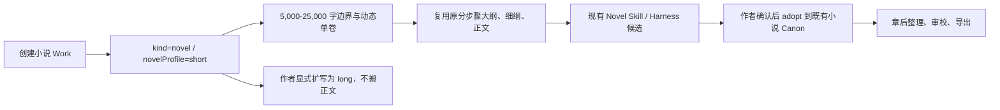
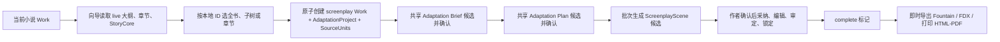
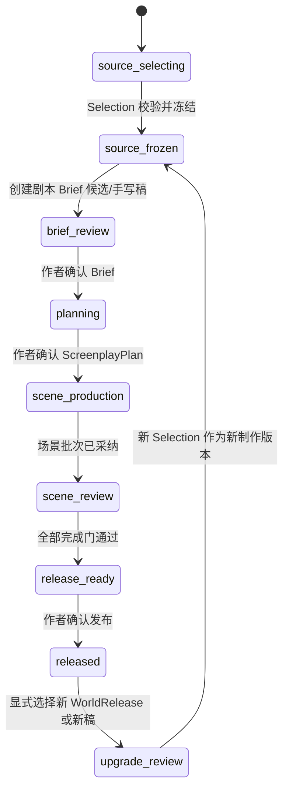
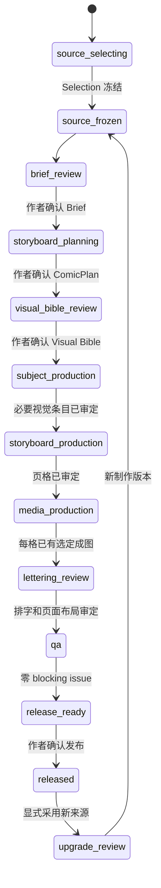

# 短篇、剧本、漫画分支与世界引擎总纲对齐审计

> 文档状态：`AUTHORITATIVE FOR THIS BRANCH / IMPLEMENTATION PAUSED AT CHARTER GATE`
>
> 审计日期：2026-08-22
>
> 功能分支：`feat/short-screenplay-comic`
>
> 审计基线：功能分支 `58091704`；最新主干 `origin/main@8dc6fa7b`
>
> 上位总纲：`origin/main:docs/WORLD-ENGINE-TO-PRODUCT-DEVELOPMENT-CHARTER.md` v1.0
>
> 本文取代原施工蓝图中“改编来源清单已经满足冻结世界来源”的判断；原蓝图仍保留为已实现代码的历史施工记录。

## 0. 审计结论和停止线

### 0.1 本分支实际包含的不是三个同类上层产品

1. **短篇小说**是现有小说创作引擎的 `NovelWorkflowProfile='short'`，继续使用同一套
   `Work → OutlineNode → DetailedOutline → Chapter → 章后治理`。它不是从世界引擎 Release
   派生的独立上层产品，不应为了形式统一再建立 `ShortWorldSourceSelectionV1`。
2. **正规剧本**是独立上层产品，必须建立 `ScreenplayWorldSourceCatalogV1`、
   `ScreenplayWorldSourceSelectionV1`、剧本自己的 Brief、状态机、Release 和版本升级流程。
3. **页漫**是另一独立上层产品，必须建立 `ComicWorldSourceCatalogV1`、
   `ComicWorldSourceSelectionV1`、漫画自己的 Brief、生产/媒资状态机、Release 和版本升级流程。

因此不能把当前 `AdaptationSourceSelectionV1 / AdaptationBriefV1 / AdaptationStatus` 继续扩成一套
剧本、漫画共用的产品生产协议。可以共享世界 Release 哈希、便携 ID、注册表、Harness 和 Blob
完整性等稳定底层能力；产品语义必须分开。

### 0.2 当前存在两个项目级 P0 阻断

**阻断一：小说正文不在正式出口。** `WorldReleaseManifestV2` 的 `outline` 区段只有
`outlineNodes` 和 `detailedOutlines`，权威实现还明确
标注“不包含正文”。`chapters` 不在当前世界发布目录中。

现有实现却按以下方式运行：

- `AdaptWorkWizard` 直接读取当前 Work 的 `outlineNodes / chapters / storyCores`；
- `AdaptationSourceSelectionV1` 保存 Dexie 自增 `outlineNodeId / chapterId`；
- `adaptationSourceUnits` 只保存引用、摘要和 hash，不保存冻结正文；
- 正式 AI 装配上下文时再次回读当前 `chapters / outlineNodes / storyCores`，内容改变即要求“同步来源”。

这证明当前清单是“当前工作表的带哈希索引”，不是“只消费不可变 WorldRelease 的产品
SourceSelection”。它违反总纲第 2.4、3.4、3.5 和完成定义，不能以“小说改剧本/漫画正式完成”继续
扩大或合并。

**阻断二：V2 对部分表没有自描述的便携记录身份。** 当前严格导出只为
`exportIdField=true` 的表写 `_exportId`。`characters/storyCores/detailedOutlines/workCharacterBindings/
characterRelations/worldviews/geographies/codexEntries` 等产品需要的表没有自身 `_exportId`；其关联字段
（例如 `_characterExportId/_fromCharacterIndex/_appearingCharacterIndexes`）却是相对完整项目备份数组
计算的 portable index。`buildPortableReleaseProject()` 随后按 World/Work owner 过滤并压缩各表数组，
没有同时保留原数组位置映射。单 World/单 Work 的简单包可能碰巧可解析，但多 World/多 Work 包不能
保证这些引用仍能在 Release 内唯一反解。

最小反例：完整备份的 `characters` 为 `[世界A角色(index=0), 世界B角色(index=1)]`；发布世界 B 后
`records.characters` 被压缩为 `[世界B角色]`，但关系端点仍可能是 `_fromCharacterIndex=1`。目标角色行
没有 `_exportId=1`，Release-local index 1 又越界，冻结包内不存在可验证映射。

产品 parser 对这种包只能 fail closed，不能按名称、内容或当前 Dexie 表猜匹配。若要让角色、关系、
细纲和词条闭包在所有正式 Release 中可验证，需要项目级修正发布包的便携身份/映射合同，并为旧包
定义版本兼容；这也属于用户指定“发现必须修改世界引擎正式出口就停止”的边界。

若保持用户原始范围——**从短篇或长篇小说正文进行忠实改编**——必须先在项目级做出以下裁定之一：

| 方案 | 能力结果 | 是否改变当前总纲/正式出口 | 本分支现在能否自行决定 |
|---|---|---:|---:|
| A. 经 ADR 为世界发布增加受治理的正文发布能力，并补齐相关表自描述便携身份 | 保留真正“小说改剧本/漫画”，且所有依赖闭包可验证 | 是；需定义新 Manifest/区段、映射版本、体积、隐私、版权和迁移 | 否 |
| B. 不加正文，把产品明确降级为“大纲改剧本/漫画分镜”；同时决定旧 V2 非自描述引用的限制或出口修正 | 只消费可验证的 StoryCore、大纲及选定世界语义；部分 Release 可能被拒绝 | 范围降级本身否；若要求完整角色/关系闭包仍可能要修出口 | 改变用户功能承诺，需作者确认 |
| C. 增加显式上传的外部不可变小说稿，同时裁定世界包便携映射 | 可改编上传稿，但不再直接读取当前小说 Work | 需要总纲明确允许 `WorldRelease + 外部冻结产品输入` 的双来源边界；世界语义仍需可验证 | 否 |

本审计按用户给出的停止条件，不自行修改世界引擎正式出口、不把实时正文偷偷补入 Release，也不把
范围静默降级。当前允许落实的是：保护现场、形成需求与契约蓝图、纠正完成状态、给出产品内可执行
施工顺序；**正式产品代码继续施工停在上述裁定之前。**

## 1. 开发现场与权威依据

### 1.1 现场保护

| 工作区 | 状态 | 处理 |
|---|---|---|
| `/Users/qinyingying/Desktop/project/storyforge` | `feat/ttrpg-game-platform`，存在大量已有提交、修改和未跟踪文件 | 完全不写、不清理、不 reset、不 stash |
| `/Users/qinyingying/Desktop/project/storyforge-short-screenplay-comic` | `feat/short-screenplay-comic`，审计前 clean，较 `origin/main` ahead 5 / behind 3 | 只在此分支提交审计结果；不 rebase |

已执行安全的 `git fetch origin main`。最新主干提交为 `8dc6fa7b docs(governance): define
world-to-product development charter`。因主工作区不适合立即同步，本次通过 `git show origin/main:…`
读取最新 `AGENTS.md`、总纲和 `docs/CONTEXT-ROUTING.md`，没有破坏开发现场。

### 1.2 代码事实来源

本审计建立了以下关联闭包：

```text
入口
  WorldWorkManager → AdaptWorkWizard → createAdaptation
来源读取
  source-manifest.ts → live Work/OutlineNode/Chapter/StoryCore
AI 读取
  CONTEXT_SOURCES → assembleContext() → readAdaptationSourceContent()
AI 写入
  product Skill → durable adaptation Run → candidate → author confirm → adoption service
生命周期
  PROJECT_TABLES → schema v63-v66 → backup v6-v9 → import/remap/delete
成品
  screenplay renderer / comic renderer + media service + completion.ts
测试
  R-ADAPTCORE1 / R-SCREEN1 / R-COMIC1 / E2E core-workflow
```

这套实现对“候选后确认、目标 Work 隔离、CAS、导入导出、Blob 完整性”做得较完整；问题集中在
**产品分支之前的冻结世界来源边界**以及**产品 Release 之后的闭环缺失**。

正式出口的第二个阻断由最新 `origin/main` 同样存在的三段代码共同证明：`PROJECT_TABLES` 没有为若干
被引用表设置 `exportIdField`；`registry-export.ts` 先以完整严格备份的 index 重映射外键；
`world-engine/releases.ts` 再按 owner 过滤并压缩记录。该判断不是功能分支新增代码造成的，也不能在
产品适配器中无证据修补。

## 2. 当前分支已有产品流程图

### 2.1 短篇小说当前流程



对齐结论：保留。它属于总纲第 8 节所说的现有一体化分步骤体验，不是上层产品 Release 的旁路。
但短篇自身尚没有“小说成品 Release”；若未来要让别的产品把小说正文当正式输入，应另立项目级
发布边界，不能由剧本/漫画分支私自读取 live Chapter 代替。

### 2.2 正规剧本当前流程



缺少：WorldRelease 选择、剧本专属 SourceSelection、冻结 Release 上下文、剧本 Release、显式世界
版本升级。当前 `complete` 只是可编辑草稿表的状态，不是不可变产品发布。

### 2.3 页漫当前流程

```mermaid
flowchart LR
    A["当前小说 Work"] --> B["共享 live Source Manifest"]
    B --> C["共享 Brief / Comic Plan"]
    C --> D["确认 Visual Bible"]
    D --> E["生成或手编页、格、视觉条目"]
    E --> F["上传或调用 provider 生成候选图"]
    F --> G["作者选定格图/设定图"]
    G --> H["本地可编辑排字 + 视觉 QA"]
    H --> I["complete 标记"]
    I --> J["即时导出 Storyboard / ZIP / CBZ / 打印 HTML-PDF"]
```



缺少：WorldRelease 选择、漫画专属 SourceSelection、漫画 Release、Release 对成图 Blob 的不可变
固定、provider 请求的持久任务/未知结果恢复、显式来源升级。

## 3. 产品边界裁定

### 3.1 短篇不建立世界选择契约

| 问题 | 裁定 |
|---|---|
| AI 读什么 | 继续由现有小说 Skills 的 `CONTEXT_SOURCES + assembleContext()` 读取当前作者 Canon |
| AI 写什么 | 继续产生小说候选，作者确认后经既有 AdoptionSchema / `adopt()` 写入 |
| 涉及哪些表 | 不新增 short 表；复用 Work、OutlineNode、DetailedOutline、Chapter 和现有治理表 |
| 是否绑定 WorldRelease | 否；这是正在编辑世界/作品的作者模式，不是从 Release 派生的上层产品 |
| 世界升级 | 不适用；作者直接编辑当前 Work。若未来发布小说成品，另立 Novel Release 任务 |

该裁定避免为了新总纲机械复制短篇表、短篇 SourceCatalog 和短篇状态机，守住项目质量和旧长篇
兼容面。

### 3.2 剧本《世界数据需求表》

以下“固定旧版”统一表示：生产和已发布剧本始终绑定所选 `worldReleaseId + contentHash`；世界发布
新版不会自动刷新。升级必须走第 6 节的显式流程。

| # | 产品能力/消费功能 | 世界语义 | Manifest 区段、表、字段 | 必需性 | 选择粒度 | 缺失行为 | 使用阶段 | 新鲜度/升级 |
|---:|---|---|---|---|---|---|---|---|
| S0 | 建立来源身份、审计和防串 Work | World / Work 根身份 | `schema/version/worldCode`; `portableProject.ownership.{contractVersion,worldExportId,workExportId}`; `portableProject.worlds[*].{_exportId,code,name}`; `works[*].{_exportId,_worldExportId,code,kind,title}` | required | 单 World 根 + 单 Work 根 | 阻止任何产品写入和 AI | Brief 前、验证、发布 | 固定旧版；升级新建 Selection 版本 |
| S1 | 改编意图、主题、冲突、卖点 | 故事核心 | `narrative/storyCores`: portable row index、`_workOwnerExportId,logline,theme,centralConflict,concept,mainPlot,subPlots,plotPattern` | required | 当前 Work 的记录集合；V1 要求至少 1 条 | 阻止 Brief；提示回世界引擎补设定并发布新版 | Brief、计划、全局验证 | 固定旧版 |
| S2 | 幕/集/场计划及来源覆盖 | 卷、篇章、故事块、章纲 | `outline/outlineNodes`: `_exportId,_parentExportId,_workOwnerExportId,type,title,summary,order,_worldGroupExportId` | required | 整棵 Work 树或作者选择的树子图；自动包含祖先与子树内有序节点 | 阻止正式计划；可以预览缺口，不可用 live 大纲补齐 | Brief、生产、验证 | 固定旧版 |
| S3 | 场景拆分、地点/人物/冲突线索 | 场景细纲 | `outline/detailedOutlines`: portable row index、`_outlineExportId,scenes,_sceneCharacterIndexes,openingHook,endingCliffhanger,sceneLocation,_appearingCharacterIndexes,emotionArc,prohibitions` | optional | 与 S2 章节点相交的记录集合及角色引用闭包 | 允许从冻结纲要/正文形成产品候选并标“无细纲”；不得写回世界 | 计划、场景生产、验证 | 固定旧版 |
| S4 | 忠实改编小说事件、对白、文风和细节 | 小说正文 | **V2 无对应区段/表；`chapters` 被 WORLD-2E 排除**；目标字段本应至少含 portable 章节身份、章序、标题、正文、摘要和内容 hash | required（对“小说改编”） | 全书、连续范围或离散章节集合，按规范章序 | **阻止真正小说改编**；只能改名为“大纲改编”后明确降级 | Brief、生产、验证 | 当前无法冻结；项目级阻断 |
| S5 | 建立 cast、对白声线、人物弧 | 角色与作品内角色作用 | `characters`: portable character index、`_worldOwnerExportId,name,roleWeight,shortDescription,appearance,personality,background,motivation,abilities,arc,speechStyle,...`; `workCharacterBindings`: portable row index、`_workOwnerExportId,_workExportId,_characterExportId,role,arc,outcome` | required | 记录集合 + Work Binding 闭包；至少覆盖纲要/细纲/正文引用角色 | 阻止含相关角色的场景生产；提示补选或补设定 | Brief、计划、生产、验证 | 固定旧版 |
| S6 | 冲突、亲疏、称谓与互动校验 | 角色关系 | `characters/characterRelations`: portable row index、`_worldOwnerExportId,_fromCharacterIndex,_toCharacterIndex,relationType,label,description,isBidirectional` | optional；一旦选择关系，其两端角色成为 required 闭包 | 关系记录集合 + 端点闭包 | 明确降级为“仅按角色卡/稿件关系”；可生成产品假设，作者确认后只留产品内 | Brief、对白生产、验证 | 固定旧版 |
| S7 | 场景标题、置景和调度一致性 | 重要地点、空间树、地理 | `foundation/importantLocations`: `_exportId,_parentExportId,_worldOwnerExportId,name,tags,description,significance`; `geographies`: portable row index、`_worldOwnerExportId,overview,locations,worldMapData,_worldGroupExportId`; `worldNodes`: `_exportId,_parentExportId,_worldOwnerExportId,name,description,mapConfigJSON,portalsJSON,_worldGroupExportId` | optional；被选细纲/世界节点明确引用后为闭包必需 | 地点记录集合、祖先树子图、必要 portal 端点 | 允许建立“产品专属临时场景卡”，必须标非世界 Canon；关闭空间硬校验 | 计划、生产、验证 | 固定旧版 |
| S8 | 时代、社会、物理/魔法约束和敏感内容约束 | 世界观、规则、力量、修炼 | `foundation/worldviews`: portable row index、`_worldOwnerExportId,summary,worldOrigin,worldStructure,historyLine,races,factionLayout,politicsOverview,economyOverview,cultureOverview,internalConflicts,...`; `worldRulesProfiles`: portable row index、`entries,customNodes,globalNote`; `powerSystems`: portable row index、`name,description,levels,rules`; `cultivationSystems.{_exportId,name,description,stages}` | optional；被角色或词条 portable 引用的记录必须进入依赖闭包 | 记录集合 + 引用闭包 | 明确降级；产品可提出假设但不得冒充世界事实 | Brief、生产、验证 | 固定旧版 |
| S9 | 组织、种族、道具和专有名词一致性 | 势力及 Codex 词条 | `foundation/codexCategories.{_exportId,_parentExportId,domain,builtInKey,name,fieldSchema}`; `codexEntries`: portable row index、`_worldOwnerExportId,_categoryExportId,name,summary,description,fields,refs,tags,_cultivationSystemExportId,_importantLocationExportId` | optional；选择词条必须带分类与显式 refs 闭包 | 词条集合 + 分类祖先 + 引用闭包 | 明确降级；不自动扫描整表，不从其它产品表猜补 | Brief、生产、验证 | 固定旧版 |
| S10 | 多世界切换、跨界规则、空间关系 | 世界组与世界结构 | `foundation/worldGroups.{_exportId,name,type,entryCondition,exitCondition,powerRestriction,takeawayRules,order}`; `worldGroupLinks.{_fromGroupExportId,_toGroupExportId,linkType,...}` | optional；选中跨界内容时依赖闭包 required | 世界组树/图子图 + link 端点闭包 | 单世界降级；若选区实际跨界而缺闭包则阻止 | Brief、计划、验证 | 固定旧版 |
| S11 | 全局故事线与可选叙事蓝图参考 | 故事线、叙事模块 | `narrative/storyArcs.{_exportId,name,type,stages,description}`；可选 `selectedNarrativeModules` 与 `narrativeModules/nodes/beats/choices` 的 module export ID、node/beat/choice stable keys | optional | StoryArc 集合；或完整 NarrativeModule 依赖闭包 | 关闭蓝图参考，继续以故事核心/大纲生产 | Brief、计划 | 固定旧版 |
| S12 | 历史剧时代/服化道与事件核验 | 历史总述、事件、关键词 | 三表均以 portable row index 选择；`foundation/histories.{_worldOwnerExportId,overview,eraSystem,events}`; `historicalTimelineEvents.{_worldOwnerExportId,era,year,date,title,description,impact,isHistorical,source,location}`; `historicalKeywords.{_worldOwnerExportId,keyword,category,era,description,location}` | optional | 记录集合；按选区时代/地点筛选 | 明确显示“未启用历史核验”，不阻止非历史题材 | Brief、生产、验证 | 固定旧版 |
| S13 | 正规剧本文档成品 | 既有游戏/AVG/互动产品资产 | `adventureModules,avgMediaAssets,avgMediaBlobs,avgPresentationModules,gameDefinitions,interaction*,narrativeSimulationModules,openWorldModules` | excluded（剧本 V1） | 不选择 | 不读取，不形成隐式依赖 | 全阶段 | 不适用 |

### 3.3 漫画《世界数据需求表》

| # | 产品能力/消费功能 | 世界语义 | Manifest 区段、表、字段 | 必需性 | 选择粒度 | 缺失行为 | 使用阶段 | 新鲜度/升级 |
|---:|---|---|---|---|---|---|---|---|
| C0 | 来源身份、防串 World/Work、Release 审计 | World / Work 根身份 | 与 S0 相同 | required | 单 World 根 + 单小说 Work 根 | 阻止 AI、产品表写入和媒资调用 | Brief 前、验证、发布 | 固定旧版；显式升级 |
| C1 | 主题、核心冲突、视觉卖点 | 故事核心 | `narrative/storyCores`，字段与 S1 相同 | required | 当前 Work 记录集合 | 阻止 Brief | Brief、视觉方向、验证 | 固定旧版 |
| C2 | 漫画章、页、格节奏和来源覆盖 | 大纲树 | `outline/outlineNodes`，字段与 S2 相同 | required | 整树或树子图 + 祖先闭包 | 阻止正式 storyboard plan | Brief、生产、验证 | 固定旧版 |
| C3 | 把叙事拆为可画场景、镜头和情绪 | 场景细纲 | `outline/detailedOutlines`，字段与 S3 相同 | optional | 对应选区记录集合 + 角色闭包 | 允许从冻结纲要/正文形成候选并标缺少细纲 | 分镜生产、验证 | 固定旧版 |
| C4 | 忠实转换事件、对白、动作和视觉细节 | 小说正文 | **V2 无 `chapters`** | required（对“小说改漫画”） | 全书、连续范围或离散章节集合 | **阻止真正小说改漫画**；不能用 live Chapter 补齐 | Brief、分镜、排字、验证 | 当前无法冻结；项目级阻断 |
| C5 | 角色造型、表情、姿态和跨格连续性 | 角色与 Work cast | `characters` + `workCharacterBindings`，字段与 S5 相同；特别消费 `appearance,profile,identity,abilities,powerLevel,signatureItem,arc` | required | 记录集合 + binding + race/cultivation refs 闭包 | 阻止相关 VisualSubject 和正式成图；可由作者补产品专属设计，不可 AI 偷填为世界事实 | Brief、视觉圣经、媒资、QA | 固定旧版 |
| C6 | 双人构图、称谓、敌友和情绪张力 | 角色关系 | `characterRelations`，字段与 S6 相同 | optional；端点闭包强制 | 关系集合 + 两端角色 | 降级为角色卡/稿件关系；显示警告 | 分镜、媒资、QA | 固定旧版 |
| C7 | 场景设计、背景连续性、地图方位 | 重要地点、地理和世界节点 | `importantLocations/geographies/worldNodes`，字段与 S7 相同 | optional；被选视觉场景引用后成为闭包必需 | 地点集合、祖先树、portal 端点 | 允许作者建立产品专属 Location VisualSubject；关闭地图一致性硬判 | 视觉圣经、媒资、QA | 固定旧版 |
| C8 | 画面物理约束、魔法特效、时代材料与禁忌 | 世界观、规则、力量、修炼 | `worldviews/worldRulesProfiles/powerSystems/cultivationSystems`，字段与 S8 相同 | optional；portable 引用闭包必需 | 记录集合 + 引用闭包 | 降级并记录产品假设；不得称世界 Canon | Brief、视觉圣经、媒资提示、QA | 固定旧版 |
| C9 | 服饰、种族、势力、道具与专名造型 | Codex | `codexCategories/codexEntries`，字段与 S9 相同 | optional；选择词条的分类/refs 闭包必需 | 词条集合 + 分类祖先 + refs 闭包 | 可建立产品专属设计，但明确来源缺失 | 视觉圣经、媒资、QA | 固定旧版 |
| C10 | 多世界美术差异、穿越门和能力限制 | 世界组/链接 | `worldGroups/worldGroupLinks/worldNodes`，字段与 S10 相同 | optional；跨界题材条件 required | 世界结构子图 + 端点闭包 | 单世界降级；跨界选区缺闭包则阻止 | Brief、视觉圣经、分镜、QA | 固定旧版 |
| C11 | 主支线节奏及已有可执行叙事参考 | StoryArc / NarrativeModule | `storyArcs`；可选完整 module/node/beat/choice stable-key 闭包 | optional | 记录集合或叙事模块闭包 | 关闭叙事图参考 | Brief、分镜计划 | 固定旧版 |
| C12 | 历史服化道、建筑和事件真实性 | 历史/关键词 | `histories/historicalTimelineEvents/historicalKeywords`，字段与 S12 相同 | optional | 时代/地点记录集合 | 显示未启用历史核验；不阻止非历史题材 | 视觉圣经、媒资、QA | 固定旧版 |
| C13 | 复用作者已发布的背景、角色姿态或 CG 作参考 | 已有冻结媒资 | `narrative/avgMediaAssets.{_exportId,assetKey,version,kind,name,mimeType,byteSize,width,height,durationMs,contentHash,source,license,altText,characterTag,sceneTag}` + 对应 `avgMediaBlobs.{_exportId,_mediaAssetExportId,data}` | optional，绝不默认依赖 | 单 asset 版本 + blob 的完整性闭包；标明使用目的 | 缺失时允许作者上传或生成；rights/license 不满足时阻止复用 | 视觉圣经、媒资、QA | 固定旧版 asset version/hash |
| C14 | 漫画产品生产 | 其它产品专属定义/演出/运行资产 | `adventureModules,avgPresentationModules,gameDefinitions,interaction*,narrativeSimulationModules,openWorldModules` | excluded | 不选择 | 不读取 | 全阶段 | 不适用 |

### 3.4 共同闭包规则

1. 便携身份按当前 V2 注册表分三类：表中显式 `_exportId`、冻结 `records[table]` 的 canonical
   zero-based row index、领域 stable key。只有注册表 `exportIdField=true` 的表允许第一类；Character、
   StoryCore、DetailedOutline 等表使用第二类。row index 必须与 `worldContentHash + sourceMappingVersion`
   一起解释，绝不是来源浏览器 Dexie ID。Release-local row index 可以稳定选择当前冻结数组中的直接
   记录，但不能自动修复由完整备份 index 生成、在 Release 过滤后已无法反解的关联；遇到这类引用必须
   形成 blocking portable-mapping issue。
2. `portableProject.ownership.worldExportId/workExportId` 必须分别命中唯一 World/Work 根；所有选择记录的
   `_worldOwnerExportId` / `_workOwnerExportId` 必须与该根一致。
3. 树选择包含根、所有选中节点和必要祖先；声明“子树”时还必须包含全部后代。树不得有环。
4. 关系选择必须包含两端角色；Work binding 必须同时指向来源 Work 和已选角色。
5. DetailedOutline 必须指向选中 OutlineNode；其角色引用必须全部解析或明确从产品中排除该场景。
6. Codex 词条必须包含分类和分类祖先；显式 `refs`、地点、修炼引用必须形成依赖闭包。
7. NarrativeModule 选择必须包含唯一 entry、所有可达节点、对应 beat/choice、有效 stable key 和端点。
8. 媒资选择必须同时包含 metadata 与 blob，校验 asset version、contentHash、byteSize、MIME、尺寸和 rights。
9. `selectedTables` 只有表名而记录为空时，仍视为缺失；不得用“表存在”冒充数据充足。

## 4. 产品专属 SourceCatalog / SourceSelection 设计

### 4.1 只共享稳定底层，不建立 `AdaptationWorldSourceCatalog`

允许共享：`assertReleaseUnchanged()`、canonical hash、严格 `WorldReleaseManifestV2` 协议检查、便携
owner 解析、无产品语义的 export-ID/树/引用校验器。

禁止共享：选择字段、required/optional 目录、Brief、产品状态、媒体用途、完成门。代码上应有两个
明确入口：

```text
src/lib/screenplay/world-source.ts
src/lib/comic/world-source.ts
```

不能把现有 `AdaptationSourceOptionCatalogV1` 政名后继续使用。

### 4.2 `ScreenplayWorldSourceCatalogV1`

```ts
interface FrozenScreenplayWorldReleaseIdentityV1 {
  productType: 'screenplay'
  contractVersion: 1
  worldReleaseId: number
  worldReleaseVersion: number
  sourceWorldCode: string
  worldContentHash: string
  sourceWorldExportId: number
  sourceWorkExportId: number
  sourceMappingVersion: 1
  worldName: string
  workTitle: string
  workCode: string
}

interface ScreenplayWorldSourceCatalogV1 {
  schema: 'storyforge.screenplay-world-catalog'
  version: 1
  release: FrozenScreenplayWorldReleaseIdentityV1
  storyCores: PortableStoryCoreOptionV1[]
  outlineTree: PortableOutlineOptionV1[]
  detailedOutlines: PortableDetailedOutlineOptionV1[]
  characters: PortableScreenplayCharacterOptionV1[]
  workCharacterBindings: PortableWorkCharacterBindingOptionV1[]
  characterRelations: PortableCharacterRelationOptionV1[]
  locations: PortableScreenplayLocationOptionV1[]
  canonRules: PortableScreenplayCanonOptionV1[]
  loreEntries: PortableScreenplayLoreOptionV1[]
  storyArcs: PortableStoryArcOptionV1[]
  narrativeModules: PortableScreenplayNarrativeModuleOptionV1[]
  historicalSources: PortableHistoricalSourceOptionV1[]
  availability: ScreenplaySourceAvailabilityV1
  issues: ScreenplaySourceIssueV1[]
}
```

Catalog 是从单个已验证 Release 派生的内存选择目录，不直接落库、不写目标 Work、不调用模型。
`availability` 必须把缺正文标为 blocking，而不是隐藏问题。

### 4.3 `ScreenplayWorldSourceSelectionV1`

```ts
interface ScreenplayWorldSourceSelectionV1 {
  schema: 'storyforge.screenplay-world-source'
  version: 1
  productType: 'screenplay'
  contractVersion: 1
  worldReleaseId: number
  sourceWorldCode: string
  worldContentHash: string
  sourceWorldExportId: number
  sourceWorkExportId: number
  sourceMappingVersion: 1

  // `*Indexes` 是冻结 Manifest 对应 records[table] 的 canonical zero-based index；
  // `*ExportIds` 只用于注册表声明 exportIdField=true 的表。
  storyCoreIndexes: number[]
  outline: {
    mode: 'entire-work' | 'subtree' | 'records'
    rootOutlineExportId: number | null
    outlineNodeExportIds: number[]
    detailedOutlineIndexes: number[]
  }
  characterIndexes: number[]
  workCharacterBindingIndexes: number[]
  characterRelationIndexes: number[]
  importantLocationExportIds: number[]
  geographyIndexes: number[]
  worldNodeExportIds: number[]
  worldGroupExportIds: number[]
  worldGroupLinkIndexes: number[]
  worldviewIndexes: number[]
  worldRulesProfileIndexes: number[]
  powerSystemIndexes: number[]
  cultivationSystemExportIds: number[]
  codexCategoryExportIds: number[]
  codexEntryIndexes: number[]
  storyArcExportIds: number[]
  historicalSourceRefs: Array<{
    table: 'histories' | 'historicalTimelineEvents' | 'historicalKeywords'
    rowIndex: number
  }>
  narrativeModuleSelections: Array<{
    moduleExportId: number
    nodeKeys: string[]
    beatKeys: string[]
    choiceKeys: string[]
  }>
  selectionHash: string
}
```

`selectionHash` 对排好序、去除 `selectionHash` 本身后的 canonical value 计算 SHA-256。落库表还保存
`selectionVersion / frozenAt / createdBy` 等本地审计元数据，但它们不进入跨设备选择契约哈希。
若 Gate 0 先发布了新的世界来源映射合同，实施时必须把 `sourceMappingVersion` 提升为新值并只保留一套
明确解释；不得让同一个版本号同时表示旧 V2 row index 和新自描述 identity。

### 4.4 `ComicWorldSourceCatalogV1`

```ts
interface FrozenComicWorldReleaseIdentityV1 {
  productType: 'comic'
  contractVersion: 1
  worldReleaseId: number
  worldReleaseVersion: number
  sourceWorldCode: string
  worldContentHash: string
  sourceWorldExportId: number
  sourceWorkExportId: number
  sourceMappingVersion: 1
  worldName: string
  workTitle: string
  workCode: string
}

interface ComicWorldSourceCatalogV1 {
  schema: 'storyforge.comic-world-catalog'
  version: 1
  release: FrozenComicWorldReleaseIdentityV1
  storyCores: PortableComicStoryCoreOptionV1[]
  outlineTree: PortableComicOutlineOptionV1[]
  detailedOutlines: PortableComicDetailedOutlineOptionV1[]
  characters: PortableComicCharacterOptionV1[]
  workCharacterBindings: PortableComicCharacterBindingOptionV1[]
  characterRelations: PortableComicRelationOptionV1[]
  visualLocations: PortableComicLocationOptionV1[]
  visualCanon: PortableComicCanonOptionV1[]
  visualLore: PortableComicLoreOptionV1[]
  storyArcs: PortableComicStoryArcOptionV1[]
  narrativeModules: PortableComicNarrativeModuleOptionV1[]
  historicalVisualSources: PortableComicHistoricalOptionV1[]
  reusableReferenceAssets: PortableComicReferenceAssetOptionV1[]
  availability: ComicSourceAvailabilityV1
  issues: ComicSourceIssueV1[]
}
```

它不会返回游戏定义、AVG 演出模块、互动角色 Profile 或其它产品状态。已发布 AVG 媒资只在
`reusableReferenceAssets` 中按明确授权作为候选参考图出现，不把 AVG 媒资流程变成漫画的默认依赖。

### 4.5 `ComicWorldSourceSelectionV1`

```ts
interface ComicWorldSourceSelectionV1 {
  schema: 'storyforge.comic-world-source'
  version: 1
  productType: 'comic'
  contractVersion: 1
  worldReleaseId: number
  sourceWorldCode: string
  worldContentHash: string
  sourceWorldExportId: number
  sourceWorkExportId: number
  sourceMappingVersion: 1

  storyCoreIndexes: number[]
  outline: {
    mode: 'entire-work' | 'subtree' | 'records'
    rootOutlineExportId: number | null
    outlineNodeExportIds: number[]
    detailedOutlineIndexes: number[]
  }
  characterIndexes: number[]
  workCharacterBindingIndexes: number[]
  characterRelationIndexes: number[]
  importantLocationExportIds: number[]
  geographyIndexes: number[]
  worldNodeExportIds: number[]
  worldGroupExportIds: number[]
  worldGroupLinkIndexes: number[]
  worldviewIndexes: number[]
  worldRulesProfileIndexes: number[]
  powerSystemIndexes: number[]
  cultivationSystemExportIds: number[]
  codexCategoryExportIds: number[]
  codexEntryIndexes: number[]
  storyArcExportIds: number[]
  historicalSourceRefs: Array<{
    table: 'histories' | 'historicalTimelineEvents' | 'historicalKeywords'
    rowIndex: number
  }>
  narrativeModuleSelections: Array<{
    moduleExportId: number
    nodeKeys: string[]
    beatKeys: string[]
    choiceKeys: string[]
  }>
  referenceMedia: Array<{
    mediaAssetExportId: number
    mediaBlobExportId: number
    assetKey: string
    assetVersion: number
    contentHash: string
    intendedUse: 'character-reference' | 'location-reference' | 'prop-reference' | 'style-reference'
  }>
  selectionHash: string
}
```

漫画合同单独表达媒资用途、asset version 与 blob 闭包；剧本合同没有这些字段，避免伪公共协议。

### 4.6 parser、作用域、哈希和便携引用校验顺序

`parseScreenplayWorldSourceSelectionV1()` 与 `parseComicWorldSourceSelectionV1()` 分别执行，且必须
exact-key fail closed：

1. JSON 必须是普通对象；拒绝未知字段、缺字段、错误 schema/version/productType/contractVersion。
2. 所有 export ID/row index 为非负整数；集合数组必须已去重并 canonical 排序；stable key 为有限长度
   白名单字符串。顺序有产品语义时另用明确的 `ordered*` 字段，不能依赖 JSON 对象顺序。
3. `worldContentHash/selectionHash/contentHash` 必须是 64 位小写 SHA-256；重算不一致即拒绝。
4. `worldReleaseId` 必须命中当前工作区可见 Release；Release 的 `projectId/worldId/sourceWorldCode`
   必须与目标 scope 和选择一致；先运行 `assertReleaseUnchanged()`。
5. 严格解析 `manifestJson`，只接受 `storyforge.world-package@2`（未来版本必须显式适配）；重算 Manifest
   hash，并逐表核对 `dependencies.rowCount/contentHash`。
6. 解析 `portableProject.ownership`，验证 contractVersion、World/Work 根唯一、source code 和选择中的
   `sourceWorldExportId/sourceWorkExportId` 一致；来源 Work 必须是小说语义。
7. 按 `sourceMappingVersion=1` 的表身份映射表解析记录：`exportIdField=true` 的表建立唯一
   `_exportId → row` 索引；其余获准表可用边界内的 Release-local canonical row index 选择直接记录。
   任何 portable remap 必须按其注册表目标身份解析；完整备份 index 因 Release 过滤而无法命中时直接
   blocking，不准把它重新解释为压缩后的 row index。重复/缺失显式 export ID、越界 index、错误
   owner、把 Dexie 本地 ID 当 portable 身份、未列入需求表的产品表一律拒绝。
8. 按第 3.4 节验证树、关系、binding、Codex、Narrative 和媒资依赖闭包。
9. 执行产品 required 规则。任何 blocking issue 都不能 freeze；optional 缺失必须形成显式 warning/
   degradation receipt。
10. 以 CAS 再次读取 Release 和来源 scope；只有二者未变化，第一事务才追加一条尚未挂接产品根的
    immutable Selection。第二事务重新验证该 Selection 后，才创建 product root/目标 Work 并写
    `activeSelectionId/hash`。Selection 事务不得同时创建产品根、Brief、场景、页面或媒资；第二事务
    失败时 Selection 保留为可重用/可审计的 unattached 记录，不留下半产品。

### 4.7 正式写入门

以下守卫必须成为 product service 的唯一入口，而不是 UI 的 `disabled` 属性：

```ts
assertScreenplayProductionReady({ scope, screenplayProjectId, selectionId })
assertComicProductionReady({ scope, comicProjectId, selectionId })
```

守卫通过前禁止：正式模型调用、写 Brief/Plan、写场景/页格、创建媒资请求、保存正式媒资候选和
发布。允许的只有 Catalog 读取、内存选择预览、Selection 自身的冻结事务，以及紧随其后的
`createScreenplayProjectFromSelection()` / `createComicProjectFromSelection()` 产品根创建事务。

## 5. 产品内部流程蓝图

### 5.1 剧本专属 Brief / Run Contract

`ScreenplayBriefV1` 只服务剧本，至少包含：格式（电影/剧集/短剧）、时长/集数、受众和分级、
改编目标、必须保留/允许合并删除重排、允许新增、叙事视角、旁白策略、对白密度、制作规模、预算
限制、场景限制、来源假设、未决问题、所绑定的 Selection hash。

`ScreenplayRunContractV1` 冻结：

- `screenplayProjectId + projectRevision`；
- `worldReleaseId + worldContentHash + sourceSelectionHash`；
- `briefHash + planHash`；
- 本批次 plan section stable keys 与允许读取的 portable source refs；
- 目标 Skill/Prompt/Tool 版本、预算、重试政策、验收标准；
- 候选只可写的剧本字段以及作者确认点。

不得继续用 `AdaptationBriefV1` 同时约束漫画。

### 5.2 剧本状态机和人工确认点



重试和恢复：模型调用由剧本专属 durable Run 负责；每批候选先 checkpoint，刷新后恢复；同一输入
fingerprint 不隐藏重试，临时错误最多按 Run Contract 明示次数重试；作者确认前业务表零写入。手工
编辑用 revision CAS。发布后不原地改 Release，继续编辑必须创建新的制作版本。

人工确认点：Selection、Brief、Plan、每批场景候选、场景 reviewed/locked、Release。

### 5.3 剧本成品、媒资、Release、运行和演化

- V1 正规剧本是**文档产品**，正式产物为结构化场景快照及可确定性生成的 Fountain、FDX、PDF。
- V1 不需要角色图、音频、视频或统一 Media Profile；这些全部 excluded。PDF/FDX 是 Release 的
  可再生表现，不另建重复 Blob 表。
- `ScreenplayReleaseManifestV1` 嵌入已排序的 title page、目标规格、场景/块快照、统计、Selection、
  Brief/Plan/Run receipt hashes 和 renderer version；`screenplayReleases` 保存 immutable manifestJson、
  contentHash、version、source hashes。
- 完成门：Selection 可验证；Brief/Plan 同源；计划段均有覆盖；场号唯一且连续；块结构合法；角色
  portable refs 可解析；所有场景 reviewed/locked；时长和集数在规格内或有作者偏差确认；三种 renderer
  通过结构验证；Release hash 可重算。
- 剧本 V1 没有交互运行实例或用户进度，Release Viewer/导出是无状态只读消费，因此不建空壳 runtime
  表。演化只通过新制作版本和新 ScreenplayRelease；不会形成世界回写候选。

### 5.4 漫画专属 Brief / Run Contract

`ComicBriefV1` 至少包含：页漫规格、章节/页数、阅读方向、尺寸/出血、色彩、受众分级、改编策略、
视觉叙事密度、对白/旁白策略、全局画风方向、角色与地点连续性要求、禁止描绘、媒资 rights 门、
provider 能力最低要求、成本/候选数上限、Selection hash。

漫画至少拆分三类 Run Contract，不建立全产品 DAG：

1. `ComicNarrativeRunContractV1`：Brief、章页节奏、页格 storyboard 候选；
2. `ComicVisualDesignRunContractV1`：Visual Bible、角色/地点/道具设计候选；
3. `ComicMediaJobContractV1`：非文本 provider 请求、幂等 requestHash、能力、rights、数量、尺寸、成本
   和失败恢复；不由文本 Agent Run 冒充。

### 5.5 漫画生产和媒资状态机



媒资顺序和数量：

1. 先冻结 Visual Bible；
2. 为每个需要连续性的角色、地点、道具 VisualSubject 审定一个设计；
3. 每个 VisualSubject 可生成/上传 2-4 个候选，正式生产恰好选择 1 个参考图；
4. 页格文本和可编辑排字先确定，再为每格按 targetSpec 生成 2-4 个候选，恰好选择 1 个成图；
5. 图像模型默认不绘制对白、旁白和拟声词，排字由本地 renderer 叠加；
6. 校验尺寸、MIME、hash、rights、provider receipt、连续性和裁切后才可进入页面合成；
7. 最终一页对应一个可重建页面输出，按顺序导出 PNG/WebP ZIP、CBZ 和 PDF。

存储和恢复：继续复用低层 `mediaBlobObjects` 内容寻址与完整性，不复制 comic blob 实现；新增
`comicMediaJobs` 记录 requested/received/committed/failed/cancelled/unknown、attempt、requestHash 和
receipt。页面刷新后 unknown 不自动重发，先检查 provider receipt 或要求作者显式重试，避免重复计费。

### 5.6 漫画成品、Release、运行和演化

- 完成门：Selection 可验证；Brief/Plan/Visual Bible 同源；目标页数满足或有作者偏差确认；全部页格和
  VisualSubject reviewed/locked；每格恰好一个已验证选定成图；全部来源引用/连续性引用可解析；排字不
  越界；rights 和最低尺寸满足；QA 零 error；Release hash 与所有 blob hash 可重算。
- `ComicReleaseManifestV1` 冻结 target spec、Brief/Plan/Visual Bible hashes、页格和排字快照、所选
  asset stable keys、content hashes、rights、renderer version、Selection/Run receipts。
- `comicReleaseMediaRefs` 把 Release 固定到内容寻址 Blob；草稿删除/换图不能删除被 Release 引用的
  blob。完整备份必须往返 Release 和被引用二进制。
- 漫画 V1 同样是文档/出版物产品；只读阅读和下载不需要持久 runtime 表。阅读进度、评论和连载平台
  是后续产品范围，不能预建空表。
- 新版世界或新漫画稿通过新制作版本/Release 演化；不自动回写世界。

### 5.7 世界回流边界

剧本和漫画当前不产生需要回流世界的运行事实。若未来作者希望把产品中新创角色、地点或规则纳入
世界，必须形成带 `productReleaseId + sourceSelectionHash + product evidence refs` 的候选，经作者确认、
FIELD_REGISTRY/AdoptionSchema/`adopt()` 写入，再创建新的 WorldRevision/WorldRelease。绝不自动回写。

## 6. 世界版本升级契约

1. 已冻结 Selection 和已发布产品永远继续绑定旧 Release。
2. UI 发现同一 `sourceWorldCode` 有新版时只显示“可升级”，不得改 active source。
3. 用户显式选择新版后，重新加载本产品 Catalog，重新完成产品数据选择。
4. 对旧/新 Selection 按 table + portable `_exportId`/Release-local row index/stable key 生成
   added/removed/changed/unchanged diff；row index 只能在各自 exact Release 内解释，跨 Release 比较必须再
   对 canonical record content hash，不能把相同 index 当相同实体；
   记录内容 hash 变化，不能只比 ID。
5. 缺失 required 记录或依赖闭包破裂时拒绝升级；optional 缺失生成降级报告。
6. 作者确认影响报告后追加新的 Selection version，创建新的产品制作版本；旧场景/页格标 impact，不
   自动覆盖。
7. 重新生成仍走候选和确认；发布新的产品 Release。旧产品 Release 和导出保持可重放。

## 7. 当前实现与总纲的差距

| 优先级 | 当前事实 | 与总纲差距 | 处置 |
|---|---|---|---|
| P0 | 向导从 active Work 读取 live Outline/Chapter/StoryCore | 没有从 WorldRelease 开始 | 下线为 legacy experimental；改为先选 Release，再走产品 Catalog |
| P0 | SourceSelection 保存 `outlineNodeId/chapterId` | 跨产品长期身份使用 Dexie ID | 两套产品契约只保存 portable export ID/stable key |
| P0 | SourceUnits 只存 hash/摘要，AI 时回读 live 正文 | 冻结来源可漂移且依赖工作表存在 | CONTEXT_SOURCES 只从 Release+Selection 读取；正文缺失按停止线处理 |
| P0 | `createAdaptation()` 在 Selection 前创建 target Work/root/source rows | 世界选择冻结前已写产品表 | 改为 Catalog/preview 零写；Selection 冻结后才原子创建产品项目和目标 Work |
| P0 | V2 Release 没有 Chapter 正文 | 无法履行“小说改编” | 项目级 ADR/范围裁定前停止扩大 |
| P0 | 部分 V2 表无自身 `_exportId`，remap index 在 Release 过滤后可能失去目标位置 | 多 World/Work 包的角色、关系、细纲、词条闭包不能保证可验证 | 产品 parser fail closed；项目级裁定发布映射版本/旧包兼容，本分支不改正式出口 |
| P0 | 一个 `AdaptationSourceSelectionV1` 服务两个产品 | 产品专属来源选择缺失 | 建 `Screenplay...` 与 `Comic...` 两套契约；不建伪公共协议 |
| P0 | 一个 `AdaptationBriefV1/Plan/Status` 服务两个产品 | 统一 Brief/状态机违反当前禁止提前统一 | 拆成产品专属根、Brief、Plan、状态机和 Run Contract |
| P0 | `complete` 只是修改 draft root/Work status | 没有不可变 Product Release | 新增 screenplay/comic Release 与 manifest/hash/replay |
| P1 | ProductHub banner 展示当前世界草稿 `vN`，无 Release hash | 用户看不见真实冻结来源 | 产品入口展示 release label/version/id/hash；草稿版本不得冒充 Release |
| P1 | 漫画 provider 请求前无 durable job row | 刷新未知结果可能重复请求/计费 | 建 product-specific comicMediaJobs；显式 retry |
| P1 | 漫画草稿 asset/blob 可删除 | Release 无媒资 pin，无法保证产品不可变 | comicReleaseMediaRefs 固定 content-addressed blob |
| P1 | 没有来源升级 diff/rebase | 新世界版本处理不明确 | 追加 Selection version + impact + 新产品版本 |
| P1 | 测试主要证明 live source stale/resync | 没有 Release scope/hash/portable 闭包反例 | 替换为第 11 节测试矩阵；legacy 测试只保留迁移证据 |
| 正向 | AI 已通过 CONTEXT_SOURCES/assembleContext、durable candidate、作者确认 | 治理骨架可复用 | 拆产品语义后保留模式，不保留 live reader |
| 正向 | 新表已进入 PROJECT_TABLES 和严格备份往返 | 生命周期工程可复用 | 新产品表重新登记；旧表只读迁移，绝不静默丢数据 |
| 正向 | 漫画 Blob hash/rights/QA、剧本/漫画 renderer 已有测试 | 产品内底层能力可复用 | 与新 Selection/Release 绑定后继续使用 |
| 正向 | 没有运行事实自动回写世界 | 符合总纲 | 保持不变 |

## 8. 保留、调整、补充和下线清单

### 8.1 保留

- `WorkKind='novel'|'screenplay'|'comic'` 和 short/long Profile resolver；
- 短篇 5,000-25,000 边界、动态单卷、Profile 切换和原小说 Golden Master；
- `screenplayScenes` 的正规块模型、结构 validator、Fountain/FDX/print renderer；
- `comicPages/comicPanels/comicVisualSubjects/comicMediaAssets` 的领域模型、页格/排字/QA；
- `mediaBlobObjects` 作为稳定低层能力，以及 hash/MIME/尺寸/rights/provider receipt；
- durable checkpoint、候选、作者确认、CAS、verification receipt 的治理模式；
- 注册表派生导入导出、删除和引用重映射原则。

### 8.2 调整

- `AdaptationProject` 拆为 `ScreenplayProject` 与 `ComicProject`；Brief、Plan、target spec、状态不再共用。
- `sourceUnitIds` 改为产品专属、可便携验证的 source refs；不能长期引用 `adaptationSourceUnits.id`。
- `adaptation-durable.ts` 拆成 screenplay/comic Run；共用的只能是 Harness 基础设施。
- `AdaptWorkWizard` 拆成两个产品入口，各自先选择 WorldRelease、填写产品设定、浏览专属 Catalog、
  冻结 Selection。
- 完成操作从“改 status”升级为“校验并发布 immutable Product Release”。
- 漫画媒资调用增加持久 job 和 Release blob pin。

### 8.3 最小新增表预算

为避免冗余，不建立统一功能表、统一状态表、统一 DAG 或无意义 runtime 表。建议表集合：

| 产品 | 表 | 责任 |
|---|---|---|
| 剧本 | `screenplayProjects` | 目标规格、Brief、Plan、产品状态、revision、active Selection |
| 剧本 | `screenplayWorldSourceSelections` | 追加式不可变选择 JSON/hash/version 与 Release 绑定；先独立冻结，再由产品根引用 |
| 剧本 | `screenplayScenes` | 保留现有结构化场景表 |
| 剧本 | `screenplayReleases` | 不可变成品 manifest/hash/version |
| 漫画 | `comicProjects` | 漫画 Brief、Plan、Visual Bible、target spec、状态、active Selection |
| 漫画 | `comicWorldSourceSelections` | 漫画专属追加式不可变选择；先独立冻结，再由产品根引用 |
| 漫画 | `comicPages/comicPanels/comicVisualSubjects/comicMediaAssets` | 保留现有漫画领域表 |
| 漫画 | `comicMediaJobs` | provider 非文本任务、幂等、显式重试和恢复 |
| 漫画 | `comicReleases` | 不可变漫画 manifest/hash/version |
| 漫画 | `comicReleaseMediaRefs` | Release 对 content-addressed blob 的不可变引用 |

剧本/漫画 AI 运行继续复用 `agentRuns/events/checkpoints/receipts`，用产品专属 Run Contract 区分；不再
复制 run 表。两种文档产品 V1 无持久交互运行，故不建 runtime 表。

### 8.4 下线/隔离

- `AdaptationSourceSelectionV1`、`AdaptationSourceOptionCatalogV1` 作为正式入口下线；
- `adaptation.sourceManifest`、`adaptation.sourceContent` 的 live readers 下线；
- `adaptationProjects/adaptationSourceUnits` 停止创建新数据，标为 legacy experimental；
- 当前“把当前小说改成剧本或漫画”入口在新 SourceSelection 主路径完成前默认隐藏；
- 旧蓝图和 Feature Guide 不再宣称该分支已满足总纲或可以直接合并上线。

### 8.5 旧实验数据迁移

不能自动把旧 `adaptationSourceUnits` 提升为新 Selection，因为其中没有 WorldRelease 身份、便携来源
闭包和冻结正文。安全迁移流程：

1. 新 schema 只加表，不删除旧表、不改旧记录；
2. 旧 screenplay/comic Work 只读打开并允许导出当前草稿；禁止继续正式 AI/媒资生成；
3. 用户选择一个可验证 WorldRelease，完成对应产品 Catalog/Selection；
4. 生成旧本地引用到新 portable refs 的可见映射报告；任何缺失/歧义都需作者处理；
5. 作者确认后复制产品草稿到新 product root，旧表保留迁移 receipt；
6. 新 Release 可重放、完整备份往返通过后，才另立任务移除旧入口；删除旧表必须有独立迁移和可恢复备份。

## 9. 三注册表和数据生命周期影响

### 9.1 `CONTEXT_SOURCES`

新增产品专属来源，reader 只读 `WorldRelease.manifestJson + frozen Selection`：

```text
screenplay.worldSelection
screenplay.sourceStory
screenplay.sourceCast
screenplay.sourceCanon
screenplay.currentBrief
screenplay.currentPlan
screenplay.currentScenes

comic.worldSelection
comic.sourceStory
comic.sourceVisualCanon
comic.sourceReferenceAssets
comic.currentBrief
comic.currentPlan
comic.visualBible
comic.currentPages
```

每个 source 的 `sourceEvidence` 必须记录 Release/Selection hash、portable refs、included/omitted/trimmed。
不得调用 `db.chapters/db.outlineNodes/db.characters` 去补 Release。

短篇不增加新 source；继续复用小说 Skills 已登记来源。

### 9.2 `FIELD_REGISTRY` / AdoptionSchema

- `screenplayProjects.brief/plan` 与 `comicProjects.brief/plan/visualBible` 分开登记；
- `screenplayScenes`、`comicPages/panels/visualSubjects` 的内容字段保留；source refs 改为可便携字段；
- Release identity、Selection identity/hash、owner、status、revision、媒资 rights/hash/receipt/job 状态均为
  system-owned，不登记为模型可写；
- screenplay/comic 各有 batch AdoptionSchema 和领域 validator；作者确认后才落正式表；
- Catalog、Selection、Release、media job 使用显式生命周期入口，不通过普通字段 adopt 冒充业务写入。

### 9.3 `PROJECT_TABLES`

每张新增表同一提交内完成：Dexie schema、类型、PROJECT_TABLES spec、owner、refs、exportRemap、defaults、
导出/导入严格校验、删除矩阵、作用域、迁移和反例测试。

关键引用：

- product root → active Selection；Selection → `worldReleases`（导出为 portable release ref）。Selection
  可短暂 unattached，但必须有来源 scope、selectionKey、createdAt 和显式保留/清理策略；清理不得删除
  已被任何 product root/Release 引用的 Selection；
- screenplay scene → screenplay project；screenplay release → project + selection；
- comic page/subject/media/job/release → comic project；panel → page；asset/job → panel 或 subject；
- comic release media ref → comic release + mediaBlobObjects；只要 Release 存在，blob GC 必须 keep；
- 删除来源 World/Work 不应伤已发布产品；当前同 workspace V1 若根删除策略仍级联，则发布成品必须先有
  独立 portable product export，否则删除应被引用守卫阻止。该删除策略需在施工 ADR 中明确。

备份版本逐窄阶段递增，禁止一次预建未来表。旧 reader 遇未来版本在写库前拒绝；新 reader 保留旧实验
数据但不猜测合规 Selection。

### 9.4 正式模型和媒资入口

- `outline.screenplay-* / prose.screenplay-*` 绑定 Screenplay Run Contract；
- `outline.comic-* / visual.comic-*` 绑定 Comic Run Contract；
- 组件只调用 product service，不直连 `chat()` 或 media transport；
- 漫画 media provider 通过 capability/rights + durable media job；不隐藏重试；
- deterministic parser/validator/renderer 不调用模型；
- 任何 Selection 未冻结的调用在 service 和 Harness 两层 fail closed。

## 10. 施工阶段与停止门

### Gate 0：项目级裁定（当前停止位置）

决定第 0.2 节 A/B/C，并裁定 V2 过滤后非自描述 portable index 的修正与旧包兼容。没有裁定前不修改
WorldRelease 出口、不继续 product code。若选择修改出口，先写项目级 ADR、修改总纲、发布目录/映射
版本、架构检查和回归测试；该工作不属于本分支可自行越权完成的范围。

### Phase 1：对齐隔离

1. 默认隐藏旧改编创建入口并标 legacy experimental；
2. 保留旧数据只读/导出；
3. 更新能力基线、Feature Guide 和旧蓝图状态；
4. 冻结短篇/长篇 Golden Master。

完成门：用户无法从新入口写入无 Release 绑定的改编数据；旧数据零丢失。

### Phase 2：产品无语义共享的 Release 校验底层

1. 复用/收口 `assertReleaseUnchanged`、canonical hash、dependency hash 和 portable owner parser；
2. 补 World/Work scope、重复 export ID、便携引用和恶意包反例；
3. 不产出 `ProductSourceCatalog` 公共类型。

完成门：两个产品适配器可以调用相同低层验证函数，但不能得到相同产品选择对象。

### Phase 3：剧本来源和产品根

1. `ScreenplayWorldSourceCatalogV1/SelectionV1` 类型、strict parser、UI；
2. `screenplayProjects/screenplayWorldSourceSelections` 与完整生命周期；
3. Selection 冻结和 `assertScreenplayProductionReady()`；
4. 旧剧本草稿显式迁移预览。

完成门：Selection 之前产品表零写；修改 live 世界/小说不会改变 frozen catalog/selection。

### Phase 4：剧本生产和 Release

1. 产品专属 Brief/Plan/Run；
2. 重绑现有场景/renderer/adoption；
3. `screenplayReleases` 和可重放三格式导出；
4. 世界 Release 显式升级 diff。

完成门：从冻结来源到不可变 ScreenplayRelease 全链可审计；旧长篇/短篇不回归。

### Phase 5：漫画来源和产品根

与 Phase 3 对称，但使用漫画自己的 Catalog/Selection/Brief/状态机，不复制剧本字段后改名。

### Phase 6：漫画生产、媒资和 Release

1. 重绑现有页格、VisualSubject、排字和 QA；
2. `comicMediaJobs` 显式恢复；
3. `comicReleases/comicReleaseMediaRefs` 固定成品与 blob；
4. 世界 Release 显式升级 diff。

完成门：刷新/取消/失败不重复计费、不留孤儿；已发布漫画可在草稿变化/删除后重放。

### Phase 7：迁移和旧入口下线

完成旧实验数据的作者确认式迁移；验证一个正式版本周期后，另立删除任务，不在功能 PR 顺手删旧表。

## 11. 定向测试、反例、CI 和真实路径验证

### 11.1 Product Source parser / scope / hash

- 正例：Release identity、portable owner、每类 required/optional 选择；
- 未知 schema/version/productType/contractVersion/sourceMappingVersion；
- Release 不存在、错 project/world/work、Work 非小说、sourceWorldCode 不匹配；
- manifest hash、selection hash、dependency rowCount/hash 任一篡改；
- 显式 `_exportId` 重复/负数/缺失，Release-local row index 越界，把完整备份 index 错当压缩 index，
  选择本地 Dexie ID，unknown key；
- 记录 owner 越过来源 Work/World；
- required 表存在但数组为空；
- outline/location/world 树悬空、环、子树漏后代/祖先；
- relation 漏端点、binding 指错 Work、DetailedOutline 指错 outline；
- Codex 漏分类/refs、角色漏 race/cultivation 依赖；
- Narrative entry/可达性/stable key/beat speaker/choice target 断裂；
- media metadata 无 blob、hash/size/MIME/version/rights 不一致；
- excluded 产品表被选择。

### 11.2 写入门和状态机

- Selection 冻结前：AI、Brief、场景/页格、media job 全部拒绝且 DB 零写；
- Catalog 读取中 Release 变化；freeze CAS 前 target root/release 变化；
- 状态越级、重复确认、旧 revision、旧 Selection hash、旧 Brief/Plan 候选；
- 刷新恢复候选、拒绝零写、采纳崩溃窗口幂等；
- released 数据不可原地编辑；reopen 创建新制作版本；
- live World/Work 修改不影响旧 Selection、Run 或 ProductRelease；
- 新 WorldRelease 出现不自动升级；显式升级有 diff 和确认。

### 11.3 生命周期和便携往返

- 每张新表先被 `PROJECT_TABLES` 派生到 schema/required tables/export/import/delete/remap；
- 上一备份版本导入、当前完整往返、旧 reader 拒新版本、删任一 required table 拒绝；
- releaseId、selectionId、project root、scene/page/panel/blob 跨导入重映射；
- 删除 target draft、product project、source Work、World、workspace 的正反例；
- 旧实验数据保留、迁移失败零写、缺 Release 不自动提升；
- comic Release pin 阻止 Blob GC；删除未发布草稿候选可两阶段回收；
- provider receipt/导出包敏感字段扫描。

### 11.4 产品完成与 renderer

- Screenplay：场号/集号、块语法、角色 ref、计划覆盖、时长、review/lock、Fountain/FDX/PDF 快照一致；
- Comic：目标页数、几何重叠、排字边界、连续性 refs、每格唯一选图、VisualSubject、rights、尺寸、
  verified blob、CBZ/ZIP/PDF manifest；
- 媒资 requested 后刷新、超时/unknown、取消、provider 失败、收到后 CAS 失败、显式重试、重复 requestHash；
- Release hash、renderer version 和二进制引用可重放。

### 11.5 旧功能回归

- 5,000/25,000 接受，4,999/25,001 拒绝；
- short/long Profile 切换不搬正文，短篇不新增 Canon 表；
- 原长篇创建、大纲、正文、章后整理、导出/导入 Golden Master 不变；
- 现有 WorldRelease、文字游戏、AVG、SIM、备份和 media blob 路径不被产品适配器改坏；
- 旧 `adaptation*` 数据可读/导出但不能从默认入口继续正式生成。

### 11.6 验证顺序

每个窄阶段先跑对应单测与反例，然后至少：

```text
npm run check:architecture
npm run check:required-tables
npm run check:ai-manual
npx tsc --noEmit
相关 regression / renderer / import-export tests
npm run build
git diff --check
```

交付单元运行 `npm run ci`；适用阶段运行 `npm run ci:e2e`。外部审计若因已知上游公告失败，单独报告，
不能把其它闸门通过写成 CI 全绿。

### 11.7 隔离真实用户路径

使用独立浏览器数据和隔离测试 Project，不打开作者当前预览项目：

1. 创建 World + 小说 Work（短篇和长篇各一套），填写故事核心、角色、关系、地点、规则、大纲、细纲；
2. 创建 WorldRevision 并发布 WorldRelease，记录 id/version/hash；
3. 进入剧本或漫画产品，只展示 Release 数据，完成产品专属选择并冻结；
4. 验证 Selection 前没有产品写入/模型/媒体请求；
5. 走 Brief → Plan → 候选 → 作者确认 → 编辑/审校；漫画继续走视觉条目、真实 provider 受限调用、
   选片、排字、QA；
6. 刷新/关闭/重开验证候选、media job、状态和费用不重复；
7. 发布 ProductRelease，重启后从 Release 导出相同 hash 的成品；
8. 修改 live 世界/小说，证明旧产品不漂移；发布新版世界，证明只提示升级；
9. 显式升级，检查 diff、新制作版本和旧 ProductRelease 均保留；
10. 导出完整备份，在全新浏览器导入并验证 Release/Selection/场景/页格/blob 重映射和重放。

真实漫画 provider 验证必须设置小额预算、固定候选数和隔离 API 配置；失败/取消也要检查无孤儿和无
隐藏重试。没有真实 provider 证据时，产品只能标记 storyboard/本地上传能力完成，不能宣称完整
“小说改漫画”。

## 12. 最终完成定义

本分支只有同时满足以下条件才能恢复“完成”状态：

1. 项目级正文来源与 V2 portable mapping 两个阻断均已有明确裁定并进入权威合同；
2. 短篇保持同一小说创作引擎，旧长篇 Golden Master 不变；
3. 剧本和漫画分别从明确 WorldRelease 建 Catalog、选择和冻结专属 Selection；
4. 正式上下文不读取 live 世界/小说表补 Release；
5. 两产品 Brief、状态机、Run、媒资和 Release 独立，不建立伪公共生产层；
6. Selection 前 AI/产品写入/媒资调用零发生；
7. ProductRelease 不可变、可重放、可便携，世界新版不自动漂移；
8. 三注册表和全部数据生命周期闭合，旧实验数据零丢失；
9. 运行/演化不自动回写世界；
10. 定向反例、完整 CI、隔离 E2E 和真实用户路径证据全部通过。

在这些条件满足前，已有 renderer、编辑器、Harness 和媒资代码只能视为“产品内部能力候选”，不等于
从世界引擎到产品 Release 的完整正式产品。
