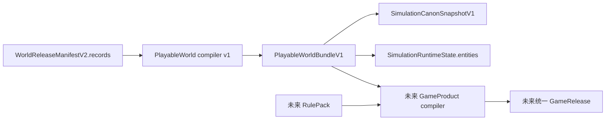

# OUTLET-1 ADR：不可变世界发布包到可运行世界

> 状态：ACCEPTED / IMPLEMENTING
> 决策日期：2026-08-21
> 任务归属：`MASTER-0`、`OUTLET-1A..1D`
> 上位方案：[游戏平台总施工方案](../GAME-PLATFORM-MASTER-CONSTRUCTION-PLAN-20260821.md)

## 1. 决策摘要

StoryForge 新增派生合同 `PlayableWorldBundleV1`，把不可变 `WorldReleaseManifestV2.records`
确定性归一化为运行时可消费的 Canon 快照和初始实体状态：

- 世界基础、世界观、力量体系和世界规则成为可审计 Canon 来源；
- 角色、地点、人工器物和势力同时成为 Canon 来源与运行时实体；
- 角色关系以便携角色索引为依据，归并到关联角色的冻结字段中；
- 表依赖及其冻结 hash 继续保留为审计来源；
- 所有来源和整个 bundle 都有内容 hash，可在创建会话前验证；
- 缺失、悬空引用和降级行为进入结构化 diagnostics，不以静默默认值掩盖；
- `createWorldInstance()` 在调用方未显式提供初始状态时采用 bundle 的实体状态，并在其上叠加
  冻结叙事及各产品运行态。

`PlayableWorldBundleV1` 是纯派生值，不新增 IndexedDB 表，不建立与 `PROJECT_TABLES` 平行的表清单，
也不改变 WorldRelease 的权威性。相同发布内容、发布时间和编译器版本必须生成相同 bundle。

## 2. 为什么必须先做 OUTLET-1

当前世界发布链已经能冻结 portable records、依赖表和内容 hash，但旧的
`buildReleaseSimulationCanonSnapshot()` 只把每个依赖表投影为审计来源，不读取真实 records。
因此 Release 实例即使绑定了完整世界包，运行时 `entities` 仍为空；跑团、角色互动、开放世界和文字游戏
无法可靠取得角色、地点、物品或势力。

继续在此基础上开发角色卡、GM 或战斗 UI 会制造一套依赖草稿数据库或静默默认数值的旁路。本 ADR 将
“发布世界可以进入运行时”设为后续 RulePack、CampaignPack、GameRelease 和多人房间的共同前置门。

## 3. 权威边界



### 3.1 读取

- 编译器只读取调用方传入的不可变 manifest、WorldRelease content hash 和 createdAt。
- 不回读草稿表，不使用当前激活 World/Work，不读取组件状态。
- 编译过程不调用 AI，因此不新增 `CONTEXT_SOURCES`。

### 3.2 写入

- bundle 是内存派生物；会话只通过现有 simulation session 入口保存 Canon 与 initial state。
- 不写 Canon 表，不直接散写受治理业务表，不新增 `FIELD_REGISTRY` / `AdoptionSchema` 字段。
- 作者世界数据仍只通过既有写入入口进入 WorldRelease；编译器不能反向修改作者 Canon。

### 3.3 生命周期

- 不新增表，因此无需登记 `PROJECT_TABLES`。
- 会话导出、导入、删除和分支继续由已登记的 simulation 表生命周期承接。
- 编译器版本进入 bundle hash；未来破坏性映射必须发布 v2，不得原地改变 v1 语义。

## 4. `PlayableWorldBundleV1` 合同

最小合同包括：

```ts
interface PlayableWorldBundleV1 {
  schema: 'storyforge.playable-world-bundle'
  version: 1
  compilerVersion: 1
  source: {
    worldCode: string
    worldName: string
    worldContentHash: string
  }
  createdAt: number
  canonSnapshot: SimulationCanonSnapshotV1
  initialState: SimulationRuntimeState
  diagnostics: PlayableWorldDiagnosticV1[]
  bundleHash: string
}
```

diagnostic 使用稳定 `code`、`severity`、`message` 和 `sourceKeys`：

- `error`：无法安全运行，例如同类实体稳定 key 冲突或引用无法唯一解析；正式发布编译必须阻断。
- `warning`：允许旧发布包兼容运行，但某项能力会降级，例如角色地点名称无法匹配。
- `info`：非错误的兼容事实，例如发布包没有可运行实体。

## 5. 稳定身份与映射

portable records 的数组索引是 WorldRelease 内的稳定便携身份。因旧 manifest 的角色可能没有
`_exportId`，编译器采用 `_exportId ?? portableIndex`，但不会把 0 写进要求正整数的 `recordId`。

| 来源 | sourceKey | Canon kind | Runtime kind | 说明 |
|---|---|---|---|---|
| 发布表依赖 | `release-table:<table>` | `world` | 无 | 保留 rowCount/tableHash 审计 |
| 世界根 | `release-world:<worldCode>` | `world` | 无 | 世界公开身份和发布 hash |
| 世界观 | `release-worldview:<id>` | `world` | 无 | 世界结构与语义 |
| 世界规则 | `release-world-rules:<id>` | `rule` | 无 | 冻结规则文本，不是系统数值 |
| 力量体系 | `release-power-system:<id>` | `rule` | 无 | 等级和规则语义 |
| 角色 | `release-character:<id>` | `character` | `character` | 保留角色语义与关系引用 |
| 地点 | `release-location:<id>` | `location` | `location` | 支持名称匹配和父级便携引用 |
| artifact 词条 | `release-item:<id>` | `item` | `item` | 世界中的物品定义，不是某作品库存 |
| faction 词条 | `release-faction:<id>` | `faction` | `faction` | 世界势力实体 |

`recordId` 对所有 portable 来源均为 `null`；本地数据库 ID 不得泄漏为跨发布外键。

角色地点沿用当前 Canon 的名称语义进行确定性匹配：唯一命中时写 `locationKey`；零命中保留原始文本并
发出 warning；同名多地点发出 error，禁止任意选择。角色关系以 `_fromCharacterIndex` /
`_toCharacterIndex` 解析为稳定 sourceKey，并在双方字段记录有向关系；双向关系写入双方。

Codex 的 `artifact` 与 `faction` 分类由冻结的 `codexCategories.builtInKey` 识别。人工器物定义进入
世界 bundle；`itemLedger` 属于作品可变持有状态，不进入 WorldRelease，也不得在本层伪造成公共世界资产。

## 6. 明确不做的数值投影

本层不得从“强大”“谨慎”“上品”等自然语言猜测：

- HP、AC、防御、先攻、技能值、伤害骰；
- CoC 属性、理智、幸运、职业点；
- DC、难度等级、行动经济、资源恢复；
- 等级、职业、种族特性、法术位或装备价格。

这些字段属于未来 `RulePack + CharacterTemplate/Sheet + ProductCompiler`。旧 TTRPG 运行时仍可按既有兼容
默认值运行，但正式 TTRPG GameRelease 必须通过 RulePack 完整性门禁，不能把默认值当成编译成功。

## 7. 兼容、迁移与回滚

- 旧的 `buildReleaseSimulationCanonSnapshot(manifest, createdAt)` 保留为兼容包装器，改为返回 bundle
  中的 Canon 快照；第三参数可显式传入 release content hash。
- 现有 live Canon 选择流程不改变；它仍面向可变草稿和手动来源选择。
- 旧会话不迁移、不重算。其 `initialStateJson` 和 `canonSnapshotJson` 保持冻结，回放结果不变。
- 新 Release 会话在未提供 `initialState` 时使用 bundle 初始实体；显式初始状态继续由调用方负责，避免
  隐式合并覆盖产品已冻结状态。
- 回滚只需恢复兼容包装器及 instance 选择逻辑；没有新表、数据搬迁或不可逆写入。

## 8. 验收门

OUTLET-1 完成必须证明：

1. 同一发布包重复编译得到相同 source/bundle hash；任意字段或 release hash 改变均可检出。
2. 角色、地点、artifact、faction 和关系从真实 portable records 映射，而不是测试专用对象。
3. 0-based portable identity 不污染 `recordId`，快照可被现有 parser 和 verifier 接受。
4. 同名地点、悬空角色关系、重复 sourceKey 有反例测试和显式 diagnostics。
5. WorldRelease 创建的 TTRPG/角色互动/NPC 会话实际拥有冻结实体；删除或修改草稿后仍可回放。
6. 导出→导入、分支和检查点仍保存相同 Canon 与实体。
7. 三注册表检查、TypeScript、相关回归、build 和最终 CI 通过。
