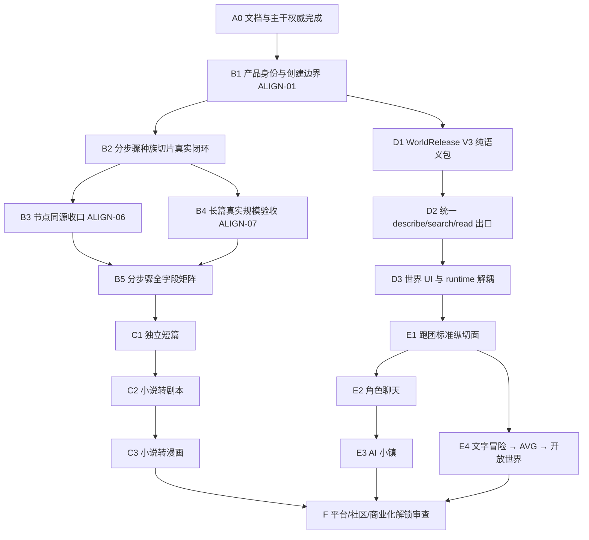

# StoryForge 项目总纲对齐审计

> 审计版本：1.0.0<br>
> 审计日期：2026-08-26<br>
> 对照权威：[StoryForge 项目总纲](../PROJECT-MASTER-CHARTER.md) 1.0.0<br>
> 审计对象：已整合全部已知本地分支、远程分支及开放 PR 独有提交后的统一主干候选<br>
> 状态：现状裁决与后续纠偏施工依据；不是“当前全部已经完成”的宣称

## 1. 结论先行

StoryForge **没有丢失核心技术积累，也不需要推倒重写**。当前主干已经形成了很有价值的共享底座：三注册表、受治理采纳、durable Harness、渐进式 Context Gateway、长程事实与记忆、节点 DAG、不可变 release/hash、上层产品 production/build/runtime 雏形，以及小说转剧本、漫画等数据基础。

但项目此前多条分支齐头并进，造成了一个明确的产品架构问题：**共享技术底座正在成熟，产品所有权与数据边界却被“一个项目就是一个世界、所有功能都从世界出发”的旧实现重新混在一起。** 这正是当前“感觉项目可能跑偏”的来源。

本次审计给出的总裁决是：

- 分步骤长篇的 Harness 主干可以继续保留和加固，不需要再做一次全盘 Harness 重构；
- 节点模式已经具备同源的关键基础，但世界观/故事等节点仍有通用直连生成旁路，尚未完整复用分步骤 Skill/Harness；
- “百万级”工程门已经证明大规模内容下的有界检索与关键事实召回机制，但它是 **100 万字符合成夹具**，不能等价为真实模型已经写完并维护了一部百万字小说；
- 世界引擎已有编号、revision、release、hash 和分享基础，但当前 release 仍以一个 `Work` 为根，并混入 AVG 媒资、叙事运行模块和诊断 runtime；这与“纯语义、只读出口、不拥有上层媒资和运行数据”的总纲冲突；
- 上层产品已有不少纵向生产设施，但部分入口仍从可变 Project/World 草稿取数，且世界引擎界面能够直接创建运行实例；产品边界还没有真正锁死；
- 短篇仍主要是长篇的 workflow profile；剧本和漫画拥有较扎实的数据与 UI 基础，但还没有达到各自端到端主 Agent 产品的完成标准；
- 社区市场、托管和平台能力已经出现在产品面，但按总纲应在核心产品成熟前默认隐藏或明确实验性，避免继续横向扩张。

因此，后续不是“再造一套新架构”，而是按本报告的依赖顺序完成 **产品身份拆分、世界 release 纠偏、统一世界出口、节点同源收口和真实长篇验收**。数据库修改应以增量迁移和兼容读取完成，不得删除用户已有数据。

## 2. 审计范围与证据规则

### 2.1 审计范围

本报告检查了以下关联闭包：

1. 产品入口与用户可见关系；
2. `Project / World / Work / ProductRelease / Runtime` 所有权；
3. 三注册表和导入、导出、删除、迁移、重映射；
4. 分步骤长篇的 Skill、Context、candidate、stale、adopt、memory 和规模门；
5. 节点模式模板、执行器、领域执行、采纳和恢复；
6. 世界 release 的内容范围、不可变性和下游读取；
7. 跑团、角色交互、文字游戏的 production/build/release/runtime；
8. 短篇、剧本、漫画的产品身份与生产闭环；
9. 当前 UI 中平台、社区和商业化相关能力的暴露情况。

### 2.2 证据等级

- **已实现**：代码、注册表和回归测试形成闭环。
- **部分实现**：已有可信基础，但仍有旁路、缺少产品阶段或只有局部测试。
- **未对齐**：当前行为与总纲明确冲突。
- **未实现**：总纲要求存在，但当前未找到可交付入口和完整闭环。
- **实验性可保留**：技术成果有价值，但不应作为当前正式产品能力暴露。

本报告不把旧蓝图、旧完成卡或页面文案当作实现证据。行号只用于本次快照定位；长期施工应以文件中的符号、契约和测试 ID 为准。

## 3. 已对齐且应保留的核心能力

| 编号 | 能力 | 当前裁决 | 证据与意义 |
| --- | --- | --- | --- |
| BASE-01 | 三注册表治理 | 已实现、继续作为最高代码事实源 | `CONTEXT_SOURCES`、`FIELD_REGISTRY`、`PROJECT_TABLES` 已覆盖 AI 读取、正式写入和表生命周期；架构检查器可阻止常见旁路。 |
| BASE-02 | 候选与正式数据分离 | 已实现 | 统一 artifact/candidate、stale 检查、作者采纳和 `adopt()` 已进入长篇与节点关键路径，刷新后候选恢复也已有持久化基础。 |
| BASE-03 | durable Harness | 已实现可信主干 | 正式 Skill/Run Contract、步骤证据、有限修复和 durable run/checkpoint 已建立；后续应收口缺口，不另建第二套 runner。 |
| BASE-04 | 渐进式上下文 | 已实现基础 | Context Gateway 已把目录、资源描述符、检索、原文/结构化详情和预算证据分层；这就是用户提出的“像 Skill 一样按需披露项目内容”的正确工程落点。 |
| BASE-05 | 长程事实与记忆 | 已实现基础 | 事实、实体、关系、时间、叙事蓝图、原文证据、磁盘记忆和多层检索已具备；长程夹具能够验证早期、中段、近期事实。 |
| BASE-06 | 节点图治理 | 已实现基础 | 官方模板、类型化 DAG、依赖、stale、领域采纳、持久运行与恢复已经存在；不是纯视觉占位。 |
| BASE-07 | 不可变发布基础 | 已实现基础 | World revision/release 和多个 ProductRelease 使用内容 hash、来源 release 和不可变版本，为后续正确分界提供可迁移基础。 |
| BASE-08 | 上层生产设施 | 部分实现但值得保留 | 游戏 production brief、内容/规则/媒资要求、build、质量门、release、runtime 已有横向共享设施；跑团和角色交互有较完整的专用增量。 |
| BASE-09 | 改编数据谱系 | 已实现基础 | `adaptationProjects`、source units、剧本场次、漫画页/格、视觉主体和媒资表已经登记并带来源作品关系，适合继续做独立产品。 |
| BASE-10 | 运行私域隔离 | 基本对齐 | 上层 runtime/session/checkpoint 有自己的 owner、source release/hash，未发现运行结果自动写回共享世界 Canon 的正式路径。 |

这些能力解释了为什么本次不建议大重构：问题主要位于“谁拥有这些能力、在哪个产品阶段使用、从哪个不可变出口读取”，而不是基础设施完全不可用。

## 4. 关键不一致清单

### 严重度定义

- **P0**：继续开发会扩大错误产品/数据边界，应在下一批功能前处理。
- **P1**：不立即导致数据污染，但会阻止总纲中的产品真正成立。
- **P2**：命名、展示或完整度表达不准确，会持续误导开发和用户。

### 总览

| ID | 严重度 | 现状 | 总纲目标 | 所属阶段 |
| --- | --- | --- | --- | --- |
| ALIGN-01 | P0 | 所有 Project 自动获得世界身份并在产品中心投影为世界 | 长篇、短篇、剧本、漫画可独立存在；仅显式发布才成为世界 | B/D |
| ALIGN-02 | P0 | WorldRelease 可包含上层游戏内容、AVG 媒资和运行模块 | 世界 release 仅包含版本化叙事语义与证据 | D |
| ALIGN-03 | P0 | 世界引擎页面可直接创建诊断 runtime | 上层产品必须先完成独立 production/build/release 再运行 | D/E |
| ALIGN-04 | P1 | 跑团、角色交互、游戏各自手写 WorldRelease 读取清单 | 统一 `describe/search/readWorldResource` 出口，注册表驱动 | D |
| ALIGN-05 | P1 | WorldRelease 固定以一个 Work 为根且无能力画像/正文出口 | 世界可部分或完整封存，含能力画像、主支线、正文与原文证据 | D |
| ALIGN-06 | P1 | 节点中世界观/故事等生成仍走通用 `chat()` 路径 | 节点与分步骤逐能力共用同一 Skill/Harness/Context/adopt | B |
| ALIGN-07 | P1 | 百万规模门是合成字符夹具和有界检索证明 | 真实模型、真实长篇工作负载的百万字产品验收 | B |
| ALIGN-08 | P1 | 短篇是长篇 workflow profile 和同一 Project 创建入口 | 独立轻量产品、owner、入口、状态与验收 | C |
| ALIGN-09 | P1 | 剧本/漫画有表和工作台，但主 Agent 生产闭环仍不完整 | 两个独立端到端 Agent 产品 | C |
| ALIGN-10 | P1 | 市场/托管/平台页已进入主产品导航 | 阶段 F 前默认隐藏或严格实验性授权 | A/B |
| ALIGN-11 | P1 | 上层产品横向铺开，AI 小镇等纵切面不完整 | 先做一个标准纵切面，再按产品契约复制设施 | E |
| ALIGN-12 | P2 | 世界完整度由单一百分比、`assets/runtime` 域共同表达 | 明确能力画像；语义实体不称媒资；runtime 不属于世界 | D |
| ALIGN-13 | P2 | 部分上层入口绑定可变 Project 的 `worldVersion` | 必须绑定不可变 WorldRelease ID/hash | D/E |
| ALIGN-14 | P2 | 有界/持续体验契约尚未贯穿全部上层产品 | 每个产品都有规模、结束或有限持续循环契约 | E |

## 5. 逐项证据、原因与修复

### ALIGN-01 · 独立产品被自动世界化

**现状与证据**

- [`projectToWorld()`](../../src/pages/ProductHubPage.tsx#L171) 将每个 `Project` 都转换为 `ProductWorld`；产品中心最终对全部项目执行该转换。
- [`ensureProjectWorldIdentity()`](../../src/lib/product/world-identity.ts#L9) 和项目加载逻辑会为任何项目补 `worldCode/worldVersion`。
- [`createLocalWorkspace()`](../../src/lib/world-engine/create-workspace.ts#L99) 在创建工作区时原子创建 `Project + World + Work`；该内部 scope 结构本身可以保留，但它目前又被直接解释成可共享世界产品身份。
- 新建世界、短篇、长篇最终共用同一 `createProject` 入口；界面文字明确称“分步骤作品直接进入同一个世界工作台”。

**为什么发生**

旧架构用 `Project` 作为本地导入导出和 scope 根，又为了给所有功能快速提供 world/work 外键而统一创建了 `World + Work`。这是合理的内部兼容策略，但后续产品 UI 和分享身份把“内部 scope root”误当成“用户已经创建了一个世界引擎”。

**目标状态**

- `WorkspaceRoot`/内部 scope 可以继续存在；它不自动拥有可分享 `worldCode`。
- 长篇、短篇、剧本、漫画分别有明确 `productKind` 与 owner。
- 只有用户执行“创建世界引擎”或“从作品发布到世界草稿/封存”时，才创建公共世界身份。
- 作品可引用世界，但作品修改不回写世界；作品也可完全不引用世界。

**施工任务**

1. `BOUNDARY-01A`：新增显式根类型与迁移标记，区分内部 workspace world scope、独立作品和 shareable world；先兼容读，禁止用是否存在 `World` 行推断产品类型。
2. `BOUNDARY-01B`：拆分创建命令：`createLongformProject`、`createShortFictionProject`、`createAdaptationProject`、`createWorldEngineDraft`。
3. `BOUNDARY-01C`：删除 `Project → ProductWorld` 全量投影；世界库只查询显式世界身份。
4. `BOUNDARY-01D`：为旧数据提供无损分类向导。无法确定的旧 Project 默认为独立长篇，不自动公开为世界；原有 world code 作为兼容别名保留，直到用户确认。
5. `BOUNDARY-01E`：补创建、导入导出、删除、复制、重映射和旧库升级反例。

**验收**：创建长篇后世界库不新增世界；长篇完整可用；显式“发布为世界”后才出现稳定编号；删除任一方不误删另一方；旧项目升级不丢数据。

### ALIGN-02 · WorldRelease 混入上层媒资和运行内容

**现状与证据**

- [`PROJECT_TABLES`](../../src/lib/registry/project-tables.ts#L592) 将 `gameDefinitions`、角色交互场景/冒险模块、AVG 演出与媒资等多张 Work-owned 表登记为 `communityShare: 'world'`。
- [`buildWorldReleaseManifest()`](../../src/lib/world-engine/releases.ts#L162) 直接把所有 `communityShare === 'world'` 的表作为可发布集合。
- [`buildPortableReleaseProject()`](../../src/lib/world-engine/releases.ts#L133) 特别把共享 blob 冻结到 `avgMediaBlobs`，错误信息也直接称“AVG 共享媒资无法冻结到 WorldRelease”。
- 当前 manifest 仍包含 `workTitle`、任意 selected tables 和整个 portable project，而没有总纲要求的语义能力画像。

**影响**

世界版本会随某个 AVG/聊天/游戏产品的媒资和演出变化而变化；多个用户引用同一世界时也难以区分“世界事实”与“某个衍生产品版本”。这会放大包体、泄漏私域生产物，并让上层产品无法独立演化。

**目标状态**

- `WorldReleaseV3` 仅保存世界语义目录、能力画像、结构化记录、原文证据引用和完整来源 manifest。
- 产品媒资只进入 `ProductBuild/ProductRelease`；公共 media/blob 层只负责存储，owner 仍是产品。
- `communityShare` 不能继续同时表示“世界语义可发布”和“某类产品可分发”。

**施工任务**

1. `WORLD-REL-01`：拆分注册表发布策略为 `worldSemanticShare`、`productDistribution` 和 `neverPackage`（准确命名由实施时类型设计确定）。
2. `WORLD-REL-02`：定义 `WorldReleaseManifestV3`、能力画像和稳定 resource ID；仅从注册表语义域派生。
3. `WORLD-REL-03`：新增 V2 兼容读；停止创建含媒资的新 V2 release。
4. `WORLD-REL-04`：迁移旧 V2：语义内容进入 V3；AVG/聊天/游戏记录与媒资重建为对应 ProductRelease 候选，不能静默丢弃。
5. `WORLD-REL-05`：加入包内容白名单/反名单、大小预算、hash、导入往返和恶意跨 owner 反例。

**验收**：任意 WorldRelease 包中不出现产品媒资、session、checkpoint、玩家状态或产品 build；旧 release 仍可读取与迁移；迁移前后语义 hash/来源可验证。

### ALIGN-03 · 世界引擎能够绕过上层产品直接运行

**现状与证据**

- [`WorldNarrativeReleasePanel`](../../src/components/world-engine/WorldNarrativeReleasePanel.tsx#L203) 可以从 WorldRelease 直接创建 `chatgame/NPC` 诊断实例。
- 同一面板一边提供统一 game production bridge，一边又保留“封存世界后直接运行”的旧路径。
- [`WorldEngineWorkspace`](../../src/components/world-engine/WorldEngineWorkspace.tsx#L179) 同时展示世界内容、Work 管理、release、runtime 统计和运行状态机。

**目标状态**

世界引擎只负责编辑、能力诊断、封存、版本比较和提供出口。诊断可以验证包结构，但不得产生正式上层 session。所有正式运行必须属于一个产品实例并经历 brief → production → build → ProductRelease。

**施工任务**

1. `WORLD-UI-01`：移除/隐藏世界页面中的正式 runtime 创建；将结构诊断改为纯内存或测试命名空间。
2. `WORLD-UI-02`：从 World Projection/Workspace 中移除 runtime 域、产品媒资和上层状态卡片。
3. `WORLD-UI-03`：保留“用该版本创建跑团/聊天/游戏”的显式 handoff，只传 WorldRelease ID/hash。
4. `WORLD-UI-04`：测试世界封存不会产生任何 Product/Session 行；handoff 未确认前零写入。

### ALIGN-04 · 缺少统一不可变世界数据出口

**现状与证据**

- 跑团 [`world-source.ts`](../../src/lib/ttrpg/world-source.ts#L28)、角色交互 [`world-source.ts`](../../src/lib/character-interaction/world-source.ts#L16)、游戏生产 [`context.ts`](../../src/lib/game-production/context.ts#L18) 和文字游戏 [`world-generation.ts`](../../src/lib/text-game/world-generation.ts#L34) 分别维护自己的 release 表名、selection key、manifest 解析和摘要规则。
- 有些读取器会主动解析 `avgMediaAssets`，进一步固化 ALIGN-02。
- 当前 Context Gateway 对活动工作区的目录/搜索/读取已经很强，但没有同等契约的 immutable WorldRelease provider。

**目标状态**

实现总纲定义的三层出口：

```text
describeWorldRelease(releaseId/hash)
→ searchWorldRelease(query / SourceRequirement)
→ readWorldResource(resourceId, detailLevel)
```

产品只声明需求，不声明底层表；出口返回匹配、缺失、冲突、omitted/insufficient、来源和原文证据。

**施工任务**

1. `WORLD-OUT-01`：复用 Context Gateway 的 resource descriptor/provider 模型，为 WorldReleaseV3 建只读 provider；不要新造无关的第四套上下文系统。
2. `WORLD-OUT-02`：目录和 resource ID 从 `PROJECT_TABLES + CONTEXT_SOURCES` 的世界语义声明派生。
3. `WORLD-OUT-03`：定义产品侧 `SourceRequirement`；先迁移跑团作为参考实现。
4. `WORLD-OUT-04`：逐个删除四套手写 reader 清单，保留薄 adapter 兼容旧 release。
5. `WORLD-OUT-05`：以早期/中期/晚期事实、低频伏笔、冲突、原文回读、预算不足和错误世界隔离做规模测试。

### ALIGN-05 · 世界 release 仍是单 Work 快照，能力画像不足

**现状与证据**

- [`WorldReleaseManifestV2`](../../src/lib/types/world-release.ts#L29) 必须有一个 `workTitle`，只有 tables/modules/dependencies/portableProject，没有能力画像、资源目录或 omission 语义。
- [`buildPortableReleaseProject()`](../../src/lib/world-engine/releases.ts#L71) 要求一个具体 `WorkspaceScope` 和 `Work`，并把 portable project 的名称、描述、体裁等改写为该 Work。
- release 面板当前主要按 foundation/characters/narrative/outline 选择，无法明确表达“仅世界观”“含主支线”“含细纲”“含正文及证据”等能力。

**目标状态**

世界可以从部分设定到完整小说级语义包；它可以引用多个来源作品/片段，但不被某一个 Work 身份取代。能力画像逐项说明可用域、覆盖、revision、确认/候选/冲突、原文证据和索引。

**施工任务**

- 与 `WORLD-REL-02` 同步定义 source contribution、capability profile 和 resource catalog。
- 正文不必复制为一个超大字符串；可由不可变 chunk/resource + hash + 原文证据索引封存。
- 多世界加入子世界 release、关系、通道和允许引用范围，而不是仅打包更多表。
- 上层产品不能只看“80% 完整”；必须验证自己的最低 capability requirements。

### ALIGN-06 · 节点模式尚未对所有长篇能力同源

**已经对齐的部分**

- [`creation-chain.ts`](../../src/lib/node-authoring/creation-chain.ts#L71) 定义了世界 → 故事 → 角色 → 卷 → 章 → 细纲 → 正文的真实 DAG。
- [`executor.ts`](../../src/lib/node-authoring/executor.ts#L471) 在采纳前执行 stale 检查，并对受治理字段使用领域采纳或统一 `adopt()`。
- durable graph run、恢复、同源/跨模式 stale 回归已经存在。

**缺口证据**

- [`domain-execution.ts`](../../src/lib/node-authoring/domain-execution.ts#L634) 只为角色、大纲、细纲、正文、章节组织和事实等一部分节点提供领域执行。
- [`executor.ts`](../../src/lib/node-authoring/executor.ts#L378) 对其余 `generate-field/generate-collection` 节点回退到通用 `chat()`，使用节点描述拼 Prompt。官方长篇模板中的世界观和故事节点因此并未完整复用分步骤对应 Agent Skill/Run Contract。

这就是过去“明明重构了 Harness，为什么编辑器/节点还会有手写来源或直连”的结构性原因：Harness 主干存在，但不是所有入口都已完成注册和迁移。当前分步骤正文对 `activeNarrativeBlueprint` 的登记缺失已经由注册表和回归测试修复；剩余问题是把同类旁路系统性清零，而不是再次只补一处清单。

**施工任务**

1. `NODE-SAME-01`：建立“分步骤动作 ↔ Skill ID ↔ Context contract ↔ Adoption target ↔ Node type”的机器可校验矩阵。
2. `NODE-SAME-02`：为世界、故事、关系、主支线及官方模板全部节点接入相同领域 Skill/Harness；禁止正式节点落入通用 `chat()`。
3. `NODE-SAME-03`：通用模型节点只保留为用户明确创建的实验节点，输出只能是内存草稿或显式 artifact，默认不得写 Canon。
4. `NODE-SAME-04`：标准分步骤流程导出/导入官方节点模板；同一数据在两个入口修改后 stale、刷新、采纳和下游 Prompt 一致。
5. `NODE-SAME-05`：架构检查器扫描未登记 AI call 和正式节点 fallback。

**验收**：每个官方节点都能指向唯一正式 Skill/Run Contract；删除通用 fallback 后官方模板仍全部通过；同一个“种族与民族”场景矩阵在分步骤和节点两种入口得到相同读写证据。

### ALIGN-07 · 百万规模工程门不等于百万字产品认证

**现有真实能力**

- [`long-form-scale-gate.ts`](../../src/lib/evals/long-form-scale-gate.ts#L4) 定义 10 万、30 万、100 万字符级别，并验证固定预算下的上下文包、来源选择、遗漏证据和事实召回。
- [`R-PHASE4-long-form-scale-gate.test.ts`](../../tests/regression/R-PHASE4-long-form-scale-gate.test.ts#L204) 使用 500 章、100 万字符合成夹具，检查早期、中段、近期事实以及错误世界/未来事实隔离。
- 该 gate 自己明确声明：它证明的是有界上下文和精确证据，不评价文学质量。
- 真实长篇 acceptance 目前覆盖十万级内容与磁盘记忆同步，但没有让真实模型连续创作、修改、刷新、恢复并验收一部百万字作品。

**准确结论**

当前架构在理论与工程机制上 **具备向百万字级长篇扩展的可信基础**，但项目尚未获得“百万字真实可用”的产品证书。尤其不能把 100 万字符直接宣传成 100 万中文词，也不能用一次检索成功代表数千次创作循环中的累计一致性。

**施工任务**

1. `LONG-EVAL-01`：把指标明确区分字符、中文词/字、token、章节数和实际原文体积。
2. `LONG-EVAL-02`：建立 10 万 → 30 万 → 100 万字分层真实语料与真实模型 durable run；允许分批运行和断点恢复，不能一次塞入上下文。
3. `LONG-EVAL-03`：每层覆盖生成、扩写/润色前后版本、人工编辑、stale、采纳、刷新、导出导入和后续章读取。
4. `LONG-EVAL-04`：建立隐藏金标准：事实、关系、时间线、伏笔、角色声音、主支线进度、禁写信息和原文定位；按严重度评估遗漏/矛盾。
5. `LONG-EVAL-05`：记录 provider/model/prompt/Skill/version/成本/耗时/重试，禁止用单一模型偶然成功作为架构完成。
6. `LONG-EVAL-06`：加入长时间运行的数据库体积、索引、恢复、浏览器内存和交互性能门。

**完成判据**：三档真实闭环达到预设召回、冲突、恢复和人工质量阈值；失败能定位到 context selection、memory extraction、Skill、model 或 adoption，而不是只得到“生成质量不好”。

### ALIGN-08 · 短篇仍不是独立产品

**现状与证据**

- 产品中心把短篇和长篇放在同一个 Novel 页面；短篇主要通过 `NovelWorkflowProfile` 切换。
- 新建短篇和长篇共用相同 Project/World/Work 创建入口。
- `WorkKind` 主要区分 `novel/screenplay/comic`，没有独立短篇 owner 和完整产品状态。

**目标与施工**

- `SHORT-01`：定义独立 `ShortFictionProject` 或等价明确 owner；可复用长篇 Skill，但有自己的 brief、规模、结构、candidate、revision、export 和完成状态。
- `SHORT-02`：独立创建/列表/打开/删除/导入导出；不产生世界身份。
- `SHORT-03`：将 profile 作为内部策略而不是产品身份；旧 profile 数据无损迁移。
- `SHORT-04`：真实 E2E 覆盖从意图到完整短篇、修改、恢复和导出。

### ALIGN-09 · 小说转剧本和漫画尚未形成完整 Agent 产品

**已有基础**

- 改编项目、source units、场次、漫画页/格、视觉主体、媒资和来源作品字段已进入注册表和生命周期。
- 已有 Screenplay/Comic 工作台、部分生成、QA 和导出能力。

**缺口**

目前更接近“有数据模型和编辑工作台的功能集合”，尚未证明用户只需确认改编目标后，主 Agent 能完成源文解析、计划、生产、有限修复、组装、质量审校和最终交付。漫画的人物/服装一致性、表情动作、漫画语言、文字排版、镜头连续性和媒资选择仍需专用验证，而不能依赖通用图片生成。

**施工任务**

- `ADAPT-01`：分别定义 screenplay/comic brief、状态机、Skill 集、source evidence、quality report、immutable release。
- `ADAPT-02`：源作品可 linked 或 detached；锁定 revision/hash，源文修改触发显式影响分析而非静默变化。
- `ADAPT-03`：剧本先完成一个端到端标准纵切面，再做漫画；不要同时扩展两个半成品。
- `ADAPT-04`：漫画建立视觉 subject bible、reference set、镜头/气泡/拟声/字体布局约束和分页渲染验收。
- `ADAPT-05`：媒资 owner 是漫画产品，不进入世界引擎。

### ALIGN-10 · 平台与市场能力过早成为正式产品入口

**现状与证据**

- [`ProductHubPage`](../../src/pages/ProductHubPage.tsx#L99) 的一级导航包含“社区市场”，首页也把它作为正式功能卡。
- 仓库已经合入 marketplace、托管、能力授权等代码。部分能力有显式 consent gate 和“未开启在线服务/支付”的保护，这是值得保留的安全基础。

**裁决**

代码成果可以保留，不能继续占据当前正式路线。阶段 F 前应默认隐藏在实验/开发开关后，测试和安全维护继续执行；不得让平台页面数量掩盖长篇、世界出口或上层纵切面未完成。

**施工任务**：`STAGE-GATE-01` 建立产品 capability flag；production 默认只展示当前已通过正式验收的产品。社区/托管/支付/市场需要阶段 F 决策记录和独立安全审查才能解除。

### ALIGN-11 · 上层产品横向铺开，标准纵切面尚未完成

**现状**

跑团、角色聊天、文字冒险、AVG、复杂模拟、开放世界均已有不同深度的页面、表和服务；跑团 production、统一 game production、角色交互 release 的完成度相对最高。AI 小镇尚未形成独立 production/release/session 产品。

**风险**

如果继续同时补所有页面，会让它们各自复制世界读取、记忆、体验规模、媒资、build 和 runtime 约定，重复此前分支间不一致的问题。

**施工顺序**

1. `UPPER-REF-01`：在世界 V3 出口完成后，选择跑团作为第一个标准纵切面。
2. 贯通锁定 release → 配置/会谈 → brief → 内容/规则/媒资 → build → quality repair → ProductRelease → session → 私域演化。
3. 抽取只有被跑团真实证明可共享的 production/runtime 契约。
4. 再完成单/多角色聊天；AI 小镇单独立项。
5. 文字冒险 → AVG → 文字开放世界依次验收；复杂模拟能力作为开放世界内部设施，不先单独扩成营销产品。

### ALIGN-12 · 世界能力域和完整度表达误导

[`WorldProjection`](../../src/lib/world-engine/domain.ts#L11) 同时包含 `work` 和 `runtime`；域定义把语义角色/地点/物品称为 `assets`，并把 simulation session 称为世界 runtime。readiness 又以基础、assets、narrative 的固定比例和单一百分比判断。

修复时应：

- 将语义对象命名为 entities/characters/relations 等，避免与媒体资产混淆；
- runtime 从世界投影移除；
- 单一百分比只做摘要，产品决策读取 capability profile；
- “可用”按请求产品的 requirements 判断，不存在一个对所有产品通用的固定完成阈值。

### ALIGN-13 · 上层绑定的是可变 Project 版本，不一定是 release

[`BindingBanner`](../../src/pages/ProductHubPage.tsx#L229) 显示来自 Project 的 `worldCode@worldVersion`；产品中心选择器的世界集合也来自全部 Project 投影。部分深入的 production 路径已经使用 release ID/hash，但入口级语义仍会让用户误以为草稿版本就是锁定快照。

修复应把选择分成：选择世界 → 选择不可变 release（默认最新已封存）→ 展示 hash/能力/缺口 → 创建产品草稿。没有 release 时只允许先去封存，或显式复制语义为该产品私有输入，不得悄悄读取变化中的草稿。

### ALIGN-14 · 体验规模与结束契约未统一落地

统一 game production contract 已出现目标规模、预算和结束相关字段，但跑团、聊天、各文字游戏 UI/状态机并未全部按照“有界体验/有限持续循环”验收。

每个上层产品要明确：

- 有界模式的时长、场景/章节、分支、结局、完成条件和预算；
- 持续模式每轮的有限目标、checkpoint、暂停、总结、继续和请求结局；
- 规模调整对内容、媒资、成本、兼容和旧存档的影响；
- 绝不以一个无限 Agent run 实现“无限演绎”。

## 6. “种族与民族”切片对全流程的代表性裁决

用户此前选定的“世界观 → 人文环境 → 种族与民族”切片，仍应作为阶段 B 的第一条跨模式验收基准。它不是只测试一个按钮，而是检验全架构是否闭环：

```text
空项目/项目名称
→ 用户输入与其他世界观内容
→ Context Gateway 目录与按需资源
→ races Skill + Run Contract
→ 模型调用/结构修复
→ durable candidate + 来源证据
→ 刷新恢复
→ stale 判断
→ 采纳到 worldviews.races
→ 人工编辑 revision
→ 角色/故事/大纲/细纲/正文下游读取
→ 节点模式读取与生成同一事实
→ 导出导入/世界切换隔离
```

本轮对该切片的裁决：

- 候选、采纳、stale、上下文与 durable 证据已有 Harness 基础；
- 用户人工修改必须立即形成新 revision，系统自动识别旧候选 stale；不应要求用户另点一个容易忘记的“更新”按钮才能让数据生效；
- “扩写/润色事实保留验证器”暂不作为阻断门，按用户决定先做清晰的原版/新版对照和人工选择；但不得把未经采纳候选当 Canon；
- 项目名称只能是低权重创作提示，不得主导空项目生成或诱导模型解释标题概念；该权重需进入可评测 Prompt 合同；
- 世界观、故事、角色之间的联动应通过注册的资源需求和渐进披露实现，不在组件手拼字段；
- 采纳正文与 Codex 词条提取是两个可追踪动作，词条补全不能反向改写正文；
- 分步骤与节点必须运行同一个 `races` Skill/Context/Adoption contract；这项验收将直接验证 ALIGN-06 是否关闭。

## 7. 数据迁移与兼容策略

上述纠偏涉及真实用户本地数据，必须遵守“增量、可回退、先读后写、先影子验证”的原则。

### 7.1 禁止事项

- 不通过删除旧表“解决”产品边界；
- 不把每个旧 Project 自动公开为可分享世界；
- 不丢弃旧 V2 WorldRelease 中的媒资或产品记录；
- 不在组件 mount 时执行不可恢复的批量重分类；
- 不让新旧 reader 同时长期写两套 Canon；
- 不用 `worldCode` 是否存在作为唯一迁移判据。

### 7.2 推荐迁移波次

1. **标识层**：新增明确 product/world identity 和来源字段；旧数据只读分类报告。
2. **双读层**：新查询优先新身份，缺失时使用旧兼容映射，并记录迁移证据。
3. **影子构建**：从旧 V2 release 构建 V3 世界包和 ProductRelease 候选，比较 row/hash/source。
4. **作者确认**：有歧义的旧项目让作者选择“独立作品、世界、或两者有显式来源关系”。
5. **单写层**：新入口只写新契约；旧 reader 保留有期限的兼容读取。
6. **收口层**：所有导入导出、删除、复制、世界/产品切换和回滚测试通过后，才移除旧写入路径。

### 7.3 必须保留的恢复证据

- 迁移前完整备份与 schema 版本；
- 每个 owner 的旧 ID → 新 ID 映射；
- release/content/media hash；
- 未分类、冲突、跳过和失败记录；
- 可重复 dry-run 报告；
- 在隔离浏览器库中的 round-trip 与 downgrade/恢复说明。

## 8. 后续施工顺序

本报告把总纲阶段转换为可执行依赖图：



### 第一批：必须先做

1. `BOUNDARY-01A~E`：停止独立作品自动世界化；建立无损迁移。
2. 以“种族与民族”完成真实 UI/API 场景矩阵并修复发现的问题。
3. `NODE-SAME-01~05`：消除官方节点的通用 AI 旁路。
4. `LONG-EVAL-01~06`：把百万字符工程门升级为分层真实产品验收。
5. `STAGE-GATE-01`：把阶段 F 和未完成上层产品从正式导航降为实验能力。

### 第二批：独立创作产品

短篇 → 剧本 → 漫画逐个达到完整产品验收；每个完成后再开下一个，不再以同时出现三个工作台为完成。

### 第三批：世界引擎纠偏

`WORLD-REL` → `WORLD-OUT` → `WORLD-UI`。先建立可迁移的新 release 和统一出口，再删除旧 reader/运行入口；顺序不可反过来。

### 第四批：上层产品

跑团作为标准纵切面。它证明世界只读引用、产品媒资、信息隔离、build/release、可运行和私域演化后，才提炼共享设施给角色聊天、AI 小镇和文字游戏。

## 9. 每批共同质量门

每个纠偏批次至少通过：

1. 三注册表关联闭包和架构检查；
2. schema/迁移/导入导出/删除/复制/重映射正反例；
3. stale、刷新、中断、重试、非法 JSON、超长输出和预算不足；
4. project/world/work/product/session 多作用域隔离；
5. release/hash 不可变和来源重现；
6. 定向单测、完整 Vitest、TypeScript、lint、build、CI；
7. 独立浏览器数据中的真实 UI/API E2E；
8. 用户任务完成度与人工体验验收，不用“所有测试通过”替代内容质量。

任何迁移若无法证明不丢数据，应停止扩大修改、保留隔离备份和失败证据，再做专项裁决。

## 10. 当前项目状态地图

| 产品/体系 | 当前成熟度 | 下一可验证里程碑 |
| --- | --- | --- |
| 共享工程底座 | 较强 | 收口产品身份与 release 语义，不复制新底座 |
| 分步骤长篇 | 主路径基础较强，真实全量验收不足 | 种族切片 → 全字段矩阵 → 真实百万字分层验收 |
| 节点模式 | DAG/运行/采纳强，生成同源不完整 | 官方模板 100% 映射正式长篇 Skill/Harness |
| 短篇 | 部分实现 | 独立 owner、入口、完整创作与导出 E2E |
| 小说转剧本 | 数据/工作台基础 | 独立主 Agent 端到端交付一个真实剧本 |
| 小说转漫画 | 数据/工作台/媒资基础 | 视觉一致性与漫画语言驱动的完整成品闭环 |
| 世界引擎 | release/分享基础存在，边界未对齐 | V3 纯语义 release + 统一渐进式数据出口 |
| 跑团 | 上层中最接近标准纵切面 | 绑定 V3 release 后真实多人信息隔离 E2E |
| 角色聊天 | 多角色/生产/运行基础 | 单/多角色正式产品闭环，再独立 AI 小镇 |
| AI 小镇 | 未形成独立产品 | 在角色聊天稳定后单独立项 |
| 文字冒险/AVG/开放世界 | 多种实验基础，完成度不一 | 依次完成，不共用一个 type 开关冒充产品 |
| 平台/市场/商业化 | 提前存在实验代码 | 默认隐藏，阶段 F 再解锁 |

## 11. 最终裁决

StoryForge 当前不是“完全跑不通”，也不是“已经能够稳定交付所有愿景”。更准确地说：

> 项目已经拥有一套相当扎实、甚至超前于当前产品完成度的共享叙事工程底座；真正需要纠正的是各产品对这套底座的所有权、发布边界和完成顺序。

后续最重要的纪律有三条：

1. 不再以新增页面、表或 Agent 数量衡量完成，而以一个用户任务的生产—采纳—发布—运行闭环衡量；
2. 不再因共用数据库根对象而把独立作品误称为世界，也不因世界可被引用而让它拥有上层媒资和运行；
3. 不再重写已经成立的 Harness/Context/registry 基础，只消除旁路、补真实验收，并通过迁移把产品边界变成代码事实。

按本报告顺序完成后，项目会从“能力很多但边界模糊”进入“产品独立、底座共享、世界可复用、上层可持续演化”的目标形态。以后继续迭代的主要原因才会逐步转向模型能力、检索技术、媒资技术和真实用户体验，而不是重复修补本应一次明确的架构关系。
