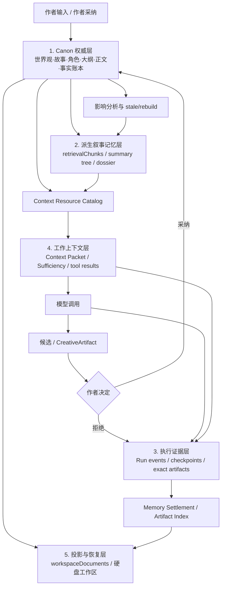

# Codex Harness / Symphony 与 StoryForge 记忆工程整合审计

> 状态：`EXTERNAL REFERENCE REVIEWED · PLAN INTEGRATION REQUIRED`
>
> 日期：2026-08-21
>
> 审查对象：OpenAI 官方文章、`openai/codex`、`openai/symphony`，以及 StoryForge 当前 Harness、Memory Engineering 和分步骤世界引擎施工方案。
>
> 相关方案：[StoryForge 分步骤世界引擎 Harness 修复与迭代施工方案](./WORLD-ENGINE-HARNESS-REPAIR-IMPLEMENTATION-PLAN-20260821.md)

---

## 1. 先澄清“Codex 把 Harness 开源了”指什么

这件事包含两个不同层次，不能混在一起：

1. [`openai/codex`](https://github.com/openai/codex) 是 Codex CLI 的开源仓库。OpenAI 在
   [Unrolling the Codex agent loop](https://openai.com/index/unrolling-the-codex-agent-loop/)
   中明确把其中的 agent loop 和执行逻辑称为 Codex harness。本文审查固定在 commit
   `536f86e5cc9ec1ff38457d099bf320b9d08eeeba`。
2. [`openai/symphony`](https://github.com/openai/symphony) 是之后公开的上层长期任务编排规范和实验参考实现。
   它通过 Codex App Server 调用 Codex harness，负责工作项、隔离工作区、调度、重试、对账和可观察性；
   它不是另一个模型上下文 Harness，也不是 `openai/codex` 的替代品。
3. [Harness engineering](https://openai.com/index/harness-engineering/) 文章介绍的“百万行、零人工手写代码”
   内部产品仓库并没有随文章整体开源。公开的是方法论、Codex 自身 Harness，以及 Symphony 参考实现。

因此，本次应同时参考两套公开资产：

```text
openai/codex
  └─ 单个 Agent 会话如何构造上下文、调用模型/工具、压缩、持久化和恢复

openai/symphony
  └─ 多个长期工作项如何调度、隔离、重试、对账和持续执行
```

对 StoryForge 当前分步骤世界引擎，`openai/codex` 的直接参考价值更高；Symphony 的价值主要落在
长输出父子 Run、世界持续演化和未来游戏生产，而不是让“种族与民族”立即变成多 Agent 系统。

---

## 2. 外部源码真正证明了什么

### 2.1 Codex 不是“把所有资料塞进 Prompt”

Codex 的 `ContextManager` 区分原始历史、模型可见历史、token 信息和上下文基线；正常历史增量追加，
compaction 或 rollback 才提高 `history_version` 并安装新的 replacement history。`AGENTS.md` 还给模型可见
上下文设置了明确规则：每个注入项都必须有硬上限，单项不得无限增长，大项必须额外审查。

可迁移结论：

- StoryForge 的 Context Gateway 方向正确：先目录导航，再按需读取，而不是扩大全量 Prompt。
- Context Packet 必须是一次 attempt 的冻结模型视图，不能在调用后按当前 Canon 重算。
- source ordering、tool schema ordering 和 Prompt 片段顺序必须确定，既利于复现，也利于缓存。
- 正常流程不应在同一 attempt 内偷偷改写既有上下文；变化应形成新的 attempt、Context Packet 和 hash。

### 2.2 Compaction 是工作上下文替换，不是历史事实删除

Codex 的 compaction 会生成 replacement history，并把它作为 checkpoint 持久化。恢复时，
`rollout_reconstruction.rs` 从最新仍有效的 replacement history 开始，再重放后续 rollout tail；旧 rollout
仍是恢复与审计依据。源码还明确警告：长线程和多次压缩会降低模型准确性。

可迁移结论：

- StoryForge 只能压缩“本次模型看到的工作视图”，不能用摘要覆盖 Canon、运行证据或原文。
- 每个压缩产物必须带上游 source refs、source hashes、覆盖范围、压缩策略版本和状态。
- 刷新恢复必须从 durable Run/event/artifact 重建工作上下文，不能从 React 组件状态恢复。
- 摘要树不是“压缩后唯一真相”；必要时必须能回到原文锚点。
- 百万字能力不能靠连续 compaction 宣称，必须靠分层目录、确定性选择、原文回查和独立评测证明。

### 2.3 Codex 把 rollout、工作上下文和长期 Memory 分开

`openai/codex` 的 Memory 管线分两阶段：

1. Phase 1 从符合条件的近期 rollout 中有界抽取 `raw_memory` 和 `rollout_summary`，使用 claim、并发上限和
   retry backoff 防止重复和热循环。
2. Phase 2 获取全局锁，把有界的 Phase 1 结果整理为 `MEMORY.md`、`memory_summary.md`、skills 和 rollout
   summaries；原始 rollout 保持不可变，合并结果可更新、清理和遗忘。

其核心不是文件名，而是四个边界：

- 原始运行记录是不可变证据；
- 工作上下文是有界、可替换的当前视图；
- 长期记忆是从证据派生的导航/经验层；
- Skill 是可复用程序，不是用户事实仓库。

这与 StoryForge 现有 Memory Engineering 的方向高度一致，但文学创作必须增加更严格的限制：Codex 可以把
“一次性工程细节”判为低价值，StoryForge 不能仅按重复次数或模型显著性丢弃一次出现的伏笔、秘密、承诺和
认知边界。文学记忆的淘汰必须由结构化事实、作者 pin、来源状态和作品边界控制。

### 2.4 工具权限属于运行时编排，不属于 Skill 内容

Codex 的 `ToolOrchestrator` 把审批、sandbox 选择、首次尝试、网络授权和失败后的升级策略集中处理；工具
handler 不各自发明审批语义。Symphony 也要求审批、sandbox、用户输入事件有明确策略，不能无限挂起。

可迁移结论：

- StoryForge 的 `formal/evaluation/simulation/experimental`、模型调用权限、repair 和写权限必须由入口与
  Run Contract 冻结，不能写成 Skill 的永久属性。
- 通用只读资料工具只负责读取；候选、采纳、repair、长输出追加调用分别由 Run 状态机控制。
- API Key、认证头和 provider secret 只能留在宿主适配层，不能进入 Context Packet、模型 Prompt 或导出证据。

### 2.5 Symphony 把“工作项”与“Agent 会话”解耦

Symphony 的关键不是 Linear，而是以下合同：

- 一个稳定工作项可跨多个 worker、thread、turn 和 retry 存续；clean worker exit 不等于工作已完成。
- orchestrator 是 claim、running、retry 和 reconciliation 状态的唯一修改者。
- 每次 tick 先 reconciliation，再 dispatch；避免已经失效的工作继续运行。
- 首次 turn 使用完整任务 Prompt；同一 thread 的 continuation 只发送续跑指导，不重复灌入整个任务。
- Workflow 配置变化只影响未来 dispatch/attempt；在途 session 继续使用冻结快照。
- 配置或模板错误不得静默退回默认 Prompt；正式派发被阻断并产生可见错误。
- stall、timeout、cancel、failure、normal continuation 是不同终态原因，对应不同重试策略。

对 StoryForge 的直接含义：

- “用户要生成一套百万字作品/一个完整游戏”是上层 Creative Work Item；一次模型 session 只是执行尝试。
- 当前 `agentRuns + parentRunId + step + attempt` 已可承载这层关系，第一阶段不应再新建一套任务表。
- 超长输出和持续演化必须按父 Run/子 Run、累计预算、reconciliation 和最终 join receipt 实现。
- 世界引擎小字段点击生成仍优先单 Run 快路径，不为模仿 Symphony 人为拆成多 Agent。

以上不只存在于规范文字中。审查的 Symphony implementation commit
`8001b52e3062495a16e520e4ceaf8f9de868c4d0` 已分别在 `orchestrator.ex`、`workflow_store.ex` 和
`agent_runner.ex` 落地 claim/retry 状态、last-known-good Workflow 热加载、同 thread continuation 和
`max_turns` 回交 orchestrator 的行为。

---

## 3. StoryForge 现有记忆工程的真实结构

当前 Memory Engineering 已经封板，不能被 Context Gateway 重新解释成另一套“AI 记忆中心”。源码和测试证明：

| 现有能力 | 当前权威语义 | 本轮应如何复用 |
|---|---|---|
| Canon 领域表 | 作者输入与已采纳事实的唯一权威 | Gateway 最终读取和原文回查目标 |
| `workspaceDocuments` | 浏览器记录与硬盘文件的绑定、三方同步基线 | 只做投影/恢复，不做 Context 或运行证据正文仓库 |
| `agentRuns / agentRunEvents / agentRunCheckpoints` | durable Run 状态、事件和恢复 | 继续作为运行状态唯一账本 |
| `MemoryArtifactRefV1 / MemoryArtifactIndexV1` | 从现有事件/领域记录派生的证据引用目录 | 扩展为可引用 exact run artifact，但不复制 Canon |
| `retrievalChunks` | 可重建的章节检索缓存 | 大正文 provider 的候选定位，不具事实裁决权 |
| `narrativeSummaryNodes` | 可重建、带状态的章→卷→书摘要树 | 目录/summary 层；stale/rebuilding 不注入 |
| `consistencyDossier` | 有界、带 source refs 的结构化一致性上下文产品 | 强制事实/状态/认知/时间资源 provider |
| Memory Settlement | Run 终态、候选、采纳、Context hash 与磁盘状态的结算 | 新 exact artifacts 必须进入同一结算，不建第二账本 |

一个关键事实是：`MemoryArtifactIndexV1` 当前只有引用，不保存 artifact body；对应测试还明确要求
`artifactRefs` 中不存在 `text`。因此：

- “已经有 Memory Artifact”不等于“已经能逐字恢复模型请求”。
- 当前方案提出的 exact `agentRunArtifacts` 有必要，但其角色必须限定为运行证据实体。
- 它不能替换 `MemoryArtifactIndexV1`，也不能另建独立的“记忆结算”；应被现有 settlement/index 引用。
- 它更不能变成把所有 Canon、候选和摘要再复制一遍的万能正文表。

---

## 4. 整合后的五层模型



五层的不可混淆边界：

1. **Canon 权威层**：决定故事世界“现在是什么”。
2. **派生叙事记忆层**：帮助定位和压缩，但可失效、可删除、可重建。
3. **执行证据层**：回答“这次运行实际发生了什么、模型看到了什么”，追加式、非 Canon。
4. **工作上下文层**：回答“这一次 attempt 让模型临时看什么”，有界、可压缩、不可反向成为事实。
5. **投影与恢复层**：把正式数据和证据安全带到硬盘、备份和恢复流程，不产生新的业务权威。

Skill、Prompt 模板、selector 和 policy 是横跨这些层的程序/规则，不属于用户内容层，也不是第六个记忆库。

---

## 5. 对当前施工方案的必要修订

### 5.1 在 CTXG-1 前增加 `MEMINT-0` 封口任务

`MEMINT-0` 必须先冻结：

1. 上述五层各自的表、类型、owner、authority 和生命周期。
2. `ContextManifestV2`、`MemoryArtifactRefV1`、新 exact artifact 与 settlement 的引用关系。
3. exact artifact 的内容寻址、去重、压缩、导出、清理、`evidence-pruned` 和禁存 secret/隐藏推理规则。
4. compaction checkpoint 的 source span/hash、策略版本、替换视图和恢复重放语义。
5. Context Gateway 复用 `retrievalChunks`、`narrativeSummaryNodes`、`consistencyDossier` 的方式。
6. Skill/Prompt/policy 热更新只作用于未来 attempt；在途 Run 使用冻结版本。

未完成该任务前，不应新增 `agentRunArtifacts` schema，也不应把 Context Gateway 接到所有页面。

### 5.2 exact artifact 必须接入现有 Memory Settlement

建议采用以下兼容语义：

```text
agentRunArtifacts
  = 内容寻址、不可变、非权威的证据 body

agentRunEvents / ContextManifest
  = 哪个 run/step/attempt 以什么角色引用哪个 artifact hash

MemoryArtifactRef / MemoryArtifactIndex
  = 面向恢复与硬盘投影的稳定证据目录
```

实现时：

- 给 `MemoryArtifactRef` 增加兼容的新 `sourceKind = agent-run-artifact`，或发布 V2；不得复用
  `domain-record` 冒充 exact artifact。
- artifact 以 `projectId + artifactKind + contentHash` 去重；Run 引用通过事件/Manifest 持久化。
- project 删除级联删除全部 artifact；单 Run 删除后按仍存活引用做 mark-and-sweep，不按简单 FK 误删共享内容。
- 导出只带仍被保留引用的 artifact；导入后 hash 不变，运行引用可重建。
- artifact 只保存实际送达/返回的外部可见载荷，不保存密钥、认证头或模型隐藏推理。
- 显式清理后保留 hash、manifest 和清理回执，UI 显示 `evidence-pruned`。

### 5.3 增加工作上下文 compaction 合同

当前方案已有摘要、截断和 source snapshot，但还需要冻结：

- `workingContextGeneration` / `historyVersion`；
- 被替换的 Context Packet hash；
- replacement packet hash；
- source refs、source revisions 和覆盖范围；
- compaction strategy/prompt/provider/version；
- 前后 token、被保留/丢弃的资源和原因；
- 恢复时的 base checkpoint + tail replay；
- 原始 run artifacts 不因 compaction 删除。

StoryForge 不必复制 Codex 的 encrypted compaction item；需要复制的是“可恢复替换视图 + 不可变原始证据”的边界。

### 5.4 把 Symphony 原则用于长任务，而非普通字段生成

适用：

- 超长输出父子 Run；
- 整卷/整部大纲和正文生产；
- 世界持续演化；
- 后续游戏生产、美术/音乐并行和可玩版本组装。

暂不适用：

- 为一次“种族与民族”生成增加任务看板、轮询器或多个 Agent；
- 把每个检索步骤变成独立 session；
- 引入 Linear、服务端 daemon 或第二套 scheduler。

第一阶段复用 `agentRuns.parentRunId`、step/attempt、budget、checkpoint 和 receipt；只有真实需求证明现有表达不足时，
才评估新增 Creative Work Item 表。

---

## 6. 借鉴优先级

| 优先级 | 借鉴项 | StoryForge 动作 |
|---|---|---|
| P0 | 原始运行证据与模型可见上下文分离 | exact artifact 接入现有 settlement；Context Packet 冻结 |
| P0 | compaction checkpoint + tail replay | 增加可恢复 working-context generation 合同 |
| P0 | 单一编排状态修改者 | UI 只发命令/读投影，Run event store 决定状态 |
| P0 | 无效配置/证据 fail-closed | 正式入口禁止默认 Prompt、旧来源清单和无 trace 采纳 |
| P1 | “地图而非百科全书”的渐进披露 | Catalog→summary/focused/full/original；复用现有派生记忆 |
| P1 | Skill 只承载程序，内容按需读取 | 用户手稿不转 Skill；资源 provider 读取 Canon |
| P1 | work item 与 session/attempt 分离 | 长输出/持续演化使用 parent Run + child Run + join |
| P1 | 有界 claim、lease、backoff、stall | 用于长任务和派生记忆重建，普通点击不自动重试 |
| P1 | in-flight frozen configuration | Prompt/Skill/policy 更新只影响未来 attempt |
| P2 | 仓库/工作区差异驱动的增量整理 | 复用 workspaceDocuments 三方 baseline，不再造 Git 记忆库 |
| 不采纳 | 自动把模型摘要提升为故事事实 | 派生记忆永不自动变 Canon |
| 不采纳 | 频率/使用次数决定文学事实存亡 | 伏笔、秘密、承诺由结构化/pin/source 状态保护 |
| 不采纳 | 为当前分步骤字段全面多 Agent 化 | 保持单领域 Skill + 有界只读工具循环 |
| 不采纳 | Symphony 的无持久 DB 恢复方式 | StoryForge 保留 IndexedDB durable Run 和完整导入导出 |

---

## 7. 新增验收项

### 7.1 记忆与证据隔离

- 候选、拒绝结果和 raw model response 不进入 Canon/长期事实层。
- 派生摘要/检索块删除后，Canon 与 exact run evidence 不受影响。
- exact artifact 删除后，运行显示 `evidence-pruned`，不伪装可复现。
- Memory Settlement 能从 Run 追到 exact artifact hash；工作区恢复后引用仍有效。
- secret、认证头和隐藏推理在 artifact/export 中为 0。

### 7.2 Compaction 与恢复

- 多次 compaction 后刷新，可从最新有效 checkpoint + tail 得到相同 working context hash。
- Canon 修改会 stale 未来选择，不会重写历史 Context Packet。
- 任何摘要都能回到 source ref；stale/rebuilding 摘要不得进入 formal Prompt。
- 一次出现但 pinned/must-read 的伏笔在百万字夹具中仍可发现并回查原文。
- compaction 前后分别记录 token、保留集合、遗漏集合和策略版本。

### 7.3 长任务编排

- 一个工作目标可跨 child Run、attempt 和 provider session 恢复；session success 不等于目标完成。
- 同一 child task 不重复 dispatch；刷新后 claim/retry 可重建。
- clean continuation 与 failure retry 分开计数和预算。
- stall/timeout/cancel/stale-input 有不同证据和停止行为。
- Skill/Prompt 更新不改变在途 attempt；下一 attempt 显式记录新版本。

---

## 8. 源码证据索引

### OpenAI 官方说明

- [Unrolling the Codex agent loop](https://openai.com/index/unrolling-the-codex-agent-loop/)
- [Harness engineering](https://openai.com/index/harness-engineering/)
- [An open-source spec for Codex orchestration: Symphony](https://openai.com/index/open-source-codex-orchestration-symphony/)

### `openai/codex` 固定 commit

- [ContextManager / history](https://github.com/openai/codex/blob/536f86e5cc9ec1ff38457d099bf320b9d08eeeba/codex-rs/core/src/context_manager/history.rs)
- [compaction](https://github.com/openai/codex/blob/536f86e5cc9ec1ff38457d099bf320b9d08eeeba/codex-rs/core/src/compact.rs)
- [remote compaction v2](https://github.com/openai/codex/blob/536f86e5cc9ec1ff38457d099bf320b9d08eeeba/codex-rs/core/src/compact_remote_v2.rs)
- [rollout reconstruction](https://github.com/openai/codex/blob/536f86e5cc9ec1ff38457d099bf320b9d08eeeba/codex-rs/core/src/session/rollout_reconstruction.rs)
- [local live writer](https://github.com/openai/codex/blob/536f86e5cc9ec1ff38457d099bf320b9d08eeeba/codex-rs/thread-store/src/local/live_writer.rs)
- [Memory pipeline](https://github.com/openai/codex/blob/536f86e5cc9ec1ff38457d099bf320b9d08eeeba/codex-rs/memories/README.md)
- [Memory consolidation prompt](https://github.com/openai/codex/blob/536f86e5cc9ec1ff38457d099bf320b9d08eeeba/codex-rs/memories/write/templates/memories/consolidation.md)
- [tool orchestrator](https://github.com/openai/codex/blob/536f86e5cc9ec1ff38457d099bf320b9d08eeeba/codex-rs/core/src/tools/orchestrator.rs)

### `openai/symphony` 固定 commit

- [language-agnostic SPEC](https://github.com/openai/symphony/blob/8001b52e3062495a16e520e4ceaf8f9de868c4d0/SPEC.md)
- [orchestrator](https://github.com/openai/symphony/blob/8001b52e3062495a16e520e4ceaf8f9de868c4d0/elixir/lib/symphony_elixir/orchestrator.ex)
- [last-known-good workflow store](https://github.com/openai/symphony/blob/8001b52e3062495a16e520e4ceaf8f9de868c4d0/elixir/lib/symphony_elixir/workflow_store.ex)
- [agent runner continuation](https://github.com/openai/symphony/blob/8001b52e3062495a16e520e4ceaf8f9de868c4d0/elixir/lib/symphony_elixir/agent_runner.ex)

---

## 9. 最终判断

Codex 开源 Harness 与 Symphony 对 StoryForge 有实质价值，但它们并不要求我们推倒现有架构。相反，外部源码
进一步证明当前三注册表、durable Run、Context Gateway 和渐进披露方向是对的。真正需要补的是三条接缝：

1. 把 exact run artifact 接入已经封板的 Memory Settlement，而不是平行建“新记忆工程”；
2. 把 compaction 明确定义为可恢复的工作视图替换，而不是摘要覆盖原文；
3. 把长期创作目标与单次模型 session 解耦，但只在长输出和持续演化中启用上层编排。

完成这些修订后，StoryForge 的体系会比单纯复制 Codex 更适合文学创作：它既保留 Codex 的渐进披露、运行恢复、
证据和工具边界，又保留 StoryForge 已有的 Canon、作者采纳、时序事实、角色认知、伏笔保护和硬盘恢复工程。
这才是“综合现有记忆工程重构”，而不是跟随新闻再造一遍 Harness。
