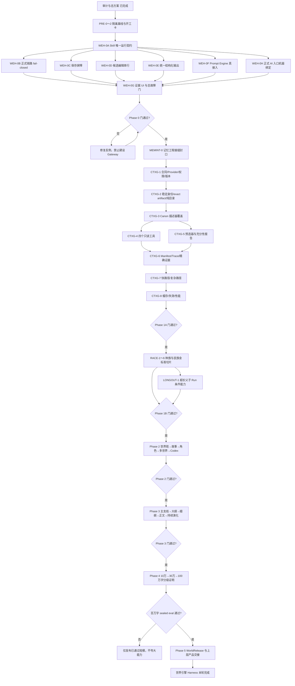
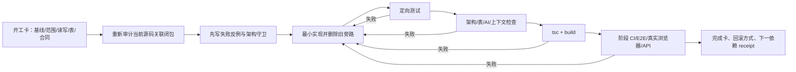

# StoryForge 分步骤世界引擎 Harness 施工图与进程表

> 日期：2026-08-21<br>
> 性质：施工顺序、依赖、验收门和长期进度的单一跟踪页<br>
> 上位方案：[`WORLD-ENGINE-HARNESS-REPAIR-IMPLEMENTATION-PLAN-20260821.md`](./WORLD-ENGINE-HARNESS-REPAIR-IMPLEMENTATION-PLAN-20260821.md)<br>
> 规则：本页只跟踪施工，不改写上位方案。任务边界、技术合同或验收标准发生变化时，先修订上位方案，再同步本页。

审计依据还包括：[`WORLD-ENGINE-STEP-FLOW-AUDIT-20260821.md`](./WORLD-ENGINE-STEP-FLOW-AUDIT-20260821.md)、[`WORLD-ENGINE-HARNESS-PLAN-CLOSURE-AUDIT-20260821.md`](./WORLD-ENGINE-HARNESS-PLAN-CLOSURE-AUDIT-20260821.md) 和 [`CODEX-HARNESS-MEMORY-INTEGRATION-AUDIT-20260821.md`](./CODEX-HARNESS-MEMORY-INTEGRATION-AUDIT-20260821.md)。

## 1. 当前状态快照

| 维度 | 当前状态 | 说明 |
|---|---|---|
| 流程审计 | 已完成 | 已确认分步骤模式不是“完全跑不通”，但存在来源漂移、fail-open、保存竞态、候选竞态和上下文截断等结构性缺口 |
| 方案封板审计 | 已完成 | 已补全工程合同、反例、迁移、灰度、回滚和完成定义 |
| Codex Harness 对照 | 已完成 | 已吸收单一运行契约、可审计运行证据、渐进式披露、checkpoint + tail replay 等可复用原则 |
| 记忆工程接缝 | **已完成** | 五层记忆平面、exact artifact/settlement、retention 和 compaction replay 接缝已签收 |
| 业务代码施工 | **⛔ Phase 1B 外部 Provider 额度阻断** | RACE-1～5 已签收；V11 部分真实证据归档；V12 机械门全绿，但 grader preflight 在创建 fixture 前连续收到 Agnes `insufficient_user_quota` |
| 当前工作树 | **存在大量并行改动** | 当前分支 `feat/ttrpg-game-platform`、基线 `2c9ad71`；实际施工前必须先建立隔离分支/工作区并核对正确基线 |
| 下一工作单元 | `GATE-P1B` | 外部补足同一 Agnes Key 的可用额度后恢复目标，按 V12 新 checkpoint 从 0/100 运行；门未通过不得进入 Phase 2 |

进度口径：不按代码行数计算百分比。每个工作单元只有在“完成卡 + 定向验证 + 阶段要求的完整门禁”齐全后才从待开始变为已完成；阶段门未通过，下一阶段不得标记开始。

## 2. 状态图例

| 标记 | 含义 |
|---|---|
| `✅ 已完成` | 交付物、反例、验证和完成卡齐全 |
| `🚧 进行中` | 已建立开工卡并正在施工 |
| `⏳ 待开始` | 前置已满足或等待前置完成 |
| `⛔ 门禁阻断` | 验收门失败，禁止继续扩大 |
| `◇ 条件项` | 只有产品启用对应能力时才必须施工 |

## 3. 总施工图



关键顺序只有一条：**先把旧主链收口，再封记忆接缝，再建 Gateway，再用一个金切片证明，之后才推广和验证百万字。** 不允许把动态检索直接叠到当前仍有旁路和 fail-open 的链路上。

## 4. 施工阶段总览

| 阶段 | 目标 | 核心施工单元 | 进入条件 | 退出条件 | 当前状态 |
|---|---|---:|---|---|---|
| 准备 | 隔离工作区、冻结基线和开工证据 | 3 | 总方案已封板 | 干净隔离环境、基线门禁和 WEH-0A 开工卡齐全 | ✅ 已完成 |
| Phase 0 | 让现有 Harness 主链可信 | 8 | 准备门通过 | Skill 唯一契约、正式 fail-closed、保存/候选/解析/Prompt/入口绑定全部闭合 | ✅ 已完成 |
| MEMINT-0 | 把新证据体系接入现有记忆工程 | 1 | Phase 0 通过 | 五层记忆、exact artifact、settlement、清理与 compaction replay 合同闭合 | ✅ 已完成 |
| Phase 1A | 建立 Context Gateway 通用底座 | 8 | MEMINT-0 通过 | 纯读取、稳定身份、可寻址资源、充分性、Trace、快慢路径和性能门通过 | ✅ 已完成 |
| Phase 1B | 把“种族与民族”做成金标准切片 | 6 + 1 条件项 | Phase 1A 通过 | 全场景矩阵、真实 API/E2E、质量与召回门通过 | ⛔ V12 grader preflight 被 Provider quota 阻断 |
| Phase 2 | 推广到世界观、故事、角色、多世界、Codex | 5 | 金切片通过 | 所有现有世界引擎基础域共用同一受治理主链 | ⏳ 待开始 |
| Phase 3 | 闭合主支线、大纲、细纲、正文和持续演化 | 6 | Phase 2 通过 | 创作链每一跳有来源/provenance，已写边界与演化预算受控 | ⏳ 待开始 |
| Phase 4 | 证明长篇与百万字工程能力 | 4 | Phase 3 通过 | 10万、30万、100万分级 sealed eval；只声明实际通过规模 | ⏳ 待开始 |
| Phase 5 | 向跑团、角色聊天、文字游戏等交接 | 2 | 对应规模能力通过 | WorldRelease 可冻结、反馈只生成候选、版本差异可解释 | ⏳ 待开始 |

## 5. 逐项进程表

### 5.1 准备阶段：只建立安全施工面，不修改业务能力

| 顺序 | ID | 要做的工作 | 前置 | 可验收结果 | 状态 |
|---:|---|---|---|---|---|
| 1 | `PRE-0` | 盘点当前脏工作树、并行改动和相关提交；选择正确基线；建立独立 `fix/` 或 `refactor/` 分支/工作区 | 总方案 | 用户改动零覆盖；Harness 施工与游戏平台改动隔离；记录基线 commit | ✅ 已完成 |
| 2 | `PRE-1` | 在隔离基线运行当前架构检查、TypeScript、相关测试和 build；保存已有失败，不把历史失败归因给新施工 | PRE-0 | 基线验证单、已知失败清单、可重复命令 | ✅ 已完成 |
| 3 | `PRE-2` | 对 WEH-0A 重新建立“UI → service → Skill → Context → Manifest → candidate → adopt → tests”关联闭包并填写开工卡 | PRE-1 | 文件/符号/注册表/旧入口/非范围/回滚全部明确 | ✅ 已完成 |

### 5.2 Phase 0：Harness 正式链路收口

| 顺序 | ID | 要做的工作 | 前置 | 可验收结果 | 规模 | 状态 |
|---:|---|---|---|---|---|---|
| 4 | `WEH-0A` | 把 Agent Skill 定义为唯一运行契约；Run/Manifest 只能从 Skill 解析；删除正文、大纲和 UI 的平行 `sourceKeys` 所有权；保留不可变快照及 V1/V2 兼容 | PRE-2 | prose Manifest 必含 Blueprint；大纲只在续接规则下含 prior candidate；手写来源旁路守卫归零 | M | ✅ 已完成 |
| 5 | `WEH-0B` | 大纲及正式 durable 路径 fail-closed；trace/candidate/adoption/terminal 分阶段失败不得伪成功；增加恢复态和八边界故障注入 | WEH-0A | 提交前故障正式表零写；提交后中断可幂等恢复；无 durable candidate 不可采纳 | M/L | ✅ 已完成 |
| 6 | `WEH-0C` | 建立 `PendingEditCoordinator`；blur/切页/生成/切世界统一 flush；flush 后重读 IndexedDB 并生成 content-hash revision vector | WEH-0A | 立即编辑后生成 100% 读到最新值；保存失败模型调用 0；手改后旧候选必 stale | M | ✅ 已完成 |
| 7 | `WEH-0D` | 候选使用本地 draft、debounce 和每候选 Promise queue；离开、刷新意图和采纳前强制 flush | WEH-0A | 千次快速输入最终 durable 文本一致；双候选不串；未同步候选不可采纳 | S/M | ✅ 已完成 |
| 8 | `WEH-0E` | 建立唯一 structured-output pipeline：raw evidence → deterministic salvage → strict schema → permission/scope gate → 最多一次 repair | WEH-0A | 各领域错误分类一致；自动额外调用不超过一次；不安全 salvage 不可采纳 | M | ✅ 已完成 |
| 9 | `WEH-0F` | 让世界观、故事、角色真实使用 Prompt Engine；区分 system/user override；长度与截断显式；保存模板版本和 hash | WEH-0A | 修改激活 Prompt 会改变真实请求；作者输入不再静默截断；旧 Run 读取冻结版本 | M | ✅ 已完成 |
| 10 | `WEH-0H` | 用版本化 `FormalAIEntryBindingV1` 取代“调用次数 + 文字说明”治理；正式调用集中执行；架构检查覆盖 member/alias/wrapper | WEH-0A | 每个正式入口能串联 entryId、Skill、Run、Manifest、candidate 和 adoption；未登记调用 CI 失败 | M | ✅ 已完成 |
| 11 | `WEH-0G` | 汇总证据 UI、统一错误分类、开发态故障注入和 Phase 0 完成卡 | WEH-0B～0F、0H | 用户能看到保存/冻结/候选/采纳/终态；已知 P0 路径有反例；文档不领先代码 | M | ✅ 已完成 |
| 12 | `GATE-P0` | 运行 Phase 0 全门禁和隔离浏览器主路径验证 | WEH-0G | 相关定向测试、架构守卫、tsc、build、CI/E2E 通过；失败则停在 Phase 0 | 门 | ✅ 已完成 |

Phase 0 的逻辑并行关系：`WEH-0A` 完成后，0B、0C、0D、0E、0F、0H 可在互不重叠的交付单元中并行；默认仍按表中顺序逐项签收。后续如采用并行施工，只允许并行修改边界不重叠的交付单元，避免同一 controller/Skill 文件冲突。

### 5.3 MEMINT-0：现有记忆工程接缝封口

| 顺序 | ID | 要做的工作 | 前置 | 可验收结果 | 规模 | 状态 |
|---:|---|---|---|---|---|---|
| 13 | `MEMINT-0` | 冻结 Canon、派生检索记忆、工作上下文、exact Run evidence、workspace sync 五层边界；把 exact artifact 接入现有 Memory Settlement/Index；定义 retention、mark-and-sweep、`evidence-pruned`、checkpoint + tail replay；复用现有 chunk/summary/dossier | GATE-P0 | 无第二套 Canon/receipt/记忆中心；刷新后 replay hash 稳定；raw evidence 不被 compaction 删除；密钥和隐藏推理入库数为 0 | M/L | ✅ 已完成 |
| 14 | `GATE-MEMINT` | 对五层边界、artifact 生命周期、导入导出、清理、恢复、stale/rebuilding 反例签收 | MEMINT-0 | 现有记忆工程仍是唯一结算体系，Gateway 可在其上施工 | 门 | ✅ 已完成 |

### 5.4 Phase 1A：Context Gateway 最小底座

| 顺序 | ID | 要做的工作 | 前置 | 可验收结果 | 规模 | 状态 |
|---:|---|---|---|---|---|---|
| 15 | `CTXG-1` | 定义 Policy、Descriptor、Provider、SourceRef、Sufficiency、Trace、Packet、Artifact、GatewayVersion；provider 挂入 `CONTEXT_SOURCES`，owner 从 `PROJECT_TABLES` 派生 | GATE-MEMINT | 无第四注册表；合同可序列化、hash 稳定、旧 Run 可只读恢复；candidate 默认不可搜索 | M/L | ✅ 已完成 |
| 16 | `CTXG-2` | 建立稳定 resource UID、显式幂等 backfill、纯读取目录、metadata/body 分离、内容寻址 exact artifact 表及完整生命周期 | CTXG-1 | 两次建目录 DB 零变化；导入后 resourceKey 稳定；exact packet/request/response 可逐字回读 | L/XL | ✅ 已完成 |
| 17 | `CTXG-3` | 为世界、故事、角色、规划、正文、参考建立 Canon resource descriptors；覆盖 scope、authority、revision、关系、时间、depth 和原文锚点 | CTXG-2 | 末位资源不消失；空值/删除/改名/导入/跨 scope 均有反例；世界通道规则完整 | L | ✅ 已完成 |
| 18 | `CTXG-4` | 在现有 Tool Registry 增加 catalog、search、read resource、read original evidence 四个只读工具 | CTXG-3 | 伪造 ref、越权 depth、跨 scope、坏游标、超预算全部 fail-closed；工具运行 DB 零写 | L | ✅ 已完成 |
| 19 | `CTXG-5` | 建立按 task kind 的 Mandatory Core、确定性预选器、分类配额、一跳关系扩展、早期锚点和充分性报告 | CTXG-3 | Mandatory/Pinned 100%；首中末顺序不影响结果；同输入/版本/预算 hash 稳定 | L | ✅ 已完成 |
| 20 | `CTXG-6` | 在现有 Manifest 上演进 resource/artifact trace；串联 transcript、sufficiency、artifact、Prompt、candidate 和 compaction checkpoint | CTXG-4、CTXG-5 | 任意 formal candidate 可还原实际输入集合并逐字回读；Trace 失败不可采纳；多次 replay 稳定 | L | ✅ 已完成 |
| 21 | `CTXG-7` | 接通短项目零额外调用的快路径；只在充分性报告需要且 Skill 允许时执行有限追加读取；不拆成多 Agent 团队 | CTXG-6 | 空项目 read call=0；复杂路径受次数/token/loop 硬门；工具关闭仍有确定性路径 | L | ✅ 已完成 |
| 22 | `CTXG-8` | 实现按 scope/version/content/policy hash 的缓存与失效；大正文检索复用现有 chunks/summaries/dossier；索引坏时回 Canon | CTXG-7 | 不返回已知旧值；catalog 不预载全文；provider 后端可替换但调用合同不变 | M | ✅ 已完成 |
| 23 | `GATE-P1A` | shadow read 比较新旧选源，不双写、不额外调模型；运行无副作用、scope、trace 和性能门 | CTXG-8 | G1～G5 全有实现/回归；跨 scope 泄漏 0；才允许切换第一个正式字段 | 门 | ✅ 已完成 |

### 5.5 Phase 1B：“种族与民族”金标准切片

| 顺序 | ID | 要做的工作 | 前置 | 可验收结果 | 规模 | 状态 |
|---:|---|---|---|---|---|---|
| 24 | `RACE-1` | 空态生成、项目名弱权重、具体内容最低合同和临时候选假设 | GATE-P1A | 空项目不交付占位/字段解释；标题不过锚；候选提供具体新设定 | M | ✅ 已完成 |
| 25 | `RACE-2` | 冻结 create/expand/rewrite/polish 边界；作者补充说明、Prompt override 和有限 effective length cap 进入 Run | RACE-1 | 四模式行为可区分；超 cap 明确拒绝或转 LONGOUT；不静默截尾/追加调用 | M | ✅ 已完成 |
| 26 | `RACE-3` | 建立原文—候选双版本审阅；expand/polish 默认对照，rewrite 保留可折叠旧版；对比仅作阅读辅助 | RACE-2 | 对比 UI 不写 Canon；刷新恢复同一 baseline/candidate；大文本与窄屏可用 | M | ✅ 已完成 |
| 27 | `RACE-4` | 跑完整场景矩阵：空/部分/完整、角色或故事先行、冲突、保存、刷新、stale、非法输出、取消、网络未知、World/Work 隔离 | RACE-1～3 | 机械路径 100% 可重复；故障不写脏数据；刷新/拒绝/采纳/编辑一致 | M | ✅ 已完成 |
| 28 | `RACE-5` | 拆开 Codex extraction 与 enrichment；提取只允许逐字证据，补全是独立 AI 新创候选和第二次确认 | RACE-2 | 短文允许空提取；采纳 races 不顺带改 Codex；两条路径 provenance 清楚 | M | ✅ 已完成 |
| 29 | `LONGOUT-1` | ◇ 当用户请求超过单次 cap 时，建立 parent/child Run、分段预算、幂等恢复、确定性装配和单一最终候选 | RACE-2；产品决定开放超长 | 已成功段不重复计费；半成品不可采纳；预计调用上限可见 | L | ◇ 本阶段未启用；UI 对超 cap 请求显式拒绝 |
| 30 | `RACE-6` | 建立并冻结空项目、部分世界观、末位召回、Pinned、跨 scope、对比、并发 CAS 的 transcript + outcome 评测集 | RACE-1～5；若启用则含 LONGOUT-1 | 质量/召回/泄漏/保存阈值达到上位方案门槛；真实模型结果可归因 | M/L | 🚧 Harness、CI、E2E 已完成；待真实模型 sealed run |
| 31 | `GATE-P1B` | 仅把 `worldviews.races` 作为正式 Gateway canary；在独立浏览器项目用真实 API 跑刷新、错误、采纳、多世界 | RACE-6 | 无双读双写；金切片全门通过；未启用 LONGOUT 时 UI 明确拒绝超 cap | 门 | ⏳ 待真实 API 授权与执行 |

### 5.6 Phase 2：推广到现有世界引擎基础域

| 顺序 | ID | 要做的工作 | 前置 | 可验收结果 | 规模 | 状态 |
|---:|---|---|---|---|---|---|
| 32 | `WE-1` | 将 `FIELD_REGISTRY` 中声明可生成的全部世界观字段迁入统一 controller/Gateway；复杂对象保持原生类型；冲突只给 warning/重规划候选 | GATE-P1B | 新增/删字段自动纳入守卫；每字段空态、部分态、末位、scope、刷新、stale 通过 | L | ⏳ 待开始 |
| 33 | `STORY-1` | 把 storyCore 定义为意图层、storyArcs 定义为可执行投影；建立一对多重规划候选、来源 revision/hash 和 drift | WE-1 | 无双向自动覆盖；七字段共用 Prompt/Gateway/候选/stale；冲突由作者裁决 | M/L | ⏳ 待开始 |
| 34 | `CHAR-1` | 迁移角色创建、补全和演化；目标角色完整读，其它资源按关系选择；新角色/状态/退场均先成候选 | STORY-1 | 不再 Promise.all 大包；关系、种族、地点、力量、认知可寻址；不顺写其它域 | L | ⏳ 待开始 |
| 35 | `MW-1` | 资源化世界组、通道方向、进出/力量/带出规则和跨世界身份；必要时先补数据/UI 合同 | CHAR-1 | World/Work 隔离 100%；同名实体可区分；相邻世界只在通道任务一跳展开 | M/L | ⏳ 待开始 |
| 36 | `CODEX-1` | 推广 extraction/enrichment 分离；资源化 category、entry、custom field 和原文来源 | MW-1 | 新创补全永远是候选；空提取合法；scope/刷新/stale/adopt 统一 | M | ⏳ 待开始 |
| 37 | `GATE-P2` | 跑全部世界观、七故事字段、角色、多世界、Codex 的参数化合同、E2E 和 Golden Projects | WE-1～CODEX-1 | 普通正式入口不再固定大包；所有域共用同一候选/Prompt/repair/trace/adopt；无跨域自动覆盖 | 门 | ⏳ 待开始 |

说明：WE-1、STORY-1、CHAR-1、MW-1、CODEX-1 在底层合同上可拆分交付，但推荐按上表顺序逐个 canary，避免一次迁移所有领域后无法定位问题。

### 5.7 Phase 3：主支线—大纲—细纲—正文—持续演化闭环

| 顺序 | ID | 要做的工作 | 前置 | 可验收结果 | 规模 | 状态 |
|---:|---|---|---|---|---|---|
| 38 | `ARC-1` | 资源化主线/支线、stage、事件、交汇和 progress；支持现有线扩写/重写/润色/重规划；新增线绑定触发证据和角色 | GATE-P2 | 主支线可持续添加；与故事意图冲突时显示 provenance/过期原因 | L | ⏳ 待开始 |
| 39 | `OUTLINE-1` | 卷纲/章纲 Gateway 化；删除 outline 自有来源权；明确 prior candidate 启用规则；保护已写正文 | ARC-1 | 只改未写未来；Mandatory 含意图、arcs/stages、已写边界、父节点、Blueprint；trace 完整 | L | ⏳ 待开始 |
| 40 | `DETAIL-1` | 细纲强制读取 arcs、progress、written boundary、Blueprint；场景用稳定 ID 和 replace/merge-proposal | OUTLINE-1 | 重复生成不简单 append；未知 sceneId 阻断；实际 Manifest 证明上游已读 | L | ⏳ 待开始 |
| 41 | `PROSE-1` | 正文唯一契约；Blueprint/章纲/细纲/禁写项/认知/硬事实为 Mandatory；远距事实通过 Gateway 原文回查 | DETAIL-1 | UI 无来源数组；候选确认前正文不变；生成/续写/review/revise 共用证据真相 | L/XL | ⏳ 待开始 |
| 42 | `PROGRESS-1` | 正文采纳后先生成无费用影响任务；按 off/suggest/auto-with-budget 运行有界 child runs；进度、角色、线、伏笔等仍为候选 | PROSE-1 | 无隐藏调用/写 Canon；预算、幂等、暂停、刷新、批量确认和双 Work 隔离通过 | L | ⏳ 待开始 |
| 43 | `FUTURE-1` | 冻结“已写事实/当前 Canon/运行候选/未来计划”边界；重规划默认只影响未写 outline/detail | PROGRESS-1 | 已写正文零自动修改；修改已写内容必须走独立改稿和影响图 | M | ⏳ 待开始 |
| 44 | `GATE-P3` | 跑世界观→故事意图→story arcs→outline→detail→prose→影响候选的端到端闭环 | ARC-1～FUTURE-1 | 每一跳可追踪；Blueprint 实读；重复生成幂等；未来演化不越过已写边界 | 门 | ⏳ 待开始 |

### 5.8 Phase 4：长篇与百万字能力证明

| 顺序 | ID | 要做的工作 | 前置 | 可验收结果 | 规模 | 状态 |
|---:|---|---|---|---|---|---|
| 45 | `LONG-1` | 建立 10万/30万/100万字符 Golden corpus；包含伏笔、后置角色、跨卷道具、多世界、认知边界、删除改名、顺序对照和 candidate 污染陷阱 | GATE-P3 | 每个问题有 expected resource keys、anchors、禁止 scope 和结果约束 | L | ⏳ 待开始 |
| 46 | `LONG-2` | 运行检索与生成 sealed eval；分开统计“未送达”和“送达但模型忽略”；冻结模型、grader、阈值、预算和停止条件 | LONG-1 | Mandatory/Pinned=100%；scope leakage=0；recall/事实/错误实体达到冻结阈值 | L/XL | ⏳ 待开始 |
| 47 | `LONG-3` | 测目录、搜索、读取、Gateway、token/成本、IndexedDB、内存、主线程、冷/热缓存、损坏回退 | LONG-1，可与 LONG-2 并行 | 在冻结设备达到性能门；不能评测后改阈值；输入无不可接受阻塞 | L | ⏳ 待开始 |
| 48 | `LONG-4` | 建立十类失败归因和分级发布语言；检索、模型、parser、stale、adoption、rubric 问题分开 | LONG-2、LONG-3 | 每个失败可定位架构层；宣传只到已通过规模，不承诺绝对一致 | M | ⏳ 待开始 |
| 49 | `GATE-100K` | 对 10 万字符夹具运行完整 sealed eval、性能和真实模型/人工审阅 | LONG-4 | 通过后才可称“已验证十万字级主链” | 门 | ⏳ 待开始 |
| 50 | `GATE-300K` | 在同一冻结合同上扩大到 30 万字符，不更换有利阈值 | GATE-100K | 通过后才可称“已验证常见长篇规模” | 门 | ⏳ 待开始 |
| 51 | `GATE-1M` | 在真实复合资料而非单篇长正文上运行 100 万字符 sealed eval | GATE-300K | 通过后才可称“已验证百万字级工程支持”；不得称绝对一致 | 门 | ⏳ 待开始 |

### 5.9 Phase 5：世界引擎向上层功能交接

| 顺序 | ID | 要做的工作 | 前置 | 可验收结果 | 规模 | 状态 |
|---:|---|---|---|---|---|---|
| 52 | `RELEASE-1` | 扩展版本化 WorldRelease：冻结 Canon resource manifest、revision/hash/authority/source refs、原文锚点、许可、Blueprint、arcs、Work 和 Gateway 版本 | 至少通过目标规模门 | 草稿后续修改不改变旧 Release；旧 Release 可重建当时世界基础 | M | ⏳ 待开始 |
| 53 | `EVOLVE-1` | 接通“上层运行事件 → 带证据演化建议 → 作者确认 → 新 Canon revision → 新 WorldRelease”循环 | RELEASE-1 | 跑团/角色聊天/游戏只读版本化 Release；运行事件不能直写世界引擎 Canon | M | ⏳ 待开始 |
| 54 | `GATE-P5` | 验证 Release 差异、来源 Instance/Event、反馈 adopt 生命周期和上层无事实副本 | EVOLVE-1 | 世界引擎可稳定服务后续产品，同时继续由作者控制 Canon 演化 | 门 | ⏳ 待开始 |

## 6. 七条贯穿性施工轨道

以下工作不单独排到最后，必须随每个相关施工单元一起完成；缺一项，该单元不能签完成卡。

| 轨道 | 每个相关单元都要做什么 | 核心门禁 |
|---|---|---|
| 三注册表与数据生命周期 | 逐项回答 AI 读什么、写什么、涉及哪些表；schema/migration/export/import/delete/remap/rebuild 由注册表派生 | `check:architecture`、`check:required-tables`、生命周期反例 |
| 合同与兼容 | 版本化 Skill/Run/Prompt/output/provider/tool/Manifest；旧 Run、旧 pending candidate、V1/V2/V3 诚实兼容 | 旧数据不伪造新证据；不能验证则只读/拒绝/重生成 |
| 测试与评测 | 合同、架构、生命周期、故障、检索、产品 E2E、真实模型/人工七层验证 | 定向测试 → checks → tsc → build → CI → 适用 E2E |
| 可观察性 | 作者态显示保存、来源深度、充分性、候选/stale、调用/repair；开发态可导出完整 Run evidence | 不暴露 API Key、认证头、隐藏推理或未经授权的完整手稿 |
| 灰度与回滚 | shadow → races canary → world foundation → narrative chain → long-form beta；一次只切一条正式写链 | 禁止新旧双写；Gateway 失败不得静默回旧 Prompt 继续采纳 |
| 性能与成本 | 记录 read call、token、repair、artifact 容量、P50/P95、主线程和 IndexedDB 指标 | 没有收益却显著增费时关闭可选 Agent 追加读取；隐藏调用视为 P0 回归 |
| 文档与证据 | 每项有开工卡、完成卡、测试 receipt、真实能力边界；只在证据齐全后更新能力基线 | 文档不得领先代码；没有完成卡不得标 COMPLETE |

## 7. 每一项的固定开发循环



单元内固定验证顺序：

1. 对应定向 Vitest/checker。
2. `npm run check:architecture`。
3. `npm run check:required-tables`。
4. `npm run check:ai-manual`。
5. `npm run check:agent-context`。
6. `npm run check:agent-freshness`。
7. `npm run check:source-reachability`。
8. `npm run check:canon-coverage`。
9. `npx tsc --noEmit`。
10. `npm run build`。
11. 阶段结束运行 `npm run ci`、适用的 `npm run ci:e2e` 和 `git diff --check`。

## 8. 进度更新规则

1. 每开始一个单元，把状态改为 `🚧 进行中`，并在下方进度日志写入基线 commit、分支和开工卡链接。
2. 定向测试通过但阶段门未过，只能标“实现完成、待门禁”，不能标 `✅ 已完成`。
3. 只有完成卡齐全才标 `✅ 已完成`；同时更新下一项状态。
4. 出现数据丢失、scope 泄漏、不可解释 migration、正式 fail-open、双写或第二套 Canon/receipt 时，立即标 `⛔ 门禁阻断`，停止扩大。
5. `LONGOUT-1` 若明确不开放超单次 cap，则标“◇ 本轮不启用”，由 UI 显式拒绝；不能把它误计为未完成 Bug。
6. Phase 4 的 10万、30万、100万分别签收；前一级失败不继续放大数据规模掩盖问题。
7. 计划调整必须写“原因、影响任务、迁移/兼容、退出门变化”；不得只改顺序或删除失败项。

当前不填写虚假的日历完成日期。`S/M/L/XL` 只表示相对规模；完成 `WEH-0A` 和 `WEH-0B` 后，用真实改动量、测试耗时和历史缺陷密度校准后续批次，再给进程表增加目标日期和实际完成日期。

## 9. 当前进度日志

| 日期 | 单元 | 事件 | 证据/结果 |
|---|---|---|---|
| 2026-08-21 | 方案阶段 | 完成分步骤流程审计、方案封板审计、Codex Harness/Memory Engineering 对照及总施工方案 | 见本页顶部四份上位文档；业务代码未施工 |
| 2026-08-21 | 施工跟踪 | 建立本施工图和 54 项进程表 | 下一项为 `PRE-0`；当前脏工作树必须先隔离 |
| 2026-08-21 | `PRE-0` | 从 `2c9ad71` 建立独立 `refactor/world-engine-harness` 工作区 | `/Users/qinyingying/Desktop/project/storyforge-world-engine-harness`；原工作树改动零覆盖 |
| 2026-08-21 | `PRE-1` | 完成未修改基线检查 | 8 项架构/注册表检查、61 项相关测试、TypeScript 与生产构建全部通过；依赖安装报告 16 项已知审计公告，未执行自动修复 |
| 2026-08-21 | `PRE-2` | 完成 WEH-0A 关联闭包与开工卡 | `docs/refactor/WEH-0A-START-CARD-20260821.md`；记录 UI→Skill→Context→Manifest→candidate→adopt→tests 及漂移证据 |
| 2026-08-21 | `WEH-0A` | 正文/大纲正式入口切换 Skill 派生 V2 Run Contract | 13 文件 82 项定向测试、8 项注册表/架构检查、lint、tsc、build 和 diff check 通过；见完成卡 |
| 2026-08-21 | `WEH-0B` | 大纲正式链路切换 V3 execution boundary 并收口 unified durable adoption | 36 文件 199 项扩展回归、38 项核心中断/CAS/恢复测试、8 项检查、lint、tsc、build 和 diff check 通过；见隔离工作区完成卡 |
| 2026-08-21 | `WEH-0C` | 启动保存屏障与 content revision vector 关联闭包审计 | 基线为 WEH-0B 提交；重点覆盖 blur、生成、切页、切世界、保存失败和 stale |
| 2026-08-21 | `WEH-0C` | 完成保存屏障、PROJECT_TABLES 派生 revision 和 Master/大纲/细纲/正文 stale 闭环 | 29 files / 195 项扩展回归、9 项检查、lint、tsc、build、diff check 通过；见隔离工作区完成卡 |
| 2026-08-21 | `WEH-0D` | 启动候选编辑串行与采纳前 flush 审计 | 基线为 WEH-0C 提交；重点覆盖 candidate draft、debounce、刷新恢复、双候选隔离和采纳屏障 |
| 2026-08-21 | `WEH-0D` | 完成候选本地草稿、per-candidate queue、离开保护和决策前重读 | 21 files / 109 项扩展回归、9 项检查、lint、tsc、build、diff check 通过；见隔离工作区完成卡 |
| 2026-08-21 | `WEH-0E` | 启动统一 structured-output pipeline 关联闭包审计 | 基线为 WEH-0D 提交；重点覆盖 raw evidence、salvage、schema、permission/scope gate、单次 repair 和错误分类 |
| 2026-08-22 | `WEH-0E` | 完成统一 parser、结构/gate 共用一次 repair、raw attempts 与 durable 失败分类 | 14 files / 99 项核心回归、扩大回归、9 项检查、lint、tsc、build 和 diff check 通过；见隔离工作区完成卡 |
| 2026-08-22 | `WEH-0F` | 启动世界观、故事、角色 Prompt Engine 真接入审计 | 基线为 WEH-0E 提交；重点覆盖 active template、system/user override、作者输入长度、模板版本/hash 与旧 Run 恢复 |
| 2026-08-22 | `WEH-0F` | 完成三领域真实 Prompt 渲染、模板/参数/覆盖冻结、Run Contract 绑定与旧 Run 兼容 | 14 files / 70 项扩展回归；全量 2104/2105 后唯一生成文档漂移已独立复验；10 项检查、lint、tsc、build、diff check 通过；见隔离工作区完成卡 |
| 2026-08-22 | `WEH-0H` | 启动正式 AI 入口机器绑定关联闭包审计 | 基线为 WEH-0F；重点覆盖 entryId→Skill→Run→Manifest→candidate→adoption、member/alias/wrapper 旁路与 CI fail-closed |
| 2026-08-22 | `WEH-0H` | 完成 32 个操作级绑定、集中执行器、35 个真实调用迁移和 durable entry snapshot 链接 | 全量 445 files / 2108 tests、10 项检查、lint、tsc、3947-module build 和 diff check 通过；见隔离工作区完成卡 |
| 2026-08-22 | `WEH-0G` | 启动证据 UI、统一错误分类和开发态故障注入关联闭包审计 | 基线为 WEH-0H；重点覆盖保存、冻结、候选、采纳、终态五阶段可见证据与 P0 故障矩阵 |
| 2026-08-22 | `WEH-0G / GATE-P0` | 完成五阶段证据、十二类故障、开发态故障注入和 Phase 0 总门禁 | 提交 `a2cc2f09`；完整 CI 447 files / 2116 tests，依赖 0 漏洞，隔离 Chromium E2E 53/53，入口包降至约 617.8 KiB / 184.2 KiB gzip；见隔离工作区完成卡 |
| 2026-08-22 | `MEMINT-0` | 启动五层记忆平面、exact artifact/settlement、retention 与 compaction replay 接缝审计 | 基线 `a2cc2f09`；开工卡 `docs/refactor/MEMINT-0-START-CARD-20260822.md` 位于隔离工作区 |
| 2026-08-22 | `MEMINT-0 / GATE-MEMINT` | 完成五层边界、exact evidence ledger ref、唯一 Settlement/Index、retention tombstone 与 compaction replay 合同 | 提交 `4c835b04`；完整 CI 448 files / 2123 tests，依赖 0 漏洞；见隔离工作区完成卡 |
| 2026-08-22 | `CTXG-1` | 启动 Context Gateway 合同、Provider、权限和版本关联闭包 | 基线 `4c835b04`；开工卡 `docs/refactor/CTXG-1-START-CARD-20260822.md` 位于隔离工作区 |
| 2026-08-22 | `CTXG-1` | 完成 Policy、Descriptor、Provider、SourceRef、Sufficiency、Trace、Packet、Artifact 与 GatewayVersion 合同 | 提交 `3b8587a6`；7 项新合同反例、10 项检查、lint、tsc、build 与 diff check 通过；见隔离工作区完成卡 |
| 2026-08-22 | `CTXG-2` | 启动稳定资源身份、纯目录与 exact artifact 生命周期关联闭包 | 基线 `3b8587a6`；开工卡 `docs/refactor/CTXG-2-START-CARD-20260822.md` 位于隔离工作区 |
| 2026-08-22 | `CTXG-2` | 完成 portable UID、显式原子 backfill、纯读取目录、独立检索策略版本与 exact Run evidence 生命周期 | 提交 `93e6dbf6`；9 文件 54 项关联回归、10 项静态检查、lint、tsc、build、bundle budget 与 diff check 通过；见隔离工作区完成卡 |
| 2026-08-22 | `CTXG-3` | 启动 Canon resource descriptor 覆盖与注册表派生 Provider 关联闭包 | 基线 `93e6dbf6`；先核对上位合同与现有 RAG 手写描述器，再建立开工卡 |
| 2026-08-22 | `CTXG-3` | 完成六领域 Canon descriptors、分页/分层读取、原文回查、世界通道聚合及旧 RAG 收口 | 提交 `d31af250`；8 files / 60 tests、十项静态闸门、lint、tsc、build、bundle budget 与 diff check 通过；见隔离工作区完成卡 |
| 2026-08-22 | `CTXG-4` | 启动四个 Context Gateway 只读工具与权限/预算 fail-closed 关联闭包 | 基线 `d31af250`；先审计现有 Tool Registry、run scope 与 tool-call 证据边界 |
| 2026-08-22 | `CTXG-4` | 完成四个只读工具、冻结会话、策略/作用域隔离、能力引用、预算与零写证明 | 提交 `85747f36`；8 files / 59 tests、十项静态闸门、lint、tsc、build、bundle budget 与 diff check 通过；见隔离工作区完成卡 |
| 2026-08-22 | `CTXG-5` | 启动 Mandatory Core、确定性预选、分类配额、一跳扩展、早期锚点与充分性关联闭包 | 基线 `85747f36`；先核对 task kind、Policy/Sufficiency 合同与现有检索器，再建立开工卡 |
| 2026-08-22 | `CTXG-5` | 完成五类 task policy、Mandatory/Pinned、渐进式深度、分类/kind 配额、一跳扩展、早期/最近锚点与充分性报告 | 提交 `b73369d5`；5 files / 31 tests、十项静态闸门、lint、tsc、build、bundle budget 与 diff check 通过；见隔离工作区完成卡 |
| 2026-08-22 | `CTXG-6` | 启动 Manifest、Retrieval Trace、exact input evidence 与 replay 关联闭包 | 基线 `b73369d5`；先审计现有 ContextManifestV2、Run ledger/artifact、candidate freshness 与 compaction checkpoint |
| 2026-08-22 | `CTXG-6` | 完成 Manifest V3、Selector/Packet/Source/Tool/Request/Response exact 证据链、内容/检索策略 stale 与完整 compaction base-chain replay | 提交 `e3a8c534`；隔离分支完成卡已建立；9 files / 53 tests、十项静态闸门、lint、tsc、build、bundle budget 和 diff check 通过 |
| 2026-08-22 | `CTXG-7` | 启动正式 Skill/Runner 快慢路径与“无 V3 不可候选/采纳”关联闭包 | 以 CTXG-6 提交为基线；先盘点 formal entry 共用的 execution binding、Runner tool loop、candidate gate 和可以零额外调用的短路径 |
| 2026-08-22 | `CTXG-7` | 完成 Skill 冻结 Gateway 权限、双 transport tool allowlist、确定性快路径、有限追加读取、V3 required/fresh 采纳门 | 提交 `59c5e638`；12 files / 81 tests、十项静态闸门、lint、tsc、build、bundle budget 和 diff check 通过；见隔离工作区完成卡 |
| 2026-08-22 | `CTXG-8` | 启动缓存/失效、derived retrieval memory 复用与百万字 metadata/body 性能关联闭包 | 基线 `59c5e638`；先审计现有 RAG cache、retrievalChunks/narrativeSummaryNodes/consistencyDossier、adopt/store 失效边界与性能 fixtures |
| 2026-08-22 | `CTXG-8` | 完成透明 Provider 缓存、Dexie 全局失效、坏索引 Canon fallback 与百万字性能门 | 提交 `52fa227f`；10 files / 58 tests、静态闸门、lint、tsc、build、bundle budget 和 diff check 通过；百万字 fixture 约 0.4s |
| 2026-08-22 | `GATE-P1A` | 启动 Context Gateway Phase 1A 总门 | 基线 `52fa227f`；运行完整 CI/E2E、隔离浏览器、shadow read 新旧来源对照、零副作用和跨 scope 总验收 |
| 2026-08-22 | `GATE-P1A` | Phase 1A 总门通过，进入“种族与民族”金标准切片 | 完整 CI 457 files / 2174 tests；隔离 Chromium E2E 53/53；依赖 0 漏洞；修复主世界观标题与复制方案 portable UID 回归；见隔离工作区完成卡 |
| 2026-08-22 | `RACE-1` | 启动空态生成、项目名弱权重与具体内容最低合同审计 | 基线为 GATE-P1A 提交；先核对 worldviews.races UI→Skill→Gateway→Prompt→candidate→adopt→tests 关联闭包 |
| 2026-08-22 | `RACE-1` | 完成空态具体性、项目名弱锚与 races 临时候选合同 | 提交 `4e6b1bae`；空项目只把标题作为弱创意线索，不生成字段解释或占位内容 |
| 2026-08-22 | `RACE-2` | 完成四模式边界、作者补充/Prompt override/长度合同与超 cap 显式拒绝 | 提交 `bf552116`；本阶段未开启 LONGOUT，不静默截尾或隐藏追加调用 |
| 2026-08-22 | `RACE-3` | 完成原文—候选双版本审阅与刷新恢复 | 提交 `c709af16`；expand/polish 默认对照，rewrite 可折叠查看旧版，对比只辅助决策、不改 Canon |
| 2026-08-22 | `RACE-4` | 完成 races 全故障与生命周期场景矩阵 | 提交 `d5aa9b49`；覆盖刷新、拒绝、采纳、作者编辑、stale、非法输出、取消、未知网络结果、跨 scope 与并发 CAS |
| 2026-08-22 | `RACE-5` | 完成 Codex 证据提取与 AI enrichment 分流 | 提交 `9cf4d1b8`；逐字提取允许空结果，补全是独立正式入口、独立候选并需第二次确认 |
| 2026-08-22 | `RACE-6` | 完成 100 场景冻结矩阵、真实 Harness、双模型盲评、可续跑 checkpoint 与自包含证据归档 | 提交 `88432a28`、`17447e1d`、`bd722008`；修复末位资源无限预选、详细大纲 author-edit hash 和结构化 E2E 编辑回归 |
| 2026-08-22 | `RACE-6 / GATE-P1B` | 机械门通过，真实模型门待执行 | 完整 CI 463 files / 2199 tests、依赖 0 漏洞、生产构建与 bundle gate 通过；隔离 Chromium E2E 53/53；4197 origin 尚无 API 凭据，未伪造真实质量结果、未进入 Phase 2 |
| 2026-08-22 | `RACE-6 / GATE-P1B` | V1～V10 逐次留证并修复真实协议缺陷；V11 运行至 4/100 后因 grader 额度可恢复暂停 | V11 checkpoint `d973641b2fa333378a67a22c4cb280c16f88523ca7190cb5c6cad79e7219da5f`；`empty-01`～`empty-04` 已签名，V7/V9 历史结构故障均通过；`empty-05` 为 `grader/provider` 的 `insufficient_user_quota`，未进入 Phase 2 |
| 2026-08-22 | `RACE-6 / GATE-P1B` | V11 第二次续跑确认同一 quota；V12 修复 quota/authorization/rate-limit 分类漂移 | V11 最终 checkpoint `feb455a46b8c545664a8afa5b4f0e01d5678156b01bb23e3d688256488465441`；V12 提交 `9e4ba431`，完整 CI 463 files / 2203 tests、生产依赖 0 漏洞、bundle 与隔离 Chromium E2E 53/53 通过；等待外部额度，仍未进入 Phase 2 |
| 2026-08-22 | `RACE-6 / GATE-P1B` | V12 真实 grader preflight 第三轮确认同一外部 blocker，正式标记门禁阻断 | HTTP 403 `insufficient_user_quota`；余额 `$0.001984`、预扣需 `$0.002068`；失败发生在任何 fixture/checkpoint 创建前，数据零写入；等待补足额度后恢复目标，Phase 2 未开始 |

## 10. 第一轮实际开工队列

第一轮不同时建设 Gateway，也不改变产品字段和创作功能范围：

```text
PRE-0  隔离正确基线
  ↓
PRE-1  保存当前验证基线
  ↓
PRE-2  完成 WEH-0A 开工卡和关联闭包
  ↓
WEH-0A Skill 唯一运行契约
  ↓
WEH-0B 正式 fail-closed
  ↓
WEH-0C 保存屏障
  ↓
WEH-0D 候选编辑串行
  ↓
WEH-0E 统一结构化输出
  ↓
WEH-0F Prompt Engine 真接入
  ↓
WEH-0H 正式入口机器绑定
  ↓
WEH-0G 证据 UI 与 Phase 0 总故障门
```

第一项 `PRE-0` 的完成标准不是“新建了一个分支”，而是：已确认哪个 commit/改动集合才是 Harness 的正确施工基线，当前游戏平台和其它用户改动没有被复制、覆盖或误提交，新的施工工作区可以独立运行基线验证。
