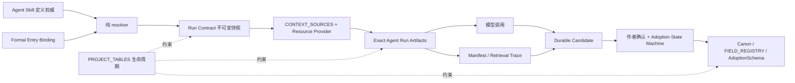
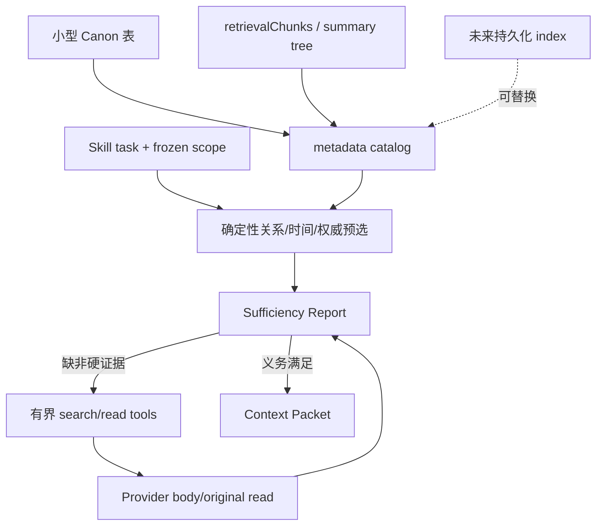
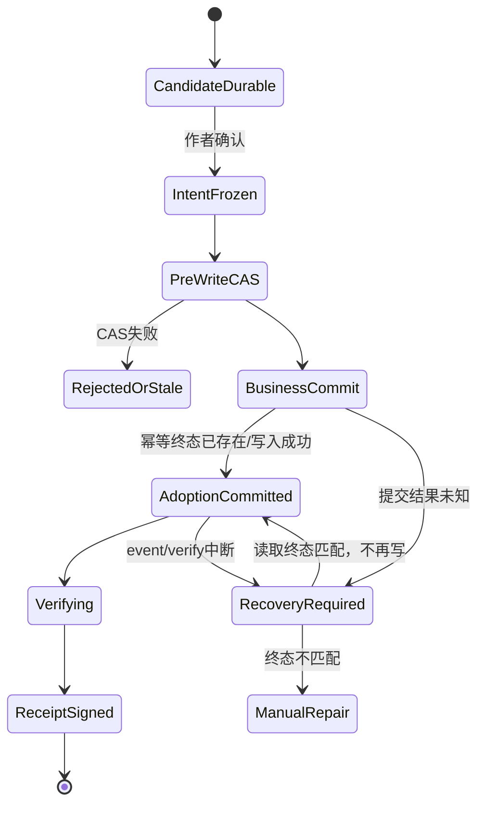

# StoryForge 世界引擎 Harness 施工方案封板审计

> 日期：2026-08-21
>
> 源码基线：`2c9ad71`
>
> 被审计方案：[WORLD-ENGINE-HARNESS-REPAIR-IMPLEMENTATION-PLAN-20260821.md](./WORLD-ENGINE-HARNESS-REPAIR-IMPLEMENTATION-PLAN-20260821.md)
>
> 审计结论：`CONDITIONAL PASS FOR IMPLEMENTATION · CODE NOT IMPLEMENTED`
>
> 含义：原方案在本审计发现的封板缺口写回后，可以作为分阶段施工总纲；这不是代码完成、质量达标或百万字能力已证明的结论。

---

## 1. 审计要回答的问题

这次不是再评一次“方向是否不错”，而是回答更苛刻的问题：

1. 按方案施工后，是否还会因为权威边界不清而重构？
2. 数据涨到百万字、模型和检索实现变化后，主调用链是否仍然成立？
3. 刷新、导入、保存竞态、网络未知和回执中断时，能否知道系统到底做了什么？
4. 用户能否把“模型写得不好”和“系统没有把资料送到模型”分开？
5. 自动分段、repair、采纳后整理是否会产生隐藏调用、重复付费或半成品写入？
6. 方案是否足够具体，能够由不同开发者实现出同一个系统，而不是各自理解？

审计不是承诺以后不改任何代码。真正可冻结的是权威、接口、证据、失败和测试接缝；模型、Prompt、selector、排序、阈值和 UI 可以继续演进。

---

## 2. 审计方法与证据边界

### 2.1 关联闭包

按项目三注册表规则，逐条建立：

```text
UI/入口
→ Skill 定义
→ Run Contract/执行边界
→ CONTEXT_SOURCES/assembleContext
→ Manifest/Run events/candidate
→ FIELD_REGISTRY/AdoptionSchema/adopt
→ PROJECT_TABLES/schema/migration/import/export/delete/remap
→ tests/checkers
```

只看 UI、Prompt 或旧发布文档均不构成完成证据。

### 2.2 红队维度

- 权威漂移：同一来源/写权限能否在两个地方独立修改。
- 历史复现：作者改过 Canon 后，旧候选输入能否逐字还原。
- 身份移植：导出导入后 resource key、trace 和 source ref 是否还指向同一逻辑实体。
- 规模替换：实时表、检索块、未来索引互换时是否要修改 Skill/工具。
- 故障恢复：每个提交边界中断后是重试、恢复验证还是重复写。
- 权限与费用：谁允许模型继续调用，调用上限何时冻结。
- 质量归因：资料未发现、未选择、未送达、送达后被忽略能否区分。

### 2.3 行业校准

本审计采用的不是“Agent 越多越好”，而是以下一手原则：

- Anthropic 的 [Building effective agents](https://www.anthropic.com/engineering/building-effective-agents) 建议从最简单、可组合的模式开始，只有质量收益可测时才增加 agentic complexity；预定义任务优先可预测 workflow。
- Anthropic 的 [Effective context engineering for AI agents](https://www.anthropic.com/engineering/effective-context-engineering-for-ai-agents) 把上下文视为有限注意力预算，强调小而高信号的上下文、just-in-time 引用和清晰、低重叠工具。
- Anthropic 的 [Writing effective tools for agents](https://www.anthropic.com/engineering/writing-tools-for-agents) 强调工具边界、错误鲁棒性和以评测驱动工具设计。
- OpenAI 的 [New tools for building agents](https://openai.com/index/new-tools-for-building-agents/) 把 tracing/observability 与 guardrails 作为生产 Agent 的基本设施。
- OpenAI 的 [A shared playbook for trustworthy third party evaluations](https://openai.com/index/trustworthy-third-party-evaluations-foundations/) 明确要求报告 harness、模型、工具、预算、重试、有效性检查和环境；只给一个最终分数不足以支持能力声明。

它们支持 StoryForge 的目标形态：固定主干 workflow + 有界工具读取 + 精确运行证据 + sealed eval，而不是自治多 Agent 团队。

---

## 3. 源码事实复核

| 事实 | 源码证据 | 对方案的含义 |
|---|---|---|
| Skill V1 已声明来源、工具、压缩、输出预算和写目标 | `src/lib/agent/skill-registry.ts:109-130` | 不能再造一份包含相同字段的 runtime config |
| Run Contract V1 已冻结来源、写目标、预算和 verifier | `src/lib/types/agent-run.ts:115-171` | 这份重复是历史运行证据，不能简单删除 |
| Manifest V2 已存在 | `src/lib/types/agent-run.ts:218-249` | 后续应加 V3，不得覆盖/假设 V2 未使用 |
| Manifest 只存 hash/token，不存交付文本；Prompt 也主要以版本/hash 留证 | `src/lib/types/agent-run.ts:190-215` 及现有 Run evidence | 当前不能逐字复现完整渲染请求 |
| `ContextSource` 目前只有整源 `read()` | `src/lib/registry/types.ts:552-573` | 可寻址资源需要挂 provider 扩展点，但不能另造来源注册表 |
| `assembleContext` 输入仍允许调用方传 `sourceKeys` | `src/lib/registry/types.ts:475-507` | formal UI/adapter 必须被禁止自行扩权或漏源 |
| 正文组件仍手写来源数组，且缺 Blueprint | `src/components/editor/ChapterEditor.tsx:1012-1025` | Harness 已有不等于所有入口已经收口 |
| RAG fallback ID 含 projectId/recordId | `src/lib/retrieval/rag-library.ts:93-106` | 导入重映射后不是永久 portable identity |
| 构建 RAG Library 会补写 ID | `src/lib/retrieval/rag-library.ts:399-407` | “读取无副作用”当前不成立 |
| RAG policy 更新没有独立 revision/hash | `src/lib/retrieval/rag-library.ts:451-468` | 选择偏好改变无法可靠进入 freshness |
| WorldGroup/Link 只有数字 ID | `src/lib/types/world-group.ts:15-75` | 多世界 resource key 还不能跨导入稳定 |
| AI 入口检查器只计数裸标识符调用 | `scripts/check-ai-entry-registry.mjs:21-33` | `api.chat()`、wrapper/service 及治理绑定无法由现检查器证明 |
| 项目已有 retrieval chunks 和可重建摘要树 | `src/lib/registry/project-tables.ts` 中 NS-5 登记 | 百万字第一版不需要等待新向量库，但必须封 provider 接口 |
| 大纲已有 adoption intent、恢复和 terminal verify 模式 | `src/lib/outline/candidate-lifecycle.ts` | 应复用并修正阶段语义，不再另建采纳框架 |

---

## 4. 原方案封板缺口与裁决

### 4.1 C0：不开工就会再次换骨架

| ID | 缺口 | 风险 | 封板裁决 | 写回任务 |
|---|---|---|---|---|
| C0-1 | `SkillRuntimeContractV2` 重复 Skill 和 Run 字段 | 三份合同继续漂移 | Skill 是可编辑定义；Run/Manifest 是由 resolver 生成的不可变快照 | WEH-0A |
| C0-2 | 执行边界被放进 Skill | 同一 Skill 无法安全用于 eval/formal，或错误给 eval 写权限 | `formal/evaluation/simulation/experimental` 归入口和 Run | WEH-0A/0B/0H |
| C0-3 | Manifest/Prompt 只有 hash，却承诺可复现 | Canon 或模板修改后历史请求丢失 | 增加内容寻址 Agent Run Artifacts；调用前保存 Context Packet/rendered request，调用后保存 raw response | WEH-0G/CTXG-2/6 |
| C0-4 | 资源 Provider 只写成概念 | 实时读取性能失败后会改 Skill/工具/API | 现在冻结 storage-neutral provider；metadata/body 分离 | CTXG-1～4 |
| C0-5 | stable identity 不完整 | 多世界/章节/通道导入后 trace 断裂 | WorldGroup/Link 和普通资源补 portable UID | CTXG-2/MW-1 |
| C0-6 | 正式入口仅人工登记 | “governed”无法证明 | 增加 formal entry machine binding 和集中执行 API | WEH-0H |

### 4.2 C1：不补会造成严重质量、费用或恢复漏洞

| ID | 缺口 | 封板裁决 | 写回任务 |
|---|---|---|---|
| C1-1 | “证据是否足够”无合同 | `ContextSufficiencyReportV1` 冻结义务、缺失、冲突、假设和是否允许继续读取 | CTXG-5/7 |
| C1-2 | policy 变化没有独立 revision | content hash 与 policy hash 分离，二者各自进入 selector/freshness | CTXG-2/8 |
| C1-3 | “自动分段”没有运行语义 | 独立 LONGOUT-1 parent/child Run；可见累计预算、幂等段、最终单候选 | LONGOUT-1 |
| C1-4 | 采纳后自动整理无调用授权 | Work 级 `off/suggest/auto-with-budget`，默认 suggest | PROGRESS-1 |
| C1-5 | durable transaction 描述过度简化 | 冻结意图、CAS、幂等提交、提交证据、终态验证分阶段恢复 | WEH-0B |
| C1-6 | 对比 UI 只写“语义/结构对比” | 首版用确定性保守段落对齐，不冒充事实验证 | RACE-3 |
| C1-7 | story core/arc 只有概念权威 | arc 增加 origin、source hash、lastAlignedHash 和 producer provenance | STORY-1/ARC-1 |

### 4.3 C2：应通过守卫避免慢性漂移

| ID | 缺口 | 封板裁决 |
|---|---|---|
| C2-1 | “17 个世界观字段”硬编码 | 字段覆盖从 FIELD_REGISTRY + generatable capability 派生 |
| C2-2 | 一开始 live-derived、以后再想索引 | 可以以后决定是否建索引，但 provider 合同、metadata/body 分离现在冻结 |
| C2-3 | 评测只写阈值，harness 变量不足 | sealed eval 冻结模型、工具、预算、重试、环境、数据和 grader；报告 validity hazards |
| C2-4 | exact evidence 可能无限增长 | 内容寻址去重、压缩、引用保留、容量指标和显式 evidence-pruned 清理 |

以上缺口均已写回被审计施工方案。若施工实现删减其中任一 C0 合同，本次 conditional pass 自动失效。

---

## 5. 封板后的权威与证据模型



必须避免两个误解：

1. Run Contract 中复制来源/写目标不是第二权威；它是当时 Skill 解析结果的不可变证据，必须带定义 hash 并做集合相等校验。
2. Agent Run Artifacts 不是第二 Canon；它们只回答“这次模型逐字收到了什么请求、返回了什么原始响应”。新生成仍从最新 Canon/Provider/Prompt 读取。

---

## 6. 百万字规模下不会换骨架的关键



这里冻结的是接口，不是算法：

- Catalog 只列 metadata，不能先读完百万字正文。
- 实体、关系、时间、authority 和 scope 使用确定性规则先选；embedding 只能 rerank，不能裁决事实。
- 长正文通过现有 retrieval chunks/摘要找候选，再由 source ref 回 Canon；索引损坏不改变 Canon。
- 以后换 embedding、数据库、模型、reranker 或索引，只能替换 provider/selector 内部实现。
- 若未来实现必须修改所有 Skill 或四个工具，说明 provider 接缝失败，不得把它包装成普通优化。

因此，方案能给出的是“百万字工程骨架无需因存储实现升级而重构”；能否达到百万字质量门仍必须由 LONG-1～4 sealed eval 证明。

---

## 7. 采纳与恢复状态机



测试必须覆盖至少八个中断边界。核心不变量：

- intent/CAS 前失败：正式表零写入。
- 业务提交后失败：同一 Run 恢复验证，不重复写。
- 终态不匹配：进入人工修复/明确失败，不“再试一次 adopt”。
- receipt 是完成证明，不是业务写入本身。

---

## 8. 超长输出与持续演化的授权边界

### 8.1 超长输出

普通字段生成有有限 effective cap。超过时只有两种合法结果：

1. 调用前明确拒绝并解释限制；
2. 用户确认 LONGOUT-1 的最大段数、累计预算和停止条件。

分段 child run 不写 Canon，最终只装配一个 candidate。半成品、缺段、超预算或网络未知均不可采纳。

### 8.2 采纳后持续演化

默认 `suggest`：正文采纳只产生不调用模型的影响任务，用户确认后才运行整理 child runs。只有用户预先开启 `auto-with-budget`，系统才可在指定任务类型和预算内自动运行。无论哪种策略，子任务产物都只是候选。

这既保留“世界引擎持续服务跑团、聊天、文字游戏”的方向，又避免把一次采纳变成不可见的任务风暴。

---

## 9. 施工前必须冻结的合同清单

| 合同 | 冻结内容 | 可继续迭代内容 |
|---|---|---|
| Agent Skill V2 | 定义权威、context policy、工具、写目标、预算上限 | Prompt、默认预算、具体策略版本 |
| Formal Entry Binding | entry→Skill/Run/adoption 的机器绑定 | UI 展现和入口文案 |
| Agent Run Contract V2 | scope、execution boundary、权限快照、预算、verifier | 新版本的附加字段 |
| Context Resource Provider V1 | metadata/body 分离、scope、read/original、fingerprint | live/index/vector 内部实现 |
| Resource Identity V1 | portable UID 与 numeric ID 分工 | UID 编码细节的后续版本 |
| Sufficiency Report V1 | obligation 状态、reason、additionalRead | 各 task 的义务集合版本 |
| Agent Run Artifact V1 | Context Packet/source snapshot/tool result/rendered request/raw response、hash、`exportable:true`、retention | 压缩格式和去重优化 |
| Manifest/Trace V3 | artifact ref、选择、遗漏、深度、policy hash | 新 trace 字段 |
| Adoption Recovery V1 | intent/CAS/commit/verify 阶段和幂等规则 | 领域 post-state verifier |
| LONGOUT-1 | parent/child ownership、累计预算、装配和单候选 | 分段策略 |
| Post Adoption Policy | off/suggest/auto-with-budget | 每个 Work 的作者选择 |

任何合同的字段命名可在首个实现 PR 中按仓库风格微调，但语义、单向依赖和失败规则不可被拆散。

---

## 10. 红队验收矩阵

| 场景 | 必须观察到的结果 |
|---|---|
| UI 私加一个 source key | 架构检查失败，不能构建 formal Run |
| Skill 加源但 Run snapshot 少源 | resolver/集合相等测试失败 |
| auxiliary entry 尝试 adopt | binding/contract 拒绝，正式表零写入 |
| 调用前 Run Artifact DB 写失败 | 模型调用为 0 |
| 作者生成后修改来源 Canon/Prompt | 旧 candidate stale；旧 Context Packet/rendered request 仍可逐字查看 |
| 导出导入多世界项目 | resource key/UID 不变，numeric FK 正确重映射 |
| catalog list 百万字项目 | 不加载全量章节正文，P95/内存达冻结门 |
| relevant 角色最后创建 | selector 仍召回，与插入顺序无关 |
| pinned policy 修改 | policy hash 改变并触发 selector/freshness 重算 |
| 模型伪造 source ref | `read_original_evidence` fail-closed |
| 证据义务未满足 | 不调用生成模型；或在授权内继续读取后重算 |
| 长输出第 4 段刷新 | 已完成段不重跑，resume 到未完成段 |
| 长输出缺段 | assembly candidate 不可采纳 |
| adoption 业务写后断电 | 恢复只校验/补 receipt，不重复写 |
| `postAdoptionPolicy=suggest` | 只显示任务，不自动调用模型 |
| `auto-with-budget` 超限 | 自动暂停并显示原因，不偷偷缩减任务或继续调用 |
| 清理无引用历史 artifact | manifest 标记 evidence-pruned，产品不再声称精确复现 |

---

## 11. 仍不能在设计阶段保证的事

以下不是遗漏，而是必须靠实现和实测回答：

- 哪个 selector/reranker 在本项目数据上最好。
- 14K、48K 或更大输入预算的最佳质量/成本点。
- 某个模型在百万字检索已正确送达后仍忽略事实的概率。
- 文学质量、创意新颖性和标题弱权重的最终阈值。
- Agent Run Artifact 去重后的真实存储增长率。
- 实时 provider 是否已足够快，何时需要持久化 catalog/index。

这些变量已经被隔离到可替换模块和 sealed eval；它们以后改变不应要求重写三注册表、Skill/Run/Adoption 主干。

---

## 12. 最终裁决与开工条件

### 12.1 裁决

修订后的方案达到“可进入 Phase 0 施工”的设计质量，理由是：

1. 没有推翻已有三注册表、Skill、durable ledger、CreativeArtifact 和 adoption 主干。
2. 定义、快照、实际输入和 Canon 四种不同语义已分开。
3. 百万字存储/检索升级被关进 provider 接口，不再向 UI/Skill 扩散。
4. 权限、费用、恢复和历史证据有明确机器合同。
5. 质量声明由冻结 harness/eval 支撑，不用大窗口或一次成功演示代替。

### 12.2 仍是 conditional pass

只有满足以下顺序，才可继续推广：

1. Phase 0 先实现定义—快照、formal entry binding、fail-closed、保存和候选主链。
2. Phase 0 完成卡与 CI 通过后，才实现 Context Gateway。
3. Provider、identity、artifact 和 lifecycle 先通过，再切 races canary。
4. Races 金切片没有通过，不得批量迁移世界观/故事/角色。
5. Phase 2/3 没有闭合，不得用“大窗口”宣称长篇可用。
6. 百万字 sealed eval 没有通过，不得宣称百万字工程支持。

### 12.3 以后允许和不允许的变化

允许：换模型、换 Prompt、调 selector、换 embedding、加索引、改阈值、优化 UI、增加新资源 kind/Skill 版本。

不允许：UI 恢复手写来源、绕过 Skill 直连模型、建立第二 Canon、Run 权限与 Skill 独立配置、索引成为事实权威、隐藏多次调用、无候选直接写正式表、提交后盲目重写。

如果以后变化只发生在“允许”一侧，这次方案就达到了用户希望的目标：后续主要因模型能力、技术和真实评测结果演进，而不是因为今天没有把基础问题想清楚。
