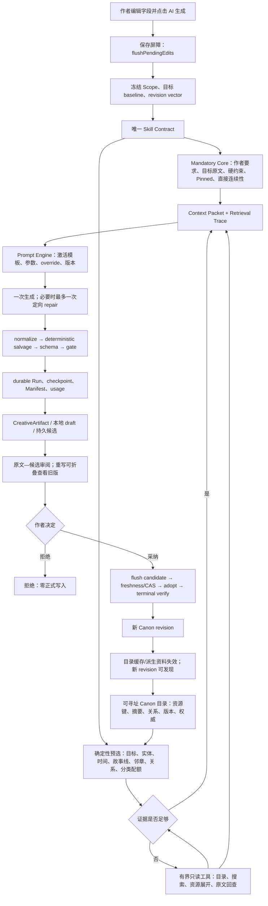
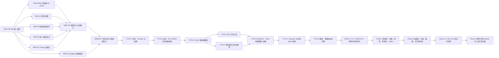

# StoryForge 分步骤世界引擎 Harness 修复与迭代施工方案

> 状态：`DESIGN CLOSURE REVIEWED · NOT IMPLEMENTED`
>
> 日期：2026-08-21
>
> 审查基线：`2c9ad71`
>
> 前置审查：[StoryForge 分步骤世界引擎 Harness 完整审查](./WORLD-ENGINE-STEP-FLOW-AUDIT-20260821.md)
>
> 封板审计：[StoryForge 世界引擎 Harness 施工方案封板审计](./WORLD-ENGINE-HARNESS-PLAN-CLOSURE-AUDIT-20260821.md)
>
> 外部 Harness / 记忆整合审计：[Codex Harness / Symphony 与 StoryForge 记忆工程整合审计](./CODEX-HARNESS-MEMORY-INTEGRATION-AUDIT-20260821.md)
>
> 适用范围：分步骤模式中的世界观、故事核心、角色、故事线、卷纲、章纲、场景细纲、正文，以及支撑这些功能的 Agent Skill、Context、durable Run、候选、采纳、长期检索和世界引擎演化出口。
>
> 明确非范围：商业化、收费、社区运营、云端多人；上层游戏生产、跑团和角色聊天只定义世界引擎交接合同，不在本方案内实现完整产品体验。
>
> 文档定位：这是一份可以拆卡施工的修复总方案，不是“已经完成”的证明。每个阶段只有满足本文件的退出门、留下完成卡并通过相应验证后，才能更新能力基线中的完成状态。
>
> 封板含义：本文件冻结的是长期架构接缝、权威关系、失败语义和验证方法，不冻结具体模型、提示词、检索算法或质量阈值。后者可以随模型和实测迭代，但不得再绕开这些接缝另造主链。

---

## 0. 最终裁决

### 0.1 不需要推倒重构，但必须做一次有边界的收口重构

StoryForge 现有方向是正确的，以下基础继续作为唯一主干：

1. `CONTEXT_SOURCES + assembleContext()` 管理 AI 读取。
2. `FIELD_REGISTRY + AdoptionSchema + adopt()` 管理 AI 确认后的正式写入。
3. `PROJECT_TABLES` 管理表的作用域、迁移、导入、导出、删除和引用重映射生命周期。
4. Agent Skill、Run Contract、durable ledger、CreativeArtifact、CAS 和 terminal receipt 管理一次生成从开始到结束的运行证据。
5. 作者填写和作者采纳的数据仍保存在现有 Canon 表中；用户内容不会被转换成 Skill，也不会复制到第二套“Skill 数据库”。

本轮需要修复的是这些基础之间没有完全收口的问题，而不是再建立一套 Agent、数据库或上下文系统。总体策略是：

> **先消除正式运行路径中的多份契约与 fail-open，再在现有上下文注册表之上增加可寻址 Canon 资料层，先跑通“种族与民族”金标准切片，随后逐域推广，最后用十万、三十万和百万字评测证明长篇能力。**

### 0.2 不能承诺“没有 Bug”或“文学一致性绝对不出错”

工程可以做到的是：

- 已识别的 P0/P1 问题全部关闭；
- 关键不变量有反例测试，失败时不写正式数据；
- 每次生成都能定位读了什么、漏了什么、为什么漏；
- 长篇召回、跨作用域泄漏、事实约束、成本和延迟有预注册指标；
- 模型仍有概率犯错时，结果停留在候选，由作者审阅、拒绝或采纳。

因此本方案追求的是“可证明地可靠、可诊断、可恢复”，而不是用文档宣称零缺陷。

### 0.3 本轮结束后应达到的效果

| 阶段 | 用户能够得到什么 | 工程能够证明什么 |
|---|---|---|
| Phase 0 | 点击生成不会读到未保存旧值；候选、刷新、编辑、采纳不再走旁路 | Skill 是唯一运行契约；正式链路 fail-closed；解析、Prompt 和证据一致 |
| Phase 1 | “种族与民族”能在空项目、部分项目和复杂项目中形成可编辑、可对照的具体候选 | Canon 内容可目录发现、按需读取和原文回查；晚出现资料不再因排列位置永久不可见 |
| Phase 2 | 世界观、故事、角色、多世界和 Codex 使用同一套生成与检索体验 | 权威关系、作用域、provenance 和资源版本统一 |
| Phase 3 | 主支线、卷章纲、细纲、正文形成持续演化闭环 | 故事线进度、Blueprint、已写事实和未来规划在同一 Gateway 下受治理 |
| Phase 4 | 大型项目仍能以有限上下文生成，并能看到检索证据 | 十万、三十万、百万字指标达到冻结门槛后，才可宣称相应规模支持 |
| Phase 5 | 世界引擎可安全向跑团、聊天、文字游戏和游戏生产提供版本化基础 | Release 不变、运行状态不反写 Canon、反馈只形成待确认演化候选 |

### 0.4 封板审计后的十五项修订

本方案在进入施工前又执行了一轮“假设模型升级、数据膨胀、刷新中断、导入重映射和作者并发编辑都会发生”的红队审计。审计没有推翻三注册表和现有 Harness，但补齐以下长期接缝：

1. `AgentSkillDefinition` 是可编辑定义；`AgentRunContract`、Context Manifest 和 receipt 是由它派生的不可变运行快照。快照中重复字段是证据，不是第二份可编辑配置。
2. `formal/evaluation/simulation/experimental` 是一次 Run/入口的执行边界，不是 Skill 的静态属性；同一 Skill 可在不同边界下运行，但只有 `formal` 可拥有作者确认写权限。
3. 资源能力直接挂到 `CONTEXT_SOURCES` 的 provider 扩展点；resource kind 从 provider 声明派生，不再手写第四个来源注册表。
4. 现在就冻结存储无关的 `ContextResourceProviderV1`；小数据可实时读取，大正文可用现有检索块，未来换持久化索引时调用方和 Skill 不变。
5. Context Manifest/Prompt hash 不足以复现模型输入；新增非权威、内容寻址的 Run Artifact 证据，保存 Context Packet、被压缩/截断来源快照、渲染后模型请求、工具结果和原始模型响应。
6. `WorldGroup`、世界通道和所有普通资源补可移植 UID；本地自增 ID 只用于定位，不再参与永久资源身份。
7. 作者的 pinned/must-read/token policy 有独立 revision/hash；策略变化与正文变化分别进入 freshness。
8. 新增确定性的 `ContextSufficiencyReportV1`；只有存在未满足证据义务时才允许 Agent 追加读取。
9. 正式 AI 入口从“文件和调用次数登记”升级为可机验的 Skill/Run/Context/Adoption 绑定；说明文字不能再代替证明。
10. 超长输出从普通单次调用中拆出有界父子 Run 协议；不再用一句“自动分段”掩盖多次调用、累计预算、恢复和最终合并语义。
11. 正文采纳后的故事线/角色/未来规划整理默认只建议，不隐藏发起付费模型调用；自动执行必须由作者显式选择并冻结预算。
12. 采纳被定义为“冻结意图 → CAS → 幂等业务提交 → 提交证据 → 终态验证”的可恢复状态机，不再把跨阶段动作笼统描述成一个不现实的原子事务。
13. 新 `Agent Run Artifact` 必须作为 exact evidence body 接入现有 `MemoryArtifactRef/Index` 与 Memory Settlement；不得建立第二套记忆结算，也不得复制成万能 Canon 正文表。
14. compaction 只替换有界工作上下文；原始 Run evidence、Canon 和原文不被覆盖。替换视图必须可由 checkpoint + tail replay 恢复，并留下前后 hash、source span 和策略版本。
15. 长期创作目标与 provider session/turn 分离；clean session exit 不等于任务完成。父子 Run、attempt、reconciliation、stall、retry 和 join receipt 只在长输出/持续演化启用，普通字段生成保持单 Run 快路径。

---

## 1. 现状、证据和问题边界

### 1.1 证据裁决顺序

当前 `AI-HARNESS-REBUILD-RELEASE-20260817.md` 和能力基线把 Harness 记录为阶段性完成；这说明大量机械地基和历史回归真实存在，但不能覆盖 2026-08-21 源码审查发现的新问题。

本计划施工期间按以下顺序裁决状态：

1. 当前源码与可复现运行证据；
2. 本次完整审查报告；
3. 本施工方案与阶段完成卡；
4. 旧发布说明和旧路线图叙述。

在对应修复完成前，旧文档里的“完成”只能理解为“原建设任务曾完成”，不能解释为“当前分步骤链路没有缺口”。阶段完成后再同步更新能力基线，不先改文字制造假完成。

### 1.2 当前可直接保留的能力

| 能力 | 当前价值 | 本轮处理方式 |
|---|---|---|
| 三注册表 | 已形成读、写、生命周期三个单一事实源 | 保留并增强守卫，不增加第四个业务权威注册表 |
| Agent Skill / Run Contract | 已能登记领域、版本、预算、写权限和上下文 | 收口为运行时唯一契约，删除 UI/Run 平行清单 |
| durable ledger / checkpoint | 支持刷新恢复、候选、父子关系和终态回执 | 修复正式大纲 fail-open，扩展资源级检索轨迹 |
| CreativeArtifact / Adoption | 生成先成为候选，作者确认后再写正式表 | 全流程继续复用；对比 UI 也不得绕开 |
| RAG Library | 已有字段级投影、稳定资料 ID、作者权重和 token cap 雏形 | 改造成纯读取的资源目录内核，补齐覆盖和来源锚点 |
| Tool Registry / AgentRunner | 已有只读工具闭集、作用域、预算和有界循环 | 增加四个通用资料工具；只在复杂任务启用自主追加读取 |
| Context Manifest | 已记录 source key、hash、token 和裁剪状态 | 扩展为 resource key、读取深度、选择原因和原文锚点 |
| Consistency Dossier | 已有正文事实、认知、状态、物品和时间证据 | 作为高权威资源提供者接入 Gateway，不扩成第二个总入口 |
| Memory Engineering | 已有工作区三方基线、证据引用索引、长期一致性档案和终态结算 | 保持封板边界；exact artifact 接入现有结算，派生记忆继续可重建 |
| 多 World / Work ownership | 已有 owner gate、导入导出和多作品隔离 | 所有新资源与工具复用同一 scope，不单独查询 projectId |

### 1.3 当前缺口清单

| ID | 级别 | 当前问题 | 根因 | 不修的后果 |
|---|---|---|---|---|
| D-01 | P0 | 正文 Skill、durable Run、UI 各有来源清单，实际漏读 `activeNarrativeBlueprint` | 迁移后旧装配所有权未删除；守卫只验“已登记”，不验集合相等 | UI 看似走 Harness，实际 Prompt 与 Skill 不一致 |
| D-02 | P0 | 大纲 trace、候选或 adoption ledger 失败后仍继续 | 正式/实验边界未硬分离；历史测试固化 fail-open | 正式大纲可能没有完整候选和运行证据 |
| D-03 | P0 | 固定头部和固定前 N 条在预算前丢弃资料 | 上下文把排序当召回；没有目录、任务检索和原文回查 | 晚登场角色、后期故事线和早期伏笔永久不可见 |
| D-04 | P1 | 编辑失焦保存与点击生成存在异步竞态 | UI 没有统一 `flushPendingEdits()` | 浪费 API，并可能得到基于旧事实的候选 |
| D-05 | P1 | 非法 JSON、错字段、repair 在领域间不统一 | parser/gate/repair 分散在各 copilot | 相同模型错误在不同页面表现不同，难恢复、难测试 |
| D-06 | P1 | Prompt 配置 UI 的 override 没有在世界观/故事/角色真实进入 `renderPrompt()` | override 被压缩成 author request，而非执行参数 | 用户认为修改了 Prompt，实际只影响弱文本提示 |
| D-07 | P1 | 细纲不读取故事线、动态进度和已写进度；场景生成直接追加 | 上下游依赖未进入 Skill；写模式无身份协议 | 细纲偏离主支线，重复执行生成重复场景 |
| D-08 | P1 | 故事线进度依赖手动发现，且面板有 projectId 直读旁路 | 缺少正文采纳后的候选子任务；未复用 owner gate | 演化链断裂，多 Work 可能显示越界内容 |
| D-09 | P1 | 候选每次按键异步持久化，可能竞争旧 hash | 缺少本地 draft、debounce 和单候选串行队列 | 快速编辑出现 stale 或丢最后输入 |
| D-10 | P1 | 扩写/润色没有明确原文—候选对照，候选暴露 JSON 外壳 | 运行产物直接复用开发态编辑器 | 作者难判断变化，降低采纳信心 |
| D-11 | P1 | `storyCore.mainPlot/subPlots` 与 `storyArcs` 权威关系不清 | 意图层和执行层没有正式协议 | 两处主支线互相冲突且无法解释谁应生效 |
| D-12 | P2 | 项目名无权重标签，空项目真实生成输出占位说明并围绕标题解释 | 空态内容合同与 title provenance 缺失 | “AI 自由创造”退化为解释项目名称 |
| D-13 | P2 | 多世界关系只读名称/类型，未完整读进入、离开、力量和带出条件 | 关系资源描述不足 | 跨世界生成遗漏关键通道规则 |
| D-14 | P2 | Codex extraction 与补全创造混在产品期待中 | 抽取与 enrichment 没有分成两个候选语义 | 短文本时可能把 AI 新造内容冒充原文拆分结果 |
| D-15 | P0 | 方案把 Skill、Run Contract 的同名字段都写成可配置合同 | 没区分定义与不可变运行快照 | 修一处仍可能漂移，或错误删除本应保留的审计证据 |
| D-16 | P0 | Manifest 只有 hash/token，没有模型实际收到的文本 | 把“能校验当前值”误写成“能复现历史输入” | 作者修改 Canon 后无法还原旧候选究竟看见了什么 |
| D-17 | P0 | 正式 AI 入口登记只统计 UI 中裸 `chat/useAIStream` 调用和人工说明 | 入口登记没有绑定 Skill、Run builder、Context 与写边界 | wrapper/member call 或错误说明可以绕过架构守卫 |
| D-18 | P0 | World/Work 有稳定 code，但 `WorldGroup`、通道及若干资源仍只有自增 ID | 稳定身份覆盖不完整 | 导入后 resource key/trace/source ref 失联 |
| D-19 | P1 | `ragPolicy` 修改没有独立 revision/hash，且读取目录会补 ID 写库 | 资料偏好、内容 revision 和目录投影混在源行 | pinned/weight 变化无法正确 stale，纯读取承诺不成立 |
| D-20 | P1 | “证据是否足够”只有流程图判断，没有机器合同 | 缺少任务证据义务和缺失原因 | 快路径、Agent 追加读取会因实现者不同而漂移 |
| D-21 | P1 | 第一版实时派生，性能不够再设计索引 | 没提前冻结 catalog/body 分离和 storage-neutral provider | 百万字性能失败后可能被迫改 Skill、工具和调用方 |
| D-22 | P1 | 超长内容只写“分段 artifact”，未定义父子预算、幂等、恢复和合并 | 长输出被当成普通一次生成的细节 | 隐藏多次调用、重复付费、刷新后重复段或半成品被采纳 |
| D-23 | P1 | 正文采纳后“自动候选”没有作者授权和成本策略 | 内容演化与模型调用权限混在一起 | 采纳一个章节可能触发意外 API 调用或连锁任务 |
| D-24 | P1 | 采纳被笼统写成 durable transaction | 业务提交和提交后 verifier 不可能总在同一原子事务 | 回执中断时重复写或把已写成功误报为失败 |
| D-25 | P2 | 世界观覆盖目标硬编码为“17 个字段” | 统计没有从 FIELD_REGISTRY/字段能力声明派生 | 新增/遗留字段再次漏进生成、检索或测试 |
| D-26 | P2 | `storyCore` 到 `storyArcs` 只有概念分层，没有 arc provenance/alignment | 一对多派生和人工编辑来源未记录 | 无法解释 arc 是否仍与当前故事意图一致 |
| D-27 | P0 | 新 exact Run Artifact 与现有 Memory Artifact Index/Settlement 的关系未冻结 | 把“证据引用目录”和“证据 body”当成同一概念 | 可能出现两套记忆结算、重复导出或证据无法恢复 |
| D-28 | P1 | 压缩/摘要有选择规则，但缺少 working-context checkpoint、replacement 和 replay 合同 | 把压缩当成 token 工具而非可恢复状态变化 | 多次压缩、刷新或 Canon 修改后无法解释模型实际上下文 |
| D-29 | P1 | 长目标、Run、provider session/turn 和 retry 的完成语义仍可能混淆 | 缺少工作目标与执行尝试的明确边界 | session 正常结束可能被误判为整部任务完成或重复派发 |

问题与施工单元的闭合关系如下，任一问题不得只靠“顺手调整 Prompt”标记完成：

| 问题 | 主施工单元 | 必须共同通过的退出门 |
|---|---|---|
| D-01 | WEH-0A | Skill/actual/Manifest 集合相等，UI 无来源所有权 |
| D-02 | WEH-0B、WEH-0G | 故障注入、零旁路写入、可恢复 terminal receipt |
| D-03 | CTXG-2～8、LONG-1～4 | 末位召回、原文回查和三个规模档评测 |
| D-04 | WEH-0C | 延迟保存后立即生成仍读取最新 hash |
| D-05 | WEH-0E | 各领域共用同一输出状态机和一次 repair 上限 |
| D-06 | WEH-0F | 激活 Prompt/override 真实改变请求与冻结 hash |
| D-07 | DETAIL-1 | 故事线/进度/已写边界进入 Mandatory，场景不再盲目追加 |
| D-08 | PROGRESS-1 | 正文采纳产生待确认进度候选，面板统一 owner 读取 |
| D-09 | WEH-0D | 快速输入、刷新和采纳使用最后 durable draft |
| D-10 | RACE-3、WE-1 | 双版本可恢复，对比不写 Canon、不冒充事实验证 |
| D-11 | STORY-1、ARC-1 | 意图层/执行层协议和重规划候选 |
| D-12 | RACE-1 | 空态具体产物、标题弱权重和冻结质量门 |
| D-13 | MW-1 | 通道完整资源、关系扩展和跨 scope 反例 |
| D-14 | RACE-5、CODEX-1 | extraction/enrichment 两个 Skill、两次候选确认 |
| D-15 | WEH-0A、CTXG-1 | 定义/快照单向派生、集合与 hash 相等、旧合同可移植 |
| D-16 | WEH-0G、CTXG-6 | 实际输入和必要原始快照可按 artifact hash 逐字读取 |
| D-17 | WEH-0H | 每个 formal 入口有可机验绑定，未知入口 CI 失败 |
| D-18 | CTXG-2、MW-1 | WorldGroup/Link/resource UID 往返稳定且无读时写入 |
| D-19 | CTXG-2、CTXG-8 | policy revision/hash 与 content revision 分离并进入 stale |
| D-20 | CTXG-5、CTXG-7 | 证据义务、缺失项和追加读取理由可重复计算 |
| D-21 | CTXG-2～5、LONG-3 | provider 接口不变，目录元数据不加载百万字正文 |
| D-22 | LONGOUT-1、RACE-2 | 有界父子 Run、累计预算、恢复、装配与单次最终确认 |
| D-23 | PROGRESS-1 | off/suggest/auto-with-budget 明确授权，默认不隐藏调用 |
| D-24 | WEH-0B | 八阶段故障注入、提交后只验证恢复、不重复写 |
| D-25 | WE-1 | 字段集合由注册表/能力声明派生，计数变化自动触发守卫 |
| D-26 | STORY-1、ARC-1 | origin/source hash/last-aligned hash 与重规划候选 |
| D-27 | MEMINT-0、CTXG-2/6 | exact body 进入既有 settlement/index；无第二账本、无 Canon 复制 |
| D-28 | MEMINT-0、CTXG-6、LONG-1～3 | checkpoint + replacement + tail replay；原始证据不被压缩删除 |
| D-29 | MEMINT-0、LONGOUT-1、PROGRESS-1 | 目标/Run/session/attempt 分离，reconciliation 和 join 决定完成 |

### 1.4 当前容量不是主要矛盾

当前 Agnes 2.5 Flash 配置登记 524,288 token 总窗口，理论输入上限很大；实际领域策略仍把世界观/故事核心 Balanced 输入限制在约 14K token，世界观单来源还会进一步缩放。世界观字段当前默认输出是 6,000 token，而 `races` 当前候选字段硬上限约 30,000 字符。

这些限制本身不是错误。真正的问题是资料在预算分配前已经通过固定顺序、固定条数或 `slice(0, N)` 被删除。后续不得用“模型窗口很大”替代召回设计，也不得简单提高所有预算。容量只能根据召回率、约束违反率、成本和延迟评测调整。

---

## 2. 本轮必须冻结的原则与非目标

### 2.1 十七条不可变原则

1. **Canon 唯一权威**：作者填写和已采纳数据是正式事实；摘要、索引、目录、模型抽取和候选均不是第二份 Canon。
2. **Skill 唯一定义权威**：正式入口只能由 Skill 派生读取、写入、工具、预算和 Prompt 版本；Run Contract/Manifest 保留不可变快照作为证据，但禁止成为第二个手工配置点。执行边界由入口和本次 Run 冻结。
3. **三注册表继续有效**：可寻址资料层是 `CONTEXT_SOURCES` 的扩展能力，不是第四套独立来源注册表。
4. **读取无副作用**：列目录、搜索、读取资源和回查原文都必须零业务写入；稳定 ID 在创建、导入或显式迁移时生成。
5. **正式路径 fail-closed**：run、trace、candidate、adoption 或 terminal verification 无法持久化时，不得继续正常采纳。
6. **作者确认才写正式表**：任何生成、扩写、重写、润色、抽取、故事线映射或运行反馈都先成为候选。
7. **硬预算仍然存在**：动态检索不是无限读取；每个 Skill 有强制包、检索调用数、资源类型和 token 上限。
8. **原文可回查**：摘要只用于导航；成为生成约束的关键事实必须能定位来源记录、字段、版本、hash 和原文锚点。
9. **作用域零容忍**：跨 Workspace、World、Work、Chapter 的读取或写入均 fail-closed，不能依靠 Prompt 要求模型自律。
10. **复杂度由任务需要决定**：短项目走确定性快路径；只有复杂长篇允许现有 AgentRunner 在固定配额内追加读取，不增加一群资料 Agent。
11. **实际请求可复现**：formal Run 必须持久化模型实际收到的 Context Packet 和去密钥后的完整渲染请求；仅有 hash、模板 ID 或当前 Canon 不能冒充历史输入证据。
12. **存储实现可替换**：Skill、selector 和工具只依赖 `ContextResourceProvider` 合同；实时表读取、检索块和未来索引是内部实现，不改变调用方。
13. **付费动作显式有界**：repair、分段生成和采纳后子任务都要有可见预算、停止条件与授权策略；不得以“自动整理”为名隐藏模型调用。
14. **提交与验证分阶段恢复**：业务写入幂等且可识别已提交状态；提交后 verifier 或 receipt 失败只能恢复验证，不能再次执行业务写入。
15. **记忆分层而不平行造库**：Canon、派生叙事记忆、执行证据、工作上下文和硬盘投影各守边界；新 evidence body 进入现有 Memory Settlement，不建立第二套长期记忆权威。
16. **压缩不删除历史**：compaction 只能替换当前模型工作视图；原始 Run artifact、Canon 和原文保持可恢复，摘要必须可回链且不能自动升级权威。
17. **目标不等于会话**：长期 Creative Work Item 可跨多个 Run/session/attempt；只有验收与 join receipt 满足才算目标完成，模型 turn 或 worker 正常退出不是完成证明。

### 2.2 明确不做的事

- 不重写整个 Harness。
- 不把每个角色、章节或世界观字段做成 Skill 文件。
- 不建立第二套 Canon 数据库或“向量库真相”。
- 不让 embedding/LLM 相似度成为事实裁决器。
- 不在本轮建设自治多 Agent 创作团队。
- 不在当前阶段强制上线扩写/润色事实级验证器。
- 不用 LLM 把段落差异包装成“事实全部保留”；首版对比只提供保守结构辅助。
- 不让用户每次生成前手工选择几十项上下文。
- 不以“增加更新按钮”代替正确的保存屏障；可提供“重建派生资料”，但最新 Canon 必须自动读取正确。
- 不自动把运行时、跑团或游戏反馈反写世界观和正文。
- 不因采纳一个候选而默认隐藏发起后续付费模型任务。
- 不在百万字评测通过前宣传“百万字一致性已保证”。

### 2.3 权威层级

| 数据 | 权威语义 | 下游用法 | 发生冲突时 |
|---|---|---|---|
| 项目名称 | 低权重灵感和身份信息 | 可帮助定调，不是题材硬约束 | 服从作者要求与正式 Canon |
| 世界观 | World 级作者 Canon | 世界规则、历史、种族、社会、通道等 | 作者修改后旧候选 stale |
| 故事核心 | Work 级叙事意图 | 主题、冲突、主副线意图摘要 | 不直接覆盖可执行故事线 |
| `storyArcs` | Work 级可执行主/支线计划 | 阶段、事件、转折、卷范围和进度 | 与故事核心冲突时生成重规划候选 |
| 卷纲/章纲 | Work 级计划 | 未来章节结构 | 已写正文优先；只自动改未写未来 |
| 场景细纲 | 单章执行计划 | 正文场景、禁写项和节奏 | 正文已写事实优先 |
| 章节正文 | 已写叙事事实边界 | 记忆、事实、进度和后续创作 | 除非作者显式改稿，不被计划自动覆盖 |
| 抽取事实/摘要 | 带证据的派生资料 | 检索、审校和作者确认候选 | 原文与已确认 Canon 优先 |
| World/Game Release | 不可变版本 | 上层游戏、跑团、聊天绑定 | 草稿变化不改变旧 Release |
| 运行状态 | 单个 Instance 的事件真相 | 游玩和会话持续状态 | 不直接反写创作 Canon |

### 2.4 与现有 Memory Engineering 的五层接缝

本方案不得重开已封板的 MEMORY-0～10。Context Gateway 和 exact artifact 必须复用以下层级：

| 层 | 现有或新增载体 | 权威与生命周期 |
|---|---|---|
| Canon 权威层 | 已有领域表、事实/认知/状态/物品/时间账本 | 作者输入/采纳的唯一事实；通过三注册表治理 |
| 派生叙事记忆层 | `retrievalChunks`、`narrativeSummaryNodes`、`consistencyDossier` | 可 stale、可删除、可重建；只导航/召回，不裁决事实 |
| 执行证据层 | `agentRuns/events/checkpoints` + exact `agentRunArtifacts` | 追加式、非 Canon；回答运行实际发生了什么、模型实际看到了什么 |
| 工作上下文层 | Context Packet、Sufficiency、tool result、working-context checkpoint | attempt 内冻结、有界、可压缩；压缩不修改上面三层 |
| 投影与恢复层 | `workspaceDocuments`、manifest、恢复胶囊、Memory Artifact Index | 镜像、三方基线、导出恢复；不产生业务权威 |

`MemoryArtifactRefV1/MemoryArtifactIndexV1` 当前是引用目录而不是 artifact body store；测试还明确要求引用中
不保存 `text`。新增 exact artifact 不是重复造库，但必须作为被其引用的证据实体进入同一 settlement：

```text
exact artifact body
→ agentRunEvent / ContextManifest 引用
→ Memory Settlement 验证
→ MemoryArtifactRef/Index 投影
→ 硬盘恢复胶囊
```

Skill、Prompt、selector 和 policy 是程序/规则，不属于用户内容记忆。作者手稿不会被转换成 Skill；Skill 只描述
何时、以何权限、按何证据义务读取上述资源。

---

## 3. 目标架构

### 3.1 一次正式生成的完整链路



这条链路有三个关键变化：

1. UI 不再拥有来源数组；UI 只提交 `skillId + target + mode + authorRequest + Prompt options`。
2. 上下文不再等于一次性大包；它由强制核心、确定性预选和有界追加读取组成。
3. 候选采纳不是普通按钮回调；它是一次可恢复、可验证、失败不旁路的 durable transaction。

### 3.2 运行时唯一契约

当前 `AgentSkillDefinitionV1` 已经声明 `executionMode/readToolNames/contextSourceKeys/optionalContextSourceKeys/inputPolicy/contextCompression/maxOutputTokens/writeTargets`；当前 `AgentRunContractV1` 也正确冻结 `permissions`、预算、验收和 verifier。封板原则不是再造一个包含相同字段的 `SkillRuntimeContractV2`，而是明确“定义 → 快照”的单向关系：

```ts
interface ContextAccessPolicyV1 {
  version: 'context-access-v1'
  mandatorySourceKeys: ContextSourceKey[]
  discoverableResourceKinds: ContextResourceKind[]
  optionalRuntimeSourceRules: RuntimeSourceRuleV1[]
  selectorPolicyId: string
  maxReadCalls: number
  maxRetrievedTokens: number
  perKindMinimumTokens?: Partial<Record<ContextResourceKind, number>>
  allowOriginalRead: boolean
}

type AgentSkillDefinitionV2 = Omit<AgentSkillDefinitionV1, 'version'> & {
  version: 2
  contextAccessPolicy: ContextAccessPolicyV1
  outputSchemaVersion: string
}

interface AgentRunContextBindingV2 {
  skillId: AgentSkillId
  skillVersion: 2
  skillDefinitionHash: string
  contextAccessPolicyHash: string
  resolvedMandatorySourceKeys: ContextSourceKey[]
  activatedOptionalSourceKeys: ContextSourceKey[]
  allowedResourceKinds: ContextResourceKind[]
  selectorPolicyId: string
  promptVersion: string
  outputSchemaVersion: string
  toolSchemaHash: string
  executionBoundary: 'formal' | 'evaluation' | 'simulation' | 'experimental'
}
```

施工规则：

1. `AgentSkillDefinitionV2` 是唯一可编辑定义；`AgentRunContractV2.permissions`、`AgentRunContextBindingV2` 和 Manifest 是解析时生成并冻结的快照。
2. Run 快照中的 `contextSourceKeys/writeTargets` 必须保留，因为旧运行恢复、导入和审计需要知道当时权限；它们不得在 builder、UI 或 adapter 中另行手写。
3. `executionBoundary` 属于入口/Run。`formal` 把 Skill 声明的潜在写目标解析为 `author-confirmed` 权限，必须 durable、可采纳且 fail-closed；只产候选而无 Canon 采纳语义的 Skill 显式解析为 `candidate-only`。其它边界一律 `writeTargets=[]`、`adoptAllowed=false`，并在 UI 明示不可采纳。
4. 迁移期间保留 V1 parser 和可移植 rebind；新增 V2 严格 parser，导入时验证 skill snapshot/hash，不能把旧 V1 静默改写成 V2。
5. 正式入口统一调用 `resolveAgentRunContract(skillId, runInput, executionBoundary)` 之类的纯函数，得到实际来源、可发现资源、工具、预算和版本；随后只消费已接受的冻结合同。
6. 集合守卫验证 `Run snapshot = Skill mandatory + 被规则激活的 optional`，并验证 write targets、工具、预算上限和 schema/prompt 版本全部来自同一次解析。

### 3.3 可寻址 Canon 资源合同

```ts
interface ContextSourceRefV1 {
  table: ProjectTableName
  recordId: number | string
  field: string
  revision: number | string
  contentHash: string
  anchor?: { start: number; end: number; quoteHash: string }
}

interface ContextResourceDescriptorV1 {
  resourceKey: string
  sourceKey: ContextSourceKey
  kind: ContextResourceKind
  title: string
  shortSummary: string
  authority:
    | 'author-canon'
    | 'adopted-canon'
    | 'confirmed-evidence'
    | 'derived-summary'
    | 'candidate'
  scope: {
    projectId: number
    worldId?: number
    workId?: number
    worldGroupId?: number | null
    chapterId?: number
  }
  relations: ContextResourceRelationV1[]
  timeRange?: ContextTimeRangeV1
  sourceRefs: ContextSourceRefV1[]
  tokenEstimate: Partial<Record<'summary' | 'focused' | 'full' | 'original', number>>
  availableDepths: Array<'index' | 'summary' | 'focused' | 'full' | 'original'>
  priority: 'normal' | 'pinned' | 'must-read'
}
```

资源不是新表中的正文副本。`CONTEXT_SOURCES` 的每个可资源化来源增加或派生 resource provider；Gateway 只能从已登记来源列出和读取资源。`PROJECT_TABLES.domainOwner` 提供表级 owner 规则，`ContextSourceRefV1` 提供行、字段和版本证据。

资源扩展点必须冻结在现有来源定义上，而不是另建一份 kind/source 对照表：

```ts
interface ContextResourceProviderV1 {
  version: 'context-resource-provider-v1'
  kinds: readonly ContextResourceKind[]
  listMetadata(input: ResourceListInputV1): Promise<ResourcePageV1>
  searchMetadata(input: ResourceSearchInputV1): Promise<ResourcePageV1>
  read(input: ResourceReadInputV1): Promise<ContextResourceReadV1>
  readOriginal(input: OriginalEvidenceReadInputV1): Promise<OriginalEvidenceReadV1>
  fingerprint(scope: FrozenResourceScopeV1): Promise<string>
}

interface ContextSource {
  // 既有字段保持不变
  resources?: ContextResourceProviderV1
}
```

`listMetadata/searchMetadata` 不得先加载全部正文；`read/readOriginal` 才能读取内容。小型来源可直接读 Canon 表，大型章节来源可在 provider 内使用现有 `retrievalChunks`/摘要树做候选定位，再回 Canon 校验。将来若增加持久化 catalog/index，只替换 provider 内部实现，Skill、selector、工具 schema 和 resource key 不变。

### 3.4 稳定资源键规则

资源键不得依赖导入后会变化的 Dexie 自增 ID：

- 单例字段：使用稳定 World/Work 身份与字段名，例如 `worldview:<world-code>:races`、`story-core:<work-code>:mainPlot`。
- 已有稳定业务 ID 的记录：使用业务 ID，例如 `story-arc:<work-code>:<arc-id>`。
- 普通可变记录：使用持久化的 `ragDocumentId`/resource UID，再附字段名。
- 章节、大纲、细纲和进度等当前缺少稳定资料 ID 的记录：在创建、导入或显式数据迁移阶段补 UID；目录读取不得顺手写回。
- `WorldGroup` 与 `WorldGroupLink` 增加不可变 portable code/UID；不能把 `worldGroupId`、`fromGroupId` 或 `toGroupId` 拼进永久资源键。
- `resourceKey` 的可移植稳定性和 `recordId` 的本地寻址作用分离；导入时只重映射 `recordId`，不改变资源 UID。

当前 `buildRagLibrary()` 在读取时补 `ragDocumentId` 的行为必须下线。迁移完成前，缺 ID 的旧数据进入“identity-missing”诊断并走显式修复，不允许只读工具产生隐藏写入。

### 3.5 检索选择顺序

一次生成按以下顺序分配上下文，不再按数据库顺序拿前 N 条：

1. **硬强制**：作者要求、目标字段原文、目标记录、Prompt 硬规则、已确认禁止项、当前章节直接连续性。
2. **作者长期意图**：`must-read`、`pinned`、选中的参考和明确补充说明。
3. **目标关系**：同一角色、地点、种族、道具、故事线和相关世界通道的一跳邻居。
4. **时间邻域**：直接前后章、最近变化、与目标相关的早期锚点，而不是只选最早或最近。
5. **故事结构**：当前 story arc/stage/progress、相关卷章纲、细纲和 Blueprint。
6. **分类保底**：世界观、角色、故事线、正文事实各自保留最低配额，避免一个大来源吞完预算。
7. **冲突监视**：同名实体、相反 Canon、未回收伏笔、角色认知边界、跨世界限制。
8. **Agent 追加读取**：只有上述证据不足且 Skill 允许时，现有 AgentRunner 才可在 `maxReadCalls` 内搜索、展开或回查原文。

`slice(0, N)` 只允许存在于带有 `fallbackReason` 的最终故障兜底，并必须进入 Retrieval Trace；正常路径和发布评测不得依赖它。

选择完成后必须产生确定性的充分性报告，而不是让流程图中的“证据是否足够”依赖实现者感觉：

```ts
interface ContextSufficiencyReportV1 {
  version: 'context-sufficiency-v1'
  obligations: Array<{
    id: string
    kind: 'mandatory-source' | 'resource-kind' | 'entity' | 'time-boundary' | 'conflict-check'
    required: boolean
    status: 'satisfied' | 'missing' | 'conflicted' | 'not-applicable'
    evidenceResourceKeys: string[]
    reasonCode: string
  }>
  assumptions: string[]
  additionalRead: 'forbidden' | 'not-needed' | 'needed'
  reportHash: string
}
```

义务由 Skill 的 task kind、目标和当前输入状态派生。缺少 mandatory/pinned 或存在未解决 scope/authority 冲突时不得调用模型；只有非硬义务缺失且 `additionalRead='needed'` 时，才进入有界工具读取。

### 3.6 检索轨迹

```ts
interface RetrievalTraceV1 {
  catalogVersion: string
  selectorPolicyId: string
  mandatory: RetrievalDecisionV1[]
  autoSelected: RetrievalDecisionV1[]
  agentReads: RetrievalDecisionV1[]
  omitted: RetrievalOmissionV1[]
  queries: RetrievalQueryTraceV1[]
  totalTokens: number
  fallbackUsed: boolean
}

interface RetrievalDecisionV1 {
  resourceKey: string
  sourceKey: ContextSourceKey
  reason: string
  depth: 'index' | 'summary' | 'focused' | 'full' | 'original'
  revision: number | string
  contentHash: string
  sourceRefs: ContextSourceRefV1[]
  tokenCount: number
}
```

Manifest/Trace 负责“描述和校验”，Agent Run Artifact 负责“逐字复现”。二者不能混为一谈：

```ts
interface AgentRunArtifactV1 {
  version: 'agent-run-artifact-v1'
  artifactKind:
    | 'context-packet'
    | 'source-snapshot'
    | 'tool-result'
    | 'model-request'
    | 'model-response'
  projectId: number
  scopeFingerprint: string
  contentHash: string
  byteSize: number
  encoding: 'utf-8' | 'gzip-utf-8'
  content: string | Uint8Array
  createdAt: number
}
```

- formal Run 每个 attempt 必须在调用前保存 `context-packet` 和去除 API Key/认证头后的 `model-request`。后者冻结消息角色与顺序、实际渲染 Prompt、工具 schema、output schema、模型/参数和 Context Packet hash；二者持久化并回读 hash 成功后才能调用模型。
- 被压缩或截断的来源必须保存内容寻址、可去重的 `source-snapshot`；工具实际返回的文本保存为 `tool-result`。Manifest 引用 artifact hash，不能只指向当前会变化的 Canon。
- provider 返回后先保存原始 `model-response`，再做 normalize/salvage/schema/repair；网络结果未知时记录 transport evidence，不能伪造 response artifact。
- artifact 是不可变运行证据，不是 Canon；按 `projectId + artifactKind + contentHash` 去重，并登记到 `PROJECT_TABLES`。缺失或被作者显式清理后，运行必须显示 `evidence-pruned`，不得继续声称可逐字复现。
- 仍留在表中的 artifact 统一 `exportable:true`，随项目备份导出；显式清理只能处理无 pending candidate、receipt 或 WorldRelease 活跃引用的历史证据，并先展示会失去的复现能力。不得在导出时临时静默漏掉证据。

UI 和诊断导出必须能回答：

- 这是系统强制读、系统自动选，还是 Agent 主动读？
- 为什么选它？
- 读的是摘要、局部、全文还是原文？
- 它对应哪个版本和原文锚点？
- 哪些匹配资料因为预算、作用域、低相关或失效而没读？
- 是否使用了固定截断兜底？

### 3.7 四个通用只读工具

```text
list_context_catalog(filters, cursor)
search_context(query, scope, kinds, timeRange, entityKeys, cursor)
read_context_resource(resourceKey, depth, sectionOrRange)
read_original_evidence(sourceRef)
```

共同要求：

- 所有参数严格 schema；未知字段拒绝。
- 资源类型和读取深度必须在 Skill 权限内。
- scope 由 Run Contract 冻结，模型不能传 projectId/worldId 扩权。
- 每次调用都有次数、token、结果条数和原文字符上限。
- 读取结果必须来自 `CONTEXT_SOURCES` 注册的 provider，并写入同一 Run Evidence。
- 工具实现不得写任何业务表、候选表或派生索引。
- 不支持原生 tool calling 的 provider 仍可由 Harness 执行确定性预选和文本 JSON 工具协议；数据治理不能依赖单一供应商能力。

### 3.8 freshness 与失效规则

候选至少绑定：

- 目标记录/字段 baseline hash；
- Mandatory/Pinned 资源 hash；
- 实际读取资源及原文锚点 hash；
- Skill、Prompt、selector、schema、tool capability 版本；
- Scope/owner 身份；
- 作者请求和运行参数 hash。
- 资源选择策略状态的独立 revision/hash（enabled、weight、token cap、pinned/must-read）；不得只看源记录 `updatedAt`。

采纳时：

1. 先 flush 候选编辑队列；
2. 重读目标和所有硬绑定资源；
3. 若未读取目录发生变化，重新执行确定性预选；选择结果相同则允许继续，选择结果变化则 stale；
4. 目标、Mandatory、Pinned、已读取资源或作用域变化时直接 stale；
5. policy revision 变化后重跑 selector；选择集、优先级或预算分配变化则 stale，无关策略变化留下重算证据后可继续；
6. 通过后才进入 `adopt()`；
7. 采纳按“冻结意图 → CAS → 幂等业务提交 → adoption committed → terminal verify/receipt”推进。提交前失败时业务表零写入；提交后失败进入 `recovery_required`，恢复只校验既有终态并补 receipt，不再次写业务表。

这样避免“任何无关资料变化都让候选失效”，又防止新出现的相关资料被旧候选静默忽略。

---

## 4. 施工依赖总图



并行原则：

- `WEH-0C/0D/0E/0F` 在 `0A` 合同冻结后可以由不同分支并行，但不得同时修改相同 controller/Skill 文件。
- `MEMINT-0` 必须在 Phase 0 退出后、任何 exact artifact schema 或 Gateway 全面接线前完成；它只冻结接缝，不另建记忆中心。
- `CTXG-3` 的描述器 fixture 可与 `CTXG-2` 后半段准备，但不能在纯读取规则落定前合并。
- UI 对照组件可以提前做无数据原型，正式接线必须等待候选 draft 串行和金切片合同。
- Phase 2 各领域只能在 RACE 金标准通过后逐个迁移；不得一次性大爆炸切换全部 Skill。

相对规模不等于日历承诺：`S` 是一个局部闭环，`M` 是跨 2～4 个模块的完整单元，`L` 是一个领域级迁移，`XL/XXL` 需要多个交付单元和独立评测。整体量级预判为：Phase 0 `L`、Phase 1A `XL`、Phase 1B `L`、Phase 2 `XL`、Phase 3 `XXL`、Phase 4 `XL`、Phase 5 `M`。确定日期前必须以首两个 Phase 0 单元的真实速度重新排期。

---

## 5. Phase 0：Harness 正式链路收口

目标：不扩展创作功能，先让现有机械路径在契约、保存、解析、候选和采纳层可信。

### WEH-0A · Skill 成为唯一运行契约（M）

**现状**

- `src/lib/agent/skill-registry.ts` 有 Skill 声明。
- `src/lib/agent/run/prose-generation-durable.ts`、`src/lib/outline/harness.ts`、`ChapterEditor.tsx`、`OutlinePanel.tsx` 等仍各自声明来源数组。
- 正文因此漏读 `activeNarrativeBlueprint`；大纲则多读未在 Skill 登记的 `priorOutlineCandidate`。

**实施**

1. 演进 `AgentSkillDefinitionV2`、`AgentRunContractV2` 和唯一解析函数，明确 Skill 是定义、Run 是不可变派生快照；不得再建同字段的第三种 runtime contract。
2. 把 `priorOutlineCandidate` 登记为明确的 optional runtime source，并规定启用条件。
3. durable run、Manifest、Prompt 装配和 UI controller 均消费解析结果。
4. 删除 `PROSE_GENERATION_SOURCE_KEYS_V1`、`OUTLINE_GENERATION_SOURCE_KEYS` 等可独立编辑的平行数组；若历史导出需要名字，只允许从 Skill 派生只读 alias。
5. UI 请求 DTO 禁止包含任意 `sourceKeys`；只提交 Skill、目标、模式和用户参数。
6. 增加静态/运行守卫：正式入口的实际来源集合必须等于“mandatory + 本轮被规则激活的 optional”。
7. 保留 Run Contract 中来源/写目标冻结副本，并验证 `skillDefinitionHash/contextAccessPolicyHash`；不得把必要审计快照误删为“重复配置”。
8. 增加 V1/V2 parser、portable rebind 和旧 pending candidate 兼容矩阵。

**主要影响区**

- `src/lib/agent/skill-registry.ts`
- `src/lib/agent/run/prose-generation-durable.ts`
- `src/lib/outline/harness.ts`
- `src/components/editor/ChapterEditor.tsx`
- `src/components/outline/OutlinePanel.tsx`
- `src/lib/agent/run/context-manifest.ts`
- 新增或扩展 `scripts/check-agent-skill-contracts.mjs`

**测试与退出门**

- 每个正式 Skill 做集合相等测试。
- 删除 Skill 必需源，架构检查必须失败。
- UI/Run 额外加入未授权源，架构检查必须失败。
- 正文真实 Manifest 必含 `activeNarrativeBlueprint`。
- 大纲只有在规定续接场景才包含 `priorOutlineCandidate`。
- 仓库中正式组件不再出现手写 `sourceKeys: [...]` 所有权。

**回滚**

只可回滚到同一 Skill 派生的旧适配器，不允许恢复 UI 自有数组。

### WEH-0B · 大纲与正式 durable 路径 fail-closed（M/L）

**现状**

`useOutlineGenerationController` 对 trace 初始化、候选持久化和 adoption ledger 失败只告警后继续。

**实施**

1. 给入口 binding 和 Run Contract 明确 `formal | evaluation | simulation | experimental`；它不是 Skill 的静态属性。
2. `formal` 下：trace 创建失败不调用模型；候选持久化失败不显示为可采纳；adoption begin 失败不写大纲。
3. 把大纲采纳迁入现有 durable adoption 模式：冻结 adoption intent，pre-write CAS 后执行幂等业务写入，再提交 adoption event 并做 terminal verification。
4. 若正式写入已经提交但 adoption event/终态回执中断，进入 `recovery_required`；恢复同一 Run 检查冻结 intent 对应的业务终态，补齐事件/验证，不重复写大纲。
5. `evaluation/simulation/experimental` 可使用内存 artifact，但类型和 UI 必须标明不可采纳，`adopt()` 权限为空。
6. 删除或改写把 fail-open 当成功的旧测试。

**主要影响区**

- `src/components/outline/useOutlineGenerationController.ts`
- `src/components/outline/OutlinePanel.tsx`
- `src/lib/outline/harness.ts`
- `src/lib/agent/run/event-store.ts`
- `src/lib/agent/run/master-verification.ts`

**测试与退出门**

- trace DB、candidate DB、adoption begin、业务写入和 terminal receipt 分别故障注入。
- 所有提交前故障均为：模型/正式表按阶段零调用或零写入。
- 提交后回执中断可刷新恢复，业务数据只出现一次，最终 receipt 可验证。
- 对“确认前、intent 后、CAS 前、业务提交中、业务提交后、adoption event 后、verification 中、receipt 后”八个边界逐一故障注入。
- 没有 durable candidate 的结果无法触发正式采纳按钮。
- `formal` 模式不存在 catch-and-warn 后继续的路径。

### WEH-0C · 保存屏障与 revision vector（M）

**现状**

`InlineTextarea` 在 blur 提交，世界观和故事核心面板未 await 保存；点击生成可能读取旧 IndexedDB 快照。

**实施**

1. 在分步骤工作区增加统一 `PendingEditCoordinator`，按 scope/record/field 登记 dirty draft 和保存 Promise。
2. Inline 编辑器在值变化时更新本地 draft；blur、切换页签和点击生成都调用同一 flush。
3. 所有正式生成入口第一步执行 `await flushPendingEdits(scope)`；失败则不创建 Run、不调用模型。
4. flush 完成后从 IndexedDB 重读并生成 revision vector。
5. revision vector 以 canonical content hash 为判断依据，`updatedAt` 只用于显示和诊断，避免同毫秒更新时间冲突。
6. 项目/世界/作品切换前强制 flush 或明确保留未保存草稿，禁止静默丢失。

**主要影响区**

- `src/components/shared/InlineEdit.tsx`
- `src/components/worldview/WorldviewOriginPanel.tsx`
- `src/components/worldview/WorldviewNaturalPanel.tsx`
- `src/components/worldview/WorldviewHumanityPanel.tsx`
- `src/components/worldview/StoryCorePanel.tsx`
- 对应角色、故事线、大纲编辑入口
- `src/stores/worldview.ts` 及通用保存协调模块

**测试与退出门**

- 人为延迟保存后立即点击生成，Prompt 100% 读到最后输入。
- 保存失败时模型调用为 0，界面保留 draft 并给出可重试错误。
- 连续切换字段/页签/World/Work 不串 scope、不丢草稿。
- 候选 baseline 绑定 flush 后 hash，手改正式值后旧候选 100% stale。

### WEH-0D · 候选编辑串行化（S/M）

**现状**

候选文本框每次按键 fire-and-forget 更新；多个事务可能共享旧 `candidateHash`。

**实施**

1. 候选编辑使用本地即时 draft，不在每个按键阻塞 IndexedDB。
2. 300–500ms debounce 后进入“每候选一条”的 Promise queue。
3. 每次持久化从队列前一结果取得最新 hash。
4. 页面离开、刷新意图和采纳前执行 `flushCandidateDraft(candidateId)`。
5. 持久化失败时保持本地 draft、显示未同步状态，并禁用采纳。

**主要影响区**

- `src/components/agent/ChatCopilotPanel.tsx`
- `src/lib/agent/conversations.ts`
- 候选编辑通用 hook/service

**测试与退出门**

- 1,000 次快速输入的最后文本与 durable candidate 完全一致。
- 两个候选同时编辑互不串队列。
- 持久化失败后不能把旧 durable 文本采纳为新内容。
- 刷新恢复和采纳均使用最后已 flush 的 hash。

### WEH-0E · 统一结构化输出与一次 repair（M）

**目标管线**

```text
raw output
→ 保留原始证据
→ deterministic normalize/salvage
→ strict schema parse
→ target/permission/scope gate
→ 若且仅若错误可修，最多一次定向 repair
→ 再次 schema + gate
→ ready / usable-with-warnings / manual-repair / blocked
```

**实施**

1. 建立一个共享 structured-output pipeline，不让每个 copilot 自己决定解析顺序。
2. 免费 salvage 只做可证明的结构修复：BOM、代码围栏、首个平衡 JSON、已登记字段 alias；不得脑补缺失创作内容。
3. 错字段、未知字段、非法枚举和缺字段产生机器可定位问题。
4. repair Prompt 只携带原始输出、schema 错误和目标字段，不重新生成整份上下文；最多一次并记录额外用量。
5. 网络未知、权限、余额、取消、stale 和相同失败指纹不得自动重发。
6. repair 仍失败时保留原始草稿或合法片段，标记 `manual-repair`，不能采纳。

**主要影响区**

- `src/lib/agent/team-execution.ts`
- `src/lib/agent/worldview-field-copilot.ts`
- `src/lib/agent/story-core-copilot.ts`
- `src/lib/agent/story-arc-copilot.ts`
- `src/lib/agent/detailed-outline-copilot.ts`
- 角色和正文 parser/runner

**测试与退出门**

- 代码围栏、前后说明、截断 JSON、错误字段、未知字段、非法 JSON、超长文本均有 fixture。
- 每个领域对同一种错误得到同一状态和错误分类。
- 自动额外模型调用永远不超过一次。
- 无法证明安全的 salvage 不得进入可采纳状态。

### WEH-0F · Prompt Engine 真接入（M）

**实施**

1. 定义 `PromptExecutionOptionsV1`：激活模板、参数、system override、user override、温度、输出 token 和版本。
2. 世界观、故事核心、角色与现有正确的大纲入口一样，真实调用 `renderPrompt()`。
3. 作者补充说明作为明确 author instruction，不与 system override 混为一段。
4. 长度上限和截断必须在 UI 提示；不得静默把 360/160/1,000 字符后的作者输入丢弃。
5. 硬结构、安全、权限和作用域约束由 Harness 注入，用户 override 不得移除。
6. 实际渲染 Prompt hash、模板 ID/版本和参数进入 Run Contract。

**测试与退出门**

- 修改激活 Prompt 后，真实请求 hash 和消息内容发生可预测变化。
- system/user override 分别落在正确消息角色。
- 超长作者补充说明要么完整进入预算，要么在调用前明确提示截断/拒绝。
- 恢复旧 Run 使用冻结版本，不偷偷读取最新 Prompt。

### WEH-0G · 证据可见性与 Phase 0 总故障门（M）

**实施**

1. Context Evidence 显示 full/compressed/truncated、字符/token、revision/hash。
2. 对 formal run 显示“保存完成、上下文冻结、候选已持久化、可采纳、终态验证”状态。
3. 建立统一错误分类：save、scope、context、budget、provider、parse、schema、gate、candidate、stale、adoption、terminal。
4. 新增开发态故障注入适配器，禁止在生产 UI 暴露。
5. 输出 Phase 0 完成卡，更新 AI Manual 和能力基线的真实边界。

### WEH-0H · 正式 AI 入口机器绑定（M）

**现状**

`ai-entry-registry.json` 目前按文件登记裸 `useAIStream()/chat()` 调用次数和文字说明；检查器不识别 member call、wrapper 或 service 内调用，也不能证明“governed”入口实际绑定了哪个 Skill、Run builder、Context 合同和 Adoption 边界。

**实施**

1. 把现有 `ai-entry-registry.json` 升级/替换为版本化 `FormalAIEntryBindingV1`，不保留两份平行入口登记；每个入口声明稳定 `entryId`、`skillId`、`runContractBuilderId`、`executionBoundary`、`candidateKind`、`adoptionTarget/extension` 和允许的 UI 调用方。
2. 正式模型调用只能经一个集中执行 API 接受已解析合同；组件不得直接传来源、写目标或 formal 标志。
3. auxiliary 入口必须机器证明 `writeTargets=[]`、`adoptAllowed=false`；说明文字只补充原因，不参与权限判断。
4. 架构检查覆盖 bare/member/alias/wrapper；不能静态证明的调用必须迁入集中 API，而不是扩大字符串扫描猜测。
5. AI Manual 从 binding + Skill + tool/adoption registry 派生关键字段，人工描述不再充当运行治理证据。

**验收**

- 任一 formal 入口删掉 Skill/Run/Context/Adoption 绑定，CI 必须失败。
- 新增模型调用、别名 wrapper 或 `api.chat()` 未登记时 CI 失败。
- 任一 auxiliary 入口取得正式写权限时 CI 失败。
- 入口 binding、接受后的 Run snapshot 和真实 Manifest 能按 `entryId/runId` 串联。

**Phase 0 总退出门**

- D-01、D-02、D-04、D-05、D-06、D-09、D-15、D-17、D-24 的已知路径全部有反例并关闭。
- 所有正式入口来源集合由 Skill 派生。
- 所有正式/辅助入口权限可由 binding 和冻结 Run snapshot 机器证明。
- trace/candidate/adoption 提交前故障时正式表零写入。
- 当前相关定向测试、架构守卫、TypeScript、build 全绿。
- 在 Phase 0 通过前，不接入动态检索，不把新复杂度叠在旧旁路上。

---

## 6. Phase 1A：Context Gateway 最小底座

### MEMINT-0 · 现有记忆工程接缝封口（M/L）

**现状**

- MEMORY-0～10 已封板：`workspaceDocuments` 负责文件绑定/三方基线，`MemoryArtifactIndexV1` 负责证据引用目录，
  `retrievalChunks/narrativeSummaryNodes` 是可重建派生记忆，`consistencyDossier` 是带 source refs 的有界上下文产品。
- 当前 `MemoryArtifactRefV1` 只指向 event/domain hash，不保存 exact Context Packet、rendered request、tool result
  或 raw response；因此不能用现有名字宣称模型输入可逐字恢复。
- 新 `agentRunArtifacts` 若不先接入 settlement/index，可能形成第二套“运行记忆”；若直接塞入
  `MemoryArtifactRefV1`，又会破坏其不复制正文的既有合同。
- 当前摘要/压缩有 source hash 与状态，但还没有通用 working-context replacement checkpoint + tail replay 合同。

**实施**

1. 冻结 2.4 节五层的表、authority、owner、scope、export/import、delete、rebuild 和 stale 关系；形成机器可检查的
   `MemoryPlaneContractV1` 或等价静态声明，不增加新的业务权威注册表。
2. 冻结 exact artifact 兼容路径：artifact body 内容寻址存储；Run event/Manifest 保存用途引用；
   `MemoryArtifactRef/Index` 增加 `agent-run-artifact` 兼容 source kind 或发布 V2；Memory Settlement 统一验签。
3. 冻结 artifact retention：项目删除级联；单 Run/历史清理按存活引用 mark-and-sweep；导出只带存活证据；
   导入 hash 不变；清理后保留 `evidence-pruned` 回执。禁止密钥、认证头和隐藏推理入库。
4. 冻结 working-context generation/compaction 合同：原 packet hash、replacement hash、source refs/revisions/span、
   strategy/provider/prompt/version、前后 token、保留/遗漏原因和 checkpoint + tail replay。
5. 冻结派生记忆复用：大正文 provider 用 `retrievalChunks` 做候选定位，用 `narrativeSummaryNodes` 做层级导航，
   用 `consistencyDossier` 提供确定性事实包，最终事实回到 Canon/source ref；不得再建平行 chunk/summary/dossier。
6. 冻结配置更新语义：Skill/Prompt/provider/policy 变更只影响未来 attempt；在途 attempt 使用已保存的 binding/hash，
   配置损坏时 future formal dispatch fail-closed，不静默使用默认 Prompt。
7. 冻结长目标边界：普通字段生成仍是一条 Run；超长输出/持续演化以 parent Run + child Run + join receipt 表达，
   provider session/turn 只是 attempt 的运行载体，不能决定业务完成。

**主要影响区**

- `src/lib/types/memory-engineering.ts`
- `src/lib/memory/settlement-core.ts`
- `src/lib/memory/settlement.ts`
- `src/lib/types/agent-run.ts`
- `src/lib/agent/run/event-schema.ts`
- `src/lib/registry/project-tables.ts`
- `src/lib/retrieval/retrieval.ts`
- `src/lib/registry/context-sources.ts`
- `docs/MEMORY-ENGINEERING-CLOSURE-CHARTER-20260817.md` 只追加兼容说明，不重开已封板范围

**验收**

- 同一 formal Run 从 Context Packet/response artifact 能追到现有 Memory Settlement 和恢复索引，无第二套 receipt。
- `workspaceDocuments` 中不出现 Context Packet、raw response 或新的 Canon 副本。
- 删除全部派生 chunk/summary 后 Canon、Run evidence 和恢复索引仍正确；重建后 source hash 可解释。
- compaction 多次后刷新，使用最新有效 checkpoint + tail 得到相同 working-context hash；原始 artifacts 未被删除。
- candidate/rejected/raw response 不进入 Canon 或 author-confirmed dossier；stale/rebuilding 摘要不进入 formal Prompt。
- secret/认证头/隐藏推理的持久化与导出数量为 0。
- 普通字段生成没有因 MEMINT-0 增加第二个 Agent、后台轮询或隐藏模型调用。

### CTXG-1 · 合同、Provider、权限和版本（M/L）

**交付**

- `ContextAccessPolicyV1`
- `ContextResourceDescriptorV1`
- `ContextResourceProviderV1`
- `ContextSourceRefV1`
- `ContextSufficiencyReportV1`
- `RetrievalTraceV1`
- `ContextPacketV1`
- `AgentRunArtifactV1`
- `ContextGatewayVersionV1`

**实施要求**

1. 合同放入 Agent/registry 现有类型体系，不放在 UI。
2. 所有 resource provider 直接挂在 `CONTEXT_SOURCES` 条目上；source key 和 kind 从该定义派生，禁止新建人工同步的第四注册表。
3. 所有 source ref 表必须存在于 `PROJECT_TABLES`；owner 从注册表派生。
4. `candidate` authority 默认不可被普通下游搜索。
5. 版本 hash 覆盖 selector、descriptor/provider、sufficiency obligations、tool schema 和 normalization 版本。
6. provider 把 metadata list/search 与 body/original read 分开；调用方不感知实时表、检索块或未来索引实现。

**验收**

- 未登记 source/table/kind/depth/provider 在编译或架构检查中失败。
- 合同可序列化、hash 稳定、旧 Run 可按旧版本只读恢复。
- provider 后端从实时 Canon 切换到 fixture 索引时，同一请求的 resource key、scope 和 source ref 合同保持不变。

### CTXG-2 · 稳定身份、Agent Run Artifact 与纯读取目录内核（L/XL）

**现状**

`rag-library.ts` 已有 `documentId::fieldKey`，但 `buildRagLibrary()` 会在读取时更新源记录。

**实施**

1. 把 descriptor、投影、排序和选择拆成纯函数。
2. 所有新建可检索记录在创建/adopt/import 边界生成稳定资料 UID；`WorldGroup`、`WorldGroupLink` 也有 portable code/UID。
3. 对旧记录运行一次幂等显式迁移；迁移前保留 before-image/数量/hash 证据。
4. 导入保留资料 UID，物理 FK 继续按现有 registry remap。
5. 目录构建只读；重复执行不得改变任何表的行、字段、`updatedAt` 或 hash。
6. 目录按 metadata 分页，禁止先读取正文或构建一个无限大 Prompt 字符串。
7. 新增内容寻址的 `agentRunArtifacts`（最终命名按仓库约定）非权威证据表，登记 `PROJECT_TABLES`，覆盖 schema、导入导出、删除、scope、去重和显式清理。
8. formal attempt 在模型调用前持久化 exact Context Packet 和无认证信息的 rendered model request；压缩/截断来源保存 source snapshot，工具结果保存实际返回文本，模型返回后保存 raw response。
9. `ragPolicy` 演进出独立 policy revision/hash；更新 policy 不冒充 Canon 正文 revision，也不得依赖 source row 的普通 `updatedAt` 判断 freshness。
10. exact artifact 通过 Run event/Manifest 引用，并进入现有 Memory Settlement 与 Artifact Index；不得新建第二套 settlement、receipt 或工作区记忆索引。
11. 共享 artifact 的历史清理使用存活引用 mark-and-sweep；不得因删除一个 Run 误删其它 Run 仍引用的内容，也不得把密钥、认证头或隐藏推理持久化。

**主要影响区**

- `src/lib/retrieval/rag-library.ts`
- `src/lib/types/rag-library.ts`
- 需要纳入资料身份的领域 types/stores/adoption/create/import/migration
- `src/lib/db/ensure-schema.ts`
- export/import registry

**验收**

- 两次 build catalog 前后数据库快照完全相同。
- 同一项目导出→干净浏览器导入后 `resourceKey` 集合相同。
- WorldGroup/Link/resource UID 在导出导入后不变，本地数字 ID 正确重映射。
- 旧项目 backfill 幂等；中断后可恢复；失败不留下半数 UID。
- exact packet、rendered request、raw response 和被压缩/截断 source snapshot 可按 Run/Manifest artifact hash 逐字回读；调用前 artifact 缺失时 formal 模型调用为 0。
- 新增的是非权威运行证据表，不新增资源正文副本或持久化 catalog 索引表。
- Memory Settlement/Artifact Index 能引用并验签 exact artifact；`workspaceDocuments` 仍只保存绑定和同步基线。
- 删除单 Run、项目导出导入、显式证据清理和共享 hash 去重均有反例；清理后统一显示 `evidence-pruned`。

### CTXG-3 · Canon 描述器覆盖（L）

第一轮至少覆盖：

| 类别 | 必须覆盖的资源 |
|---|---|
| 世界 | 世界观字段、力量体系、世界规则、历史、地点、Codex、世界组与通道 |
| 故事 | 故事核心七字段、story arc、stage、动态 progress、交汇 |
| 角色 | 角色各字段、关系、认知和角色驱动方案引用 |
| 规划 | 卷/篇章/故事块/章节大纲、细纲、场景、Blueprint、伏笔 |
| 正文 | 章节正文、摘要、连续性交接、已写进度、事实/状态/物品/时间线证据 |
| 参考 | 作者选中的参考、创作规则、Pinned/Must-read |

每个描述器都必须提供：scope、authority、content revision/hash、policy revision/hash、关系、时间、summary/focused/full/original 能力和原文锚点。派生摘要没有有效 source ref 时不得标为高权威。世界观字段集合从 `FIELD_REGISTRY` 与字段生成能力声明派生，不以文档里的“17”作为永恒常量。

**验收**

- 每类有正例、空值、删除、改名、导入重映射和跨 scope 反例。
- “最后创建/最后排序”的角色、故事线、章节仍出现在分页目录中。
- 世界通道包含方向、双向性、描述、进入/离开、力量和带出规则。

### CTXG-4 · 四个通用只读工具（L）

**实施**

1. 扩展现有 `tool-registry.ts`，不新增平行执行器。
2. `list_context_catalog` 返回分类计数和分页短项，不返回全文。
3. `search_context` 支持 kind、entity、time、story arc、world/work 和关键词组合；结果有稳定排序与游标。
4. `read_context_resource` 按 depth 展开，focused 必须有确定段落/字段规则。
5. `read_original_evidence` 只接受 Gateway 返回过的签名 source ref，防止模型构造任意表查询。
6. 所有调用进入现有 step/tool/token/loop 预算。

**主要影响区**

- `src/lib/agent/tool-registry.ts`
- `src/lib/agent/read-sources.ts`
- `src/lib/agent/runner.ts`
- `src/lib/registry/assemble-context.ts`

**验收**

- 越权 kind/depth、伪造 source ref、跨 world/work、无效游标、超预算、删除资源全部 fail-closed。
- 工具运行数据库快照不变。
- 每个结果可回到已登记 Context source 和真实原文。

### CTXG-5 · Mandatory Core、确定性预选器与充分性报告（L）

**实施**

1. 为不同 task kind 定义 selector policy，而非给每个字段复制一套算法。
2. 选择结果先按硬优先级，再按任务相关性、authority、作者权重和时序排序。
3. 对世界、角色、故事线、正文事实预留分类配额。
4. 命中实体后自动扩展一跳高风险关系。
5. 同时选择当前邻域、最近变化和相关早期锚点。
6. 识别同名实体、冲突 Canon、未回收伏笔和跨世界条件。
7. 每个决定产生 reason code；禁止只返回一个不可解释分数。
8. 为每种 task kind 冻结证据义务，输出 `ContextSufficiencyReportV1` 的 satisfied/missing/conflicted/assumptions。
9. mandatory/pinned 缺失或权威/scope 冲突直接阻断；非硬义务缺失才允许进入追加读取。

**验收**

- 同一目标资源位于首条或末条时选择结果相同。
- Pinned/Mandatory 交付率 100%。
- 单个超长世界观不会挤掉最低角色/故事线/事实配额。
- 选择器是纯函数，同输入、策略版本和预算得到同结果/hash。
- 同一输入的充分性报告 hash 稳定；实现者不能用 UI 条件或 Prompt 文案私自改变“需要继续读”的判断。

### CTXG-6 · Manifest、Retrieval Trace 与精确输入证据（L）

**实施**

1. 当前基线已经有 `ContextManifestV2`；在最新版本之上追加 V3 resource/artifact trace，不覆盖或假装 V2 不存在。
2. 记录目录版本、查询、决定、读取深度、原文锚点、未命中、压缩和截断。
3. 把 transcript、sufficiency report、Run Artifact hashes、Prompt hash 和 candidate hash 串到同一 Run ID。
4. 提供作者态简化视图和开发态完整 JSON 导出。
5. 对发生 working-context compaction 的长 Run 记录 generation、原/替换 packet hash、source span/revisions、
   strategy/provider/prompt version、前后 token 和 checkpoint；恢复使用最新有效 replacement + tail replay，
   不重写或删除此前 raw run artifacts。

**验收**

- 任意新 formal 候选均可重建其实际输入资源集合，并逐字读取 Context Packet、无认证信息的 rendered request 和 raw response；只有集合/hash/模板 ID 不算通过。
- 被压缩/截断来源的当时原始快照可按 content hash 回读，当前 Canon 后续修改不影响历史证据。
- 修改来源后旧锚点校验失败并触发 stale。
- Trace 写入失败时 formal run 不能进入可采纳状态。
- 多次 compaction 后刷新得到相同 working-context hash；删除/损坏最新 checkpoint 时 fail-closed 或回到上一份完整 checkpoint 重放，不能猜测恢复。

### CTXG-7 · Gateway 快路径与复杂路径（L）

**快路径**

空项目和短项目由 Mandatory Core + 确定性预选直接生成，不增加一次“让模型规划检索”的调用。

**复杂路径**

只有 `ContextSufficiencyReportV1.additionalRead='needed'` 且 Skill 允许时，现有 AgentRunner 才能执行有限搜索/展开/原文回查。每次读取后重算报告；达到义务、预算耗尽或无新增证据即停止。读取完成后仍由同一领域 Skill 生成，不再创建一个“检索 Agent + 写作 Agent + 审查 Agent”团队。

**验收**

- 空项目额外 read call 为 0。
- 中等项目绝大多数只走确定性路径；比例由观测记录，不先假造目标。
- 复杂样本最多使用 Skill 声明次数，循环、重复查询和预算耗尽硬停止。
- 原生 tools 关闭时，确定性路径与文本协议仍可工作。

### CTXG-8 · 缓存、失效与性能（M）

第一版目录可即时派生并使用内存缓存，但调用方从第一天只依赖 `ContextResourceProviderV1`。缓存键包含 scope、provider/descriptor version、content hash 和 policy hash。任何写入通过已有 adopt/store 生命周期使相关缓存失效；缓存失效失败时回退到 provider 的实时 Canon 读取，不返回已知旧值。

百万字路径要求 catalog 只读取索引/元数据；正文候选定位优先复用 `retrievalChunks`、层级摘要和确定性关系/时间索引，最终证据回到 Canon/source ref。embedding 只可作为候选排序器，不能决定 authority、scope、stale 或事实真伪。

如果实测百万字目录性能不达标，再单独立项持久化 catalog/index 表；调用方、工具、Skill 和 resource key 合同不变。届时必须：

- 登记 `PROJECT_TABLES`；
- 标为 derived/rebuildable/non-authoritative；
- 完整覆盖迁移、导入导出策略、删除、作用域、重映射和重建；
- 原始 Canon 可在索引损坏时继续工作。

**Phase 1A 总退出门**

- G1～G5 的审查目标全部有实现和回归。
- Gateway 读取无副作用，跨 scope 泄漏为 0。
- 目录、搜索、读取和原文回查均可由 trace 证明。
- 还没有任何领域被强制切换时，可通过 shadow read 对比旧/新选源，不产生双写。

---

## 7. Phase 1B：“种族与民族”金标准切片

目标：用一个真实字段证明整条方案，而不是同时迁移当前全部可生成世界观字段后才发现基础错误。

### RACE-1 · 空态生成与标题弱权重（M）

**当前失败**

真实空项目只读到项目状态，候选输出“尚未预设、待以后确立”，并围绕“远潮”解释，没有创造具体种族。

**实施**

1. 项目名称进入 `inspiration-low` provenance，不能作为 Canon 约束。
2. 空态合同要求输出可直接讨论/采纳的具体种族设定，禁止待办、占位、字段状态解释和概念释义。
3. 至少包含可检查的具体信息类别：种族/民族身份、差异来源、生活方式或组织、相互关系/张力；类别是最低内容合同，不限定文学模板。
4. 标题只有在作者明确要求时才可成为中心母题。
5. 若资料为空，允许同一次生成中的临时假设，但随候选显示，不能自动进入 Canon。

**验收初始门槛**

- 20 个不同类型空项目、多 trial 冻结集。
- 占位/待办/解释字段状态率 ≤ 5%。
- 标题过度复述率 ≤ 10%，由冻结 rubric 和盲评判定。
- 100% 候选提供具体新设定，不以“暂无资料”交付。
- 结构、scope、候选和采纳机械门 100% 通过。

### RACE-2 · create/expand/rewrite/polish 与长度合同（M）

| 模式 | 输入边界 | 输出目标 | 审阅方式 |
|---|---|---|---|
| create | 目标字段为空 | 结合弱标题和相关 Canon 创造新设定 | 新候选 + 来源证据 |
| expand | 有原文 | 扩充层次、关系、例子和可用细节 | 强制双版本对照；不做事实硬阻断 |
| rewrite | 有原文 | 允许重组和提出明显新版 | 新版为主，旧版可折叠查看 |
| polish | 有原文 | 优化表达、结构和局部逻辑，避免无意扩张重大设定 | 强制双版本对照；作者裁决 |

**长度合同**

1. UI 区分默认长度和作者自定义长度。
2. 当前默认 6,000 output tokens 作为兼容基线，后续值只从配置/Prompt options 读取，不散落硬编码。
3. 调用前计算有限的 effective cap：`min(provider/model output cap, 作者配置 cap, output schema/字段 cap)`；“不限”只能表示使用模型上限，不能进入 Run 作为无限值。
4. 请求在 effective cap 内时单次生成；超出时不得静默截断、偷偷多次调用或自动降低长度，只能明确拒绝或转入 `LONGOUT-1`。
5. 不能用截断后的“成功”候选冒充完整交付。

**验收**

- 四模式边界、补充说明、Prompt override 和长度参数进入冻结 Run。
- 自定义长输出能完成、停止、恢复或明确拒绝，不静默截尾。
- expand/polish 不因未建设事实验证器被硬阻断；作者始终能查看原文。

### LONGOUT-1 · 超长候选父子 Run 协议（L）

这是独立能力，不埋在种族字段的普通 runner 中。仅当作者请求超过单次 effective cap 且确认预计分段/调用预算时启用。

**合同**

1. 一个 parent Run 冻结总目标、目标字段 baseline、分段策略版本、最大段数、累计输入/输出 token、最大重试和停止条件。
2. 每段是带稳定 `segmentKey/index` 的幂等 child Run；刷新后从已验证 segment receipt 继续，不重跑成功段。
3. 后续段读取已确认的 segment artifact 和必要 Canon，但任何段都不能写目标字段。
4. 全部分段完成后由确定性装配器检查缺段、重复、顺序和总长度；需要模型衔接润色时必须计入 parent 的显式额外调用预算。
5. 只产生一个完整 assembly candidate；作者一次确认后才写 Canon。取消、超预算或任一段不可恢复时交付“未完成 artifact”，采纳按钮禁用。
6. parent/child ownership、usage、Agent Run Artifact、candidate hash 和 terminal receipt 全部可追溯；UI 在开始前显示预计调用上限而非伪装成一次调用。

**验收**

- 刷新、取消、网络结果未知、段落重复、末段失败和装配失败均可恢复或明确终止。
- 已成功段不重复计费，半成品不能写 Canon。
- 单次模式和长输出模式共享 Skill/Context/parse/adopt 接缝，不复制第二条字段生成主链。

### RACE-3 · 双版本审阅组件（M）

**实施**

1. 候选编辑器解析 artifact，只显示 `value`，不暴露 JSON 外壳。
2. expand/polish 默认左右或上下双栏，窄屏自动上下堆叠。
3. 首版使用确定性保守对齐：标题/顺序先分块，规范化段落 hash 标记 `unchanged`，token shingle 相似度只标记 `possibly-rewritten`，其余为 `added/removed`；不得把字符差异或相似度宣传成事实验证。
4. 支持同步滚动、只看变化和回到完整文本，但不增加逐项强制确认。
5. rewrite 以新版为主，原文折叠保留。
6. 刷新后从 durable candidate 和 baseline snapshot 恢复两版。
7. 对比结果是可重建派生视图，不单独写 Canon；算法版本进入 UI 诊断，但不改变候选正文 hash。

**验收**

- 对照组件任何操作不写 `worldviews`。
- 编辑候选、拒绝、采纳和刷新恢复共用同一 candidate hash/CAS。
- 大文本在目标桌面与窄屏下可读，不出现同步滚动死循环或输入卡顿。

### RACE-4 · 保存、刷新、stale 与故障矩阵（M）

覆盖：

- 空项目首次生成；
- 其它世界观为空/部分/完整；
- 故事先写、角色先写、两者冲突；
- 补充说明；
- 即时编辑后生成；
- 生成后刷新、编辑、拒绝、采纳；
- 生成后修改正式字段，旧候选 stale；
- 错字段、非法 JSON、超长、超预算、取消、网络结果未知；
- 候选持久化、trace、adoption 各阶段故障；
- World/Work 切换和跨 scope 攻击。

机械路径必须 100% 可重复；非确定性质量用多 trial 评测，不能用一次成功截图代替。

### RACE-5 · Codex extraction 与 enrichment 分离（M）

**实施**

1. `world-origin.codex-extract` 只从种族原文提取有逐字证据的条目；信息不足时允许返回空或少量结果。
2. 新增独立 enrichment Skill：可结合世界观补充建议，但产物明确标记“AI 新创建议”。
3. extraction 和 enrichment 分别形成候选，分别确认；不能在拆分按钮里偷偷补全正式事实。
4. 采纳种族字段永远不顺带修改 Codex。

**验收**

- 短文 extraction 不伪造来源。
- enrichment 能补全，但 provenance 和第二次作者确认清楚。
- 两条路径都受 scope、候选、刷新、stale 和 adopt 治理。

### RACE-6 · 金标准质量与召回评测（M/L）

| 样本 | 数量起点 | 主要指标 |
|---|---:|---|
| 空项目创作 | 20 | 占位率、标题过锚率、具体新信息、可编辑性 |
| 部分世界观 | 20 | 约束正确、新增信息、无关资料比例 |
| 目标放在最后 | 20 | 晚角色/故事线/字段/章节 recall、实际读取证据 |
| Pinned/Mandatory | 10 | 交付率 100% |
| 跨 World/Work 攻击 | 10 | 泄漏 0 |
| expand/polish | 10 | 双版本、编辑、恢复、人工遗漏记录 |
| 并发保存/CAS | 10 | 旧候选阻断 100% |

冻结集必须同时评估 transcript 和 outcome：不能只看候选写得好不好，也要看选了什么、读到什么深度、是否回查原文和为什么省略。

**Phase 1B 总退出门**

- RACE-1～6 全部完成；若产品在本阶段开放超过单次 effective cap 的输出，`LONGOUT-1` 也必须完成，否则 UI 明确拒绝该长度。
- “种族与民族”是唯一正式 Gateway canary；其它字段仍走已收口旧路径。
- 没有出现双读双写权威；shadow 只记录比较结果。
- 真实浏览器使用隔离项目验证 API、刷新、错误、采纳和多世界作用域。

---

## 8. Phase 2：推广到世界观、故事、角色、多世界和 Codex

Phase 2 不是按当前界面数量复制多份 races controller，而是复用同一 Gateway、artifact、对比组件和测试契约。字段集合必须从 `FIELD_REGISTRY` 与显式 generatable capability 派生；审计基线当前界面约 17 个可生成基座字段只是一项快照，不是硬编码产品合同。

### WE-1 · 世界观全部字段（L）

- 所有已登记且声明可生成的世界基座字段共享一种字段资源描述器和一种 run controller；新增或移除字段会让覆盖守卫自动更新/失败。
- 每字段只配置 label、kind、直接依赖、模式边界和输出 schema，不复制检索算法。
- 复杂对象字段（神明、自然资源）保持原生类型，不用 JSON 字符串旁路。
- 字段间冲突以 warning/重规划候选呈现，不自动覆盖其它字段。
- 每个字段至少有空态、部分态、末位召回、scope、刷新和 stale 回归。

### STORY-1 · 故事核心意图层（M/L）

- `storyCore.mainPlot/subPlots` 正式定义为意图摘要。
- `storyArcs` 定义为可执行投影；只允许单向“意图变化 → 重规划候选”。
- story arc 记录 `origin(manual/ai/import)`、可选 source story core revision/hash、`lastAlignedHash` 和 producer run/candidate；显示投影是否过期。
- `mainPlot/subPlots` 到 story arcs 是一对多规划关系，不按字段做自动 1:1 覆盖；新建、合并、拆分、废弃 arc 都只通过重规划候选表达。
- 冲突时不自动同步两边；作者选择保留意图、采用重规划或手工调整。
- 七字段 Prompt、Gateway、双版本和 stale 统一。

### CHAR-1 · 角色创建、补全和演化（L）

- 角色创建不再预先 `Promise.all` 拼接所有工具结果；改为 Mandatory + 确定性预选 + 可选追加读取。
- 目标角色补全必须完整读取目标角色，其他角色按关系和任务选择。
- 新角色建议、角色状态变化和退场建议都先成为候选，并绑定触发章节/故事线证据。
- 角色关系、种族词条、地点、力量体系和认知边界成为可寻址关系。
- 不允许生成角色时顺带写关系、物品、故事线或大纲。

### MW-1 · 多世界与世界通道（M/L）

- 完整资源化世界、世界组、通道方向、双向性和进入/离开/力量/带出约束。
- 目标世界 Mandatory；相邻世界只有通道相关任务才一跳展开。
- 跨世界角色与本地角色用显式关系识别，不靠 `null` 的模糊解释。
- 跨 World/Work 搜索结果必须为 0；同名实体显示 scope 身份。
- 如果产品仍缺少用户可编辑的世界进出规则，先补数据与 UI 合同，再让 Agent 读取，不能只补 Prompt。

### CODEX-1 · 词条检索、抽取和补全（M）

- 延续 RACE-5 的 extraction/enrichment 分离。
- Codex category、entry、custom field 和原文来源全部资源化。
- AI 补全可引用 World Canon，但新内容始终是候选。
- 短文无可提取内容是合法结果，不通过强行生成词条提高“成功率”。

### Phase 2 关联闭包

| 单元 | 主要入口 | 主要服务/注册表 | 主要写目标 | 必须新增的验证 |
|---|---|---|---|---|
| WE-1 | `WorldviewOrigin/Natural/HumanityPanel`、`WorldviewAgentControls` | `worldview-field-copilot.ts`、Skill、Context Gateway | `worldviews` 已登记字段 | 从注册表派生的全部可生成字段参数化合同、对比 UI、末位召回、多世界 |
| STORY-1 | `StoryCorePanel.tsx` | `story-core-copilot.ts`、story core/arc descriptors | `storyCores` | 七字段、意图 hash、arc drift、冲突不自动覆盖 |
| CHAR-1 | 角色创建与补全面板 | character copilot、Tool Registry、关系/认知 descriptors | `characters` | 创建/补全、目标完整读、关系召回、scope、stale |
| MW-1 | 世界组与世界详情入口 | world group/link sources、scope resolver | 现有 world group/link 目标 | 单/双向通道、进入离开、同名实体、双 Work 隔离 |
| CODEX-1 | Codex 拆分/补全入口 | codex extraction/enrichment Skills、category descriptors | `codexEntries` | 逐字证据、空提取、独立补全候选、两次采纳 |

表中入口在开工时必须用 `rg` 重新建立“UI → service → Skill → Context → Adoption → lifecycle → tests”闭包；文件重命名不改变责任边界。

### Phase 2 退出门

- 世界观、故事、角色和 Codex 普通正式入口不再使用固定大包作为正常选择算法。
- 所有字段共用同一候选编辑、Prompt、repair、trace、scope 和 adopt 机制。
- `storyCore ↔ storyArcs` 无双向自动覆盖。
- 多 World、双 Work Golden Project 全部通过。
- 事实级扩写验证器仍为可选实验，不阻塞 Phase 2。

---

## 9. Phase 3：闭合主支线—大纲—细纲—正文持续演化

### ARC-1 · 主线/支线可执行层（L）

- story arc、stage、关键事件、交汇、动态 progress 全部资源化。
- 支持对已有线发起扩写、重写、润色或重规划候选；不能只 AI 新增一条。
- 主线和支线均可持续添加，但每条新线必须说明触发证据、关联角色、开始时点和与现有线的关系。
- 与故事核心冲突时显示 provenance 和过期原因，不静默选一边。

### OUTLINE-1 · 卷纲/章纲 Gateway 化（L）

- 删除 outline 自有来源权，全部从 Skill Contract 派生。
- `priorOutlineCandidate` 只在续接/批量生成的明确运行规则下启用。
- Mandatory 包含故事意图、当前 story arcs/stages、已写边界、目标父节点和 Blueprint。
- 检索补充相关角色、世界、伏笔、事实和历史原文。
- 大纲只能修改未写未来；已写章节及保护区硬阻断。

### DETAIL-1 · 场景细纲闭环（L）

- detail Skill 必须读取 `storyArcs`、`storylineProgress`、`writtenChapterProgress` 和 `activeNarrativeBlueprint`。
- 当前章纲、前后章、当前故事线阶段和已写事实进入 Mandatory。
- `operation=scenes` 从无条件 append 改为 `replace | merge-proposal`。
- 已有场景使用稳定 `sceneId`；模型必须声明保留、修改、新增或删除，未知 ID 阻断。
- 重复生成不得因简单追加产生同场景副本。

### PROSE-1 · 正文唯一契约与长尾原文回查（L/XL）

- 正文实际来源必须与 prose Skill 完全相等，Blueprint 为 Mandatory。
- 章纲、细纲、禁写项、当前 story stage、直接连续性、角色认知和已确认硬事实进入 Mandatory。
- 长尾世界设定、早期伏笔和远距章节通过 Gateway 选择；Consistency Dossier 作为高权威资源提供者。
- 正文生成、续写、review、revise 共用实际读取资源与版本证据，不重复形成另一份上下文真相。
- 作者确认前正文不变；确认后六域整理按本 Work 的 `postAdoptionPolicy` 运行，默认只生成本地确定性失效标记与“建议整理”入口，不隐藏发起模型调用。

### PROGRESS-1 · 正文采纳后的演化候选（L）

正文采纳后先创建不调用模型的影响任务/建议。每个 Work 冻结：

```text
postAdoptionPolicy = off | suggest | auto-with-budget
```

- `off`：只失效相关派生缓存，不建演化任务。
- `suggest`（默认）：展示预计任务、调用数和范围，由作者一次确认后启动有界 child runs。
- `auto-with-budget`：作者预先显式授权调用上限、token/费用上限和任务类型；超界自动暂停，不降级偷偷执行。

启动后的有界 child runs 可产出：

- 故事线阶段/状态/交汇进度候选；
- 新角色或角色状态变化候选；
- 新主支线建议；
- 伏笔埋设/回收候选；
- 事实、时间线、物品和角色认知候选；
- 对未来大纲/细纲的影响计划。

所有结果可批量查看、修正、拒绝或采纳。自动运行不代表自动写 Canon。每个 child run 有 parent ownership、幂等 task key、共享预算和独立候选；刷新/暂停不会重复调用。已有手动“映射本章”保留为复核/重跑入口，但不再是系统发现进度的唯一方式。

同时修复 `StorylineProgressPanel` 的 projectId 直读，统一使用 `readOwnedRows`/WorkspaceScope。

### FUTURE-1 · 未来规划与已写事实边界（M）

1. 已写正文是事实边界。
2. 重规划默认只影响未写 outline/detail。
3. 对已写正文的修改必须进入独立改稿流程和影响图，不在持续演化中静默执行。
4. 新角色、新线和新世界通道都先形成候选；采纳后目录和影响图更新。
5. 目录能同时表达“当前 Canon”“运行候选”“未来计划”，并在 Prompt 中按 authority 区分。

### Phase 3 关联闭包

| 单元 | 主要入口 | 主要服务/注册表 | 主要写目标 | 必须新增的验证 |
|---|---|---|---|---|
| ARC-1 | `StoryArcPanel` | `story-arc-copilot.ts`、storyline resources | `storyArcs` | 现有线变换、stage/progress、意图冲突、新线候选 |
| OUTLINE-1 | `OutlinePanel.tsx` | `outline/harness.ts`、outline adapter、Skill contract | `outlineNodes` | fail-closed、optional prior candidate、已写保护区、Gateway trace |
| DETAIL-1 | `DetailedOutlinePanel` 与共用 controller | `detailed-outline-copilot.ts`、detail durable runner | `detailedOutlines` | story arcs/progress/Blueprint 实际读取、scene ID merge、重复生成 |
| PROSE-1 | `ChapterEditor.tsx` | prose Skill/durable runner、Consistency Dossier、Gateway | `chapters` | Blueprint、长尾召回、认知边界、候选/回执、无 UI 来源数组 |
| PROGRESS-1 | `StorylineProgressPanel.tsx` 与正文 adoption child run | storyline progress Skill、owner scope、影响图 | 进度/交汇及各派生候选 | 授权策略、预算、批量确认、幂等恢复、手动重跑、双 Work 隔离 |
| FUTURE-1 | 影响分析/重规划入口 | impact graph、outline/detail/prose adoption | 仅未写计划；已写需独立改稿 | 保护边界、新角色/新线候选、旧正文零自动修改 |

### Phase 3 退出门

- 世界观 → 故事核心 → story arcs → outline → detail → prose 的每一跳都有资源与 provenance。
- 正文采纳后自动产生无费用影响任务；在 suggest/auto-with-budget 策略下按授权产生进度候选，作者不需要手动发现所有变化，也不会遭遇隐藏调用。
- 细纲真实读取故事线阶段/进度，重复生成不简单追加。
- Blueprint 在 detail/prose 的实际 Manifest 中可见。
- 未来重规划不会覆盖已写正文。

---

## 10. Phase 4：长篇一致性与百万字能力证明

### 10.1 先定义“百万字”

评测统一使用标准化后的中文可见字符数作为规模指标，并同时记录章节数、Canon 记录数、资源数和原文 token 估计。三个规模档：

- 10 万字符：中篇/较短长篇；
- 30 万字符：常见长篇；
- 100 万字符：大型长篇基准。

不能只放一篇一百万字正文。夹具还必须含世界观、角色、主支线、伏笔、跨卷道具、多世界通道、错误认知和反复修改历史，才能测试真实一致性。

### LONG-1 · Golden corpus 与陷阱设计（L）

每个规模至少包含：

- 早期埋下、后期触发的伏笔；
- 最后加入但当前任务关键的角色；
- 跨卷流转的道具和状态；
- 同名角色/地点与跨世界同名实体；
- 世界进入/离开和力量保留规则；
- 角色误认、纠正、遗忘和信息边界；
- 已删除、改名、被取代和 stale 的资料；
- 主线、支线交汇和阶段变化；
- 相关事实位于资源首条、末条和中间的顺序对照组；
- candidate 污染反例，证明未采纳候选不进入普通检索。

每个问题有明确 expected resource keys、原文 anchors、禁止 scope 和任务结果约束。

### LONG-2 · 检索与生成评测（L/XL）

**检索指标**

- Mandatory/Pinned delivery：100%。
- 跨 World/Work/Chapter scope leakage：0。
- 目标证据 recall@10 初始门槛 ≥ 95%，recall@20 ≥ 98%。
- 原文锚点可验证率：100%。
- stale/deleted 旧内容被返回：0。
- 关键资源误归权威率：0。

**生成指标**

- 已确认硬禁止项违反：0。
- 必需事实覆盖率：初始门槛 ≥ 95%。
- 错实体/错世界引用率：≤ 1%。
- 模型忽略已送达关键事实与检索未送达要分开统计。
- 创意质量、推进性和文字质量单独盲评，不用检索分数冒充文学质量。

以上是首轮建议门槛。正式跑 sealed eval 前必须冻结样本、grader、阈值、模型身份、预算和停止条件；失败后不能为了通过临时改阈值。

### LONG-3 · 成本、延迟和浏览器性能（L）

至少测量：

- 目录构建/分页 P50/P95；
- 搜索 P50/P95；
- focused/full/original 读取 P50/P95；
- selector 与 Gateway 总耗时（不含模型）；
- 每次 Run 的输入、输出、repair、工具调用、成本和 Context Packet 比例；
- IndexedDB 峰值读取、内存峰值、主线程长任务和 UI 输入延迟；
- 冷启动、热缓存、缓存损坏回退和索引重建。

初始性能目标：目标开发设备上，百万字项目的目录首屏 P95 ≤ 500ms、一次确定性 Gateway P95 ≤ 1.5s、作者输入无超过 200ms 的阻塞长任务。若基线设备无法达到，开工前用真实基准校准并冻结新门槛，不能在评测后调整。

### LONG-4 · 失败归因与发布语言（M）

每个失败必须归为：

1. 资源未进入目录；
2. descriptor/scope/identity 错误；
3. selector 未选；
4. Agent 未展开；
5. 预算裁剪；
6. 原文读取/锚点失败；
7. 模型已收到但忽略；
8. stale/候选污染；
9. parser/gate/adoption；
10. 人工 rubric 不一致。

发布语言分级：

- Phase 1 通过：可称“支持可寻址资料与原文回查的分步骤创作”。
- 10 万通过：可称“已验证十万字级检索与生成主链”。
- 30 万通过：可称“已验证常见长篇规模”。
- 100 万 sealed 门通过：才可称“已验证百万字级工程支持”；仍不得称“百万字绝对一致”。

---

## 11. Phase 5：世界引擎向上层产品的交接

本阶段只建设接口，不重复实现游戏生产、跑团、角色聊天或文字游戏。

### 11.1 版本化出口

WorldRelease 除现有 records/hash 外，应能冻结：

- 本次选择的 Canon resource manifest；
- 每项 revision/content hash/authority/source refs；
- 必要原文锚点和使用许可边界；
- active narrative blueprint、story arcs 和 Work 身份；
- Gateway/descriptor 版本。

Release 不依赖随后变化的草稿目录；旧 Release 永远可重建其当时的世界基础。

### 11.2 持续演化循环

```text
已确认 Canon
→ 冻结 WorldRelease
→ 用户确定产品意图
→ 上层 Agent 自主规划/生产
→ GameRelease 或可玩实例
→ 玩家/用户运行事件
→ 带证据的演化建议
→ 作者确认/拒绝
→ 新 Canon revision
→ 新 WorldRelease
```

运行事件只能生成候选，不能直接修改世界观、故事、角色、大纲或正文。上层产品只通过版本化 Gateway/Release 读取，不建立自己的世界事实副本。

### 11.3 Phase 5 退出门

- 同一 Release 在草稿修改后内容/hash 不变。
- 运行反馈带来源 Release、Instance、事件和证据。
- 采纳反馈仍经 FIELD_REGISTRY/AdoptionSchema/adopt。
- 新 Release 能解释与旧 Release 的资源差异和兼容影响。

---

## 12. 数据、迁移和三注册表施工

### 12.1 不新增内容权威表，但新增一张必要的运行证据表

Context catalog 从现有业务表或可重建索引派生，不建立“资源正文表”，Canon 仍在源记录。封板审计确认，现有 Manifest/Prompt hash 无法在作者后来修改 Canon/模板后逐字复现模型实际请求，因此 Phase 1 必须新增一张内容寻址、不可变、非权威的 `agentRunArtifacts`（最终命名可调整）证据表。

该表只保存：Context Packet、被压缩/截断来源的当时 source snapshot、实际 tool result、去认证信息的 rendered model request 和 raw model response；按 `projectId + artifactKind + contentHash` 去重。它必须登记 `PROJECT_TABLES`、`exportable:true`，所有仍保留的 artifact 随项目备份导出，项目删除时级联，禁止被 `adopt()` 当成内容来源。显式清理只能删除无活跃引用的 artifact；随后保留 manifest/hash 并标为 `evidence-pruned`，不再宣称可逐字复现。该表是 exact evidence body store，不是新的 Memory Artifact Index：Run event/Manifest 负责用途引用，现有 Memory Settlement 与 `MemoryArtifactRef/Index` 负责验签和恢复投影。删除单 Run 时按存活引用 mark-and-sweep，不能误删共享 hash；API Key、认证头和隐藏推理禁止入库。

现有 `ragPolicy` 可演进字段级 `normal/pinned/must-read`，但必须有独立 policy revision/hash 和受控写入口；资料选择偏好变化不能冒充正文变化。实现先通过 `ContextResourcePolicyStoreV1` 接口访问，避免未来更换存储位置时修改 Gateway/Skill。

### 12.2 三注册表四问

每个任务开工前必须回答：

| 问题 | 本方案标准答案 |
|---|---|
| AI 读什么？ | 资源对应 source key 已在 `CONTEXT_SOURCES`，实际读取经 Gateway/assembleContext 留证 |
| AI 写什么？ | 候选写 durable artifact；作者确认后目标字段已在 `FIELD_REGISTRY + AdoptionSchema` |
| 涉及哪些表？ | 所有 source ref 表在 `PROJECT_TABLES`，owner/删除/导入导出/重映射从注册表派生 |
| 是否有旁路？ | UI 无 sourceKeys、无直接模型写库、无目录直查扩权、无正式 fail-open |

对运行证据还要追加第五问：模型实际看到了什么？答案必须能由 Run/Manifest 引用的 immutable Agent Run Artifacts 逐字读取 Context、rendered request 和 raw response，而不是只拿当前 Canon/模板重算 hash。

### 12.3 身份迁移

1. 先统计所有可资源化表的 UID 覆盖率和重复率。
2. 定义稳定 UID 生成规则和唯一性范围。
3. 新记录创建与 `adopt()` 创建路径先盖 UID。
4. 对旧数据运行显式、幂等、可中断 backfill；不在目录读取时回写。
5. 导出/导入验证 UID 保持，物理 ID 和 FK 正常重映射。
6. 删除、复制 World/Work、克隆项目时明确“保留来源 UID”还是“生成新 UID”：
   - 便携导入同一作品副本保留来源 UID，并由 Workspace scope 隔离；
   - 在同一 Workspace 主动复制为新 Canon 实体时生成新 UID，并记录来源关系。
7. 为 `WorldGroup`、`WorldGroupLink`、章节、大纲、细纲、场景和其它普通资源逐表冻结 UID 字段、唯一性范围、创建/adopt/import 盖章点及 duplicate/clone 语义。

### 12.4 Trace 兼容

- 新 Run 使用 Manifest/Trace 新版本。
- 旧 Run 不伪造 resource trace，显示“历史运行仅有 source-level evidence”。
- 旧 pending candidate 在合同切换后可以查看、导出、拒绝；只有旧 verifier 仍可完整验证时才允许采纳，否则要求重新生成。
- 不重写旧 ledger，不把新目录证据补造进历史记录。

### 12.5 如果未来新增持久化索引表

必须同时完成：

- schema 和 migration；
- `PROJECT_TABLES` 登记；
- export/import 或明确 `rebuildOnImport`；
- project/world/work 删除；
- 引用重映射；
- 索引损坏重建；
- 原文变更失效；
- 读取失败回退；
- “索引不是 Canon”的 UI 和类型声明。

任一项缺失，不得合并新表。

持久化索引的引入不得改变 `ContextResourceProviderV1`、resource key、tool schema 或 Skill；如果必须修改这些调用方，说明 Phase 1 provider 合同没有封好，应停止施工并重新审计。

---

## 13. 测试与评测体系

### 13.1 七层测试

1. **合同测试**：Skill→Run 单向派生、Policy、Provider、resource key、schema、hash、游标、depth、严格字段。
2. **架构守卫**：来源集合相等、UI 不手写 sourceKeys、读工具零写、正式入口 binding 可机验。
3. **生命周期测试**：UID backfill、导入导出、删除、复制、World/Work remap、旧版本兼容。
4. **运行与故障测试**：保存、exact artifact、trace、candidate、repair、stale、adoption 八边界、terminal、取消和网络未知。
5. **检索评测**：首/中/末位置、Pinned、实体/时间/关系、跨 scope、删除/改名和原文回查。
6. **产品 E2E**：空项目到采纳、刷新、编辑、拒绝、重试、多世界切换和下游读取。
7. **真实模型/人工评测**：创意具体性、标题过锚、约束遵守、新信息、文字质量和长篇一致性。

### 13.2 建议新增测试文件

命名在开工时可按仓库最新序号调整，责任边界保持：

```text
tests/regression/R-WEH0-skill-runtime-contract.test.ts
tests/regression/R-WEH0-formal-entry-binding.test.ts
tests/regression/R-WEH0-outline-fail-closed.test.tsx
tests/regression/R-WEH0-edit-flush-barrier.test.tsx
tests/regression/R-WEH0-candidate-edit-queue.test.tsx
tests/regression/R-WEH0-structured-output-pipeline.test.ts
tests/regression/R-MEMINT0-memory-plane-boundaries.test.ts
tests/regression/R-MEMINT0-exact-artifact-settlement.test.ts
tests/regression/R-MEMINT0-compaction-replay.test.ts
tests/regression/R-MEMINT0-artifact-gc-lifecycle.test.ts
tests/regression/R-CTXG1-resource-identity-lifecycle.test.ts
tests/regression/R-CTXG1-provider-contract.test.ts
tests/regression/R-CTXG1-agent-run-artifact-lifecycle.test.ts
tests/regression/R-CTXG1-pure-catalog.test.ts
tests/regression/R-CTXG1-read-tools.test.ts
tests/regression/R-CTXG1-selector.test.ts
tests/regression/R-CTXG1-sufficiency-report.test.ts
tests/regression/R-CTXG1-retrieval-trace.test.ts
tests/regression/R-CTXG1-policy-freshness.test.ts
tests/regression/R-RACE1-gold-slice.test.ts
tests/regression/R-LONGOUT1-parent-child-run.test.ts
tests/regression/R-RACE1-compare-ui.test.tsx
tests/e2e/world-engine-races-gold-slice.spec.ts
tests/evals/world-engine-context-gateway/*
```

### 13.3 每个施工单元的验证梯度

```text
1. 对应定向 vitest / checker
2. npm run check:architecture
3. npm run check:required-tables
4. npm run check:ai-manual
5. npm run check:agent-context
6. npm run check:agent-freshness
7. npm run check:source-reachability
8. npm run check:canon-coverage
9. npx tsc --noEmit
10. npm run build
```

阶段完成：

```text
npm run ci
npm run ci:e2e   # 适用阶段，使用冻结预览和独立浏览器数据
git diff --check
```

真实 API 评测与普通 CI 分离，使用冻结模型身份、预算、数据集和 checkpoint；不能让网络偶发失败被单元测试 mock 成质量通过。

### 13.4 Golden Projects

- **空白题名项目**：只有不同风格项目名，验证弱标题与自由创造。
- **种族切片项目**：部分世界观、故事和角色互相制约，验证 create/expand/rewrite/polish。
- **双 Work 同 World**：共享世界 Canon、隔离故事/大纲/正文。
- **多 World 通道项目**：同名实体、单向/双向通道和进出规则。
- **十万/三十万/百万字项目**：长距伏笔、后置角色、跨卷物品和信息边界。
- **失败项目**：损坏 JSON、重复 UID、stale index、候选污染、保存失败和作用域攻击。

---

## 14. 可观察性和产品诊断

### 14.1 作者默认看到的内容

- 本次会读取的核心类别；
- 是否保存完成；
- 候选状态和是否可采纳；
- 哪些来源是完整、压缩或截断；
- 证据是否充分、缺什么、是否因此追加读取；
- 原文—候选对照；
- stale 原因和下一步操作；
- 模型调用次数、token 和是否发生 repair。
- 超长分段或采纳后子任务的授权策略、累计预算和停止原因。

作者不需要看到 raw resource JSON、工具 schema、内部表名或完整 trace，除非展开诊断。

### 14.2 开发诊断必须能导出

- Run Contract；
- Prompt/template/version/hash；
- Context Packet；
- Agent Run Artifact hashes、可回读/已清理状态和 sufficiency report；
- Retrieval Trace；
- raw output、salvage、schema issues、repair；
- candidate revision/hash；
- adoption 和 terminal receipt；
- scope/owner 和所有 source refs；
- formal entry binding、Skill definition hash、Run snapshot hash 与 policy hash；
- usage、成本、延迟和停止原因。

导出不得包含 API Key，也不得自动上传作者手稿。

### 14.3 核心指标

| 类别 | 指标 |
|---|---|
| 正确性 | formal fail-open 次数、stale 漏阻断、跨 scope 泄漏、无 receipt 正式写入 |
| 保存 | flush 失败率、生成读取旧 baseline 次数、候选同步失败率 |
| 检索 | mandatory delivery、recall@k、原文回查率、无关资料比、fallback 截断率 |
| 生成 | 可编辑率、可采纳率、占位率、标题过锚率、约束违反、repair 率 |
| 体验 | 首次候选耗时、修改到采纳耗时、拒绝率、对照组件使用率 |
| 成本 | 每可采纳候选 token/成本、额外 read call、repair 成本、长篇倍率 |
| 性能 | catalog/search/gateway P50/P95、主线程长任务、内存峰值 |
| 记忆/恢复 | compaction 前后 token、replay hash 一致率、stale memory read、evidence-pruned 数量、artifact 去重/容量 |

这些指标先本地、可导出；除非作者明确授权，不上传手稿或完整 Prompt。

---

## 15. 灰度、兼容和回滚

### 15.1 灰度顺序

| 状态 | 运行方式 | 写入规则 |
|---|---|---|
| Shadow | 新旧选源同时计算，只让旧路径生成 | 只记录选择差异，绝不双写、绝不额外模型调用 |
| Races canary | 仅 `worldviews.races` 使用 Gateway | 正式候选/采纳仍只有一条链 |
| World foundation | 世界观/故事/角色逐 Skill 开启 | 单 Skill 失败可关闭 flag 回旧已收口路径 |
| Narrative chain | story arcs/outline/detail/prose 逐级开启 | 上游通过退出门后才启用下游 |
| Long-form beta | 仅通过 Golden Projects 的大型项目 | 未过 sealed 门不默认宣称百万字 |

### 15.2 禁止的灰度方式

- 新旧两条正式路径同时写同一 Canon。
- Gateway 失败后静默回退到旧 Prompt 并继续采纳。
- 新 trace 写失败但复用旧候选 UI 冒充成功。
- 为了兼容旧 provider 放宽 scope、schema 或候选权限。

### 15.3 回滚

- 合同/目录阶段尽量只加类型和可重建元数据。
- feature flag 只切换“哪个已受治理的读取路径喂给模型”，不切换写入权威。
- 关闭 Gateway 后，旧已收口 Skill 路径仍保留一段兼容窗口。
- 已生成新版本候选始终可查看/导出/拒绝；若旧路径无法验证其 trace，则不允许跨版本采纳。
- UID migration 不逆向删除；稳定身份是兼容元数据，回滚功能时保留。
- 任何迁移出现不可解释丢失或 scope 错误，立即停止扩大、保留 before-image 和故障证据。

---

## 16. 施工组织、分支和完成卡

### 16.1 建议 PR/交付序列

1. `fix/weh-skill-contract`：WEH-0A，并完成 V1/V2 定义—快照兼容。
2. `fix/weh-outline-fail-closed`：WEH-0B。
3. `fix/weh-edit-and-candidate-flush`：WEH-0C/0D。
4. `refactor/weh-output-and-prompt`：WEH-0E/0F。
5. `refactor/weh-formal-entry-bindings`：WEH-0H；0G 总故障门随后签收 Phase 0。
6. `refactor/weh-memory-integration-contract`：MEMINT-0，只冻结五层边界、settlement 接缝、artifact retention 和 compaction replay 合同，不建 Gateway UI。
7. `feat/context-gateway-contracts`：CTXG-1，仅合同、provider fake 和守卫。
8. `feat/context-gateway-identity-artifacts`：CTXG-2 的 UID、artifact schema/lifecycle、现有 Memory Settlement 接入与纯读取底座。
9. `feat/context-gateway-catalog`：CTXG-3。
10. `feat/context-gateway-tools-trace`：CTXG-4/6。
11. `feat/context-gateway-selector`：CTXG-5/7/8。
12. `feat/worldview-races-gold-slice`：RACE-1～6；若开放超单次长度，`LONGOUT-1` 独立 PR。
13. Phase 2 按 worldview/story/character/multiworld/codex 分 PR。
14. Phase 3 按 arc/outline/detail/prose/progress 分 PR。
15. Phase 4 的 fixture、runner、development eval、sealed eval 分开提交。

每个 PR 只承担一个可独立回滚的能力，不允许“顺手把所有页面换掉”。当前工作区存在并行游戏平台改动，正式施工前必须从干净基线建立独立分支/工作区，并重新核对合并后的 Skill、registry 和 schema 状态。

### 16.2 每个任务必须填写的开工卡

```text
任务 ID / 用户故事：
基线 commit / 当前源码证据：
唯一归属 / 明确非范围：
入口、调用方与要删除的旧入口：
读：Skill / CONTEXT_SOURCES / Gateway resources / scope：
写：candidate / FIELD_REGISTRY / AdoptionSchema / adopt：
表：PROJECT_TABLES / owner / migration / import-export / delete / remap：
合同：entry binding / Skill definition / Run snapshot / Prompt / output schema / provider / selector / tool / manifest 版本：
证据：exact Run Artifacts / retention / evidence-pruned 语义：
授权：repair / long output / post-adoption child runs / 累计预算：
失败：save / trace / model / candidate / stale / adoption / terminal：
验证：unit / contract / lifecycle / E2E / real model / human review：
功能旗标 / 回滚：
退出门 / 不可提前宣称：
```

### 16.3 每个任务的完成卡

```text
任务 ID / merge commit：
实际修改的入口与删除的旁路：
三注册表变化：
schema / migration / lifecycle 证据：
定义→快照、entry binding 与 exact input artifact 证据：
定向测试与数量：
完整 CI / E2E 状态：
真实浏览器/API 证据：
性能、成本和质量指标：
仍未完成的边界：
feature flag / 回滚方式：
下一任务依赖 receipt：
```

没有完成卡的阶段不能在 `CAPABILITY-BASELINE.md` 标记完成。

---

## 17. 风险与停止条件

| 风险 | 预防 | 停止条件 |
|---|---|---|
| Gateway 变成第四套上下文注册表 | resource provider 归属 `CONTEXT_SOURCES`，owner 归属 `PROJECT_TABLES` | 出现需要人工同步两份来源登记时停止设计 |
| 目录成为第二份 Canon | 只存摘要/索引/UID/策略；原文回到 source ref | 冲突时无法确定回哪份原文，停止推广 |
| 动态工具调用增加费用和延迟 | 短项目快路径，maxReadCalls/token 硬门 | 金切片质量无收益但成本显著上升，关闭 Agent 追加读取 |
| 稳定 ID 迁移损坏旧项目 | 显式幂等 backfill、before-image、往返测试 | 出现重复 UID、丢引用或不可解释行数变化 |
| 全局 stale 过于频繁 | 未读目录变化先重跑 selector，仅相关集合变化才 stale | 无关编辑大面积阻断候选且无法用选择集解释 |
| 模型质量问题被当成架构问题 | transcript/outcome 分开评分和归因 | 无法判断是没读到还是读到后忽略时不得调 Prompt |
| 对比 UI 被误解为事实验证 | 明确标注结构/语义阅读辅助 | 产品文案宣称“事实全部保留”时停止发布 |
| 一次迁移所有领域导致无法定位 | races canary，逐 Skill flag | 金切片未通过仍要求批量接入时停止扩大 |
| 文档完成状态再次领先代码 | 完成卡和 CI/E2E 作为更新前置 | 无验证证据不得改成 COMPLETE |
| Run 快照被误当第二份配置 | 只允许 resolver 从 Skill 生成；snapshot hash/集合相等守卫 | builder/UI 出现独立来源或写目标时停止合并 |
| Agent Run Artifact 造成存储膨胀 | 内容寻址去重、压缩、引用保留、显式清理与容量指标 | 无 retention/导入导出/清理语义时不得建表 |
| exact artifact 形成第二套记忆结算 | Run/Manifest 引用 exact body，现有 Memory Settlement/Index 统一验签 | 出现两套 receipt、两套恢复索引或 `workspaceDocuments` 保存运行正文时停止 |
| compaction 把摘要升级为历史真相 | replacement checkpoint + tail replay，raw evidence/Canon 不删除 | 无法从摘要回到 source ref 或刷新后 working-context hash 漂移时停止 |
| provider session 成功被误当长期目标完成 | parent/child Run、reconciliation、acceptance 与 join receipt 决定完成 | session/turn exit 可直接签发整部任务完成时停止 |
| 实时 catalog 在百万字下扫描正文 | metadata/body API 分离，章节 provider 复用检索块 | list/search 需要先加载全部章节正文时停止推广 |
| 自动分段或采纳后整理产生隐藏费用 | visible parent budget、postAdoptionPolicy、幂等 child task | 未经授权出现第二次模型调用时视为 P0 回归 |

---

## 18. 总完成定义

只有以下条件全部成立，才能说本轮“分步骤世界引擎 Harness 修复与迭代”完成：

1. 所有正式 AI 入口有可机验 binding，并只从 Agent Skill 定义派生上下文、工具、预算、Prompt 和写权限；Run Contract/Manifest 是带 hash 的不可变快照。
2. UI、builder、durable adapter 中不存在可独立漂移的正式来源/写目标数组；快照集合与 Skill 解析结果严格相等。
3. 保存、trace、candidate、adoption 和 terminal 任一关键阶段失败时，不出现无证据正式写入。
4. 点击生成前自动 flush 当前编辑；候选编辑与采纳使用最后持久 draft。
5. 所有结构化输出使用统一 normalize/salvage/schema/gate/repair 管线。
6. 激活 Prompt、参数和 override 真正进入 Prompt Engine，并绑定版本/hash。
7. Canon catalog 读取无副作用；World/Work/WorldGroup/Link/resource key 在导入导出后稳定；provider 后端可替换而调用方合同不变。
8. 每个新 formal attempt 在模型调用前持久化 exact Context Packet 和 rendered request，调用后持久化 raw response；压缩/截断原始快照与工具结果可回读，显式清理后诚实标记 evidence-pruned。
9. Mandatory/Pinned 交付率 100%，跨 World/Work/Chapter 泄漏为 0；充分性报告确定、可解释、可重算。
10. 固定前缀/固定前 N 条不再是正常召回策略；任何故障兜底均留证。
11. 世界观、故事、角色、story arcs、大纲、细纲和正文全部通过同一 Gateway。
12. `storyCore` 是意图层，`storyArcs` 是带 provenance/alignment 的执行层；冲突只生成重规划候选。
13. 细纲读取故事线/进度/已写边界，正文读取实际 Blueprint；采纳后演化遵守 off/suggest/auto-with-budget，默认无隐藏调用。
14. expand/polish 有真实双版本审阅，rewrite 保留可查看旧版；对比不冒充事实验证。
15. extraction 与 enrichment 分离，新创内容不冒充原文抽取。
16. 单次长度有有限 effective cap；若开放超长输出，父子 Run 可预算、可恢复、幂等且半成品不可采纳。
17. 多 World、双 Work、刷新、stale、取消、故障和生命周期反例全部通过。
18. 十万、三十万和百万字分别按冻结评测达门；未通过的规模不做宣传。
19. WorldRelease 能冻结资源版本，上层运行反馈只能成为 Canon 演化候选。
20. `npm run ci`、适用的 `npm run ci:e2e`、隔离真实浏览器/API 验证和文档完成卡齐全。
21. exact Run Artifact 被现有 Memory Settlement/Artifact Index 引用和验签；没有第二套记忆 receipt、Canon 副本或硬盘绑定表。
22. working-context compaction 可由 checkpoint + tail replay 稳定恢复；多次压缩不删除 raw evidence，stale/rebuilding 摘要不进入 formal Prompt。
23. 长目标、Run、provider session/turn 和 attempt 的完成语义分离；普通字段保持单 Run，长输出/持续演化由父子预算和 join receipt 收口。

---

## 19. 立即开工批次

第一批只做 Phase 0，不同时建设 Gateway：

### 批次 A · 契约与 fail-closed

1. 冻结 `AgentSkillDefinitionV2 → AgentRunContractV2/ContextBindingV2` 的单向派生最小字段与 V1 兼容规则。
2. 对 prose、outline、detail 画出“Skill 声明 → 实际 assemble → Manifest”的集合快照测试。
3. 删除正文和大纲平行来源所有权。
4. 把大纲 trace/candidate/adoption 改为 formal fail-closed。
5. 完成故障注入回归。
6. 完成 `FormalAIEntryBindingV1` 与集中执行 API，替换“调用次数 + 文字说明”式治理。

### 批次 B · 保存、候选和解析

1. 建立 `PendingEditCoordinator` 与生成前 flush。
2. 建立候选本地 draft + debounce + 单队列。
3. 建立统一 structured-output pipeline。
4. 把 Prompt override 真正接入世界观、故事和角色。

### 批次 A/B 的共同退出门

- 不改变世界观、故事、角色、大纲的产品字段和创作功能范围。
- 不新增业务表。
- 现有候选可恢复；旧项目无需手工迁移。
- 已知 P0 故障全部有反例并 fail-closed。
- 通过后才开始 CTXG-1。

这两个批次是整个方案最应该先施工的部分。它们完成后先执行 `MEMINT-0`，冻结现有 Memory Engineering 与
exact artifact/compaction 的接缝；随后 Context Gateway 才建立在一条统一、可验证且没有第二套记忆系统的
Harness 主链上，而不是继续给混合旧路径叠加复杂度。
