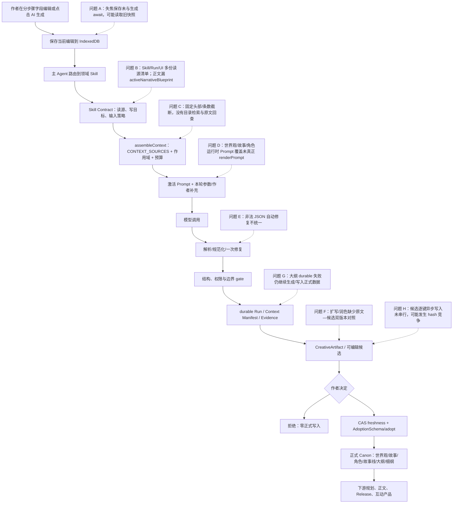
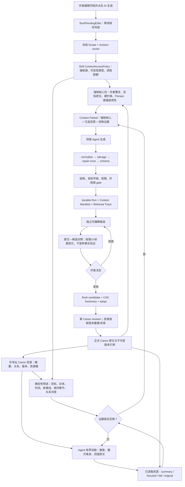
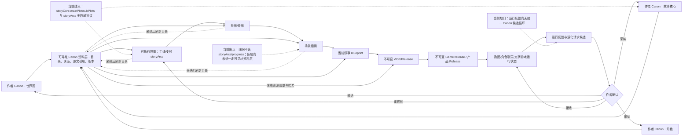

# StoryForge 分步骤世界引擎 Harness 完整审查

> 审查日期：2026-08-21
> 审查基线：`2c9ad71`（审查期间用户正在并行开发游戏生产/运行时能力，报告不把这些未提交改动当作本次审查实现）
> 治理方案修订：2026-08-21（确认采用“强制核心上下文 + 可寻址 Canon 目录 + 有界按需读取 + 原文回查”；扩写/润色事实验证器降为远期可选项）
> 范围：世界观、故事核心、角色、故事线（主线/支线）、卷纲、章纲、场景细纲，以及它们通向正文和世界引擎上层产品的依赖关系
> 非范围：商业化、收费、营销；游戏生产管线只检查世界引擎交接边界，不做完整产品审查

## 1. 结论先行

分步骤流程不是“完全跑不通”。当前项目已经具备一套相当扎实的机械 Harness：正式 AI 入口有 Skill、上下文注册表、候选、刷新恢复、作者采纳、作用域和大量回归测试。隔离 E2E 在稳定环境下覆盖的 53 条路径全部通过，世界观、故事、角色、故事线、大纲候选都能走到“确认后才写正式数据”。

但它也还不能称为“语义可靠的长篇创作 Harness”，更不能从理论上保证百万字创作。核心问题不是缺少更多 Agent，而是已有 Harness 的契约没有完全收口：

1. 同一调用仍可能存在 Skill、durable Run、UI 三份上下文来源清单；正文路径已经发生真实漂移，Skill 要求的 `activeNarrativeBlueprint` 没有进入实际分步骤正文生成。
2. 真实空项目调用没有自由创建种族，而是输出“尚未预设、待以后确立”的说明性占位文本，并明显围绕项目名“远潮”展开；当前空态 Prompt 没有落实“标题弱权重、必须创造具体新信息、禁止输出待办说明”。
3. 扩写/润色页面能同时看到上方正式原文与下方候选，但不是明确的双版本对照组件，候选框还直接暴露 JSON 外壳。近期不要求事实级验证器；“保留事实”继续作为提示词目标，由作者通过对照后决定是否采纳。
4. 上下文按固定前缀和固定条数截断；晚出现的角色、故事线、章节和世界观字段可能在总窗口仍有空间时就永久不可见。治理重点应从“继续调大 Prompt”转为“目录导航、任务检索和原文回查”。
5. 大纲路径允许 durable 追踪、候选持久化、采纳账本失败后继续写正式大纲，属于 Harness fail-open。
6. 世界观/故事字段失焦保存与点击生成之间缺少保存屏障，可能先用旧 IndexedDB 快照发起生成；本次单样本即时点击恰好读到了最新值，只能证明常见时序可成功，不能消除代码中的竞态窗口。
7. 故事核心的 `mainPlot/subPlots` 与正式 `storyArcs` 同时表达主支线，却没有明确的权威关系和同步/冲突协议。
8. 故事线进度依赖作者手动点击“映射本章”，场景细纲又没有读取故事线及进度，持续演化链尚未闭合。

因此，当前成熟度应拆开判断：

| 层面 | 当前判断 | 说明 |
|---|---|---|
| UI 功能可达 | 可用 | 现有各领域入口真实存在，主线/支线已有功能 |
| 事务与候选机制 | 大部分可用 | 世界观、故事、角色、故事线、细纲有 durable 候选与 CAS/刷新恢复；大纲仍 fail-open |
| 创作变换可审阅性 | 部分可用 | 候选隔离存在；缺少原文—候选双栏对照，事实级自动验证暂不作为当前门槛 |
| 跨领域一致性 | 部分可用 | 多数上游已登记，但权威关系、细纲依赖、进度闭环不完整 |
| 长篇/百万字一致性 | 不达标 | 固定前缀、固定条数、固定字符预算无法给出召回保证 |
| 面向上层产品持续演化 | 有基座、未闭环 | 冻结 Release 方向正确，但运行反馈回到 Canon 候选的循环尚未统一 |

## 2. 现有分步骤流程全图



这张图里需要保留的是“一个领域工作流 + 少量确定性检查”，不是继续堆叠许多自治 Agent。种族字段生成本身是确定任务，适合预定义 workflow；真正需要 Agent 自主规划的是以后“把已确认世界变成完整游戏/跑团/互动体验”这类开放目标。

## 3. 各领域现有闭包

| 领域 | UI/Agent/Skill | 主要读取 | 候选与采纳 | 下游 | 结论 |
|---|---|---|---|---|---|
| 世界观单字段 | `WorldviewAgentControls` → `world-origin.worldview-field` | 项目概况、Canon、世界观、故事核心、角色、故事线、大纲等 | durable 主 Agent 候选；可编辑、拒绝、采纳；整字段替换 | 角色、故事线、大纲、正文 | 机械闭包完整；缺双版本对照、可寻址检索和标题低权重协议 |
| 故事核心 | `StoryCorePanel` → `world-origin.story-core` | 世界观、角色、故事线、大纲等 | 与世界观相同 | 角色、故事线、大纲 | 机械闭包完整；与 `storyArcs` 权威重叠 |
| 角色首次创建 | 角色生成 → `character.create` | 世界观、故事核心、现有角色、规则、历史 | durable 候选，确认后写角色 | 角色驱动、故事线、大纲、正文 | 可用；标题作为显式种子，缺少低权重协议 |
| 已有角色补全 | `character.supplement` | 目标角色完整设定；可选剧情证据 | 只写作者选定字段 | 同上 | 边界较好；缺少原文—候选对照，事实级验证不是近期门槛 |
| 主线/支线 | `StoryArcPanel` → `outline.story-arcs` | 世界观、故事核心、角色、既有故事线 | CreativeArtifact 候选，确认后写 `storyArcs` | 大纲、正文、进度映射 | 功能存在；只能 AI 新增一条，不能对已有线执行 AI 扩写/重写/润色 |
| 故事线动态进度 | `StorylineProgressPanel` → `outline.storyline-progress` | 故事线、已写章节、已有进度 | 证据引用、闭集候选；可新增疑似故事线 | 后续大纲/正文 | 有效但手动；当前选择章节查询绕开统一作用域读取器 |
| 卷纲/章纲 | `OutlinePanel` → 大纲生成节点 | 世界观、故事、角色、故事线、已写进度、蓝图等 | 有候选恢复接口 | 细纲、正文 | Prompt 读取较全，但 durable 失败时 fail-open |
| 场景细纲 | 细纲控制器 → detail Skill | 当前章纲、世界观、故事核心、蓝图、角色等 | durable 候选、CAS 采纳 | 正文 | 没有读取 `storyArcs/storylineProgress/writtenChapterProgress`；场景生成是追加，重复执行易重复 |
| 正文 | `ChapterEditor` → prose Skill | 章纲、细纲、连续性、世界、角色、故事线、事实、召回等 | durable 候选、作者确认 | 已写正文、派生记忆、运行产品 | 实际读源清单与 Skill 漂移，漏当前叙事蓝图 |

### 主线/支线到底有没有

有，而且不只是两个文本框：

- `storyArcs.type` 区分 `main` 与 `sub`，界面能手工或 AI 新建主线/支线。
- 每条故事线有阶段；已写章节可映射到阶段、交汇和疑似新线。
- 正文 Skill 已登记故事线和进度。

但当前存在两套概念：`storyCores.mainPlot/subPlots` 是故事意图摘要，`storyArcs` 是可执行故事线。项目没有把这层关系写成契约，因此两者可能互相冲突。建议明确：

```text
storyCore.mainPlot/subPlots = 作者意图和主题级摘要（上游）
storyArcs                 = 可执行的阶段计划（下游投影）
```

当两者冲突时，不得静默覆盖；应生成“故事线重规划候选”，由作者确认后再更新 `storyArcs`。

## 4. “种族与民族”垂直切片场景矩阵

| 场景 | 当前结果 | 证据/原因 | 目标状态 |
|---|---|---|---|
| 空项目首次创建，项目名被记住 | 不通过创作质量门 | 真实调用只纳入 `projectStatus`，输出“尚未预设、待以后确立”，并围绕“远潮”现象解释 | 项目名标注为弱灵感；明确禁止待办、占位和概念解释，必须给出可采纳的具体设定 |
| 世界观其它字段为空，生成种族 | 机械通过、语义失败 | 候选可持久化、采纳和刷新恢复；但生成结果没有真正创造种族 | 增加空态最小内容合同、标题弱权重和“必须创造新信息”质量 rubric |
| 世界观已有其它字段，结合生成 | 部分通过 | `partial` 策略锁定已填字段；同时读取故事、角色、故事线和大纲 | 增加“尊重约束但不能只是复述”的 novelty grader |
| 作者补充说明参与生成 | 通过 | 补充说明进入 author request | 保持；去掉无意义的 360/1000 字符硬截断或向用户明确提示 |
| 生成后采纳、再修改 | 通过 | 候选与正式写入分离；字段仍可手工编辑 | 增加保存完成态和修改版本号 |
| 已有种族执行扩写 | 单样本通过、仍需人工审阅 | 四条刚保存事实全部出现在候选中，补充说明生效并新增社会结构、合作张力和文化细节；这不是统计保证 | 原文不被覆盖；候选独立可编辑；作者通过双版本对照决定是否采纳，不以事实验证器阻断 |
| 扩写显示原文与新版对比 | 不通过目标体验 | 页面上方仍显示正式原文、下方显示候选，但没有双栏/变化标记，候选编辑框直接显示 JSON 外壳 | 左右双栏、同步滚动、按段落/小标题标记新增/删除/改写；候选编辑默认只显示 `value`，不得把字符或段落差异宣传为事实验证 |
| 重写 | 部分通过 | 允许整字段重写，仍服从其它正式上下文 | 直接提供新版候选；原正式版本保持可查看和可恢复，不强制显示详细 diff |
| 润色 | 部分通过 | Prompt 限制不新增重大设定，但没有双版本对照 | 与扩写共用双栏对照；不做事实级自动阻断，最终判断交给作者 |
| 世界观、故事、角色互相反推 | 部分通过 | Skill 已同时读取三者，并声明上游 Canon 优先、下游只作反推证据 | 把来源权威、置信度和冲突处置写进结构化 Provenance，不只放提示词 |
| 生成后刷新、编辑、拒绝、采纳 | 通过 | 相关 E2E 与 durable 候选回归通过 | 增加候选编辑串行化/防抖，消除 hash 竞争风险 |
| 生成后手改字段，旧候选 stale 阻断 | 真实通过 | 候选生成后给正式字段增加“黑色潮钟”，采纳立即被阻断并提示重新生成，正式字段保留作者新改动 | 保持 CAS；先修复失焦保存屏障，无需以“更新按钮”承担正确性 |
| 模型返回错误字段 | 通过一次 gate 打回 | 目标字段 mismatch 会阻断并触发一次 Canon retry | 保持 |
| 非法 JSON | 不通过自动修复要求 | JSON 在 node `run` 中先解析，异常不会进入 gate retry | 统一 normalize → repair-once → parse；救援结果只能成为可编辑草稿 |
| 超长输出 | 部分通过 | `races` 字段上限 30,000 字符；默认本轮约 6,000 output tokens | 用户指定长度需要进入明确约束、预算预检和分段生成协议 |
| 上下文超预算 | 不通过长篇要求 | 世界观 8k tokens 后按头部截断，种族字段位于中后部 | 强制核心包 + 可寻址 Canon 目录 + 任务检索 + 有界按需读取 + 原文回查；头部截断只保留为最终安全兜底 |
| 多世界切换与隔离 | 基本通过 | 世界观/角色按 World scope；通道表有生命周期 | 常用生成 Skill 未普遍读取 `worldGroups`；通道方向与世界进出条件未完整注入 |
| 采纳种族后不错误修改 Codex | 通过 | 世界观采纳只写 `worldviews.races` | 保持；Codex 拆分与 AI 补全必须保持第二次作者确认 |
| 从种族正文拆 Codex 词条 | 部分通过 | `codex-extract` 只读取选中文本和既有分类基线 | 短文本补全应是单独 enrichment 候选，不能在“拆分”时偷偷创造正式事实 |
| 后续角色/大纲读取新种族 | 部分通过 | 下游声明读取世界观 | 为 `worldviews.races` 建立稳定资源键和目录项；下游按任务/实体关系召回并记录读取证据，不依赖字段排列位置 |
| 晚出现角色/故事线仍可发现 | 不通过、当前无法做目标测试 | 新 Context Gateway 尚不存在；当前角色、故事线读取仍受固定顺序或固定条数影响 | 将目标放在最后一条仍应被目录搜索命中、读取原文并进入 Context Evidence；跨作用域结果必须为 0 |

### 关于“更新按钮”

用户担心手工修改后 AI 仍读旧内容是合理的，但把正确性依赖于“用户记得点击更新”会制造新的失误入口。当前真实风险在于：`InlineTextarea` 只在 blur 时提交，而字段保存是异步 fire-and-forget；同一次鼠标点击会先触发 blur 保存，再触发 AI 生成，但生成没有等待保存 Promise。

正确方案应是：

1. 所有受 Harness 读取的表维护 `revision`/`updatedAt`。
2. 点击生成先 `flushPendingEdits()`，等待当前表的保存 Promise 完成。
3. Run 记录读取到的 revision vector；候选采纳再做 CAS。
4. 如果有摘要、向量、事实索引等派生数据，可提供“重建派生资料”按钮，但原始 Canon 永远以最新保存值为准。

## 5. 关键问题与证据

### P0-1：正文 Skill、durable Run、UI 三份上下文契约已经漂移

- Skill 的 `PROSE_CONTEXT_SOURCE_KEYS` 包含 `activeNarrativeBlueprint`：`src/lib/agent/skill-registry.ts:448-480`。
- durable Run 自己维护 `PROSE_GENERATION_SOURCE_KEYS_V1`，没有该来源：`src/lib/agent/run/prose-generation-durable.ts:53-85`。
- `ChapterEditor` 又维护第三份实际 `sourceKeys`，同样漏掉该来源：`src/components/editor/ChapterEditor.tsx:1142-1176`。
- durable manifest 声明的是第二份清单：`src/components/editor/ChapterEditor.tsx:1295`。

这说明“重构成 Harness”完成了注册、日志和候选层，却没有彻底删除旧 UI 的装配所有权。现有架构守卫只验证 key 已注册、引用可达，不验证“实际调用来源集合 == Skill contract”。这不是正常 Harness 流程，而是未完成迁移的混合状态。

横向复核还发现大纲存在同类但方向相反的漂移：Skill 的 `OUTLINE_CONTEXT_SOURCE_KEYS` 到 `writtenChapterProgress` 为止（`src/lib/agent/skill-registry.ts:131-150`），实际 `OUTLINE_GENERATION_SOURCE_KEYS` 又增加了 `priorOutlineCandidate`，并被 UI、Run 权限和 Manifest 共同采用（`src/lib/outline/harness.ts:32-52,93-94,138`；`src/components/outline/OutlinePanel.tsx:201-214`）。这个来源在批量续接候选时有合理用途，但它没有作为 Skill 的可选/运行时来源登记，说明正式来源权仍不在 Skill。

修复标准：运行时只能从 `Skill.contextSourceKeys + optionalContextSourceKeys + 本次已激活的显式运行时来源` 派生 context manifest 和实际 `assembleContext`；UI 不得再声明来源数组。架构测试对每个正式入口做集合相等断言，并分别验证“漏读”和“越权扩读”两个反例，旧清单删除。

### P0-2：大纲 Harness 是 fail-open

`useOutlineGenerationController` 在以下情况都只 `console.warn` 并继续旧路径：

- durable trace 初始化失败：`src/components/outline/useOutlineGenerationController.ts:168-179`。
- 候选持久化失败：`src/components/outline/useOutlineGenerationController.ts:192-198`。
- 采纳开始/完成账本失败：`src/components/outline/useOutlineGenerationController.ts:352-376`。

甚至已有回归测试把“追踪失败仍调用模型”当作预期。对正式生产 Harness，这会产生没有可靠候选证据却能写入大纲的旁路。

修复标准：正式模式 fail-closed；只有显式 `evaluation/simulation/experimental` 边界可使用内存影子，且不得 adopt 到正式表。

### P0-3：固定前缀截断与固定条数选择无法支撑百万字保证

- 单来源超预算时只保留 `content.slice(0, low)`：`src/lib/registry/assemble-context.ts:319-335`。
- 世界观固定顺序中，`races` 排在自然资源之后：`src/lib/ai/context-builder.ts:85-107`；世界观源预算 8,000 tokens：`src/lib/registry/context-sources.ts:1565-1572`。
- 角色先输出所有核心角色、再次要角色、最后 NPC：`src/lib/ai/context-builder.ts:197-242`；角色源预算也是 8,000 tokens。
- 故事线在预算前就只取前 8 条、每条前 6 阶段：`src/lib/registry/context-sources.ts:614-626`。
- 长篇分析只取按时间排序的前 24,000 字符，每章最多 3,000：`src/lib/registry/context-sources.ts:742-768`。
- 本卷已写正文进度只取前 40 章：`src/lib/registry/context-sources.ts:832-869`。

即使模型有 512K 窗口，这些源级硬上限仍会先把后期信息丢掉。当前架构可以服务短篇和中等规模长篇，但不能证明百万字时“关键事实可召回”。

修复标准不是把所有原文塞进上下文，也不是单纯上调 token 数，而是引入第 6 节定义的可寻址 Canon 资料层：

1. 原始 Canon 和不可变版本引用永久保留，摘要、索引和压缩产物都不是第二份权威数据。
2. 每次任务先注入强制核心包，再向 Agent 暴露有界、分层、可搜索的资料目录。
3. 系统按目标字段、实体、时间、故事线、相邻章节和作者 Pinned 自动召回；Agent 只在必要时继续展开条目或回查原文。
4. 固定预算继续存在，但固定头部/固定前 N 条只能作为最后的故障兜底，不能充当正常选择算法。
5. 每次 Run 记录目录版本、自动召回理由、Agent 读取动作、原文锚点及未读取/压缩/截断状态；召回率进入 eval。

### P1-1：手工保存与生成之间有竞态

- `InlineTextarea` 只在 blur 提交：`src/components/shared/InlineEdit.tsx:107-125`。
- 人文世界观保存未 await：`src/components/worldview/WorldviewHumanityPanel.tsx:90-91,241-244`。
- 故事核心同样未 await：`src/components/worldview/StoryCorePanel.tsx:80-83,154-157`。

因此用户刚改完字段立即点击 AI 时，Harness 可能先从 IndexedDB 读到旧值。候选最终 CAS 多数会阻止旧候选覆盖新值，但用户仍会浪费一次调用并看到基于旧事实的结果。

### P1-2：非法 JSON/字段修复策略不统一

统一团队执行器明确只对确定性 gate 重试一次，网络、解析和普通模型错误不重试：`src/lib/agent/team-execution.ts:67-94`。世界观严格 `JSON.parse`，解析发生在 gate 之前：`src/lib/agent/worldview-field-copilot.ts:296-324,603-620`。

当前域间差异很大：故事线和大纲有 normalize/repair，场景细纲 `repair: null`（`src/lib/agent/detailed-outline-copilot.ts:268`），世界观/故事/角色的非法 JSON 直接失败。

建议统一成：原始输出留证 → deterministic salvage → schema parse → 至多一次明确 repair call → 再 parse；仍失败则保留为“不可采纳的编辑草稿”。

### P1-3：激活 Prompt UI 在三个领域没有真正接到 Prompt 引擎

`PromptRunPanel` 的公开契约说运行时参数和覆盖要传给 `renderPrompt`：`src/components/shared/PromptRunPanel.tsx:28-34`。但世界观、故事核心把这些内容压缩成 author request 文本，实际 system/user messages 仍是代码内硬编码：

- 世界观：`src/lib/agent/worldview-field-copilot.ts:403-426,637-658`。
- 故事核心：同结构，见 `src/lib/agent/story-core-copilot.ts`。
- 角色：激活模板本身会被读取，但本轮覆盖仍只序列化进作者文本。

卷纲/章纲是正确参照：`src/lib/ai/adapters/outline-adapter.ts:48-61,114-123` 真实调用 `renderPrompt(..., options)`。

### P1-4：场景细纲断开故事线持续演化

detail Skill 有 `activeNarrativeBlueprint`，但没有 `storyArcs`、`storylineProgress`、`writtenChapterProgress`。这使“主支线 → 章纲 → 场景”的最后一步不能稳定看见故事线阶段和实际进度。并且 `operation=scenes` 采纳直接把新场景追加到现有数组：`src/lib/agent/detailed-outline-copilot.ts:292-305`，重复执行易产生重复场景。

### P1-5：故事线进度仍是手动、且有作用域旁路

作者必须选择已写章节并点击“映射本章”：`src/components/outline/StorylineProgressPanel.tsx:84-99,136-153`。这适合作为作者确认入口，但缺少“正文采纳后自动生成待确认进度候选”。同时面板直接按 `projectId` 查询 `db.chapters/db.outlineNodes`：`src/components/outline/StorylineProgressPanel.tsx:45-60`，未使用 `readOwnedRows`，多作品/多世界下存在可见范围混入风险。

### P1-6：候选编辑可能发生 hash 竞争

候选文本框每个 `onChange` 都 fire-and-forget 调用异步更新：`src/components/agent/ChatCopilotPanel.tsx:220-226`。durable 更新事务要求步骤仍持有旧 `candidateHash`：`src/lib/agent/conversations.ts:169-190`。快速连续按键可能让多个更新拿到同一个旧 hash，后到事务被判 stale。现有测试只覆盖串行编辑。

修复标准：本地即时 draft + 300–500ms debounce + 每候选单队列串行持久化；采纳前 flush。

### P1-7：扩写/润色缺少原文—候选双版本对照

世界观模式指令已经要求扩写保留旧内容、润色不新增重大设定：`src/lib/agent/worldview-field-copilot.ts:161-170`；`candidateIssues()` 目前只检查字段、结构和“是否完全未变化”：`src/lib/agent/worldview-field-copilot.ts:371-394`。这不是当前阶段的采纳阻断缺陷，而是作者审阅体验缺口。

近期修复标准：

- `expand`、`polish` 显示正式原文与 AI 候选双栏，支持同步滚动和按段落/小标题标记新增、删除、改写。
- `rewrite` 可以直接显示新版候选，但正式原文在采纳前始终保留并可恢复。
- 对比结果只辅助阅读，不宣称“事实已验证”；作者可继续编辑、拒绝或采纳。
- 候选仍必须保持独立、可恢复并受 revision/CAS 保护，不能因为取消事实验证器而允许直接覆盖 Canon。

事实级保留/冲突验证器进入远期可选能力：只有真实用户反馈或 eval 证明人工对照不足时才升级，不进入当前世界引擎可用性的必要门槛。

### P2：可观察性和衍生能力缺口

- UI 显示上下文源“已包含”，但没有醒目标记某个已包含来源其实被截断/压缩，容易产生错误信任。
- 项目名进入 `projectStatus`，但没有 provenance 权重；世界观/角色生成可能围绕标题过度联想。
- `worldGroupLinks` 已支持 portal/ascension 等关系和方向，但普通上下文只输出名称、类型，未完整输出双向性、描述及世界的进入/离开/力量/带出规则。
- Codex 拆分只读取作者选中文本和同类基线；短正文不会自动获得高质量补全。应增加独立 enrichment 候选，而不是把创造混入 extraction。

## 6. 调整后的全流程治理方案

### 6.1 已确认的产品与工程决策

1. **扩写/润色先解决“看得见变化”，不先解决“机器替作者判断事实”。** 近期交付双版本对照、候选隔离、编辑/拒绝/采纳和 stale 阻断；事实级验证器只有在真实反馈或 eval 证明必要时再建设。
2. **必须有硬预算，但不接受固定前缀和固定前 N 条作为正常召回策略。** `slice(0, N)` 只能是故障兜底；正常路径必须先依据任务、实体、时间、故事线、作者 Pinned 和关系图选择资料。
3. **Skill 表达能力和权限，项目内容不是 Skill。** 世界观字段、角色、故事线、章节等进入“可寻址 Canon 资料层”；Skill 只声明强制来源、可发现资源类型、读取工具、预算和写入目标。
4. **原文是权威，摘要是导航。** 目录、摘要、压缩内容、结构化提取都必须能回溯到来源记录、字段、revision/hash 和原文锚点；不得形成第二份会与 Canon 漂移的权威文本。
5. **作者一次点击仍是一次产品动作。** 内部可以经历确定性预选、有限工具读取和生成，但正常情况下不要求作者逐层选择资料，也不新增大量 Agent。

### 6.2 当前容量与真正瓶颈

治理方案修订时，当前代码为 Agnes 2.5 Flash 登记 524,288 token 总窗口、65,536 token 最大输出和 5% 安全边际，理论输入约 432,538 token：`src/lib/ai/context-budget.ts:86,216-218`。但领域策略会继续收窄实际输入：

| 领域 | Lean | Balanced | Full |
|---|---:|---:|---:|
| 世界观/故事核心 | 9K | 14K | 19.4K |
| 角色 | 13K | 20K | 28.5K |
| 大纲 | 18K | 32K | 48K |
| 正文 | 24K | 42K | 64K |

世界观单字段默认使用 Balanced，因此实际领域上限约 14K，且单来源预算再乘 0.72：世界观和角色各约 5.76K、故事核心约 2.88K、Codex 约 4.32K、故事线约 1.08K：`src/lib/agent/context-policy.ts:124-160`；`src/lib/agent/worldview-field-copilot.ts:527-549`。

结论：小项目的主要矛盾不是窗口大小；丰富项目的主要矛盾也不是“再加几十 K”，而是**资源选择发生在预算之前，且当前选择不具备任务相关性和后置内容可发现性**。以后所有容量调整必须由召回率、约束违反率、成本和延迟数据驱动。

### 6.3 可寻址 Canon 资料层

第一版不把每条资料复制到新权威表，而是从既有 `PROJECT_TABLES` 中的 Canon 记录派生统一目录。一个目录项至少包含：

```text
ContextResourceDescriptorV1
  resourceKey          稳定资源键，例如 worldview:races、character:42
  kind                 worldview-field | character | story-arc | outline-node | chapter | fact | codex ...
  title / shortSummary 只用于发现和导航
  authority            author-canon | adopted-canon | evidence-extract | derived-summary | candidate
  scope                projectId / worldId / workId / chapterId
  relations            角色、地点、故事线、时间范围、前后继、世界通道
  sourceRefs            table / recordId / field / revision / contentHash / anchor
  tokenEstimate         各读取深度的预估成本
  availableDepths       index | summary | focused | full | original
```

权威规则：

- 作者填写或作者采纳的数据才是 Canon。
- 带逐字证据的抽取可以作为检索线索，但未采纳前不能冒充 Canon。
- AI 摘要和压缩产物只用于导航或预算适配；冲突时无条件回到 Canon 原文。
- 待确认候选默认不进入普通下游检索，只有当前 Run 显式声明的 supplemental candidate 才能读取。
- 目录可以即时派生；若以后为了性能持久化索引，新表必须进入 `PROJECT_TABLES` 全生命周期，并保持可重建、非权威。

建议由统一 Tool Registry 提供四类只读入口：

```text
list_context_catalog(filters, cursor)
search_context(query, scope, kinds, timeRange, entityKeys)
read_context_resource(resourceKey, depth, sectionOrRange)
read_original_evidence(sourceRef)
```

它们必须执行世界/作品/章节作用域校验，并把读取结果、revision/hash、token、原文锚点写入 Run Evidence。组件不得直接查询目录表或手写另一路检索。

### 6.4 一次生成的目标运行流程



`ContextAccessPolicyV1` 应成为 Skill Contract 的正式组成部分，而不是在 UI 或 durable Run 中再维护动态来源清单：

```text
mandatorySourceKeys       本任务无条件读取的登记源
discoverableResourceKinds Agent 可搜索/展开的资源类型
optionalRuntimeSources    只有明确运行边界才启用的来源
selectionPolicyVersion    确定性预选策略版本
maxReadCalls              Agent 最多追加几次读取
maxRetrievedTokens        动态读取总预算
allowOriginalRead         是否允许回查完整原文
```

实际 Context Manifest 必须完全由 Skill、显式运行参数和真实工具读取轨迹派生；UI 不得声明来源数组。这既修复当前“Skill/Run/UI 三份清单”漂移，也让动态读取仍处于 Harness 权限边界内。

### 6.5 防止 Agent 不知道自己遗漏了什么

不能把召回完全交给模型。目录式渐进披露必须同时具备以下确定性保护：

1. **Mandatory Core**：目标原文、作者本轮要求、Canon 禁止项、作者 Pinned、当前故事线阶段和直接前后继永远由系统注入。
2. **关系扩展**：命中一个角色、地点、道具或故事线后，自动展开一跳高风险关系；跨世界通道同时带入进入/离开/力量/带出条件。
3. **时间策略**：同时保留当前邻域、最近变化和与目标相关的早期锚点，不能只取最早或最近内容。
4. **分类覆盖**：检索预算为世界观、角色、故事线、章节事实保留最低配额，防止单一大来源吃掉全部预算。
5. **冲突监视**：已确认的禁止项、矛盾事实、未回收伏笔和同名实体进入高优先队列。
6. **作者置顶**：允许作者将伏笔、秘密、规则或小细节标为 Pinned/Must-read；这不是让作者每次手工选上下文，而是长期意图标记。
7. **可见证据**：Run 需要显示“系统强制读取、系统自动召回、Agent 主动读取、未命中、压缩、截断”六类状态，便于定位偏差来自生成还是检索。

目录自身也必须渐进披露：项目级分类目录 → 分类分页 → 条目摘要 → focused 片段 → full/original。否则百万字项目最终只会把“原文过长”替换成“目录过长”。

### 6.6 快路径、复杂路径和成本边界

- **空项目/短项目**：强制核心包和自动预选足够时，直接一次生成；项目名只作为低权重灵感，不能成为唯一主题或概念解释对象。
- **中等项目**：确定性预选后直接生成，通常不需要额外模型规划调用。
- **复杂长篇**：允许现有领域 Agent 在固定 `maxReadCalls` 内搜索、展开和回查；不为每种资料新建 Agent。
- **提供商兼容**：即使模型不支持原生 tool calling，也可由 Harness 执行“确定性预选 → 有界检索计划 → 生成”的工作流，不能让提供商能力决定数据治理是否成立。
- **压缩器定位**：现有带原文锚点的压缩可继续作为单资源适配器，但它只能压缩“已经选中的资源”，不能替代目录发现，也不能找回在 reader 内部提前 `.slice(0, N)` 删除的内容。

### 6.7 全流程共同验收规则

从世界观到正文的每个正式 Skill 均需复用以下门槛：

1. 同一资源无论位于第一条还是最后一条，按明确任务线索都能被检索命中；不得以数据库顺序决定可见性。
2. Pinned 和 mandatory 资源交付率 100%；跨 world/work/scope 泄漏为 0。
3. 每次候选可还原“读了哪个版本、为何读取、拿到摘要还是原文、哪些内容未纳入”。
4. 来源修改后，目录版本和旧候选必须 stale；派生索引不得继续提供旧内容。
5. 原文、目录、检索结果、Prompt 和最终候选都受同一 Run ID 串联；追踪或候选持久化失败时正式路径 fail-closed。
6. 对比 UI 不修改 Canon；只有作者确认后的 `adopt()` 才写正式字段。
7. 所有新持久化索引或资源表完成导入、导出、删除、迁移、世界作用域和引用重映射反例测试。

### 6.8 第二轮：新方案的实现可达性审查

当前源码中还没有 `ContextResourceDescriptorV1`、`ContextAccessPolicyV1`、`RetrievalTraceV1`、`list_context_catalog`、`read_context_resource` 或 `read_original_evidence`。因此，新方案目前是已经明确的治理设计，不是已经接入分步骤模式的现成功能。

但项目有足够多可复用底座，不需要推倒重来：

| 现有能力 | 可复用程度 | 已具备什么 | 必须补什么 |
|---|---|---|---|
| 三注册表 | 直接保留 | `CONTEXT_SOURCES/assembleContext()` 管读，`FIELD_REGISTRY/AdoptionSchema/adopt()` 管写，`PROJECT_TABLES` 管生命周期 | Skill 运行时只能从注册表和显式策略派生，不再让 UI/Run 手写平行清单 |
| `rag-library` | 作为资源描述器原型改造 | 字段级 `documentId::fieldKey`、实时投影、作者启停/权重/token 上限、选择证据 | 扩大 Canon 覆盖；增加 scope、revision/hash、authority、provenance、关系、时间和原文锚点；禁止目录读取隐藏写表 |
| Tool Registry | 直接扩展 | 集中参数校验、World/Work/Chapter 作用域校验、预算、来源证据和只读执行边界 | 增加目录、搜索、资源读取、原文回查四类工具和资源级权限校验 |
| 通用只读 Agent Runner | 直接复用协议与限制 | 模型可自主选择工具；有步数、调用数、token、循环检测、协议重试和完整 trace | 正式分步骤 Skill 尚未接入；需要按 `ContextAccessPolicyV1` 只暴露获授权工具和资源类型 |
| `search_text` | 只作早期 fallback | 当前世界作用域内的简单包含匹配和短摘 | 目前只有 chapter/character/outline/codex/location 五类、最多 10 条、180 字摘录；需要字段级资源键、分类分页、关系/时间过滤和原文展开 |
| Context Manifest | 扩展而非替换 | source key、hash、token、full/compressed/truncated 和压缩证据 | 增加 resource key、读取深度、选择理由、查询、revision、authority、原文锚点以及系统/Agent 读取来源 |
| Consistency Dossier | 作为高权威资源提供者 | 章节边界下的确定性事实、角色认知、状态、物品、时间线和关键词正文证据 | 目前是正文一致性专用，不是全项目目录；应通过 Gateway 暴露条目，而不是膨胀成第二个总入口 |

现有 RAG 实现还有一个必须先修的边界问题：`buildRagLibrary()` 名义上是目录读取，却会在发现缺失 `ragDocumentId` 时直接更新源业务表（`src/lib/retrieval/rag-library.ts:388-407`）。这会让“只读上下文/只读工具”暗含持久化副作用。稳定 ID 应在创建、导入或显式迁移阶段补齐；目录构建本身必须是纯读取、可重复、失败无写入。

“把用户内容做成类似 Skill 的东西”需要准确表述：

- 用户填写的世界观、故事、角色、大纲和正文仍然保存在原有 Canon 表中，三注册表架构继续有效。
- Skill 保存的是任务指令、权限、强制来源、可发现资源类型和预算，不保存或复制用户正文。
- 所谓“像 Skill 一样渐进披露”，是给 Canon 内容建立可寻址目录和读取接口；Agent 先看目录，必要时按资源键读取摘要、局部、全文或原文版本。
- 因此用户内容不是被转换成一批 Skill 文件，而是作为 Skill 获权后可读取的资源。摘要、索引和目录可以重建，原 Canon 始终是唯一权威。

### 6.9 各分步骤领域接入 Context Gateway 的现状

| 领域 | 当前读取模式 | 是否 Agent 按需发现 | 新方案主要缺口 |
|---|---|---|---|
| 世界观单字段 | `skill.contextSourceKeys` 一次性 `assembleContext()` | 否 | Mandatory Core、目录发现、标题弱权重、资源级证据、原文回查 |
| 故事核心 | `skill.contextSourceKeys` 一次性组装 | 否 | 与世界观相同；另需和 `storyArcs` 建立意图层→执行层权威协议 |
| 角色创建 | 程序并行执行 Skill 登记的五个工具并把结果全部拼入 Prompt | 否 | 工具注册已用上，但模型没有先看目录再决定读取；需改成确定性预选 + 有界追加读取 |
| 主线/支线 | 固定故事线来源数组一次性组装 | 否 | 资源化 story arc/stage/progress，按目标角色、章节和交汇关系召回 |
| 卷纲/章纲 | 固定来源数组；运行时另加 `priorOutlineCandidate` | 否 | 先修 Skill/运行时来源漂移，再接目录与故事线/时间邻域预选 |
| 场景细纲 | 固定 `OUTLINE_DETAIL_CONTEXT_SOURCE_KEYS` | 否 | 当前连 `storyArcs`、`storylineProgress`、`writtenChapterProgress` 都未纳入，必须先补 Mandatory Core 再接长尾检索 |
| 正文 | UI 手写固定来源并一次性组装 | 否 | 先消除漏读 Blueprint 的三清单漂移，再把一致性档案、召回片段和长尾 Canon 统一纳入 Gateway |

项目确实有一个能让模型自主多轮调用只读工具的通用 Runner（`src/lib/agent/runner.ts:228-415`），但当前正式源码没有分步骤调用方。角色创建也不是自主工具调用：它在模型运行前对所有登记工具执行 `Promise.all`（`src/lib/agent/character-copilot.ts:370-388`）。所以新方案不应再造第二个 Agent 框架，而应把现有 Runner 收口为复杂任务的可选检索执行器；空项目和短项目继续走确定性快路径，避免为了“Agent 化”增加无意义调用。

### 6.10 可实施任务单元与验收边界

| 顺序 | 任务单元 | 主要改动边界 | 完成证据 |
|---|---|---|---|
| G0 | Phase 0 收口 | Skill 唯一来源、outline fail-closed、保存屏障、候选写串行、统一 repair | 注入 trace/candidate/adoption 故障均零正式写入；每个正式入口实际读源集合与 Skill 相等 |
| G1 | 纯读取资源目录内核 | 从现有 `rag-library` 提取纯函数描述器；稳定 ID 改由创建/迁移保证 | 重复列目录不改任何表；同一字段导入导出后资源键稳定；跨 scope 为 0 |
| G2 | 扩全 Canon 描述器 | 补 story arcs/stages/progress、outline/detail、facts、foreshadows、rules、world links、blueprint、chapters 等 | 每类 Canon 均有资源键、scope、revision/hash、authority、summary/full/original 能力声明 |
| G3 | 四个通用只读工具 | 扩展 Tool Registry，实现 catalog/search/read/original | 参数越权、跨世界、跨作品、超预算、失效资源键全部 fail-closed；工具本身无写入 |
| G4 | Context Gateway | Mandatory Core、确定性预选、分类配额、关系/时间扩展、可选 Agent 追加读取 | 同一资源位于第一条或最后一条都能按任务线索命中；Pinned/Mandatory 交付率 100% |
| G5 | Retrieval Trace | 扩展 Run/Manifest，串联目录版本、查询、资源、深度、原文锚点和未命中原因 | 任一候选都能回答“为什么读、读了哪版、读到什么深度、什么没读” |
| R1 | races 空态质量合同 | 空态 Prompt 明确具体产物、标题弱权重、禁止待办/占位/概念解释 | 空项目 eval 中占位说明率和题名复述率低于预设门槛；候选必须可直接采纳 |
| R2 | races 双版本审阅 | UI 解析 JSON 后只编辑 `value`；原文/候选双栏、段落变化、同步滚动 | 扩写/润色刷新后仍能还原两版；对照组件不写 Canon；采纳仍经 CAS/adopt |
| R3 | races 金标准回归 | 空态、部分上下文、补充说明、即时保存、刷新、编辑、拒绝、采纳、stale、超长、坏 JSON、晚位召回 | 机械断言 + 多 trial 语义 eval；失败可归因到检索、预算、解析、模型或 stale 中的一层 |

推荐实现顺序仍是 `G0 → G1/G2 → G3/G5 → G4 → R1/R2/R3`。在 G0 完成前直接接动态检索，会把新的资源级证据叠在现有多清单、fail-open 和保存竞态之上，之后更难定位问题。

## 7. 世界引擎与上层产品的持续演化

正确的长期权威图应是：



这与“用户在开始前定方向，Agent 在开始后自主制作，成品后再由用户决定下一轮演化”的原则一致。运行时绝不能直接改 Canon；它只能产出带证据的演化候选。作者采纳后形成新的 Canon 版本，再冻结新的 Release。这样文字创作、跑团、角色聊天、文字游戏可以共用世界引擎，而不互相污染。

当前项目已有值得保留的基础：Narrative Module/Node/Beat/Choice、活动 Work 指针、不可变 `WorldRelease`、绑定哈希的运行时。这证明方向不是从零开始。缺的是：从世界引擎到产品的意图确认/计划、增量生产编排，以及运行反馈回到 Canon 候选的统一协议。

## 8. 是否过度复杂：客观评价

用户的目标确实复杂，但不等于实现必须由很多 Agent 组成。行业前沿更支持下面的分层：

1. **确定性工作流**：保存屏障、目录派生、Mandatory Core、关系/时间预选、预算、解析、候选、采纳、作用域、版本。这些越显式越好。
2. **模型判断**：创意生成、检索查询扩展、相关性重排、冲突解释。这些交给模型，但实际读取内容和结果必须留证；扩写/润色事实保留暂不作为自动阻断项。
3. **自治 Agent**：只用于开放目标，例如“基于世界生成一章可玩的完整游戏并自主拆分美术、声音、内容工作”。

Anthropic 的工程建议强调从最简单的可组合模式开始，定义明确任务优先 workflow，只有需要灵活决策时才使用 Agent；复杂度应由评测证明其必要性，而不是按功能数量自然增长。OpenAI 官方文档也建议从完整 trace 找工作流失败，再把已知好坏固化为可重复数据集和 eval run。对应 StoryForge：应减少三份来源清单和域间不一致的修复器，而不是删除 durable 候选、结构/权限 gate、作用域和作者确认这些必要控制。

“像 Skill 一样渐进披露”指的是复用它的**发现 → 展开 → 引用**模式，不是把每个角色或章节做成 Skill，也不是增加一群检索 Agent。最简组织形式仍然是：一个领域 Skill、一个统一 Context Gateway、四个通用只读工具、一条 durable 候选管线。只有资料确实复杂时，既有领域 Agent 才在固定配额内追加读取。

参考：

- [Anthropic: Building effective agents](https://www.anthropic.com/engineering/building-effective-agents)
- [Anthropic: Effective context engineering for AI agents](https://www.anthropic.com/engineering/effective-context-engineering-for-ai-agents)
- [Anthropic: Demystifying evals for AI agents](https://www.anthropic.com/engineering/demystifying-evals-for-ai-agents)
- [OpenAI Docs: Evaluate agent workflows](https://developers.openai.com/api/docs/guides/agent-evals)
- [LangChain: Human-in-the-loop](https://docs.langchain.com/oss/python/langchain/human-in-the-loop)

## 9. 推荐迭代路径

### Phase 0：先收口 Harness，不扩功能

1. 让 Skill 成为正式调用的唯一 context/write/run contract；删除 UI/durable 平行来源清单。
2. 大纲正式路径改成 fail-closed，去掉无候选/无账本仍可写入的旁路。
3. 增加 `flushPendingEdits()` 和 revision vector；所有生成先等待保存。
4. 候选编辑串行化；采纳前 flush 最新草稿。
5. 统一 `normalize → repair-once → schema → gate`。
6. Context Evidence 显示每个来源 full/compressed/truncated、字符/Token、revision/hash 和原文锚点。
7. 为 Skill Contract 增加 `ContextAccessPolicyV1`，但本阶段只落契约与架构守卫，不急于增加动态工具调用。

验收门：故意让 trace DB、candidate DB、adoption ledger 分别失败，正式表必须零写入；对每个正式入口断言实际来源集合与 Skill 完全一致。

### Phase 1：建设最小可寻址 Canon 资料层，并让“种族与民族”跑通

#### Phase 1A：通用最小底座

1. 定义 `ContextResourceDescriptorV1`、`ContextAccessPolicyV1`、`RetrievalTraceV1` 和稳定 `resourceKey` 规则。
2. 从现有 `rag-library` 提取字段描述、稳定键、作者权重和 token 策略，补齐未覆盖 Canon；目录从现有表即时派生，不增加第二份权威内容。把缺失 ID 的补齐移到创建/迁移，目录读取必须零写入。
3. 在统一 Tool Registry 增加目录、搜索、条目读取和原文回查四类只读工具；复用现有 scope、预算和证据 gate。
4. 建立确定性预选器：目标字段、直接依赖、实体关系、时间邻域、故事线、Pinned、冲突监视和分类配额。
5. 扩展现有 Run Manifest，同时记录强制核心、自动召回、Agent 主动读取、未命中、压缩和截断。
6. 去掉 reader 内部“先取前 N 条再交给预算器”的正常路径；保留显式故障兜底并留下证据。

#### Phase 1B：“种族与民族”金标准切片

1. `worldviews.races` 建立稳定目录项，可从世界观分类目录被发现，并可读取 focused/full/original 三种深度。
2. 空项目只使用作者要求和低权重项目名；部分项目自动召回相关世界观、角色、故事线和故事核心，但必须继续创造新信息。
3. 扩写/润色使用原文—候选双栏、同步滚动和段落/小标题变化标记；不增加事实级自动阻断。
4. 重写直接交付新版候选；原正式版本在采纳前保持可查看、可恢复。
5. 候选记录目录版本、所有读取资源、读取深度、revision/hash、原文锚点和预算证据。
6. 刷新、编辑、拒绝、采纳、保存竞态和 stale 阻断全部走同一 durable 路径。

建议 eval：

- 20 个空项目创意生成：标题过度复述率、解释概念率、原创信息量。
- 20 个部分项目生成：已知约束引用正确率、新增信息量、无关资料占比。
- 20 个“目标放在最后”样本：晚出现角色、故事线、世界观字段和章节必须能被目录检索并进入读取证据。
- 10 个 Pinned/Mandatory 样本：交付率 100%；10 个跨世界/跨作品反例：泄漏为 0。
- 10 个扩写/润色样本：双栏内容、候选编辑、拒绝、采纳和刷新恢复完整；只记录人工发现的遗漏，不以自动事实分数阻断。
- 10 个并发保存/刷新/CAS 样本：旧候选采纳必须 100% 阻断。
- 每个非确定性任务至少多次 trial；同时评 transcript（为什么选、读了什么、是否回查原文）与 outcome（正式表最终是什么）。

### Phase 2：复制金标准到世界观、故事、角色

1. 世界观 17 字段共用同一 Context Gateway、候选和双版本审阅组件，不复制来源选择与组件逻辑。
2. 故事核心明确是意图层；`storyArcs` 明确是执行层。
3. 角色新增/补全/演化统一 provenance、目录资源键、关系索引和原文回查。
4. Codex extraction 与 enrichment 分成两个 Skill、两次候选确认。
5. 多世界 Skill 通过关系扩展读取完整世界关系与进入/离开/力量/带出约束，不能依靠作者重复粘贴。
6. 事实级扩写验证器继续作为可选实验，不阻塞本阶段推广。

### Phase 3：闭合主支线—大纲—细纲—正文

1. 主支线、大纲、细纲、正文统一通过 Context Gateway 读取故事线、进度、已写正文和相关原文；不再各自维护平行清单。
2. 正文采纳后自动产生“故事线进度候选”，作者可批量采纳/修正，而不是必须手动发现并点击。
3. 新角色、新主支线只能成为候选；关联到触发章节、证据和后续影响范围。
4. 重规划只作用于未写未来；已写正文是不可逆事实边界，除非作者显式发起改稿。
5. 场景生成改为 replace/merge proposal，禁止无语义去重的简单追加。
6. 当前叙事 Blueprint、故事线阶段、章节连续性和 Pinned 伏笔进入各自任务的 Mandatory Core；目录检索只补充相关长尾资料。

### Phase 4：长篇一致性与百万字证明

1. 目录本身分层分页：项目分类 → 分类页 → 条目摘要 → focused → full/original；证明目录不会在百万字规模重新变成大 Prompt。
2. 正常路径彻底退出固定头部/固定条数选择，改成 Mandatory、目标、实体、时间、故事线、相邻章节、关系邻居、Pinned 和冲突监视的混合检索。
3. 原文永久保存；摘要只是导航。任何用于约束生成的事实都能回溯到原文版本和锚点。
4. 建立召回测试集：早期伏笔、晚登场角色、跨卷道具、世界切换条件、错误记忆、同名实体、删除/改名、跨世界同名和候选污染。
5. 对 10 万、30 万、100 万字合成/真实语料分别测：mandatory/Pinned 交付率、retrieval recall@k、约束违反率、误引率、跨域泄漏、原文回查率、成本和延迟。
6. 每个失败必须能归因到目录缺失、自动预选失败、Agent 未展开、预算裁剪、模型忽略或 stale 数据，而不是只得到“模型写错了”。
7. 在数据达到预先确定的发布门槛前，只宣称“支持大项目分层创作”，不要宣称“百万字一致性已保证”。

### Phase 5：服务跑团、角色聊天和游戏的持续演化

1. 世界引擎输出不可变 Release，同时冻结该版本的 Canon 资源清单、revision/hash 和必要原文引用；上层 Agent 根据用户确认的意图自主规划产品任务。
2. 内容、美术、声音可以并行生产，但都绑定同一 Release 和产品计划版本。
3. 运行状态与 Canon 分离；运行事件只能生成演化候选。
4. 用户试玩/聊天/跑团后的要求进入增量计划；运行反馈先变成带证据的 Canon 候选，作者确认、目录刷新和兼容检查通过后才生成新 Release。

## 10. 验证证据

本次审查包含源码/测试审查和一个隔离浏览器项目的有限真实生成验证：

- 当前工作树重新执行 `check:architecture`、`check:required-tables`（91 tables）、`check:ai-manual`、`check:source-reachability`（830 sources）、`check:agent-context`、`check:agent-freshness`（68 Skills / 63 Prompt versions / 117 regression references）、`check:canon-coverage`（6/6 executable）：通过。
- 35 个相关回归文件，共 238 个测试：通过。
- 全量 coverage 首轮为 2056/2057；唯一文字冒险测试与生产构建并行时在 30 秒整超时，隔离复跑 3/3 通过。没有留下可复现的测试断言失败。
- 完整 E2E：首次 50/53 通过；3 条发生在并行依赖/页面热重载窗口。稳定端口单独复跑 3 条全部通过，因此最终现有 E2E 路径 53/53 可通过。
- 内置浏览器结构核查：真实“人文环境 → 种族与民族”入口存在扩写/重写/润色、补充说明、AI 生成和 Codex 拆分；没有目标语义对比组件，也没有更新按钮。故事设计真实显示 7 个字段及三种模式；角色生成显示 23/23 维度和 AI 设计入口；故事线真实显示主线/支线手工与 AI 创建；空章节入口明确要求先由大纲生成卷章，界面依赖与代码路径一致。
- 新建隔离项目“远潮试验册”，使用现有浏览器 AI 配置完成 2 次有效模型结果；另 1 次请求被并行开发导致的 Vite 整页 reload 中断，没有候选落库。为排除热重载干扰，随后使用同源冻结 production preview 验证。
- 空态真实结果：输入证据只有 `projectStatus`；候选输出“尚未预设、待以后确立”，明显依赖题名“远潮”，未达到自由创造目标。候选可成功采纳为 `worldviews.races`，刷新后仍存在。
- 扩写真实结果：输入证据为 `projectStatus + worldview`；点击生成前刚保存的四条事实全部进入候选，补充说明生效并生成新增细节。页面同时保留原文和候选，但候选编辑框显示完整 JSON 包装，没有双栏和变化标记。
- stale 真实结果：候选生成后手改正式字段，再采纳时正确提示“世界基座已在候选生成后发生变化”，候选未覆盖作者新内容。本次即时保存单样本也被模型读到，但代码仍缺少可证明时序的 `flushPendingEdits()`。
- 本轮重新执行 `npm run build`：通过；构建只出现既有静态/动态 import 分块警告，没有 TypeScript 或打包失败。
- 第二轮定向回归覆盖 RAG、Tool Registry、只读 Runner、世界观字段、故事核心、细纲、正文 durable 和一致性档案：8 个测试文件、46 个测试全部通过。
- 先前执行的 `npx tsc --noEmit`、`check:bundle-size`：通过。
- 正式 `npm run ci` 执行到 lint 前的所有闸门均通过；lint 被审查期间并行新增的未提交 `docs/pitch/build-roadshow-{html,ppt}.mjs` 5 个 `no-undef` 错误阻断。它们不属于本报告改动，也不能反推为本次 Harness 审查基线的失败。

这些测试证明“现有机械路径能工作”，不能证明生成质量、目录/检索召回率或百万字一致性。后者必须用 Phase 1/4 的领域 eval 数据来证明；扩写/润色事实保留暂由作者通过双版本对照审阅，不作为近期自动门槛。

## 11. 最终判断

StoryForge 的 Harness 方向是对的，且已经超过“组件里直接拼 Prompt、模型输出直接写库”的普通原型。真正的问题是治理层完成了约七成后，旧路径和新契约仍并存；项目又开始向更多功能扩展，于是同一个概念在 Skill、UI、Run、摘要、故事线和大纲中出现多份真相。

新方案当前尚未实现进正式分步骤调用：用户内容依然通过固定 `CONTEXT_SOURCES` 大包进入 Prompt，而不是通过目录按需读取。好消息是三注册表不需要废弃，现有 RAG/Tool/Runner/Manifest/Consistency Dossier 已经覆盖了大部分底层机制；把它们收口成一个 Context Gateway，比新增大量 Agent 或复制一套“Skill 数据库”更简洁，也更符合项目现状。

下一步最有效的动作不是继续扩展所有字段，也不是把整个系统改成一个自由自治 Agent，而是：

> 先用“种族与民族”建立一个可寻址、可回查、可测量、可恢复、可对照审阅的金标准工作流；再让所有领域复用同一 Context Gateway 和 durable 执行管线，最后才用它支撑长期演化和上层产品。

完成 Phase 0–3 后，分步骤世界引擎可以达到“真实可用”；完成 Phase 4 并取得长语料目录、检索、回查和生成 eval 数据后，才有资格讨论“理论和实证上支撑百万字”。事实级扩写验证器是否建设，应由真实用户审阅负担和 eval 结果决定，而不是预先增加复杂度。
