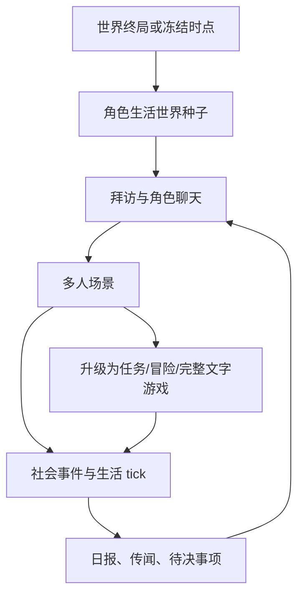

# StoryForge AI 角色生活世界（“AI 小镇”）竞品研究与实施方案

> 日期：2026-08-22<br>
> 文档性质：市场调研、开源实现审查、StoryForge 代码差距审计、产品与工程路线<br>
> 决策对象：角色互动、复杂叙事模拟、文字开放世界及未来商业化平台<br>
> 对齐状态（2026-08-22）：本文的市场结论继续有效；原 CHATGAME-3A/3B 施工入口已因最新项目总纲暂停。任何后续生产先遵守《CHATGAME 世界数据对齐审计》，从不可变 WorldRelease 冻结角色互动专属 SourceSelection，不再读取活动世界表补齐角色胶囊。
> 证据口径：把官方功能说明、可读源码、论文结论、商店页宣传、用户反馈分开，不把宣传语当成已经验证的能力

## 0. 结论先行

StoryForge 不应把目标定义成“更复杂的单角色聊天”，也不应复制一个像素小镇。更准确的产品定义是：

> **角色生活世界（Character Living World）**：以世界引擎的故事终局或任意冻结时点为起点，让已经拥有历史、关系、秘密和结局的角色继续生活。用户通过聊天进入人物关系，通过场景参与事件，通过有限管理影响社会生态；所有新事实由可回放世界状态承载，角色在多次互动之间持续成长。

“小镇”只是让用户理解产品的隐喻，不是地理约束。角色可以住在山里、远行、死亡、隐居、成为组织成员；核心是他们处在同一套可演化、可查询、可分支的社会事实中。

最佳实现不是“每个角色每个 tick 都调用一次大模型”。推荐架构是：

1. **规则系统保存并推进事实**：时间、位置、关系、资源、事件、任务、认知边界和分支归属均由确定性 reducer / event log 负责。
2. **AI 负责高语义工作**：角色计划、对话表演、记忆反思、候选行动解释、叙事导演和离线摘要。
3. **AI 只能提出候选**：行动必须命中合法动作/效果闭集，经规则校验后才能成为世界事件；对话不能凭一句话直接改写 Canon。
4. **聊天是主入口，不是全部玩法**：一次交谈可升级为多人场景，场景可产生世界事件，世界推进后又生成可谈的新内容。
5. **共享底座、产品分层**：角色互动拥有亲密关系与记忆体验；复杂模拟拥有资源/主体/长期决策；开放世界拥有区域、旅行、事件传播与任务发牌。角色生活世界组合它们，但不复制它们。

因此，实施顺序应当是：先把现有 CHATGAME-2 的世界角色导入从“一句话简介”升级为可信的**终局角色胶囊**；再把对话产生的被确认事实接到统一事件流；随后引入轻量生活 tick、角色间互动和离线回顾；最后才加管理经营与大规模自治。

## 1. 研究问题与方法

### 1.1 要回答的问题

- 市场上“角色聊天”“AI 故事游戏”“AI 小镇/生活模拟”分别在卖什么体验？
- 单角色、多角色、群聊、场景、世界模拟之间的边界在哪里？
- 什么机制真正让角色显得持续成长，而不是只在一段 prompt 里扮演？
- 哪些开源项目已经展示了可复用的实现，哪些只是研究原型或 prompt 工具？
- StoryForge 当前已经有什么，最关键的产品与工程缺口是什么？
- 怎样以最低架构债务形成一条可商业化路线？

### 1.2 证据等级

本文使用以下标记：

| 标记 | 含义 | 可用于什么决策 |
| --- | --- | --- |
| A | 论文、可读源码、StoryForge 实际代码与测试 | 架构、数据合同、实现顺序 |
| B | 官方帮助中心、官方文档、商店页已发布功能 | 产品机制、用户流程 |
| C | 官方预告、候补名单页、项目 README 自述 | 产品方向假设，不能证明质量 |
| D | 社区讨论、媒体体验、个别用户反馈 | 发现失败模式，不能单独证明普遍性 |

调研快照截至 2026-08-22。市场状态、价格、评价数和 GitHub 热度会变化；本文尽量不以这些易变数字作为核心决策依据。

## 2. 市场分层：它们实际上是四种产品

### 2.1 AI 陪伴与角色聊天

代表：Character.AI、Kindroid、Nomi、Replika，以及面向高阶用户的 SillyTavern、RisuAI、Agnai。

这一类的核心循环是“选人/造人 → 设定身份与场景 → 持续交谈 → 形成关系与记忆”。它们的强项不是世界模拟，而是：

- 极低的开始成本；
- 高可编辑的人设、背景、开场白和示例对话；
- 短期上下文、长期记忆、摘要、日志或 lorebook 的组合；
- 群聊中的角色轮换、点名、手动/自动发言；
- 用户对重生成、回滚、编辑、重置和记忆管理有较强控制。

Character.AI 已把 Scene 设计成“设定、背景、主角与可选任意角色”的即兴舞台，而不是传统分支互动小说；它也在群聊、自动记忆、Scene、Lorebook 等方向持续扩展。Kindroid 把短期、级联、可检索长期记忆与 Journal 拆开，并允许群聊共享或隔离记忆。Nomi 强调关系自然发展、长期记忆和群聊角色扮演。Replika 将背景故事和记忆作为人格连续性的显式编辑面。

对 StoryForge 的启示：

- 首次聊天必须像聊天产品一样快，不能要求用户先设计完整游戏；
- 世界引擎数据要自动折叠成可理解、可编辑的角色胶囊；
- 用户必须能看见“角色为何知道这件事、记住了什么、哪些内容不会共享”；
- 群聊不是简单地把多张角色卡拼进 prompt，必须有发言权、私有认知与场景主持。

这一类的结构性弱点也很清楚：事实常被保存在 prompt、摘要或向量记忆里，缺乏真正的因果世界状态；角色说“我把钥匙交给你”不等于库存、地点和任务已经变化；多人秘密容易被错误共享；长对话常出现摘要污染、时间错乱和关系跳变。

### 2.2 AI 叙事与 RPG

代表：AI Dungeon、Friends & Fables、Hidden Door、Retail Mage、Silver Creek 等。

这一类的核心循环是“世界/战役设定 → 玩家自由输入或选择行动 → AI 续写/主持 → 维护剧情资料”。AI Dungeon 把运行上下文拆为 Story History、AI Instructions、Plot Essentials、Author's Note、Story Cards、Memory Bank 与自动摘要；Friends & Fables 把世界资料、地点、角色和战役记忆关联，并通过检索控制上下文成本；Hidden Door 将既有虚构世界转化为社交角色扮演。

Retail Mage 给出一个尤其重要的商业实现原则：AI 运行时可以响应自由行动，但 NPC 的动机、人格和任务仍是作者设计的。换言之，**生成式表演不应替代可测试的游戏设计**。

对 StoryForge 的启示：

- 角色聊天可以产生新故事，但“进入一段完整任务/冒险”应升级到共享 Narrative Runtime，而不是在聊天记录里偷偷模拟整套游戏；
- 角色与世界资料需要位置、时间、角色、事件等结构化关联，不能只靠全文相似度；
- 生成内容必须区分草稿、角色信念、分支事实和作者 Canon。

### 2.3 AI 小镇与自治角色社会

代表：Generative Agents、a16z AI Town、TownStory AI、Aliveville、Wanderfolk、AI Society，以及较新的 Chasm、Town 等项目。

这一类通常宣传：角色有日程、位置、目标、关系、记忆，会彼此交谈，用户离开时世界仍在推进，回来后可以查看日报或处理决策。TownStory 把用户置于市长/目标设定者位置，AI 代理处理事务，用户通过 Decision Cards 和 Town Daily 回到循环；Aliveville 强调地点感知、日程、八卦与导演；Wanderfolk 宣传角色每日行动、关系和声誉变化；AI Society 把本地模型驱动的自治居民做成已发布的生活模拟产品。

这类产品最有价值的不是“屏幕上有许多会走路的 AI”，而是三个回访机制：

1. **世界在我不说话时也有变化**；
2. **变化与我认识的人有关**；
3. **我回来后有一份可理解、可干预的摘要**。

它们的最大风险也来自自治：

- 大量低价值日常事件产生噪声，重要故事被淹没；
- 每个角色频繁调用模型导致成本和延迟不可控；
- 角色互相复述模型幻觉，错误迅速社会化；
- 角色有语言上的“计划”，但没有可以执行的世界动作；
- 离线模拟若无限追赶，会产生不可解释的大幅状态跳变；
- “看它们生活”缺少玩家目标后，容易成为几分钟新奇体验。

### 2.4 传统社会模拟与涌现叙事

代表：The Sims、RimWorld、Dwarf Fortress、Crusader Kings、Talk of the Town、Neighborly。

这一层没有依赖 LLM，却解决了 AI 小镇更难的部分：需求、关系、职业、事件、社会规则、历史、传闻、导演节奏和可解释的因果链。

Talk of the Town 研究了角色如何观察、转述、误记、遗忘甚至说谎。Neighborly 将特征、状态、关系、职业与 Life Events 作为涌现故事的素材，支持多代居民历史。RimWorld 的“AI storyteller”说明模拟不是越多越好：需要一套节奏系统选择何时施压、何时留白。Dwarf Fortress 则证明长历史和可查询因果能让玩家自行发现故事。

对 StoryForge 的核心启示：**AI 角色小镇首先是社会模拟产品，其次才是聊天产品；LLM 应增加表达空间，而不是代替社会系统。**

## 3. 竞品机制矩阵

| 产品/项目 | 核心入口 | 记忆与世界锚定 | 多角色/自治 | 回访与经营循环 | 应吸收 | 应避免 | 证据 |
| --- | --- | --- | --- | --- | --- | --- | --- |
| Character.AI | 角色、Scene、群聊 | 人设、场景、自动记忆、Lorebook | 群聊与 Scene，世界权威较弱 | 关系/内容消费 | 极低启动成本、Scene 模板、任意/主角色 | 把群聊当世界模拟 | B |
| Kindroid | 自定义伴侣与群聊 | 多层记忆、Journal、当前场景、可编辑关系 | 多角色共享/隔离记忆 | 长期陪伴 | 记忆可见性、Chat Break、上下文可编辑 | 全部事实只在记忆文本中 | B |
| Nomi / Replika | 陪伴关系 | 背景故事和长短期记忆 | 群聊有限 | 情感连续性 | 渐进关系、易理解的人设编辑 | 关系只靠语言承诺 | B |
| SillyTavern | 卡片+聊天/群聊 | Lorebook、摘要、向量检索、插件 | 多种发言策略 | 高阶创作工作台 | 角色卡兼容、激活预算、手动控制、可检查摘要 | prompt 成为唯一事实源 | A/B |
| RisuAI / Agnai | 卡片、群组、Memory Book | 关键词/正则/向量、递归扫描、预算 | 多 bot 发言 | 自托管/高级设置 | lore 互操作、优先级和扫描深度 | 复杂设置直接暴露给普通玩家 | A/B |
| AI Dungeon | 自由动作/故事续写 | 多层 Plot Components 与 Memory Bank | 叙事角色，不是真正社会 | 持续冒险与内容创作 | 分层上下文、自动摘要 | 长篇进度仅靠卡片维护 | B |
| Friends & Fables | 世界/战役/GM | 角色、地点、战役关联记忆 | RPG 群体 | 战役推进 | 世界资料关联、成本意识 | 将检索命中等同 Canon | B |
| Retail Mage | 自由行动+手工任务 | 人写的动机、人格、任务 | 反应式 NPC | 经营/任务 | “手工规则骨架+AI 表演” | 让模型自由发明所有任务 | B |
| Generative Agents | 生活模拟 | 记忆流、重要度/近因/相关性、反思、计划 | 25 人研究原型 | 观察与干预 | 观察—计划—反思；证据检索 | 每个细节都走昂贵 LLM | A |
| a16z AI Town | 像素世界 | DB 记忆、对话摘要与向量 | 当前实现以双人对话为主 | 观察/聊天 | 权威状态引擎+异步代理输入 | 假设开源 starter 已可大规模商用 | A/C |
| TownStory AI | 市长目标与代理 | 日报、决策卡、离线世界（宣传） | 代理管理居民 | 日报—决策—委派 | 目标委派、Decision Cards、catch-up | 在预发布宣传上做能力承诺 | C |
| Aliveville | 浏览器小镇 | 地点感知检索、日程、八卦（自述） | 小规模自治 | 观看/导演 | 地点和社会传播、导演 | 无节奏的自治闲聊 | C |
| Chasm | 游戏桥接 NPC 后端 | 游戏状态、见证者记忆、关系、存档回滚 | 自主动作、日程、同伴 | 与现有游戏循环结合 | 真动作白名单、见证范围、存档一致性 | README 功能量等同成熟度 | A/C |
| Neighborly | 定居点模拟 | 结构化关系、职业、状态、Life Events | 多代自治 | 历史发现/分析 | 事件是故事原子 | 非交互研究模拟直接当成玩家产品 | A |
| StoryForge 当前 | 发布→实例→聊天/场景 | 冻结档案、知识、记忆候选、关系事件 | 1–8 角色场景；开放世界另有日程/tick | 检查点、分支、任务 | 已有的事件溯源和模块组合 | 继续浅导入、另造平行运行时 | A |

## 4. 开源项目源码审查

### 4.1 Generative Agents：记忆不是聊天摘要，而是认知循环

论文与源码把角色认知拆为：

- observation：把经历追加到记忆流；
- retrieval：按近因、相关性、重要度混合评分检索；
- reflection：积累到阈值后，从证据中生成更高层认识；
- planning：生成日计划并细分，在观察到变化时重排；
- reacting：基于当前情境与既有计划决定是否反应。

源码中的 `retrieve.py`、`reflect.py`、`plan.py` 证明这不是单个“长期记忆 prompt”。身份稳定信息、当前动作/地点、日程、对话状态被分开保存。

StoryForge 应吸收的是循环和分层，不是原样复制其调用频率。反思产物还必须带证据引用，并处在“角色认识/推断”层，不能直接写入世界 Canon。

### 4.2 a16z AI Town：权威状态与异步 AI 操作分离

`ARCHITECTURE.md` 显示：世界逻辑单线程推进，客户端输入修改权威状态；LLM 操作异步运行，完成后以 input 形式回到状态机，而不是在异步任务里直接改世界。高频消息与低频世界状态也被分开。

其对话状态明确管理邀请、走近、参与等阶段，但当前核心对话以两名成员为单位。会后生成摘要和 embedding，未来对某人的查询会检索相关记忆。

这是 StoryForge 最应坚持的边界：现有 SimulationEvent、reducer、checkpoint 负责世界；角色回复、计划和导演候选通过 Harness 进入，但只能提交合法命令。

### 4.3 SillyTavern：成熟的角色聊天控制面

源码展示了多种群聊激活策略和生成方式：自然选择、列表顺序、手动指定、池化；成员可禁用，并带 talkativeness。Lorebook 支持 always-on、关键词、次关键词、递归扫描、插入位置、深度、概率、优先级和 token budget。

Memory 扩展按间隔总结聊天，把摘要绑定到消息；聊天、角色或群组变化时拒绝过期结果，编辑/重生成会清除失效摘要。这个“异步结果必须验证基线”的细节与 StoryForge 的 stale-reply 防护一致，值得继续保持。

应吸收：可检查的发言策略、检索命中说明、手动/自动切换、角色卡互操作。不能吸收：把所有状态退化成 prompt 注入。

### 4.4 RisuAI 与 Agnai：Lorebook 的工业化细节

RisuAI 对角色、全局、会话和模块 lore 统一处理，支持扫描深度、预算、递归、正则、完整词、位置、优先级、概率、排除键和条件修饰；其 HypaMemory 提供本地/API embedding 与浏览器缓存。群聊先响应点名，再结合 talkness 选择角色。

Agnai 的 Memory Books 支持关键词和通配符，以优先级和年龄排序，超预算时裁剪，并与 Character Book 字段互操作。源码也暴露一个典型边界：浏览器只扫描已经加载的有限消息，说明“上下文窗口”和“真实历史”必须分开。

### 4.5 TinyTroupe：人格模拟必须可评测

TinyTroupe 将 persona、episodic memory、目标、情绪、关系、结构化 action 和 world step 分开，支持多代理并行、干预、状态检查和成本记录。它的定位是实验性 persona simulation，而不是游戏，但给 StoryForge 一个重要补充：

> 商业化角色系统不能只测“回复能否生成”，还要测角色一致性、知识边界、行为可解释性、关系变化证据、跨长局稳定性与单位体验成本。

### 4.6 Neighborly 与 Talk of the Town：先有事件，再有故事

Neighborly 以 agent-based settlement simulation 记录特征、身份、关系、职业和 Life Events；恋爱、入职、死亡或超自然转变都是结构化事件。它目前是归档的研究项目，不能作为直接依赖，但其事件建模适合作为 StoryForge 社会模拟内容层的参考。

Talk of the Town 的观察、转述、误记、遗忘、说谎模型提醒我们：

- 世界真相、角色看见的事实、角色相信的内容、角色说出的内容是四件不同的事；
- 传闻传播应沿见证和社交边发生；
- 错误信念必须能被纠正，但不能反向污染真相。

### 4.7 Chasm：语言动作必须落到真实游戏动作

Chasm 的公开仓库强调 game bridge、动作发现/白名单、真实库存交换、日程、旅行、事件见证、存档回滚和关系账本。尤其值得吸收两点：

1. 模型只看到当前可执行的动作子集，语言意图必须解析并校验后才执行；
2. 记忆按见证者产生，并随存档分支回滚，丢弃分支的事件不会残留在角色脑中。

这是较新的项目，应把其功能自述视为方向证据，不视为商业成熟度证明。

### 4.8 Chronicler：秘密可见性与三层记忆

源码中的 scene participant、`visible_to` 和 memory compose/write 形成了明确的信息隔离：后来加入场景的人不会追溯获得此前私密记忆。其 reflex / heuristic / canon 分层、prompt inspector、memory inspector、保守的性格/偏好升级也很有参考价值。

项目较新，价值在架构思想，不在市场验证。StoryForge 已有知识边界与可回放事件，应直接在自己的权威模型中实现，不应依赖一个外部聊天记忆层。

## 5. 失败模式：决定产品能否长期留存的部分

### 5.1 角色说得像，但活得不像

只要 prompt 足够长，AI 很容易“像角色说话”；困难的是让它只知道应该知道的事、做完动作后世界真的改变、下一次见面还能对上时间和关系。这正是角色聊天与角色生活世界的分水岭。

### 5.2 记忆污染

摘要会把假设写成事实，把别人的秘密归到当前角色，把角色扮演台词当历史。解决方式不是再做一层摘要，而是所有长期记忆都带：

- `subject / predicate / object` 或可验证陈述；
- 来源事件、来源消息与分支；
- 见证者/可见主体；
- `canon | observed | believed | rumored | inferred` 层级；
- 置信度、重要度、生命周期；
- 作者/系统/玩家确认状态。

### 5.3 自治噪声与“日报垃圾”

如果十个角色每天各生成十件事，用户回来就会面对一百条没有意义的流水账。后台模拟应大部分是规则结算，只有跨越“叙事显著性阈值”的变化才成为 story beat；日报还应按“与你有关、与你关心的人有关、改变世界结构、需要你决定”排序。

### 5.4 无限模拟导致无限成本

所谓离线世界不应按真实分钟无限补 tick。应使用：

- 叙事时间而不是墙钟时间；
- focused / background / dormant 三档注意力；
- dormant 角色只做批量规则结算；
- 只有冲突、相遇、关系阈值或用户关注触发 AI；
- 回归时把长时间段压缩成有限数量的代表事件；
- 每个会话、角色、日和功能都有预算与降级路径。

### 5.5 多角色发言变成轮流独白

群聊必须显式管理：谁听见了、谁被点名、谁有回应动机、谁正在打断、谁保持沉默、哪些信息可公开。默认不应让每个角色每回合都说话。

### 5.6 经营层与人物层脱节

如果用户点“建设酒馆”只改变一个数值，而角色从不谈论、不使用、不形成关系，经营没有意义。反过来，如果 AI 说酒馆开业但资源与地点没变，也是假经营。每个经营决策必须同时产生规则效果、可观察事件和角色反应机会。

## 6. StoryForge 现状审计

### 6.1 已经具备的能力

#### 角色互动（CHATGAME-2）

- 1–8 个角色、单人/多人场景；
- 角色档案、私有/公开初始知识、关系维度；
- 发言、固定行动、场景导演、回合预算；
- 记忆候选的接受/拒绝与证据约束；
- 关系变化事件和大幅变化阈值；
- GameRelease 冻结、实例运行、检查点、分支、恢复；
- 异步回复过期保护与 100 回合有界上下文测试。

#### 复杂叙事模拟（TEXTSIM-1）

- turn、资源、指标、角色/组织、问题、modifier、report、decision queue、schedule；
- 合法行动闭集、延迟效果、主体策略行动；
- 可见报告与可重放事件。

#### 文字开放世界（TEXTWORLD-1）

- 离散 tick，不做不可控实时后台模拟；
- 区域、旅行、发现渠道、角色/组织日程；
- 区域问题漂移和有限传播；
- 任务发牌、配额、冷却、指纹去重、积压惩罚、关键任务保证；
- focused/background 注意力和批量长局；
- 与 interaction profile、narrative simulation、adventure 的组合验证。

#### 世界与运行权威

- WorldRelease / GameRelease 冻结发布；
- SimulationSession / SimulationEvent / SimulationCheckpoint；
- `CONTEXT_SOURCES`、`FIELD_REGISTRY`、`PROJECT_TABLES` 三个治理权威；
- Agent Skill / Run Contract / Harness 的正式 AI 入口。

这意味着项目不需要再造数据库、通用代理框架或另一套文字游戏状态机。

### 6.2 当前最关键的缺口

#### 缺口 A：世界角色导入很浅

`createStarterInteractionGame()` 当前只把 `shortDescription`（或 `storyRole`）写为角色定位，把 `speechStyle` 写为口吻，并创建一条公开简介。角色的性格、背景、动机、目标、恐惧、关键经历、关系、结局、当前位置等都没有进入初始角色档案。

`InteractionSourceCharacterSnapshotV1` 也只保存世界内容 hash、角色导出 ID、稳定 key 和姓名，不能独立证明“这个终局角色为什么是现在这样”。

这是当前角色聊天最直接的体验断层：世界引擎已经积累了人物，聊天却像从一张空白角色卡重新开始。

#### 缺口 B：缺少“终局角色胶囊”合同

需要一个可冻结、可检查的角色投影，至少包括：

- 身份与稳定人格；
- 终局/选定时点的状态、位置、存亡和未决目标；
- 与所选角色及关键外部角色的关系；
- 角色亲历的事件、确认认知、错误信念和秘密；
- 说话规则、边界、敏感内容；
- 来源记录与覆盖报告。

#### 缺口 C：新角色仍依赖世界 Character 行

现有作者 API 主要要求 `characterId`。用户要在聊天起点创建一个新来者、访客或自我角色时，还没有清晰的 session-only / world-candidate 边界。正确路径不是偷偷向世界表写角色，而是先创建可移植的访客胶囊；只有作者明确采纳后才进入世界 Canon。

#### 缺口 D：聊天与社会模拟尚未闭环

角色互动中的关系主要面向角色→玩家，场景结束后尚未自然触发角色日程、NPC↔NPC 关系、位置、需求、组织或区域变化。开放世界拥有日程和 tick，但角色聊天还没有把场景事件映射到这些状态。

#### 缺口 E：缺少普通玩家可理解的回访产品面

底层有事件流，但没有“今天发生了什么、为什么与你有关、谁在等你、哪些决定需要处理”的生活世界摘要，也没有 Watch / Visit / Participate / Steward 等模式。

#### 缺口 F：缺少商业级角色评测与成本闸门

需要独立评测：角色一致性、秘密泄漏、错误 Canon、时间连续性、多人发言质量、关系变化证据、100/500 回合漂移、离线批处理成本、失败降级与模型切换。

## 7. 目标产品设计

### 7.1 四层体验，而不是四个互斥产品



- **拜访层**：像优秀角色聊天产品一样快，适合聊过去、当下和私人关系。
- **场景层**：有地点、时间、在场者、目标、边界和结束条件；多人互动发生在这里。
- **生活层**：时间推进、角色日程、关系、组织、区域与事件传播。
- **经营层**：用户设定目标、分配有限资源、委派角色、处理关键决策；它不是放置数值，而是制造人物故事。

### 7.2 用户身份模式

同一世界可提供不同产品姿态：

| 模式 | 用户能做什么 | 系统主动性 |
| --- | --- | --- |
| Visit / 拜访 | 找某人聊天、送礼、询问往事 | 低，角色围绕当前会面响应 |
| Participate / 入局 | 以自建角色参与场景和事件 | 中，导演维持目标与节奏 |
| Watch / 观察 | 推进时间、查看人物与事件 | 中高，规则模拟为主 |
| Steward / 管理 | 设目标、分配资源、委派、处理决策卡 | 高，但每个动作有权威效果 |
| Author / 作者 | 调整胶囊、规则、边界、剧情种子和发布 | 所有 AI 结果先为候选 |

首期只实现 Visit/Author；其余模式随着生活模拟接入逐步开放。

### 7.3 角色终局胶囊

建议形成 `CharacterTerminalCapsuleV1`（名称可在正式任务中确定），逻辑字段如下：

```ts
interface CharacterTerminalCapsuleV1 {
  identity: { characterKey: string; name: string; role: string }
  anchor: { worldReleaseHash: string; storyTime: string; ending: string; location: string }
  stableTraits: Array<{ key: string; value: string; source: SourceRef }>
  currentState: Array<{ key: string; value: string; source: SourceRef }>
  relationships: Array<{ otherKey: string; publicSummary: string; privateView?: string; source: SourceRef }>
  knowledge: Array<{ key: string; statement: string; epistemic: 'known' | 'believed' | 'rumored'; visibility: string[]; source: SourceRef }>
  livedEvents: Array<{ eventKey: string; summary: string; importance: number; source: SourceRef }>
  unresolvedThreads: Array<{ key: string; desire: string; obstacle?: string; source: SourceRef }>
  voiceAndBoundaries: { speechRules: string[]; safetyRules: string[] }
  coverage: Array<{ sourceKind: string; status: 'included' | 'omitted'; reason: string }>
}
```

首版不必立即增加新表：可以先把结构化投影编译成现有 `InteractionKnowledgeSeed[]`，随 GameRelease 冻结；当胶囊需要独立版本、复用和 UI 检查时，再登记正式表或作为发布清单的版本化字段。任何正式新增都要同步三注册表和生命周期测试。

### 7.4 五层事实模型

| 层 | 例子 | 谁可写 | 能否改变世界 |
| --- | --- | --- | --- |
| Canon truth | 钥匙在钟楼；角色已经死亡 | 世界发布/合法规则事件 | 是，权威 |
| Branch fact | 本分支玩家把钥匙交给了甲 | 已验证 SimulationEvent | 是，仅本分支 |
| Observation | 甲亲眼看见交付 | 由见证规则派生 | 否，但可形成认知 |
| Belief / rumor | 乙听说钥匙被毁 | 认知/传播系统 | 否 |
| Narrative proposal | AI 建议乙因此去钟楼 | Harness 候选 | 否，直到合法动作被采纳 |

对话生成时可以读取角色可见的后四层，但输出不得跨层写入。

### 7.5 生活 tick 与注意力分级

每个 tick 的顺序建议为：

1. 结算到期日程和延迟效果；
2. 规则更新需求、位置、资源、组织与区域压力；
3. 识别可能相遇和冲突的角色；
4. 规则选择合法动作候选；
5. 仅对高显著性候选调用 AI 规划/表演；
6. 校验并写入事件；
7. 沿见证/关系边传播观察或传闻；
8. 更新关系与记忆候选；
9. 叙事导演决定展示、留白或生成待决事项；
10. 生成可追溯摘要。

注意力档位：

- `focused`：用户所在场景和直接相关角色，可逐动作/逐对话运行；
- `background`：关键角色和邻近区域，按日程和重要事件运行；
- `dormant`：批量结算，只有阈值事件才展开；
- `archived`：终局或离开世界，只读历史，除非被重新激活。

### 7.6 叙事导演不是“替玩家写剧情”

导演只做选择与排序：

- 选择当前最值得呈现的合法事件；
- 控制高强度事件连发、重复题材和任务积压；
- 保证长时间没有进展的关键线程得到机会；
- 给用户留白，不强制每个 tick 都发生大事；
- 不创造未在规则/作者池中的权威事实。

现有开放世界 Director 的积压、冷却、类别配额、freshness、critical guarantee 和 blank card 已是正确底座。

### 7.7 “新故事”怎样进入系统

用户提出“我们一起调查失踪案”时，不应立刻生成一条无限剧情：

1. 角色以自己的知识与关系回应；
2. Director 将意图识别为 `story seed candidate`；
3. 系统检查冲突主体、地点、可用线索、边界和世界一致性；
4. 小事件可编译为场景目标；
5. 多阶段事件升级为 adventure / storygame module；
6. 发布或实例内采纳后才进入事件流；
7. 完成结果回流生活世界，成为角色共同历史。

这样既保留自由聊天，也避免角色聊天吞并所有文字游戏类型。

## 8. 最佳工程路径

### 阶段 CHATGAME-3A：世界落地的角色起点（本轮首做）

目标：用户选择世界角色后，不再得到一张一句话角色卡，而得到可编辑、带知识边界的生活档案。

范围：

- 从 Character 的身份、性格、背景、动机、目标、恐惧、关键事件、弧光、结局、地点、习惯、口吻等非空字段生成有界知识种子；
- 所选角色之间的结构化 CharacterRelation 分别写入相关角色的私有认知；
- KnowledgeLedger 只采纳 `confirmed` 事件，按 learn/mislearn/forget/correct 折叠到聊天起点；
- 错误信念作为角色相信的内容，不覆盖命题真相；forget 后不注入；
- 公共简介与私有自我知识分离；
- GameRelease 继续冻结生成结果，不在运行时反查可变 Character；
- 提供纯函数测试、作用域反例和兼容现有 CHATGAME-2 的回归。

验收：一个拥有丰富世界资料的角色开始聊天时，能正确谈到自己的过去、目标、关系与结局；另一个未获知秘密的角色不能因为同场而知道它；修改世界角色后，旧发布实例不漂移。

### 阶段 CHATGAME-3B：访客/新角色与聊天开场生成器（确定性基础本轮已实现）

目标：用户可创建不在世界 Canon 中的新角色，设定与既有角色的关联、聊天背景、方向和边界。

合同：

- `session guest` 默认只存在实例/发布草稿；
- `world candidate` 通过 CreativeArtifact + adoption 显式采纳；
- 关联只能引用已冻结角色 key；
- 开场设置包含时点、地点、在场者、用户身份、目的、禁止事项、期望语气；
- AI 可辅助生成，但先产生候选，不直写世界角色或关系表。

本轮已经实现其中不依赖 AI 的产品闭环：作者可以在创建互动时填写地点、时间、聊天背景和发展方向；也可以创建带背景及世界关联的互动专属角色。该角色使用便携身份随 GameRelease 冻结，`characterId = null`，不会新增或修改世界 Character。AI 辅助起点生成和“明确采纳为世界角色”仍留在后续任务，后者必须走 CreativeArtifact / Adoption。

### 阶段 CHATGAME-3C：聊天产生可信生活变化

- 对话中识别承诺、交换、冲突、关系变化和新线索候选；
- 映射到合法动作/效果闭集；
- 用户确认或规则自动校验后写 SimulationEvent；
- 产生角色观察和证据绑定记忆；
- 场景结束生成“发生了什么/谁知道/谁相信/世界改变了什么”结算页。

### 阶段 LIVINGWORLD-1：轻量角色生活世界

- 复用 TEXTSIM 的 actors/actions/schedules 与 TEXTWORLD 的 region/tick/attention/director；
- 新增角色当前需求、短期目标和日程投影，不新造 Session/Event/Checkpoint；
- 支持 NPC↔NPC 相遇、关系变化、见证与传闻；
- 支持有限离线追赶和 Living World Digest；
- 用户从日报跳回某个角色或场景。

### 阶段 LIVINGWORLD-2：管理/模拟经营

- 用户设定有限公共目标；
- 角色/组织承担任务，给出成本、风险和偏好；
- Decision Cards 只承载真正的规则分岔；
- 建筑、资源或制度变化必须改变角色可执行动作和生活；
- 成功指标从“生成字数”转向关系回访、事件完成、角色网络变化和玩家理解度。

### 阶段 LIVINGWORLD-3：商业化与规模化

- 模型路由：规则、本地小模型、低成本模型和高质量模型分工；
- per-session / per-day / per-character 预算和质量降级；
- 内容安全、年龄分级、用户生成角色权利与投诉机制；
- 角色一致性/泄密/Canon/成本长局 eval；
- 世界包、角色包、作者工具、订阅或额度的商业组合；
- 数据导出、删除、版本迁移、崩溃恢复和跨设备策略。

## 9. 商业产品建议

### 9.1 不以“无限”作为承诺

“无限推演”应在产品上表达为“可持续、可分支、可继续”，而不是无限实时计算。用户真正需要的是持续性和不可预知的故事，不是服务器持续烧 token。

### 9.2 三个可收费价值层

1. **角色关系层**：更多长期记忆、更多并行角色、更高质量对话和语音/形象；
2. **生活世界层**：更多活跃角色、更长离线模拟窗口、更丰富日报和管理目标；
3. **作者生产层**：世界→角色胶囊→可玩生活世界的自动编译、评测、发布与内容包市场。

收费不能破坏事实一致性：低套餐应减少频率/活跃范围，而不是让角色更容易忘记秘密或胡编世界。

### 9.3 产品北极星指标

- 次日/七日后用户是否主动回访同一角色；
- 一周内被重新打开的角色数，而非创建角色数；
- 用户能否准确回答“最近发生了什么、为什么发生”；
- 有证据的关系/世界变化占比；
- 每百回合知识泄漏、Canon 冲突和时间错误；
- 每个有意义事件的模型成本；
- 从聊天种子升级为场景/任务并完成的比例。

## 10. 架构约束与注册表闭包

任何阶段动手前仍需回答三件事：

1. AI 读什么：只通过 `CONTEXT_SOURCES + assembleContext()`；角色胶囊若成为正式 AI 上下文，必须登记独立源或编入受治理的 `interactionRuntime`。
2. AI 写什么：反思、关系、故事种子默认是 CreativeArtifact/候选；写正式字段必须进入 `FIELD_REGISTRY + AdoptionSchema + adopt()`。
3. 涉及哪些表：新表必须加入 `PROJECT_TABLES` 派生导入导出、删除、迁移、世界作用域和引用重映射生命周期。

优先复用：

- `WorldRelease / GameRelease`：冻结来源；
- `interactionCharacterProfiles / interactionSceneTemplates`：角色与场景作者数据；
- `simulationSessions / simulationEvents / simulationCheckpoints`：实例与事实；
- `NarrativeSimulationContentV1`：主体、资源、决策与 schedule；
- `OpenWorldContentV1`：区域、日程、传播与导演；
- `knowledgeLedger / temporalFacts`：角色认知与世界事实分层；
- Agent Skill / Run Contract / Harness：所有正式模型调用。

不允许：组件内手拼世界上下文、模型直接更新 Character/Relation/Simulation 表、另造一套小镇事件库、聊天摘要反向成为 Canon、无分支标识的跨实例记忆。

## 11. 本轮交付边界

本轮文档之后首先实施 CHATGAME-3A，并一并完成 CHATGAME-3B 的确定性基础：丰富角色起点、关系和确认认知的提取；允许作者设置聊天地点、时间、背景与方向；允许创建不写入世界 Canon 的互动专属角色；加入发布冻结和知识边界回归测试。它们共同解决“世界引擎里有完整人物，聊天只拿到一句简介”以及“新角色必须先污染世界主表”的首要问题。

本轮不假装已经交付完整 AI 小镇：AI 辅助开场、专属角色采纳为 Canon、聊天世界事件采纳、生活 tick UI、日报和管理经营仍属于后续垂直切片。这样既能立刻提升角色聊天，又不会在当前已有文字游戏平台建设之上制造不可收口的平行半成品。

## 12. 主要来源

### 12.1 论文与传统模拟

- [Generative Agents: Interactive Simulacra of Human Behavior](https://arxiv.org/abs/2304.03442)（论文，A）
- [Project Sid: Many-agent simulations toward AI civilization](https://arxiv.org/abs/2411.00114)（论文，A）
- [Talk of the Town: A Simulation Tool for Narrative Generation](https://ojs.aaai.org/index.php/AIIDE/article/view/12825)（论文，A）
- [Neighborly repository](https://github.com/ShiJbey/neighborly) 与 [Life Events 文档](https://neighborly.readthedocs.io/en/latest/life_events.html)（源码/研究工具，A；仓库已归档）
- [The Sims Social：GDC Vault](https://www.gdcvault.com/play/1015746/Life-is-a-Social-Game)（行业设计资料，B）
- [RimWorld Steam page](https://store.steampowered.com/app/294100/RimWorld/)（产品说明，B）
- [Dwarf Fortress Steam page](https://store.steampowered.com/app/975370/Dwarf_Fortress/)（产品说明，B）

### 12.2 角色聊天与 AI 故事产品

- Character.AI：[Scene Creation Quickstart](https://support.character.ai/hc/en-us/articles/41918454359451-Scene-Creation-Quickstart-Guide)、[2025-09 群聊/Scene/Lorebook 更新](https://support.character.ai/hc/en-us/articles/41760067000475-Community-Update-September-2025)、[2025-04 自动记忆更新](https://support.character.ai/hc/en-us/articles/36429196456475-Community-Update-April-2025)（官方帮助，B）
- Kindroid：[Memory](https://kindroid.ai/docs/article/memory/)、[Chat features](https://kindroid.ai/docs/article/chat-features-and-tools/)、[Customizing personality](https://kindroid.ai/docs/article/customizing-personality/)（官方文档，B）
- [Nomi](https://nomi.ai/)（官方说明，B）
- Replika：[Memory](https://help.replika.com/hc/en-us/articles/37208679176077-How-does-Replika-s-memory-work)、[Backstory](https://help.replika.com/hc/en-us/articles/37208430613261-How-your-Replika-s-backstory-shapes-its-personality)（官方帮助，B）
- AI Dungeon：[Plot Components](https://help.aidungeon.com/faq/plot-components)、[Memory System](https://help.aidungeon.com/faq/the-memory-system)、[Docs](https://www.aidungeon.io/docs/)（官方帮助，B）
- Friends & Fables：[Memories](https://help.fables.gg/help/articles/2838157-memories)、[Worlds](https://help.fables.gg/articles/5283283/worlds)、[Creating a character](https://help.fables.gg/articles/4931727-creating-a-character)（官方帮助，B）
- [Hidden Door](https://www.hiddendoor.co/about)（官方说明，B/C）
- [Retail Mage](https://store.steampowered.com/app/3224380/Retail_Mage/)（商店页，B）

### 12.3 AI 小镇与社会模拟产品

- [TownStory AI](https://ai.townstory.io/en)（预发布官方宣传，C）
- [Aliveville](https://aliveville.com/)（原型官方说明，C）
- Wanderfolk：[About](https://wanderfolk.ai/about/)、[Autonomous NPC simulation](https://wanderfolk.ai/updates/2026-02-23-autonomous-npc-simulation/)、[NPC Awareness](https://wanderfolk.ai/features/npc-awareness/)（官方宣传，C）
- [AI Society](https://store.steampowered.com/app/4468180/)（商店页，B）
- [Enjoy AI Town](https://apps.apple.com/us/app/enjoy-ai-town/id6468901311)（App Store，B）
- [Silver Creek](https://silvercreektown.com/)（官方说明，C）
- [Eruin](https://www.eruin.dev/)（官方说明，C）

### 12.4 开源代码

- a16z AI Town：[repository](https://github.com/a16z-infra/ai-town)、[architecture](https://github.com/a16z-infra/ai-town/blob/main/ARCHITECTURE.md)、[agent memory](https://github.com/a16z-infra/ai-town/blob/main/convex/agent/memory.ts)、[conversation state](https://github.com/a16z-infra/ai-town/blob/main/convex/aiTown/conversation.ts)（源码，A）
- Generative Agents：[repository](https://github.com/joonspk-research/generative_agents)、[retrieval](https://github.com/joonspk-research/generative_agents/blob/main/reverie/backend_server/persona/cognitive_modules/retrieve.py)、[reflection](https://github.com/joonspk-research/generative_agents/blob/main/reverie/backend_server/persona/cognitive_modules/reflect.py)、[planning](https://github.com/joonspk-research/generative_agents/blob/main/reverie/backend_server/persona/cognitive_modules/plan.py)（源码，A）
- SillyTavern：[repository](https://github.com/SillyTavern/SillyTavern)、[group chat](https://github.com/SillyTavern/SillyTavern/blob/release/public/scripts/group-chats.js)、[world info](https://github.com/SillyTavern/SillyTavern/blob/release/public/scripts/world-info.js)（源码，A）
- [RisuAI](https://github.com/kwaroran/RisuAI)（源码，A）
- [Agnai](https://github.com/agnaistic/agnai)（源码，A）
- [TinyTroupe](https://github.com/microsoft/TinyTroupe)（源码，A；实验性）
- [Chasm](https://github.com/chasmlol/chasm)（源码与项目说明，A/C）
- [Chronicler](https://github.com/yantrikos/chronicler)（源码，A；早期项目）
- [RedPlanetHQ Town](https://github.com/RedPlanetHQ/town)（源码/早期产品，A/C）
