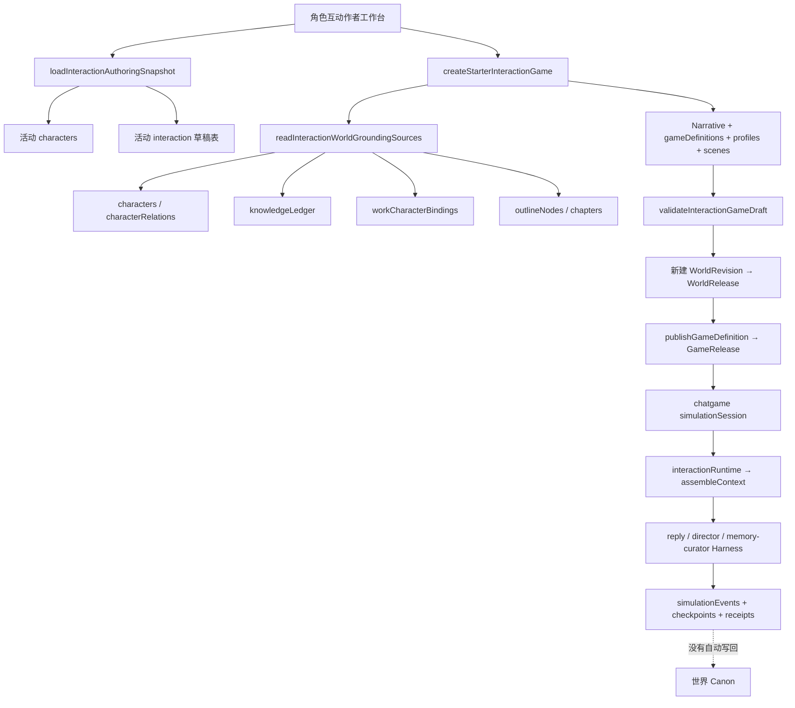
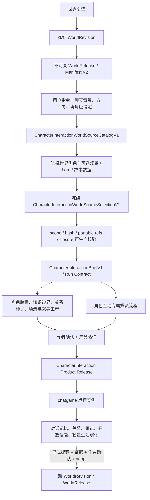

# CHATGAME / 角色互动与世界引擎到产品总纲对齐审计

> 审计日期：2026-08-22；实施更新：2026-08-25<br>
> 产品范围：`character-interaction` / 角色聊天、多人角色场景及其后续轻量角色生活世界；不替文字游戏、TTRPG、AVG 或开放世界制定生产协议<br>
> 当前分支：`feat/ttrpg-game-platform`，基点 `2c9ad713cb5e5201a191a3c8fcbfc641a592af1e`<br>
> 最新总纲：`origin/main@8dc6fa7b1d5fee6218a74016d6a3c15e3040846f`<br>
> 总裁决：**角色互动正式生产链已经按总纲恢复开放：必须从已有的不可变 WorldRelease 出发，冻结产品专属 SourceSelection 与 Brief / Run Contract，随后经 durable 候选生产、作者确认、媒资完整性校验和不可变 Product Release 才能启动运行实例。现有活动表导入和“先创建产品、再把产品塞回 WorldRelease”的循环发布链不再是 ProductHub 的正式入口。**

## 1. 现场保护、总纲来源与审计边界

- 审计开始时工作树已有 83 个 tracked 变更和大量未跟踪施工文件；没有执行 rebase、merge、stash、reset、clean、checkout 或任何覆盖操作。
- 只执行 `git fetch origin main`，然后用 `git show origin/main:<path>` 完整读取最新 `AGENTS.md`、`docs/WORLD-ENGINE-TO-PRODUCT-DEVELOPMENT-CHARTER.md` 和 `docs/CONTEXT-ROUTING.md`。
- 当前分支比 `origin/main` 落后三个提交；因为工作现场不适合 rebase，本次以 `origin/main@8dc6fa7b` 为权威总纲，不为同步文档破坏现场。
- 审计关联闭包是：产品入口 → 世界读取 → SourceSelection → 产品写入 → AI / Harness → Product Release → 运行实例 → 演化 / 回流 → 三注册表 → 测试。
- 本次没有修改世界引擎正式出口、没有建立跨产品公共 Brief / DAG / 媒资层、没有允许运行事实自动回写世界。

## 2. 当前分支真实产品流程图

### 2.1 审计前实际链路



这个流程的后半段——不可变 GameRelease、实例事件、角色视角上下文、Instance Harness、回放、分支和旧存档兼容——有可保留价值。问题集中在前半段：

1. `readInteractionWorldGroundingSources()` 直接读取仍会变化的世界 / 作品活动表；其中 `knowledgeLedger`、`chapters` 根本不属于当前 WorldRelease 出口。
2. `createStarterInteractionGame()` 在没有 WorldRelease / SourceSelection 时先写 Narrative、`gameDefinitions`、角色档案和场景表。
3. `publishInteractionGameDraft()` 再把这些产品草稿装入新的 WorldRelease，随后 `publishGameDefinition()` 又要求从这个 Release 找回同一产品定义、角色档案和场景。这是产品资产反过来成为世界来源的循环，不是“世界来源 → 产品生产”。
4. 当前 `GameDefinition.sourceSelectionJson` 的严格 parser 只接受 `storygame / text-adventure / avg` 的 `WorldGameSourceSelectionV1`，角色互动没有自己的正式来源契约。
5. 新增的“终局角色胶囊”虽然提升了内容质量，但读取了活动 `knowledgeLedger / chapters`，不能作为冻结来源实现；相关 CHATGAME-3A/3B 代码只能保留为实验和迁移参考。

### 2.2 对齐后的产品链



## 3. 《角色互动世界数据需求表》

统一版本策略：所有被选数据与产品生产、媒资、Product Release 和运行实例一起绑定原 `worldReleaseId + worldContentHash + selectionHash + contractVersion`。世界发布新版不会改变旧草稿、旧产品或旧存档。升级必须重新加载 Catalog、冻结新 Selection、展示差异并创建新生产 / 新 Product Release；不能原位替换来源，也不能从活动工作表补齐。

| 产品能力 / 消费功能 | 世界语义 | Manifest V2 来源区段、表、字段 | 级别 | 选择粒度 | 缺失行为 | 使用阶段 | 新版本策略 |
|---|---|---|---|---|---|---|---|
| 来源身份、审计与重放 | Release、World 根、Work 根 | Release `id/version/label/contentHash/sourceWorldCode`；Manifest `schema/version/worldCode/worldName/workTitle`；`portableProject.version/ownership.{contractVersion,worldExportId,workExportId}`；`worlds[]._exportId/code`；`works[]._exportId/_worldExportId` | required | 精确一个 Release + World 根 + Work 根 | 阻止 Catalog、AI、产品写入、媒资和发布 | Brief、生产、媒资、验证、运行、演化 | 永久绑定；升级创建新 Selection |
| 世界角色参与者 | 身份、外貌、人格、背景、动机、价值、优缺点、恐惧、目标、能力、说话方式、角色弧、结局、归属 | characters / `characters`: 发布包内便携位置或 `_exportId`；`name,role,roleWeight,appearance,personality,background,motivation,abilities,identity,profile,values,strengths,weaknesses,fears,goals,innerConflict,keyEvents,powerLevel,speechStyle,habits,signatureItem,location,storyRole,ending,arc` 及便携 race / cultivation / world-group 引用 | required：至少 1，最多 8 | 单记录 / 记录集合 + 引用依赖闭包 | 无角色则阻止生产；字段不全提示用户在产品设定补充，允许生成 product-only 细节但不得伪造为世界 Canon | Brief、角色胶囊、媒资、验证、运行 | 固定旧角色快照；新版角色变化只在显式升级中比较 |
| 当前作品中的角色作用与终局 | 本 Work 角色定位、作品弧光、结局 | characters / `workCharacterBindings`: 发布包内记录位置、`_workExportId,_characterExportId,role,arc,outcome` | optional；“故事终局后再会”模式 conditional-required | 选中角色对应记录集合 / 依赖闭包 | 缺失时提示用户补聊天起点；降级为世界角色卡，不声称继承作品结局 | Brief、角色胶囊、验证、运行 | 固定；新版 outcome 变化要求新生产 |
| 多角色关系种子 | 亲属、爱恋、友谊、敌对、盟友、师徒等 | characters / `characterRelations`: 发布包内记录位置、`_fromCharacterIndex,_toCharacterIndex,relationType,label,description,isBidirectional` | optional；多人且要求继承既有关系时 conditional-required | 所选角色内部关系边的完整闭包；需要外部人物时补选人物 | 无关系允许明确降级为“未预置关系”；禁止模型凭空冒充世界既有关系 | Brief、生产、验证、运行 | 固定关系种子；运行关系变化只属产品实例 |
| 多世界身份与跨界约束 | 角色所属世界组、跨界连接 | foundation / `worldGroups`、`worldGroupLinks`: `_exportId,_fromGroupExportId,_toGroupExportId,name,description,type,entryCondition,exitCondition,powerRestriction,takeawayRules` | optional；角色或其它所选记录引用时为依赖 required | 图子图 / 引用依赖闭包 | 普通单世界明确降级；有便携引用却缺端点则阻止 | Brief、生产、验证、运行 | 固定子图；新版图不自动漂移 |
| 世界结构与空间规则 | 位面 / 区域树、门户、地图语义 | foundation / `worldNodes`: `_exportId,_parentExportId,_worldGroupExportId,name,description,portalsJSON,mapConfigJSON`；`geographies`: `overview,locations,worldMapData` | optional；生活世界或跨地点玩法 conditional-required | 树子图 / 记录集合 / 依赖闭包 | 单场景聊天可降级；用户要求旅行 / 小镇演化而缺失时提示补来源或限制为静态地点 | Brief、场景生产、媒资、运行、演化 | 新版空间变更必须显式升级 |
| 世界观与社会基调 | 历史、社会、文化、经济、政治、冲突、世界摘要 | foundation / `worldviews`: `summary,history,society,culture,economy,rules,worldOrigin,worldStructure,historyLine,races,factionLayout,politicsOverview,economyOverview,cultureOverview,internalConflicts` | optional；生活世界长期自治时 conditional-required | 单记录 / 记录集合 | 普通角色聊天可用用户背景降级；生活模拟缺少基调不得生成“世界事实” | Brief、生产、媒资提示、验证、运行 / 演化 | 固定；升级新建生产版本 |
| 硬规则与 Canon 禁区 | 物理、法律、超自然、时代规则和全局备注 | foundation / `worldRulesProfiles`: `entries,customNodes,globalNote,_worldGroupExportId` | optional；聊天涉及能力 / 法律 / 超自然行动时 conditional-required | 单记录 / 记录集合 + 世界组闭包 | 提示补设定或明确使用 product-only 场景规则；不得静默猜测 Canon | Brief、Run Contract、生产、验证、运行 | 固定；规则升级必须重验全部下游 |
| 力量与修炼体系 | 能力等级、境界、成长约束 | foundation / `cultivationSystems`, `powerSystems`: `_exportId,name,description,stages/levels,rules,_worldGroupExportId`；角色 / 词条的体系引用 | optional；所选角色引用时为依赖 required | 记录集合 / 引用依赖闭包 | 引用缺失阻止；未引用时允许不选择，不擅自创建世界等级 | Brief、角色胶囊、媒资、验证、运行 | 固定；新版映射需重新验证角色能力 |
| 聊天地点与场景锚点 | 地点名称、父子空间、描述、作用 | foundation / `importantLocations`: `_exportId,_parentExportId,name,tags,description,significance,sortOrder` | optional；用户指定世界地点时 conditional-required | 单记录 / 树子图 / 父链闭包 | 允许创建 product-only 场景；若用户明确选择世界地点而记录缺失则阻止 | Brief、场景生产、场景图、验证、运行 | 固定地点；升级显示地点删除 / 变化 |
| Lore、势力、种族、物件与关联实体 | faction / race / artifact / beast / 自定义词条 | foundation / `codexCategories`、`codexEntries`: `_exportId/_categoryExportId/_parentExportId,name,builtInKey,fieldSchema,summary,description,fields,refs,tags,importance` 及世界组 / 地点 / 体系便携引用 | optional；角色身份或场景显式引用时依赖 required | 分类树子图 + 记录集合 + 引用依赖闭包 | 非关键 Lore 可不选；悬空引用阻止；允许 product-only 新事物但必须标记来源 | Brief、角色胶囊、生产、媒资、验证、运行 | 固定；新版词条变化显式升级 |
| 过去历史和时代记忆 | 历史概要、纪年、历史事件、关键词 | foundation / `histories`,`historicalTimelineEvents`,`historicalKeywords`: `overview,eraSystem,events,era,year,date,title,description,impact,isHistorical,source,location,_worldGroupExportId` | optional；历史人物 / 调查话题 conditional-required | 时间切片 / 记录集合 / 依赖闭包 | 可让用户补“聊天前史”；不得以活动章节正文补齐 | Brief、生产、验证、运行 | 固定；新版史实只经升级进入 |
| 作品主题与冲突 | 故事主题、核心冲突、logline、主支线概念 | narrative / `storyCores`: `theme,centralConflict,plotPattern,storyLines,logline,concept,mainPlot,subPlots` | optional；“延续原故事”模式 conditional-required | 单记录 / 整表 | 普通闲聊可不用；继续原故事时缺失则提示补设定或新建 product-only 故事核心 | Brief、生产、验证、运行 | 固定；新版核心变更新建生产 |
| 原故事阶段和未尽线索 | 主 / 支线、阶段、关键事件、转折 | narrative / `storyArcs`: `_exportId,name,type,stages,description` | optional | 单记录 / 记录集合 | 可从用户新故事设定生成产品线索；不自动回写世界 StoryArc | Brief、生产、验证、运行、演化 | 固定；升级创建新产品版本 |
| 大纲与终局情境 | 卷 / 篇 / 章树、摘要、细纲场景、出场角色、钩子、悬念 | outline / `outlineNodes`: `_exportId,_parentExportId,type,title,summary,order,_worldGroupExportId`；`detailedOutlines`: `_outlineExportId,_appearingCharacterIndexes,_sceneCharacterIndexes,scenes,openingHook,endingCliffhanger,sceneLocation` | optional；“从作品终点继续”模式 conditional-required | 大纲树子图 / 细纲记录集合 + 角色依赖闭包 | 缺失时必须提示用户补聊天起点；不得读取 live chapters / 正文补齐 | Brief、角色 / 场景生产、验证 | 固定；新版大纲只在显式升级中采用 |
| 可执行原叙事 | 已有入口、节点、Beat、Choice、结局 | narrative / `selectedNarrativeModules[]`；`narrativeModules`,`narrativeNodes`,`narrativeBeats`,`narrativeChoices` 的 module export ID、稳定 node / beat / choice key、successor / target / speaker 引用 | optional；从既有剧情节点继续时 conditional-required | 整个叙事模块；后续可支持经验证的稳定 key 子图 | 自由聊天可创建 product-only 起点；选择原模块而图不闭合则阻止 | Brief、生产、验证、运行 | 固定模块；新版图只经新 Selection |
| 已有角色互动 / 其它游戏产品资产 | 已有 `gameDefinitions`、互动角色档案、场景、冒险、模拟、开放世界模块 | narrative / `gameDefinitions,interactionCharacterProfiles,interactionSceneTemplates,adventureModules,narrativeSimulationModules,openWorldModules` | excluded（V1） | 不选择 | 不作为世界事实，也不作为新产品默认来源；未来“复制既有角色互动产品”应从 Product Release 导入，不走 World Source | 不使用 | 不随 WorldRelease 继承 |
| AVG 媒资与演出 | AVG 立绘、背景、音频、Cue | narrative / `avgMediaAssets,avgMediaBlobs,avgPresentationModules` | excluded | 不选择 | 角色互动建立自己的媒资规格和许可边界，不依赖 AVG 产品表 | 不使用 | 不适用 |
| 角色确认认知、正文与活动工作表 | `knowledgeLedger`、`temporalFacts`、`chapters` 正文、仍在编辑的世界 / 作品记录 | 当前不属于角色互动可用的 WorldRelease 正式来源 | excluded / unavailable | 不允许 | 明确降级为 Release 中的角色卡、关系、绑定、大纲与作者补设定；绝不 live-read 补齐。若商业目标必须依赖这些语义，应单独报告世界出口需求并等待项目级决策 | 不使用 | 重新发布也只有出口正式包含后才可选 |
| 其它产品运行事实 | TTRPG、文字游戏、开放世界、旧 chat 实例的事件和存档 | 不属于 WorldRelease 世界来源 | excluded | 不允许 | 不跨产品读取；角色互动实例事实仅进入本产品演化 | 不使用 | 不适用 |

### 3.1 最低“可开始生产”门

一次正式角色互动生产至少满足：

1. Release、World、Work、整体 hash 和分表 dependency hash 全部通过；
2. 精确选择 1..8 个世界角色，或至少 1 个世界角色加产品自建角色；纯原创无世界角色属于另一种产品入口，不能伪装为“从世界派生”；
3. 角色相关的 Work binding、内部关系、world-group、种族 / 体系 / 词条等便携引用形成闭包；
4. 用户明确指定的世界地点、规则、Lore、大纲或叙事模块都能在冻结包解析；
5. 缺失项已按本表阻止、补设定或显式降级，不存在 live 表 fallback；
6. Selection 已计算 `selectionHash` 并通过前后两次 Release 不变性复验；
7. 只有此后才能创建 Brief、写 `gameDefinitions / interaction*`、调用生产 AI 或生成正式媒资。

## 4. 产品专属 SourceCatalog / SourceSelection 设计

本次已建立第一版产品专属合同骨架，未复用 `WorldGameSourceSelectionV1/V2`、`loadWorldGameSourceCatalog()`、TTRPG SourceSelection 或其它产品 Manifest：

- `CharacterInteractionWorldSourceCatalogV1`
- `CharacterInteractionWorldSourceSelectionV1`
- `loadCharacterInteractionWorldSourceCatalogV1()`
- `parseCharacterInteractionWorldSourceSelectionV1()`
- `freezeCharacterInteractionWorldSourceSelectionV1()`
- `validateCharacterInteractionWorldSourceSelectionV1()`
- `readCharacterInteractionSelectedWorldRowsV1()`

### 4.1 Catalog

Catalog 只读取一个已存在且不可变的 WorldRelease，执行：

1. `WorkspaceScope` 的 Project / World 归属校验；
2. `assertReleaseUnchanged()` 整体内容 hash 校验；
3. Manifest V2 根协议校验；
4. 每个 `selectedTables` 的 rowCount 与分表 contentHash 复验；
5. 严格 v4 `portableProject`、ownership v1、World / Work 根和 Work → World 引用校验；
6. Release `sourceWorldCode`、Manifest `worldCode` 和便携 World code 一致性校验；
7. 对角色互动允许表建立产品语义目录；其它产品表列入 `excludedReleaseTables`；
8. 有显式 `_exportId` 的记录使用它；没有该字段的表使用不可变 Release 数组位置。二者都只能与 `worldReleaseId + worldContentHash + sourceMappingVersion` 共同解释，绝不是来源 Dexie ID。

### 4.2 Selection

根合同实际字段为：

```text
schema = storyforge.character-interaction-world-source-selection
version = 1
productType = character-interaction
contractVersion = 1
worldReleaseId / sourceWorldCode / worldContentHash
sourceWorldExportId / sourceWorkExportId / sourceMappingVersion
participantCharacterExportIds[]
recordSelections[] = table + granularity + exportIds[]
guestCharacterKeys[]
selectionHash
```

角色选择会确定性补齐：

- 当前 Work 中对应的 `workCharacterBindings`；
- 所选参与者之间全部 `characterRelations`；
- 角色、地点、分类、词条、大纲、世界结构等记录声明的便携依赖；
- 父树、关系端点、WorldGroup、Codex 分类、修炼体系和地点引用闭包。

`guestCharacterKeys` 只登记产品 Brief 中的原创角色稳定 key；它们不是 WorldRelease 记录，不占用或伪造世界角色 export ID，也不会创建世界 Character。

### 4.3 严格 parser 与验证器

当前实现会拒绝：未知根字段、未知 record selection 字段、错误 schema / version / productType、重复表、重复 ID、非法粒度、空参与者、超过 8 个世界角色、非法 guest key、错误 scope、错误 Release / World / Work 身份、错误整体 / 分表 hash、不存在的便携记录、悬空依赖、缺失关系 / binding 闭包和 selectionHash 篡改。

当前实现已经证明“活动角色改名后，读取冻结 Selection 仍返回旧 Release 中的角色名”。Product Hub 已接入正式 Source Picker、产品根、不可变 Selection、Brief revision 与 Run Contract；它仍未进入角色胶囊、场景、媒资或 Product Release 生产，不能把 CI-1/CI-2 误报为完整产品链。

## 5. 当前实现与总纲的差距

| 编号 | 严重度 | 当前事实 | 正确状态 | 裁决 |
|---|---|---|---|---|
| C-01 | resolved | 旧 Workbench 仍含活动表读取，但只保留迁移 / 回归入口 | 只读冻结 Release + 角色互动 Selection 闭包 | ProductHub 新制作只路由 `CharacterInteractionProductionStudio`；旧 Workbench 不再路由 |
| C-02 | resolved | 新 service 先在内存完成 Release / Selection 全校验 | Selection 验证 / 冻结是任何产品写入前置门 | 单个事务原子写生产根、Selection 与 Brief 草稿；失败时三表均零写入 |
| C-03 | blocker | 发布先创建包含产品草稿的新 WorldRelease，再由其生成 GameRelease | Product Release 绑定原世界来源 Release，直接冻结产品自己的已确认产物 | 旧发布 / 存档只读兼容；新发布器需产品专属实现 |
| C-04 | resolved | 新生产根不再借用 `GameDefinition` 的 generic parser | 精确解析 `CharacterInteractionWorldSourceSelectionV1` | Selection 由角色互动 parser / service 独立验证；旧 GameDefinition 只兼容旧发布 |
| C-05 | high | “终局胶囊”读取 `knowledgeLedger / chapters`，二者不在当前世界出口 | 只使用 Release 能提供的数据，缺失语义提示补设定或降级 | CHATGAME-3A 当前实现不进入正式链；不修改世界出口 |
| C-06 | high | 产品专属 production 根、Selection 与 Brief revision 已建立；生产步骤 / attempt 尚未建立 | 冻结角色互动 Brief、步骤状态、attempt、checkpoint、人工确认与完成态 | CI-1/CI-2 已完成；CI-3 新增产品步骤与候选状态，不复用通用 DAG |
| C-07 | resolved | 新增 `CONTEXT_SOURCES.characterInteractionProduction` | 生产 AI 只经验证后的 Selection / Brief + `assembleContext()` | reader 调用正式门禁并只读冻结 Release；当前 UI 仍不调用模型 |
| C-08 | high | 已建立候选只写、禁止世界回写和禁止正式媒资写的 Run Contract；产品 Agent Skill / candidate adoption 尚未建立 | 角色互动自己的 Agent Skill / Run Contract / candidate / confirmation / adoption policy | CI-3 接入产品 Skill / durable candidate；不使用 generic `world-game-*` 新写入口 |
| C-09 | medium | 没有角色互动专属媒资模型；研究文档把后续“小镇”媒资停留在规划 | 产品自己定义 0 媒资文本版、标准头像 / 场景版、可选语音版 | 先做文本核心，再建独立媒资表 / manifest；不读 AVG 表 |
| C-10 | medium | GameRelease 有角色互动 manifest，但没有 Selection / Brief / production receipt 完整 provenance | Product Release 可重放到原 Release、Selection、Brief、规则与媒资 hash | 新发布合同必须补齐 |
| C-11 | medium | 旧运行状态成熟，但世界来源升级没有显式 rebase | 旧实例永久绑定旧 Product Release；升级生成新产品发布和兼容报告 | 保留旧实例；不热换世界来源 |
| C-12 | medium | 运行记忆 / 关系有事件证据，但没有正式世界回流候选 | product-only 演化；需要回流时提案 + 证据 + 作者确认 + adopt + 新世界发布 | 继续禁止自动回写；候选层后置 |
| C-13 | medium | CHATGAME-2 / 竞品研究文档曾写成“已完成 / 本轮直接实施” | 文档反映新总纲后的实际状态 | 已加暂停 / 对齐标记；本审计为当前施工权威入口 |

## 6. 现有入口处置

### 6.1 保留

- `WorldRelease / WorldReleaseManifestV2` 的不可变身份、hash、作用域和便携 ID 原语。
- 既有不可变角色互动 GameRelease、播放器、旧存档、回放、fork、固定行动和断网降级。
- `SimulationInteractionState`、`simulationSessions / events / checkpoints` 的实例边界；运行事实不改 Canon。
- `interactionRuntime → assembleContext()` 单角色 visibility view。
- `character.interaction-reply`、`prose.interaction-scene-director`、`character.interaction-memory-curator` 的 Instance Harness、baseSequence / stateHash / participant set 校验与 receipt。
- `interactionCharacterProfiles / interactionSceneTemplates` 的产品语义和现有 PROJECT_TABLES 生命周期；迁移后可继续作为已确认产品产物表。
- 互动自建角色“只属产品、不写世界 Character”的身份原则。

### 6.2 已调整

- ProductHub 的角色互动作者入口改为“正式制作”，加载冻结 WorldRelease 的产品专属 Source Picker；不再加载活动表 workbench，玩家端继续读取既有不可变发布。
- `CHATGAME-2-CHARACTER-INTERACTION-DESIGN.md` 从笼统 `IMPLEMENTED` 改为“旧运行已实现，CI-1 / CI-2 冻结来源生产就绪”。
- AI 角色生活世界研究文档增加总纲覆盖说明，市场研究保留，原 CHATGAME-3A/3B 活动表施工结论暂停。
- 新增角色互动自己的 Catalog / Selection / strict parser / hash / scope / portable closure、Source Picker、生产根、Brief / Run Contract 和回归测试。
- `world-source.ts` 已从临时 headless 边界进入正式生产 UI / registered context source 的可达闭包；来源可达性清单只显式保留旧 Workbench 作为迁移 / 回归证据，后续替代旧测试后删除。

### 6.3 后续补充

- 从 Selection 编译角色胶囊的确定性适配器；只读 Release rows，不使用 `readInteractionWorldGroundingSources()`。
- 产品生产状态、人工确认、失败恢复、质量验证和独立媒资管线。
- Product Release vNext：绑定 source Release、selectionHash、briefHash、product data hash、media manifest hash、Skill / rule versions 和 terminal receipt。
- 显式世界来源升级 / diff / compatibility 流程。

### 6.4 下线或只兼容读取

- ProductHub 对 `InteractionGameWorkbench` 的新生产路由。
- `createStarterInteractionGame()` 和 `addWorldGroundedInteractionCharacter()` 的活动世界读取作为正式入口；迁移完成后删除或仅测试旧数据升级。
- `publishInteractionGameDraft()` 的“新 WorldRevision / WorldRelease 包含产品草稿”循环发布路径。
- 角色互动对 `WorldGameSourceSelectionV1/V2`、`loadWorldGameSourceCatalog()` 和 generic `world-game-*` 整包 adoption 的新写依赖。
- 用 `knowledgeLedger / chapters` 活动表补齐冻结世界角色的路径。
- 把 AVG 媒资表、其它产品模块或其它产品运行事实当作角色互动来源。

## 7. 产品专属生产与媒资实施计划

### Phase CI-0 · 来源契约与入口收口（本次已完成骨架）

1. 冻结数据需求和产品专属 contract v1。
2. 完成 Catalog、strict parser、整体 / 分表 hash、scope、便携依赖和 selectionHash 验证。
3. 默认下线旧作者路由；旧 GameRelease / 存档继续运行。

退出门：活动表变化不能污染 Catalog / Selection 读取；旧入口不再被宣传为正式产品链。

### Phase CI-1 · Source Picker 与原子产品开工（已完成）

1. UI 先选择 WorldRelease，清楚展示世界、Work、版本和 hash。
2. 先填用户指令、聊天背景、时间、地点、方向、玩家身份和 guest 设定。
3. Catalog 只展示角色互动相关选项；角色必选，关系 / binding 自动闭包，地点 / 规则 / Lore / 故事 / 大纲按需求选。
4. Selection 在内存严格冻结并验证；随后同一受治理入口首次创建产品生产根和保存不可变 selection JSON。
5. 变更来源或世界选择创建新的 production revision，不原位改 Selection。

退出门：没有 verified + frozen Selection 时，AI、产品表、媒资表都保持零写入。

实际落地为 `characterInteractionProductions / characterInteractionSourceSelections /
characterInteractionBriefs` 三张产品专属表。失败反例证明 Selection 无效时三表零写入；成功路径在同一事务中写入生产根、不可变 Selection 与 Brief 草稿。来源变更通过新建 production 实现，不覆盖旧 Selection。

### Phase CI-2 · CharacterInteractionBriefV1 / Run Contract（已完成合同与门禁）

Brief 至少冻结：

- source Release / Selection 身份；
- 用户身份：本人、原创访客、观察者或导演；
- 世界角色与 guest roster、每人参与原因；
- 时间、地点、历史背景、聊天目标、禁区、希望方向；
- “继承故事终局 / 平行时间 / 新事件”模式；
- 知识公开 / 私有初始边界和禁止泄露项；
- 关系维度、初值来源和大变化证据规则；
- 场景数、每场最大轮次、导演预算、固定行动和 ending 策略；
- 文本 / 标准视觉 / 可选语音媒资档位、预算和完成标准；
- 是否允许将运行事实整理成世界回流候选，默认 false。

确认 Brief 会追加新 revision，并编译 `CharacterInteractionProductionRunContractV1`：唯一允许的上下文源为 `characterInteractionProduction`，写模式为 `candidate-only`，`worldWritebackAllowed=false`。此门通过后 UI 才开放 CI-3 步骤；三个创意步骤可经正式 Agent Harness 使用作者已配置模型生成候选，其余步骤可确定性编译。任何候选都必须逐步人工确认。

Run Contract 只允许读取冻结 Selection 和已确认 Brief；生产输出是候选 / CreativeArtifact，不直接改世界。每个步骤保存 source hash、input hash、attempt、output hash、状态、错误、人工决定和 receipt。

### Phase CI-3 · 角色互动生产状态机


人工确认点：来源选择、Brief、角色胶囊 / 私密知识、关系种子、场景计划、媒资 Bible、发布预览。重试只重跑失败或 stale 步骤；上游 input hash 改变时下游显式 stale，不隐藏重试。

角色胶囊只能包含：选中 Release 事实、用户产品设定、明确标记的 product-only 推导。不得把未发布的正文 / 认知当成世界事实。关键世界断言保留来源表 + export ID；用户补充内容保留 `author-setting` 来源。

### Phase CI-4 · 产品专属媒资流程

首期分三个媒资档位，不建立全产品 MediaProfile：

| 档位 | 数量与规格 | 顺序 | 缺失 / 失败行为 |
|---|---|---|---|
| `text-core` | 0 个正式媒资；纯文字必须完整可玩 | 不生成 | 不影响发布 |
| `portrait-standard` | 每个正式参与者 1 张身份头像；首版接受 PNG / JPEG / WebP，真实字节签名与图片结构必须一致 | 视觉 Bible → 角色头像逐槽绑定 | 任一 required 头像缺失会阻止该档位发布；作者可逐槽显式确认文字 fallback |
| `voice-optional` | 每角色可选 1 个经授权的 voice profile / 10..20 秒试听；不保存第三方密钥，不默认克隆真人 | 角色身份和台词风格确认后再生成 | 失败只降级语音，不影响文本；未取得授权不得生成 |

产品媒资元数据使用角色互动自己的 asset kind、participantKey / sceneKey、prompt provenance、generator / model version、content hash、MIME、尺寸、版本、status 和 replacement lineage。二进制可复用稳定的 content-addressed Blob 底层，但不能写入 `avgMediaAssets / avgMediaBlobs`。删除、导入导出、引用重映射和 Blob GC 必须先登记 PROJECT_TABLES 并有反例测试。

### Phase CI-5 · Product Release、运行与演化

完成定义：

1. SourceSelection / Brief / product data / media manifest / Skill 与规则版本 hash 完整；
2. 至少一个角色、一个可启动场景、明确结束 / 继续策略；
3. 每个角色 visibility view 通过秘密泄露反例；
4. 关系初值和大变化规则有来源或作者确认；
5. 固定行动离线可推进，自由 AI 失败明确暂停；
6. required 媒资完整且 hash 正确，或明确使用 text-core；
7. 发布包不含 Dexie ID、活动表读取、provider 凭证或未授权素材；
8. 可以只凭 Product Release 创建新实例并重放，不读当前世界工作表。

运行继续使用角色互动自己的事件：消息、场景、记忆候选 / 采用、关系变化、承诺、开放话题和后续轻量生活 tick。实例始终绑定 Product Release；世界 / 产品发布新版都不热替换正在运行的时间线。

需要回流世界时，只形成 `CharacterInteractionWorldFeedbackCandidateV1` 候选：包含来源 Release / Selection、运行实例、事件 sequence 范围、原文 / 状态 hash、候选事实、目标世界字段和冲突说明。作者确认后才通过 FIELD_REGISTRY / AdoptionSchema / `adopt()`，再创建新 WorldRevision / WorldRelease。默认不回流，拒绝候选不会改变运行实例。

## 8. 三注册表与数据生命周期影响

### 8.1 AI 读什么

- 已有运行 AI：保留 `CONTEXT_SOURCES.interactionRuntime`，通过 `assembleContext()` 只读 GameRelease 冻结的角色视图和实例事件。
- 新生产 AI：已登记 `CONTEXT_SOURCES.characterInteractionProduction`；reader 先验证 production、Selection、Brief 与 Run Contract，再通过 WorldRelease 重读冻结记录，不直接读世界表。
- SourceCatalog / Selection 的确定性浏览和校验不是模型调用，可以直接从 WorldRelease 读取；一旦进入正式模型上下文，必须经登记 source。

### 8.2 AI 写什么

- 运行 reply / director 继续 `writeTargets=[]`，采用后转换为受验证的 simulation events。
- 生产 AI 只产生产品候选：角色胶囊、知识种子、场景、关系规则、媒资 brief。作者确认前不写正式产品表。
- 现有 generic `world-game-interaction-*` adoption extension 不能作为角色互动未来新生产的永久入口；应建立产品专属 Skill / Run Contract / candidate parser / adoption policy，并明确整包原子落库边界。
- 世界回流候选必须走 FIELD_REGISTRY / AdoptionSchema / `adopt()`；绝不从 simulation event 直接写 `characters / relations / storyArcs / codex`。

### 8.3 涉及哪些表

当前保留并新增的表：

- CI-1 / CI-2：`characterInteractionProductions`, `characterInteractionSourceSelections`, `characterInteractionBriefs`；
- 作者 / 产品：`gameDefinitions`, `interactionCharacterProfiles`, `interactionSceneTemplates`, Narrative 四表；
- 发布：`gameReleases`；
- 运行：`simulationSessions`, `simulationEvents`, `simulationCheckpoints`；
- Harness 证据：`agentRuns` 及既有 step / attempt / checkpoint / receipt ledger。

这些表已在 PROJECT_TABLES，但新链必须复验它们的 owner、引用、导出导入、删除和重映射是否支持“角色档案只含便携 source snapshot，不再依赖 live characterId”。当前 `characters → interactionCharacterProfiles[characterId] cascade` 只适用于旧草稿；新正式草稿应使用 `characterId=null + sourceSnapshotJson` 和定义中的 frozen selection。

三张新表已先登记 PROJECT_TABLES，再进入 v70 schema、REQUIRED_TABLES、严格导出类型和 service / UI。当前已覆盖：

- 项目 / World / Work / 产品 owner；
- 导出、导入、删除、归档；
- source WorldRelease、product root 和 Brief revision 引用；
- 表字段及 Selection / Brief / Run Contract JSON 内嵌 Release 引用的便携重映射，且三份 hash 不变；
- 损坏便携引用导入整体回滚、项目删除级联和 v69 → v70 空表升级。

CI-3 已把 `characterInteractionArtifacts.payloadJson` 登记为候选字段，并为生产根、步骤、产物、媒资与 Product Release 建立产品专属 Adoption 扩展；确认点、步骤 checkpoint / error、媒资规格 / 权利 / 失败信息也已登记。正式模型不直接散写这些表：Agent Harness 先验证冻结上下文和严格候选协议，再由产品生产 service 创建 `candidate`，作者确认后才能进入后续步骤。CI-4 媒资元数据已登记到 PROJECT_TABLES，物理字节复用 content-addressed `mediaBlobObjects`，并进入导入导出、删除与 Blob GC 引用闭包。

### 8.4 正式模型如何运行

- 运行端三个现有 Interaction Skill / Instance durable Harness 可保留。
- 生产端必须新增角色互动自己的 Agent Skill 和 Run Contract；不能从组件直连模型，也不能复用通用游戏生产 DAG 冒充产品流程。
- 每个生产候选保存 context manifest、selectionHash、briefHash、provider / model、Prompt / Tool schema version、attempt、验证结果和人工决定；失败恢复从 durable checkpoint 继续，不在组件 local state 隐藏恢复。

## 9. 测试、完整 CI 与真实用户路径验证方案

### 9.1 已增加的定向 / 反例测试

`R-CHATGAME3B-world-source-alignment` 当前覆盖：

- 从不可变 Release 建立产品 Catalog；
- 冻结 1..8 角色选择；
- 自动包含当前 Work binding、所选角色内部关系和地点父树闭包；
- Selection 根身份与 selectionHash；
- 活动 Character 改名不污染冻结读取；
- 未知字段、篡改 selectionHash、跨 WorkspaceScope Release 失败关闭。

`R-CHATGAME3C-production-contract / db-migration / production-ui` 当前覆盖：

- v69 → v70 只新增三张空表并保留旧项目；
- Selection 错误时生产三表、旧 gameDefinitions / interaction / media 表零写入；
- 原子创建 production + frozen Selection + Brief draft；
- Brief 确认追加 revision，Run Contract 权限闭集且禁止世界 / 媒资写入；
- `assembleContext()` 只经新 source 读取冻结角色，活动角色改名不污染；
- 导出导入重映射三份 JSON 内嵌 Release 引用并保持 hash；篡改便携引用整体回滚；
- 项目删除覆盖三表；Source Picker UI 必须先冻结、再显式确认。

### 9.2 接线前必须补齐的合同反例

- 未知 Manifest / Selection 版本、错误 productType / contractVersion / mappingVersion；
- Release 整体 hash、分表 hash、rowCount 任一篡改；
- portable ownership 缺失、World code 不一致、Work → World 越界；
- 不存在 / 重复 export ID、关系端点缺失、binding 指向错误 Work、Codex 分类 / 体系 / 地点悬空；
- location / worldNode / outline 树闭包错误；
- narrative module 不存在、entry / successor / choice target / speaker 引用断裂；
- required 数据缺失时零 AI、零产品表、零媒资写入；
- 世界发布新版后旧 Selection 不漂移，新 Selection / diff 明确产生；
- 导入导出后 selectionHash、便携引用和 Product Release 可重放。

### 9.3 产品生产 / 运行反例

- 组件或 service 尝试读 live World 表被架构测试拒绝；
- 候选未确认、stale input、跨 Work、篡改 Brief / receipt、重复采用均零正式写入；
- 私密知识不进入其他角色 prompt；多人导演不能把全员秘密拼成单 prompt；
- 某角色失败只重试该角色，不重复玩家消息；导演失败按明示策略降级；记忆整理失败不改原事件；
- 100 轮、刷新、取消、retry、fork、断网、导入后重放保持事件和 hash 一致；
- Product Release 启动实例时断网并删除 / 修改活动世界表，运行仍不受影响；
- 世界回流候选拒绝 / 过期 / 冲突时不改世界，确认后才通过 adopt 并创建新世界发布。

### 9.4 验证命令与真实路径

每个交付单元按风险递增运行：

```text
npx vitest run tests/regression/R-CHATGAME3B-world-source-alignment.test.ts
角色互动产品、Harness、导入导出和生命周期相关定向测试
npm run check:architecture
npm run check:required-tables
npm run check:ai-manual
npx tsc --noEmit
npm run build
npm run ci
适用时 npm run ci:e2e
git diff --check
```

真实用户路径在独立浏览器数据中验证，不修改作者当前预览项目：

1. 发布 WorldRevision / WorldRelease；
2. 进入角色互动，选择 Release 并看到版本 / hash；
3. 选择 1 个角色创建单人聊天，再选择 3 个角色创建多人场景；
4. 选择地点 / Lore / 大纲并查看自动依赖闭包；
5. 添加 product-only guest，确认世界 `characters` 行数不变；
6. 冻结 Selection / Brief 后再生产、预览、生成可选媒资和发布；
7. 修改活动世界角色，确认草稿、发布和运行内容不漂移；
8. 启动发布、对话、关系变化、记忆整理、刷新、fork、断网固定行动；
9. 发布世界 v2，确认旧产品 / 存档继续绑定 v1，只有显式升级创建新产品；
10. 形成运行事实回流候选，拒绝时世界零变化，确认时走 adopt + 新 WorldRelease。

### 9.5 对齐审计初次验证证据

截至 2026-08-22，本次对齐切片已经实际通过：

- `R-CHATGAME3B-world-source-alignment`：2 / 2；
- 角色互动、Interaction Harness、迁移与 Product Hub 定向回归：9 个文件、31 个测试；
- ESLint 定向检查及完整 `npm run lint`；
- `check:architecture`、`check:required-tables`（99 表）、`check:ai-manual`、
  `check:agent-context`、`check:roadmap`、`check:source-reachability`（886 source）、
  `check:dependencies`（0 vulnerability）；
- `npx tsc --noEmit`、`npm run build`、`git diff --check`。

完整 `npm run ci` **不能写成全绿**：它在 `check:project-metrics` 因当前分支的大量既有
TTRPG / 平台改动导致 `MASTER-BLUEPRINT` 实时事实漂移而停止。本次没有运行
`gen:project-metrics`，避免把不属于本切片的整个脏工作树一并认领为正式事实。

随后单独完成的 `test:coverage` 为 527 个文件 / 2406 个测试，其中 523 个文件、2402 个测试
通过，角色互动新增测试通过。4 个覆盖率失败隔离复跑后：

- `R-TTRPG4D-product-build-runtime` 与 `R-WORLDGAME4-mist-harbor-cold-start` 单独通过，判定为
  全覆盖并发 / 超时波动；
- `R-WORLD2C-lazy-ownership` 仍因现有 `worldReleases` 必填引用缺失失败；
- `R-export-derive-equivalence` 仍因现有 TTRPG 六张导出表已进入派生结果、旧 fixture 未同步失败。

这两个稳定失败均在角色互动闭包之外，本次未越界修复。`check:bundle-size` 也仍失败：
`simulation-platform-runtime` raw 702.3 KiB / 600.0 KiB、gzip 190.9 KiB / 180.0 KiB；该产物来自
现有仿真 / 平台聚合，不由本次新增的 headless 世界来源合同进入运行包。

CI-1 / CI-2 后已完成组件级真实交互回归：选择便携角色 → 冻结来源与 Brief 草稿 → 显式确认
Run Contract；正式浏览器全路径仍需在 CI-3 产出角色胶囊后执行，因为当前不存在可预览的新产品成品。

### 9.6 CI-1 / CI-2 交付验证证据

截至 2026-08-23，增量交付已经实际通过：

- 定向回归：8 个文件、32 个测试，覆盖 Catalog / Selection、零写入失败、原子开工、Brief / Run Contract、registered context、导出导入便携重映射、v69 → v70 迁移、项目删除和 ProductHub 组件交互；
- `R-CHATGAME3B-world-source-alignment`、`R-CHATGAME3C-production-contract`、`R-CHATGAME3C-db-migration`、`R-CHATGAME3C-production-ui` 在完整覆盖率中再次通过；
- `npm run lint`、`npx tsc --noEmit`、`npm run build`、`git diff --check`；
- `check:architecture`、`check:required-tables`（103 表）、`check:ai-manual`、`check:ai-entry-registry`、`check:agent-context`、`check:agent-freshness`、`check:canon-coverage`、`check:project-metrics`、`check:roadmap`、`check:source-reachability`（890 source）、`check:dependencies`（0 vulnerability）；
- 生产构建中 `CharacterInteractionProductionStudio` 为独立懒加载 chunk：17.94 kB / gzip 5.70 kB。

完整 `npm run ci` **不能写成全绿**：它已通过所有静态闸门，在全覆盖率阶段以
532 个文件 / 2417 个测试中 530 个文件、2415 个测试通过收敛。两个失败均在角色互动闭包之外：

- `R-WORLD2C-lazy-ownership` 的旧项目 fixture 仍缺少 `worldReleases` 必填引用；
- `R-MASTER0-capability-status` 仍要求 ProductHub 包含“最终世界适配完成前不开放正式发布”，但当前分支的 TTRPG 作者 UI 已删除该文案。

本次未越界修改这两处既有问题。`check:bundle-size` 也仍失败：
`simulation-platform-runtime` raw 797.9 KiB / 600.0 KiB、gzip 218.5 KiB / 180.0 KiB；新角色制作界面保持独立懒加载，未进入该超限 chunk。

## 10. 当前完成边界与需要报告的阻断项

本次可以确定并已经落实：

- 保护现场并以最新 `origin/main` 总纲审计；
- 冻结角色互动世界数据需求；
- 建立产品专属 Catalog / Selection / strict parser / scope / hash / portable closure 骨架；
- 完成 Source Picker、三张产品专属表、原子开工、Brief revision、Run Contract 和 registered context source；
- 增加正反例测试；
- 旧活动表作者路由保持下线，ProductHub 开放新的“正式制作”入口，并保留既有发布 / 存档玩家路径；
- 更新 CHATGAME 设计和 AI 角色生活世界研究的当前状态。

仍然不能越界实施：

1. 不能为了拿到 `knowledgeLedger / chapters / temporalFacts` 修改 WorldRelease 出口。当前先明确降级；如果未来商业角色胶囊必须使用这些语义，需要单独提出世界出口 ADR / 数据需求报告。
2. 不能让角色互动运行记忆、关系或小镇事件自动回写世界。
3. 不能把现有 `WorldGameSourceSelection`、通用 GameProduction Brief / DAG / MediaProfile 改名为角色互动合同。
4. 不能建立跨产品公共生产 / 媒资层。

CI-1 到 CI-5 的本产品闭环现已完成。正式链不再写可变 `gameDefinitions / interactionCharacterProfiles / interactionSceneTemplates` 作为权威生产草稿；确认后的 integration 产物会在发布事务中编译为通用玩家能够消费的不可变 `GameReleaseManifestV2`，同时生成产品权威 `CharacterInteractionProductReleaseManifestV1`。共享 GameRuntimePackage 只是运行适配器，不替代产品专属 SourceSelection 或生产协议。

## 11. 2026-08-25 实施落地清单

### 11.1 产品状态机与持久化表

新增 v71 产品表：

- `characterInteractionProductionSteps`：step / attempt / inputHash / candidate / confirmed artifact / checkpoint / error / producerRun；
- `characterInteractionArtifacts`：候选、确认、失效、升级方案和运行反馈候选；
- `characterInteractionMediaAssets`：版本化槽位、规格 hash、真实字节 hash、权利证明、失败与显式降级；
- `characterInteractionProductReleases`：产品权威不可变 Manifest、来源 / Brief / Artifact / Media / GameRelease 完整性证明。

生产顺序固定为：角色胶囊 → 知识与关系种子 → 场景计划 → 叙事连接 → 媒资 Bible → integration → 反例验证 → 作者预览。上游重生成会把同级和下游步骤标为 stale，并 supersede 旧产物 / 媒资计划；Interrupted 状态可从数据库恢复，不依赖组件内存。

### 11.2 正式 AI、发布与运行

- Agent Skill：`character.interaction-production-step.v1`；唯一登记读取源为 `characterInteractionProduction`。
- 正式 AI 创意步骤：角色胶囊、场景计划、媒资 Bible。模型只能修改稳定 key 对应的创意字段，不能新增 / 删除角色、场景或媒资槽；协议错误最多修复一次。
- 发布门：八步全部作者确认；反例报告 valid；required 媒资真实字节完整或逐槽显式降级；WorldRelease / Selection / Brief hash 提交前再次一致。
- 发布事务：同时生成 `CharacterInteraction Product Release` 与可供现有玩家启动的 GameRelease v2；发布包不含活动 Character Dexie ID 或 provider 密钥。
- 运行：现有 Interaction Harness 继续提供多角色发言、知识视角隔离、消息重试、记忆候选 / 采用、关系变化证据、场景导演、检查点、分支与重放。

### 11.3 版本升级与回流治理

- 世界升级先形成 `world-upgrade-plan` 候选，按冻结角色名称建立可审映射；确认后新建 Production。旧 Product Release 和运行 Instance 永久绑定旧 WorldRelease。
- 升级方案及 Product Release Manifest 内嵌的 WorldRelease ID 使用便携重映射，内容 hash 排除本地物理 ID；导出 / 导入后仍可验证和应用。
- 运行事实只能形成 `world-feedback-candidate`，包含 accepted memories、重大关系变化、已解决线索和事件 hash；`autoWriteback=false`，没有任何世界表写入或自动 adopt。

### 11.4 入口裁决

- 保留：ProductHub 的 `CharacterInteractionProductionStudio`（正式制作）与 `ChatGamePanel`（正式玩家 / 旧存档只读兼容）。
- 下线正式路由：`InteractionGameWorkbench` 的活动表草稿链；源码与回归暂留为 legacy 迁移 / 兼容证据，但 ProductHub 不再挂载。
- 不新增跨产品公共 Brief、DAG、状态机或 MediaProfile；只复用 WorldRelease 身份、注册表、Harness、内容寻址 Blob 和玩家运行包等稳定底层。

### 11.5 最终验证证据

2026-08-25 完成全量验证：

- 角色互动生产、正式 AI Harness、来源冻结、迁移、导入导出、媒资、Product Release、世界升级和回流候选定向回归全部通过；
- `npm run ci` 全绿：534 个测试文件、2426 个测试全部通过，语句覆盖率 86.76%，随后生产构建和包体积闸门通过；
- `PLAYWRIGHT_PORT=4181 npm run ci:e2e` 在独立端口和冻结工作区执行：61 条真实 Chromium 路径通过、5 条按套件配置跳过、0 失败；其中包含冻结发布创建互动实例、互动运行时演进 / 判定 / 检查点 / 分支 / 刷新恢复，以及全局 AI 配置复用路径；
- `check:architecture`、`check:required-tables`（107 表）、`check:ai-manual`、AI 入口注册、来源可达性、TypeScript、生产构建、包体积和 `git diff --check` 均通过；
- E2E 使用 4181 避开另一工作区占用的 4178；作者正在查看的 1111 预览及其 IndexedDB / API 配置未被测试修改。
