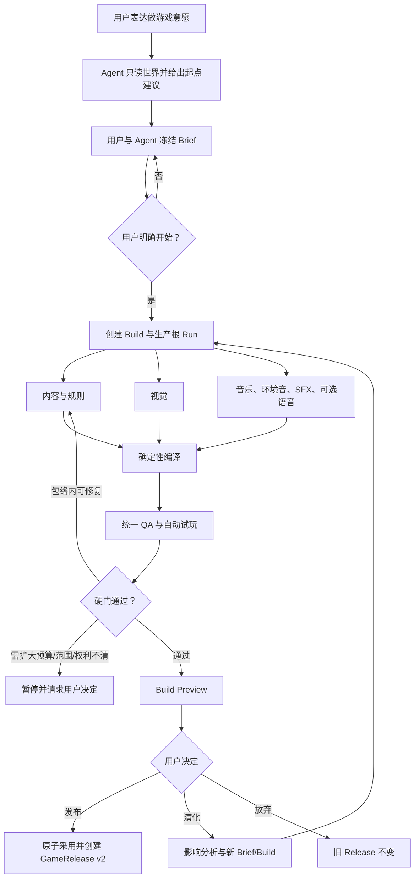
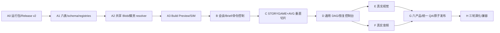

# GAME-PROD-1 · 用户驱动游戏生产流程施工蓝图 V3

> 状态：`V3 · CONSTRUCTION BLUEPRINT`
>
> 日期：2026-08-21
>
> 依据：V1 产品方案 → V2 施工闭合 → [`V2 反向评审`](./GAME-PRODUCTION-PIPELINE-V2-REVIEW.md)
>
> 权威性：从本版开始，V1/V2 中与 V3 冲突的表数量、Blob、Preview、Release、命令幂等和施工顺序均以 V3 为准。
>
> 完成边界：V3 是可施工蓝图，不是实现证明。只有 §24 的证据全部存在，才能把 GAME-PROD-1 标为完成。

## 0. 最终裁决

V3 保留 V1/V2 的用户流程，但调整基础架构：

1. 新增六张生产表，不再坚持 V1 的“五张最小表”；第六张持久命令表用于跨刷新/多标签幂等；
2. 不新增 Build 专属物理 Blob 表，改为一个构建期和正式媒资共用的 `mediaBlobObjects`；
3. 新增 `GameRuntimePackageV2`，Preview 与 Release 共享同一冻结游戏包；
4. 新增向后兼容的 `GameReleaseManifestV2`，游戏内容不再要求预先存在于 source WorldRelease；
5. Player/SIM 只消费 `PlayableGameSource + GameMediaResolver`，不复制规则或直接假设正式媒资表；
6. 发布前所有外部调用、转码和 Blob 写入必须完成；最终事务只物化正式行、绑定 ready Blob 并冻结 Release；
7. 父子 Run 继续表示所有权，Plan/receipt 表示多依赖 DAG；
8. provider capability 由明确 adapter 声明。Agnes 的同一全局 Key 可按官方合同分别绑定文本与
   `agnes-image-2.1-flash` 图片能力，但不能据此推断为独立音乐/SFX 能力；
9. 商业候选的真实图片、音乐/SFX 必须由已配置真实 adapter 或有权利的现有/导入媒资完成；placeholder 不能冒充；
10. 先施工 RuntimePackage/Blob/Release/Preview 地基，再做用户会谈和生产 UI，避免把流程建在错误发布边界上。

## 1. 用户流程与介入点



### 1.1 必须由用户触发

- 表达做游戏或继续演化的意愿；
- 确认主角、起点、产品类型、规模、边界、媒资档位和预算；
- 明确开始；
- 扩大预算、改变冻结目标、允许新的外发数据类别或绑定新的外部服务；
- 正式发布；
- 新一轮演化；
- 权利/安全/重大兼容冲突的处理。

### 1.2 系统在授权包络内自主完成

- 拆 Plan/DAG、生成和验证候选；
- 内容/视觉/音频有限并行；
- 有界重试、候选选择、技术后处理和允许的 fallback；
- requirementKey 绑定、编译、QA、自动试玩和 Preview；
- 刷新恢复、预算结算、迟到响应隔离；
- 新一轮影响分析和未变 Artifact 的可验证复用。

用户不逐图、逐节点或逐音轨确认。只有系统无法在原授权包络内解决时才暂停。

## 2. 施工依赖顺序



V1 的 1A 从“先加五表”修正为：先证明运行包和发布方向可行，再落表。实现仍可在同一分支连续提交，但验证必须
按 A0→A3 顺序，不能先把 UI 接到未闭合的 v1 发布器。

## 3. 文件与唯一入口

新增目录：

```text
src/lib/game-production/
├─ types.ts                  # 六表、Brief、Plan、Build、Artifact 合同
├─ parsers.ts                # exact-key parser 和上限
├─ hash.ts                   # canonicalization-v2 与各 hash
├─ state-machine.ts          # Production/Build/Artifact 转移
├─ service.ts                # 用户命令唯一入口
├─ command-store.ts          # claim/CAS/idempotency
├─ consultation.ts           # 建议与 Brief 会谈用例
├─ planner.ts                # Plan 候选、验证和预算预留
├─ scheduler.ts              # durable DAG 调度
├─ artifact-store.ts         # Artifact 事务写入与 carried-forward
├─ media-provider-registry.ts
├─ media-blob-store.ts       # mediaBlobObjects + IndexedDB/OPFS
├─ media-resolver.ts         # Build/Release resolver
├─ product-adapters.ts       # 六产品 registry
├─ compiler.ts               # 纯确定性 Build compiler
├─ quality.ts                # Gate registry / receipt / join
├─ preview-source.ts         # Build Preview source
├─ adoption.ts               # 整包原子采用唯一入口
├─ evolution.ts              # 影响、复用和兼容
└─ lifecycle.ts              # delete/archive/GC/recovery

src/components/game-production/
├─ GameStartingPointPage.tsx
├─ GameProductionBriefPage.tsx
├─ GameProductionControlPage.tsx
├─ GameBuildPreviewPage.tsx
└─ GameProductionVersionsPage.tsx
```

禁止组件直接 import `db.game*`、`db.mediaBlobObjects` 或 provider adapter。所有业务写入从 `service.ts` 进入；所有正式
多表写入从 `adoption.ts` 进入。

## 4. 数据模型 V3

### 4.1 六张新增表

| 表 | 作用 | 生命周期 |
|---|---|---|
| `gameProductions` | 一个可多轮演化的生产根 | Work-owned；有 Release 时归档优先 |
| `gameProductionBriefs` | 不可变 Brief revision 和一次授权 | Production-owned |
| `gameProductionCommands` | 用户命令 claim、CAS、幂等结果 | Production-owned evidence |
| `gameBuilds` | 每轮 Build、Plan、manifest、QA、发布结果 | Production-owned |
| `gameBuildArtifacts` | 结构化或二进制产物的版本/来源/质量/权利 | Build-owned |
| `mediaBlobObjects` | Work 内共享的 content-addressed 物理二进制 | Work-owned shared infrastructure |

V2 的 `gameBuildArtifactBlobs` 被 `mediaBlobObjects` 取代。现有 `avgMediaBlobs` 保留，但升级为正式媒资到共享物理
对象的 link；旧 `data` 字段继续兼容。

### 4.2 `GameProductionRecordV1`

```ts
interface GameProductionRecordV1 {
  id?: number
  projectId: number
  worldId: number
  workId: number
  productionKey: string
  title: string
  status: GameProductionStatusV1
  stateRevision: number
  controlEpoch: number
  currentBriefRevision: number | null
  currentBuildNumber: number | null
  currentGameDefinitionId: number | null
  currentGameReleaseId: number | null
  lastErrorJson: string
  createdAt: number
  updatedAt: number
}
```

```text
++id, projectId, worldId, workId, &[workId+productionKey], status,
currentGameDefinitionId, currentGameReleaseId, updatedAt
```

Brief/Build current 指针用 revision/number，避免 Production→child 与 child→Production 的 import 循环。

### 4.3 `GameProductionBriefRecordV1`

```ts
interface GameProductionBriefRecordV1 {
  id?: number
  projectId: number
  worldId: number
  workId: number
  productionId: number
  revision: number
  parentRevision: number | null
  status: 'draft' | 'authorized' | 'superseded' | 'withdrawn'
  sourceWorldReleaseId: number
  sourceWorldContentHash: string
  userIntentSummary: string
  unresolvedJson: string
  estimateJson: string
  briefJson: string
  briefHash: string
  authorizedAt: number | null
  createdAt: number
}
```

```text
++id, projectId, worldId, workId, productionId, &[productionId+revision],
&[productionId+briefHash], [productionId+status], sourceWorldReleaseId, createdAt
```

内容字段写后不可改；authorize 只允许一次 CAS 填 `status/authorizedAt`。

### 4.4 `GameProductionCommandRecordV1`

```ts
interface GameProductionCommandRecordV1 {
  id?: number
  projectId: number
  worldId: number
  workId: number
  productionId: number
  commandId: string
  type: GameProductionCommandV1['type']
  payloadHash: string
  expectedStateRevision: number | null
  status: 'claimed' | 'succeeded' | 'failed' | 'abandoned'
  resultJson: string
  errorCode: string | null
  createdAt: number
  completedAt: number | null
}
```

```text
++id, projectId, worldId, workId, productionId, &[productionId+commandId],
[productionId+status], type, createdAt
```

`resultJson` 只含安全 refs/hash/状态，不复制 API Key、外部响应和大段用户内容。相同 ID 不同 payloadHash 永久拒绝。

### 4.5 `GameBuildRecordV1`

```ts
interface GameBuildRecordV1 {
  id?: number
  projectId: number
  worldId: number
  workId: number
  productionId: number
  buildNumber: number
  briefRevision: number
  briefHash: string
  parentBuildNumber: number | null
  sourceGameReleaseId: number | null
  status: GameBuildStatusV1
  resumeState: GameBuildStatusV1 | null
  stateRevision: number
  controlEpoch: number
  planRevision: number
  planJson: string
  planHash: string
  budgetLedgerJson: string
  manifestJson: string
  manifestHash: string
  packageHash: string
  previewManifestJson: string
  previewHash: string
  qualityReportJson: string
  qualityReportHash: string
  compatibilityJson: string
  rootTerminalReceiptHash: string | null
  adoptionIntentHash: string | null
  adoptedGameDefinitionId: number | null
  releasedGameReleaseId: number | null
  failureJson: string
  authorizedAt: number
  startedAt: number | null
  completedAt: number | null
  createdAt: number
  updatedAt: number
}
```

```text
++id, projectId, worldId, workId, productionId, &[productionId+buildNumber],
[productionId+status], sourceGameReleaseId, packageHash, previewHash,
releasedGameReleaseId, updatedAt
```

Build 不再保存 `rootRunId`，避免与 `AgentRun.gameBuildId` 双向 remap。根 Run 由 `gameBuildId` 查询，Build 只冻结终端
receipt hash。

### 4.6 `GameBuildArtifactRecordV1`

```ts
interface GameBuildArtifactRecordV1 {
  id?: number
  projectId: number
  worldId: number
  workId: number
  buildId: number
  artifactKey: string
  requirementKey: string | null
  version: number
  kind: GameBuildArtifactKindV1
  mediaKind: AvgMediaKind | null
  status: GameBuildArtifactStatusV1
  producerRunId: number | null
  producerReceiptHash: string | null
  controlEpoch: number
  inputHash: string
  contentHash: string
  payloadJson: string
  metadataJson: string
  qualityJson: string
  rightsJson: string
  blobObjectId: number | null
  mimeType: string | null
  byteSize: number
  parentArtifactHash: string | null
  carriedFrom: { buildNumber: number; artifactKey: string; version: number; contentHash: string } | null
  createdAt: number
  updatedAt: number
}
```

`carriedFrom` 实际存为 exact JSON，不使用第二个自引用 ID，避免导入循环。

```text
++id, projectId, worldId, workId, buildId, &[buildId+artifactKey+version],
[buildId+status], [buildId+requirementKey], producerRunId, blobObjectId, contentHash, createdAt
```

### 4.7 `MediaBlobObjectRecordV1`

```ts
interface MediaBlobObjectRecordV1 {
  id?: number
  projectId: number
  worldId: number
  workId: number
  contentHash: string
  mimeType: string
  byteSize: number
  backend: 'indexeddb' | 'opfs'
  storageState: 'pending-write' | 'ready' | 'pending-delete' | 'corrupt'
  data: ArrayBuffer | null
  opfsPath: string | null
  leaseOwner: string | null
  leaseExpiresAt: number | null
  lastVerifiedAt: number | null
  createdAt: number
  updatedAt: number
}
```

```text
++id, projectId, worldId, workId, &[workId+contentHash], storageState,
leaseExpiresAt, byteSize, updatedAt
```

ready 不允许同时 `data` 和 `opfsPath` 都为空；IndexedDB 后端必须有 data，OPFS 后端必须有受控路径。

## 5. 现有表的向后兼容扩展

### 5.1 `AvgMediaBlob`

```ts
interface AvgMediaBlob {
  // existing owner fields...
  mediaAssetId: number
  blobObjectId?: number | null
  data?: ArrayBuffer | null
  createdAt: number
}
```

新写入必须使用 blobObjectId；旧行只有 data 仍可读。迁移服务按 contentHash 创建/复用 mediaBlobObjects 后 CAS 写
blobObjectId，成功后可以保留 data，直到显式“压缩旧存储”操作；不在 schema upgrade 中复制大文件。

### 5.2 `AgentRunRecord`

增加 `gameBuildId?: number | null` 和索引。workId/simulationSessionId owner 二选一规则不变；gameBuildId 只是业务关联，
不是第三 owner。root Run 满足 parentRunId=null，子 Run 与同一 Build 绑定。

### 5.3 `SimulationSession`

增加：

```ts
gameBuildId?: number | null
runtimeSourceHash?: string | null
```

六种正式游戏满足 `gameReleaseId XOR gameBuildId`；v62 legacy session 可以都为空。Build 删除级联其 Preview Session；
Release 删除仍保持旧 setNull 行为和不可变证据检查。

### 5.4 `GameDefinition`

`sourceMappingVersion` 支持 1/2，`sourceSelectionJson` parser 按版本分派。V2 selection 覆盖所有 `GameProductType`；
旧 V1 definition 不自动重写。

### 5.5 `GameRelease`

行结构不变，`manifestJson` 支持 v1/v2。`contentHash` 始终是对应完整 release manifest 的 canonical hash；v1/v2
canonicalization 必须按 manifest version 分派。

## 6. DB v63 迁移

实现时若当前最高版本仍为 62，则使用 v63；若主线已经增长，使用当前最高+1，并同步本文与测试，禁止复用版本号。

v63 stores：

```ts
gameProductions: '++id, projectId, worldId, workId, &[workId+productionKey], status, currentGameDefinitionId, currentGameReleaseId, updatedAt'
gameProductionBriefs: '++id, projectId, worldId, workId, productionId, &[productionId+revision], &[productionId+briefHash], [productionId+status], sourceWorldReleaseId, createdAt'
gameProductionCommands: '++id, projectId, worldId, workId, productionId, &[productionId+commandId], [productionId+status], type, createdAt'
gameBuilds: '++id, projectId, worldId, workId, productionId, &[productionId+buildNumber], [productionId+status], sourceGameReleaseId, packageHash, previewHash, releasedGameReleaseId, updatedAt'
mediaBlobObjects: '++id, projectId, worldId, workId, &[workId+contentHash], storageState, leaseExpiresAt, byteSize, updatedAt'
gameBuildArtifacts: '++id, projectId, worldId, workId, buildId, &[buildId+artifactKey+version], [buildId+status], [buildId+requirementKey], producerRunId, blobObjectId, contentHash, createdAt'
avgMediaBlobs: '++id, projectId, worldId, workId, &mediaAssetId, blobObjectId'
simulationSessions: '++id, projectId, worldGroupId, worldId, workId, worldReleaseId, gameReleaseId, gameBuildId, narrativeModuleId, kind, status, parentSessionId, updatedAt'
agentRuns: '++id, projectId, workId, simulationSessionId, gameBuildId, worldGroupId, conversationId, parentRunId, &[parentRunId+parentRelation], status, updatedAt'
```

Upgrade 只为旧 AgentRun/SimulationSession/AvgMediaBlob 补 null 字段，不迁移二进制、不猜 Production、不把历史候选
标成 Build。新表为空。

## 7. PROJECT_TABLES 精确登记

### 7.1 顺序

`gameProductions → gameProductionBriefs → gameProductionCommands → gameBuilds → mediaBlobObjects → gameBuildArtifacts`。
mediaBlobObjects 在 Artifact 和 avgMediaBlobs 之前建立 import map。

### 7.2 refs/remap

| source | refs | export remap |
|---|---|---|
| works | id→六张新增表按 workId cascade | 既有 |
| worlds | id→六张新增表按 worldId cascade | 既有 |
| gameProductions | id→Brief/Command/Build cascade | worldId/workId、current Definition/Release |
| Brief | id 无 child 物理 ref；Build 用 productionId+briefRevision/hash 验证 | productionId、sourceWorldReleaseId |
| Command | 无向外 refs | productionId |
| Build | id→Artifact、Preview Session、Build AgentRun cascade | productionId、source/released GameRelease、adopted Definition |
| mediaBlobObjects | id→Artifact.blobObjectId keep；id→AvgMediaBlob.blobObjectId keep | worldId/workId；portable binary integrity |
| Artifact | 无 self ID refs | buildId、producerRunId、blobObjectId |
| AgentRun | 既有 refs | gameBuildId→gameBuilds |
| AvgMediaBlob | 既有 mediaAsset remap | blobObjectId→mediaBlobObjects |
| SimulationSession | 既有 refs | gameBuildId→gameBuilds |

`keep` 的共享 Blob 删除只允许 `collectUnreferencedMediaBlobObjects()`；该服务扫描 Artifact、AvgMediaBlob 和有效 lease。

### 7.3 memory classification

- Production/Brief：editable（用户授权的生产工作数据）；
- Command/Run/QA receipt：evidence；
- Build Artifact：candidate 或 evidence，按 kind；
- mediaBlobObjects：derived-local，导出时携带、工作区文档不镜像；
- Preview Session/Event：runtime。

分类必须使用现有 `PROJECT_TABLES.memoryClassification`，不再建第二套枚举。

## 8. World source V2

```ts
interface WorldGameSourceSelectionV2 {
  schema: 'storyforge.world-game-source'
  version: 2
  productType: GameProductType
  worldContentHash: string
  narrativeModuleExportIds: number[]
  characterExportIds: number[]
  characterRelationExportIds: number[]
  importantLocationExportIds: number[]
  artifactExportIds: number[]
  codexEntryExportIds: number[]
  storyArcExportIds: number[]
  avgMediaAssetExportIds: number[]
  productSource: ProductSpecificWorldSourceV1 | null
}
```

所有 ID 均是所选 WorldRelease 的 portable exportId，不接受本地 Dexie ID。`productSource` 是 exact tagged union，
分别描述互动角色、冒险地点/物品、模拟 issue、开放世界 region 等额外选择。

## 9. GameRuntimePackageV2

```ts
interface GameRuntimePackageV2 {
  schema: 'storyforge.game-runtime-package'
  version: 2
  productType: GameProductType
  definition: {
    gameKey: string
    title: string
    description: string
    enabledCapabilities: string[]
    rulesetVersion: number
    initialVariables: Record<string, unknown>
  }
  sourceWorld: {
    contentHash: string
    selection: WorldGameSourceSelectionV2
  }
  narrative: GameReleaseManifestV1['narrative']
  interaction?: InteractionGameReleaseManifestV1['interaction']
  adventure?: AdventureContentV1
  presentation?: AvgPresentationContentV1 & { assets: FrozenRuntimeMediaAssetV2[] }
  simulation?: NarrativeSimulationContentV1
  openWorld?: OpenWorldContentV1
}

interface FrozenRuntimeMediaAssetV2 extends FrozenAvgMediaAsset {
  blobContentHash: string
}
```

parser 依据 productType 强制准确模块组合，与现有六产品 release validator 相同。RuntimePackage 不含 local row ID、
Blob bytes、provider Key、Build ID 或 Release ID。

## 10. Release v2、Preview 和 hash

### 10.1 `GameReleaseManifestV2`

```ts
interface GameReleaseManifestV2 {
  schema: 'storyforge.game-release'
  version: 2
  productType: GameProductType
  sourceWorldRelease: { contentHash: string }
  runtimePackage: GameRuntimePackageV2
  packageHash: string
  productionProvenance: {
    productionKey: string
    buildNumber: number
    buildManifestHash: string
    rootTerminalReceiptHash: string
  } | null
}
```

GameRelease row 的 `worldReleaseId` 绑定真实 source WorldRelease，manifest 内只保存 portable contentHash。

### 10.2 `GameBuildPreviewManifestV1`

```ts
interface GameBuildPreviewManifestV1 {
  schema: 'storyforge.game-build-preview'
  version: 1
  productionKey: string
  buildNumber: number
  buildManifestHash: string
  runtimePackage: GameRuntimePackageV2
  packageHash: string
  mediaBindings: Array<{ assetKey: string; artifactKey: string; blobContentHash: string }>
  fallbackSummary: string[]
  previewHash: string
}
```

### 10.3 canonical hash

统一使用 `storyforge-canonical-json-v2`：对象 key Unicode code-point 顺序、数组保序、拒绝 undefined/NaN/Infinity、
数字规范化、字符串 NFC；parser 先验证再 hash。

| hash | 覆盖范围 | 相等关系 |
|---|---|---|
| `packageHash` | 完整 RuntimePackageV2 | Preview 与发布后的 Release 必须相等 |
| `previewHash` | buildManifestHash + packageHash + mediaBindings + fallback | 只绑定 Preview source |
| `buildManifestHash` | Brief/source/Plan/Artifacts/QA/budget/compat/packageHash | 不等于 packageHash |
| `release.contentHash` | 完整 GameReleaseManifest v1/v2 | v2 不要求等于 packageHash；manifest.packageHash 必须匹配 |

v1 Release adapter 将 `packageHash=release.contentHash`，保持旧 session/sourceHash 行为。v2 Session 的
`runtimeSourceHash=packageHash`。

## 11. Playable source 与媒资 resolver

```ts
type PlayableGameSourceV1 =
  | { kind: 'release'; gameReleaseId: number }
  | { kind: 'build'; gameBuildId: number; expectedPreviewHash: string }

interface ResolvedPlayableGamePackageV2 {
  source: PlayableGameSourceV1
  runtimePackage: GameRuntimePackageV2
  packageHash: string
  runtimeSourceHash: string
  mediaResolver: GameMediaResolverV1
}

interface GameMediaResolverV1 {
  preload(input: { assetKeys: string[]; maximumBytes: number }): Promise<ResolvedMediaCatalogV1>
  read(assetKey: string): Promise<Blob>
  dispose(): void
}
```

Player 调用 resolver，不再 import `readAvgReleaseMediaDataUrl()`。Release resolver 通过 AvgMediaAsset→AvgMediaBlob→
mediaBlobObject/legacy data；Build resolver 通过 preview binding→accepted Artifact→mediaBlobObject。两者都校验 metadata、
hash、size 和 MIME，并统一管理 object URL/revoke。

`createPlayableGameSession()` 为唯一新入口；`createReleasedGameSession()` 保留为 release wrapper。Build session 写
gameBuildId/runtimeSourceHash，Release session 写 gameReleaseId/runtimeSourceHash。

## 12. 原子发布

### 12.1 两阶段但一个正式提交

**Prepare（可恢复、未写正式游戏）**

1. 验证 Build/Brief/source/root receipt/QA；
2. 校验所有 accepted media object ready；
3. 对每个使用对象写短 lease（默认 5 分钟）；
4. 编译 RuntimePackageV2、packageHash、adoption intent；
5. 不做网络，不改 GameDefinition/Release。

**Commit（一个 Dexie rw transaction）**

1. claim publish command，比较 Production/Build revision、manifestHash、intentHash；
2. 重验 lease、media metadata 和 source WorldRelease；
3. 产品 adapter 在当前事务物化 Narrative/Definition/专项模块；
4. 物化 AvgMediaAsset 和 AvgMediaBlob link（blobObjectId），不复制 bytes；
5. 构建并解析 GameReleaseManifestV2；要求 canonical RuntimePackage 等于 Build package，packageHash 相等；
6. 写 GameRelease、Build released 结果、Production current pointers、command receipt；
7. 正式 link 存在后在同事务清除 lease；
8. 任一失败全部正式行回滚，Build 仍 preview-ready/release-ready。

Commit 中禁止 fetch、模型调用、转码、OPFS 文件写、用户弹窗和不受控 await。

### 12.2 发布代码结构

```ts
prepareGameBuildPublication()
adoptGameBuildAndPublish()
  └─ db.transaction('rw', productAdapter.transactionTables(...), async () => {
       claimCommandInCurrentTransaction()
       productAdapter.adoptWithinTransaction()
       freezeGameReleaseV2InCurrentTransaction()
       finalizeBuildPublicationInCurrentTransaction()
     })
```

现有 `publishStoryGameDraft()` 不用于 Production。旧手工路径保留；后续可选择改用 v2 freezer，但不是 1A 阻塞。

## 13. 用户命令、事务 claim 与状态机

### 13.1 唯一公共命令

```ts
type GameProductionCommandV1 =
  | {
      type: 'create-intent'
      commandId: string
      productionKey: string
      worldReleaseId: number
      userText: string
    }
  | {
      type: 'save-brief-revision'
      commandId: string
      expectedStateRevision: number
      parentRevision: number | null
      brief: GameProductionBriefV3
    }
  | {
      type: 'authorize-start'
      commandId: string
      expectedStateRevision: number
      briefRevision: number
      briefHash: string
      authorizationNonce: string
    }
  | {
      type: 'pause'
      commandId: string
      expectedStateRevision: number
      reason: string
    }
  | {
      type: 'resume'
      commandId: string
      expectedStateRevision: number
    }
  | {
      type: 'stop'
      commandId: string
      expectedStateRevision: number
      retention: 'keep-build' | 'discard-unreleased'
    }
  | {
      type: 'resolve-blocker'
      commandId: string
      expectedStateRevision: number
      blockerKey: string
      resolution: GameProductionBlockerResolutionV1
    }
  | {
      type: 'request-preview'
      commandId: string
      expectedStateRevision: number
      buildNumber: number
    }
  | {
      type: 'publish'
      commandId: string
      expectedStateRevision: number
      buildNumber: number
      expectedManifestHash: string
      adoptionIntentHash: string
    }
  | {
      type: 'evolve'
      commandId: string
      expectedStateRevision: number
      base: GameEvolutionBaseV1
      userText: string
      affectedLanes: Array<'content' | 'product' | 'visual' | 'audio' | 'world-source'>
    }
  | {
      type: 'archive'
      commandId: string
      expectedStateRevision: number
      reason: string
    }
  | {
      type: 'restore'
      commandId: string
      expectedStateRevision: number
    }
```

组件、快捷入口、Agent 和恢复器都只能调用：

```ts
executeGameProductionCommand(scope, productionIdOrCreateInput, command)
```

`create-intent` 在同一事务先以 `[workId+productionKey]` get/add Production，再以新 Production id claim command；因此
重复双击不会产生两个 Production。`save-brief-revision` 是会谈草稿落盘，不等于生产授权；只有
`authorize-start` 能创建 Build 和生产根 Run。

### 13.2 claim/CAS 算法

每条命令先计算 exact parser 后的 `payloadHash`。控制命令只在一个短 Dexie 事务内执行：

```text
transaction begin
  1. 读取或创建 Production，校验 WorkspaceScope
  2. get [productionId+commandId]
     - 同 payloadHash + succeeded/failed：返回既有 receipt
     - 不同 payloadHash：拒绝 command-id-payload-conflict
  3. add status=claimed；唯一索引冲突后重新读取，不盲重试
  4. 比较 expectedStateRevision（create-intent 例外）
  5. 校验状态转移和命令前置
  6. 写 Brief/Build/指针/epoch 等领域变更
  7. 写安全 resultJson，status=succeeded，completedAt
  8. commit
transaction end
```

预期拒绝可以在独立短事务写 `failed` receipt；异常导致事务回滚时不会遗留半个 claimed command。发布的耗时
Prepare 不放在此事务中；Prepare 产生 `adoptionIntentHash` 后，`publish` 命令的 Commit 再做同一套 claim/CAS。

`BroadcastChannel('storyforge-game-production')` 只用于通知其他标签刷新投影，不参与互斥。测试必须真实打开两个
Dexie 连接同时提交相同 revision，证明只有一个事务成功。

### 13.3 状态转移

Production：

```text
consulting -> brief-ready -> producing -> preview-ready -> released
                  |             |              |
                  +----------> paused <--------+
                                  |
                                  +-> stopped / failed
released -> consulting（新演化 Brief；旧 Release 不变）
consulting/brief-ready/preview-ready/released/stopped/failed -> archived -> 原状态
```

Build：

```text
draft -> authorized -> planning -> building -> integrating -> validating
      -> preview-ready -> release-ready -> released
planning/building/integrating/validating -> paused -> resumeState
任意未发布态 -> recovery-required / failed / cancelled
```

- `pause` 和 `stop` 都递增 Production 与当前 Build 的 `controlEpoch`；
- `pause` 不再领取新任务，已在飞请求尽力 abort，迟到结果只写 Run orphan evidence；
- `resume` 不沿用未验签响应，只重用 hash/receipt 完整的 Artifact；
- `stop(keep-build)` 保留 Build 与证据，`discard-unreleased` 只标 cancelled/pending-delete，不同步硬删二进制；
- `archive` 不是 stop：制作中/暂停中必须先 stop；归档保存原 Production/Build 状态和原错误证据，`restore` 以新
  state revision/control epoch 恢复，不删除或重写 Brief、Build、Release、receipt、媒资和存档引用；
- `released` Build、GameRelease 和既有存档不可被 stop 回滚；
- 修改冻结 Brief、来源、预算上限或外发类别必须新建 Brief revision；运行中先 pause。

### 13.4 错误码

稳定错误码至少包括：

```text
production-not-found
production-state-conflict
command-id-payload-conflict
invalid-state-transition
brief-unresolved
brief-not-authorized
source-stale
capability-unbound
cost-authorization-required
storage-budget-insufficient
control-epoch-stale
dependency-receipt-stale
quality-hard-gate-failed
rights-incomplete
preview-stale
publication-intent-stale
publication-transaction-failed
```

错误 UI 可以本地化，但 receipt 保存稳定 code，不保存完整 provider 原文或 Key。

## 14. 会谈、Brief、能力要求与授权

### 14.1 建议不是替用户决定

起点建议读取已选 WorldRelease 的登记上下文，只给 3～6 个可解释选项，例如：当前主线、一个支线、某个角色、
某段历史事件或自定义起点。每个建议包含 `sourceRefs`、主角候选、开场冲突、适合产品、规模和风险；不得把“当前
最显眼的主线”自动当成用户决定。

建议与会谈允许使用文本模型，费用进入 `consultationBudget`。用户说“我想把这里做成游戏”授权的是会谈分析，
不是生产。未执行 `authorize-start` 时必须满足：

- Build 数量为 0；
- 没有内容/图片/音频生产 Run；
- 没有媒体 provider 请求；
- 正式游戏表零写入；
- UI 明示“尚未开始制作”。

### 14.2 `GameProductionBriefV3`

```ts
interface GameProductionBriefV3 {
  schema: 'storyforge.game-production-brief'
  version: 3
  source: {
    worldReleaseId: number
    worldContentHash: string
    selection: WorldGameSourceSelectionV2
    startingPoint: GameStartingPointV1
  }
  intent: {
    productType: GameProductType
    playerRole: string
    protagonistRefs: string[]
    openingSituation: string
    coreExperience: string[]
    requiredFacts: string[]
    forbiddenChanges: string[]
    contentBoundaries: string[]
    tone: string[]
  }
  scale: GameProductionScaleV1
  media: GameProductionMediaProfileV1
  consultationBudget: GameConsultationBudgetV1
  productionBudget: GameProductionBudgetV3
  qualityProfile: 'prototype' | 'internal' | 'commercial-candidate'
  capabilityRequirements: ProviderCapabilityRequirementV1[]
  externalDataPolicy: GameProductionExternalDataPolicyV1
  fallbackPolicy: GameProductionFallbackPolicyV1
  completionContract: GameProductionCompletionContractV1
  unresolvedDecisionKeys: string[]
}
```

parser 要求 exact key、数组/字符串/字节/次数上限、finite number、唯一 stable key 和全部枚举。`briefHash` 覆盖解析后
规范对象；本地绑定、API Key、预设 id 和 UI 展开状态不进入 hash。

### 14.3 可便携能力要求

```ts
interface ProviderCapabilityRequirementV1 {
  requirementKey: string
  mediaClass: 'text' | 'image' | 'music' | 'sfx' | 'voice' | 'transcode'
  operation: string
  adapterFamily: string
  minimumCapabilityVersion: string
  allowedDataClasses: string[]
  maximumRequestCost: number | null
  maximumTotalCost: number | null
  rightsPolicyVersion: string
  capabilityHash: string
  required: boolean
}
```

Brief 不保存 localStorage preset id。运行时 `resolveProductionCapabilities()` 将 portable requirement 绑定到本机配置并
生成 `ProviderBindingReceiptV1`：adapter id/version、非敏感 provider/model identity、execution location、capability hash、
绑定时间和 receipt hash。凭证只留在现有本机配置 store 或安全 gateway，不进入 Brief/Build 导出。

文本任务默认复用 `useAIConfigStore` 当前全局配置和既有任务路由；不会再出现生产页面要求重复填写同一 Agnes Key。
全局 provider 为 Agnes 时，图片 adapter 复用同一配置和同一个 Key，并自动切换到 `agnes-image-2.1-flash`，不要求
用户再次绑定图片凭据。音乐/SFX 等 Agnes 当前公开合同未覆盖的能力才要求独立音频 relay 或已有/导入媒资，而且必须在
用户选择媒资档位时一次说明，不得等到流水线中途逐项索要。

### 14.4 授权包络

`authorize-start` 前必须展示并冻结：

- 主角、起点、产品类型、规模和核心体验；
- 预计文本/图片/音乐/SFX/语音数量区间；
- consultation 已发生费用与 production 最大调用/token/金额/时长/存储预算；
- 将发往哪些 provider 的哪些数据类别；
- fallback 会降低什么效果；
- 哪些情况会自动重试，哪些会暂停请求用户；
- `prototype/internal/commercial-candidate` 的完成含义。

用户的一次“开始制作”授权整个冻结包络。包络内的候选选择、修复和绑定由系统自主完成；扩大总额、增加外发类别、
改真人参考/声音、改变主角/起点/产品类型或放宽硬权利门必须再次请求用户。

## 15. Run 所有权树、任务 DAG 与有界调度

### 15.1 Plan 合同

`GameProductionPlanV3` 保留 V2 的任务形状，并强制：

```ts
interface GameProductionPlanTaskV3 {
  taskKey: string
  lane: 'planning' | 'content' | 'visual' | 'audio' | 'integration' | 'qa'
  kind: string
  skillId: string | null
  executionMode: 'deterministic' | 'model' | 'media-provider' | 'human-import'
  dependsOn: string[]
  requiredReceipts: Array<{ taskKey: string; receiptHash: string | null }>
  inputArtifactKeys: string[]
  outputArtifactKeys: string[]
  requirementKeys: string[]
  capabilityRequirementKeys: string[]
  concurrencyGroup: string
  subjectLockKeys: string[]
  priority: number
  budgetReservation: GameTaskBudgetReservationV1
  maxAttempts: number
  timeoutMs: number
  failurePolicy: 'fail-build' | 'pause' | 'fallback' | 'skip-optional'
  fallbackTaskKey: string | null
  acceptanceGateIds: string[]
  reuse: GameArtifactReuseDecisionV1 | null
}
```

Plan parser/validator 必须证明 exact-key、无环、全部依赖存在、输出唯一所有者、required requirement 全覆盖、预算预留
不超 Brief、并发不超 registry、join 闭包包含全部硬门、fallback 自身可达且不循环、复用证据完整。

### 15.2 Run 与 DAG 分工

- `AgentRun.parentRunId/parentRelation` 是所有权和预算树；
- `AgentRun.gameBuildId` 让 Build 可查询完整 Run 集；
- `Plan.tasks[].dependsOn` 是多前驱 DAG；
- `requiredReceipts` 是实际满足的边；
- `parentRelation=task:<taskKey>` 在一个根 Run 内唯一；
- root terminal receipt 冻结 planHash、全部 required child receipt、预算 settlement 和 controlEpoch。

所有模型或 provider 任务必须经过已登记 Skill/Run Contract 和 durable Harness。模型原始输出先成为
`CreativeArtifact`/Run evidence；parser、gate 和 Brief 的 delegated authorization 通过后，才写 accepted
`gameBuildArtifacts`。确定性 compiler 不接收未验签 provider response。

### 15.3 调度循环

每轮只能执行一个确定性领取周期：

1. 读取 Build、不可变 Plan、root/child projection；
2. 在事务中 CAS 领取 ready task，比较 Build `stateRevision/controlEpoch`；
3. 重验依赖 receipt、输入 Artifact hash、能力绑定、预算和 subject lock；
4. 预留 provider slot 与金额/token/秒预算；
5. 创建或恢复唯一 child Run；
6. 调用一个已登记 Skill/adapter，传 AbortSignal；
7. exact parser + contract verifier + acceptance gate；
8. 事务写 Artifact/receipt/settlement，释放 slot；
9. 重新投影 ready 集；无 ready task 时只可能 join、blocked、paused 或 terminal。

默认上限：全 Build 同时 3 个 cost-bearing task；同一文本 provider 2；同一图片/音频 provider 1；同一人物锚点、
requirementKey、artifactKey 各 1。provider registry 的更低上限优先，Brief 只能降低，不能提高硬上限。

### 15.4 恢复与迟到结果

- 刷新后从 Build/Plan、AgentRun checkpoint、terminal receipt 和 Artifact hash 重建，不从组件 state 恢复；
- 相同 task input/idempotency key 不再次计费；
- pause/stop 递增 epoch 后，所有旧 epoch 输出只能记录为 `orphaned`；
- provider 声称取消不等于未计费，预算按实际返回或 unknown 最坏值结算；
- retry 复用同一 child Run generation/attempt，不创建无法归因的兄弟 Run；
- `maxAttempts` 用尽后严格执行 failurePolicy，不隐藏第三次调用或自动换 provider；
- recovery-required 必须列出缺失 capability、stale receipt、存储、预算或内容问题以及可选恢复动作。

## 16. 媒体 provider、真实 adapter 与执行安全

### 16.1 中央合同

```ts
interface GameMediaProviderAdapterV1 {
  capability: GameMediaProviderCapabilityV1
  estimate(request: GameMediaRequestV1): Promise<GameMediaEstimateV1>
  generate(
    request: GameMediaRequestV1,
    transport: MediaProviderTransportV1,
    signal: AbortSignal,
  ): Promise<GameMediaCandidateV1[]>
  parseAndVerify(candidate: unknown): Promise<GameMediaCandidateV1>
}

interface MediaProviderTransportV1 {
  executionLocation: 'browser-direct' | 'local-relay' | 'trusted-relay'
  request(input: RedactedMediaTransportRequestV1, signal: AbortSignal): Promise<unknown>
}
```

adapter 不读取 Zustand store，不持久化 Key，不自行重试。binding service 负责从本机配置解析 transport；scheduler 负责
次数、预算和取消；adapter 只实现一个官方 API 方言。

### 16.2 首批 adapter id

| adapter id | 能力 | 交付边界 |
|---|---|---|
| `fixture.media.v1` | 测试图片/音频 | 只允许 test/development，发布硬拒绝 |
| `existing-project-media.v1` | 复用有权利且 hash 完整的正式媒资 | 可商业，必须重跑新 profile QA |
| `local-import-media.v1` | 使用用户预先导入的媒资 | 可商业，依 rights/QA；生产中不逐项确认 |
| `procedural-audio.v1` | 短 UI/SFX/环境底 | prototype/internal；不冒充商业音乐/语音 |
| `agnes.image-2.1-flash.v1` | 图片 generate/edit | 复用全局 Agnes 配置；官方 `/v1/images/generations`；Base64 响应白名单与字节验证 |
| `openai.gpt-image-2.v1` | 图片 generate/edit | 官方 Images API `/v1/images/generations`/edits；响应白名单解析 |
| `elevenlabs.sound-effects.v2` | SFX/环境音 | 官方 `/v1/sound-generation`；MP3、时长/loop 参数验签 |
| `elevenlabs.music.v2` | 音乐 | 官方 `/v1/music`；prompt/plan、时长、instrumental/seed 元数据验签 |

语音不复用 music/sfx adapter。首版可以没有自动语音，但 Brief 必须明确 `voice=off/imported/blocked`；若增加 TTS 或
克隆，必须另立 adapter、consent receipt、文本/字幕对齐和权利门。

官方合同基线：

- Agnes Image 2.1 Flash：<https://agnes-ai.com/en/docs/agnes-image-21-flash>
- Agnes API Overview：<https://agnes-ai.com/en/docs/overview>
- OpenAI GPT Image 2：<https://developers.openai.com/api/docs/models/gpt-image-2>
- OpenAI image streaming：<https://platform.openai.com/docs/api-reference/images-streaming/image_generation/partial_image>
- ElevenLabs Sound Effects：<https://elevenlabs.io/docs/api-reference/text-to-sound-effects/convert>
- ElevenLabs Music：<https://elevenlabs.io/docs/api-reference/music/compose?explorer=true>
- ElevenLabs authentication：<https://elevenlabs.io/docs/api-reference/authentication>

版本升级先新增 adapter version/recorded fixture；不能在同 id 下静默改变请求或 hash 语义。

### 16.3 密钥与网络边界

- Agnes 官方合同明确同一 API Key 可调用文字与图片模型：文字保持当前模型，图片固定切换
  `agnes-image-2.1-flash` 与 `/v1/images/generations`，Production 不复制 Key、不新增 Key 输入；
- 图片请求使用官方 `size`、顶层 `return_base64=true`，并显式设置 `extra_body.response_format=b64_json`，避免供应商
  返回受 CORS 限制的临时 URL；当前 1K 的 16:9 输出为 1312×736、3:4 输出为
  864×1152，分别覆盖默认背景和立绘尺寸下限，响应仍以真实解码尺寸而不是请求标签作为通过依据；
- `character-pose/character-expression` 额外显式请求 `background=transparent` 与 `output_format=png`；该请求标签不能
  代替浏览器逐像素 alpha 探针，实际没有透明像素仍以 `image-character-alpha-missing` 阻断商业发布；
- Agnes 若返回“棋盘格假透明”，视觉泳道使用 `storyforge.character-alpha.edge-connected.v1` 处理：只从画布边缘出发
  移除与主背景色簇连通的像素，并以小半径形态学 opening 清除不与边缘连通的细网格残片；它不对主体内部白色
  服装或纸张做全局色键。处理会拒绝异常移除比例，重新编码 PNG、重算 blob hash，并把算法 id、是否改写与移除比例写入
  Artifact quality；Agnes 指令同时禁止绘制棋盘格并以纯品红单色键作为降级，最终仍由玩家浏览器逐像素 alpha 探针裁决；
- 媒资规划模型只负责提出画面需求，不拥有角色合同权威；`characterAnchorRefs` 必须指向 Brief 冻结角色，最终
  `hardConstraints` 由冻结 Brief 机械派生并覆盖模型建议；没有角色锚点时模型单独输出的 hard constraints 会归零，
  不能凭空创建半份角色合同。这样既防止仅美术演化因模型漏写或错位约束而阻塞，也防止模型放宽约束；
- `character-pose/character-expression` 的模型 prompt 只允许主体、服饰、姿态与表情；角色 provider 入口会在冻结前
  机械截断“背景/场景/环境/远景/近景”等描述，Agnes 角色提示由这份隔离主体描述与 Brief 权威合同重新组装，避免把
  规划模型写入的场景作为第二层背景烘焙进立绘；
- 同一清单已有独立立绘时，未携带角色锚点的 `background` 由执行器强制标记为无人物空景，禁止人物、肖像、人形、
  倒影和剪影，避免背景生成意外画出第二个主角再与前景立绘叠加；
- Agnes 响应根对象仅额外接纳已实测的 `background/output_format/quality/size` 有界字符串元数据；`b64_json`
  兼容有界的标准/URL-safe Base64、ASCII 换行、缺省 padding，以及声明为 PNG/JPEG/WebP 的 Data URI，解码后仍以
  真实 magic bytes、尺寸、hash 与大小上限复验；其他未知字段、非字符串元数据、伪 Base64、伪 MIME 和真实字节
  尺寸不符仍硬拒绝；
- Agnes 即使请求 Base64 仍可能按官方另一种返回形态给出 `data[].url`；URL 回退只允许 Agnes、实测的
  `platform-outputs.agnes-ai.space` 或 `storage.googleapis.com` 的 HTTPS 地址，下载不带 Key、cookie 或 referrer，
  重定向后的最终 URL 再次校验，且完整
  签名 URL 不写入 Artifact/receipt，只保存 origin 与经真实字节计算的 hash；
- Build Preview 带指定存档进入 AVG 时，播放器先以 `openLibrary=true` 载入目录，再且仅再显式选择一次目标存档；禁止
  先自动选中任意旧存档又立刻二次选择，因为这会释放首个 resolver 并让多媒资预加载出现只成功第一项的竞态；
- 商业 Build 在制作页提供显式“开始/停止 30 分钟商业性能验收”：应用内实验室加载当前 Build 的冻结媒资，先执行
  至少 20 次真实 DOM 选择与缓存场景双帧渲染，再每 5 秒继续切换、每 30 秒读取浏览器堆内存，覆盖 5 分钟 warmup
  到 30 分钟终点；中途停止不写通过回执，完成后以 `storyforge.in-app-browser-performance-lab` verifier 绑定当前
  packageHash/previewHash。Playwright CDP 商业跑仍作为 CI 的独立第二条真实浏览器验证路径；
- `browser-direct` 仅复用用户已经选择并验证的本机浏览器 Agnes 配置；官方仍建议服务端持钥，因此共享部署或多人账号
  应切到 trusted relay，但本地纯前端工作区不能因此错误阻断同 Key 图片能力；
- ElevenLabs 明确要求 `xi-api-key` 且警告不要暴露在客户端，commercial profile 禁止 ElevenLabs browser-direct；
- Vite `/openai-proxy` 等仅是本机开发代理，不是生产安全边界，也不作为商业验收证据；
- commercial 图片可绑定已配置 Agnes browser-direct、trusted relay 或已完成的 imported/existing 媒资；独立 music/SFX
  仍需 trusted relay 或 imported/existing 媒资；
- relay 只接收 Brief 允许的数据类别、短期 capability token 和 request id，不接收整个项目导出；
- relay 返回 provider request id、模型、费用/usage、响应 hash 和时间，不返回/记录明文 Key；
- 本项目中的 provider binding 只保存 non-secret id 和 capability receipt。任何导出、Run、Artifact、日志都不得含 Key。

真实凭据不可用时，核心施工继续进行，但 UI 必须把所选 profile 精确标为 `capability-unbound`。prototype 可按 Brief
允许使用 fallback；commercial-candidate 不能用 fixture、静音或占位图伪装成完成。

### 16.4 请求安全与权利

每个请求先生成外发清单：provider/adapter、data class、portable refs、参考图 hash、文本摘要 hash、估算费用、用途、
retention 和 rights policy。超出 Brief 立即 pause。

- 参考图移除 EXIF/GPS，SVG/HTML/脚本/可执行内容拒绝；
- 真人换脸、未授权受保护角色仿制、未成年人性内容和默认声音克隆硬拒绝；
- provider filename/MIME/metadata 均视为不可信，按字节探测和白名单解码；
- 生成/导入产物写完整 rightsJson；缺字段不能进入 commercial release-ready；
- 用户的内容边界和 provider safety 拒绝不能通过自动改写为相反意图绕过。

### 16.5 角色锚点和媒资需求合同

`storyforge.game-media-requirements` 当前权威版本为 v2。每个角色图 requirement 必须携带：

- 从冻结 Brief 选择中解析出的 `character:N`，或无源角色时的明确 `intent:protagonist`；
- 基线构图约束、`角色定位：<playerRole>` 和 Brief 全部 `forbiddenChanges`；
- 需要在透明层合成的角色图必须声明透明背景，并在浏览器实际探测 alpha；
- provider prompt、Artifact metadata 和 quality receipt 使用同一组 anchor/constraint hash。

角色立绘/表情必须绑定角色锚点；实际出现冻结角色的 background/cg 可选择绑定同一完整角色合同，纯场景与 UI 则不得携带锚点。parser 对额外字段、未知锚点、漏约束和被篡改约束均硬拒绝；provider 安全拒绝立即进入
`recovery-required`，不自动改写角色身份、边界或参考要求后重试。

## 17. `mediaBlobObjects` 两阶段存储与生命周期

### 17.1 写入

```text
1. storage.estimate() 与 Brief 配额预检
2. 事务写 pending-write metadata（workId+expected hash 唯一）
3. IndexedDB 小对象：写 data；OPFS 大对象：写受控 temporary path
4. 流式计算 SHA-256、真实 MIME、byteSize、可解码元数据
5. 不匹配 -> corrupt + 诊断；匹配 -> CAS ready
6. Artifact 事务只绑定 ready blobObjectId
```

默认 `<=8 MiB` 用 IndexedDB，较大且 OPFS 可用时用 OPFS。OPFS 不可用可回落 IndexedDB，但单对象仍受 100 MiB
保护，总 Build 默认 750 MiB。OPFS 路径只含 work scope 和 contentHash，不含书名、角色、provider 文件名。

浏览器文件系统和 Dexie 不存在跨系统原子事务，因此正确性来自 pending/ready 状态和恢复扫描，不声称“OPFS 原子
发布”。最终发布事务不移动、不复制、不读取整块二进制，只验证 ready metadata/lease 并写正式 link。

### 17.2 读、lease 与损坏

- 每次解析先验 `storageState/mime/size`；距 `lastVerifiedAt` 超过 profile 窗口或发布前必须重新 hash；
- Preview/Release resolver 获取短 lease，创建 object URL 后统一 revoke；
- `pending-delete` 在 lease 未过期时不物理删除；
- 物理对象损坏时所有引用它的 Build/Release 标诊断，正式 Release 不静默换成同 key 不同 bytes；
- 旧 `avgMediaBlobs.data` 可直接读；首次受治理重用时可 lazy-copy 到 mediaBlobObject，失败保持 legacy，不破坏原行。

### 17.3 引用与 GC

不维护容易漂移的手工 refCount。GC 在同一 Work 扫描：

1. accepted/carried-forward `gameBuildArtifacts.blobObjectId`；
2. 正式 `avgMediaBlobs.blobObjectId`；
3. active lease；
4. 待导出/发布 intent 的 pinned refs。

只有零引用、无 lease、非 pending-write 恢复中的对象才能从 ready→pending-delete。GC 写 receipt 后再删物理 bytes，最后
删 metadata；任一步失败可重试。删除 Production/Build 先删/归档逻辑引用，绝不在同一业务事务硬删共享 bytes。

### 17.4 导出/import

便携导出按 contentHash 去重、分块读 bytes，并为每块和整体写 hash。导入先落临时/pending 对象，全部校验后再导入
领域 rows；缺块、重复冲突、scope 错误、hash 错误时项目数据零写入。相同 Work contentHash 可复用，跨 Work 不共享
数字 id，全部通过 PROJECT_TABLES remap。

## 18. 六产品 adapter 与正式表映射

```ts
interface GameProductProductionAdapterV1 {
  id: string
  version: string
  productType: GameProductType
  transactionTables(): Dexie.Table[]
  compileContent(input: ProductCompileInputV1): ProductDraftBundleV1
  validateDraft(input: ProductDraftBundleV1): ProductValidationReportV1
  buildRuntimePackage(input: ProductPlayableInputV1): GameRuntimePackageV2
  adoptWithinTransaction(input: ProductAdoptionInputV1): Promise<ProductAdoptionResultV1>
  assessSaveCompatibility(input: ProductCompatibilityInputV1): GameSaveCompatibilityReportV1
}
```

| productType | Runtime modules | 正式物化表 | 媒资默认 |
|---|---|---|---|
| `storygame` | narrative | narrativeModules/nodes/beats/choices + gameDefinitions | none/key-art |
| `character-interaction` | narrative + interaction | 上述 + interactionCharacterProfiles/interactionSceneTemplates | actor pose 可选 |
| `text-adventure` | narrative + interaction + adventure | 上述 + adventureModules | location/item 可选 |
| `avg` | narrative + presentation | 上述 + avgPresentationModules/avgMediaAssets/avgMediaBlobs | background/actor/cg/audio |
| `narrative-simulation` | narrative + simulation | 上述 + narrativeSimulationModules | key-art/ambience 可选 |
| `text-open-world` | narrative + interaction + adventure + simulation + openWorld | 上述 + openWorldModules | illustrated 可选 |

每个 adapter 必须：

- 从 accepted/carried-forward Artifact 编译，不读组件 state；
- 调用已有领域 parser/validator，不能复制一套较松规则；
- 输出相同 `GameRuntimePackageV2` 顶层，缺少的 module 必须为 null/缺席而非自由 unknown；
- 通过 `sourceSelectionJson` V2 保存 portable export keys/contentHash，不保存源 Dexie id；
- 事务内只写本 adapter 声明的正式表；
- 提供反例：跨 Work ref、重复 stable key、dangling target、缺必需 module、无效 media binding 全部零写入；
- Preview package 与发布后 resolved Release package canonical 相等。

首个可玩纵切可先开放 storygame + avg，但 adapter registry、Brief parser、RuntimePackage 和 Release v2 从 A0 起支持六种
产品，不能以 UI 未开放为由把 union 缩回三种。

## 19. 三注册表、Skill、Run Contract 与采用边界

### 19.1 `CONTEXT_SOURCES`

新增登记源：

| id | 使用者 | 允许读 | 禁止读 |
|---|---|---|---|
| `game-production.consultation-source` | 起点建议/会谈 | 已选 WorldRelease 摘要、选择内 portable refs | 其他 Work、Key、未授权私有参考 |
| `game-production.brief` | planner/各 lane | 当前 authorized Brief、source hash、包络 | 旧草稿全文、API Key |
| `game-production.artifact-inputs` | task Run | Plan 指定 inputArtifactKeys 和 receipts | 整个 Build 无差别全读 |
| `game-production.quality-feedback` | 有界修复 | 失败 gate、最小必要片段、anchor rules | 未相关媒资/完整 provider 响应 |
| `game-production.evolution-base` | 影响分析 | base manifest、依赖闭包、最新 source diff | 无关版本/存档正文 |

`assembleContext()` 为生产任务生成来源 receipt，Run 冻结 source ids/versions/hashes/budget；service、组件和 adapter 禁止
手拼世界上下文。

### 19.2 `FIELD_REGISTRY` 与候选

至少登记：

```text
gameProduction.startingPointSuggestions
gameProduction.briefCandidate
gameProduction.planCandidate
gameProduction.contentArtifactCandidate
gameProduction.mediaRequirementCandidate
gameProduction.evolutionImpactCandidate
```

文本/结构输出先进入统一 `CreativeArtifact`，带 fieldId、prompt/skill version、Run receipt、input hash 和 parser result。
用户确认 Brief 后通过 `adopt()` 写不可变 Brief；开始制作后的各 lane 使用 Brief 中 `delegated-by-brief` 授权，在预算和
gate 内把候选采用为 Build Artifact。该授权不能写正式世界/游戏表；正式表仍只在用户 `publish` 后由整包 adoption 写。

### 19.3 `ADOPTION_EXTENSIONS`

新增 `game-production-package-adoption-v1`，明确列出六产品可能触及的正式表与唯一入口
`src/lib/game-production/adoption.ts`。架构守卫应拒绝：

- 组件直接写生产/正式游戏表；
- provider adapter 直接写 DB；
- 新生产路径调用 `publishStoryGameDraft()`；
- 非 adoption 文件同时写 GameDefinition + GameRelease + 产品专项表；
- 未登记字段把模型 JSON 直接塞入正式行。

### 19.4 Skill/Run Contract

首批 ids：

```text
game-production.consult.v1
game-production.brief-compile.v1
game-production.plan.v1
game-production.content.v1
game-production.media-requirements.v1
game-production.media-request.v1
game-production.integrate.v1
game-production.quality-review.v1
game-production.evolution-impact.v1
```

每个 contract 声明输入 source、输出 field/artifact kind、parser、预算、可恢复 checkpoint、是否 cost-bearing、允许重试、
timeout、取消和采用策略。deterministic compiler/hash/gate 不伪装成模型 Skill，但其 receipt 同样进入 root terminal join。

## 20. QA Gate Registry 与可验证 receipt

### 20.1 receipt

```ts
interface GameQualityGateReceiptV1 {
  schema: 'storyforge.game-quality-gate-receipt'
  version: 1
  gateId: string
  gateVersion: string
  verifierId: string
  verifierVersion: string
  verifierKind: 'deterministic' | 'browser-runtime' | 'provider-review' | 'human-evidence'
  inputHashes: string[]
  environmentHash: string | null
  measuredJson: string
  status: 'passed' | 'failed' | 'needs-human' | 'waived' | 'skipped'
  thresholdProfileId: string
  thresholdProfileVersion: string
  evidenceRefs: string[]
  receiptHash: string
  createdAt: number
}
```

阈值、verifier 或任一 input hash 改变会使 receipt stale。commercial hard gate 不允许 skipped；`needs-human` 只在用户
实际完成对应抽查并生成 human-evidence receipt 后通过，不能由模型自称“人工审核完成”。

### 20.2 gate 归属矩阵

| gate | verifier | commercial 失败策略 |
|---|---|---|
| strict JSON/hash/ref/stable-key | deterministic parser/hash | fail |
| required path/ending reachability | graph traversal + bounded exhaustive runner | fail |
| deterministic replay/save-restore | runtime replay verifier | fail |
| required/recommended media coverage | requirement binding verifier | fail |
| image MIME/decode/dimensions/alpha/bytes | browser codec probe + hash | fail |
| audio decode/duration/channel/sample | WebAudio/codec probe + hash | fail |
| LUFS/true peak | versioned local audio analyzer | fail；平台不支持则 needs-human，不可 skip |
| loop seam | deterministic waveform analyzer + optional human evidence | required loop fail |
| alt/subtitle coverage | deterministic binding/text policy | fail |
| rights/consent/data policy | deterministic fields + policy version | fail |
| character anchor hard conflicts | structured anchor rules | fail |
| visual aesthetic/identity similarity | optional visual verifier + human sample | soft/needs-human；不把不可靠分数伪装硬事实 |
| first-interactive bytes/prefetch | browser network/cache harness | fail |
| input/scene p95 | browser runtime measurement | fail |
| long-run memory growth | 30-minute browser harness | fail |
| provider safety refusal | adapter receipt | pause；不得自动绕过 |

图片 reviewer 若不能实际读取二进制，只能审核 prompt/metadata，receipt 必须标 `metadata-only`，不能满足视觉内容门。

当前 `media.runtime.decode` 使用 gate/verifier v2，并把 `packageHash + previewHash + briefHash + 全部媒资 hash` 共同作为
输入。图片在 Canvas 解码后探测真实尺寸和 alpha；音频从精确 Blob 经 WebAudio 解码 PCM，使用版本化 K-weighting/gating
计算 integrated LUFS、4× inter-sample probe 计算 true peak，并用首尾幅度与斜率差计算 loop seam。旧 v1 receipt 或 Brief/
阈值变化后的 receipt 均不能解锁当前 Build。

### 20.3 三档阈值

V3 沿用 V2 的数值基线：

- 所有档 strict parser/hash/ref error=0，required path/声明结局可达率=100%；
- internal required 媒资 100% 或 Brief 明确 fallback，recommended ≥80%；
- commercial required 100%、recommended ≥95%、所有展示媒资 alt/subtitle 100%、全部发布媒资 rights 完整；
- required 图片默认背景/CG ≥1280×720、立绘高 ≥1024、图标 ≥256，单图目标 ≤12 MiB；
- BGM/ambience `-18 LUFS ±3`、voice `-16 LUFS ±2`、true peak `≤-1 dBTP`；
- 循环 cue 的 loop seam `≤-35 dBFS`，音频只接受 1～2 声道、44.1～192 kHz；角色图必须有 alpha 和有效角色锚点；
- 首次交互阻塞媒资 ≤12 MiB，缓存场景切换 p95 ≤250ms，选择输入 p95 ≤100ms；
- 桌面峰值解码内存 ≤350 MiB、移动目标 ≤180 MiB；30 分钟后相对第 5 分钟稳定增长 ≤10%；
- commercial 至少一份真实用户主路线试玩 receipt 和六产品中该产品对应的真实浏览器运行证据。

质量 profile 在 `QUALITY_PROFILE_REGISTRY` 版本化。prototype/internal waiver 记录 gate、理由、影响、批准者、到期和
Build hash；commercial 不允许豁免安全、权利、数据完整性或核心可玩性。

### 20.4 自动修复边界

系统只在 Brief 次数/成本包络内，针对可定位 gate 失败发起一次定向修复。以下立即 pause：扩大成本、改来源/主角、
新增数据外发、权利缺失、provider safety 拒绝、稳定 key/存档破坏、两次同类失败、或 verifier 证据不完整。

## 21. 增量演化、复用与存档兼容

### 21.1 新轮次不可修改旧轮次

```ts
type GameEvolutionBaseV1 =
  | { kind: 'build'; buildNumber: number; manifestHash: string }
  | { kind: 'release'; gameReleaseId: number; contentHash: string }
```

用户从 Preview 或 Release 提出新目标后，系统先创建新的 Brief draft 和影响报告，不修改 base。用户确认新 Brief 并
再次开始后才创建新 Build。旧 Preview、Release、Run、Artifact、QA 和存档保持可验证。

### 21.2 影响闭包

`assessGameEvolutionImpact()` 输出：

```text
直接失效 -> 依赖传播失效 -> 需重验 -> 可 carried-forward -> 新增 -> 删除候选
             \-> 媒资 requirement -> runtime package -> save compatibility
```

每个决定包含 input/requirement/source/profile/adapter/rights hashes 和理由。未在依赖闭包中的 Artifact 不重做；无法证明
依赖完整时宁可 `needs-review`，不能乐观复用。

### 21.3 reuseKey

```text
reuseKey = hash(
  inputArtifactHashes,
  sourceWorldContentHash,
  skillOrAdapterIdAndVersion,
  executionCapabilityHash,
  qualityProfileIdAndVersion,
  requirementSpecificationHash,
  rightsPolicyVersion
)
```

完全相同才可直接 carried-forward。Blob 可因 contentHash 相同共享，但新 Build 必须有自己的 Artifact/receipt。质量或
权利标准改变只可重用 bytes，不可重用旧 gate receipt。

### 21.4 source rebase

选择新 WorldRelease 先输出 portable ref 存在性、事实/起点变化、内容/媒资失效、预算和兼容报告。用户确认前仍绑定
旧 source；确认后只在新 Brief/Build 使用新 hash。运行中 Build 禁止原地换 source。

### 21.5 存档等级

- `compatible`：访问过 stable key、ruleset、state schema 语义不变，并有确定性 migration receipt；
- `restart-recommended`：未访问区变化或可补默认值，用户可继续或重开；
- `breaking`：已访问 key 删除、effect 语义改变或模块/state 不兼容，旧存档固定在旧 packageHash。

Preview 存档从 Build 发布到同 packageHash Release 时可无损升级 source；packageHash 不同必须走 compatibility report，
不能仅凭标题或 node 数量猜测兼容。

## 22. UI、用户介入和可访问性

### 22.1 路由

```text
/projects/:projectId/worlds/:worldId/game-production
/projects/:projectId/worlds/:worldId/game-production/:productionId/brief
/projects/:projectId/worlds/:worldId/game-production/:productionId/control
/projects/:projectId/worlds/:worldId/game-production/:productionId/builds/:buildNumber/preview
/projects/:projectId/worlds/:worldId/game-production/:productionId/versions
```

世界页在存在可发布 WorldRelease 时显示“制作游戏”。若还没有 Release，按钮解释先发布世界来源，不偷建来源。

### 22.2 五个页面

1. **起点建议页**：用户意愿输入、来源、3～6 个建议、自定义起点；不出现“已开始制作”假进度；
2. **Brief 页**：主角/起点/产品/规模/媒资/预算/数据外发/质量/fallback/未决项；明确“开始制作”按钮；
3. **控制页**：Build 总进度、内容/视觉/音频泳道、当前调用/预算、pause/resume/stop、blocker；不要求逐素材审批；
4. **Preview 页**：直接启动 Build source、媒体 fallback/QA/兼容摘要、发布/继续演化/返回修改；
5. **版本页**：Brief/Build/Release lineage、差异、复用、存档兼容、归档和恢复。

### 22.3 用户介入矩阵

| 时点 | UI 要求用户做什么 | 系统在等待时做什么 |
|---|---|---|
| 意愿 | 描述想从哪里/谁开始；可接受建议 | 只读分析和会谈，不生产 |
| Brief | 确认目标、规模、预算、媒资、外发 | 保存草稿；未授权零生产调用 |
| 开始 | 一次明确点击 | 创建 Build/Run，按包络自主生产 |
| pause/stop | 可随时主动控制 | 停止领取、隔离迟到结果、保留证据 |
| 超包络 blocker | 只决定新增费用/范围/权利/替代方案 | 已完成 lane 保留，不重复计费 |
| Preview | 玩、发布、演化或放弃 | 不自动发布 |
| 发布 | 明确确认当前 manifestHash | 单事务正式采用 |
| 演化 | 提新目标并确认新 Brief | 新 Build，复用可证明未变内容 |
| 归档/恢复 | 从版本页收起或恢复一个 Production | 不删任何版本、receipt、媒资或存档；恢复原状态并刷新 epoch |

### 22.4 状态与可访问性

- UI 只订阅 service projection，不在组件保存权威状态；刷新后可恢复；
- 每个按钮显示命令 receipt 的 pending/succeeded/conflict，不靠 toast 作为唯一反馈；
- 并行 lane 用文字状态、进度数值和 aria live，不只用颜色；
- pause/stop/publish 为明确标签并带影响说明；stop 不以删除按钮伪装；
- provider/成本/外发/权利 blocker 可定位到 Brief 项，不展示 Key；
- 发生多标签冲突时刷新到最新 revision，并允许用户重新提交，不覆盖另一标签结果。

### 22.5 Feature flag 与旧入口

`gameProductionV3` 默认只在 A0～A3 地基与 B 纵切通过后开放。实验阶段必须标注尚未支持的产品/媒体 profile；不能用
灰掉按钮配“即将推出”冒充全流程。新入口取代旧世界转游戏入口时同步下线或改为跳转；旧手工 Draft/Release 编辑路径
继续用于维护既有游戏，但不得与 Production 形成两个发布事实源。

## 23. 施工票与依赖

| ticket | 交付 | 主要文件 | 必过证据 | 依赖 |
|---|---|---|---|---|
| `GAME-PROD-1A0` | RuntimePackageV2、Release v2、v1 adapter、source V2 | `types/text-game.ts`, `text-game/releases.ts`, `game-production/runtime-package.ts` | v1/v2 parse/hash、六 product、existing WorldRelease 新游戏发布反例 | 无 |
| `GAME-PROD-1A1` | 六表、v63、PROJECT_TABLES、refs/remap | `db/schema.ts`, `registry/project-tables.ts`, `game-production/types.ts` | migration、delete/import/export/remap/corrupt zero-write | A0 |
| `GAME-PROD-1A2` | shared Blob、legacy link、GC | `media-blob-store.ts`, `avg/media.ts`, `avg/authoring.ts` | IDB/OPFS recovery、legacy、dedupe、lease、GC | A1 |
| `GAME-PROD-1A3` | Playable source/resolver、Build Preview/SIM | `preview-source.ts`, `media-resolver.ts`, `simulation/runtime.ts` | Preview/Release package equality、media resolve、save upgrade | A0-A2 |
| `GAME-PROD-1B` | consultation/Brief/authorization/command CAS | `consultation.ts`, `service.ts`, `command-store.ts`, Brief UI | 未开始零生产、双标签 idempotency、刷新、pause/stop | A1,A3 |
| `GAME-PROD-1C` | storygame+AVG 端到端纵切 | planner/scheduler/compiler/adoption + adapters | 内容/视觉需求并行、自动绑定、Preview、发布 | B |
| `GAME-PROD-1D` | 通用 durable DAG/恢复控制台 | scheduler、Run contracts、control UI | crash/retry/late response/budget/provider limit | C |
| `GAME-PROD-1E` | 真实图片与图片 QA | media adapters、image verifier | recorded fixture + 真实隔离 run + rights/cost/cancel | D |
| `GAME-PROD-1F` | 真实 music/SFX 与音频 QA | audio adapters/analyzers | recorded fixture + 真实隔离 run + loudness/loop | D |
| `GAME-PROD-1G` | 六产品、统一 QA、整包原子发布 | product adapters/quality/adoption | 六产品 Preview/Release、事务注错零半发布 | E,F |
| `GAME-PROD-1H` | 演化/复用/rebase/存档兼容 | evolution/lifecycle/versions UI | 至少三轮演化、旧 Release/存档不变、复用闭包 | G |
| `GAME-PROD-1I` | 商业验收与旧入口收口 | E2E、docs、feature flag | §24 全证据、full CI、真实浏览器 Golden Project | H |

每票先补 registry/parser/反例测试，再实现 service/UI。任何票不得用 fixture 证明真实媒体商业完成；但无凭据时可以先
完成 adapter 合同、录制响应 parser 和失败/恢复路径，保持真实 E2E 待配置状态可见。

## 24. 最终完成证据矩阵

GAME-PROD-1 只有下表全部为 `PROVED` 才能完成。文档、类型存在或按钮可见均不单独算证明。

| 用户要求/不变量 | 权威实现证据 | 必须的验证证据 | 当前 V3 状态 |
|---|---|---|---|
| 用户表达意愿后获得多个起点建议 | consultation service + 登记上下文 | `R-GAMEPROD1B-consultation` + 本地 UI 起点入口 | PROVED |
| 会谈确定主角、起点、规模、媒资和预算 | Brief v3 parser/adopt | `R-GAMEPROD1B-consultation`、`R-GAMEPROD1B-commands` | PROVED |
| 未明确开始不生产 | command/service + Run query | `R-GAMEPROD1B-commands`、`R-GAMEPROD1C-vertical-slice` | PROVED |
| 一次开始后系统自主制作 | authorize + planner/scheduler | `R-GAMEPROD1F-production-executor` 六产品正式执行 | PROVED |
| 用户可随时 pause/resume/stop | CAS state machine | `R-GAMEPROD1D-scheduler`、`R-GAMEPROD1D-auto-resume`；开始命令跨切页/刷新按 checkpoint 自动续跑，pause/stop/recovery 不误启 | PROVED |
| 版本可归档并无损恢复 | archive/restore CAS commands | `R-GAMEPROD1B-commands` 覆盖 stopped、preview-ready、failed 原态及错误证据恢复；版本页保留 lineage/receipt | PROVED |
| 内容/视觉/音频有界并行 | Plan DAG + provider slots | `R-GAMEPROD1C-plan`、`R-GAMEPROD1D-scheduler` | PROVED |
| 自动拆分美术/音频需求 | requirement artifact/keys | `R-GAMEPROD1C-plan`、`R-GAMEPROD1F-production-executor` | PROVED（storygame/AVG） |
| 真实图片可生产 | real image adapter | Agnes Image 2.1 同 Key adapter、OpenAI relay fallback、Base64/真实字节 verifier 与去敏 binding 已证；缺隔离真实 Agnes provider run | PARTIAL |
| 真实音乐/SFX 可生产 | real audio adapters | ElevenLabs adapter、可信中继与真实字节 verifier 已证；缺隔离真实 provider run | PARTIAL |
| Agnes 文字/图片配置自动复用 | existing AI config resolution | 文本 Golden `gameprod.mt2377pl.51567039` 已实测 agnes/agnes-2.0-flash；`R-GAMEPROD1D-text-capability`、`R-GAMEPROD1E-media-transport` 证明图片自动切换 agnes-image-2.1-flash 且 binding 不复制 Key；真实图片调用待隔离验收 | PARTIAL（文本实测、图片合同已证） |
| 媒资安全持久化和复用 | mediaBlobObjects/resolver | `R-GAMEPROD1A2-media-blob-store`、`R-GAMEPROD1A1-production-lifecycle` | PROVED |
| 自动装配而非用户手接素材 | deterministic compiler/adoption | `R-GAMEPROD1F-production-executor` requirement→cue/media | PROVED（storygame/AVG） |
| Build 未发布即可玩 | PlayableGameSource(build) | `R-GAMEPROD1A3-playable-preview`；`R-GAMEPROD1F-production-executor` 六产品 Preview 会话；Golden Build #1 实际进入首个三选一并自动保存到事件 #4 | PROVED |
| Preview 与 Release 是同一个游戏包 | packageHash contract | `R-GAMEPROD1A3-playable-preview`、`R-GAMEPROD1F-production-executor` | PROVED |
| QA 有真实测量器和证据 | Gate Registry/receipts | parser/graph/image/audio 基线已证；冻结工作区 Chromium 商业长跑 receipt `6e30a62f…637f97` 已通过性能门；`R-GAMEPROD1F-media-quality`、`R-GAMEPROD1I-media-runtime-verifier`、`R-GAMEPROD1I-quality-receipts` 证明 Build Preview 逐项核对精确媒资 hash、图片尺寸/alpha/角色锚点、声道/采样率/LUFS/true peak/loop seam，并用绑定 Brief 的 v2 不可变 receipt 控制发布；真实 provider 隔离证据仍缺 | PARTIAL（浏览器性能与媒资商业硬门已证） |
| 正式发布不产生半包 | one transaction adoption | `R-GAMEPROD1C-vertical-slice`、`R-GAMEPROD1A1-production-lifecycle`、六产品 Preview/Release 同包回归；Golden 同一 Build 复验后发布 Release #3 | PROVED |
| 发布不篡改 source WorldRelease | Release v2 | `R-GAMEPROD1A0-runtime-package`、`R-OUTLET1-playable-world-bundle` | PROVED |
| 六产品顶层闭合 | product adapter registry | `R-GAMEPROD1G-product-adapters` 真实 Brief/叙事编译与动作；`R-GAMEPROD1F-production-executor` 六产品生产/Preview/Release | PROVED |
| 后续演化在新基础上重复流程 | evolve→new Brief/Build | `R-GAMEPROD1F-production-executor` 三轮 E2E、跨 Build 复用闭包 | PROVED（开放产品） |
| 旧 Release/存档保留且兼容可解释 | immutable Release + compatibility | `R-GAMEPROD1F-production-executor` 三轮演化、`R-GAMEPROD1H-compatibility` stable-key 报告、`R-GAMEPROD1A3-playable-preview` v1→v2 旧 Release/存档固定；冻结工作区 Chromium 实际展示 Build #1→#2 identity 报告，并在新 Build 后继续推进绑定旧 Release/packageHash 的 Session | PROVED |
| 全项目生命周期完整 | PROJECT_TABLES + lifecycle | migration/delete/export/import/remap/corrupt zero-write | PROVED |
| Key/隐私/权利不泄露 | store/transport/rights policy | Agnes browser transport 仅在请求头使用现有 Key，request body/binding/receipt/Artifact 不复制 Key；relay 去敏反例已证；真实 provider 权利验收仍缺 | PARTIAL |
| 商业体验/性能达到阈值 | quality profile + browser harness | 真实 Agnes 文本 Golden 已交付 7 场景/6 选择/3 结局与主路线选择 receipt；30 分钟真实 Chromium 性能 receipt 全门通过；商业 Build 若要求媒资还必须取得精确 hash 的浏览器解码 receipt，仍缺真实商业图片/音频供应商的质量、费用与权利证明 | PARTIAL（文本体验、浏览器性能与媒资硬门已证） |
| 旧入口收口、主路径唯一 | routes/feature/adoption guard | 世界页旧 AI 候选直接发布/快速映射 UI 已下线；`R-GAMEPROD1I-legacy-entry-governance` 区分旧 v1/存量草稿、Production-owned 流和新游戏；冻结工作区 Chromium E2E 58/58 及完整 `npm run ci` 通过，证明显式项目授权、全局 AI 复用与“手工维护”空态分流 | PROVED |

每个 `PROVED` 要链接到 commit、测试名、真实运行 receipt/hash 和适用浏览器环境。窄测试不能替代整行要求；例如
parser green 不证明六产品可玩，mock adapter green 不证明真实媒体可生产。

## 25. 发布、回滚与运行可观测性

### 25.1 分阶段开放

```text
disabled -> developer -> experimental-project -> author-opt-in -> default
```

每阶段只开放已有证据覆盖的产品/profile。表和 RuntimePackage 从一开始按最终合同施工，UI 可以逐步开放，但不能以
隐藏功能为借口省略迁移、导入导出或删除生命周期。

### 25.2 回滚

- 关闭 flag 只隐藏新入口，不删除 Production/Build/Blob；
- schema 升级不做 destructive downgrade；旧版本遇到未知表不应破坏已知项目；
- 发布失败保持 Build preview-ready/release-ready，正式表事务回滚；
- adapter 事故通过禁用 capability binding 阻止新请求，既有 bytes/Release 按 hash 继续可读；
- 质量阈值升级让旧 Build receipt stale，不重写旧 Release；新发布必须重验；
- 真正物理删除必须走用户明确删除/GC，并生成可恢复范围说明。

### 25.3 可观测性

本机只记录去内容化指标：各状态耗时、lane 并发、attempt、token/金额/秒、预算利用、provider 错误类、Artifact/Blob
字节、gate 结果、Preview/发布/演化完成率。禁止记录 Key、prompt 全文、模型原始响应、用户手稿或私人参考。用户可以
导出带 hash 的诊断摘要；不会自动上传。

## 26. V3 反向自审与施工裁决

### 26.1 V2 P0 逐项闭合

| V2 P0 | V3 裁决 | 施工落点 |
|---|---|---|
| 既有 WorldRelease 不能发布新游戏 | ReleaseManifestV2 分离 source 与 runtime package | §9-12、A0/G |
| Preview 不认识 Build 媒资 | source-specific GameMediaResolver | §11、A2/A3 |
| lastCommandId 不幂等 | 第六表 + unique claim + transaction CAS | §4.4、§13、B |
| OPFS 无法与正式 Blob 原子采用 | shared mediaBlobObjects；发布只写 link | §12、§17、A2/G |
| v1 manifest/source 只覆盖三产品 | RuntimePackageV2/SourceSelectionV2/Release v2 | §8-10、§18、A0/G |
| 真实媒体 adapter 不可交付 | 明确 provider 方言、transport、安全和真实验收 | §16、E/F/I |

### 26.2 V2 P1 逐项闭合

| V2 P1 | V3 裁决 |
|---|---|
| Build/Run 不可查询 | `AgentRun.gameBuildId` + root terminal receipt |
| current 指针循环 | revision/number soft pointer + portable carriedFrom |
| preset id 不便携 | ProviderCapabilityRequirement + 本机 binding receipt |
| 会谈与零调用口径 | consultation/production 预算和授权分离 |
| 多标签 CAS 不真实 | unique command row + 同事务 compare/write |
| gate 无测量器 | Gate Registry verifier/receipt/platform policy |
| 视觉一致性过度承诺 | anchor hard rules 与 aesthetic/human 分离 |
| hash 语义混乱 | canonical-json-v2 + 四类 hash 覆盖/相等规则 |
| GameDefinition source 仍 v1 | SourceSelectionV2 + v1 compatibility |

### 26.3 桌面推演

V3 必须能解释以下失败而不丢数据：双击开始、两标签同时 pause/publish、刷新在图片响应中间、stop 后迟到音频、OPFS
写一半崩溃、发布第 N 表注错、导入缺 Blob chunk、provider 费用 unknown、商业档无真实音频、世界来源升级、第三轮
演化删除已访问节点、旧 AVG legacy data、Release v1 存档继续玩。对应处理已分别落在 §13、§15-17、§20-21、§24。

### 26.4 裁决

V3 已把 V2 的 P0/P1 转成精确表、parser、唯一 service、transaction、provider 方言、质量 receipt、施工票和完成证据，
并已按该蓝图完成主体施工。§24 只按实际代码、回归、真实文本 Golden 与浏览器 receipt 更新；演化 Build 浏览器兼容
展示已闭合，真实图片/音频 provider 隔离运行及权利/费用证据仍为 `PARTIAL`，因此 GAME-PROD-1 继续保持未完成，不能由
原型媒资或录制响应提前宣告商业交付。
