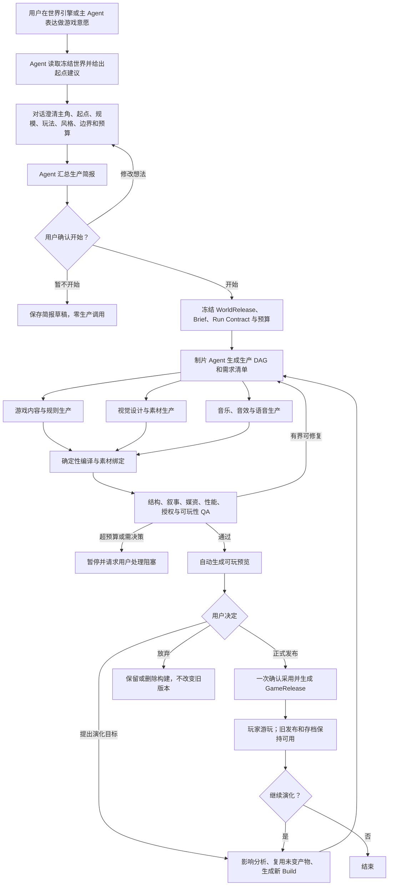
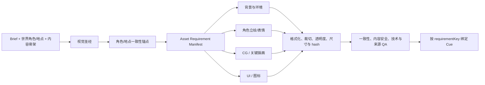

# GAME-PROD-1 · Agent 自主游戏生产与持续演化完整方案

> 状态：`V1 · FROZEN`；产品意图保留，施工权威已由
> [`GAME-PRODUCTION-PIPELINE-BLUEPRINT-V3.md`](./GAME-PRODUCTION-PIPELINE-BLUEPRINT-V3.md) 取代
>
> 最后裁决：2026-08-20
>
> 产品目标：用户从一个已发布世界提出做游戏的意愿，主 Agent 负责建议、澄清、计划、并行制作、自动装配、
> 质量检查和生成可玩预览；用户控制方向、开始、暂停、停止、发布与下一轮演化，不承担逐节点或逐素材验收。
>
> 首个产品切片：有视觉表现的分支互动叙事 / AVG；后续复用同一生产合同扩展到文字冒险、角色互动、复杂模拟
> 和文字开放世界。

## 0. 最终裁决

StoryForge 需要新增的是一套**游戏生产编排体系**，不是第七种文字游戏，也不是第二套播放器、发布系统、
存档系统、Agent Runner 或媒资库。

现有能力负责“内容怎样运行”：

- `GameDefinition / GameRelease` 负责游戏定义与不可变发布；
- Narrative、各玩法能力模块与 SIM 负责规则、事件、存档、fork 和回放；
- AVG presentation 与 `avgMediaAssets / avgMediaBlobs` 负责正式媒资和演出；
- Agent Skill、Run Contract、durable Harness、`CreativeArtifactV1` 与 Adoption 负责 AI 读写治理。

`GAME-PROD-1` 新增的能力负责“一个游戏怎样被生产出来”：

1. 理解用户为什么想做游戏，并根据当前世界给出可解释的起点建议；
2. 通过对话形成可执行生产简报，由用户明确授权开始；
3. 把同一目标拆成内容、视觉、音频等有依赖的并行任务；
4. 在授权预算和质量标准内自主执行、重试、降级、暂停和恢复；
5. 自动把各路产物编译为不可变、可验证、可试玩的预览构建；
6. 用户试玩后一次确认发布，或提出下一轮演化目标；
7. 新一轮只重做受影响部分，保留旧发布、旧存档和未变素材。

最小主路径只是验证这套合同的第一个垂直切片。后续美术、音乐、语音、动画、商业质量和持续演化都必须沿
同一生产根、构建清单、Run lineage 和发布编译器扩展，不能在 MVP 之后另造正式流程。

## 1. 当前基线与真实缺口

### 1.1 已有能力，必须直接复用

| 领域 | 当前能力 | 本体系如何复用 |
|---|---|---|
| 世界来源 | 不可变 `WorldReleaseManifestV2`、便携 exportId、内容 hash | 每个生产构建冻结唯一来源版本；不在制作中偷偷读取实时表 |
| AI 创作 | `worldGameAuthoring`、`outline.world-game`、严格候选解析与图检查 | 作为内容生产线的一个叶子 Skill，不再承担整个制片流程 |
| 游戏内容 | Narrative Module / Node / Beat / Choice 与各产品模块 | 编译器只向这些正式模型采纳，不制造平行内容模型 |
| 游戏发布 | `GameDefinition / GameRelease`、来源 hash、版本和发布校验 | 生产通过后仍生成统一 GameRelease；不新增另一种正式 Release |
| 视觉/音频 | `avgMediaAssets / avgMediaBlobs / avgPresentationModules` | 正式采用后进入现有媒资库和声明式 Cue；旧版本保持不变 |
| 游玩 | STORYGAME / AVG / TEXTADV 等播放器和 SIM | 预览与发布使用同一规则和 reducer；不造简化规则引擎 |
| Agent 运行 | Skill Registry、Run Contract、父子 Run、事件、checkpoint、receipt、预算 | 生产根和所有子任务都进入同一 durable Harness |
| 数据治理 | 三注册表、WorkspaceScope、导入导出、重映射、删除级联 | 每张新增表、Context Source 和正式写入先登记再使用 |

### 1.2 当前流程实际只能做到什么

现有世界工作台已经提供一段“世界到游戏”桥：用户手动选择世界版本、叙事、角色、地点、道具、词条和已有
AVG 媒资，在单个文本框填写创作要求；`outline.world-game` 生成 5–18 节点剧情 JSON，用户编辑或确认后，
系统物化并直接发布 STORYGAME / TEXTADV / AVG。

这证明世界来源、单次内容候选、采用、发布和试玩可以闭环，但它不是完整生产流程。主要缺口如下：

| 环节 | 当前状态 | 缺失能力 |
|---|---|---|
| 用户意愿 | 只有“希望游戏怎样演化”文本框 | Agent 未主动分析世界、提供主线/支线/角色等起点建议 |
| 需求澄清 | 用户一次性填自由文本 | 没有主角、玩家身份、起点、规模、时长、风格、边界、预算等结构化会谈 |
| 开始授权 | 点击生成一个候选 | 没有冻结简报、成本上限、完成条件、暂停/取消规则的生产合同 |
| 内容制作 | 单个剧情生成任务 | 没有制片计划、章节/系统拆分、跨任务依赖与整包一致性检查 |
| 美术制作 | 只选择已经存在的媒资 | 没有从剧情自主拆需求、视觉圣经、角色锚点、生成/编辑/质检流水线 |
| 音频制作 | 只支持作者导入正式音频 | 没有音乐、环境音、音效、语音的需求拆分和并行生产 |
| 并行编排 | 领域任务主要按依赖串行 | 没有有界 fan-out、子 Run、并发预算、汇合门和失败隔离 |
| 自动装配 | AVG 可发布已有 Cue 和媒资 | 没有把新生产的内容、图片和音频按稳定需求 key 自动绑定 |
| 可玩预览 | 候选确认后直接发布 | 没有不改变当前正式版本的整包预览构建 |
| 质量保证 | 各产品有领域校验 | 没有跨内容、媒资、演出、性能、授权和可玩性的统一发布门 |
| 持续演化 | 重新填要求并再生成 | 没有父构建、影响分析、增量复用、存档兼容和回归范围 |
| 商业运行 | 有本地预算和恢复底座 | 没有订单级成本预估、硬上限、配额、来源权利和运营指标 |

因此，不能把“已有游戏类型都实现了”误写成“自主生产流程已经实现”。

## 2. 产品范围与非范围

### 2.1 本体系负责

- 从世界工作台和主 Agent 对话进入的统一“制作游戏”入口；
- 起点建议、需求会谈、简报版本、生产授权和用户控制；
- 内容、视觉、音频和集成任务的依赖图、运行证据和进度；
- 生产期候选资产、二进制、来源、授权、质量和 hash；
- 自动编译、预览、验收、发布和演化；
- 本地恢复、失败降级、成本边界、数据生命周期和商业发布门。

### 2.2 本体系不负责

- 新建一种通用游戏运行时或替代现有六类文字游戏；
- 3D、实时动作战斗、开放脚本、Unity 式场景编辑器或专业视频剪辑器；
- 让多个 Agent 无界自治、互相自由聊天或自行扩大目标；
- 在用户没有发出开始指令时调用收费模型或生成媒资；
- 自动修改世界 Canon、角色主档、用户手稿或已发布版本；
- 运行时临时生成关键剧情或关键美术；
- 在纯前端尚无后台执行环境时宣称关闭浏览器仍会继续生产；
- 把账号、云算力、商店、社区分发和协作伪装成本地 MVP 已完成。

## 3. 核心概念

| 概念 | 含义 | 是否正式 Canon / Release |
|---|---|---|
| `GameProduction` | 一个游戏从意愿到多次构建和演化的生产根 | 否；是生产业务记录 |
| `GameProductionBrief` | 用户和 Agent 共同冻结的目标、范围、风格、预算与边界 | 否；是用户授权依据 |
| `GameProductionPlan` | 由简报编译出的任务 DAG、依赖、预算和完成条件 | 否；是 Run 证据 |
| `AssetRequirementManifest` | 从游戏设计和内容中拆出的图片、音乐、音效、语音等需求清单 | 否；是构建合同 |
| `GameBuild` | 某个简报版本在某个世界版本上的不可变预览候选 | 否；可试玩但未成为当前正式发布 |
| `GameBuildArtifact` | 构建期的文本、规则、图片、音频、Cue、报告或二进制 | 否；只属于构建 |
| `GameDefinition` | 采用后可编辑的正式游戏定义 | 是正式作者数据 |
| `GameRelease` | 不可变、可启动、可分享的正式游戏版本 | 是正式发布 |
| `EvolutionBrief` | 针对一个 Build 或 Release 的下一轮改动目标 | 否；生成新简报版本 |

生产授权允许系统把中间结果写入隔离的 `GameBuild`，但不等于允许改 Canon 或替换当前 GameRelease。最终发布
仍需用户一次明确确认；用户无需逐图、逐节点、逐音轨确认。

## 4. 端到端用户流程



### 4.1 发现与建议

用户可以说“把这个世界做成游戏”“从这个角色开始”“我想做一个短篇 AVG”等自然语言。Agent 先只读，不
立即生产。它从当前已发布世界中生成 3–5 个可选择起点，例如：

- 从当前主线的未解决危机开始；
- 从一条适合独立游玩的支线开始；
- 从某个主角的关键抉择开始；
- 从配角未被讲述的经历开始；
- 从某个地点、事件或历史谜团开始；
- 以原世界为背景，建立不改 Canon 的平行故事。

每条建议必须显示来源、推荐玩法、预计时长/规模、优势、风险和需要补充的信息。建议是会谈起点，不自动成为
生产目标。没有可用 WorldRelease 时，Agent 应先引导用户冻结发布，不能偷偷读取变化中的实时世界作为权威。

### 4.2 会谈与简报

Agent 采用渐进式提问：能从世界推断且风险低的内容先给默认建议，只询问真正影响方案的缺口。最少需要冻结：

| 维度 | 必填内容 | 默认策略 |
|---|---|---|
| 来源 | WorldRelease、主线/支线/角色/地点等起点 | 当前已发布版本，不跟随实时修改 |
| 玩家身份 | 玩家扮演谁、视角、人称 | 选定主角；无法判断时询问 |
| 故事起点 | 时间、地点、触发危机、初始目标 | 来自用户选定建议 |
| 产品形态 | STORYGAME、AVG、TEXTADV 等 | 首期建议 STORYGAME 或 AVG |
| 规模 | 短/中/长；目标时长；章节、节点和结局区间 | MVP 5–18 节点，商业版按预算模板 |
| 体验 | 选择密度、探索、关系、推理、资源或战斗比重 | 依据产品模板给出可改建议 |
| 风格 | 题材、语气、节奏、视觉风格、镜头气质 | 从世界提取但不冒充用户确认 |
| 内容边界 | 禁止内容、年龄分级、敏感主题、必须保留事实 | 默认继承项目安全边界 |
| 媒资 | 图片范围、角色一致性、音乐/SFX/语音、可否降级 | MVP 可纯文字降级；商业目标显式覆盖率 |
| 预算 | 模型调用、token、外部生成费用、时间和存储上限 | 开始前显示估算和硬上限 |
| 完成条件 | 可通关、分支数、结局数、素材覆盖率、性能和 QA 等级 | 由产品/规模模板产生 |

Agent 最后以人能读懂的摘要和机器可验的 `GameProductionBriefV1` 同时展示。用户可继续说“主角改成配角”“不要
语音”“控制在 30 分钟”等；每次生成新简报版本，旧版保留差异。

### 4.3 开始授权

只有用户明确点击或说“按这个方案开始制作”后，系统才：

1. 冻结简报 hash、WorldRelease hash、所选便携 exportId 和生产模板版本；
2. 显示预计成本区间、硬上限、降级规则和本地前台运行限制；
3. 创建根 `AgentRun` 与 `GameBuild`；
4. 冻结 Run Contract、并发上限、最大重试、完成条件和失败政策；
5. 开始拆分并执行生产任务。

“开始”只授权本轮构建和自动整包预览，不授权：修改世界 Canon、覆盖手稿、扩大预算、替换当前正式发布、
向社区公开或发送未声明的外部服务。

### 4.4 等待与控制

制作期间用户主要看到：当前阶段、各生产线进度、已用/剩余预算、预计等待、警告和可恢复状态。用户可以随时：

- 暂停：不再发起新调用，进行中的可安全完成或按适配器取消，保留 checkpoint；
- 继续：重新验证来源、预算、密钥、配额和父回执后恢复；
- 停止：取消未开始任务，保留已完成构建产物供查看或删除；
- 调整目标：先暂停，生成影响说明和新简报版本，再由用户确认是否重规划；
- 降级：例如取消语音、减少 CG、改用占位背景或仅完成纯文字版本。

本地纯前端阶段必须明确提示：标签页保持打开时可以持续执行；刷新或重新打开后可以恢复，但关闭浏览器时不会
伪装成后台仍在生成。真正的离线后台生产需后续受治理的桌面/后端执行器。

### 4.5 预览、发布与演化

所有硬门通过后，系统自动生成 hash 固定的可玩预览。用户可以直接玩，无需先检查生产 JSON 或逐项采纳。

预览之后只有三种主决定：

1. **发布当前构建**：一次确认，将整包构建通过统一 Adoption 物化到现有正式表并创建 GameRelease；
2. **继续演化**：用自然语言提出目标，系统生成影响范围、成本和复用计划，再开始新 Build；
3. **放弃或保留草稿**：不影响当前 Release 和存档。

## 5. 用户介入与自动化边界

| 时点 | 用户是否必须介入 | 系统可自主做什么 | 必须暂停的情况 |
|---|---|---|---|
| 表达意愿 | 是 | 只读分析并给建议 | 没有可用来源或权限 |
| 简报形成 | 是 | 推断低风险默认值、追问缺口、估算规模 | 主角/起点/产品形态等关键歧义 |
| 开始生产 | 是 | 冻结合同并运行 | 用户未确认、预算或服务未就绪 |
| 中间内容/素材 | 否 | 在授权范围内生成、筛选、修复、降级、装配 | 需扩大范围/预算、触碰 Canon、权利不清、连续失败 |
| 进度查看 | 否 | 持续记录可见证据 | 无 |
| 暂停/停止 | 用户可随时 | 安全停止新任务、保存 checkpoint | 取消适配器不安全时先完成原子写 |
| 预览 | 否 | 自动生成并打开可玩构建 | 硬质量门未通过 |
| 正式发布 | 是 | 一次事务采用整包并创建 Release | 来源过期、hash 不一致、采用失败 |
| 下一轮演化 | 是 | 先分析影响和复用，再等待开始授权 | 会破坏旧存档或显著增加成本 |

系统不得用大量“确认这张图吗”“确认这个节点吗”把制片工作转嫁给用户。只有超出已授权包络的决定才返回
用户；包络内的质量选择由 Visual Director、Audio Director、Integrator 和 QA Agent 通过硬标准完成。

## 6. 生产数据合同

### 6.1 `GameProductionBriefV1`

最少字段：

```ts
interface GameProductionBriefV1 {
  schema: 'storyforge.game-production-brief'
  version: 1
  productionId: number
  revision: number
  source: {
    worldReleaseId: number
    worldContentHash: string
    selection: WorldGameSourceSelectionV1
    startingPoint: {
      kind: 'mainline' | 'sideline' | 'character' | 'location' | 'event' | 'parallel-story'
      portableRefKeys: string[]
      rationale: string
    }
  }
  intent: {
    productType: GameProductType
    playerRole: string
    protagonistRefs: string[]
    openingSituation: string
    coreExperience: string[]
    tone: string[]
    requiredFacts: string[]
    forbiddenChanges: string[]
    contentBoundaries: string[]
  }
  scale: {
    tier: 'prototype' | 'short' | 'standard' | 'extended'
    targetMinutes: [number, number]
    chapterRange: [number, number]
    nodeRange: [number, number]
    endingRange: [number, number]
  }
  media: {
    visualProfile: 'none' | 'key-art' | 'illustrated' | 'avg-full'
    audioProfile: 'none' | 'music-sfx' | 'voiced-key-scenes' | 'full-voice'
    styleDirection: string
    fallbackPolicy: 'allow-text-fallback' | 'require-critical-media' | 'require-full-coverage'
  }
  budget: {
    maxModelCalls: number
    maxInputTokens: number
    maxOutputTokens: number
    maxExternalCost: number
    currency: string
    maxWallClockMinutes: number
    maxStorageBytes: number
  }
  qualityProfile: 'prototype' | 'internal' | 'commercial-candidate'
  approvedAt: number | null
  briefHash: string
}
```

正式实现以严格 JSON parser、exact-key、长度/数量/枚举上限和 hash 为准，不能直接信任模型或 UI 对象。

### 6.2 `GameProductionPlanV1`

生产计划是从简报确定性编译的 DAG，至少包含：

- 稳定 `taskKey`、所属生产线、任务类型和 Skill 版本；
- 输入 artifact/hash、输出 schema、依赖 taskKey；
- 模型/工具预算、最大尝试、超时、并发组和优先级；
- 硬验收项、软警告项、降级策略和阻塞责任；
- 是否可以复用父 Build 产物，以及复用依据；
- 任务完成 receipt、输出 artifact hash 和使用量结算。

计划生成不等于执行。执行前必须验证：无环、任务类型已登记、依赖存在、总预算不超 Brief、并发不超适配器
能力、每个必需产物有唯一所有者、汇合任务依赖全部硬门。

### 6.3 `AssetRequirementManifestV1`

每项媒资需求必须使用稳定 `requirementKey`，不能根据文件名猜绑定：

```ts
interface AssetRequirementV1 {
  requirementKey: string
  kind: 'background' | 'character-pose' | 'character-expression' | 'cg' | 'ui'
    | 'bgm' | 'ambience' | 'sfx' | 'voice'
  criticality: 'required' | 'recommended' | 'optional'
  subjectRefs: string[]
  sceneRefs: string[]
  beatRefs: string[]
  narrativePurpose: string
  continuityAnchorKeys: string[]
  specification: Record<string, unknown>
  acceptance: Record<string, unknown>
  fallback: Record<string, unknown> | null
  sourceTaskKey: string
}
```

同一需求在内容修改后尽量保持 key；语义改变时产生新版本，不覆盖旧 Build 中的文件。

### 6.4 `GameBuildManifestV1`

构建清单绑定：Production/Brief/父 Build、WorldRelease、Run/terminal receipt、生产计划、所有 artifact、内容图、
能力模块、媒资需求/实际绑定、Cue、质量报告、成本、兼容级别和总 hash。它必须能在不重新调用模型的情况下：

- 验证所有输入和产物 hash；
- 生成可玩预览；
- 重现实际采用集合；
- 确定性物化为现有 GameDefinition/各产品模块/媒资/Presentation/GameRelease；
- 对比父 Build，解释重用、重做和移除的内容。

## 7. 数据模型与三注册表

### 7.1 建议新增的最小业务表

| 表 | 作用 | owner / 生命周期 |
|---|---|---|
| `gameProductions` | 一款游戏的生产根、当前 Brief/Build/Release 指针和状态 | Work-owned；删除级联 Brief/Build/Artifact，不删除已脱离的不可变 Release |
| `gameProductionBriefs` | 不可变简报版本、父版本、用户输入摘要、briefJson/hash | Work-owned；导出、导入、复制和重映射 Production/WorldRelease |
| `gameBuilds` | 每次构建、父 Build、rootRun、状态、manifest/hash、采用结果 | Work-owned；未发布可删，已发布 Build 保留来源证据或仅允许归档 |
| `gameBuildArtifacts` | 构建期结构化产物、媒资元数据、来源/授权/质量和 hash | Build-owned；随 Build 级联；不直接成为正式媒资 |
| `gameBuildArtifactBlobs` | 构建期图片/音频等二进制 | Artifact-owned；完整性绑定 metadata hash/size |

不新增 scheduler、任务队列、正式游戏定义、正式发布、正式媒资或存档表。任务与状态证据继续复用
`agentRuns / agentRunEvents / agentRunCheckpoints`；正式采用继续写已有内容和媒资表。

### 7.2 关键引用

- `gameProductions.worldId/workId` 决定逻辑归属；可选 `currentGameDefinitionId/currentGameReleaseId` 只指向采用结果；
- Brief 绑定 `productionId + revision` 唯一键、WorldRelease 便携来源与 parentBriefId；
- Build 绑定 `productionId + buildNumber`、briefId/hash、parentBuildId、rootRunId/receipt 和来源 hash；
- Artifact 绑定 buildId、requirementKey/version、producerRunId/receipt、contentHash、provenance 和质量状态；
- Blob 绑定 artifactId 一对一，导出时转便携 data URL，导入事务内复核 mime/size/hash；
- GameRelease 不依赖可删除的构建 Blob；发布事务把实际使用资产物化到现有正式表并冻结版本。

### 7.3 三注册表回答

| 问题 | 设计答案 |
|---|---|
| AI 读什么 | 新增 `gameProductionConsultation`、`gameProductionBrief`、`gameBuildInputs` 等有界 Context Source；世界内容仍由已登记来源装配，不在 Skill 中直读 DB |
| AI 写什么 | 所有中间结果先为 `CreativeArtifactV1` / build artifact；正式 Narrative、GameDefinition、玩法模块、AVG 媒资和 Cue 只通过登记 Adoption extension 进行整包采用 |
| 哪些表参与生命周期 | 五张新增表先进入 `PROJECT_TABLES`；现有 Agent 三表、游戏/叙事/AVG/Release 表只复用登记生命周期 |
| 如何避免旁路 | UI 只创建/控制 Production 服务；模型调用只由 Skill + durable runner 发起；编译器和 adopter 是唯一正式写入口 |

`GAME-PROD-1A` 必须先补注册表、schema、迁移和反例测试，再出现可见生产按钮。

## 8. Agent 角色与 Skill 边界

角色是职责和路由，不是多个自由聊天人格。每个角色必须绑定有限 Skill、输入源、输出 schema、预算和验证器。

| 角色 | 责任 | 主要输出 | 禁止事项 |
|---|---|---|---|
| Production Director | 会谈、简报、计划、依赖、成本、暂停和汇合 | Brief、Plan、进度/阻塞摘要 | 不直接写游戏内容或媒资 |
| Game Designer | 产品形态、玩家循环、规模、分支/系统设计 | Game Design Artifact | 不改世界 Canon |
| Narrative Builder | 剧情图、Beat、Choice、对白和结局 | Portable narrative candidate | 不绕过图校验；首期复用 `outline.world-game` |
| Systems Builder | TEXTADV/SIM 等规则模块 | 白名单规则候选 | 不执行任意脚本 |
| Visual Director | 视觉圣经、角色锚点、镜头/场景需求和一致性标准 | Visual Bible、Asset Manifest | 不直接选择无来源的“漂亮图”覆盖一致性 |
| Visual Producer | 生成/导入/编辑图片、变体和后处理 | Image artifacts + receipts | 不写正式媒资库，不泄露密钥 |
| Audio Director/Producer | 音乐主题、场景功能、SFX/语音计划与生产 | Audio Bible、audio artifacts | 不让音频成为剧情唯一信息 |
| Integrator | 编译内容、绑定 stable key、Cue、格式和 fallback | GameBuildManifest | 不猜文件名、不改变剧情规则 |
| QA / Playtester | 全图遍历、自动试玩、媒资/性能/授权检查 | BuildReport、修复清单 | 不修改目标或放宽硬门 |
| Evolution Planner | 影响分析、复用、失效传播和存档兼容 | Evolution Impact Plan | 不静默重写父 Build/Release |

### 8.1 Skill 规划

建议新增并登记：

- `game.consult-starting-points`：只读，给出起点建议；
- `game.compile-production-brief`：把会谈编译成严格 Brief 候选；
- `game.plan-production`：生成有界 DAG 候选；
- `game.design-structure`：游戏设计和内容规模；
- `game.plan-assets`：从冻结内容拆视觉/音频需求；
- `game.visual-bible`、`game.visual-produce`、`game.audio-bible`、`game.audio-produce`；
- `game.integrate-build`：原则上确定性工具，不调用模型；
- `game.review-narrative`、`game.review-media`、`game.playtest-build`；
- `game.plan-evolution`：父 Build/Release 的增量影响分析。

首期 `game.design-structure` / `game.plan-assets` 可以把已有 `outline.world-game` 作为依赖，而不是复制其 prompt、
parser 或 Adoption。

## 9. Durable 编排与并行执行

### 9.1 Run 结构

```text
root AgentRun: game-production:<productionId>:build:<buildNumber>
├─ child: plan
├─ child: content
│  ├─ story-structure
│  ├─ narrative-build
│  └─ narrative-review
├─ child: visual
│  ├─ visual-bible
│  ├─ character-anchors
│  ├─ backgrounds / sprites / cg / ui ...
│  └─ visual-review
├─ child: audio
│  ├─ audio-bible
│  ├─ bgm / ambience / sfx / voice ...
│  └─ audio-review
├─ child: integrate
└─ child: qa-and-preview
```

根与子 Run 都是 Work-owned，使用现有 `parentRunId + parentRelation`、contract lineage、checkpoint、receipt 和
预算事件。每条生产线内部按需求继续 fan-out，但同时运行数由适配器和全局预算硬限制。

### 9.2 复用现有 Run 状态

不扩张 `AgentRunState`。业务 UI 将其投影为用户语言：

| AgentRunState | 用户看到 |
|---|---|
| `planned` | 已排队 / 正在准备 |
| `running` | 制作中 |
| `awaiting_confirmation` | 等待用户处理超范围决定或最终发布 |
| `verifying` | 正在质检/装配 |
| `paused` | 已暂停，可继续 |
| `recovering` / `recovery_required` | 正在恢复 / 需要恢复处理 |
| `completed` | 本任务完成 |
| `failed` | 失败，可查看原因和可恢复范围 |
| `cancelled` | 已停止 |

Build 自己拥有 `draft / authorized / planning / building / integrating / validating / preview-ready / release-ready /
released / failed / cancelled / archived` 状态，不能把业务构建状态塞进 AgentRun enum。

### 9.3 调度规则

1. 计划先做确定性静态校验，再创建子 Run；
2. 只有依赖 terminal receipt fresh 且输入 hash 一致的任务才能开始；
3. 相同 `productionId + build + taskKey + inputHash` 幂等，刷新不重复计费；
4. 同一父 Run 的 `parentRelation` 唯一，重试增加 generation/attempt，不创建匿名重复任务；
5. 并发采用全局上限、provider 上限和同一主体一致性锁；
6. 汇合前验证全部 required artifact，recommended/optional 可按 Brief 的 fallback 降级；
7. 重试只处理允许的 transient/protocol 失败；相同失败指纹停止盲重试；
8. 任何预算增加、来源改变、产品形态改变或范围显著扩大都生成新 Brief/Plan 并等待用户确认；
9. 用户暂停后不调度新任务；取消后任何迟到响应只可记录为 orphan evidence，不能进入 Build；
10. 导入未完成 Run 时标为 `recovery_required`，重新验证作用域、来源、密钥和成本后才能继续。

### 9.4 预算

Brief 的订单级预算分配到根 Run，再预留到子 Run。至少同时限制：模型调用、工具调用、输入/输出 token、
外部费用、并发、尝试次数、重规划次数、墙钟时间和本地存储。每次任务结束结算，未使用预留归还根预算。

成本不明的外部工具必须先按最坏上限预留；无法确定费用时不得自动开始。预算耗尽后优先执行已授权降级，
否则暂停并说明“还差什么、继续要多少、可以舍弃什么”。

## 10. 游戏内容生产线

### 10.1 内容阶段

1. **设计骨架**：玩家身份、核心循环、章节节奏、关键抉择、路线、汇流、结局和能力模块；
2. **内容图**：生成稳定 key 的 Node/Beat/Choice 或产品模块候选；
3. **叙事深化**：对白、旁白、行动、提示、节奏和角色口吻；
4. **规则化**：条件、效果、资源、关系、地图、任务等只使用已登记白名单 DSL；
5. **结构校验**：入口、可达、死路、循环、目标、结局、隐藏/禁用选择、模块依赖；
6. **语义校验**：世界事实、角色知识、动机、时间、因果、目标和内容边界；
7. **可玩投影**：形成 portable content artifact，供媒体拆分和编译器使用。

### 10.2 生产策略

- 短篇可以一次生成完整图，但必须经过确定性 parser 和独立 review；
- 中长篇先冻结骨架，再按章节/区域生产；上下游通过摘要、事实和 stable key，不整包反复回灌；
- AI 候选不得携带本地 Dexie ID，只使用便携 exportId 或 stable key；
- 内容生产不能等待全部图片完成；媒体需求从已经冻结的骨架/场景逐批发出；
- 图片反向提出的表现限制只能成为 integration suggestion，不能自动改剧情；
- 无 AI/额度失败时可以使用现有确定性世界映射，但必须标明质量等级和降级原因。

## 11. 视觉素材生产线

### 11.1 流程



### 11.2 视觉圣经

在批量生图前先冻结：色彩、时代/材质、光线、镜头、构图、角色比例、服装和不可变化特征、地点空间特征、
禁用元素、负向约束、目标分辨率/比例、透明背景策略和无障碍 alt-text 规则。

角色先生成少量锚点：标准正面/侧面、基础姿势、关键服装与色板。Visual Director 通过结构化标准选择一致性最好
的锚点，后续表情/姿势必须引用锚点 hash。用户只有在视觉方向超出简报或自动选择无法达到硬门时介入。

### 11.3 生成、编辑与后处理

- 每项需求有限变体，模型/参数/种子/输入来源/父图/hash 全记录；
- 允许导入用户已有资产，与 AI 产物使用同一 requirement/rights/QA 合同；
- 编辑、局部修复、抠图、缩放、压缩、转码和缩略图是派生产物，保留 parentArtifactHash；
- 禁止仅按文件名或模型描述绑定；只按 requirementKey + accepted artifact version；
- 生产期二进制只写 build artifact blob，最终整包采用后才进入 `avgMediaAssets / avgMediaBlobs`；
- 角色脸、服装标识、重要道具、场景地理和文字内容进行一致性检查；
- 生成的图片文字默认视为高风险；UI 文案应由 HTML/CSS/Canvas 正式渲染，不依赖模型画字。

### 11.4 视觉硬门与降级

硬门至少包括：文件可解码、mime/尺寸/大小合法、hash 匹配、来源和权利字段存在、required 需求有唯一绑定、
人物/场景锚点未违反、敏感内容符合 Brief、alt text 完整、透明度/比例符合播放器合同。

降级由 Brief 决定：背景可用主题色+alt，角色可用姓名占位，动画可落最终静帧，非关键 CG 可跳过；商业候选若
声明 `require-critical-media` 或 `require-full-coverage`，缺失 required 资源必须阻止 release-ready。

## 12. 音乐、音效与语音生产线

音频不是视觉完成后才临时添加，而是在内容骨架稳定后与图片并行：

1. Audio Director 生成音频圣经：主题动机、角色/地点 motif、情绪功能、动态范围、循环和禁用风格；
2. 从场景和 Beat 拆出 BGM、ambience、SFX、voice 需求；
3. 生产或导入候选，记录来源、许可、模型/表演者、文本、语言和父产物；
4. 标准化格式、采样率、声道、响度、首尾静音、循环点、fade 和时长；
5. 检查削波、噪声、响度跳变、循环爆音、对白可懂度、内容/文本一致和权利；
6. Integrator 按 requirementKey 生成白名单 `play-audio / stop-audio` Cue；
7. 静音、浏览器自动播放限制或文件缺失时，正文和选择仍完整可玩。

语音不能替代文字。首期不做全语音；先交付 BGM、环境音和关键 SFX，随后才做关键场景或全语音。任何克隆
真人声音的能力默认禁止，除非有明确权利证明和产品级治理。

## 13. 自动装配、预览与正式发布

### 13.1 Integrator 的确定性职责

Integrator 不使用模型猜装配结果。它：

1. 读取已验签内容 artifact、Asset Manifest 和已通过 QA 的媒资；
2. 验证 stable key、requirementKey、Beat/scene/actor 引用和能力模块版本；
3. 生成 Narrative、产品能力模块、AVG Presentation Cue 和实际媒资绑定；
4. 为缺失 optional 产物写入显式 fallback，不静默丢失；
5. 计算内容、媒资、Cue、Build 总 hash；
6. 运行与正式发布器相同的 graph/module/media 校验；
7. 输出 `GameBuildManifestV1` 和 Build Report。

### 13.2 可玩预览

预览必须消费 hash 固定的 `GameBuildManifest`，并复用正式播放器、条件/effect、SIM reducer 和演出执行器。
只允许在“发布来源”适配层识别 build manifest，不能复制玩家规则。预览存档绑定 build hash；构建变化后不悄悄
继续旧存档。

MVP 可先提供不持久化或明确标记的构建试玩；商业阶段需要预览自动存档、刷新恢复和从 Build 到 Release 的兼容
迁移。无论哪一阶段，都不能为方便预览提前把候选伪装成正式 GameRelease。

### 13.3 整包采用与发布事务

用户点击“发布当前构建”后：

1. 重新验证 WorldRelease、Brief、Build、root receipt、artifact hash、质量门和预算结算；
2. 生成包含整个 Build hash 的 adoption intent；
3. 在一个可回滚事务中物化 Narrative/Beat/Choice、GameDefinition、能力模块、正式媒资/Blob、Cue；
4. 复用现有发布服务生成不可变 GameRelease；
5. 回读并验证 GameRelease hash 与实际 adopted artifact 集；
6. 更新 Production 的当前 Definition/Release 指针和 Build `released` 状态；
7. 任何步骤失败全部回滚，不留下半个游戏或孤儿 Blob。

已有 GameRelease 永不覆盖。发布新 Build 只产生新版本或新 Definition；当前版本切换必须可见。

## 14. 统一质量与商业发布门

### 14.1 质量分层

| Profile | 用途 | 允许的降级 |
|---|---|---|
| `prototype` | 验证生产合同和玩法核心 | 明确占位、纯文字 fallback、少量媒资、较小内容规模 |
| `internal` | 团队试玩与内容迭代 | optional 媒资缺失；不能有结构、数据或关键可玩性错误 |
| `commercial-candidate` | 对外候选 | required 覆盖、权利、安全、性能、无障碍、兼容和完整回归全部硬门 |

### 14.2 QA 矩阵

| 维度 | 自动检查 | 商业硬门示例 |
|---|---|---|
| 协议 | exact-key、schema、大小、hash、未知字段 | 所有 artifact 和 manifest 可严格解析 |
| 图结构 | 入口、可达、死路、循环、结局、引用 | required 路径无坏引用；所有声明结局可达 |
| 规则 | selector/effect、资源边界、幂等、事件回放 | 无任意脚本；同种子/事件得到同状态 |
| 叙事 | 世界事实、角色知识、动机、时间、因果、内容边界 | required facts 保留；forbidden changes 为零 |
| 玩法 | 自动遍历、选择密度、失败/替代解、结束条件 | 所有主路线可开始、继续、完成和重玩 |
| 视觉 | 覆盖、一致性、构图、尺寸、alt、敏感内容 | required 需求 100%；关键人物/地点锚点通过 |
| 音频 | 解码、响度、循环、文本、授权、静音 fallback | 无阻断播放的音频；静音仍可通关 |
| 集成 | requirement/Cue/Beat/actor/scene 引用、预载和 fallback | 无孤儿 required binding；缺失资源不损坏存档 |
| 性能 | 首屏、内存、包体、解码、连续游玩、移动端恢复 | 达到产品模板预算，无持续内存增长 |
| 无障碍 | 键盘、读屏、减少动态、字幕/文本、对比 | 不依赖颜色/声音传达唯一信息 |
| 生命周期 | 导入导出、删除、重映射、旧发布、损坏回滚 | 完整往返 hash 一致；损坏输入零写入 |
| 权利/隐私 | 来源、许可、模型/人工、敏感信息、外发清单 | 所有外部产物有可解释来源与允许用途 |

### 14.3 自动试玩

- 对有限分支图枚举所有选择；对循环和开放系统使用状态去重、深度/回合上限和覆盖预算；
- 记录节点/Choice/结局/规则/媒资/Cue 覆盖率和最短/最长通关路径；
- 随机测试使用固定 seed，可重现失败；
- 自动试玩只能证明结构和规则覆盖，不能冒充人类对文本质量、趣味或审美的最终判断；
- 商业候选至少保留一次真实用户完整主路线试玩作为发布证据。

## 15. 持续演化流程

用户可以从 Preview 或任意 GameRelease 提出：“让配角成为主角”“把第二章改成调查路线”“增加两个结局”
“补全角色立绘”“加入音乐但不要语音”等目标。

### 15.1 影响分析

Evolution Planner 先输出：

- 目标解释和仍需澄清的歧义；
- 直接受影响的 content node/module/requirement/Cue；
- 通过依赖图传播的下游失效项；
- 可原样复用、需重新验证、需重做和需删除的 artifact；
- 预计新增成本、时间、存储和质量风险；
- stable key 与存档兼容等级。

用户确认演化简报后创建子 Brief 和新 Build，父 Build/Release 不变。

### 15.2 增量复用规则

- 输入 hash、生产 Skill 版本、质量标准和依赖 receipt 全部相同，产物可原样复用；
- 文案变化但场景/角色/用途未变，图片可复用但要重新验证 Cue/alt；
- 角色外观、时代、地点空间或视觉风格变化，相应锚点和所有派生产物失效；
- Beat key 保留且语义兼容，Cue 可迁移；key 删除或用途变化则失效；
- 音频主题不变可复用，台词或语言变化使对应 voice 失效；
- 任何来源权利或文件完整性变化都阻止复用；
- 复用必须产生 `candidate.carried-forward` 或等价证据，不能只复制文件后宣称来自新 Build。

### 15.3 存档兼容

| 等级 | 条件 | 行为 |
|---|---|---|
| `compatible` | 已访问 stable key、规则版本和状态 schema 均兼容 | 可从旧存档迁移到新 Release，保留迁移 receipt |
| `restart-recommended` | 未访问区变化或可确定性补默认值 | 用户可继续或重开，系统解释差异 |
| `breaking` | 已访问节点删除、效果语义改变、模块/状态不兼容 | 旧存档固定在旧 Release；新版本必须新开局 |

绝不静默修改旧事件流来适配新内容。

## 16. 失败、恢复与降级

| 失败 | 自动处理 | 用户看到 |
|---|---|---|
| 网络/限流/临时服务错误 | 在预算内指数退避一次或按 policy 重试 | 当前任务重试与剩余次数 |
| 严格协议失败 | 确定性错误反馈 + 最多一次定向修复 | 哪个合同失败，不展示隐藏推理 |
| 相同失败重复 | 停止该任务，不盲重试 | 可换服务、降级或取消 |
| 单个 optional 素材失败 | 使用声明 fallback，继续汇合 | 降级项和影响 |
| required 素材失败 | 暂停汇合；允许替换/缩小范围 | 缺失需求、继续成本和选择 |
| 内容/规则硬门失败 | 有界修复；仍失败则停止 | 阻断报告和已保留成果 |
| 来源 WorldRelease/hash 改变 | 旧 Run stale；不得继续采用 | 选择旧来源继续或基于新来源重规划 |
| 存储配额不足 | 停止新 Blob，保留已验签产物；建议降清晰度/清理草稿/导出 | 所需空间、可安全删除项 |
| 刷新/崩溃 | 从 checkpoint 和 child receipts 恢复 | 恢复到哪个阶段，哪些任务不会重复计费 |
| 用户取消 | 停止新任务，迟到结果隔离，保留或删除 Build | 已花费、已完成和可恢复项 |
| 采用事务失败 | 全部回滚，Build 仍可预览/重试 | 正式数据未改变 |

所有错误必须区分可重试、需重规划、需用户决定和不可恢复；“再试一次”不是默认万能策略。

## 17. 商业级成本、安全、隐私与权利

### 17.1 成本与服务

- 开始前显示估算区间和最坏硬上限，不以“免费”掩盖第三方费用；
- 每个 provider/model/工具通过中央能力注册表声明支持类型、费用单位、并发、取消和内容限制；
- API 密钥只由现有连接配置读取，不进入 Brief、Artifact、Run event、导出包或日志正文；
- 生成请求保留脱敏 input hash、模型、参数、usage 和费用，不保留隐藏推理；
- 额度不足时允许导入用户素材、切换已授权服务或按 Brief 降级。

### 17.2 隐私

- 向外部服务发送前显示按生产线汇总的数据类别，而不是埋在每次请求中；
- 默认只发送已选冻结来源和必要派生摘要，不发送整本手稿、私有参考、API 配置或无关 World/Work；
- 本地诊断和试玩数据默认不上传；商业 telemetry 必须显式 opt-in、聚合和可删除；
- 删除 Production/Build 时从 `PROJECT_TABLES` 派生完整本地清理，并说明正式 Release/导出副本不受影响。

### 17.3 权利与来源

每个外部或导入媒资记录：来源类型、作者/服务、模型、输入来源、许可、允许用途、署名要求、生成/导入时间、
parent hash 和人工修改。缺失许可不能进入 commercial-candidate release-ready。第三方风格参考只用于描述可允许的
视觉特征，不默认授权模仿在世艺术家的独特风格、使用受保护角色或克隆真实声音。

## 18. UI 信息架构

### 18.1 入口

- 世界工作台：在某个 WorldRelease 上显示“制作游戏”，保留现有“无需 AI 快速映射”为高级备用；
- 主 Agent：识别“做游戏/继续演化”意图，进入同一个 Production 会谈，不复制状态；
- 游戏产品页：显示 Production、Build、Preview 和 Release，而不是让用户在世界页编辑 16 行 JSON。

### 18.2 五个用户页面/状态

1. **起点建议**：3–5 张建议卡 + 自定义想法；
2. **生产简报**：对话、已确认事实、待决定项、范围/预算/媒资/质量摘要；
3. **生产控制台**：阶段时间线、内容/视觉/音频并行进度、费用、暂停/继续/停止；
4. **可玩预览**：直接进入现有播放器，旁边提供质量摘要、已知降级和“发布/继续演化”；
5. **版本与演化**：Build/Release 父链、差异、复用率、兼容等级、旧版启动和新目标输入。

正常用户不看 prompt、raw JSON、Dexie ID、candidateHash 或 Harness 术语。它们保留在可展开的诊断区和导出证据
中，供开发/高级作者排查。

## 19. 分阶段施工路线

### GAME-PROD-1A · 合同、数据与治理地基

目标：先建立不会在后续推倒的生产根和构建边界，不调用模型。

- 增加五张最小业务表及 TypeScript 严格合同；
- 先登记 `PROJECT_TABLES`，补 schema、空迁移、导出导入、删除、复制、重映射和 Blob 完整性；
- 建立 Brief/Plan/AssetRequirement/BuildManifest parser、canonical hash 和状态机；
- 建立 Production service，禁止组件直写；
- 建立 feature flag，默认隐藏未完成入口；
- 定向验证损坏 brief/manifest、跨 Work、坏 parent、坏 hash、损坏 Blob、删除引用和回滚。

完成门：不调用模型也能创建 Production、保存简报版本、创建空 Build、导出导入和安全删除；三注册表与架构
检查全绿。不能因表存在就宣称生产流程可用。

### GAME-PROD-1B · 用户会谈、起点建议与开始授权

- 登记 consultation/brief Context Source 和两个只读/候选 Skill；
- 从 WorldRelease 的主线、支线、角色、地点和事件生成有来源的起点建议；
- 建立渐进式简报 UI、差异、未决项和确定性完整度检查；
- 显示规模、媒体、质量、费用和本地前台限制；
- 明确“开始/修改/暂存”，开始时冻结 Brief 和 root Run Contract；
- 提供暂停/取消壳，但尚不运行完整生产。

完成门：用户能从自然语言意愿走到一份完整、可编辑、已授权或未授权清晰分离的 Brief；没有开始指令时模型
生产调用为零。

### GAME-PROD-1C · 最小自主可玩垂直切片

这是 MVP/原型，不是最终目标。它必须验证核心形状，而不是只生成一段 JSON：

- 只支持 STORYGAME/轻量 AVG，1 个主角、1 条核心冲突、5–18 节点、至少 2 个结局；
- Production Director 生成最小 DAG；
- 内容线复用 `outline.world-game`；视觉线并行生成或导入 1 张封面/主背景，失败可明确纯文字降级；
- 两条线都写 child Run、artifact 和 receipt；
- Integrator 自动绑定内容与背景，运行图/媒资/引用 QA；
- 自动生成可玩 Preview Build；用户不确认单个节点/图片；
- 用户一次确认后物化并生成现有 GameRelease。

完成门：真实浏览器中“表达意愿 → 会谈 → 开始 → 两线并行 → 自动装配 → 等待 → 直接玩 → 一次发布”完整
走通；刷新恢复不重复付费；取消、图片失败、内容失败和采用回滚有反例。MVP 页面必须标注视觉覆盖与质量等级，
不得宣传为商业成品。

### GAME-PROD-1D · 有界生产编排与控制台

- 通用 DAG 校验、依赖 receipt、并发组、资源预留和汇合门；
- 每个生产线和 artifact 的稳定 task/requirement key；
- 暂停、继续、取消、恢复、迟到响应隔离、失败指纹和有界 replan；
- 进度、预算、预计完成、降级和阻塞 UI；
- 关闭/刷新后恢复；前台执行限制清楚可见；
- 大小两种 fixture 验证无重复调用和确定性汇合。

### GAME-PROD-1E · 商业视觉生产线

- 视觉圣经、角色/地点锚点、批量需求拆分和版本化；
- provider-neutral 图片生成/编辑适配器、导入、派生和来源回执；
- 背景、立绘/表情、CG、UI 的完整 pipeline；
- 尺寸/透明/压缩/缩略图/alt 和一致性 QA；
- 构建期 Blob、正式 AVG 媒资整包采用、删除保护和大文件容量策略；
- illustrated 与 avg-full 两档验收样例。

### GAME-PROD-1F · 音频生产线

- 音频圣经、BGM/ambience/SFX/voice 需求和 Cue；
- 导入与 provider adapter、格式/响度/循环/fade/字幕和来源；
- 先完成音乐+环境+SFX，再单独开放受治理语音；
- 静音、自动播放限制、缺失音频和移动端恢复；
- 不阻断纯文字/无声可玩性。

### GAME-PROD-1G · 自动装配、统一 QA 与商业发布

- 完整 Build compiler、build-preview source adapter 和整包 Adoption 事务；
- 自动遍历/长局 playtest、叙事语义、媒资、性能、无障碍、权利和生命周期门；
- prototype/internal/commercial-candidate 三档质量 profile；
- 真实商业规模示例、连续游玩、移动端、完整导出导入和损坏回滚；
- 当前 Release 切换、旧版本启动、构建归档和诊断证据。

### GAME-PROD-1H · 持续演化与增量复用

- 从 Build/Release 提出自然语言演化目标；
- 影响图、成本/风险、父 Brief/Build、carried-forward receipt；
- 内容/媒体/Cue 失效传播、最小重建和整包回归；
- 存档 compatible/restart-recommended/breaking 判定与迁移证据；
- 多轮演化 Golden Project，验证旧 Release、旧存档和未变资产不被破坏。

### GAME-PROD-1I · 商业运营与可选后台执行

- provider 费用目录、订单估算校准、配额与采购/许可报告；
- opt-in 质量/性能 telemetry、失败聚合和删除；
- 国际化、本地化资产/语音变体和地区内容边界；
- 在独立 PLATFORM/桌面架构授权后接入关闭浏览器仍可继续的 worker；
- 账号、云对象存储、团队审核、社区发布和商业分发继续归 PLATFORM，不塞进本地表冒充完成。

## 20. 阶段依赖与不可跳过项

| 阶段 | 必须依赖 | 可以并行的工作 | 不可提前宣称 |
|---|---|---|---|
| 1A | 三注册表、schema/lifecycle | 合同与测试夹具 | 用户流程可用 |
| 1B | 1A | UI 与只读建议 Skill | 已自主生产游戏 |
| 1C | 1B、现有 STORYGAME/AVG/Harness | 内容与最小视觉适配 | 商业美术/音频完成 |
| 1D | 1C 真实失败证据 | 控制台和调度器 | 关闭浏览器后台执行 |
| 1E | 1D、AVG 正式媒资 | 各视觉子类 | 音频/商业发布完成 |
| 1F | 1D、AVG 音频 Cue | 音乐/SFX 与视觉尾项 | 全语音权利治理完成 |
| 1G | 1E、1F | QA 工具和发布适配 | 商业候选可发布，直到全门通过 |
| 1H | 1G 稳定 Build/Release | 影响分析和兼容 fixture | 增量复用可靠 |
| 1I | 前述本地闭环、独立平台决策 | 云/桌面/运营 | 本地前端具备云后台能力 |

`1C` 是第一个用户可玩成果，也是最小主路径；最终目标是至少完成 `1H` 的本地商业生产闭环。不能在 1C 完成
后把余下阶段降格为“可选优化”。

## 21. 测试与验收策略

### 21.1 每阶段通用闸门

1. 先跑新增 parser/service/scheduler/compiler 的定向测试；
2. 跑对应 Narrative/Agent/AVG/GameRelease/SIM 回归；
3. `npm run check:architecture`、`check:required-tables`、`check:ai-manual`、TypeScript、build；
4. schema 或真实数据变化时必须有旧版升级、完整往返、损坏输入、事务回滚和删除反例；
5. 交付单元跑完整 `npm run ci`；适用时在隔离浏览器项目跑真实 E2E；
6. 不在作者当前预览项目中测试生产和删除。

### 21.2 代表性 Golden Projects

- **短篇纯文字/轻视觉**：5–18 节点、2–3 结局、1 个背景，验证 MVP；
- **标准 AVG**：20–40 分钟、3 章、25+ 节点、45+ Beat、3 结局、5 背景、3 角色多表情、3 CG、4 类音频；
- **演化项目**：从标准 AVG 连续三轮修改主角、分支和媒资，验证复用、失效、旧版本和存档；
- **失败项目**：限流、损坏图片、配额不足、来源变化、取消、刷新、导入、采用中断；
- **多 Work 项目**：同 World 两个 Work 并行生产，证明上下文、媒资、Build 和 Run 不串。

### 21.3 商业候选最终证据

- 主流程和所有用户控制路径的真实浏览器录像/截图或可复现实验记录；
- 完整成本、调用、失败、恢复和 artifact/receipt 覆盖；
- 自动图遍历与至少一次人类完整主路线试玩；
- 目标设备上的首屏、内存、包体、音视频恢复和长时运行；
- 完整导出导入、旧 Release/存档、删除保护和损坏回滚；
- 媒资来源、许可、署名、隐私外发和内容分级报告；
- 所有已知降级和未通过项不得藏在“完成”状态下。

## 22. 发布、回滚与旧入口收口

- `GAME-PROD-1B/1C` 之前，新入口默认 feature flag 隐藏；
- 1C 稳定后，“主 Agent 生成游戏候选”的 raw JSON 卡移入高级/诊断入口，普通入口改走 Production 会谈；
- “无需 AI 快速映射”保留为明确备用，不与完整生产同名；
- 不删除现有 StoryGame/AVG 作者工作台，它们继续服务人工精修和高级作者；
- 新生产入口失败时可关闭 feature flag，现有世界发布、游戏作者工作台、GameRelease 和播放器不受影响；
- schema 只加不搬，任何迁移失败保持旧数据可读且不盖假成功章；
- 每阶段只在主路径、旧入口收口、生命周期、回归和文档都完成后更新路线图状态。

## 23. 完成定义

`GAME-PROD-1` 的本地商业闭环只有在以下条件全部满足时才完成：

- 用户能从世界意愿出发，经 Agent 建议和会谈形成简报，并明确控制开始、暂停、停止和演化；
- 内容、视觉和音频在同一生产根下有界并行，刷新/失败后可恢复且不重复计费；
- 系统自主拆需求、选择合格中间产物、自动装配和质检，用户不被迫逐项审批；
- 用户等待后能直接玩到 hash 固定、有视觉/音频表现且可降级的完整预览；
- 一次确认后才写正式内容/媒资并生成现有 GameRelease，失败原子回滚；
- 至少三轮增量演化证明未变产物可复用、受影响产物会失效、旧发布和存档不被破坏；
- 成本、来源、授权、内容安全、隐私、性能、无障碍、导入导出和删除均有商业候选证据；
- 三注册表、统一 Harness、CreativeArtifact/Adoption、现有游戏运行时和发布链保持唯一权威；
- 路线图、能力基线、用户说明、回滚开关、定向测试、完整 CI 和真实浏览器 E2E 同步收口。

在此之前，任何阶段只能按其真实边界称为地基、MVP、内部版或商业候选，不能把“生成了一个能玩的样例”写成
“商业化生产流程已经完成”。
