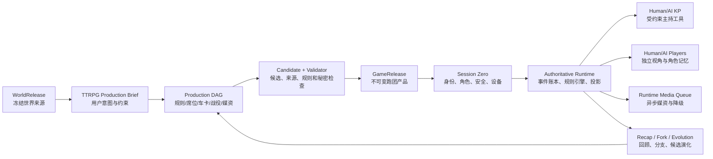

# StoryForge 完整跑团产品施工总方案 V2

> 状态：`SUPERSEDED AT WORLD-SOURCE BOUNDARY · IMPLEMENTATION PAUSED`
>
> 2026-08-22 对齐说明：世界到产品总纲已禁止把文字游戏专属 SourceSelection、统一 Brief / DAG / 媒资
> 流程继续作为 TTRPG 正式协议。本方案的规则、车卡、KP、运行与媒资需求仍是产品需求输入；涉及“统一生产 / 统一媒资”
> 的施工路径已被暂停。当前权威来源表、差距与迁移顺序见
> [`TTRPG-WORLD-DATA-ALIGNMENT-AUDIT-20260822.md`](./TTRPG-WORLD-DATA-ALIGNMENT-AUDIT-20260822.md)。
>
> 日期：2026-08-21
>
> 修订：2026-08-21 深度行动闭环复审；补齐逐行动反馈、多角色反应、物品实例、技能次数、奖励惩罚和真人角色自主权。
>
> 施工进度：[`TTRPG-DEVELOPMENT-TRACKER-20260822.md`](./TTRPG-DEVELOPMENT-TRACKER-20260822.md)
>
> 权威范围：世界引擎到跑团的承接、规则与骰子、车卡、真人/AI 混合组队、AI KP、信息隔离、战役生成、运行时、媒资生产、多人联机、演化与商业化验收。
>
> 最高优先级硬约束：**任何规则包和村规都不得使用超过 100 面的骰子。合法骰式为 `NdS`，其中 `2 <= S <= 100`。`d101`、`d1000` 等必须在导入、编辑、AI 候选验证和运行时全部拒绝。**

## 0. 这份方案解决什么问题

当前仓库有若干可复用的技术内核，但没有走通“从一个世界生成并真正游玩一场跑团”的完整产品路径。固定四场景、固定线索、2d6 单规则和内部测试工作台只能作为测试夹具，不能被认定为跑团游戏。

本方案把唯一完成标准改为：

> 用户选择一个冻结的世界版本，写下自己想玩的跑团，配置规则、村规、KP、真人和 AI 席位、角色与安全边界；系统生成一套可审阅、可修改、可发布的战役和媒资；随后由真人或 AI KP 主持，所有玩家在各自权限视角中行动，规则引擎确定性裁决，剧情在世界约束与玩家选择之间持续演化，并支持保存、续跑、回放、分支和继续发行。

在该路径没有通过真实浏览器端到端验收前，状态只能是“在建”，不得使用“本地完成”“商业就绪”等表述。

## 1. 最终产品承诺

### 1.1 用户能够完成的整条流程

1. 用户在世界引擎发布一个不可变 `WorldRelease`。
2. 从世界引擎点击“制作跑团”，系统把选中的 `worldReleaseId`、版本和内容哈希带入跑团生产页，不允许静默切换到别的世界或最新草稿。
3. 用户用自然语言描述想玩的内容，例如：“用这个世界做一场 3 次、每次 2 小时的悬疑跑团，保留王都和失踪案，减少战斗，让 AI 当 KP。”
4. 系统把自然语言整理成可编辑的生产 Brief；用户选择规则包、复杂度、村规、安全工具、人数和游戏时长。
5. 用户设置 KP 与每个席位由 `真人 / AI / 真人与 AI 协作 / 待加入` 中谁控制，支持：
   - 用户 + AI；
   - 用户 + 用户；
   - 用户 + 用户 + AI；
   - 真人 KP、AI KP 或真人主导的 AI 副 KP。
6. 用户自行车卡、从世界角色转化、让 AI 生成，或混合完成；车卡包含身份、性别、年龄、外观、背景、动机、关系、属性、技能、能力、资源、装备、状态、等级或能力阶位等规则所需字段。
7. 系统生成 2～3 个战役提案，用户选择或混合后再生成完整战役包；用户可以逐项修改，而不是只能接受一整块 JSON。
8. 系统完成规则一致性、世界依据、线索可达性、角色可玩性、秘密隔离和媒资完整性检查；通过后发布为不可变 `GameRelease`。
9. Session Zero 完成玩家入席、角色归属、边界确认、规则教学、设备检查、缺席与掉线策略。
10. KP 宣布开场。每个玩家只看到自己有权知道的场景、角色、线索、手记、骰点和媒体。
11. 玩家用自然语言或结构化操作提交行动。**每个有后果的行动都进入裁决管线**；规则决定它是无需掷骰、自动成功、固定代价，还是进行检定。不得让 AI 私下决定骰点或篡改结果。
12. 规则引擎掷骰并给出完整计算轨迹、成功等级和机械效果；KP 根据确定结果叙述、推进场景、控制秘密和提出必要的新场景/素材请求。
13. 运行时可后台生成场景图、地图、角色立绘与表情、Token、物品/道具图标、手记和音频；生成失败时有占位与重试，不阻断文字主流程。
14. 会话结束自动生成公开回顾、各角色私人回顾、未解线索、世界状态变化候选和下次准备清单。
15. 作者确认后，重要演化可进入新战役版本或世界候选；不得反向污染原 `WorldRelease`。

### 1.2 “最完善体验”的目标形态

| 维度 | 目标体验 |
|---|---|
| 入门 | 新用户用一句话和 10 分钟向导即可开一场简化规则短团；高级用户可进入完整规则与作者模式 |
| 自由度 | 可选规则包、村规、真人/AI 混合席位、线性/沙盒/调查/战术等战役结构 |
| 可信度 | 骰子可验证，规则计算可解释，AI 无权伪造机械结果，发布内容有来源与版本 |
| 主持能力 | AI KP 能准备、主持、追踪状态、隔离信息、临场应变和复盘，但所有权力受工具合同限制 |
| 角色扮演 | AI 玩家有独立角色卡、目标、知识、关系、记忆和发言节奏，不读取别人的秘密 |
| 表现 | 文本、角色立绘/表情、场景、地图、Token、物品、手记和音频按剧情需要出现 |
| 连续性 | 保存、恢复、分支、回放、多人掉线恢复、跨次战役状态和长期成长可靠 |
| 创作 | 生成结果可逐项审阅、修改、重生成、锁定和发布；不是一次性黑箱 |
| 商业化 | 内容许可清晰，成本可控，具备模板/战役包发行、创作者分发和运营边界 |

### 1.3 用户要求追踪矩阵

| ID | 必须实现的用户要求 | 设计落点 | 最终验收 |
|---|---|---|---|
| U-01 | 从用户指定的世界版本制作跑团 | §5 精确 release handoff | R2 来源失效/跨世界反例 |
| U-02 | 输入“我要怎么玩”，生成背景与故事 | §5 Brief、§9 生产 DAG | R4 三条指令差异性测试 |
| U-03 | 自定人数和用户/AI 任意组合 | §6 SeatPlan | R3 三种组队方式 |
| U-04 | 完整车卡、性别/年龄/技能/能力/等级或阶位 | §6 CharacterBuild | R3 四条车卡路径与非法构筑拒绝 |
| U-05 | 大量设置可由 AI 生成但能人工修改 | §6、§9 候选/锁定/Adoption | R3/R4 逐字段重生成和采用 |
| U-06 | D&D 类、d100、2d6、简化规则和村规 | §7 RulePack/Overlay | R1、R10 规则金标与 Golden A/B/C |
| U-07 | 每个有后果行动都裁决，需要时掷骰 | §7 resolver、§10 runtime | no-roll/检定/对抗/失败 E2E |
| U-08 | 最高只允许 d100 | §7 五层验证 | d100 正向、d101 全入口拒绝 |
| U-09 | 真人或 AI KP 宣布开场并持续主持 | §10 KP 工具与禁区 | R5 真人 KP、R6 AI KP/接管 |
| U-10 | KP 控制每个角色的信息隔离 | §11 audience/projection | 网络、模型和导出越权反例 |
| U-11 | 剧情根据原故事与玩家选择合理演化 | §8 动态 CampaignPack | 绕路、失败、NPC 死亡、队伍分裂模拟 |
| U-12 | 场景、角色、表情、地图、物品与道具素材 | §12 Media Manifest | R8 数量、质量与实际 UI 使用门 |
| U-13 | 游玩中后台生成素材并进入表现流程 | §12 runtime queue | `media.available`、失败降级 E2E |
| U-14 | 可保存、续跑、回放、分支和长期演化 | §10、§13 | R5/R10 恢复、分支与 10 次会话门 |
| U-15 | 多人联机真正安全可靠 | §4、§11 | R9 三身份、重连、重启和攻击测试 |
| U-16 | 每个已提交行动都收到明确反馈，不得消失 | §10 ActionReceipt | 接受/澄清/非法/no-roll/检定/中断全状态 E2E |
| U-17 | KP 结合场景、剧情、规则结果和各角色反应给出反馈 | §10 ActionContext/Reaction/KP Synthesis | 黄金回合和叙述一致性评测 |
| U-18 | 奖励、惩罚、成长、关系和声望必须真实落账 | §7 EffectPlan/Progression | 幂等发奖、失败惩罚、回放与恢复测试 |
| U-19 | 物品、装备、数量、充能、耐久、转移与消耗可追踪 | §7 ItemDefinition/ItemInstance | 获得/使用/转移/丢弃/并发反例 |
| U-20 | 技能/能力使用次数、资源、冷却和重置正确执行 | §7 UsagePool/ResetTrigger | 次数耗尽、休息重置、共享池与回放测试 |
| U-21 | KP 不替真人角色擅自决定行动或内心 | §10 Player Agency | 真人反应窗口与越权叙述反例 |

任何 U-01～U-21 未通过，对应的“完整跑团”都不得标记完成。

## 2. 当前实现与可复用边界

### 2.1 现有能力的真实判定

| 当前内容 | 真实价值 | 产品完成计分 |
|---|---|---:|
| `WorldRelease` / `PlayableWorldBundle` | 提供冻结、可追溯的世界来源 | 基础设施，非跑团流程 |
| `GameProduction`、Brief、Build、Artifact、Release | 九步 TTRPG Brief、提案/锁定、Campaign/Rule Artifact、Preview 与原子发布 | `integrated`，待真实 Golden |
| `simulationSessions/events/checkpoints/forks` | 可复用事件账本、存档、分支与恢复 | 重要运行内核 |
| TTRPG action/check/encounter 事件 | 自然语言意图、五类裁决、ActionReceipt、反应、奖惩/物品/次数原子账本 | `integrated`，核心规则闭合 |
| 四个第一方 RulePack | SRD 5.2.1 d20、原创 d100、Narrative 2d6、Rank Lite 与村规 | `integrated`，各自真实 Golden 待密封 |
| 固定四场景 Campaign 编译器 | 能制造稳定测试数据 | **只算 fixture，产品计分为 0** |
| Viewer projection 与在线权威合同 | 多身份、越权、私密回应/后果、重连、主持移交、持久恢复与可验证骰子 | `integrated`，真实外部身份跨设备待验收 |
| Agent Harness / hosted AI boundary | AI KP 与 AI 玩家只读安全投影；AI KP 可提出当前 NPC 行动，采用后由权威 RulePack 重算；候选留痕并支持真人接管 | `integrated`，真实模型样本门待密封 |
| Media blob / artifact 管线 | 七类预制/运行时素材、预算、租约、去重、失败文字降级与发布引用 | `integrated`，商业供应商完整素材集待验收 |
| 正式 TTRPG UI | 世界生产、车卡/Session Zero、玩家桌面、KP 台、在线房间、媒资和长战役入口 | `integrated`，真实新用户 Golden 待完成 |

按代码与受控浏览器路径，主要用户链已经从“样子货”推进到 `integrated`；按本方案最严格的非 fixture、真实供应商、外部身份和真实新用户门，三个黄金场景仍未密封，商业完成度为 **0/3**。后续不得用类型数量、表数量、单元测试数量或受控提供方演练替代该判断。

### 2.2 保留、替换和删除

| 处理 | 内容 |
|---|---|
| 保留并升级 | WorldRelease、生产编排、事件账本、检查点/分支、三注册表、Agent Harness、媒资 Blob、在线权威接口 |
| 替换 | `compileTtrpgCampaignDraftV1()` 固定产品编译路径 → 模型候选 + 验证器 + 逐项采用的 CampaignPack V2 生产路径 |
| 替换 | 单一 2d6 resolver → RulePack V2 通用裁决器；旧 2d6 仅作为内置规则包之一 |
| 替换 | “组件里填 actor / dice / DC” → 从发布战役、角色卡和当前合法动作生成玩家操作 |
| 收口 | 世界引擎“进入游戏生产”必须携带明确 `sourceWorldReleaseId` 并进入统一生产页 |
| 退出正式路径 | 固定四场景、固定线索、固定结局，只保留在测试 fixture 与演示样例目录 |
| 禁止新增 | 第二套 AI 直连、第二套骰子、第二套存档、第二套媒资库、未登记的数据表和组件内秘密状态 |

### 2.3 当前商业差距

| 能力层 | 成熟商业跑团/VTT 的常见基线 | StoryForge 当前情况 | 本方案目标 |
|---|---|---|---|
| 开团 | 房间、邀请、席位、角色归属、规则/战役选择 | 有页面与部分房间合同，没有完整向导和 Session Zero | 由一个世界和一句指令走到可开团发布物 |
| 规则 | 多骰式、角色卡、状态、先攻、自动化与可解释记录 | 只有 2d6 单一检定/战斗内核，规则维度不足 | d2～d100 的 RulePack V2、四类首发包与村规 |
| 桌面 | 场景、地图、Token、手记、权限、骰点可见性 | 有初步桌面和 viewer projection，未做完整身份隔离验收 | 轻量 VTT 完整基线，按需演进战术网格/视线 |
| 内容 | 可导入角色、物品、冒险/Compendium，版本和许可可追溯 | 世界发布有来源基础，但跑团内容仍由固定编译器拼装 | WorldRelease → CampaignPack → GameRelease 全链生产 |
| 主持 | 真人 KP 工具成熟；部分产品提供规则自动化和辅助 AI | 尚不能用普通用户路径完成一场完整真人 KP 团 | 先完成真人 KP，再完成受约束 AI KP 与真人接管 |
| 混合角色 | 传统产品主要围绕真人玩家，AI 群聊产品有多角色编排 | AI 角色没有独立完整跑团权限、记忆和行动合同 | 真人/AI/混合席位和独立角色 Agent |
| 表现与运营 | 内容包、地图/Token/音频、市场、托管、日志和支持 | 媒资/市场/在线只有基础合同或演示能力 | 生产期与运行时媒资、托管权威房间和可运营证据 |

所以差距不是“再加几个按钮”，而是缺少一条把这些层串起来的产品链。StoryForge 的最高愿景也不是简单复制现有 VTT，而是用可版本化世界作为内容源，把 AI 生产、可信 AI KP、AI 玩家和动态媒资纳入同一个可审计运行系统；但在实现这层差异化前，必须先达到角色、规则、场景、权限、房间、存档这些商业基线。

## 3. 调研结论转化为产品设计

本方案采用的是能力抽象，不复制竞品界面或受版权保护的规则正文。

### 3.1 规则系统

- D&D SRD 5.2 证明 d20 总值检定、熟练加值、优势/劣势等需要成为第一类规则能力，而不是把所有游戏都压成 2d6。[D&D SRD 5.2](https://media.dndbeyond.com/compendium-images/srd/5.2/SRD_CC_v5.2.pdf)
- Chaosium 的《Call of Cthulhu 7e Quick-Start》展示了 d100 roll-under、Regular/Hard/Extreme 等成功等级，以及年龄、性别、职业、属性、技能、HP、MP、Luck、SAN 等角色卡需求。[官方 Quick-Start PDF](https://www.chaosium.com/content/FreePDFs/CoC/CHA23131%20Call%20of%20Cthulhu%207th%20Edition%20Quick-Start%20Rules.pdf)
- Roll20 的骰式说明表明成熟骰子服务通常需要修正值、keep/drop、目标成功计数、失败计数、爆骰和组合骰等能力。[Roll20 Dice Reference](https://help.roll20.net/hc/en-us/articles/360037773133-Dice-Reference)

因此 StoryForge 不做“写死 D&D/COC 的 if-else”，而做可解释的 RulePack V2；第一批规则包只使用原创或明确开放许可内容。若基于 SRD 5.2 发布内容，必须保留 CC-BY-4.0 来源和署名；未经许可不得打包 Chaosium 的规则文本、职业、怪物或冒险内容。

### 3.2 虚拟桌面与权限

- Foundry 的 Actors、Scenes、Tokens 与 Dice 文档把角色归属、场景背景、网格、视野、雾、Token 和 public/GM/blind/self 骰点可见性拆成明确能力。[Actors](https://foundryvtt.com/article/actors/)、[Scenes](https://foundryvtt.com/article/scenes/)、[Tokens](https://foundryvtt.com/article/tokens/)、[Basic Dice](https://foundryvtt.com/article/dice/)
- MapTool 的开源仓库展示了系统无关 VTT 对地图、Token 状态、先攻、远程房间、视线和照明的工程拆分。[RPTools/maptool](https://github.com/RPTools/maptool)
- Fari 展示了更轻量的角色卡、场景和骰子协作体验，可作为“先把开团做顺，再逐步增加战术桌面”的产品参考。[farirpgs/fari-app](https://github.com/farirpgs/fari-app)

因此首版不追求完整 3D 或重型地图编辑器，但必须拥有玩家/角色归属、分层场景、可见性投影、骰点可见性、Token 与手记；战术网格和动态光照在后续独立演进。

### 3.3 AI 角色编排

SillyTavern 的开源群聊实现区分自然响应、列表顺序、手动选择、池化等激活策略，并维护成员禁用状态和角色级提示词；其角色卡还强调 persona、scenario、示例消息和 lore。[SillyTavern](https://github.com/SillyTavern/SillyTavern)、[角色文档](https://github.com/SillyTavern/SillyTavern-Docs/blob/main/Usage/Characters/index.md)

StoryForge 借鉴“每个 AI 角色独立上下文与激活策略”的思想，但必须再增加跑团特有的规则行动、秘密隔离、KP 权威、角色记忆和成本预算，不能直接把群聊等同于跑团。

## 4. 总体架构



### 4.1 权威分层

| 层 | 权威内容 | AI 权限 |
|---|---|---|
| 世界来源层 | `WorldRelease`、manifest、records、hash | 只读、引用、提出候选，不可改写 |
| 产品创作层 | Brief、RulePack、CharacterBuild、CampaignPack、MediaPlan | 生成候选；作者逐项确认后 `adopt()` |
| 产品发布层 | `GameRelease` 及依赖清单 | 不可变；只能发布新版本 |
| 会话权威层 | participants、events、checks、resources、secrets、checkpoints | 只能调用获准工具；代码执行正式写入 |
| 视图投影层 | 每个 viewer 可见的状态、消息和媒资 | AI 只能收到自己的投影 |
| 演化层 | 回顾、世界/战役修改候选 | 候选；作者确认后进入新版本 |

### 4.2 本地与在线边界

- 单人和同设备热座模式可继续使用 IndexedDB 权威事件账本。
- 多设备真人联机时，浏览器不能作为最终权威；房间身份、角色归属、秘密、骰子承诺、顺序、并发版本和恢复必须由服务端权威房间保存。
- 本地与在线复用相同的命令、事件、RulePack 和 Projection 合同；不得维护两套玩法逻辑。
- 断线客户端只提交带 `expectedRevision` 的意图。过期命令拒绝并重放权威事件，不能最后写入者覆盖。

## 5. 世界引擎到跑团的承接合同

### 5.1 唯一入口

世界引擎中的“制作跑团”生成导航合同：

```ts
type StartTtrpgProductionIntent = {
  projectId: number
  worldId: number
  sourceWorldReleaseId: number
  sourceManifestHash: string
  sourceRoute: 'world-engine' | 'product-hub' | 'release-detail'
}
```

生产页必须显示世界名称、版本、发布时间、内容哈希和可用性；来源缺失、已删除、hash 不匹配或跨世界时阻止继续，并提供重新选择，不得静默回退到草稿或另一个 release。

### 5.2 TTRPG Production Brief V2

继续扩展统一 `gameProductionBriefs.briefJson`，不另造平行 Brief 表。TTRPG 专用内容至少包含：

```ts
type TtrpgProductionBriefV2 = {
  source: {
    worldReleaseId: number
    manifestHash: string
    includedEntityRefs: string[]
    excludedEntityRefs: string[]
    canonPolicy: 'strict' | 'interpretive' | 'inspired'
  }
  creativeDirective: {
    rawInstruction: string
    premise: string
    genre: string[]
    tone: string[]
    themes: string[]
    coreConflict: string
    campaignShape: 'one-shot' | 'short-arc' | 'campaign' | 'sandbox'
    desiredSessions: number
    sessionMinutes: number
    combatExplorationSocialMix: [number, number, number]
    forbiddenChanges: string[]
  }
  rules: {
    baseRulePackRef: string
    complexity: 'guided' | 'standard' | 'advanced'
    houseRuleOverlay: HouseRuleOverlayV2
    defaultRollVisibility: RollVisibility
  }
  table: {
    gmMode: 'human' | 'ai' | 'human-with-ai-cogm'
    seats: SeatPlanV2[]
    absencePolicy: 'pause' | 'ai-substitute-with-consent' | 'skip' | 'delegate'
    safety: SafetySettingsV1
  }
  characters: CharacterCreationPolicyV2
  media: TtrpgMediaPlanV2
  quality: TtrpgQualityTargetV2
}
```

Brief 必须能从自然语言生成，但生成后展示结构化摘要和冲突项供用户修改。用户没有明确的字段可以由 AI 推荐默认值；涉及人数、KP 类型、内容边界、规则包与付费成本的决定不得静默代选。

### 5.3 世界素材引用规则

- 每个战役真相、NPC、地点、阵营、物品和历史节点必须携带 `sourceRefs[]` 或显式标记 `originalForCampaign`。
- `strict` 模式不得改变已冻结事实；`interpretive` 允许在空白处补完；`inspired` 允许重构但必须标明偏离。
- 玩家角色可以绑定世界角色、从其派生或完全原创；原角色与跑团角色的身份不能靠同名字符串关联。
- Runtime 的临场补全先写为 session-local fact，只有作者确认后才进入新 CampaignPack 或 WorldRelease 候选。

## 6. 席位、KP 与角色创建

### 6.1 席位模型

```ts
type SeatPlanV2 = {
  seatKey: string
  role: 'gm' | 'player' | 'spectator'
  controller: 'human' | 'ai' | 'hybrid' | 'vacant'
  characterBuildRef?: string
  humanAssignmentPolicy?: 'owner' | 'invite' | 'claim-at-session-zero'
  aiProfile?: {
    personaRef: string
    agency: 'reactive' | 'balanced' | 'proactive'
    activation: 'manual' | 'initiative' | 'natural' | 'pooled'
    riskTolerance: 'safe' | 'balanced' | 'bold'
    latencyBudgetMs: number
    costBudgetPerSession: number
  }
  substitutionPolicy: 'never' | 'with-owner-consent' | 'automatic-after-timeout'
}
```

`hybrid` 表示真人拥有最终提交权，AI 可给出角色内建议或在明确授权的时段代打。AI 不得因真人暂时未响应自动接管，除非 Session Zero 已记录同意。

### 6.2 完整车卡

车卡采用“通用身份层 + 规则系统层 + 运行状态层”，避免把 D&D 字段硬塞给所有游戏。

**通用身份层**：

- 名称、代词、性别、年龄、物种/族裔（按世界语义）、职业/身份、外貌、头像/立绘；
- 出身、经历、个性、信念、缺点、恐惧、欲望、秘密、底线、长期/短期目标；
- 队内关系、世界角色/地点/阵营绑定、公开知识与私人知识；
- 玩家安全备注、扮演提示、语气、示例台词；
- 来源、生成说明、许可、作者锁定字段。

**规则系统层**由 CharacterSchema 描述：

- 属性、技能、熟练/专长、能力/法术、豁免/防御、资源、生命/精神/运气等；
- 装备、武器、防具、物品、负重、货币；
- 等级模型：`numeric-level`、`rank`、`point-buy`、`classless`；
- `numeric-level` 可支持 1～规则包声明的上限；`rank` 可定义 S/A/B/C/D 或自订阶位；
- 派生值公式、成长成本、升级选择与前置条件由规则包定义，不能由 UI 猜测。

**运行状态层**：当前资源、伤势、条件、临时效果、冷却、已知线索、私人笔记、关系变化。运行状态只由正式事件改变，不直接覆盖发布车卡。

### 6.3 四种车卡方式

1. **手工**：按规则包约束逐步填写，实时校验点数、前置和派生值。
2. **向导**：通过问题选择概念，系统分配可解释的规则构筑。
3. **AI 生成**：模型先生成身份与构筑候选，确定性验证器纠正预算和非法组合，用户逐字段锁定/重生成。
4. **世界角色转化**：读取世界角色身份、关系、能力描述，产生映射报告；数值是候选而非事实，必须经过规则预算校验。

角色只有通过 `character-complete`、`rule-legal`、`playable-role` 和 `secret-scope` 四个门才能入团。

## 7. RulePack V2：骰子与规则裁决

### 7.1 骰子硬约束

```ts
type DieSpecV2 = {
  count: number       // 1..100，防止拒绝服务
  sides: number       // 2..100，绝不允许更高面数
  modifier?: number
  keep?: { mode: 'highest' | 'lowest'; count: number }
  drop?: { mode: 'highest' | 'lowest'; count: number }
  reroll?: { predicate: DicePredicate; maxTimes: number }
  explode?: { predicate: DicePredicate; maxExtraDice: number }
}
```

- 解析、schema、村规编辑器、AI tool 参数、导入和运行时都验证 `sides <= 100`。
- `d%` 只是 `d100` 的显示别名；不得绕过上限。
- 每次 roll 的原始骰、保留/舍弃、重掷/爆骰、修正、总值、规则版本、nonce 与证明都写入事件。
- 单次骰子数量、重掷次数和爆骰额外数量都有规则包与平台双重上限，防止无限表达式和浏览器卡死。

### 7.2 公平随机

现有按单字节 `% sides` 的方式必须替换，因为它会产生模偏差。单机使用 CSPRNG 或确定性 HMAC 流配合拒绝采样：取 0～255 的字节，计算 `limit = floor(256 / sides) * sides`，丢弃 `byte >= limit`，其余映射为 `byte % sides + 1`。由于最大仅 d100，该方案足够且易于审计。

在线房间使用 commit-reveal：

1. 服务端提交隐藏随机种子的 hash；
2. 参与玩家为该 roll 提交 nonce，超时者使用已承诺 fallback nonce；
3. 服务端组合种子、房间、事件序号和 nonce 后掷骰；
4. 结果事件包含 commitment 和 proof；
5. 按策略立即或会话后 reveal，客户端可复算。

AI 永远只能 `requestCheck()`，不能传入最终骰点、成功等级或资源差值。

### 7.3 五类基础裁决

| 模式 | 用途 | 示例能力 |
|---|---|---|
| `total-vs-target` | d20/2d6 等总值对 DC | 属性 + 技能 + 修正，优势/劣势，天然骰规则 |
| `roll-under` | d100 百分比技能 | 普通/困难/极难阈值、临界成功与大失败 |
| `success-pool` | 多骰统计成功数 | 成功阈值、失败抵消、爆骰、所需成功数 |
| `opposed` | 双方或多方对抗 | 比较成功等级、总值、边际和破平手规则 |
| `fixed/no-roll` | 无不确定性或规则不要求掷骰 | 自动成功、自动失败、支付固定代价或只推进叙事 |

所有玩家提交的“有后果行动”都要经过 `classifyIntent → determineResolution → resolve → applyEffects`。简单开门、重复已知信息等可以被确定性裁决为 `no-roll`；这样既保证每个行动被裁决，也避免无意义的“什么都掷骰”。

### 7.4 成功等级与机械结果

RulePack 不把结果压成 boolean。统一结果阶梯允许规则包选用子集：

```text
critical-success > extreme-success > hard-success > success
  > partial-success > failure > critical-failure/fumble
```

每个等级必须定义：

- 判定条件与边界优先级；
- 对资源、伤害、条件、线索、时钟、位置和叙事许可的效果；
- 是否允许 KP 从一个受限后果表中选择；
- 是否触发额外行动、重掷、反应或媒资提示；
- 面向玩家的解释文本和完整计算轨迹。

“大成功”和“普通成功”如果只显示不同文字而机械结果相同，验收视为未实现。

### 7.5 完整规则包结构

`RulePackV2` 至少包含：

- 元数据、许可、版本、兼容范围；
- Dice grammar 与安全限制；
- CharacterSchema、创建预算、派生值与成长；
- CheckDefinitions、DegreeRules、OpposedRules；
- ActionDefinitions、合法目标、距离/位置需求；
- Initiative、round/turn/phase、每回合行动/附加/反应等经济；
- Damage/Healing、resources、conditions、duration、stacking；
- Combat、social、exploration、investigation、downtime 的规则能力；
- Rest/recovery、death/retirement、advancement；
- Roll visibility 与 secret-check 规则；
- KP 可选后果表和 fail-forward 规则；
- UI 表单 schema、教学文本和示例；
- 迁移器、规则一致性测试向量和许可证清单。

### 7.6 村规 Overlay

村规不是复制整个规则包，而是版本化 Overlay：

```ts
type HouseRuleOverlayV2 = {
  baseRulePackId: string
  baseVersion: string
  patches: RulePatchV2[]
  rationale: string
  author: string
  compatibilityHash: string
}
```

编辑器只允许修改声明为可扩展的节点。保存时输出 diff、冲突、被影响的角色/遭遇、概率变化和迁移建议。禁止：超过 d100、无限爆骰、无界递归、AI 写入骰点、绕过权限、引用不存在字段。基础规则升级后必须重新验证 Overlay，不能静默继承。

### 7.7 首批可交付规则包

1. **StoryForge d20 Fantasy**：原创实现，支持 d20 总值、优势/劣势、等级、熟练、战斗和成长；若使用 SRD 内容，逐项登记 CC-BY 来源。
2. **StoryForge d100 Investigation**：原创表述的通用调查规则，支持 roll-under、多级成功、理智/压力可选模块、追逐/调查/战斗；不得复制 COC 受版权保护文本或素材。
3. **StoryForge Narrative 2d6**：升级现有规则，补齐部分成功、后果表、资源和成长。
4. **StoryForge Rank Lite**：面向新手的 A/B/C/D（可选 S）阶位、快速车卡和一键开团。

规则引擎先完成通用能力，再逐一接规则包；不得以“四个规则包都有标题”冒充四套已实现规则。

### 7.8 技能、能力、次数、冷却与重置

“角色有一个技能名称”不等于技能系统已经实现。每个可使用能力必须由发布定义和运行状态共同组成：

```ts
type AbilityDefinitionV2 = {
  abilityKey: string
  actionDefinitionKey: string
  prerequisites: RequirementExprV2
  usage: {
    mode: 'unlimited' | 'charges' | 'resource-cost' | 'cooldown' | 'shared-pool'
    maximum?: FormulaV2
    resourceKey?: string
    cost?: FormulaV2
    sharedPoolKey?: string
    reset: Array<'turn' | 'round' | 'scene' | 'short-rest' | 'long-rest' | 'session' | 'milestone' | 'manual-gm'>
    rechargeCheckKey?: string
  }
  targeting: TargetRuleV2
  effects: EffectTemplateV2[]
}

type AbilityRuntimeStateV2 = {
  actorInstanceId: string
  abilityKey: string
  remainingUses?: number
  cooldownUntil?: RuntimeClockRefV2
  disabledReasons: string[]
  lastUsedEventId?: string
}
```

正式执行顺序为：检查角色是否拥有能力 → 检查目标/时机/前置 → 检查剩余次数、共享池、资源和冷却 → 预留成本 → 裁决检定 → 按规则提交或退回成本 → 写入次数/冷却/效果事件。UI 显示“剩余 1/3、长休恢复”“2 回合后可用”等可解释状态，不能等用户点击后才笼统报错。

最低事件包括：`ability.use.requested`、`ability.used`、`ability.use.rejected`、`ability.usage.changed`、`ability.cooldown.started/cleared`、`usage.pool.changed`、`rest.completed` 和 `usage.reset`。所有 reset 都来自规则声明和正式休息/场景/回合事件，不能由页面刷新或 AI 文本触发。

### 7.9 物品、装备和背包账本

物品分成不可变定义与会话实例，禁止只在叙述中写“你得到一把钥匙”：

```ts
type ItemDefinitionV2 = {
  itemKey: string
  title: string
  category: string
  tags: string[]
  stackPolicy: 'unique' | 'stackable'
  maxStack?: number
  weight?: number
  equipSlots?: string[]
  requiresAttunement?: boolean
  chargeRule?: { maximum: FormulaV2; reset: ResetTriggerV2[] }
  durabilityRule?: { maximum: FormulaV2; breakEffects: EffectTemplateV2[] }
  useActions: string[]
  publicDescription: string
  secretProperties?: SecretPropertyV2[]
}

type ItemInstanceV2 = {
  itemInstanceId: string
  definitionRef: string
  ownerRef: string | null
  containerRef: string | null
  locationRef: string | null
  quantity: number
  charges?: number
  durability?: number
  equippedSlots: string[]
  attunedToActorRef?: string
  identification: 'unknown' | 'partly-known' | 'identified'
  acquiredByEventId: string
  customName?: string
  stateTags: string[]
}
```

获得、拾取、购买、制作、装备、卸下、使用、消耗、充能、损坏、修理、丢弃、偷窃和玩家间转移都必须是原子命令/事件。容量、负重、槽位、绑定、物品知识和秘密属性由规则及 viewer projection 校验。并发转移只能有一个成功；命令重试不能复制道具；回滚/分支恢复到对应库存状态。

运行时 ItemInstance、背包和能力次数由 `simulationEvents` 投影，不另建一套可直接改写的库存真相表。CampaignPack/RulePack 保存定义，CharacterBuild 保存初始装配，事件账本保存后续变化。

### 7.10 奖励、惩罚与长期演化效果

RulePack V2 的 `EffectPlan` 必须包含可组合、可验证、可回放的效果原语：

| 效果族 | 最低原语 |
|---|---|
| 数值与资源 | `resource.gain/spend/set`、伤害、治疗、压力/理智、货币 |
| 条件与伤势 | `condition.apply/remove`、持续时间、叠层、伤势、死亡/退场候选 |
| 物品 | `item.grant/remove/transfer/use/damage/repair/equip` |
| 能力 | `ability.unlock/disable`、`usage.consume/restore/reset`、冷却 |
| 成长 | XP、里程碑、等级、Rank、属性/技能点、升级选择候选 |
| 社会 | 声望、阵营好感、通缉/身份、关系值、承诺与债务 |
| 剧情 | 线索发现、秘密揭示、任务状态、Front/Clock、位置和世界事实候选 |

奖励与惩罚都携带 `sourceEventId / ruleRef / reason / audience / idempotencyKey`。即时机械结果在行动事务内提交；需要玩家选择的升级、战利品分配或永久伤势先进入 `pending-choice`，由有权限者确认后再提交。KP 可以从 RulePack/CampaignPack 允许的后果中选择，不能凭叙述创造无限奖励或绕过物品/成长规则。

会话结束时，系统从事件投影生成“本次获得/失去、已用次数、未恢复资源、伤势/状态、关系/声望、任务/线索、待分配奖励”对账单。对账单是事实投影，不是 AI 自行总结；AI 只负责把事实写成可读回顾。

## 8. CampaignPack V2：可玩的战役，而非固定模板

### 8.1 内容结构

完整战役包至少包含：

- 战役说明：卖点、题材、基调、人数、时长、规则、内容警告；
- Campaign Bible：前提、世界真相、不可改变事实、可演化空白；
- 开场与角色钩子：每个 PC 都有进入故事和持续参与的理由；
- 阵营/NPC：目标、资源、关系、秘密、反应逻辑和可替代性；
- 地点：公开描述、KP 信息、交互物、危险、出口、媒资绑定；
- Fronts/Clocks：威胁如何在玩家不干预时推进；
- 场景种子：目的、入口、可发现事实、可能行动、升级和退出条件；
- 遭遇：敌对、社交、调查、探索、谜题、追逐等，均绑定 RulePack 合法动作；
- 线索网络：每个关键结论至少三条可达路径或明确 fail-forward；
- 秘密与 Handout：拥有者、解锁条件、可见范围、误导与校验；
- 奖励、成长、休整与结局；
- 临场生成边界：允许新增什么、不得改写什么、最大即兴预算；
- Media Manifest：场景、地图、角色、表情、Token、物品、手记、音频；
- 来源矩阵：每项是世界引用、规则引用还是战役原创；
- 测试剧本：关键路径、绕路、失败、跳过线索、NPC 死亡、队伍分裂等反例。

### 8.2 动态结构

战役不能只是一棵预写场景树。运行时状态由“已发布基础 + fronts/clocks + NPC goals + discovered truths + player commitments + session-local facts”共同决定。AI KP 可以在边界内提出新的 SceneSeed 或 RuntimePatch，但需通过：

1. 世界一致性检查；
2. 规则合法性检查；
3. 秘密与来源检查；
4. 不覆盖已发生事件检查；
5. 预算与内容安全检查。

临场新增内容写入会话事件，不修改发布包。需要长期继承时，在会后成为新版本候选。

## 9. AI 生产流水线

### 9.1 生产 DAG

```text
冻结世界分析
  → 用户意图结构化与冲突询问
  → 2～3 个战役提案
  → 用户选择/混合/锁定
  → 规则包与村规绑定
  → 席位和角色候选
  → Campaign Bible / 真相 / Fronts
  → 场景、遭遇、线索、秘密与结局
  → 媒资拆单和风格圣经
  → 规则/世界/来源/秘密交叉验证
  → 多角色模拟试玩与失败路径测试
  → 用户逐项审阅和修复
  → GameRelease 发布
```

每个节点产出 `CreativeArtifact`、输入 manifest、模型/提示版本、成本、质量收据和候选；用户锁定的内容不得被后续节点静默改写。节点失败可单独重跑，不能让一次模型调用重做整个战役。

### 9.2 AI 写入规则

- AI 读取来源必须登记到 `CONTEXT_SOURCES`，生产上下文包含冻结世界摘要、用户 Brief、已锁定候选、RulePack 合同和当前节点输入。
- AI 可写内容必须登记 `FIELD_REGISTRY` / `AdoptionSchema`，先成为候选，验证后由用户采用。
- 正式 GameRelease 只能由统一 Adoption/Release 事务生成。
- 测试中的静态 fixture 必须显式标为 `fixture`，不得在生产 UI 或正式 build 中作为成功 fallback。
- 模型不可用时允许暂停/恢复和导出草稿，不允许悄悄发布固定四场景。

### 9.3 生产质量门

| 门 | 必须证明 |
|---|---|
| World grounding | 关键内容有有效 sourceRef；严格模式无 Canon 冲突 |
| Rule legality | 所有角色、动作、遭遇、资源和公式通过 RulePack 验证 |
| Playability | 每个 PC 有钩子；关键结论可达；失败不会无提示锁死 |
| Secret safety | 玩家包不含 GM-only 信息；模型上下文按 viewer 分离 |
| Media readiness | 必需媒资已生成或有明确占位/运行时策略 |
| Simulation | 至少覆盖直达、失败、绕路、队伍分裂和异常 NPC 状态 |
| Human review | 用户确认规则、内容边界、角色和发布摘要 |

## 10. 正式游戏运行时

### 10.1 KP 开场到每一轮的循环

1. `openSession` 验证 GameRelease、RulePack、角色和参与者版本。
2. `openScene` 建立场景、位置、公开描述、私密提示、可用动作和媒资。
3. KP 宣布开场，只投影允许公开的信息。
4. 玩家提交自然语言或结构化意图。
5. `IntentInterpreter` 只把语言转换为候选 `ActionIntent`，必要时要求玩家确认目标/资源/风险。
6. `LegalActionResolver` 根据角色、场景和 RulePack 判断合法性及裁决方式。
7. 若需要检定，Rule Engine 执行骰子、比较、成功等级和机械效果；若不需要则记录 no-roll 原因。
8. 机械结果原子写入事件账本，再由 KP 叙述；叙述不得与已写结果矛盾。
9. Projection Engine 为各 viewer 生成公开/私人/GM/system 视图。
10. 推进先攻、时钟、NPC 反应、场景或自由行动窗口，并保存可恢复检查点。

### 10.2 命令与事件目录

UI、真人 KP、AI KP 和在线客户端都只能提交命令；验证器成功后再产生事实事件。最低目录如下：

| 命令 | 关键验证 | 产生的事件 |
|---|---|---|
| `session.open` | release/rule/participant 兼容 | `session.opened` |
| `participant.join/claim` | 邀请、seat、controller、同意 | `participant.joined/seat.claimed` |
| `scene.open/close` | CampaignPack、GM 权限、前置 | `scene.opened/scene.closed` |
| `intent.submit` | 当前 viewer、actor、行动窗口 | `intent.submitted` |
| `action.confirm` | RulePack 合法动作、目标、资源 | `action.classified/action.committed` |
| `check.request` | check 定义、可见性、nonce | `check.requested/check.resolved` |
| `effect.apply` | 只接受 resolver 产生的 EffectPlan | `resource.changed/condition.changed/clock.advanced` |
| `ability.use` | 拥有权、时机、目标、次数、资源、冷却 | `ability.used/usage.changed/cooldown.started` |
| `item.acquire/use/transfer` | 所有权、数量、容量、槽位、并发版本 | `item.acquired/used/transferred/changed` |
| `reaction.declare/decline` | 观察资格、reaction window、次数/资源 | `reaction.declared/declined/resolved` |
| `reward.commit` | 来源、规则、接收者、幂等键、选择权 | `reward.granted/progression.changed` |
| `information.reveal` | audience、解锁条件、KP 权限 | `information.revealed` |
| `turn.advance` | initiative/action economy | `turn.advanced/round.advanced` |
| `runtime.patch.propose` | Canon、规则、秘密、预算 | `runtime.patch.accepted/rejected` |
| `media.request` | audience、内容安全、预算、去重 | `media.requested/media.available/media.failed` |
| `session.pause/resume/complete` | owner/GM 权限、revision | 同名事实事件与 checkpoint |

每条命令携带 `commandId / expectedRevision / actorIdentity / viewerId / idempotencyKey`。重复提交必须幂等，越权与过期命令只返回拒绝原因，不产生半个机械效果。

### 10.3 ActionContext：KP 必须真正理解当前局面

每次行动不能只把“玩家的一句话 + 最近几条聊天”交给 KP。运行时先由代码建立有版本号的 `ActionContextV2`：

```ts
type ActionContextV2 = {
  baselineRevision: number
  scene: {
    sceneRef: string
    locationRef: string
    phase: string
    time: RuntimeTimeV2
    environment: string[]
    hazards: string[]
    interactables: string[]
  }
  plot: {
    establishedTruths: string[]
    openThreads: string[]
    frontsAndClocks: ClockProjectionV2[]
    currentScenePurpose?: string
    playerCommitments: string[]
    forbiddenContradictions: string[]
  }
  actingCharacter: CharacterRuntimeProjectionV2
  declaredIntent: {
    rawInput: string
    goal?: string
    method?: string
    targets: string[]
    offeredItemsOrAbilities: string[]
  }
  rules: {
    legalActions: string[]
    usableAbilities: AbilityRuntimeStateV2[]
    relevantChecks: string[]
    actionEconomy: ActionEconomyProjectionV2
  }
  inventory: ItemInstanceV2[]
  eligibleObservers: ObserverProjectionV2[]
  recentRelevantEvents: ProjectedEventV2[]
}
```

`eligibleObservers` 不是“场上所有角色”。代码根据同场/距离、视线、听觉、意识状态、隐匿、已知信息、队伍分裂和 audience 计算谁能察觉什么。剧情信息同样只使用已发生事实、当前 Front/Clock、玩家承诺和 CampaignPack 允许的即兴边界，避免 AI 把预写结局硬塞回来。

KP/IntentInterpreter 可以依据角色的身高、技能、惯用方式、装备、伤势和场景，把用户的简短意图展开成合理的 `ActionExecutionCandidate`，例如用户说“我翻过去”，系统可以说明角色借助绳索从矮墙缺口翻越；但必须保持用户原本的目标和风险意愿。若不同执行方式会改变消耗、目标、暴露风险或检定，必须把选项交还用户确认，不能替用户偷偷选择最有利或最符合预写剧情的动作。

### 10.4 每个行动必有反馈的 ActionReceipt

任何成功写入的 `intent.submit` 最终必须生成一个 `ActionReceiptV2`，状态只能属于：

```text
needs-clarification   意图/目标不清，等待原玩家补充
rejected-illegal     当前做不到，并解释缺少的条件、次数、物品或位置
resolved-no-roll     无需骰子，但动作、结果和状态变化已记录
resolved-check       完成关键检定、成功等级和机械效果
interrupted          被合法反应或场景变化打断，并给出已消耗/退回内容
queued/deferred      合法但等待回合、施法时间或其他明确触发点
cancelled            由原玩家/权限方取消，说明是否产生代价
```

这条规则适用于真人 PC、AI PC、NPC、敌人、召唤物和环境代理；任何角色的正式行动都走同一合法性、裁决、效果和 Receipt 管线。区别只在谁有权提交意图以及 Receipt 投影给谁，不能让 KP 控制的 NPC 绕过规则直接“叙述命中”。

Receipt 至少包含：原行动摘要、行动者、目标、裁决原因、骰子/规则轨迹、所有公开和私人效果差值、消耗的物品/次数/资源、获得的奖励/惩罚、场景变化、能够察觉的角色反应、KP 叙述、下一步可做什么和下一行动者。每个 viewer 收到自己的投影版本；秘密检定不能因 Receipt 泄漏真实结果。

验收硬规则：

- 玩家提交后先得到“已接收/等待澄清”的确定反馈，不能让输入静默消失；
- 非法行动也有具体原因和可行替代，不得只显示“失败”；
- 关键行动先由规则确定成功等级和 EffectPlan，KP 叙述只能解释结果；
- Receipt 中的 HP、资源、物品、次数、位置和 Clock 差值必须能从事件独立复算；
- 同一 action 不能生成两次奖励、两次消耗或两段彼此冲突的正式反馈。

### 10.5 多角色反应与 KP 综合反馈

一个玩家行动后的标准编排如下：

```text
玩家意图
  → 意图澄清与合法性
  → 关键性/风险/难度判定
  → 必要的主动检定
  → 立即机械效果
  → 合法的打断/反应窗口
  → 环境与 Front/Clock 响应
  → 可观察 NPC 的目标/性格/关系反应候选
  → AI 角色的独立反应候选
  → 真人角色的反应通知或响应窗口
  → KP 按权威结果综合叙述
  → 各 viewer 的 ActionReceipt
  → 下一行动窗口
```

反应分成四层，顺序不能混淆：

1. **规则即时反应**：借机攻击、防御、反制、援助等，由 initiative、触发条件、次数和资源决定，必要时打断原动作。
2. **环境/剧情反应**：门被破坏、警报提升、时间流逝、Front/Clock 推进等，由 EffectPlan 或 CampaignPack 规则执行。
3. **NPC/AI 角色反应**：每个有资格观察的角色，根据自己知道的事实、目标、性格、当前情绪、关系、风险和可用能力独立提出 `ReactionCandidate`；KP 选择/排序后提交合法反应。
4. **真人角色反应**：系统提示其观察到的内容和可用反应，由真人决定。KP 或 AI 不得替真人 PC 发言、决定内心、承诺资源或擅自移动；超时策略只能执行 Session Zero 已同意的 `decline / hold / AI-substitute`。

不是每个场上 NPC 都要调用一次模型。先用确定性 Relevance Filter 选出“能观察且反应会影响当下局面”的角色，其余只更新必要的离线计划/情绪候选，避免无意义群聊和成本爆炸。

`ReactionCandidate` 至少带 observer、可见事实、动机、反应类型、拟用动作、规则前置、目标、预期可见性和不反应理由。只有通过权限与 RulePack 验证的机械反应能写入事件；情绪和计划若不可观察，只进入该角色私有状态或 GM-only 候选，不能被 KP 全知播报。

### 10.6 KP 叙述合成合同

真人或 AI KP 在叙述前收到的是经过裁决的 `GmSynthesisFrameV2`，而不是让模型重新猜测发生了什么：

- 玩家实际声明的目标和做法；
- 当前场景、环境、时间、剧情线、Front/Clock 与已发生事实；
- 骰子、成功等级和不可更改的 EffectPlan；
- 物品、次数、资源、条件、奖励/惩罚和位置差值；
- 哪些 NPC/AI 角色观察到了什么，以及已验证的反应；
- 哪些真人角色正在等待反应，KP 不得代演；
- 哪些信息分别是 public、party、player-private、gm-only；
- 下一行动者、合法机会与不能提前揭示的秘密。

KP 输出至少覆盖“行动者的直接结果、可观察的场景变化、实际发生的其他角色反馈、重要机械变化、下一决策机会”。叙述核验器拒绝以下内容：与骰子/效果相反、凭空增删物品或伤害、让不在场角色作出反应、泄漏不可见秘密、强迫真人 PC 采取行动、跳过未完成的真人反应窗口、为了原剧情回轨而取消合法结果。

AI KP 超时或失败时，系统先显示规则 Receipt 和机械结果，真人 KP 可以继续补叙述；不能因为模型失败让玩家的行动没有反馈。

### 10.7 自由叙事与结构化遭遇

- **自由模式**：玩家可任意发言和行动；只有达到风险、冲突、资源或不确定性条件才触发检定。
- **遭遇模式**：RulePack 控制 initiative、round、turn、phase、action economy、reaction 和 effect duration。
- 两者使用同一事件账本，进入/退出遭遇是正式事件；不得另建战斗存档。
- 先攻不能只声明不执行；同速、延迟、插入、倒地、离场和新单位加入都要有明确规则。

### 10.8 AI KP 工具与禁区

AI KP 可以：

- `describeScene`、`portrayNpc`、`askClarification`；
- `requestCheck`、`proposeConsequenceChoice`、`proposeClockAdvance`；
- `proposeNpcReaction`、`openHumanReactionWindow`、`explainActionReceipt`；
- `revealInformation`（由权限层验证）、`proposeSceneTransition`；
- `proposeRuntimePatch`、`requestMediaAsset`；
- `summarizeSession`、`proposeNextSessionPrep`。

AI KP 不可以：

- 指定骰点、改写成功等级、绕过规则合法性；
- 直接改 HP、资源、状态、背包、先攻、时钟或角色秘密；
- 把 GM-only 信息发送到玩家上下文；
- 删除或改写历史事件；
- 未经批准改变内容边界、付费预算或基础规则；
- 为了让预写剧情成立而否认合法玩家选择。
- 替真人控制角色决定行动、发言、思想、物品转移或能力消耗。

每次 AI KP 回合保存输入 manifest、可用工具、tool trace、最终叙述、验证结果、延迟和费用。模型失败时 KP 面板必须允许真人接管，并保留当前权威状态。

### 10.9 AI 玩家

每个 AI 玩家独立拥有：

- 自己的 CharacterBuild、私人投影、已知线索、关系和目标；
- 角色内短期记忆、会话摘要和长期战役记忆；
- 发言/行动风格、主动性、风险偏好、合作边界和成本预算；
- `manual / initiative / natural / pooled` 激活策略；
- 提出行动候选的权力，但正式行动仍经规则与会话权限确认。

严禁把完整 GM 上下文复制给 AI 玩家。多人 AI 可并行生成“意向”，但必须由回合/发言协调器按权威顺序提交，防止重复行动和互相读取未公开内容。

## 11. 信息隔离与安全工具

### 11.1 五级可见性

```text
public           所有人和观众可见
party            当前队伍成员可见
player-private   指定玩家/角色可见
gm-only          KP 与获准副 KP 可见
system           仅规则/审计服务可见，模型默认不可见
```

所有 Message、Event payload 字段、Handout、Clue、Asset、Roll、Memory 和 ContextSource chunk 都携带 audience policy。只在 UI 隐藏不算隔离；投影前的原始 GM 数据不得发送到玩家客户端或玩家 AI 模型。

### 11.2 骰点可见性

支持 `public / gm-roll / blind-to-player / self-only`：

- public：所有参与者看到骰点与计算；
- gm-roll：玩家不发起，KP 可见，按规则决定公开结果；
- blind-to-player：玩家知道自己尝试了，但骰点和真实结果只给 KP；
- self-only：仅指定玩家与 KP 可见。

无论显示策略如何，服务端/本地权威事件必须保存可审计证明；导出给不同角色时仍需按权限脱敏。

### 11.3 Session Zero 与安全

- Lines/Veils、可接受强度、淡出处理、内容警告；
- X-Card / Pause / Rewind 类即时停止命令；
- PvP、角色死亡、AI 代打、录制/日志、生成肖像与公开发布的同意；
- 任何安全命令优先于回合与 AI 生成，不要求玩家公开解释；
- 敏感偏好只存最小必要信息，并限制模型和导出可见性。

## 12. 美术、地图、道具与音频生产

### 12.1 风格与角色一致性

发布前建立：

- `VisualStyleBible`：媒介、构图、色板、时代、禁用元素、参考许可；
- `CharacterVisualBible`：正面/侧面、服装、标志物、色板、表情基线；
- `LocationVisualBible`：建筑、天气、时间、光照与视觉锚点；
- `AssetProvenance`：提示、模型、输入来源、许可、生成时间和人工编辑记录。

角色表情变体必须引用同一角色视觉身份，不能每次从文本重新随机生成。正式媒资经用户采用后进入统一 Blob/Artifact/Release 生命周期。

### 12.2 媒资种类

| 类别 | 生产期 | 运行期 |
|---|---|---|
| 场景背景 | 核心场景预生成 | 新地点、状态/时间变体 |
| 地图 | 关键区域/战术遭遇 | 临时遭遇草图、标记更新 |
| 角色 | 核心 NPC/PC 立绘、Token | 新 NPC、服装变化 |
| 表情 | 常用情绪集 | 特殊剧情表情 |
| 物品/道具 | 关键物证、装备、图标 | 临时线索、手作物品 |
| Handout | 信件、报纸、记录、谜题 | 玩家行为产生的新文档 |
| 音频 | 主题、环境、关键效果 | 可选的临时环境/语音 |

### 12.3 运行时异步流程

```text
KP/规则触发 requestMediaAsset
  → 权限/内容安全/预算检查
  → 去重与优先级队列
  → 生成适配器
  → 质量与一致性检测
  → media.available 事件
  → 预加载并在安全切点替换占位
```

文字与规则流程不等待媒资。超时显示风格化占位并继续；失败可重试、换供应商或人工上传。运行时生成设置每场成本上限、并发上限和“仅 Wi-Fi/完全关闭”等用户选项。任何失败不得导致事件账本或场景状态丢失。

## 13. 产品页面与交互

### 13.1 创作向导

1. **选择世界**：显示 release 版本、覆盖范围和缺失项。
2. **描述想玩的团**：自然语言输入 + 时长/题材/战役形态快捷项。
3. **规则与村规**：基础包、复杂度、概率预览、Overlay diff。
4. **桌面与席位**：KP 模式、人数、真人/AI/混合、缺席策略。
5. **车卡**：手工/向导/AI/世界转化，逐字段锁定与合法性提示。
6. **战役提案**：比较 2～3 个提案，选择、混合和编辑。
7. **详细生产**：可观察 DAG、节点成本、暂停/重试/恢复。
8. **审阅与试玩**：战役目录、线索图、秘密视图、角色视图、模拟报告。
9. **发布**：版本、许可、媒资、规则、人数、内容警告和质量收据。

提供“快速开团”和“高级作者”两种密度，但两者写入同一 Brief 和发布合同。

### 13.2 正式游玩界面

最低完整布局：

- 中央：当前场景图/地图、Token 或聚焦叙事；
- 左侧：队伍、轮次/当前行动者、公开资源与状态；
- 右侧：角色卡、技能/能力/背包、私人线索和手记；
- 底部：自然语言行动、合法动作快捷键、骰点轨迹、聊天/KP 叙述；
- KP 抽屉：秘密、NPC、Front/Clock、场景切换、信息发放、规则裁决、媒资队列；
- 系统状态：连接、保存、版本、AI 生成、费用和恢复入口。

不同角色登录必须实际获得不同数据包；截图上“看起来隐藏”不算通过。

### 13.3 会后界面

- 公开回顾、每个玩家的私人回顾；
- 角色成长、战利品、伤势和关系确认；
- 未解线索、Front/Clock 变化、下次目标；
- 分支/回滚、导出、分享和继续战役；
- 将运行时新事实提升为 CampaignPack/WorldRelease 候选的逐项审阅。

## 14. 数据模型与三注册表施工

### 14.1 复用和升级的表

| 表 | 施工 |
|---|---|
| `gameProductions` | 保留统一生产根；增加/验证 TTRPG product type 与来源锁定 |
| `gameProductionBriefs` | `briefJson` 升级为带版本的 TTRPG Brief V2；候选继续走 Adoption |
| `gameRulePacks` | 保存 RulePack V2、许可、兼容 hash、验证状态和迁移信息 |
| `ttrpgCampaignModules` | 保存 CampaignPack V2 候选/已验证内容及 source refs |
| `gameBuilds/gameBuildArtifacts` | 保存生产节点、媒资、模拟和质量收据 |
| `gameDefinitions/gameReleases` | TTRPG 必须与其他游戏一样成为正式不可变发布产品 |
| `simulationSessions/events/checkpoints` | 继续作为运行真相、恢复和分支，不新建另一套存档 |
| `mediaBlobObjects` | 统一保存生成/上传媒资及引用生命周期 |

### 14.2 计划新增的最小表

| 表 | 原因 | 生命周期要求 |
|---|---|---|
| `ttrpgCharacterBuilds` | 角色构筑需独立版本、逐项采用、跨战役复用，不能只藏在 Campaign JSON | PROJECT_TABLES 派生导入/导出/删除/世界作用域/引用重映射；反例测试 |
| `ttrpgSessionParticipants` | 绑定会话、viewer、seat、controller、actor、在线身份和同意策略 | 本地身份最小化；在线服务端有对应权威记录；删除与脱敏测试 |
| `ttrpgRuntimeAssetRequests` | 运行时媒资任务需可恢复、去重、计费和关联事件 | 媒资删除/失败恢复/导出时去除临时凭据 |

不单独新增 secrets 表。秘密是 CampaignPack/运行事件中的带 audience 字段内容，在线由权威服务端保存并只投影授权内容，以避免“秘密表”和事件账本产生双真相。

也不为背包、技能次数和奖励另建可随意修改的运行时真相表：

- ItemDefinition、AbilityDefinition、RewardDefinition 来自不可变 RulePack/CampaignPack/GameRelease；
- 初始物品和能力来自已验证 CharacterBuild；
- ItemInstance、剩余次数、冷却、资源、成长、关系和声望由 `simulationEvents` reducer 投影；
- `simulationCheckpoints` 保存投影快照并可由事件校验；
- 若后续为查询性能增加索引表，它只能是可重建 projection，不得成为第二写入口。

### 14.3 三注册表闭包

任何施工票都必须同时列出：

1. **读什么**：新 AI 上下文源登记 `CONTEXT_SOURCES`；生产、KP、各 AI 玩家分别使用不同 source/selector，不允许一份全知 prompt。
2. **写什么**：RulePack、CharacterBuild、CampaignPack、Brief、媒资计划等 AI 候选字段登记 `FIELD_REGISTRY + AdoptionSchema`；运行事件只能走专用 command API。
3. **哪些表**：所有新增表先登记 `PROJECT_TABLES`，由它派生导入、导出、删除、迁移、世界作用域和引用重映射。
4. **怎么验**：架构守卫 + 正向/反向生命周期测试 + 真实隔离项目往返。

## 15. 分阶段施工路线

所有阶段都必须先通过本阶段 Golden slice，才能进入下一阶段；允许并行开发内部模块，不允许并行宣布完成。

### R0 · 状态纠偏与产品权威收口

**目标**：消除“固定模板已完成”的错误认知，建立唯一权威规格。

**施工**：

- 本文成为 TTRPG 产品权威；旧 TTRPG-1 文档改为历史内核说明。
- 固定编译器标记 `fixture-only`，从生产构建路径断开；无模型/无候选时明确失败。
- capability baseline 改成逐能力 `not-started / kernel / integrated / golden-passed / commercial`。
- 建立三个 Golden scenario 和完成证据目录。

**退出门**：生产 UI 不再发布固定四场景；状态文档与代码证据一致；旧入口有测试保证无法误入。

### R1 · RulePack V2 与公平骰子

**依赖**：R0。

**施工**：

- Dice AST/parser/evaluator，硬限制 d2～d100；拒绝采样；roll trace。
- 五类 resolver、成功等级、effect DSL、opposed、visibility。
- initiative/action economy/resources/conditions/duration 的通用内核。
- AbilityDefinition/UsagePool/冷却/休息重置与 ItemInstance/背包/装备/转移账本。
- 奖励、惩罚、成长、关系和声望的 EffectPlan 原语与 pending-choice。
- 村规 Overlay、冲突和概率预览。
- 完成四个规则包中的第一个 `Rank Lite`，用它做端到端规则垂直切片。

**退出门**：

- `d100` 可用，`d101` 在所有入口拒绝；统计测试无明显模偏差。
- 大成功/部分成功/大失败产生不同机械效果。
- 同一 seed/版本重放得到相同结果；在线 proof 可复算。
- 先攻和行动经济在 UI、事件与回放中一致。
- 次数耗尽时能力被具体拒绝，休息/回合/场景重置准确；刷新不能恢复次数。
- 物品获得、使用、消耗、转移和损坏可回放；重复命令不复制物品或奖励。

### R2 · 世界承接与完整生产 Brief

**依赖**：R0，可与 R1 内核后半并行。

**施工**：

- 世界引擎和 Product Hub 的 TTRPG 路由携带 release ID/hash。
- 9 步创作向导、自然语言意图结构化、来源选择和冲突提示。
- Brief V2、版本化保存、恢复、复制、放弃和导入/导出。

**退出门**：从指定 WorldRelease 一次完成 Brief；刷新后不丢；来源删除/hash 变化阻止构建；跨世界引用被拒绝。

### R3 · 席位、角色卡与 Session Zero

**依赖**：R1、R2。

**施工**：

- Seat/controller/assignment/consent 合同。
- CharacterSchema renderer；手工、向导、AI 和世界转化四条路径。
- 等级、Rank、点购、无等级模型；完整合法性验证和角色预览。
- Session Zero、邀请/认领、AI 代打同意、安全工具。

**退出门**：真人+AI、真人+真人、真人+真人+AI 三种席位都能组团；非法构筑不能发布；两个 viewer 无法互读私人字段。

### R4 · AI 战役生成与发布

**依赖**：R1～R3。

**施工**：

- 冻结世界分析、提案比较、Campaign Bible、Front/Clock、场景/遭遇/线索/秘密/结局节点。
- 模型输出进入 CampaignPack V2，而不是固定模板。
- 逐项锁定/重生成、来源矩阵、规则一致性、线索图和反例模拟。
- TTRPG GameDefinition/GameRelease 发布和可玩预览。

**退出门**：同一个世界输入三条明显不同的用户指令，生成三套结构、主题和遭遇明显不同且都能发布的短团；不是只替换标题/名字。

### R5 · 真人 KP 完整可玩垂直切片

**依赖**：R4。

**施工**：

- 玩家/KP 双视图、场景、角色卡、行动输入、骰点、信息发放、Handout、线索、Front/Clock。
- ActionContext、关键性判断、ActionReceipt、规则/剧情/NPC/AI/真人四层反应和 KP SynthesisFrame。
- 背包、装备、次数/冷却、奖励惩罚、关系/声望与会后事实对账单。
- 自由/遭遇模式切换、检查点、恢复、回放、分支和会后回顾。
- 完成 Rank Lite 一场 90～120 分钟短团。

**退出门**：真人 KP + 2 真人从发布包开场、完成至少 3 场景/1 个规则遭遇/1 个私人线索/1 次物品取得与转移/1 次次数耗尽与恢复/1 次奖励和惩罚/1 个分支并正确恢复；每个提交行动都有 Receipt，相关角色得到符合观察权限的反应，真人 PC 未被 KP 擅自代演；无开发面板手填数据库。

### R6 · 可信 AI KP

**依赖**：R5。

**施工**：

- AI KP run contract、工具集、上下文 manifest、叙述核验、预算与失败接管。
- GmSynthesisFrame、NPC/AI 反应候选、真人反应窗口和行动反馈完整性检查。
- 长短期记忆、规则说明、秘密泄漏评测、世界一致性评测和玩家自由度评测。
- 延迟隐藏：规则立即反馈，叙述流式或分段，失败可人工继续。

**退出门**：AI KP 完整主持 R5 同一短团；每次玩家行动的叙述与 EffectPlan、库存、次数、场景和角色反应一致；不伪造骰点、不泄漏秘密、不代演真人 PC、不改历史；模型中断后仍先交付机械 Receipt 且真人可无损接管；固定种子评测达阈值。

### R7 · AI 玩家与混合队伍

**依赖**：R6。

**施工**：

- 独立 AI Character Agent、投影、记忆、激活策略和多 Agent 协调器。
- 真人最终提交的 hybrid 模式、缺席代打、主动性/重复发言抑制、成本控制。

**退出门**：1 真人 + 2 AI、2 真人 + 1 AI 两种队伍完成短团；AI 只能使用角色已知信息；不会自问自答垄断桌面；真人可以暂停/撤销未提交建议。

### R8 · TTRPG 媒资生产与运行时插入

**依赖**：R4，可在 R5～R7 期间逐步接入。

**施工**：

- 风格/角色/地点 Bible；Media Manifest；各类 adapter。
- 生产期批量生成、人工替换、来源和许可；运行时队列、去重、预算、降级和 `media.available`。
- 场景、表情、Token、物品、Handout 的实际 UI 使用。

**退出门**：黄金短团至少显示 3 场景、3 角色、每角色 4 表情、6 物品/线索、1 地图、3 Handout；运行时生成一项新素材且不阻塞回合；离线/失败时完整可玩。

### R9 · 多人在线与权限强验收

**依赖**：R5；AI 能力按已完成阶段接入。

**施工**：

- 权威房间持久化、邀请、身份、角色认领、重连、并发和服务端 commit-reveal 骰子。
- 服务器端投影、审计、速率限制、房主迁移和灾难恢复。

**退出门**：至少 3 个独立浏览器身份跨设备游玩；恶意修改客户端状态无效；私人/GM 数据从网络响应层就不可见；断线/重复命令/乱序/服务重启可恢复。

### R10 · 深规则、长战役和商业化

**依赖**：R6～R9。

**施工**：

- 完成 d20 Fantasy、d100 Investigation、Narrative 2d6；战术地图高级能力按实际需求推进。
- 长战役记忆、升级、补员、角色退场、世界演化和多版本兼容。
- Creator SDK、规则/战役包发布、许可扫描、成本套餐、内容审核、可观测性和支持工具。

**退出门**：三个黄金场景全绿；连续 10 次会话数据一致；真实用户可在无开发者协助下建团和完成一场；许可、退款/成本、删除/导出、运营和事故恢复门全部通过后才可称商业候选。

### 15.1 可执行工单树

阶段是产品门，下面的工单才是实际改动单元。每张工单仍需建立“入口 → 读写 → 生命周期 → 调用方 → 测试”的关联闭包。

| 工单 | 交付物 | 主要落点 | 依赖 |
|---|---|---|---|
| R0-01 | 权威文档、状态枚举和旧完成声明纠偏 | docs / capability baseline | 无 |
| R0-02 | 固定 Campaign 编译器 fixture 隔离与生产路径断言 | `src/lib/ttrpg/campaign.ts`、authoring/build adapters | R0-01 |
| R0-03 | Golden evidence schema 与“禁止假完成”检查器 | scripts / completion tests | R0-01 |
| R1-01 | Dice AST、parser、schema、d2～d100 五层边界 | `src/lib/ttrpg/rule-pack*` | R0 |
| R1-02 | 拒绝采样 RNG、重放 trace、commit-reveal proof | rules / online authority | R1-01 |
| R1-03 | 五类 resolver、DegreeRules、EffectPlan/DSL | rules / types / events | R1-01 |
| R1-04 | initiative、action economy、resources、conditions | runtime / projections | R1-03 |
| R1-05 | HouseRule Overlay、diff、冲突、概率预览 | authoring UI / validators | R1-03 |
| R1-06 | Rank Lite 完整规则包与金标向量 | rule packs / tests | R1-03～05、R1-07～09 |
| R1-07 | AbilityDefinition、UsagePool、冷却和 reset triggers | rules / runtime / projections | R1-03～04 |
| R1-08 | ItemDefinition/Instance、背包、装备、使用和转移 | campaign / rules / runtime | R1-03～04 |
| R1-09 | 奖惩、成长、关系/声望 EffectPlan 和对账 | rules / runtime / receipts | R1-03、R1-07～08 |
| R2-01 | WorldRelease 精确 handoff 和失效处理 | world engine / ProductHub / production | R0 |
| R2-02 | Brief V2、三注册表与迁移/往返 | types / registry / DB / commands | R2-01 |
| R2-03 | 快速/高级创作向导和恢复 | TTRPG production UI | R2-02 |
| R3-01 | Seat/controller/assignment/consent | types / DB / online / UI | R2 |
| R3-02 | CharacterSchema renderer 与手工/向导车卡 | authoring / validation / UI | R1、R3-01 |
| R3-03 | AI 车卡、世界角色映射和逐字段 Adoption | Agent skill / context / registry | R3-02 |
| R3-04 | Session Zero、邀请认领、安全工具 | session / UI / projection | R3-01～03 |
| R4-01 | 战役提案与 Production DAG 节点 | game production / Agent runs | R2、R3 |
| R4-02 | CampaignPack V2、来源/规则/线索/秘密验证器 | ttrpg campaign / artifacts | R4-01 |
| R4-03 | 多角色模拟试玩和失败路径评测 | harness / quality receipts | R4-02 |
| R4-04 | TTRPG GameRelease、预览、版本与迁移 | release / adoption / lifecycle | R4-02～03 |
| R5-01 | 玩家桌面、角色卡、行动与私人面板 | TTRPG surface | R4 |
| R5-02 | 真人 KP 控制台、信息发放、场景/Clock/Handout | TTRPG GM surface | R5-01 |
| R5-03 | 保存、回放、分支、恢复与会后回顾 | simulation runtime | R5-01～02 |
| R5-04 | ActionContext、关键性判断和 ActionReceipt | runtime / projection / UI | R1、R5-01 |
| R5-05 | Observer/Relevance、四层反应窗口和角色自主权 | runtime / GM UI / online contracts | R5-02、R5-04 |
| R5-06 | KP SynthesisFrame、叙述核验和逐行动反馈 E2E | harness / runtime / E2E | R5-04～05 |
| R6-01 | AI KP Run Contract 和受限工具 | Agent harness / runtime | R5 |
| R6-02 | KP 分层记忆、叙述核验和世界一致性 | context / eval / memory artifacts | R6-01 |
| R6-03 | 泄漏评测、故障注入、真人无损接管 | eval / E2E | R6-01～02 |
| R7-01 | 独立 AI Player Agent 和 viewer context | Agent harness / projection | R6 |
| R7-02 | 激活/发言/行动协调、hybrid 和代打 | orchestration / UI | R7-01 |
| R7-03 | 多 AI 秘密、重复发言、成本和长局评测 | eval / E2E | R7-02 |
| R8-01 | 风格/角色/地点 Bible 与 Media Manifest | production / adoption | R4 |
| R8-02 | TTRPG 场景/角色/表情/Token/物品/Handout adapters | media pipeline | R8-01 |
| R8-03 | Runtime asset queue、去重、预算、降级 | runtime / DB / UI | R8-02 |
| R9-01 | 权威房间身份、席位、命令、投影 | online service / gateway | R5、R3 |
| R9-02 | 多端同步、幂等、重连、房主迁移、恢复 | online persistence / realtime | R9-01 |
| R9-03 | commit-reveal 骰子和网络层秘密攻击测试 | online rules / security E2E | R1、R9-01 |
| R10-01 | SRD 5.2 兼容 d20 Fantasy 包与许可清单 | rule pack / attribution | R1、R5 |
| R10-02 | 原创 d100 Investigation 与 2d6 Narrative 包 | rule packs / tests | R1、R5 |
| R10-03 | 长战役成长、补员、退场、版本迁移 | campaign/runtime | R7、R9 |
| R10-04 | Creator SDK、发行、成本、审核、运营和支持 | SDK / commercial / observability | R8～R10-03 |

R0～R10 的代码施工已经按开发看板推进到当前 `integrated` 状态。后续任何界面扩展仍必须先落到权威规则、事件、投影与恢复闭包，避免重新出现只有表现层、无法裁决实际行动的样子货。

## 16. 三个黄金端到端验收场景

### 16.1 黄金回合：一个行动必须怎样完整闭合

所有规则包和 Golden A/B/C 都复用下面的回合级验收结构：

1. PC-A 在“封锁的档案室”声明：“我消耗最后一次洞察专注，检查印章是否被替换，并把发现告诉 PC-B。”
2. ActionContext 必须包含档案室环境、当前调查线、PC-A 的技能与剩余 1/1 次数、背包、NPC 书记员、同场 PC-B、门外守卫不可见，以及印章的 GM-only 真相。
3. 系统确认目标、方法和次数合法，将关键性判为 `high`，按当前 RulePack 发起检定；骰面不得超过 d100。
4. 规则先消耗次数并得到成功等级，再产生 EffectPlan：发现线索、获得一件有实例 ID 的“替换蜡屑”、推进调查 Clock、改变书记员警觉度。
5. 书记员因为同场、能观察且目标受威胁，生成隐瞒/阻止候选；PC-B 收到真人反应窗口；门外守卫因无法察觉不能突然回应。
6. KP 只能基于已确认的效果与反应叙述：PC-A 看到了什么、蜡屑如何进入背包、书记员做了什么、PC-B 有什么响应机会；不得提前说出印章背后的全部秘密，也不得替 PC-B 发言。
7. PC-A、PC-B 和 KP 各自收到不同投影的 ActionReceipt；其中次数变为 0、物品实例、线索、Clock 与 NPC 状态能从事件独立复算。
8. PC-A 立即再次使用洞察专注时，系统在掷骰前以 `rejected-illegal` 返回“次数已耗尽；长休恢复”，不掷骰、不重复给线索。
9. 合法长休后写入 `rest.completed/usage.reset`，次数恢复；刷新、检查点恢复和分支都得到对应时间线的正确次数与背包。
10. 两个玩家并发领取或转移同一蜡屑时只有一个命令成功；重试不会复制物品、线索或奖励。

任何一个步骤只能靠 AI 文本“看起来发生了”，而事件、投影或规则状态没有对应变化，该黄金回合失败。

### Golden A · d20 奇幻短战役

- 来源：同一冻结世界 A；
- 队伍：2 真人 + 1 AI，AI KP；
- 规则：d20 Fantasy，中等复杂度；村规把濒死恢复改为一次资源检定；
- 内容：战斗、探索、社交各至少一次，角色 3 级或规则包等价起始强度；
- 验证：优势/劣势、先攻、反应、资源、伤害、能力次数/休息恢复、装备与战利品、成长、规则解释、真人接管。

### Golden B · d100 调查短战役

- 来源：同一冻结世界 A；
- 队伍：1 真人 + 2 AI，AI KP；
- 规则：d100 Investigation；
- 内容：普通/困难/极难与大成功/大失败，至少 6 条线索和 2 个私人秘密，失败可继续；
- 验证：blind roll、成功等级机械差异、AI 玩家知识隔离、线索物品实例、压力/声望奖惩、次数耗尽、角色反应、线索可达性、非战斗推进。

### Golden C · A/B/C 简化即时团

- 来源：同一冻结世界 A；
- 队伍：3 真人，真人 KP；
- 规则：Rank Lite；
- 内容：10 分钟内完成向导和车卡，90 分钟内跑完；
- 媒资：运行中生成一个新场景和一个关键道具图标；
- 验证：低学习成本、每次行动都有 Receipt、A/B/C 技能次数、物品取得/使用、奖惩对账、手机/桌面可用、掉线恢复、媒资失败不阻塞。

另外必须做“同一世界、三条不同创作指令”的差异性测试。若三个战役只是换名、换地点或同一四场景骨架，R4 失败。

## 17. 测试与完成定义

### 17.1 必测层级

- schema / migration / registry：三注册表、旧数据迁移、删除、导入导出、引用重映射及反例；
- dice property：d2～d100 边界、d101 拒绝、解析 fuzz、拒绝采样分布、重放、爆骰/重掷上限；
- rule vectors：每个 RulePack 的角色、检定、对抗、行动经济、资源、状态和成功等级金标；
- action closure：每个 intent 最终恰好一个 terminal Receipt；澄清、非法、no-roll、检定、中断、排队和取消全覆盖；
- ability usage：次数/共享池/资源/冷却/每回合、场景、休息、会话重置及中断退款；
- inventory：唯一物品、堆叠、充能、耐久、装备、负重、识别、消耗、转移、并发和幂等；
- rewards/penalties：XP/等级/Rank、货币、物品、伤势、关系、声望、Clock 与 pending-choice 只提交一次；
- reactions：观察资格、规则即时反应、NPC/AI 候选、真人反应窗口、角色不在场和不可见反例；
- narration consistency：KP 反馈覆盖直接结果、场景与相关角色反应，不违背 EffectPlan、不泄密、不代演真人 PC；
- campaign validators：sourceRef、线索图、秘密、角色钩子、非法动作、死路与世界冲突；
- projection security：每种 viewer 的字段白名单、网络 payload、模型上下文和导出脱敏；
- AI eval：规则遵从、秘密泄漏、叙述一致、自由度、长会话记忆、拒绝/超时/截断；
- media：去重、版本、失败、预算、占位、替换、删除和发布引用；
- online：身份伪造、重放攻击、并发、乱序、断线、服务器重启和骰子 proof；
- E2E：三个 Golden 场景使用真实页面和隔离身份，不直接调用内部 service 跳步。

### 17.2 功能完成判据

一个能力只有同时满足以下条件才可标为完成：

1. 用户从正式入口可发现并完成；
2. 正式数据和 AI 调用走架构登记入口；
3. 成功、失败、恢复和越权反例都有测试；
4. 真实浏览器中使用非 fixture 数据通过；
5. 刷新、导出导入、删除和版本切换后仍正确；
6. 旧入口已收口，文档状态与证据一致；
7. Golden scenario 中有实际使用证据。

下列情况一律不算完成：只有 TypeScript 类型、只有表、只有单元测试、只有假模型、只有固定模板、只有开发按钮、只在 UI 隐藏秘密、只支持单个快乐路径、靠手工改 IndexedDB 才能跑通。

### 17.3 每阶段通用交付门

- 定向测试 → `check:architecture` → `check:required-tables` → `check:ai-manual` → `tsc` → build；
- 交付单元运行全量 CI，适用阶段运行真实浏览器 E2E；
- 隔离测试项目完成数据往返，不触碰作者当前预览数据；
- `git diff --check`；
- 施工票记录入口、读写、生命周期、调用方、测试、截图/录像与未完成边界。

### 17.4 商业质量与体验门

- Rank Lite 新用户从选世界到完成 Session Zero 的中位目标不超过 10 分钟；无法理解的字段必须有推荐值和规则解释。
- 本地纯规则裁决不依赖模型，交互目标为即时反馈；在线房间先确认命令已接收，再异步等待 AI/媒资。
- 已提交事件恢复目标为 RPO 0；页面崩溃、刷新或模型失败不得丢失已提交回合。
- 桌面、平板和手机至少能完成玩家路径；KP 高密度控制台以桌面/平板为主，但核心暂停、安全与接管功能必须移动端可用。
- 键盘操作、屏幕阅读语义、字幕/文字替代、颜色非唯一编码、动效降低和字号缩放进入 E2E/人工门。
- AI 和媒资成本在开团前有估算、游玩中有可见预算、到达上限后能降级为真人/文字模式，不得突然中断会话。
- 任何遥测、日志分享、录音、生成肖像和公开回顾都必须显式同意；导出与删除覆盖本地和托管数据。

## 18. 风险和产品取舍

| 风险 | 处理 |
|---|---|
| 一开始追求全规则导致永远不可玩 | 先用 Rank Lite 完成全链，再扩 d20/d100/2d6；通用内核从第一天按 V2 合同设计 |
| AI 用漂亮叙事掩盖错误 | 机械先写事件、叙事后生成；叙述核验；真人 KP 可完成同一战役 |
| 模型泄漏秘密 | 服务端/本地 Projection 后再组 prompt；独立 AI 玩家上下文；网络和模型输入反例 |
| 动态剧情失控 | 发布真相 + 即兴边界 + runtime patch validator + 会后采用 |
| 生成美术拖慢回合 | 异步、占位、预生成、预算、去重、失败继续 |
| 规则/IP 风险 | 规则引擎通用；内容逐项许可；开放内容保留署名；不复制商业规则书文本 |
| 纯前端承担多人权威 | 单机保留 IndexedDB；跨设备进入服务端权威房间 |
| 长战役上下文膨胀 | 权威状态、短期事件、角色记忆、会话摘要、长期索引分层；每次输入有 manifest |
| 状态再次虚报 | Golden scenario 和真实用户路径是最高证据；完成证据不得只引用测试数量 |

## 19. 当前源码审计锚点

本节已按当前源码重做审计；旧缺口不能因路径变化而消失，当前能力也不能因测试数量而自动升格为 Golden：

- `WorldNarrativeReleasePanel.tsx → ProductHubPage.tsx → GameProductionStudio.tsx` 使用 `worldReleaseId + worldContentHash + productType=ttrpg` 的正式交接，来源失效或跨世界会阻断，不回退到草稿。
- `production-brief.ts` 与 `TtrpgProductionWizard.tsx` 承载九步 Brief；`campaign-proposal-harness.ts`、`TtrpgCampaignProposalSelector.tsx` 和生产执行器承载 2～3 个提案、分区混合、锁定和 AI 选择性重生成。
- `campaign.ts`、生产编译器和质量验证器冻结 Campaign Bible、Front、Clock、场景、线索/结论、秘密、任务、结局和来源；固定四场景编译器只允许显式 fixture。
- `dice.ts`、`rule-pack.ts`、`house-rule.ts` 和四个第一方深规则包统一限制 d2～d100，覆盖 total-vs-target、roll-under、success-pool、opposed 与 no-roll；在线骰子保存可复算证明。
- `character-sheet.ts`、`TtrpgProductStudio.tsx`、AI 车卡 Harness 与 `ttrpgSessionParticipants` 覆盖完整字段、规则映射、等级/阶位、逐字段锁定、真人/AI/hybrid/vacant 席位和 Session Zero 同意。
- `simulation/runtime.ts`、`action-feedback.ts`、`ability-ledger.ts`、`item-ledger.ts`、`effect-runtime.ts` 与 viewer projection 已实现 ActionContext/Receipt、观察者/反应窗口、真人回应、能力次数、物品实例、即时 EffectPlan 和玩家确认型 pending-choice；规则状态而非 AI 文案是运行真相。
- `gm-harness.ts`、`gm-actor-harness.ts`、AI player Harness、`ttrpg-ai-player-service.ts` 与 `ttrpg-ai-gm-service.ts` 对模型使用角色/GM 安全投影；AI KP 可在当前 NPC 回合提出闭集 actor/action/target 候选，但不得指定骰点、判定等级或直接改账本，采用后仍由 RulePack 权威结算。
- `runtime-media.ts` 与统一媒资 Artifact/Blob/Release 管线覆盖预制及运行中资产、预算、租约、失败文字降级和 viewer 隔离；`src/lib/online/*` 覆盖权威命令、持久检查点、重连、主持移交、长分场与投影防泄漏。
- 当前本地/受控证据已覆盖核心、在线和浏览器演练，但 `CURRENT_TTRPG_COMPLETION_ATTESTATION_V2` 仍为空：没有非 fixture 真实供应商 Golden A/B/C、真人 KP 完整场、真实外部身份多设备、完整商业媒资集和无开发者协助新用户场次，production 不得升格。V2 要求十一项场景专用密封报告，旧版 hash-only 声明不会被接受。

## 20. 自审结果

### 20.1 完整性审查

- 已覆盖用户要求的世界选择、创作指令、背景/故事、人数、真人/AI 组合、完整车卡、等级/阶位、AI 生成、D&D 类与 d100 类规则、村规、KP 开场、信息隔离、动态演化和运行时美术。
- 已补齐用户未明说但产品必需的 Session Zero、安全工具、断线恢复、权限投影、许可、成本、版本、保存/回放/分支和会后演化。
- 骰子上限在 schema、编辑、AI、导入和 runtime 五层同时锁定为 d100。

### 20.2 架构审查

- 世界是来源，不是运行时；Brief 是意图，CampaignPack/RulePack/CharacterBuild 是可审阅创作物，GameRelease 是不可变产品，事件账本是运行真相，层次没有混淆。
- 继续使用三注册表、统一生产、统一发布、统一事件和统一媒资，不另造旁路。
- AI 只生成候选或调用受控工具；骰子、权限、资源、状态和正式发布仍由代码权威执行。

### 20.3 可实施性审查

- 路线没有要求先做完所有规则：R1 用 Rank Lite 验证内核，R5 先完成人类 KP，R6 再接 AI KP，能较早得到真正可玩的闭环。
- d20、d100 和 2d6 建立在同一 resolver/effect 合同上，避免三套系统失控。
- 美术异步加入，不把媒资供应商变成跑团可玩的前置单点故障。

### 20.4 最终裁决

施工规格中的主要产品链已经实现到 `integrated`：世界承接、生产、车卡、规则、主持、AI、奖惩/物品/次数、媒资、在线和长战役均有正式入口、事件与回归。它仍**不是商业完成**：`golden-passed` 必须由真实页面、非 fixture 数据、真实供应商/外部身份和无开发者协助的 Golden A/B/C 密封证据产生；当前严格完成度继续是 `0/3`。

### 20.5 深度行动闭环二次审查

本轮依据用户再次强调的实际游玩要求，对原 V2 做了“名词不算覆盖”的复审：

| 审查项 | 修订前判定 | 缺口 | 本轮补强后的方案状态 |
|---|---|---|---|
| 每个行动有反馈 | 部分覆盖 | 只有运行循环，没有 terminal receipt 和无声丢失反例 | ActionReceipt 全状态、幂等和 E2E 已定义 |
| 关键行动正确判定 | 基本覆盖 | 缺少次数/物品/上下文参与合法性与中断退款 | ActionContext、UsagePool、ItemInstance 与完整执行顺序已定义 |
| KP 结合场景与剧情 | 部分覆盖 | 只有一句“KP 叙述”，没有输入帧和矛盾核验 | GmSynthesisFrame 与叙述拒绝条件已定义 |
| 每个相关角色合理反应 | 部分覆盖 | 缺 Observer/Relevance、四层反应和真人响应窗口 | 确定性观察过滤、NPC/AI 候选、真人自主权已定义 |
| 奖励与惩罚 | 只有名词 | 没有 effect 原语、来源、幂等和对账 | 七类 EffectPlan、两阶段 pending-choice、viewer 隔离和事实对账已实现 |
| 物品记录 | 只有车卡/背包名词 | 没有物品实例、所有权、充能、耐久、转移和防复制 | Definition/Instance、事件生命周期和并发反例已定义 |
| 技能使用次数 | 只有资源/冷却名词 | 没有 usage mode、reset trigger 和事件 | 次数/共享池/资源/冷却/休息重置合同已定义 |
| 真人角色自主权 | 未明确 | KP 可能用“合理反馈”擅自代演真人 PC | 真人反应窗口、超时同意和代演禁令已定义 |

复审结论：这些细节现已进入实际领域合同、正式事件、玩家/KP 页面、在线权限和恢复测试，不再只存在于设计名词中。能否“保证商业完成”仍不由代码量或受控测试保证，而由 U-01～U-21、黄金回合和 Golden A/B/C 的真实密封证据保证；任何一项失败都不得宣布完整跑团完成。
