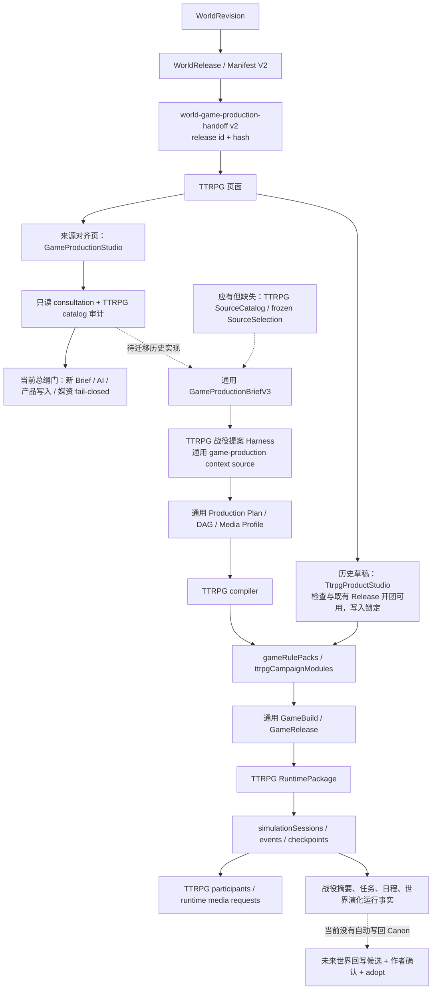

# TTRPG 与世界引擎到产品总纲对齐审计

> 审计日期：2026-08-22<br>
> 产品范围：TTRPG / 跑团，不代表其它文字游戏产品<br>
> 当前分支：`feat/ttrpg-game-platform`<br>
> 当前分支基点：`2c9ad713cb5e5201a191a3c8fcbfc641a592af1e`<br>
> 审计总纲：`origin/main@8dc6fa7b1d5fee6218a74016d6a3c15e3040846f`<br>
> 纠正后总裁决：**世界正式出口可继续作为既定基础；当前缺口在 TTRPG 自己的读取、选择和冻结方法。跑团生产层与运行层继续开发，最终世界适配和正式发布留到出口稳定后接入。**

> 施工更新（2026-08-22）：本审计第 2.2、3、5.3、6 节保留为开工基线证据，不再代表当前上层实现。
> 当前已落地 `TtrpgProductionSourceCatalogV1 / TtrpgProductionSourceSelectionV1`、严格 parser/hash/scope 校验、
> 跑团专属 Production/Brief/Step/Build/Media/ProductRelease 表与真实运行绑定。上层目前只消费显式 `development-fixture`
> 冻结来源，且开发来源被正式发布器 fail-closed；最终 `WorldReleaseManifestV2 → TTRPG Catalog` 适配器和 Release 升级 diff 仍后置，
> 没有读取活动世界工作表，也没有要求反向修改世界引擎出口。

## 1. 开发现场保护与审计方法

- 审计开始时没有 rebase、merge、stash、reset、clean 或 checkout，未覆盖当前分支的任何已提交或未提交内容。
- 审计开始时工作树包含大量本分支既有施工：83 个已跟踪文件变更，约 26,152 行新增、6,902 行删除，另有未跟踪的 TTRPG / 游戏平台文件。它们全部按作者现场保留。
- 仅执行了 `git fetch origin main`，然后通过 `git show origin/main:<path>` 阅读最新 `AGENTS.md`、`docs/WORLD-ENGINE-TO-PRODUCT-DEVELOPMENT-CHARTER.md` 与 `docs/CONTEXT-ROUTING.md`；没有为了读取总纲改写工作树。
- 审计关联闭包为：世界发布出口 → 产品交接 → 来源选择 → Brief / AI → 产品生产 → 媒资 → 产品发布 → 运行 / 演化 → 三注册表 → 测试。

## 2. 审计裁决

### 2.1 可以确认的正确基础

1. 当前世界正式出口确实是不可变 `WorldRelease + WorldReleaseManifestV2`，发布时包含整体 SHA-256、分表 rowCount / contentHash 和严格 v4 `portableProject`。
2. 世界引擎到跑团页面的交接已经固定 `productType=ttrpg + worldReleaseId + worldContentHash`，没有回退到活动工作表或 storygame。
3. TTRPG 已有相当多可复用的产品内核：RulePack、CampaignPack、完整角色卡、规则判定、骰子、行动经济、信息隔离、AI KP / AI 玩家、事件与检查点、媒资请求、多人权限和发布前验证。
4. 当前运行事实没有被发现自动改写世界引擎；运行事实仍停留在 TTRPG 会话事件、长期战役状态和演化记录中。

### 2.2 不符合总纲的关键事实

1. TTRPG 没有自己的冻结来源合同；正式类型、Brief、compiler 和 release 使用 `WorldGameSourceSelectionV2` / `GameProductionSourceSelectionV1`。
2. 当前 TTRPG 自动制作进入通用 `GameProductionBriefV3`、`GameProductionPlanV3` 和 `GameProductionMediaProfileV1`，与总纲“各产品能力未稳定前禁止统一 ProductBrief / DAG / 状态机 / 媒资 Profile”冲突。
3. TTRPG 战役提案 Harness 调用 `loadWorldGameSourceCatalog()`，并通过 `game-production.consultation-source` 读取通用文字游戏上下文，不是产品专属的冻结 SourceSelection 上下文。
4. `buildTtrpgRuntimePackageV1()` 的底层历史实现仍可在没有传入 selection 时从 Manifest 整包推导 `completeSelection`；本次已在正式新建 UI 前置 fail-closed，但 service / compiler 仍须在迁移时删除该 fallback。
5. 当前通用 source selection 包含 `avgMediaAssetExportIds`；AVG 媒资不是 TTRPG 的正式媒资来源，最多只能在未来通过明确的资产许可 / 转换契约作为外部输入，不能默认继承。
6. 现有计划和能力基线仍有“统一生产、统一媒资、六类文字游戏与 TTRPG 共用选择协议”的表述，已被 2026-08-22 总纲取代。

### 2.3 对便携身份判断的纠正

初版审计曾把“便携身份”错误地等同为“每条记录都必须拥有独立 `_exportId`”，并据此要求世界出口修改。这一结论已经撤回。

严格发布包中的数组位置并不是来源浏览器 Dexie ID。对于角色和关系等表，严格导出会把数据库引用转换为发布包内部位置；又因为产品同时冻结 WorldRelease、整体内容哈希和映射版本，所以该位置在这一不可变 Release 生命周期内是确定、可验证和可重放的。

世界发布新版本时，旧跑团继续绑定旧 Release；主动升级由 TTRPG 适配器重新匹配和要求用户确认，不要求两个 Release 的记录顺序保持一致。因此当前责任属于跑团侧：正确解析包内坐标、冻结选择、验证依赖，并在升级时显式迁移。世界出口不是继续开发上层功能的阻断项。

## 3. 当前分支的真实产品流程图



问题不在于 TTRPG 后半段完全没有能力，而在于 `B → S → 产品专属生产` 这一段没有建立；当前 `F/G/I/M` 又过早共享了其它产品的协议。

## 4. 《TTRPG 世界数据需求表》

统一版本策略：下列任何数据被产品选择后，TTRPG Production、媒资与 Product Release 都继续绑定原 `worldReleaseId + worldContentHash + selectionHash`。世界发布新版本不会自动改变旧产品。升级必须创建新 catalog、新 selection、新 Brief / Production / Product Release，并生成差异、兼容和存档迁移报告；旧 Release 与旧存档仍可运行。

| 产品能力 / 消费功能 | 所需世界语义 | Manifest V2 区段、表与字段 | 级别 | 选择粒度 | 缺失策略 | 使用阶段 |
|---|---|---|---|---|---|---|
| 来源身份与长期绑定 | 世界根、作品根、发布身份 | 根字段 `worldCode/worldName/workTitle`；`portableProject.version`；`portableProject.ownership.{contractVersion,worldExportId,workExportId}`；`worlds[]._exportId/code`；`works[]._exportId/_worldExportId`；Release `id/contentHash/sourceWorldCode` | required | 精确一个 World 根 + 一个 Work 根 + 整个 Release hash | 阻止 catalog、Brief、AI、写表和媒资 | Brief、生产、验证、发布、运行、升级 |
| 世界基调与可生成边界 | 起源、社会、文化、经济、冲突、总体规则 | foundation / `worldviews`: `summary,worldOrigin,worldStructure,worldDimensions,continentLayout,historyLine,races,factionLayout,politicsOverview,economyOverview,cultureOverview,internalConflicts,rules,powerHierarchy,itemDesign` | required-anchor：与其它锚点至少一项 | 单记录 / 记录集合 / 整表 | 若其它锚点存在，可让产品在作者指令内生成；若无任何世界锚点则阻止生产 | Brief、生产、媒资提示、验证 |
| 世界规则与 Canon 禁区 | 真实 / 幻想规则、绝对限制、全局备注 | foundation / `worldRulesProfiles`: `entries,customNodes,globalNote` | conditional-required：使用世界规则时 | 单记录或整表 | 提示用户补世界规则，或明确选择“产品自有规则、不改世界 Canon”；不得静默猜测 Canon | Brief、规则编译、验证、KP 运行 |
| 力量 / 等级 / 职业映射 | 能力层级、成长路径、世界内特殊法则 | foundation / `powerSystems`: `name,description,levels,rules`；`cultivationSystems`: `name,description,stages` | optional；世界角色使用该体系时 conditional-required | 记录集合 + 被角色 / 词条引用的依赖闭包 | 可生成 TTRPG 产品内 RulePack 映射；必须保存映射依据并由作者确认，不能反写世界体系 | Brief、规则生产、角色卡、验证、运行 |
| 多世界与区域边界 | 世界组、跨界规则、入口 / 离开、传送关系 | foundation / `worldGroups`: `name,description,type,entryCondition,exitCondition,powerRestriction,takeawayRules`；`worldGroupLinks`: `_fromGroupExportId,_toGroupExportId,linkType,name,description,bidirectional` | optional；跨世界战役 conditional-required | 记录集合 / 图子图 / 依赖闭包 | 普通单世界明确降级；跨世界需求则阻止并提示补设定 | Brief、生产、地图 / 媒资、验证、运行 |
| 空间结构与地图语义 | 位面树、区域、门户、地图配置 | foundation / `worldNodes`: `_exportId,_parentExportId,name,description,mapConfigJSON,mapCacheJSON,portalsJSON`；`geographies`: `overview,locations,worldMapData` | optional；沙盒 / 跨区域玩法 conditional-required | 树子图 / 记录集合 / 依赖闭包 | 线性或室内短团可产品生成；沙盒 / 开放探索提示补设定或降低地图能力 | Brief、生产、地图媒资、运行 |
| 战役地点与场景锚点 | 城市、建筑、遗迹、父子地点、重要性 | foundation / `importantLocations`: `_exportId,_parentExportId,name,tags,description,significance,sortOrder` | optional；选择世界地点作为开场时 conditional-required | 单记录 / 树子图 / 依赖闭包 | 允许基于其它世界锚点生成产品专属地点；若用户指定世界地点而缺失则阻止 | Brief、场景生产、地图 / 场景图、验证、运行 |
| 历史、时代与旧事件 | 纪年、时代规则、历史事件、影响、史实 / 架空边界 | foundation / `histories`: `overview,eraSystem,events`；`historicalTimelineEvents`: `era,year,date,title,description,impact,isHistorical,source,location`；`historicalKeywords`: 关键词、分类、说明字段 | optional；历史调查团 conditional-required | 单记录 / 记录集合 / 时代切片 | 可产品生成未定细节，但必须标记产品 Canon；用户指定真实事件而缺失则提示补设定 | Brief、生产、Handout、验证、运行 |
| 势力、种族、道具、怪物与 Lore | faction / race / artifact / beast / 自定义词条 | foundation / `codexCategories`: `_exportId,_parentExportId,builtInKey,fieldSchema`；`codexEntries`: `_categoryExportId,name,summary,description,fields,refs,tags,importance` 及修炼 / 地点便携引用 | optional；选择具体实体时 conditional-required | 分类树子图 + 记录集合 + 引用依赖闭包 | 可生成产品专属 NPC / 道具 / 怪物，不得冒充世界已有词条；若用户指定世界实体则阻止 | Brief、规则 / 道具生产、媒资、验证、运行 |
| 世界角色模板 | 外貌、人格、背景、动机、能力、身份、年龄 / 性别 / 种族、优缺点、恐惧、目标、等级、语气、归属 | characters / `characters`: 便携身份、`name,roleWeight,appearance,personality,background,motivation,abilities,identity,profile,values,strengths,weaknesses,fears,goals,powerLevel,speechStyle,location` 及 race / cultivation 引用 | optional；seat=`world-template` 时 required | 单记录 / 记录集合 + 种族 / 体系依赖闭包 | 用户可改选 AI-generated / quick-card；坚持世界模板则阻止并提示补出口 / 设定 | Brief、角色卡生产、立绘、验证、运行 |
| 作品内角色作用 | 当前 Work 中的角色定位、弧光和结局 | characters / `workCharacterBindings`: `_workExportId,_characterExportId,role,arc,outcome` | optional；复用作品角色弧时 conditional-required | 当前 Work 的单记录 / 记录集合 | 缺失时只把角色作为世界模板，不继承小说剧情命运 | Brief、角色 / 剧情生产、验证 |
| 角色关系与信息隔离种子 | 亲属、盟友、敌对、秘密关系 | characters / `characterRelations`: 记录便携身份、`_fromCharacterExportId/_toCharacterExportId`（目标协议；当前只有 index）、`relationType,label,description,isBidirectional` | optional；复用世界关系时 conditional-required | 关系边集合 + 两端角色依赖闭包 | 可在产品内生成新关系并标记 product-only；指定世界关系缺失则提示用户 | Brief、角色卡、秘密、KP 上下文、验证、运行 |
| 核心主题与冲突 | 主题、中央冲突、logline、主 / 支线概念 | narrative / `storyCores`: `theme,centralConflict,plotPattern,logline,concept,mainPlot,subPlots` | optional；改编已有作品核心时 conditional-required | 单记录 / 整表 | 可创建原创战役核心；不得把生成结果写回世界 StoryCore | Brief、战役提案、生产、验证 |
| 故事线和阶段 | 主线 / 支线、阶段、关键事件、转折 | narrative / `storyArcs`: `_exportId,name,type,stages,description` | optional | 单记录 / 记录集合 / 叙事模块依赖闭包 | 可产品生成 Quest / Front；引用世界故事线时必须保留 source ref | Brief、生产、验证、运行、演化 |
| 可执行叙事蓝图 | 入口、节点、节拍、选择、条件、效果、后继关系 | narrative / `selectedNarrativeModules[]`；`narrativeModules`；`narrativeNodes.key/kind/title/summary/successorKeysJson`；`narrativeBeats`；`narrativeChoices` | optional；改编已有蓝图时 conditional-required | 叙事模块 / 从入口闭合的 node-key 子图 | 可创建原创 Campaign 图；选择子图时 successor、choice、speaker 引用不闭合则阻止 | Brief、剧情生产、验证 |
| 小说大纲和场景素材 | 卷 / 章树、摘要、场景、冲突、地点、出场角色、悬念 | outline / `outlineNodes`: `_exportId,_parentExportId,type,title,summary,order`；`detailedOutlines`: 记录便携身份、`_outlineExportId,scenes,openingHook,endingCliffhanger,sceneLocation,_appearingCharacterExportIds` | optional；小说改编团 conditional-required | 大纲树子图 / 细纲记录集合 + 角色依赖闭包 | 原创团可不用；改编指定章节而缺失时提示补 Release 内容 | Brief、生产、Handout / 场景媒资、验证 |
| 已有视觉媒资 | AVG 背景、立绘、音频、presentation cue | narrative / `avgMediaAssets,avgMediaBlobs,avgPresentationModules` | excluded | 不允许进入 TTRPG SourceSelection | TTRPG 通过自己的 Media Brief / Manifest 生成；未来若要复用，必须另建有许可和规格转换的 TTRPG 输入契约 | 不使用 |
| 其它产品成品 / 适配器 | storygame、AVG、冒险、开放世界、互动角色等产品数据 | narrative / `gameDefinitions,adventureModules,interactionCharacterProfiles,interactionSceneTemplates,narrativeSimulationModules,openWorldModules` | excluded | 不允许 | 不回退、不借表；TTRPG 自己生产相应能力 | 不使用 |
| 正文、作者草稿和活动工作表 | 章节正文、当前正在修改的世界 / 作品行 | 不属于 TTRPG 正式来源；即使本地表存在也不能绕过 Manifest | excluded | 不允许 | 提示作者重新创建 WorldRevision / WorldRelease，把需要的数据正式发布 | 不使用 |
| 其它产品 / 旧运行事实 | 其它游戏的 Build、Release、存档、事件、媒资请求 | 不属于 WorldRelease 正式世界语义 | excluded | 不允许 | 不跨产品读取；TTRPG 运行事实只进入本产品演化候选 | 不使用 |

### 4.1 完成生产的最低来源门

一个 TTRPG 产品开始正式生产前至少满足：

1. Release / World / Work / hash 身份全部通过；
2. 至少选择一个世界语义锚点：世界观、规则、地点、角色、词条、历史、StoryCore、StoryArc、叙事子图或大纲子图；
3. 所有被选记录拥有真实便携身份；
4. 父节点、关系端点、分类、角色种族 / 体系、叙事 successor / choice / speaker 等引用闭合；
5. Brief 中每个 `world-template` 席位都能追溯到被选角色；
6. 用户指定的世界地点、角色、故事线或规则不能用产品生成项偷偷代替；
7. selectionHash 冻结后，任何变更都创建新 selection revision，不原位改写。

## 5. TTRPG SourceCatalog / SourceSelection 设计

本分支已增加第一版严格合同骨架：

- `TtrpgWorldSourceCatalogV1`
- `TtrpgWorldSourceSelectionV1`
- `loadTtrpgWorldSourceCatalogV1()`
- `parseTtrpgWorldSourceSelectionV1()`
- `freezeTtrpgWorldSourceSelectionV1()`
- `validateTtrpgWorldSourceSelectionV1()`

### 5.1 Catalog

Catalog 只读取并复验一个不可变 WorldRelease：

- Release 必须属于当前 WorkspaceScope 的 World；
- Release 整体 contentHash 必须正确；
- Manifest 必须是 V2；
- 每个 selected table 的 rowCount / contentHash 必须与 records 一致；
- `portableProject` 必须是 v4；
- ownership 必须精确给出世界 / 作品 export ID；
- portable World code、Work → World 引用和 Release sourceWorldCode 必须一致；
- 不读当前 `characters`、`worldviews` 等活动表补齐内容。

Catalog 对每张 TTRPG 允许表给出发布包内可寻址记录、显示摘要、父节点和依赖引用。有 `_exportId` 时使用它；严格导出以数组位置表达引用的表使用 Release 内位置。两者都必须与 Release id、整体内容哈希和映射版本共同冻结。AVG / 其它产品表进入 `excludedReleaseTables`。

### 5.2 Selection

根合同字段为：

```text
schema / version / productType / contractVersion
worldReleaseId / sourceWorldCode / worldContentHash
sourceWorldExportId / sourceWorkExportId / sourceMappingVersion
recordSelections[] / narrativeSubgraphs[] / selectionHash
```

记录选择支持 `whole-table / record-set / tree-subgraph / dependency-closure`；叙事选择使用 `moduleExportId + stable nodeKeys`。严格 parser 拒绝未知字段、重复表、重复 ID、非法 granularity、非法 key、空锚点和损坏 hash。

验证器检查：

- selectionHash；
- Release / World / Work / mapping 身份；
- 选择 ID 是否属于冻结包；
- whole-table 是否真覆盖整表；
- 树父节点、关系端点、分类、角色 / 体系等便携依赖；
- 叙事入口、successor、choice target、speaker 和 outline 依赖；
- 验证前后两次 Release 完整性。

### 5.3 尚未允许落地的部分

当前合同仍只是最终世界适配器的候选实现，不作为上层施工阻塞。跑团 Brief、规则、角色卡、战役、媒资和试玩 Build 可以继续开发；新正式世界绑定 Release 暂不发布。生产层先消费明确标记的冻结测试输入，最终再由唯一适配器把 WorldRelease 转换为同一跑团输入。

## 6. 当前实现与总纲的差距

| 编号 | 严重度 | 当前事实 | 正确状态 | 当前裁决 |
|---|---|---|---|---|
| G-01 | corrected | 初版审计把缺少 `_exportId` 误判为出口阻断 | Release 内位置与哈希共同构成可验证包内坐标 | 世界出口无需因此修改；责任回到 TTRPG 适配器 |
| G-02 | high | TTRPG 使用 `WorldGameSourceSelectionV2` | 独立 TTRPG Catalog / frozen Selection | 最终适配后置；上层先使用跑团冻结测试输入 |
| G-03 | blocker | 底层 service / compiler 没有 selection 仍可生成提案、写 Brief、Build、媒资 | selection 验证和冻结是所有正式副作用的前置门 | 新建与历史草稿 UI 已 fail-closed；底层历史 fallback 待迁移删除 |
| G-04 | high | TTRPG 嵌在 `GameProductionBriefV3` | 产品专属 TTRPG Brief / Run Contract | 复用其中成熟字段语义，重新收口为 TTRPG 合同，不复制其它产品 |
| G-05 | high | TTRPG 进入通用 production DAG / 状态机 | TTRPG 自己的生产步骤、状态、恢复和确认点 | 后续迁移；共享 durable Harness、CAS、hash 等底层原语 |
| G-06 | high | 通用 MediaProfile 且 selection 含 AVG assets | TTRPG Visual Bible / Media Brief / Manifest / jobs | 保留已有 TTRPG 媒资类型和运行请求，重建生产编排 |
| G-07 | high | RuntimePackage / GameRelease 保存通用 source selection | TTRPG Product Release 保存自己的 selectionHash 与产品清单 | 需产品 Release 设计，不原位伪装 |
| G-08 | high | 提案 AI 读 `game-production.consultation-source` | `ttrpg.world-source-selection` 注册源，只读冻结 selection 闭包 | 待 selection 持久化后登记 |
| G-09 | medium | 旧自动 / 手工生产入口可越过 product selection | UI 先选择世界源，再冻结，之后才能进入 Brief | 已改为“来源对齐 / 历史草稿”；新正式副作用锁定，既有 Release 可开团 |
| G-10 | medium | 新 WorldRelease 的显式升级没有 TTRPG selection diff | 创建新 selection / production / release，生成兼容报告 | 待实现 |
| G-11 | medium | 有运行期 world-evolution 事实，但没有正式回流候选闭环 | 候选 + 证据 + 作者确认 + adopt + 新 WorldRevision / Release | 不自动回写；后续补候选层 |
| G-12 | medium | 能力基线 / 施工计划仍宣称统一生产和已贯通 | 文档反映总纲后的真实边界 | 下一批先修文档状态，不改历史证据 |

## 7. 现有入口处置

### 7.1 保留

- `WorldRelease / WorldReleaseManifestV2` 身份、hash、scope 与篡改验证。
- 世界引擎到 TTRPG 的 release ID / hash 交接；后续扩展为“打开 TTRPG 来源选择”，不直接开始生产。
- TTRPG RulePack、规则 DSL、骰子（最大 d100）、判定、行动经济、车卡、CampaignPack 解析和确定性验证。
- TTRPG KP / 玩家视图、信息隔离、事件、reducer、checkpoint、多人身份与权限。
- TTRPG Visual Bible、Media Manifest、runtime media request 的领域语义；存储 Blob、hash、Harness、审计可作为稳定底层能力继续复用。
- 已发布旧 TTRPG Release 与既有存档的读取 / 回放兼容，不能因迁移删除。

### 7.2 调整

- “用此世界制作跑团”本次先进入 TTRPG catalog 对齐门；出口问题解决后扩展为完整 Source Catalog / Selection 页面。
- `TtrpgProductionWizard` 的角色 / 地点 / 故事线选择改读 TTRPG catalog，而非通用 source options。
- Campaign proposal Harness 必须显式接收 frozen selection，只能读取 `ttrpg.world-source-selection`。
- `TtrpgProductionBriefV2` 从通用 Brief 的可选子对象升级为产品根 Brief；保留现有规则、席位、故事、信息、安全、媒资和确认字段。
- production compiler、quality gates、release 和 evolution 改为 TTRPG 专属流程；只复用底层哈希、Harness、Blob 和审计原语。
- 文档中的“统一生产 / 统一媒资 / 已完整贯通”改为历史实现说明和迁移状态。

### 7.3 下线或仅兼容读取

- TTRPG 对 `WorldGameSourceSelectionV2`、`loadWorldGameSourceCatalog()`、`GameProductionSourceSelectionV1` 的新写入。
- TTRPG 对通用 `GameProductionBriefV3 / GameProductionPlanV3 / GameProductionMediaProfileV1` 的新生产。
- 没有 selection 时自动选择 Manifest 全部角色 / 地点 / 故事线 / AVG 媒资的 `completeSelection` fallback。
- AVG 媒资作为 TTRPG 正式来源的入口。
- 固定 fixture 战役继续只用于测试 / 演示，不能进入正式发布。

## 8. 后续 TTRPG 独立生产与媒资流程

以下顺序按“上层先完成、最终适配后接入”执行。

### Phase 0 · 上层输入边界与测试来源

1. 定义 TTRPG 自己需要的冻结输入，不让上层模块直接理解世界数据库或活动工作表。
2. 准备 Rank Lite、d20、d100 和缺失资料降级等多套测试来源，明确标记为开发输入。
3. 生产、媒资和运行只消费这一边界；测试来源不能冒充正式世界绑定 Release。

退出门：更换测试来源不会要求改写规则、KP、账本或运行模块；正式发布仍保持关闭。

### Phase 1 · TTRPG SourceSelection 正式化

1. 新增 `ttrpgWorldSourceSelections`：产品 / World / Work owner、release id、selection JSON、selection hash、状态、createdAt；冻结后不可原位改写。
2. 将 catalog / parser / scope / hash / dependency verifier 接入表服务。
3. Source picker 展示 required / optional / excluded、缺失策略、依赖补选和预计上下文 / 媒资影响。
4. 世界升级只创建新 selection，并显示记录增加、删除、内容 hash 变化和依赖变化。

退出门：没有 `validated + frozen` selection 时，所有 TTRPG 正式 AI、产品写表和媒资调用均 fail-closed。

### Phase 2 · TTRPG Brief 与 Run Contract

1. 建立根协议 `TtrpgProductionBriefV3`，不再嵌在通用 Brief。
2. 冻结用户指令、战役类型 / 规模、KP 模式、人数、seat / controller、车卡模式、规则来源、村规、信息安全、安全工具、故事结构、奖励惩罚、物品 / 技能次数、媒资目标、预算和完成标准。
3. 建立 `TtrpgProductionRunContractV1`：权限只能读 frozen selection 和已确认 Brief，写入只生成候选 / artifact，不直接写世界。
4. 每个关键作者确认点有 durable checkpoint：来源选择、规则映射、席位 / 车卡、战役提案、媒资 Bible、Build Preview、Release。

### Phase 3 · TTRPG 产品生产状态机

建议产品步骤，不作为其它产品公共 DAG：


每步保存输入 hash、输出 hash、attempt、状态、阻断原因、预算、Run / receipt 和人工决定。重试只重跑失败 / stale 步骤；输入变更使下游显式 stale，禁止隐藏重试。

### Phase 4 · TTRPG 专属媒资

1. `TtrpgVisualBibleV2`：风格、角色一致性、地点语言、道具材质、色彩、镜头、安全边界和禁止项。
2. 生产媒资类型：场景 key art、地图、角色 portrait、表情、token、道具 / 线索图标、Handout；音频是否进入本期由 Brief 明确，不沿用 AVG profile。
3. 先固定角色 / 地点 identity 与 style anchors，再生成角色主立绘和场景基准，随后生成表情、token、物品与 Handout。
4. 每个资产保存 promptHash、sourceRefs、provider/model、license、contentHash、尺寸、透明通道、版本、审核状态和替代文本。
5. prebuild 资产进入 Product Release；background-during-play 资产进入 TTRPG runtime request，由 KP 可见性和 audience 控制；失败必须文本降级，不阻塞规则结算。

### Phase 5 · TTRPG Product Release、运行与演化

1. Product Release 冻结：selectionHash、Brief hash、RulePack、CampaignPack、完整角色卡、信息分区、媒体清单、运行协议、兼容版本、质量回执和所有 artifact hash。
2. 运行实例只读 Product Release，不回读世界活动表；玩家进度、骰子、判定、奖励惩罚、物品、技能次数、秘密和动态媒资属于实例。
3. 世界发布升级生成新 Product Release；旧实例默认继续绑定旧版本。只有作者 / KP 显式选择并通过兼容报告后才能升级。
4. TTRPG 运行事实若要回流，形成 `TtrpgWorldEvolutionCandidateV1`，包含来源事件、玩家 / KP 决定、证据、影响分析和建议目标字段；作者确认后进入 FIELD_REGISTRY / AdoptionSchema / adopt，再创建新 WorldRevision / Release。

## 9. 三注册表与数据生命周期影响

### 9.1 AI 读什么

计划新增 CONTEXT_SOURCES：

- `ttrpg.world-source-selection`：唯一世界输入，按 selection 精确读取 frozen Manifest records；
- `ttrpg.production-brief`：作者确认的产品 Brief；
- `ttrpg.production-artifacts`：当前步骤已确认的产品候选 / artifact；
- 现有 `ttrpg.product-authoring`、`ttrpg.character-authoring`、`ttrpgRuntime`、`ttrpgPlayerRuntime` 按产品阶段保留并复审。

所有正式 AI 通过 `assembleContext()`；`AssembleContextInput` 只携带 selection row ID / run ID，不携带组件拼接的世界正文。通用 `game-production.consultation-source` 不再授权 TTRPG。

### 9.2 AI 写什么

- SourceSelection 是作者选择和确定性冻结，不是 AI 写字段。
- AI 只生成 CreativeArtifact / durable candidate：规则映射、角色卡、战役提案 / 图、线索 / Front / 秘密 / 结局、Visual Bible、媒资 prompt、运行演化候选。
- 进入正式 `gameRulePacks`、`ttrpgCampaignModules`、TTRPG Product Release 或世界回写前，字段必须进入 FIELD_REGISTRY / AdoptionSchema；作者确认后通过 `adopt()`。
- 媒资二进制可由受治理 media adapter 写 Blob，但产品清单 / 语义引用仍需注册表和完整性门。

### 9.3 涉及哪些表

预计新增或独立化：

- `ttrpgWorldSourceSelections`
- `ttrpgProductions`
- `ttrpgProductionBriefs`
- `ttrpgProductionSteps`
- `ttrpgProductionArtifacts` 或 TTRPG 专属 artifact 索引
- `ttrpgMediaManifests / ttrpgMediaJobs`
- `ttrpgProductReleases`
- `ttrpgWorldEvolutionCandidates`

预计保留并复审：`gameRulePacks`、`ttrpgCampaignModules`、`simulationSessions/events/checkpoints`、`ttrpgSessionParticipants`、`ttrpgRuntimeAssetRequests`、底层 `mediaBlobObjects`、Agent Runs / Events / Checkpoints。

每张新增表必须先登记 `PROJECT_TABLES`，再实现 schema 版本、迁移、导出 / 导入、删除、World / Work / instance scope、所有引用重映射和反例测试。不得先在组件或 service 散写。

### 9.4 当前这批代码的注册表影响

本审计只增加只读类型、只读 catalog / selection verifier 和回归测试；没有新增表、AI 入口或 AI 可写字段，因此本批不修改三注册表。正式接入必须按上述顺序补全，不能把当前只读服务误称为已经完成生产闭环。

## 10. 验证方案

### 10.1 定向与反例测试

Source contract：

- 正确 Release / World / Work / mapping / selection hash；
- 整体 Manifest 和每个依赖表 hash 篡改；
- 跨 project / world / work；
- 未知字段、重复表、重复 ID、损坏 key、空锚点；
- Dexie ID 冒充 portable ID；
- 缺 `_exportId` 时明确不可选，禁止数组位置 fallback；
- parent、关系端点、分类、体系、地点、outline、speaker、successor、choice 引用缺失；
- whole-table 不完整；
- Release 后活动工作表变化不影响 catalog；
- 新 WorldRelease 不自动改变旧 selection；升级产生 diff 而非覆盖。

生命周期：

- 新表严格 v4 JSON 往返，所有 FK / portable refs 重映射；
- 删除 Product / Work / World / Project 的级联或阻断；
- 导入缺表、旧版本、损坏 selection、损坏媒资时整事务回滚；
- 旧 TTRPG Release / 存档继续绑定旧包并可回放。

AI / Harness：

- 没有 frozen selection 不创建 Agent Run；
- declared source keys 只含 TTRPG 源；
- prompt injection 只被当内容；
- 模型输出引用不在闭集时拒绝；
- stale selection / Brief 暂停并请求作者，不隐藏重试；
- AI 候选不能直接改世界或正式产品表。

媒资 / 运行：

- style / character / scene source refs 完整；
- license、hash、尺寸、格式、透明通道、alt、版本门；
- 后台生成失败 / 重试 / 取消 / 恢复 / 预算上限；
- public / party / private / gm-only 隔离；
- 文本降级不改变骰子与规则结果；
- 运行事实只形成候选，不自动回写世界。

### 10.2 完整工程验证

按风险顺序执行：

1. 新增 TTRPG source / lifecycle / Harness 定向测试；
2. `npm run check:architecture`；
3. `npm run check:required-tables`；
4. `npm run check:ai-manual`；
5. `npm run check:ai-entry-registry`；
6. `npx tsc --noEmit`；
7. TTRPG、WorldRelease、导出 / 导入、GameRelease / runtime 相关回归；
8. `npm run build`；
9. `npm run ci`；
10. `PLAYWRIGHT_FROZEN_WORKSPACE=1 npm run ci:e2e`。

若 `npm audit` 因已知上游公告失败，单独报告，其余门继续运行，不能写成 CI 全绿。

### 10.3 真实用户路径

在独立浏览器数据中，不修改作者当前预览项目，至少验证：

1. 创建世界 → 冻结 revision → 发布 release；
2. 从跑团入口查看 required / optional / excluded 和不可选择原因；
3. 选择角色、关系、地点、规则、故事线 / 叙事子图并自动补依赖；
4. 冻结 selection 后刷新 / 重启仍保持 hash 和作者选择；
5. 完成 TTRPG Brief、规则映射、人数与真人 / AI 席位、车卡、村规、战役提案和媒资计划；
6. Build 中断、恢复、重试与作者确认；
7. 发布后由 AI KP、真人 KP、真人 + AI、真人 + 真人 + AI 各完成一场关键行动判定；
8. 奖惩、物品、技能次数、秘密、场景媒资、检查点和回放正确；
9. 发布新 WorldRelease 后旧团不漂移，显式升级可预览差异并可拒绝；
10. 运行结果只出现在候选审查页，作者不确认时世界 Canon 零变化。

## 11. 本次落实与停止边界

已落实：

- 保护现场并读取最新主干总纲；
- 建立完整数据需求、流程、差距、入口处置、实施与验证方案；
- 增加 TTRPG 专属 Catalog / Selection 类型和严格 parser / freeze / scope / hash / portable-ref verifier；
- 已纠正“缺少 `_exportId` 即要求修改世界出口”的错误判断，Release 内位置按冻结包坐标解析；
- 跑团 Brief、规则、角色、AI 候选、战役、媒资和试玩 Build 已恢复为上层开发范围；
- 新正式世界绑定 Release 仍保持关闭，避免把过渡适配冒充最终对接；
- 回归测试覆盖不可变 Release、selectionHash、字段注入、Dexie ID、父树依赖和 Release 内位置引用。

尚未落实且明确停止：

- 不要求世界引擎因 TTRPG 适配器缺口修改正式出口；
- 不把过渡测试来源冒充正式世界绑定；
- 不把现有通用生产入口改名伪装成稳定的跨产品公共协议；
- 不建立跨产品公共 Brief / DAG / 媒资层；
- 不让运行事实自动写回世界。

下一步继续完成 TTRPG 自己的生产层和运行层。世界出口稳定后，只在最前端增加唯一转换器和显式升级流程，不重做已经完成的规则、角色、KP、媒资和运行能力。
